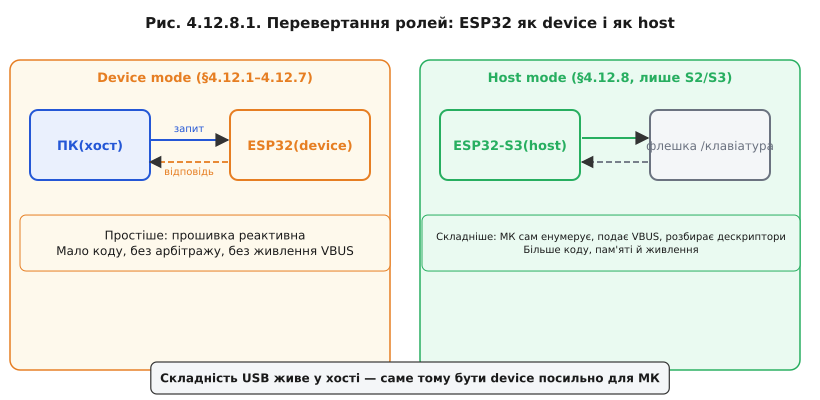
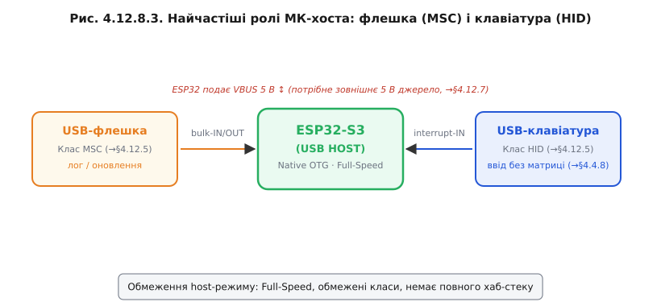

# МК як USB-host: читаємо флешки й клавіатури

Перевернемо ролі. Зазвичай ESP32 виступає **пристроєм**: підключається до ПК, відповідає на запити хоста, отримує живлення з VBUS. Але той самий апаратний блок USB-OTG у S2/S3 може перейти в зворотну роль — стати **хостом**: самому подавати живлення, самому виявляти підключені пристрої й опитувати їхні кінцеві точки.

### Що означає бути хостом

Усю роботу, яку в парі з пристроєм бере на себе ПК, доводиться робити самому ESP32: подавати VBUS 5 В на порт, чекати підтяжки D+ або D− від підключеного пристрою, виконувати повну [процедуру енумерації](book:programming/usb-enumeration), призначати адресу, читати дескриптори, відкривати [кінцеві точки](book:programming/usb-endpoints), надсилати SOF-кадри кожну мілісекунду й опитувати їх за розкладом. Це набагато більше коду й більше пам'яті, ніж реалізація device-стека. Тут на практиці відчувається, чому [складність USB живе саме у хості](book:programming/usb-overview): host-стек у кілька разів більший за device-стек.



*Рис. Зліва: ПК — хост, ESP32 — device (просто). Справа: ESP32 — хост, флешка/клавіатура — device (складніше).*

### OTG: один роз'єм — дві ролі

**USB OTG** (On-The-Go) — розширення стандарту, що дозволяє одному й тому самому роз'єму і пристрою бути то device, то host. Роль визначається п'ятим контактом **ID** у Micro-USB (або сигналами CC у Type-C): якщо ID заземлений (або це OTG-кабель із спеціальним адаптером), чип переходить у host-режим і подає VBUS; якщо ID плаваючий — залишається device.


*Рис. ID плаваючий → device; ID заземлений (OTG-кабель) → host, ESP32 подає VBUS. Деталі — 🔌 r12-s8-c-otg.md.*

> 🔌 **OTG-кабель і host-модулі** — [`r12-s8-c-otg.md`]: які кабелі й адаптери потрібні для host-режиму; схема підключення зовнішнього ключа VBUS; готові host-модулі.

### Що в сімействі ESP32 реально вміє host

Відверто: **лише ESP32-S2 і ESP32-S3** мають нативний USB-OTG і підтримують host-режим. Класичний ESP32 (без суфікса) взагалі не має USB-контролера — лише UART-міст зовні. ESP32-C3 і C6 мають USB-Serial-JTAG, але цей блок підтримує лише фіксовану роль device (CDC+JTAG), і host-режим у ньому недоступний. Якщо проєкт потребує читання USB-периферії з МК — вибір чипа відразу звужується до S2 або S3.

### Найчастіші ролі хоста на МК

Два найпоширеніші сценарії host-режиму для вбудованих систем:

**Читати USB-флешку (MSC)**: оновлення прошивки або конфігурації з флешки без програматора; збір логів на знімний носій. ESP32-S3 у host-режимі монтує [файлову систему](book:programming/flash-filesystems) FAT на флешці і читає/пише файли так само, як з SD-картки.

**Приймати USB-клавіатуру (HID)**: введення даних або команд без власної [матриці кнопок](book:programming/module-model). Промисловий або медичний прилад із підключеною стандартною USB-клавіатурою — типовий випадок.



*Рис. ESP32-S3 у центрі; ліворуч — флешка (MSC, лог/оновлення), праворуч — клавіатура (HID, ввід без матриці). Потрібне VBUS 5 В від зовнішнього джерела.*

### Живлення тепер на тобі

У device-режимі хост живить пристрій: VBUS надходить від ПК. У host-режимі все навпаки: ESP32 мусить сам подавати VBUS 5 В на порт. Але ESP32 живиться від 3,3 В — тому для host-режиму потрібне зовнішнє [джерело 5 В і електронний ключ](book:programming/usb-power) (наприклад, P-канальний MOSFET або спеціальний USB-switch IC), яким ESP32 вмикає й вимикає VBUS на порт. Без цього підключена флешка просто не отримає живлення. Це одна з причин, чому «голий» DevKit без зовнішніх доповнень не потягне host-режим для периферії, що живиться від шини.

**Worked-приклад: host опитує клавіатуру**

Ілюстративний кістяк на базі ESP-IDF USB Host Library:

```c
#include "usb/usb_host.h"
#include "usb/hid_host.h"

/* Callback при підключенні нового пристрою */
static void device_connected_cb(usb_device_handle_t dev_hdl,
                                 const usb_config_desc_t *config_desc)
{
    /* host-стек уже провів енумерацію: адреса призначена,
       дескриптори прочитано, конфігурацію встановлено */
    hid_host_device_handle_t hid_dev;
    hid_host_install_device(dev_hdl, &hid_dev);
}

/* Callback при отриманні HID-звіту (interrupt-IN) */
static void hid_report_cb(hid_host_device_handle_t hid_dev,
                            const hid_report_t *report)
{
    if (report->usage == HID_USAGE_KEYBOARD) {
        uint8_t keycode = report->keyboard.keycode[0];
        if (keycode != 0) {
            /* keycode — код клавіші зі стандарту HID Usage Tables */
            printf("Key pressed: 0x%02X\n", keycode);
        }
    }
}

void app_main(void)
{
    /* Ініціалізація USB Host */
    usb_host_config_t host_config = { .intr_flags = ESP_INTR_FLAG_LEVEL1 };
    usb_host_install(&host_config);

    /* Встановити HID-клас-драйвер */
    hid_host_config_t hid_config = {
        .create_background_task = true,
        .task_priority = 5,
        .stack_size    = 4096,
        .callback      = hid_report_cb,
    };
    hid_host_install(&hid_config);

    /* Головний цикл: обробка подій USB Host Library */
    while (1) {
        uint32_t event_flags;
        usb_host_lib_handle_events(portMAX_DELAY, &event_flags);
        if (event_flags & USB_HOST_LIB_EVENT_FLAGS_NO_CLIENTS) {
            usb_host_device_free_all();
        }
    }
}
```

> 🔧 **Навіщо це**: host-режим відкриває широкі можливості (флешки, клавіатури, сканери штрих-кодів, аудіопристрої), але вимагає значно більше пам'яті й коду порівняно з device-режимом, а також потребує зовнішнього 5 В для VBUS. Для більшості проєктів на ESP32 оптимальна роль — device. Host-режим обирають свідомо, коли він справді потрібен і є S2/S3.
