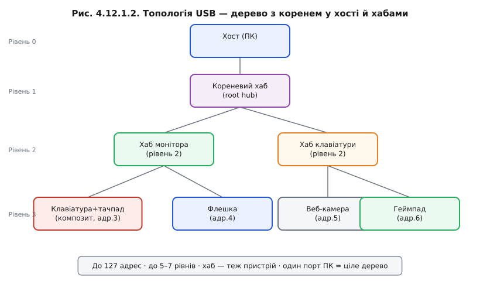
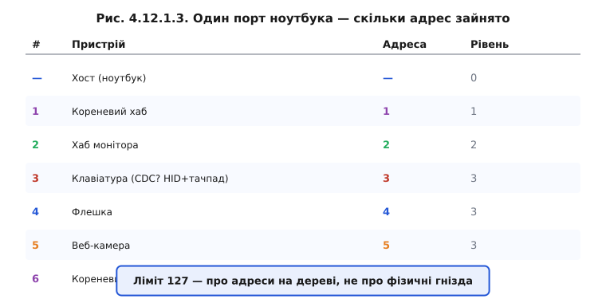

# USB з висоти: хост і пристрій, дерево з хабами

Коли вивчаєш новий протокол зв'язку, спокуса одразу зануритись у байти й часові діаграми велика. Але з USB її краще стримати — бо архітектура шини надзвичайно послідовна, і кожна деталь (від структури дескрипторів до типів передач) прямо випливає з одного фундаментального рішення, прийнятого ще на етапі проєктування: рівних на USB-шині немає. Це відрізняє USB від [I²C](book:communications/i2c-bus) і [SPI](book:communications/spi-bus), де кілька учасників можуть ініціювати обмін, — у них є арбітраж шини й поняття ведучого та веденого в певних ролях. У USB ролі асиметричні й незмінні.

### Один головний — і це навмисно

**Хост** (host) ініціює абсолютно всі транзакції на шині. **Пристрій** (device) лише відповідає — і ніколи не говорить першим, не «стукає» в хост, не оголошує про свою готовність самостійно. Це здається суворим обмеженням, але насправді воно спрощує систему радикально. Оскільки ніхто не може «заговорити» без дозволу хоста, колізій на шині не буває. Пристрій не мусить постійно «слухати ефір» в очікуванні чужих передач — він просто мовчить, поки до нього не звернуться.


*Рис. Хост ініціює всі запити (суцільні стрілки), пристрій відповідає лише у відповідь (пунктир). Контраст із I²C/SPI — там рівноправні учасники.*

> 🔧 **Навіщо це**: для розробника на ESP32 асиметрія ролей означає конкретну річ — **прошивка-пристрій реактивна**. Вона відповідає на запити хоста, а не ініціює їх. Це радикально менше коду й менша складність порівняно з реалізацією хоста: коли МК сам [береться бути хостом](book:programming/usb-host), складність зростає на порядок.

### Дерево, а не шина

Топологія USB — це дерево. Корінь дерева — хост (наприклад, контролер у ноутбуці). Від нього ростуть гілки через **хаби** (hub). Кожен хаб сам є USB-пристроєм хаб-класу і розгалужує одне USB-з'єднання у кілька портів. Листя дерева — кінцеві пристрої: миша, флешка, вебкамера.



*Рис. Один фізичний порт ПК = ціле дерево. До 127 адрес, до 5–7 рівнів углиб. Хаб сам — пристрій із власною USB-адресою.*

Важлива деталь: пристрої-листя не «бачать» одне одного. Весь трафік іде через хост. Пристрій А не може надіслати пакет пристрою Б безпосередньо — лише через хост, і тільки якщо хост це організував. Дерево обмежено 127 унікальними адресами і приблизно 5–7 рівнями вглибину. Не плутайте адреси з фізичними гніздами: одного USB-порту ноутбука може бути достатньо, щоб обслуговувати десятки пристроїв.

### Хто кого живить і тактує

Хост не просто роздає команди — він також забезпечує **живлення** (5 В по лінії VBUS) і задає **темп** роботи шини. [Кадри](book:programming/usb-endpoints), у ритмі яких іде весь трафік, надсилає саме хост. Пристрій може живитися з шини (bus-powered) або від власного джерела (self-powered); цей вибір і пов'язаний [бюджет струму](book:programming/usb-power) визначають живлення пристрою.

### Композитний пристрій

Цікава властивість [дерева дескрипторів](book:programming/usb-enumeration) — один фізичний пристрій може нести кілька **функцій** одночасно. Такий пристрій називається **композитним** (composite device). Наприклад, мікроконтролер може водночас виглядати для системи як віртуальний COM-порт і як клавіатура. Операційна система завантажує для кожної функції свій драйвер, хоча фізично це одне USB-з'єднання. На цьому стоять [USB-класи пристроїв](book:programming/usb-device-classes).

**Worked-приклад: скільки пристроїв за одним портом**

Уявімо типове робоче місце. Ноутбук → його кореневий хаб → хаб, вбудований у монітор → до монітора підключено: композитна клавіатура з тачпадом (два інтерфейси, одна адреса), флешка, вебкамера. Ще один кореневий хаб ноутбука → зовнішній хаб → аудіоінтерфейс + другий монітор.

```
Адреси на шині:
1 — кореневий хаб #1
2 — хаб монітора
3 — клавіатура+тачпад (композит: 2 інтерфейси, 1 адреса)
4 — флешка
5 — вебкамера
6 — кореневий хаб #2
7 — зовнішній хаб
8 — аудіоінтерфейс
9 — другий монітор (DisplayLink)
Разом: 9 адрес, рівні 1–3, ліміт 127 ще не близький
```



*Рис. Конкретний підрахунок: ліміт 127 — про адреси на дереві, не про фізичні гнізда.*

> 🔧 **Навіщо це**: коли ви проєктуєте пристрій на ESP32, ви майже завжди будете device, а не host. Розуміння «хост головний» відразу пояснює ключовий факт: пристрій не може самостійно «відправити» дані в ПК, доки хост не опитає відповідну кінцеву точку. Це безпосередньо впливає на те, як писати прошивку для CDC-логів через [USB-класи пристроїв](book:programming/usb-device-classes).
