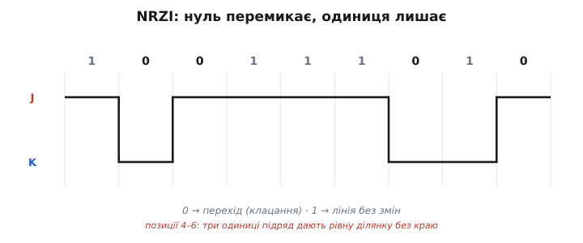
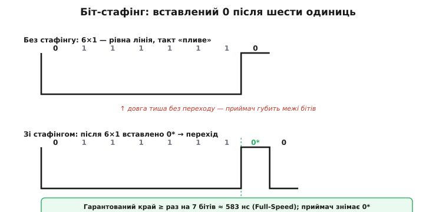

# 🧮 NRZI і біт-стафінг: як USB передає біти без окремої лінії такту

> Математична вставка про те, як [USB-шина](topic:programming/usb-physical) передає біти. Шина USB — це диференційна пара двох дротів і живлення; жодного третього дроту під такт, жодного окремого тактового сигналу на пристрої немає. Постає питання: якщо тактової лінії нема, **звідки приймач знає, де закінчується один біт і починається наступний**? Відповідь — два прийоми, NRZI і біт-стафінг, що вшивають такт у самі дані. Тут показуємо механіку, якісно й з числами, без формату пакетів.

## Означення

**NRZI** (*Non-Return-to-Zero Inverted*) — спосіб кодувати біти **зміною стану лінії, а не її рівнем**. Точне правило USB (це угода саме USB, не загальна): біт **0 → лінія перемикається** між станами (transition) на межі біта; біт **1 → лінія лишається** як була (no transition). Зверніть увагу на неочевидність: **нуль = подія, одиниця = тиша**, а не навпаки. Рівень сам по собі нічого не означає — інформацію несуть переходи між бітовими позиціями.

**Біт-стафінг** (*bit stuffing*) — примусова вставка додаткового біта **0** після кожних **шести одиниць підряд**, щоб у лінії гарантовано з'явилася зміна. Адже довга низка одиниць у NRZI — це рівна лінія без жодного перемикання. Приймач, побачивши шість одиниць і обов'язковий нуль після них, **відкидає** цей нуль — він службовий і не несе даних. Логічний потік бітів на обох кінцях лінії залишається однаковим.

Навіщо взагалі обходитися без окремої тактової лінії? Мета USB — дешевий, простий **пристрій** на тонкому кабелі. Окремий дріт під такт на високій частоті — це і зайва жила, і проблема перекосу (skew) між тактом і даними: тактовий сигнал і сигнал даних проходять різними фізичними шляхами й можуть зміщуватися відносно одне одного на сотні пікосекунд. Тому такт **відновлюють із даних** (clock recovery) — а для цього в потоці мусять регулярно траплятися фронти (edges), на які орієнтується приймач. NRZI і стафінг разом гарантують цю регулярність.

Стисле правило кодування:

```
NRZI:   біт 0 → перемкнути лінію (J↔K)
        біт 1 → лишити лінію як є
стафінг: після 6× "1" підряд → вставити "0"
```

Стани J і K — назви двох рівнів [диференційної пари](topic:communications/differential-pair), своєрідні ярлики; детальне кодування D+/D− залежить від швидкості шини.

## Інтуїція

Уявіть, що приймач читає **азбуку Морзе на слух без метронома**: він синхронізується за **клацаннями** — тобто за фронтами сигналу. Кожен перехід між J і K — це «тик», що підрівнює внутрішній годинник приймача. У реальній схемі цю функцію виконує схема відновлення такту (DPLL, digital phase-locked loop), яка «підтягується» щоразу, як бачить перехід. Поки переходи трапляються регулярно — годинник не «пливе», і приймач чітко рахує межі бітів.

Чому ж не обрати простіший підхід, де рівень сигналу просто відповідає значенню біта (це NRZ, Non-Return-to-Zero без Inverted)? У NRZ довгий рядок однакових бітів дає рівну лінію, і приймач **губить лік**: він не знає, скільки однакових бітів минуло. NRZI переносить інформацію на **фронти**, а нулі завжди дають клацання. Але й тут залишається вразливість: довгий рядок **одиниць** — тиша без жодного переходу, і годинник усе одно може «попливти».

Цю вразливість і усуває стафінг. Вставлений нуль — це примусовий фронт щонайменше раз на 7 бітів. Образ: «правило не мовчати довше ніж 6 тактів» — як доповідач на конференції, що зобов'язаний кашлянути, аби слухачі не заснули й не збилися з ритму. Приймач знає про це правило й автоматично відкидає кожен сьомий біт після шістки одиниць — він службовий.

Отже, максимальний інтервал без краю обмежений зверху — а саме це й треба, щоб порахувати, наскільки точним має бути годинник пристрою.

## Формальний апарат (з числами)

Розберемо приклад бітового рядка `1 0 0 1 1 1 0` вручну — крок за кроком, від початкового стану J:

```
біти:       1   0   0   1   1   1   0
            │   │   │   │   │   │   │
старт у J:  J
1 → лишити:     J
0 → перемкнути:     K
0 → перемкнути:         J
1 → лишити:                 J
1 → лишити:                     J
1 → лишити:                         J
0 → перемкнути:                         K
```

Бачимо: три одиниці підряд (позиції 4, 5, 6) дають три кроки без жодного переходу — рівна ділянка на лінії. Якби одиниць було шість, ця рівна ділянка тривала б довше й годинник приймача почав би накопичувати похибку. Саме цей сценарій унаочнює фігура:



*Біт 0 перемикає лінію між станами J і K, біт 1 лишає її незмінною. Над віссю — бітовий рядок, під нею — як крокує рівень. Інформацію несуть переходи, а не самі рівні; тому довга низка одиниць дає рівну ділянку без жодного краю.*

Тепер дамо числа для Full-Speed USB (12 Мбіт/с):

```
швидкість FS              = 12 Мбіт/с
тривалість одного біта    = 1 / 12·10⁶ ≈ 83.3 нс
макс. підряд без переходу = 6 одиниць + 1 стаф-біт = 7 бітових позицій
макс. інтервал «тиші»     ≈ 7 × 83.3 нс ≈ 583 нс
```

Приймач гарантовано бачить перехід принаймні раз на ~0.58 мкс. За цей час схема відновлення такту не встигає накопичити критичну похибку.

Чому 0.58 мкс — прийнятний інтервал? Між двома фронтами приймач відраховує до 7 бітових інтервалів «наосліп». Щоб на сьомому не помилитися у визначенні межі біта навіть на пів-біта, накопичена похибка такту за 7 бітів має залишатися меншою за 0.5 біта:

```
бюджет дрейфу за 7 бітів < 0.5 біта
відносна точність         < 0.5 / 7 ≈ 7 %   (оцінка для DPLL між ресинхронізаціями)
```

Це груба оцінка порядку; точні допуски тактового сигналу визначені у специфікації USB. Але головне — саме стафінг забезпечує цю свободу: завдяки гарантованій ресинхронізації щонайменше раз на 7 бітів FS-пристрій може стартувати з не надто точного джерела і **підлаштовуватися за фронтами**, а не утримувати кварц на рівні ppm. Для порівняння: в Ethernet подібного обмеження немає, тому вимоги до тактування там набагато жорсткіші.

Фігура нижче порівнює два варіанти NRZI-потоку з шістьма одиницями підряд — без стафінгу і зі стафінгом. Службовий біт позначено `0*`; приймач знімає його автоматично, і логічний потік даних на обох кінцях лінії ідентичний:



*Біт-стафінг рятує синхронізацію: після шести одиниць підряд (рівна лінія — приймач от-от «попливе») передавач примусово вставляє 0, що дає перехід. Угорі — потік без стафінгу (довга тиша, втрата такту); внизу — той самий потік зі вставленим службовим 0 (приймач його знімає). Гарантований край щонайменше раз на 7 бітів ≈ 583 нс на Full-Speed.*

Правило стафінгу дає ще один безкоштовний наслідок — дешеву перевірку цілісності. Передавач **зобов'язаний** вставити нуль після шести одиниць, тож сьома одиниця підряд на лінії законно з'явитися не може. Якщо приймач усе ж бачить шість одиниць, а замість обов'язкового нуля — знову одиницю (тобто перехід там, де його не мало бути, не стався), це **помилка стафінгу** (stuff error): надійна ознака, що завада спотворила потік. Контролер фіксує таку помилку й бракує пакет ще до перевірки контрольної суми. Так той самий прийом, що тримає синхронізацію, заразом ловить частину збоїв передачі — нічого не коштуючи додатково.

## Де це працює на практиці

Ця механіка пояснює, чому двох дротів [диференційної пари USB](topic:programming/usb-physical) достатньо без третього під такт — тактова інформація «захована» в переходах між J і K. Самі ці переходи — фізичні події на [диференційній парі](topic:communications/differential-pair), що й несе сигнал.

Ідея «вшити такт у дані» з'являється не лише в USB. В [адресних світлодіодах](topic:electronics/addressable-leds) (протокол WS2812 та споріднені) біт кодується **тривалістю** рівня — коротке і довге імпульсне вікно розрізняє нуль і одиницю; такт так само прихований у самому сигналі. А коли прошивка **вручну** формує фронти й витримує часові інтервали (біт-бенгінг, *bit banging*), вона по суті реалізує ту саму ідею програмно. USB вирішує це апаратно — вбудований USB-контролер або зовнішній міст виконують NRZI-кодування і стафінг без жодної участі прошивки.

Наслідок для практики: саме NRZI зі стафінгом є причиною, чому [нативний USB-блок ESP32](topic:programming/esp32-usb) і зовнішні мости (CH340, CP2102 та ін.) не потребують окремої тактової жили в кабелі. Кабель несе лише D+ і D− — і цього вистачає для надійної двонаправленої передачі на швидкостях до 480 Мбіт/с у High-Speed режимі.
