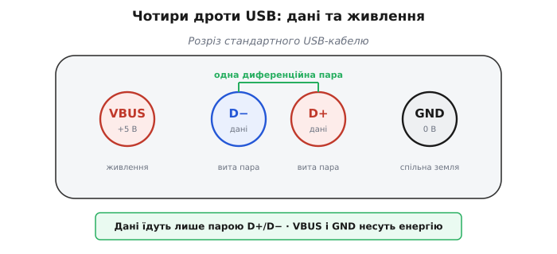
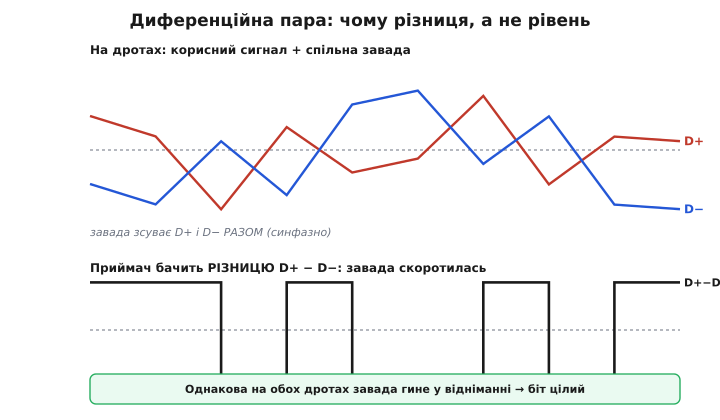
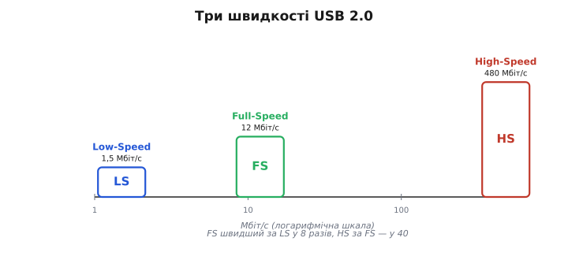
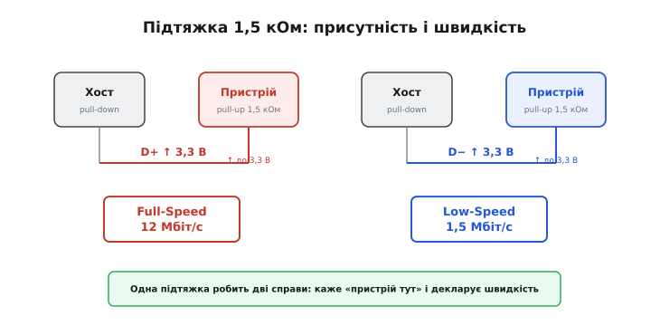

# USB фізично

[USB](book:programming/usb-overview) виглядає як складна машинерія: хост опитує дерево пристроїв, хаби розгалужують шину, кожен пристрій має свою адресу й набір кінцевих точок. Та коли заглянути в кабель, уся ця машинерія їде лише **двома сигнальними дротами**. І саме фізика цих двох дротів пояснює три ключові властивості USB: чому шина тримає завади, як далеко можна тягнути кабель і яким чином хост узагалі дізнається, що в порт щось увіткнули.

## Чотири дроти

Стандартний USB-кабель — байдуже, Type-A, Type-B, micro, mini чи Type-C, — завжди несе чотири провідники:

- **VBUS** — живлення, +5 В;
- **GND** — спільна земля, 0 В;
- **D+** і **D−** — диференційна пара даних.

Дані рухаються **виключно** парою D+/D−. Енергію несуть [VBUS і GND окремо](book:programming/usb-power): саме тому флешку видно як накопичувач, а телефон тим часом заряджається тим самим кабелем — це різні пари дротів, що працюють незалежно. У Type-C провідників більше: там додалися [контакти CC, які визначають орієнтацію роз'єма й розрізняють кабель «лише для заряджання»](book:communications/usb-c-connector) від кабелю з лініями даних. Але серце передачі скрізь одне — пара D+/D−.



*VBUS і GND — живлення; D+/D− працюють разом як одна диференційна пара даних.*

## Диференційна пара: навіщо два дроти на один сигнал

Найприродніше було б кодувати нуль і одиницю рівнем одного дроту відносно землі: низько — нуль, високо — одиниця. USB так **не** робить. Біт несе не рівень, а **різниця** напруг між D+ і D− (звідси й «диференційна», від латинського *differentia* — різниця). Коли D+ вищий за D−, лінія в одному стані; коли D− вищий за D+ — у протилежному.

Навіщо така зайва складність? Відповідь — у завадах. Будь-яке електромагнітне наведення на кабель — від двигуна поруч, від радіопередавача, від сусіднього дроту — потрапляє на **обидва** провідники однаково, бо вони лежать поряд. Завада зсуває D+ і D− в один бік на ту саму величину. Але приймач дивиться не на рівні, а на їхню різницю — а в різниці однаковий доданок просто скорочується. Завада, що зрушила обидва дроти на пів-вольта вгору, у відніманні D+ − D− дає нуль і зникає.



*Завада однаково зміщує обидва дроти; різниця D+ − D− лишається чистою, і біт цілий.*

> 🔧 **Навіщо це.** Саме завдяки диференційній парі USB-кабель тягнеться на метри там, де одиночна лінія вже ловила б перешкоди й сипала помилками. І саме тому D+ і D− у кабелі **скручені разом** у виту пару: кручення тримає обидва дроти в однакових умовах наведення, щоб завада справді була синфазною (однаковою на обох) і чисто скорочувалася. Та сама ідея різниці лежить в основі інших швидкісних шин — її поглиблено розбирає [диференційна пара як прийом передачі](book:communications/differential-pair).

## Швидкості: LS, FS, HS

USB 2.0 визначає три швидкості. Двомовні скорочення прижилися з часів розробки специфікації, тож наводимо їх як є:

- **Low-Speed (LS)** — 1,5 Мбіт/с. Миші, клавіатури, прості геймпади. Найдешевший приймач-передавач, мінімум вимог до точності.
- **Full-Speed (FS)** — 12 Мбіт/с. Більшість мікроконтролерів із вбудованим USB, зокрема [ESP32-S2 і S3](book:programming/esp32-usb). Аудіо, типові HID-пристрої, віртуальні COM-порти.
- **High-Speed (HS)** — 480 Мбіт/с. Вебкамери, накопичувачі, аудіоінтерфейси. Складніший аналоговий фронтенд і жорсткіші вимоги до кабелю.

SuperSpeed (USB 3.x, 5 Гбіт/с і вище) будується на принципово іншій фізиці й окремих дротах — це вже не пара D+/D−, тож до фізики USB 2.0 не належить.



*Розрив між швидкостями — у сотні разів, тому й аналоговий фронтенд від найпростішого до складного.*

## Як хост дізнається, що щось увіткнули

Це найцікавіша частина фізики USB, бо тут одна копійчана деталь робить одразу дві справи.

Коли в порт нічого не підключено, обидві лінії D+ і D− на боці хоста притягнуті до землі слабкими резисторами (pull-down, «підтяжка донизу»). Хост бачить на обох лініях нуль — порожньо. Щойно пристрій під'єднується, він піднімає **одну** з ліній резистором 1,5 кОм до 3,3 В (pull-up, «підтяжка догори»):

- підтягнуто **D+** → пристрій оголошує **Full-Speed**;
- підтягнуто **D−** → пристрій оголошує **Low-Speed**.

Хост помічає, що одна лінія піднялася з нуля, і робить два висновки воднораз: пристрій присутній — і ось його швидкість. Після цього хост починає [енумерацію — процедуру знайомства, у якій пристрій отримує адресу й описує себе](book:programming/usb-enumeration).



*Одна підтяжка робить дві справи: повідомляє про присутність пристрою й одразу декларує швидкість.*

High-Speed виходить за межі цієї пари резисторів. HS-пристрій спершу підключається як Full-Speed (підтяжка на D+), а під час скидання шини обмінюється з хостом серією коротких імпульсів — «цвіріньканням» (chirp, англ. «цвірінькати»). Якщо обидва боки вміють HS, вони домовляються перейти на 480 Мбіт/с і вимикають підтяжку. Так старий FS-хост і новий HS-пристрій завжди знаходять спільну швидкість.

> 🔧 **Навіщо це.** Коли на платі ESP32-S3 USB «не піднімається», перше, що варто перевірити, — підтяжку на D+ і те, чи не зайняті ці виводи іншою периферією. Немає підтяжки до 3,3 В на D+ — хост просто не побачить пристрій, бо для нього лінія лишилася на нулі, як у порожнього порту.

## Стани лінії: J, K і SE0

Біт несе різниця D+ − D−, тож у пари є лише два «робочі» стани. Їх назвали нейтрально, літерами **J** і **K**, бо фізичні рівні D+/D− для цих станів **залежать від швидкості**: те, що для Full-Speed стан J, для Low-Speed виглядає дзеркально. Літери ховають цю плутанину за стабільними іменами.

Окремо стоїть стан, коли **обидві** лінії притягнуті до нуля одночасно, — **SE0** (single-ended zero, «однобічний нуль»: різниці немає, обидва дроти низько). SE0 — не біт даних, а службовий сигнал: ним позначається кінець пакета (EOP, end of packet) і скидання шини, коли хост утримує SE0 довше за поріг. Тобто пара D+/D− говорить трьома словами — J, K і SE0, — і цього вистачає, щоб передавати дані й керувати шиною без жодного додаткового дроту.

**Worked-приклад: хто тут Full-Speed**

Нехай пристрій має резистор 1,5 кОм, припаяний між виводом **D+** і лінією 3,3 В. Простежимо, що бачить хост, крок за кроком.

```c
// Що відбувається на лінії після під'єднання кабелю:
// 1. Кабель увіткнули.
// 2. Підтяжка тягне D+ до ~3,3 В; D− лишається коло нуля (pull-down хоста).
// 3. Хост вимірює різницю: D+ > D−  →  стан "J" для Full-Speed.
// 4. D+ піднята з нуля → пристрій присутній, швидкість = Full-Speed.
//
// Висновок: пристрій оголошує Full-Speed, 12 Мбіт/с.

// Якби той самий резистор стояв на D−:
//    D− > D+  →  хост читає це як заявку на Low-Speed, 1,5 Мбіт/с.
```

Те саме рішення в коді мікроконтролера зводиться до вибору, яку лінію підтягувати; решту робить вбудований USB-блок:

```c
// Псевдо-налаштування PHY: декларуємо Full-Speed підтяжкою на D+.
usb_phy_config_t phy = {
    .target  = USB_PHY_TARGET_INT,   // вбудований приймач-передавач
    .otg_speed = USB_PHY_SPEED_FULL, // 12 Мбіт/с → підтяжка піде на D+
};
usb_new_phy(&phy);                    // блок сам підніме D+ при готовності
```

| Підтяжка 1,5 кОм | Стан при підключенні | Швидкість | Типове застосування |
|------------------|----------------------|-----------|---------------------|
| на D+ → 3,3 В    | D+ > D− (J для FS)   | Full-Speed, 12 Мбіт/с | ESP32-S2/S3, більшість МК |
| на D− → 3,3 В    | D− > D+ (J для LS)    | Low-Speed, 1,5 Мбіт/с | стара миша, клавіатура |
| chirp при скиданні | серія J/K-імпульсів | High-Speed, 480 Мбіт/с | диски, камери |

> 🔧 **Навіщо це.** Якщо пристрій визначається не на тій швидкості, ніж очікувалося, причина майже завжди фізична: підтяжка стоїть не на тому дроті, переплутані D+ і D− у розведенні, або резистор не тієї величини. Жодне налаштування драйвера це не виправить — хост читає швидкість раніше, ніж драйвер устигає сказати хоч слово.

## Чому пара D+/D− достатня без лінії такту

Залишається питання: якщо такту в кабелі немає, як приймач розрізняє, де закінчується один біт і починається наступний? Біти кодуються не рівнем, а переходами лінії — спосіб зветься **NRZI** (non-return-to-zero inverted), а від «зависання» на довгій низці однакових бітів рятує **біт-стафінг** (bit stuffing, «набивання бітами»): передавач примусово вставляє зайвий перехід. Разом вони ховають такт у самих даних, тож двох дротів вистачає. Як саме це працює — з числами й розбором по бітах — у вставці про [NRZI та біт-стафінг](book:programming/usb-physical/math-nrzi.md).
