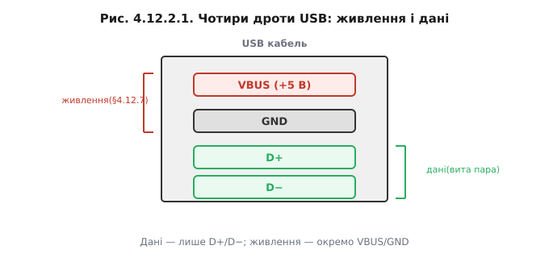
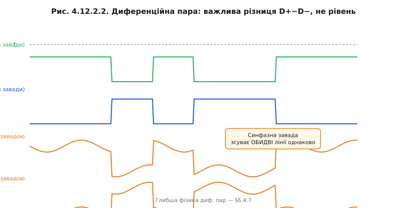
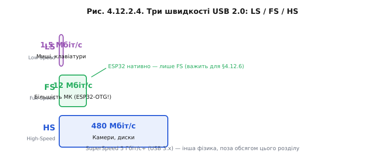
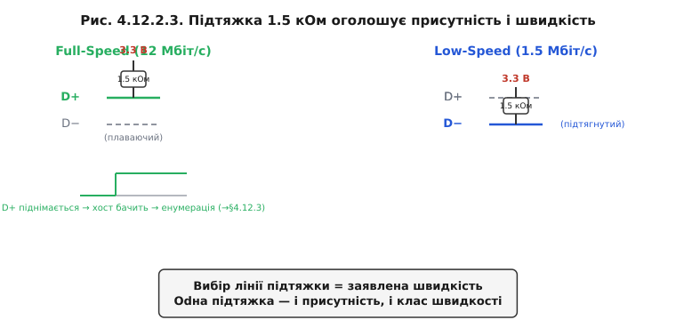

# Шина фізично: D+/D−, швидкості LS/FS/HS, виявлення підключення підтяжкою

Ієрархія зрозуміла: хост головний, пристрій лише відповідає, дерево розгалужується через хаби. Але якими дротами фізично рухається трафік? Виявляється, що вся ця складна машинерія передається лише двома сигнальними дротами — і саме фізика цих дротів пояснює ключові властивості USB: стійкість до завад, допустиму довжину кабелю й спосіб автовиявлення пристрою.

### Чотири дроти

Стандартний USB-кабель (Type-A, Type-B, micro, mini або Type-C) завжди несе чотири провідники: **VBUS** (+5 В живлення), **GND** (спільна земля), **D+** і **D−** (диференційна пара даних). Дані передаються виключно парою D+/D−; [живлення йде по VBUS/GND](book:programming/usb-power). У Type-C цих провідників більше: там з'явилися [додаткові контакти CC, які й вирішують орієнтацію роз'єма та породжують «кабель лише для заряджання»](book:communications/usb-c-connector) без ліній даних. Тут зосередимося на даних.



*Рис. Розріз кабелю: VBUS і GND — живлення; D+/D− — вита пара даних (зелений).*

### Диференційна пара — навіщо два дроти на один сигнал

Логічний нуль і одиниця кодуються не рівнем одного сигналу відносно землі, а **різницею** напруг між D+ і D−. Коли D+ > D−, це один стан; коли D− > D+, — інший. Чому це важливо? Будь-яка електромагнітна завада, що потрапляє на кабель, однаково впливає на обидва провідники — D+ і D− зсуваються разом. Але різниця між ними залишається незмінною: завада просто зникає у вирахуванні.



*Рис. Завада (помаранчевий) однаково зміщує обидва сигнали. Різниця D+−D− (чорний) — біт цілий.*

> 🔧 **Навіщо це**: саме тому USB тягне на метри там, де одиночна лінія вже б ловила перешкоди. Саме тому D+ і D− скручені разом (вита пара в кабелі) — кручення забезпечує рівний індуктивний зв'язок на обох провідниках. Та сама диференційна ідея лежить в основі [інших швидкісних шин — USB і Ethernet](book:communications/usb-ethernet-differential).

### Швидкості: LS / FS / HS

USB 2.0 визначає три швидкості (двомовні позначення збереглися з часів розробки специфікації):

- **Low-Speed (LS)** — 1,5 Мбіт/с. Миші, клавіатури, геймпади. Мінімальна складність, найдешевший приймач-передавач.
- **Full-Speed (FS)** — 12 Мбіт/с. Більшість мікроконтролерів з нативним USB, у тому числі ESP32-S2/S3. Аудіо, більшість HID-пристроїв, CDC-порти.
- **High-Speed (HS)** — 480 Мбіт/с. Вебкамери, USB-диски, аудіоінтерфейси. Складніший аналоговий фронтенд.

SuperSpeed (USB 3.x, 5 Гбіт/с і вище) використовує принципово іншу фізику й роз'єм — і тут не розглядається.



*Рис. Логарифмічна шкала смуг. [ESP32 нативно підтримує лише Full-Speed](book:programming/esp32-usb) (12 Мбіт/с).*

### Як хост дізнається, що щось увіткнули — серце теми

Коли в порт хоста нічого не підключено, обидві лінії D+ і D− підтягнуті через резистори до землі на боці хоста (pull-down). Щойно пристрій підключається, він піднімає одну з ліній через резистор 1,5 кОм до 3,3 В:

- якщо підтягнуто **D+** → пристрій оголошує **Full-Speed** (12 Мбіт/с);
- якщо підтягнуто **D−** → пристрій оголошує **Low-Speed** (1,5 Мбіт/с).

Хост бачить, що лінія піднялась із нульового рівня, і запускає [**енумерацію** — процедуру знайомства](book:programming/usb-enumeration). Таким чином, одна підтяжка вирішує відразу два завдання: повідомляє хосту про присутність пристрою й одразу декларує швидкість.



*Рис. Зміна рівня на D+ або D− при підключенні → хост стартує енумерацію.*

> 🧮 **NRZI і біт-стафінг** — [`r12-s2-m-nrzi.md`]: як біти кодуються без окремої лінії тактування; чому вставляється «нульовий» біт після шести одиниць поспіль.

**Worked-приклад: хто тут Full-Speed**

Ситуація: пристрій має підтяжку 1,5 кОм, припаяну між виводом D+ і лінією 3,3 В.

```
Крок 1. Кабель під'єднано.
Крок 2. Підтяжка піднімає D+ до ~3,3 В відносно GND.
Крок 3. Хост вимірює: D+ > D− → стан "J" Full-Speed.
Висновок: пристрій оголошує Full-Speed, 12 Мбіт/с.

Якби підтяжка стояла на D−:
D− > D+ → стан "K" Low-Speed → 1,5 Мбіт/с.

High-Speed: пристрій стартує як FS,
потім negotiates HS під час reset (chirp-sequence).
```

| Підтяжка    | Швидкість    | Типове застосування        |
|-------------|--------------|----------------------------|
| D+ до 3,3 В | Full-Speed 12 Мбіт/с | ESP32-OTG, більшість МК |
| D− до 3,3 В | Low-Speed 1,5 Мбіт/с | Стара миша, клавіатура  |
| Chirp       | High-Speed 480 Мбіт/с | Диски, камери            |

Щойно підтяжка піднімає лінію, хост фіксує присутність пристрою й розпочинає з ним діалог — [енумерацію](book:programming/usb-enumeration).

---
