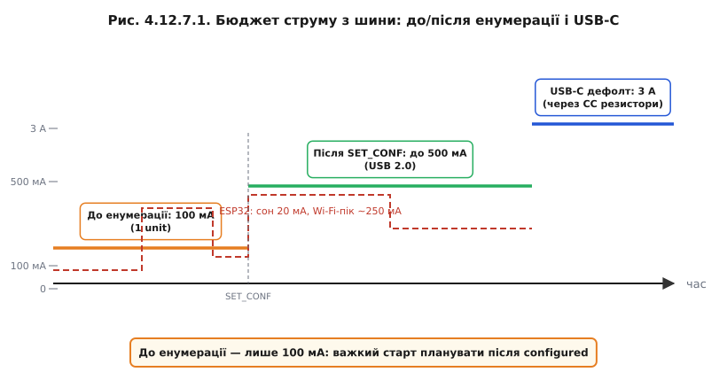
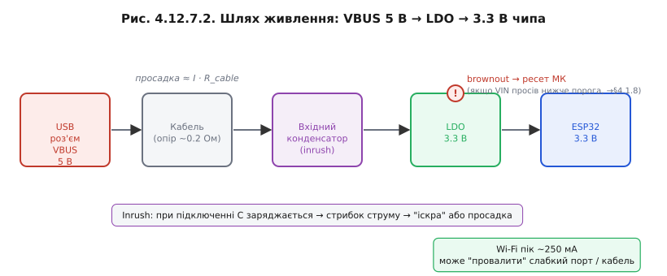

# Живлення з шини: 5 В і бюджет струму

Окрім ліній даних, у кабелі є **VBUS** — [лінія +5 В](book:programming/usb-physical). Питання живлення не тривіальне: USB-порт не є необмеженим джерелом енергії, і стандарт чітко регламентує, скільки пристрій може споживати і коли.

### Bus-powered проти self-powered

Пристрій, що живиться від шини, називають **bus-powered**. Той, що має власне джерело живлення (зовнішній блок, батарею), — **self-powered**. Ця інформація передається хосту через поле `bmAttributes` у Configuration Descriptor, а поле `bMaxPower` декларує максимальний струм, що пристрій збирається споживати з VBUS (в одиницях по 2 мА). Хост може відмовити у ввімкненні або вимкнути порт, якщо сумарне навантаження перевищує його можливості.

### Бюджет струму за стандартом — серце теми

Тут важлива послідовність:

1. **До завершення енумерації** (тобто до `SET_CONFIGURATION`) пристрій має право споживати не більше **100 мА** (один «unit load» за USB 2.0). Ця норма захищає хост від перевантаження невідомим пристроєм.

2. **Після `SET_CONFIGURATION`** пристрій може споживати стільки, скільки задекларував у `bMaxPower` — максимум до **500 мА** для стандартного порту USB 2.0 (250 unit loads по 2 мА).

3. **USB Type-C** [з резисторами CC](book:programming/usb-physical) піднімає типовий ліміт до **3 А** ще до будь-якої додаткової узгоджувальної процедури. USB Power Delivery дозволяє ще більше — десятки ват, — але це окрема специфікація.



*Рис. Бюджет струму: до SET_CONF — лише 100 мА; після — до 500 мА (USB 2.0). Накладено профіль ESP32 зі сплеском Wi-Fi.*

### 5 В на шині — не 3,3 В чипа

VBUS — це 5 В. ESP32 живиться від 3,3 В. На DevKit між VBUS і ESP32 стоїть [**LDO**](book:electronics/ldo) (Low-Dropout регулятор) або інший перетворювач. Схема проста: роз'єм VBUS 5 В → LDO → 3,3 В → ESP32. Але є нюанс: кабель і роз'єм мають опір, і при великому струмі напруга на вході LDO просідає. Якщо вона впаде нижче мінімуму для LDO, ESP32 отримає менше 3,3 В і може спрацювати [**brownout-детектор**](book:programming/reset-causes) — мікроконтролер перезавантажиться в найнесподіваніший момент.



*Рис. Просадка на кабелі + inrush конденсатора + Wi-Fi пік = потенційна точка brownout перед LDO.*

### Пік передачі їсть найбільше

[Wi-Fi-радіо ESP32](book:programming/esp32-architecture) споживає в момент передачі пакету 200–300 мА. Якщо плата bus-powered і підключена до слабкого хаба (наприклад, вбудованого в клавіатуру) або довгого тонкого кабелю, саме цей пік може опустити VBUS до межі. Симптоми: DevKit раптово перезавантажується при активній роботі Wi-Fi, хоча в спокої все стабільно.

### Inrush і конденсатор

При підключенні кабелю до порту великий вхідний конденсатор DevKit починає заряджатися — і в перші мікросекунди споживає значно більше за номінальний струм. Це **inrush**-струм. Він може спричинити короткочасну просадку VBUS або навіть видиму «іскру» при підключенні. Якість кабелю і його довжина впливають на глибину просадки.

**Worked-приклад: вкладаємося у бюджет порту**

```
Вихідні дані:
  ESP32-S3 у режимі Wi-Fi: сон 20 мА, пік передачі 250 мА
  LDO на платі: ефективність ~90%, Vin(min) = 4,5 В
  Порт USB 2.0: ліміт 500 мА після конфігурації, 100 мА до неї

Розрахунок:
  Споживання від VBUS у піку:
    P_chip = 3,3 В × 250 мА = 825 мВт
    I_VBUS = P_chip / (5 В × 0,90) ≈ 183 мА від шини у піку

  З урахуванням інших споживачів плати (LED тощо) +20 мА:
    I_total ≈ 203 мА → добре вкладаємося в 500 мА

  АЛЕ: до SET_CONFIGURATION ліміт 100 мА.
  При старті Wi-Fi до завершення енумерації → небезпечна зона.
  Висновок: важкий ініціалізаційний код (Wi-Fi connect)
             краще запускати вже після connected (TUSB_STAGE_CONFIGURED),
             а не одразу після boot.

  bMaxPower у дескрипторі: 250 мА / 2 мА = 125 unit loads.
  Записуємо: bMaxPower = 125 (означає 250 мА).
```

> 🔧 **Навіщо це**: бюджет шини — причина номер один «загадкових» перезавантажень пристрою при підключенні до USB. Знаючи межі (100 мА до енумерації, 500 мА після, USB-C — більше), ви або правильно плануєте старт прошивки, або одразу вирішуєте використовувати self-powered конфігурацію чи зовнішнє живлення.

Симетричне питання — коли [МК сам стає хостом](book:programming/usb-host) і роздає живлення підключеній периферії: тоді ті самі межі VBUS він має дотримувати вже як джерело.

---
