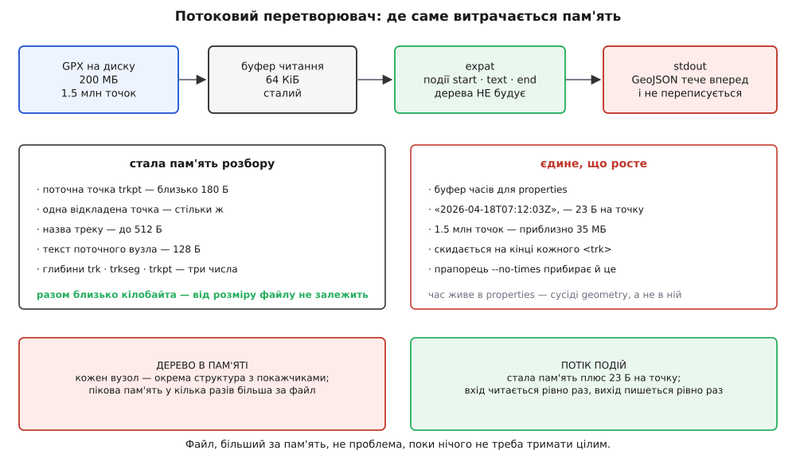
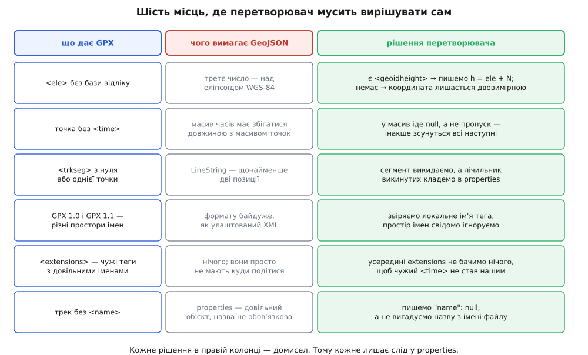

# ⚙️ GPX → GeoJSON: перетворювач, що записує кожен свій домисел

Це робоча програма на кілька сотень рядків, яка читає GPX-трек будь-якого розміру й видає GeoJSON, ніде не збрехавши мовчки. Її цінність не в тому, що вона перекладає теги в дужки — це найлегша частина. Цінність у тому, що GPX і GeoJSON описують різні речі, тож у півдюжині місць перетворювач мусить **вирішити сам**, і кожне таке рішення програма записує в самий файл, який видає.

Причина, чому це не переклад слово в слово, одна: GPX — журнал вимірювань приладу, а GeoJSON — опис геометричних об'єктів. Прилад пише, коли він був у точці і як упевнено її знав; веб-карта хоче знати, які об'єкти є і які в них властивості. Там, де журнал каже більше, ніж уміє записати опис, перетворювач мусить вибрати, куди це подіти. Там, де опис вимагає більше, ніж каже журнал, — мусить це звідкись узяти. Другий випадок і є домисел, і саме він робить конвертери непорівнянними між собою.

## Задача

Вхід — файл GPX 1.0 або 1.1, можливо на сотні мегабайтів, із одним чи кількома треками (`trk`). Кожен трек ділиться на сегменти (`trkseg`), сегмент — послідовність точок (`trkpt`) з обов'язковими атрибутами `lat`/`lon` і необов'язковими дочірніми `ele`, `time`, `geoidheight`.

Вихід — `FeatureCollection`, де кожен трек стає одним `Feature`: геометрія `MultiLineString`, у ній один внутрішній масив на кожен сегмент, час усіх точок — паралельним масивом у `properties`.

Три обмеження, які й формують усю конструкцію:

1. **Пам'ять не залежить від розміру файлу.** Це не примха: GPX-логер за тиждень польотів дає файли, більші за вільну пам'ять машини, на якій їх обробляють.
2. **Числа виходять із тією точністю, з якою зайшли.** Ні на знак менше через недбалий формат друку, ні на знак більше через удаваний запас.
3. **Жодного тихого домислу.** Усе, що програма вирішила за нас, лежить у `properties` готового файлу — не в логах, не в документації, а в даних.

Щоб уявити масштаб: типовий `trkpt` з висотою й часом займає в GPX близько 130 байтів, тож файл на 200 МБ — це приблизно півтора мільйона точок.

## Ідея

Уся конструкція виростає з чотирьох спостережень, і кожне наступне спирається на попереднє.

**Перше: обидва боки читаються й пишуться строго вперед.** XML-документ розбирається зліва направо, JSON-текст так само зліва направо будується. Значить, тримати в пам'яті дерево немає жодної потреби: досить, щоб хтось повідомляв «почався елемент», «ось його текст», «елемент закінчився», а ми на кожне повідомлення дописували щось у вихід. Це і є [розбір потоку](book:programming/stream-parser) в проштовхувальному вигляді: замість того щоб ми питали парсер про наступний вузол, парсер сам кличе наші функції. Різниця з деревом принципова — дерево тримає всі вузли водночас, потік не тримає жодного.

**Друге: вкладеність GPX і вкладеність GeoJSON збігаються.** `trk` → `Feature`, `trkseg` → внутрішній масив, `trkpt` → позиція. Отже, весь стан розбору — це три числа: на якій глибині відкрито `trk`, на якій `trkseg`, на якій `trkpt`. Нуль означає «зараз не всередині». Жодних стеків, жодних дерев.

**Третє: рівно одна річ ламає потоковість — час.** У GeoJSON геометрія і властивості — сусіди в одному об'єкті, а не вкладені одне в одне. Координати ми виводимо одразу, а часи мусимо десь притримати, щоб дописати їх після геометрії. Тримаємо не точки, а лише готовий текст масиву часів — двадцять три байти на точку — і скидаємо його на кінці кожного треку. Півтора мільйона точок дають близько 35 МБ, і це єдина величина в програмі, що росте.

**Четверте: одна точка затримки прибирає цілий клас поганих виходів.** `LineString` за RFC 7946 має щонайменше дві позиції, а GPX цілком законно містить сегмент з однією точкою або й порожній. Якщо виводити точки одразу, ми дізнаємося про однокрапковий сегмент тоді, коли вже написали в файл відкриту дужку й позицію. Тому кожна точка чекає на наступну: перша точка сегмента виводиться лише тоді, коли прийшла друга. Черга з одного елемента — і невалідні сегменти зникають самі, без відкоту й без другого проходу.


*Уся стала частина — дві точки розбору по сотні з гаком байтів, пів кілобайта на назву треку й буфер читання. Росте лише текст масиву часів, і саме тому його вимикають прапорцем, коли час не потрібен.*

> 🔧 **Навіщо це.** Спокуса зробити інакше велика: узяти бібліотеку, що читає XML у дерево, пройтися по ньому вкладеними циклами й скласти структуру GeoJSON у пам'яті, а потім серіалізувати. Такий код пишеться за годину й на тестовому файлі в кілька кілобайтів працює бездоганно. Ламається він у роботі, на справжньому тижневому логу, і ламається найгіршим способом — процес не падає з помилкою, а починає своп, і машина перестає відповідати. Дерево XML тримає кожен вузол як окрему структуру з покажчиками на батька, дітей і сусідів; елемент `<ele>179.2</ele>` — це шістнадцять байтів у файлі й два вузли по сотні з гаком байтів кожен у пам'яті. Звідси проста оцінка: **пікова пам'ять у кілька разів більша за файл**, і жодна оптимізація коду навколо цього не рятує — рятує тільки відмова тримати дерево.

## Розбирати XML самотужки не треба

Одразу приберімо очевидне запитання: чому б не написати свій розбір, адже GPX виглядає простим?

Бо він не простий. [XML](book:programming/xml-markup) — це дерево елементів із атрибутами, і разом із ним у файл приходять простори імен, сутності `&amp;` і власні сутності з `DOCTYPE`, секції `CDATA`, оголошене в першому рядку кодування, яке не зобов'язане бути UTF-8, коментарі й інструкції обробки. Кожна з цих дрібниць у чиємусь реальному файлі вже трапилася. Свій розбір «на `strstr`» ламається на першому ж треку, названому `Дніпро &amp; Десна`.

Тому беремо **expat** — бібліотеку, що робить рівно те, що нам потрібно: читає байти шматками й кличе наші три функції. Вона є в кожному дистрибутиві, важить кількасот кілобайтів і не має залежностей. Її угода з нами така: рядки, які вона передає в обробники, **завжди в UTF-8**, незалежно від того, в якому кодуванні був файл. Це знімає з нас цілий шар роботи, бо JSON теж обмінюють у [UTF-8](book:programming/ascii-utf8) — байти назви треку йдуть із входу у вихід без перекодування.

І одразу про безпеку. Файл із чужих рук може містити `DOCTYPE` з рекурсивними сутностями — класична «мільярд смішинок», де десяток рядків оголошень розгортається в гігабайти тексту. Expat від версії 2.4.0 має власний запобіжник із типовим коефіцієнтом розгортання 100, але надійніше просто заборонити оголошення сутностей узагалі: у GPX їх не буває. Ставимо обробник оголошення сутності, який зупиняє розбір, — і цілий клас атак зникає. Зовнішні сутності expat і так не тягне: без явно поставленого обробника посилання на них мовчки ігноруються.

## Код

Обидві версії — та сама програма й той самий алгоритм. C — прямий шлях: expat має C-інтерфейс, а вся робота зводиться до байтів, лічильників і форматування чисел. C++ виграє в трьох конкретних місцях, і саме заради них варто подивитися другу вкладку: `std::string` знімає ручне перевиділення буфера, `std::optional` робить «висоти немає» окремим станом замість пари «значення плюс прапорець», а `std::to_chars` і `std::from_chars` перетворюють числа **незалежно від локалі за визначенням** — не через дисципліну виклику `setlocale`, а тому, що інакше не вміють.

:::tabs
```c
/* gpx2geojson.c — потоковий перетворювач GPX-треків на GeoJSON.
 *   cc -O2 -std=c11 -Wall -o gpx2geojson gpx2geojson.c -lexpat
 *   ./gpx2geojson track.gpx > track.geojson
 * -d <0..9>                  знаків після коми в координатах (типово 7)
 * --ele auto|ellipsoid|none  що робити з висотою (типово auto)
 * --no-times                 не збирати масив часів: пам'ять стає сталою */

#include <expat.h>
#include <locale.h>
#include <stdio.h>
#include <stdlib.h>
#include <string.h>

#define IOBUF   (64 * 1024)   /* шматок читання; пам'ять від нього не залежить */
#define TXTMAX  128           /* найдовший текстовий вузол, який нас цікавить  */
#define NAMEMAX 512           /* назва треку; довше — обрізаємо               */

enum { CAP_NONE = 0, CAP_ELE, CAP_TIME, CAP_GEOID, CAP_NAME };
enum { ELE_AUTO = 0, ELE_ELLIPSOID, ELE_NONE };

/* одна точка, зібрана з атрибутів і дочірніх елементів <trkpt> */
typedef struct {
    double lat, lon;
    int    has_pos;
    double ele, geoid;
    int    has_ele, has_geoid;
    char   time[TXTMAX];
    int    has_time;
} Pt;

/* буфер, що росте: сюди складаємо готовий текст масиву часів */
typedef struct { char *p; size_t n, cap; } Buf;

typedef struct {
    XML_Parser xp;
    FILE *out;
    int digits, ele_mode, want_times;

    int depth, d_ext, d_trk, d_seg, d_pt;   /* глибини відкритих елементів */

    int    cap_what;                        /* текст якого елемента збираємо */
    char  *cap_dst;
    size_t cap_sz, cap_len;
    char   txt[TXTMAX];
    char   name[NAMEMAX];
    int    has_name;

    Pt  cur, pend;                          /* поточна й відкладена точки */
    int pend_valid;

    long feats_written; int feat_started;
    long segs_written;  int seg_started; long pts_in_seg;

    int    dim_fixed, dim3;                 /* вимір позицій цього треку */
    double last_ele, last_geoid;

    long pts, no_time, ele_carried, geoid_carried,
         segs_dropped, pts_bad, trks_empty;

    Buf times;
    const char *abort_why;
} St;

static void die(const char *msg) {
    fprintf(stderr, "gpx2geojson: %s\n", msg);
    exit(1);
}

static void buf_write(Buf *b, const char *s, size_t k) {
    if (b->n + k + 1 > b->cap) {
        size_t cap = b->cap ? b->cap : 4096;
        char *q;
        while (cap < b->n + k + 1) cap *= 2;   /* подвоєння: амортизовано O(1) */
        q = realloc(b->p, cap);
        if (!q) die("бракує пам'яті на масив часів");
        b->p = q; b->cap = cap;
    }
    memcpy(b->p + b->n, s, k);
    b->n += k;
    b->p[b->n] = '\0';
}
static void buf_puts(Buf *b, const char *s) { buf_write(b, s, strlen(s)); }

/* JSON-рядок у лапках: expat уже гарантував коректний UTF-8, лишається
   сховати лапку, зворотну скісну й керівні символи */
static void json_quote(char *dst, size_t cap, const char *src) {
    const unsigned char *p;
    size_t j = 0;
#define PUT(c) do { if (j + 1 < cap) dst[j++] = (char)(c); } while (0)
    PUT('"');
    for (p = (const unsigned char *)src; *p; p++) {
        if (*p == '"' || *p == '\\')       { PUT('\\'); PUT(*p); }
        else if (*p == '\n')               { PUT('\\'); PUT('n'); }
        else if (*p == '\r')               { PUT('\\'); PUT('r'); }
        else if (*p == '\t')               { PUT('\\'); PUT('t'); }
        else if (*p < 0x20) {
            char u[8], *q;
            snprintf(u, sizeof u, "\\u%04x", (unsigned)*p);
            for (q = u; *q; q++) PUT(*q);
        }
        else PUT(*p);                      /* байти UTF-8 ≥ 0x20 — як є */
    }
    PUT('"');
    dst[j < cap ? j : cap - 1] = '\0';
#undef PUT
}

static char *trim(char *s) {
    char *e;
    while (*s == ' ' || *s == '\t' || *s == '\n' || *s == '\r') s++;
    e = s + strlen(s);
    while (e > s && (e[-1] == ' ' || e[-1] == '\t' ||
                     e[-1] == '\n' || e[-1] == '\r')) *--e = '\0';
    return s;
}

/* локальне ім'я: <gpx:trkpt> і <trkpt> для нас те саме */
static const char *local(const XML_Char *n) {
    const char *c = strrchr(n, ':');
    return c ? c + 1 : n;
}

/* число цілком або нічого: хвіст після числа означає, що рядок не число */
static int num(const char *s, double *out) {
    char *end;
    double v = strtod(s, &end);
    if (end == s) return 0;
    while (*end == ' ' || *end == '\t' || *end == '\n' || *end == '\r') end++;
    if (*end) return 0;
    *out = v;
    return 1;
}

static void cap_begin(St *s, int what, char *dst, size_t sz) {
    s->cap_what = what; s->cap_dst = dst; s->cap_sz = sz; s->cap_len = 0;
    dst[0] = '\0';
}

static void put(St *s, const char *t) { fputs(t, s->out); }

/* ── вивід ──────────────────────────────────────────────────────────────── */

static void emit_pos(St *s, const Pt *p) {
    char buf[96];
    double h;
    if (!s->dim_fixed) {              /* вимір визначає перша виведена точка */
        s->dim3 = (s->ele_mode == ELE_AUTO)      ? (p->has_ele && p->has_geoid)
                : (s->ele_mode == ELE_ELLIPSOID) ?  p->has_ele : 0;
        s->dim_fixed = 1;
    }
    if (!s->dim3) {
        snprintf(buf, sizeof buf, "[%.*f,%.*f]",
                 s->digits, p->lon, s->digits, p->lat);
        put(s, buf);
        return;
    }
    if (p->has_ele) s->last_ele = p->ele; else s->ele_carried++;
    h = s->last_ele;
    if (s->ele_mode == ELE_AUTO) {    /* h = H + N: з рівня моря на еліпсоїд */
        if (p->has_geoid) s->last_geoid = p->geoid; else s->geoid_carried++;
        h += s->last_geoid;
    }
    snprintf(buf, sizeof buf, "[%.*f,%.*f,%.2f]",
             s->digits, p->lon, s->digits, p->lat, h);
    put(s, buf);
}

static void emit_time(St *s, const Pt *p) {
    if (!p->has_time) s->no_time++;
    if (!s->want_times) return;
    if (p->has_time) {
        char q[TXTMAX * 6 + 4];
        json_quote(q, sizeof q, p->time);
        buf_puts(&s->times, q);
    } else {
        buf_puts(&s->times, "null");  /* дірка, а не пропуск: довжини рівні */
    }
}

static void emit_point(St *s, const Pt *p) {
    if (!s->feat_started) {
        if (s->feats_written) put(s, ",\n");
        put(s, "{\"type\":\"Feature\",\"geometry\":"
               "{\"type\":\"MultiLineString\",\"coordinates\":[");
        s->feat_started = 1;
    }
    if (!s->seg_started) {
        if (s->segs_written) { put(s, ","); if (s->want_times) buf_puts(&s->times, ","); }
        put(s, "[");           if (s->want_times) buf_puts(&s->times, "[");
        s->seg_started = 1; s->pts_in_seg = 0;
    }
    if (s->pts_in_seg) { put(s, ","); if (s->want_times) buf_puts(&s->times, ","); }
    emit_pos(s, p);
    emit_time(s, p);
    s->pts_in_seg++;
    s->pts++;
}

/* ── межі trkpt · trkseg · trk ──────────────────────────────────────────── */

static void pt_begin(St *s, const XML_Char **atts) {
    double lat = 0, lon = 0;
    int hlat = 0, hlon = 0, i;
    memset(&s->cur, 0, sizeof s->cur);
    for (i = 0; atts[i]; i += 2) {
        const char *a = local(atts[i]);
        if      (!strcmp(a, "lat")) hlat = num(atts[i + 1], &lat);
        else if (!strcmp(a, "lon")) hlon = num(atts[i + 1], &lon);
    }
    if (hlat && hlon && lat >= -90.0 && lat <= 90.0
                     && lon >= -180.0 && lon <= 180.0) {
        s->cur.lat = lat; s->cur.lon = lon; s->cur.has_pos = 1;
    }
}

static void pt_end(St *s) {
    if (!s->cur.has_pos) { s->pts_bad++; return; }
    if (s->pend_valid) emit_point(s, &s->pend);   /* попередня вже не одинока */
    s->pend = s->cur;
    s->pend_valid = 1;
}

static void seg_end(St *s) {
    if (s->pend_valid && s->seg_started) emit_point(s, &s->pend);
    s->pend_valid = 0;
    if (s->seg_started) {
        put(s, "]"); if (s->want_times) buf_puts(&s->times, "]");
        s->segs_written++; s->seg_started = 0;
    } else {
        s->segs_dropped++;      /* нуль або одна точка — лінії з такого нема */
    }
}

static void trk_begin(St *s) {
    s->feat_started = 0; s->seg_started = 0; s->pend_valid = 0;
    s->segs_written = 0; s->pts_in_seg = 0;
    s->has_name = 0; s->name[0] = '\0';
    s->dim_fixed = 0; s->dim3 = 0; s->last_ele = 0; s->last_geoid = 0;
    s->pts = s->no_time = s->ele_carried = s->geoid_carried = 0;
    s->segs_dropped = s->pts_bad = 0;
    s->times.n = 0;             /* довжина в нуль, місце лишається за нами */
}

static void trk_end(St *s) {
    char q[NAMEMAX * 6 + 4], tail[512];
    if (!s->feat_started) { s->trks_empty++; return; }

    put(s, "]},\"properties\":{\"name\":");
    if (s->has_name) { json_quote(q, sizeof q, s->name); put(s, q); }
    else             put(s, "null");

    snprintf(tail, sizeof tail,
        ",\"elevation\":\"%s\",\"conversion\":{\"digits\":%d,\"points\":%ld,"
        "\"segments\":%ld,\"segments_dropped\":%ld,\"points_without_time\":%ld,"
        "\"elevation_carried\":%ld,\"geoidheight_carried\":%ld,"
        "\"points_dropped\":%ld}",
        !s->dim3 ? "none"
                 : (s->ele_mode == ELE_AUTO ? "wgs84-ellipsoid (ele + geoidheight)"
                                            : "wgs84-ellipsoid (ele прийнято за h)"),
        s->digits, s->pts, s->segs_written, s->segs_dropped,
        s->no_time, s->ele_carried, s->geoid_carried, s->pts_bad);
    put(s, tail);

    if (s->want_times) {
        put(s, ",\"coordinateProperties\":{\"times\":[");
        if (s->times.n) fwrite(s->times.p, 1, s->times.n, s->out);
        put(s, "]}");
    }
    put(s, "}}");
    s->feats_written++;
}

/* ── обробники подій expat ──────────────────────────────────────────────── */

static void XMLCALL on_start(void *ud, const XML_Char *el, const XML_Char **atts) {
    St *s = (St *)ud;
    const char *n = local(el);
    s->depth++;

    if (s->d_ext) return;                     /* усередині extensions — сліпі */
    if (!strcmp(n, "extensions")) { s->d_ext = s->depth; return; }

    if (!s->d_trk) {
        if (!strcmp(n, "trk")) { s->d_trk = s->depth; trk_begin(s); }
        return;                               /* wpt, rte, metadata — не наше */
    }
    if (!s->d_seg) {
        if (!strcmp(n, "trkseg")) { s->d_seg = s->depth; s->seg_started = 0; }
        else if (!strcmp(n, "name") && !s->has_name)
            cap_begin(s, CAP_NAME, s->name, sizeof s->name);
        return;
    }
    if (!s->d_pt) {
        if (!strcmp(n, "trkpt")) { s->d_pt = s->depth; pt_begin(s, atts); }
        return;
    }
    if      (!strcmp(n, "ele"))         cap_begin(s, CAP_ELE,   s->txt, sizeof s->txt);
    else if (!strcmp(n, "time"))        cap_begin(s, CAP_TIME,  s->txt, sizeof s->txt);
    else if (!strcmp(n, "geoidheight")) cap_begin(s, CAP_GEOID, s->txt, sizeof s->txt);
}

/* текст одного вузла приходить ЧАСТИНАМИ — накопичуємо, не перезаписуємо */
static void XMLCALL on_text(void *ud, const XML_Char *t, int len) {
    St *s = (St *)ud;
    size_t k = (size_t)len;
    if (!s->cap_what) return;
    if (s->cap_len + k >= s->cap_sz) k = s->cap_sz - 1 - s->cap_len;
    if (!k) return;
    memcpy(s->cap_dst + s->cap_len, t, k);
    s->cap_len += k;
    s->cap_dst[s->cap_len] = '\0';
}

static void XMLCALL on_end(void *ud, const XML_Char *el) {
    St *s = (St *)ud;
    int d = s->depth--;
    (void)el;

    if (s->d_ext) { if (d == s->d_ext) s->d_ext = 0; return; }

    if (s->cap_what) {
        char *v = trim(s->cap_dst);
        double x;
        switch (s->cap_what) {
        case CAP_ELE:   if (num(v, &x)) { s->cur.ele = x;   s->cur.has_ele = 1; } break;
        case CAP_GEOID: if (num(v, &x)) { s->cur.geoid = x; s->cur.has_geoid = 1; } break;
        case CAP_TIME:  if (*v) { snprintf(s->cur.time, sizeof s->cur.time, "%s", v);
                                  s->cur.has_time = 1; } break;
        case CAP_NAME:  if (*v) { memmove(s->name, v, strlen(v) + 1); s->has_name = 1; } break;
        }
        s->cap_what = CAP_NONE;
        return;
    }
    if (d == s->d_pt)  { s->d_pt  = 0; pt_end(s);  return; }
    if (d == s->d_seg) { s->d_seg = 0; seg_end(s); return; }
    if (d == s->d_trk) { s->d_trk = 0; trk_end(s); return; }
}

/* у GPX сутностей не буває — оголошення сутності означає чужий намір */
static void XMLCALL on_entity(void *ud, const XML_Char *nm, int is_param,
                              const XML_Char *val, int val_len,
                              const XML_Char *base, const XML_Char *sysid,
                              const XML_Char *pubid, const XML_Char *nota) {
    St *s = (St *)ud;
    (void)nm; (void)is_param; (void)val; (void)val_len;
    (void)base; (void)sysid; (void)pubid; (void)nota;
    s->abort_why = "у вхідному файлі оголошено сутність (DOCTYPE) — відхилено";
    XML_StopParser(s->xp, XML_FALSE);
}

int main(int argc, char **argv) {
    St s;
    FILE *in;
    XML_Parser xp;
    const char *path = NULL;
    int i;

    /* і strtod, і printf мають бачити КРАПКУ — інакше JSON виходить кривий */
    setlocale(LC_NUMERIC, "C");

    memset(&s, 0, sizeof s);
    s.out = stdout; s.digits = 7; s.ele_mode = ELE_AUTO; s.want_times = 1;

    for (i = 1; i < argc; i++) {
        if (!strcmp(argv[i], "-d") && i + 1 < argc) {
            s.digits = atoi(argv[++i]);
            if (s.digits < 0 || s.digits > 9) die("-d поза межами 0..9");
        } else if (!strcmp(argv[i], "--ele") && i + 1 < argc) {
            const char *m = argv[++i];
            if      (!strcmp(m, "auto"))      s.ele_mode = ELE_AUTO;
            else if (!strcmp(m, "ellipsoid")) s.ele_mode = ELE_ELLIPSOID;
            else if (!strcmp(m, "none"))      s.ele_mode = ELE_NONE;
            else die("--ele: auto | ellipsoid | none");
        } else if (!strcmp(argv[i], "--no-times")) {
            s.want_times = 0;
        } else {
            path = argv[i];
        }
    }

    in = path ? fopen(path, "rb") : stdin;
    if (!in) die("не відкривається вхідний файл");

    xp = XML_ParserCreate(NULL);   /* NULL — кодування взяти з декларації файлу */
    if (!xp) die("не створюється парсер");
    s.xp = xp;
    XML_SetUserData(xp, &s);
    XML_SetElementHandler(xp, on_start, on_end);
    XML_SetCharacterDataHandler(xp, on_text);
    XML_SetEntityDeclHandler(xp, on_entity);

    put(&s, "{\"type\":\"FeatureCollection\",\"features\":[\n");

    for (;;) {
        void *buf = XML_GetBuffer(xp, IOBUF);
        size_t got;
        int last;
        if (!buf) die("бракує пам'яті у парсері");
        got = fread(buf, 1, IOBUF, in);
        if (ferror(in)) die("помилка читання входу");
        last = (got == 0);
        if (XML_ParseBuffer(xp, (int)got, last) == XML_STATUS_ERROR) {
            fprintf(stderr, "gpx2geojson: %s (рядок %lu: %s)\n",
                    s.abort_why ? s.abort_why : "розбір XML не вдався",
                    (unsigned long)XML_GetCurrentLineNumber(xp),
                    XML_ErrorString(XML_GetErrorCode(xp)));
            return 2;                        /* вивід недописаний і невалідний */
        }
        if (last) break;
    }

    put(&s, "\n]}\n");

    XML_ParserFree(xp);
    free(s.times.p);
    if (path) fclose(in);
    fprintf(stderr, "gpx2geojson: треків виведено %ld, порожніх пропущено %ld\n",
            s.feats_written, s.trks_empty);
    if (fflush(s.out) || ferror(s.out)) die("вивід записався не повністю");
    return 0;
}
```
```cpp
// gpx2geojson.cpp — потоковий перетворювач GPX-треків на GeoJSON.
//   c++ -O2 -std=c++17 -Wall -o gpx2geojson gpx2geojson.cpp -lexpat
//   ./gpx2geojson track.gpx > track.geojson
// Потрібен to_chars/from_chars для double: libstdc++ 11+, MSVC 19.24+.

#include <expat.h>
#include <cctype>
#include <charconv>
#include <cstdio>
#include <cstdlib>
#include <memory>
#include <optional>
#include <string>
#include <string_view>
#include <type_traits>

namespace {

constexpr int IOBUF   = 64 * 1024;
constexpr int NAMEMAX = 512;

enum Cap { CAP_NONE, CAP_ELE, CAP_TIME, CAP_GEOID, CAP_NAME };
enum Ele { ELE_AUTO, ELE_ELLIPSOID, ELE_NONE };

struct Pt {
    double lat = 0, lon = 0;
    bool   has_pos = false;
    std::optional<double> ele, geoid;
    std::optional<std::string> time;
};

[[noreturn]] void die(const char *msg) {
    std::fprintf(stderr, "gpx2geojson: %s\n", msg);
    std::exit(1);
}

// to_chars НЕ дивиться на локаль — крапка гарантована самим стандартом
std::string fixed(double v, int digits) {
    char buf[64];
    auto r = std::to_chars(buf, buf + sizeof buf, v, std::chars_format::fixed, digits);
    if (r.ec != std::errc{}) die("число не форматується");
    return std::string(buf, r.ptr);
}

std::optional<double> parse_num(std::string_view s) {
    auto sp = [](char c) { return std::isspace(static_cast<unsigned char>(c)) != 0; };
    while (!s.empty() && sp(s.front())) s.remove_prefix(1);
    while (!s.empty() && sp(s.back()))  s.remove_suffix(1);
    double v = 0;
    auto r = std::from_chars(s.data(), s.data() + s.size(), v);
    if (r.ec != std::errc{} || r.ptr != s.data() + s.size()) return std::nullopt;
    return v;
}

std::string json_quote(std::string_view s) {
    std::string o = "\"";
    for (unsigned char c : s) {
        switch (c) {
        case '"':  o += "\\\""; break;
        case '\\': o += "\\\\"; break;
        case '\n': o += "\\n";  break;
        case '\r': o += "\\r";  break;
        case '\t': o += "\\t";  break;
        default:
            if (c < 0x20) { char u[8]; std::snprintf(u, sizeof u, "\\u%04x", c); o += u; }
            else o += static_cast<char>(c);
        }
    }
    return o + '"';
}

std::string_view trimmed(std::string_view s) {
    auto sp = [](char c) { return std::isspace(static_cast<unsigned char>(c)) != 0; };
    while (!s.empty() && sp(s.front())) s.remove_prefix(1);
    while (!s.empty() && sp(s.back()))  s.remove_suffix(1);
    return s;
}

// <gpx:trkpt> і <trkpt> для нас те саме
std::string_view local(const XML_Char *n) {
    std::string_view v{n};
    auto p = v.rfind(':');
    return p == std::string_view::npos ? v : v.substr(p + 1);
}

struct Conv {
    XML_Parser xp = nullptr;
    std::FILE *out = stdout;
    int  digits = 7, ele_mode = ELE_AUTO;
    bool want_times = true;

    int depth = 0, d_ext = 0, d_trk = 0, d_seg = 0, d_pt = 0;

    Cap cap = CAP_NONE;
    std::string text, name;

    Pt   cur, pend;
    bool pend_valid = false;

    long feats = 0;  bool feat_open = false;
    long segs  = 0;  bool seg_open  = false;  long in_seg = 0;

    bool   dim_fixed = false, dim3 = false;
    double last_ele = 0, last_geoid = 0;

    long pts = 0, no_time = 0, ele_carried = 0, geoid_carried = 0,
         segs_dropped = 0, pts_bad = 0, trks_empty = 0;

    std::string times;                 // готовий текст масиву часів треку
    const char *abort_why = nullptr;

    void put(std::string_view s) { std::fwrite(s.data(), 1, s.size(), out); }

    void emit_pos(const Pt &p) {
        if (!dim_fixed) {              // вимір визначає перша виведена точка
            dim3 = ele_mode == ELE_AUTO      ? (p.ele && p.geoid)
                 : ele_mode == ELE_ELLIPSOID ? bool(p.ele) : false;
            dim_fixed = true;
        }
        std::string s = "[" + fixed(p.lon, digits) + "," + fixed(p.lat, digits);
        if (dim3) {
            if (p.ele) last_ele = *p.ele; else ++ele_carried;
            double h = last_ele;
            if (ele_mode == ELE_AUTO) {          // h = H + N
                if (p.geoid) last_geoid = *p.geoid; else ++geoid_carried;
                h += last_geoid;
            }
            s += "," + fixed(h, 2);
        }
        put(s + "]");
    }

    void emit_time(const Pt &p) {
        if (!p.time) ++no_time;
        if (!want_times) return;
        times += p.time ? json_quote(*p.time) : "null";   // дірка, не пропуск
    }

    void emit_point(const Pt &p) {
        if (!feat_open) {
            if (feats) put(",\n");
            put(R"({"type":"Feature","geometry":)"
                R"({"type":"MultiLineString","coordinates":[)");
            feat_open = true;
        }
        if (!seg_open) {
            if (segs) { put(","); if (want_times) times += ','; }
            put("[");             if (want_times) times += '[';
            seg_open = true; in_seg = 0;
        }
        if (in_seg) { put(","); if (want_times) times += ','; }
        emit_pos(p);
        emit_time(p);
        ++in_seg; ++pts;
    }

    void pt_begin(const XML_Char **atts) {
        cur = Pt{};
        std::optional<double> lat, lon;
        for (int i = 0; atts[i]; i += 2) {
            auto a = local(atts[i]);
            if      (a == "lat") lat = parse_num(atts[i + 1]);
            else if (a == "lon") lon = parse_num(atts[i + 1]);
        }
        if (lat && lon && *lat >= -90 && *lat <= 90 && *lon >= -180 && *lon <= 180) {
            cur.lat = *lat; cur.lon = *lon; cur.has_pos = true;
        }
    }

    void pt_end() {
        if (!cur.has_pos) { ++pts_bad; return; }
        if (pend_valid) emit_point(pend);      // попередня вже не одинока
        pend = cur; pend_valid = true;
    }

    void seg_end() {
        if (pend_valid && seg_open) emit_point(pend);
        pend_valid = false;
        if (seg_open) {
            put("]"); if (want_times) times += ']';
            ++segs; seg_open = false;
        } else {
            ++segs_dropped;   // нуль або одна точка — лінії з такого не буває
        }
    }

    void trk_begin() {
        feat_open = seg_open = pend_valid = false;
        segs = in_seg = 0;
        name.clear();
        dim_fixed = dim3 = false; last_ele = last_geoid = 0;
        pts = no_time = ele_carried = geoid_carried = segs_dropped = pts_bad = 0;
        times.clear();            // довжина в нуль, місткість лишається
    }

    void trk_end() {
        if (!feat_open) { ++trks_empty; return; }
        put(R"(]},"properties":{"name":)");
        put(name.empty() ? "null" : json_quote(name));

        const char *ed = !dim3 ? "none"
                       : ele_mode == ELE_AUTO ? "wgs84-ellipsoid (ele + geoidheight)"
                                              : "wgs84-ellipsoid (ele прийнято за h)";
        char tail[512];
        std::snprintf(tail, sizeof tail,
            ",\"elevation\":\"%s\",\"conversion\":{\"digits\":%d,\"points\":%ld,"
            "\"segments\":%ld,\"segments_dropped\":%ld,\"points_without_time\":%ld,"
            "\"elevation_carried\":%ld,\"geoidheight_carried\":%ld,"
            "\"points_dropped\":%ld}",
            ed, digits, pts, segs, segs_dropped, no_time,
            ele_carried, geoid_carried, pts_bad);
        put(tail);

        if (want_times) {
            put(R"(,"coordinateProperties":{"times":[)");
            put(times);
            put("]}");
        }
        put("}}");
        ++feats;
    }
};

void XMLCALL on_start(void *ud, const XML_Char *el, const XML_Char **atts) {
    auto *c = static_cast<Conv *>(ud);
    auto n = local(el);
    ++c->depth;

    if (c->d_ext) return;                        // усередині extensions — сліпі
    if (n == "extensions") { c->d_ext = c->depth; return; }

    if (!c->d_trk) {
        if (n == "trk") { c->d_trk = c->depth; c->trk_begin(); }
        return;
    }
    if (!c->d_seg) {
        if (n == "trkseg") { c->d_seg = c->depth; c->seg_open = false; }
        else if (n == "name" && c->name.empty()) { c->cap = CAP_NAME; c->text.clear(); }
        return;
    }
    if (!c->d_pt) {
        if (n == "trkpt") { c->d_pt = c->depth; c->pt_begin(atts); }
        return;
    }
    if      (n == "ele")         { c->cap = CAP_ELE;   c->text.clear(); }
    else if (n == "time")        { c->cap = CAP_TIME;  c->text.clear(); }
    else if (n == "geoidheight") { c->cap = CAP_GEOID; c->text.clear(); }
}

// текст одного вузла приходить ЧАСТИНАМИ — дописуємо, не перезаписуємо
void XMLCALL on_text(void *ud, const XML_Char *t, int len) {
    auto *c = static_cast<Conv *>(ud);
    if (c->cap == CAP_NONE) return;
    if (c->text.size() < 64 * 1024) c->text.append(t, static_cast<size_t>(len));
}

void XMLCALL on_end(void *ud, const XML_Char *el) {
    auto *c = static_cast<Conv *>(ud);
    int d = c->depth--;
    (void)el;

    if (c->d_ext) { if (d == c->d_ext) c->d_ext = 0; return; }

    if (c->cap != CAP_NONE) {
        auto v = trimmed(c->text);
        switch (c->cap) {
        case CAP_ELE:   c->cur.ele   = parse_num(v); break;
        case CAP_GEOID: c->cur.geoid = parse_num(v); break;
        case CAP_TIME:  if (!v.empty()) c->cur.time = std::string(v); break;
        case CAP_NAME:  c->name.assign(v.substr(0, NAMEMAX)); break;
        default: break;
        }
        c->cap = CAP_NONE;
        return;
    }
    if (d == c->d_pt)  { c->d_pt  = 0; c->pt_end();  return; }
    if (d == c->d_seg) { c->d_seg = 0; c->seg_end(); return; }
    if (d == c->d_trk) { c->d_trk = 0; c->trk_end(); return; }
}

// у GPX сутностей не буває — оголошення сутності означає чужий намір
void XMLCALL on_entity(void *ud, const XML_Char *, int, const XML_Char *, int,
                       const XML_Char *, const XML_Char *,
                       const XML_Char *, const XML_Char *) {
    auto *c = static_cast<Conv *>(ud);
    c->abort_why = "у вхідному файлі оголошено сутність (DOCTYPE) — відхилено";
    XML_StopParser(c->xp, XML_FALSE);
}

}  // namespace

int main(int argc, char **argv) {
    Conv c;
    const char *path = nullptr;

    for (int i = 1; i < argc; i++) {
        std::string_view a{argv[i]};
        if (a == "-d" && i + 1 < argc) {
            c.digits = std::atoi(argv[++i]);
            if (c.digits < 0 || c.digits > 9) die("-d поза межами 0..9");
        } else if (a == "--ele" && i + 1 < argc) {
            std::string_view m{argv[++i]};
            if      (m == "auto")      c.ele_mode = ELE_AUTO;
            else if (m == "ellipsoid") c.ele_mode = ELE_ELLIPSOID;
            else if (m == "none")      c.ele_mode = ELE_NONE;
            else die("--ele: auto | ellipsoid | none");
        } else if (a == "--no-times") {
            c.want_times = false;
        } else {
            path = argv[i];
        }
    }

    std::FILE *in = path ? std::fopen(path, "rb") : stdin;
    if (!in) die("не відкривається вхідний файл");

    auto parser = std::unique_ptr<std::remove_pointer_t<XML_Parser>,
                                  decltype(&XML_ParserFree)>(
        XML_ParserCreate(nullptr), &XML_ParserFree);   // кодування — з декларації
    if (!parser) die("не створюється парсер");
    c.xp = parser.get();
    XML_SetUserData(c.xp, &c);
    XML_SetElementHandler(c.xp, on_start, on_end);
    XML_SetCharacterDataHandler(c.xp, on_text);
    XML_SetEntityDeclHandler(c.xp, on_entity);

    c.put("{\"type\":\"FeatureCollection\",\"features\":[\n");

    for (;;) {
        void *buf = XML_GetBuffer(c.xp, IOBUF);
        if (!buf) die("бракує пам'яті у парсері");
        std::size_t got = std::fread(buf, 1, IOBUF, in);
        if (std::ferror(in)) die("помилка читання входу");
        int last = (got == 0);
        if (XML_ParseBuffer(c.xp, static_cast<int>(got), last) == XML_STATUS_ERROR) {
            std::fprintf(stderr, "gpx2geojson: %s (рядок %lu: %s)\n",
                         c.abort_why ? c.abort_why : "розбір XML не вдався",
                         static_cast<unsigned long>(XML_GetCurrentLineNumber(c.xp)),
                         XML_ErrorString(XML_GetErrorCode(c.xp)));
            return 2;                        // вивід недописаний і невалідний
        }
        if (last) break;
    }

    c.put("\n]}\n");
    if (path) std::fclose(in);
    std::fprintf(stderr, "gpx2geojson: треків виведено %ld, порожніх пропущено %ld\n",
                 c.feats, c.trks_empty);
    if (std::fflush(c.out) || std::ferror(c.out)) die("вивід записався не повністю");
    return 0;
}
```
:::

Одна різниця між вкладками не косметична, а змістовна. У версії на C рядок `setlocale(LC_NUMERIC, "C")` — обов'язковий, і про нього легко забути; у версії на C++ його немає, бо `std::to_chars` і `std::from_chars` за визначенням локалі не бачать. Про те, чому це не дрібниця, — трохи нижче.

## Що в цьому коді неочевидне

### Простір імен ми ігноруємо свідомо

GPX 1.0 і GPX 1.1 — різні простори імен: `http://www.topografix.com/GPX/1/0` і `http://www.topografix.com/GPX/1/1`. Бібліотека, налаштована шукати елементи в просторі 1.1, файл версії 1.0 просто не побачить: назви елементів збігаються, але для XML вони — різні імена.

Тому парсер створюємо **без обробки просторів імен** (`XML_ParserCreate(NULL)`, а не `XML_ParserCreateNS`) і звіряємо лише локальне ім'я, відрізавши префікс. Ціна — перетворювач у принципі не відрізнив би `trkpt` із чужого простору імен від справжнього; вигода — він читає обидві версії GPX і ту купу файлів, де експортер узагалі забув оголосити простір імен. Для перетворювача такий обмін вигідний, для валідатора був би неприйнятний, і різниця саме в призначенні інструмента.

Заразом видно, чому елемент `time` не можна ловити тільки за іменем: у GPX 1.1 усе своє виробники складають у `extensions`, а туди дозволено класти теги з будь-якого чужого простору імен, зокрема з іменами, що збігаються з нашими. Тому щойно відкрився `extensions`, ми запам'ятовуємо його глибину й до відповідного закриття не бачимо нічого. Той самий механізм відсіює `name` у `metadata` і в `wpt` — ім'я треку ми беремо лише там, де відкрито `trk` і ще не відкрито `trkseg`.

### Текст приходить шматками

Найтихіша пастка всіх проштовхувальних парсерів: обробник тексту може бути покликаний **кілька разів на один текстовий вузол**. Документація expat формулює це прямо — суцільний блок тексту без розмітки все одно може дати послідовність викликів. Причини технічні: межа буфера читання лягла посеред числа, у тексті трапилася сутність `&amp;`, почалася секція `CDATA`.

Наслідок для коду: обробник мусить **дописувати** в накопичувач, а не перезаписувати його. Код, що робить `strcpy(dst, t)`, працює на всіх малих файлах і ламається на великому — причому не помилкою, а тим, що `<time>2026-04-18T07:12:03Z</time>` перетворюється на `3Z`. Знайти таке потім у логах неможливо: воно залежить від того, куди випадково лягла межа шматка. Саме тому накопичення відкривається на початку елемента (`cap_begin`), а розбирається значення на його закритті.

### Точка збирається на закритті, а виводиться із затримкою

`trkpt` віддає свої дані двома шляхами: `lat` і `lon` — атрибутами на відкритті, `ele`, `time`, `geoidheight` — дочірніми елементами. Тому точка готова лише тоді, коли прийшло `</trkpt>`. Це заразом рятує від пастки порядку: у GPX 1.1 порядок дітей точки жорсткий, у GPX 1.0 він інший (там між `time` і `geoidheight` стоять `course` і `speed`, яких у 1.1 уже немає), а нам байдуже — ми не покладаємося на порядок узагалі.

Далі готова точка не виводиться, а стає **відкладеною**. Виводиться попередня. На закритті сегмента виводиться остання відкладена — але **тільки якщо сегмент уже відкритий**, тобто в ньому вже була хоч одна виведена точка. Простежмо три випадки:

```
сегмент із 3 точок:  P1→черга · P2→вивід P1, черга P2 · P3→вивід P2, черга P3
                     </trkseg> → вивід P3   ⇒ у файлі 3 позиції ✓

сегмент з 1 точки:   P1→черга · </trkseg> → сегмент не відкритий,
                     P1 просто зникає      ⇒ у файлі нічого ✓

порожній сегмент:    </trkseg> одразу      ⇒ у файлі нічого ✓
```

Одна змінна затримки — і в вихід фізично не може потрапити `LineString` з однієї позиції. Альтернативи гірші: буферувати весь сегмент означає повернути залежність пам'яті від даних, а «написати й відкотити» в потоковому виводі неможливо, бо байти вже пішли.

### Висота — єдине місце, де ми рахуємо, а не переписуємо

GPX каже про `ele` лише «висота в метрах» і не уточнює, від чого її міряно. GeoJSON, навпаки, визначає третій елемент позиції однозначно: висота над еліпсоїдом WGS-84. Тобто перенести число як є — означає оголосити висоту над рівнем моря висотою над еліпсоїдом і зсунути точку по вертикалі на десятки метрів, не змінивши жодної цифри.

Порятунок — окремий елемент `geoidheight`, який є і в GPX 1.0, і в GPX 1.1: він несе хвилю геоїда в цій точці, тобто те, наскільки [рівень моря відхиляється від еліпсоїда](book:math/geoid-and-amsl). Обидва числа приймач бере просто з рядка NMEA GGA, де вони й лежать поруч, тому в файлі приладу вони зазвичай є обидва. Перерахунок тривіальний:

```
h = H + N

H — те, що лежить у <ele>, коли прилад пише висоту над рівнем моря
N — те, що лежить у <geoidheight>
h — те, чого вимагає GeoJSON: висота над еліпсоїдом WGS-84
```

**Одна точка з реального логу.**

```
<ele>179.20</ele>  <geoidheight>25.40</geoidheight>

h = 179.20 + 25.40 = 204.60 м над еліпсоїдом
```

Понад двадцять п'ять метрів різниці на рівному місці. Якщо перенести `179.20` як є, трек на моделі рельєфу піде під землею — і це єдиний спосіб помітити помилку, бо файл лишається валідним.

А якщо `geoidheight` немає? Тоді ми не знаємо, що́ таке `ele` в цьому файлі, і чесних варіантів рівно два: не писати третє число зовсім або зажадати, щоб користувач сказав прямо. Обидва в програмі є — `--ele auto` (типово) мовчки переходить на двовимірні координати, `--ele ellipsoid` означає «я знаю цей прилад, його `ele` — уже `h`». Чого програма не робить ніколи — не бере `ele` з невідомою базою й не оголошує його висотою над еліпсоїдом. Це той єдиний варіант, який виглядає найзручнішим і є єдиним неправильним.

### Крапка як десятковий роздільник — з обох боків

Рядок `setlocale(LC_NUMERIC, "C")` у версії на C виглядає зайвим: типова локаль програми на C і так «C». Він потрібен тому, що варто комусь у цій же програмі покликати `setlocale(LC_ALL, "")` — а це роблять бібліотеки, що показують повідомлення мовою користувача, — і в українській чи німецькій локалі десятковим роздільником стає **кома**. Наслідки миттєві й двобічні:

```
LC_NUMERIC = uk_UA.UTF-8

printf("%.7f", 30.5234)  →  "30,5234000"   вивід перестає бути JSON
strtod("179.2", &end)    →  179.0, end = ".2"   вхідне число зіпсовано
```

Друга помилка страшніша за першу: криву JSON помітить перший же читач, а тихо втрачений дріб у висоті не помітить ніхто. Саме тому функція `num()` вимагає, щоб після числа не лишалося ані символу: у комовій локалі вона поверне «це не число», і висота просто зникне — видимою дірою замість невидимого зсуву. Перетворити мовчазне псування на гучну відмову — узагалі найдешевший спосіб убезпечити розбір даних.

У C++ проблема знята на рівні мови: `std::to_chars` і `std::from_chars` не мають доступу до локалі за визначенням. Це і є причина, чому в другій вкладці немає `setlocale`.

### Скільки знаків друкувати

Типове значення — сім знаків після коми, і цей вибір варто пояснити, бо він трохи не збігається з рекомендацією RFC 7946, де названо шість.

Один градус широти — це приблизно 111.1 км, тож знак після коми коштує так:

```
6 знаків: 0.000001° ≈ 0.111 м  ≈ 11 см
7 знаків: 0.0000001° ≈ 0.0111 м ≈ 1.1 см
```

Одинадцять сантиметрів справді точніше за побутовий приймач, і як межа осмисленості шість знаків правильні. Але перетворювач не міряє — він переписує. Прилади пишуть у GPX шість-сім знаків, і якщо ми друкуємо шість, то на кожній точці, де в джерелі був сьомий, ми додаємо власне округлення до ±5.5 см. На одному файлі це дурниця; на ланцюжку «GPX → GeoJSON → GPX → GeoJSON» це похибка, що накопичується без жодної причини, окрім формату друку. Сьомий знак робить перетворення практично тотожним, а зайвий байт на координату нічого не вартий. Прапорець `-d` лишається для того, хто свідомо хоче менший файл.

І головне про сам друк: **фіксована точність, ніколи `%g`**. У `%g` типова точність — шість **значущих** цифр, тобто цілі розряди з'їдають дробові:

```
printf("%g",   30.5234567)  →  "30.5235"     4 знаки — крок сітки  7 м
printf("%g",  130.5234567)  →  "130.523"     3 знаки — крок сітки 71 м
printf("%.7f", 30.5234567)  →  "30.5234567"

(крок для довготи на широті 50.45°: 111.32 км · cos 50.45° · крок у градусах)
```

Найпідступніше тут те, що втрата залежить від самого числа: у Києві, де довгота має два цілі розряди, файл виглядає майже правильним, а за сто вісімдесятим меридіаном той самий код кладе точки на сітку в сімдесят метрів. Такі помилки живуть у робочих системах роками.

## Домисли, записані у файл


*Права колонка — не переклад, а вибір. Тому кожен вибір лишає слід у `properties`: назва бази висоти, кількість знаків, скільки сегментів викинуто, скільки точок лишилися без часу, скільки разів висоту продовжено з попередньої точки.*

Час заслуговує окремого слова, бо тут домисел найтонший. GeoJSON не має де тримати час на точці: позиція — це два або три числа, і стандарт прямо застерігає не додавати четвертого, бо семантика зайвих елементів не визначена. Тому час іде в `properties` паралельним масивом за домовленістю **geojson-coordinate-properties**, яку запровадив Mapbox і яку розуміють поширені перетворювачі GPX: об'єкт `coordinateProperties`, у ньому член `times`, і вкладеність масиву часів мусить збігатися з вкладеністю геометрії. Для `MultiLineString` це означає масив масивів — по одному на сегмент.

Звідси залізне правило: **точка без `time` дає `null`, а не пропуск**. Пропустити елемент означає зсунути всі наступні часи на одну точку — і жодна перевірка цього не помітить, бо довжини все одно розійдуться лише в одному з масивів. `null` домовленість дозволяє прямо, і сам факт дірки видно.

Формат самого рядка ми не чіпаємо: GPX вимагає [ISO 8601](book:programming/iso-8601) у всесвітньому часі, і ми переносимо текст як є, лише екранувавши його для JSON. Спокуса «розібрати й нормалізувати» тут шкідлива — розбір дати додає власні помилки (місцевий час, дробові секунди, зсув замість `Z`), а користь нульова, бо приймач і так пише UTC.

**Що виходить із трикрапкового треку, де другий сегмент має лише одну точку.**

```json
{"type":"FeatureCollection","features":[
{"type":"Feature","geometry":{"type":"MultiLineString","coordinates":[
 [[30.5234000,50.4501000,204.60],[30.5235100,50.4501800,204.80]]]},
 "properties":{"name":"обхід ділянки",
  "elevation":"wgs84-ellipsoid (ele + geoidheight)",
  "conversion":{"digits":7,"points":2,"segments":1,"segments_dropped":1,
                "points_without_time":0,"elevation_carried":0,
                "geoidheight_carried":0,"points_dropped":0},
  "coordinateProperties":{"times":[
   ["2026-04-18T07:12:03Z","2026-04-18T07:12:04Z"]]}}}
]}
```

(Програма пише все це щільно, без переносів; тут вони додані для читання.)

Поле `segments_dropped: 1` — і є та річ, заради якої все затівалося. Читач цього файлу не мусить вірити перетворювачеві на слово: він бачить, що один сегмент зник, і може піти шукати чому. Конвертер, який робить те саме мовчки, віддає такий самий валідний GeoJSON — і не лишає жодного сліду.

## Складність

**За часом — один прохід, лінійно від байтів входу.** Кожен байт файлу проходить через expat рівно раз; на кожен елемент припадає кілька `strcmp` по коротких іменах, на кожну точку — два-чотири розбори числа й один `snprintf`. Другого проходу немає ніде, повернень назад немає ніде.

**За пам'яттю — стала частина плюс буфер часів:**

```
буфер читання              64 КіБ
внутрішній стан expat      пропорційний глибині дерева (у GPX це 4–5)
                           і довжині найдовшого тексту
наш стан розбору           ≈ 1 КіБ (дві точки, назва, текст вузла, глибини)
буфер часів                23 Б на точку; скидається на кінці кожного треку,
                           місткість росте подвоєнням — тож пік удвічі більший

файл 200 МБ ≈ 1.5 млн точок:
  з часами     ≈ 35 МБ даних, до 70 МБ піку
  --no-times   ≈ 100 КіБ піку, скільки б не важив файл
```

Подвоєння місткості — та сама угода, що й у будь-якому масиві, який росте: пам'яті витрачається до вдвічі більше за корисні дані, зате сумарна робота на перевиділення лишається лінійною — кожен байт копіюється в середньому двічі, а не на кожній вставці.

Порівняння з деревом виходить не на відсотки, а на порядок: DOM тримав би всі півтора мільйона точок водночас, кожну як кілька вузлів із покажчиками, і пікова пам'ять пішла б у гігабайти. Різниця не в майстерності написання коду, а в тому, що ми **відмовилися від довільного доступу** до документа — і виявилося, що для цієї задачі він і не потрібен.

## Пастки

**`[довгота, широта]`, а не навпаки.** У коді вище позиція друкується одним виразом, де `p->lon` стоїть першим, і саме тому помилка неможлива. Щойно координати починають ходити масивом `double c[2]`, порядок стає питанням пам'яті програміста — а переставлені числа дають валідний файл із точкою в іншій півкулі.

**`%g` замість фіксованої точності.** Шість значущих цифр на довготі з трьома цілими розрядами лишають три знаки після коми — крок сітки в сімдесят метрів на широті Києва й у сто одинадцять на екваторі. Втрата тим більша, чим далі від нульового меридіана.

**Локаль із комою.** Ламає і друк, і розбір. `setlocale(LC_NUMERIC, "C")` у C, `to_chars`/`from_chars` у C++.

**Обробник тексту, що перезаписує накопичувач.** Працює на малих файлах, псує дані на великих, залежно від того, куди лягла межа буфера.

**Простори імен GPX 1.0 і 1.1.** Парсер, налаштований на один простір, мовчки не бачить файлів іншої версії — жодної помилки, просто порожній вихід.

**Байтова позначка порядку на початку файлу.** Для XML вона допустима, expat її з'їсть; але якщо ви колись писатимете GeoJSON із BOM, частина читачів JSON на ньому спіткнеться. Пишіть вихід без BOM.

**Обірваний вивід.** Якщо диск закінчився на середині, у файлі лишиться синтаксично неповний JSON. Це радше добре — помилка гучна. Погано інше: не перевірити `fflush`/`ferror` і повернути нуль, ніби все гаразд. Тому в конвеєрі пишіть у тимчасовий файл і перейменовуйте його лише після успішного завершення.

**Антимеридіан.** Наш перетворювач його не обробляє, і це свідома межа. Трек, що перетинає ±180°, RFC 7946 велить різати на частини — а `MultiLineString` для цього вже готовий, місце для розрізу є. Ідея латки на кілька рядків: якщо між сусідніми точками довгота стрибнула більш ніж на 180°, закрити внутрішній масив і відкрити наступний. Тонкість у тому, що після такого розрізу шматок може лишитися з однієї точки — тобто чергу з однієї точки довелося б поширити й на цей випадок. Тому чесніше сказати «не вміє», ніж зробити наполовину: недорізаний антимеридіан малює лінію навколо світу, а обмежувальний прямокутник розтягує на всю планету.

**`extensions` як прохідний двір.** Виробники кладуть туди пульс, каденс і температуру, і імена їхніх тегів ніхто не координує. Перетворювач, який шукає елементи за іменем не зважаючи на місце, рано чи пізно прочитає чужий `time` як свій.

**Мовчазне округлення тексту в `float`.** Наш код тримає координати в `double` від першого до останнього рядка. Варто десь у конвеєрі трапитися 32-бітному типу — і сусідні представні значення біля широти 50° розійдуться на сорок два сантиметри, тобто всі старанно збережені сьомі знаки просто зникнуть. Це властивість [чисел із рухомою комою](book:programming/floating-point), а не помилка коду, і саме тому її не видно ніде, крім результату.
