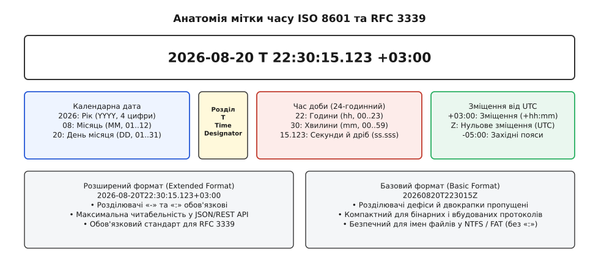
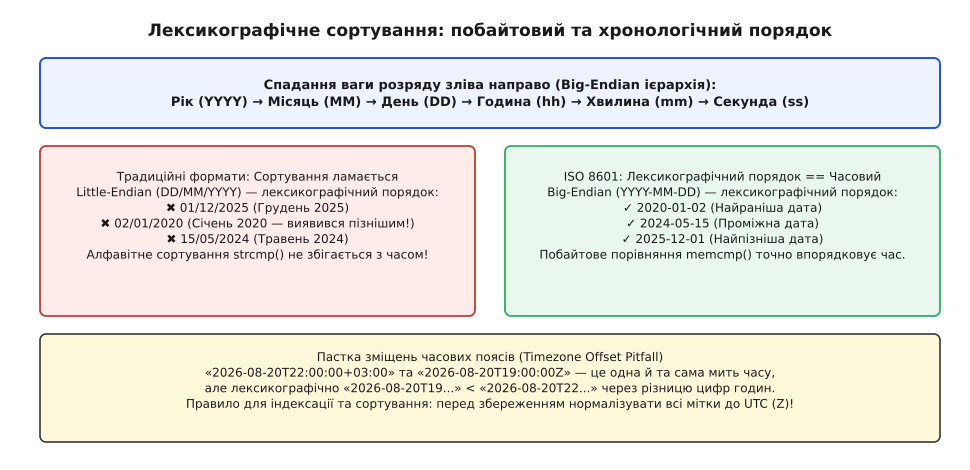
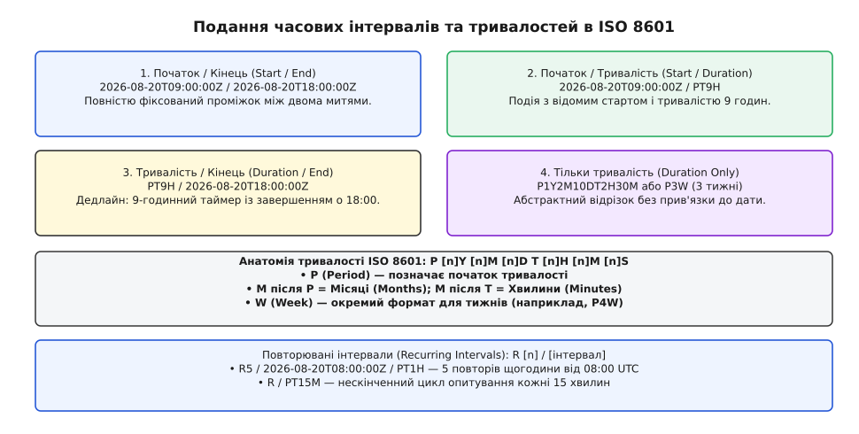
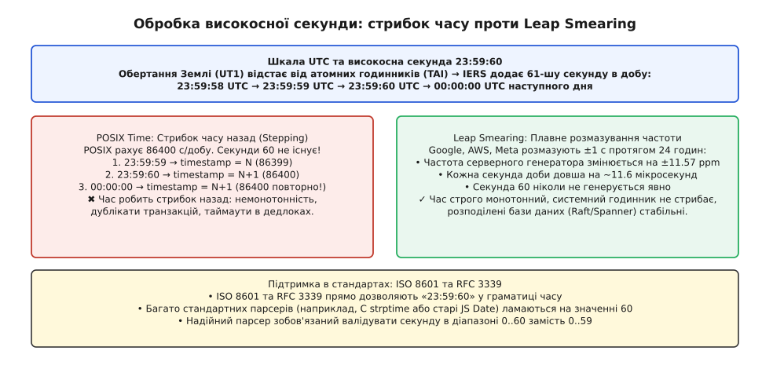
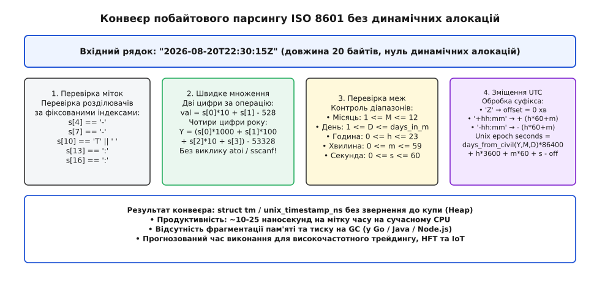

# ISO 8601: подання дати й часу

<preknowlist>
- [Мітки часу файлів](book:programming/file-timestamps) — цілочисельний лічильник епохи Unix та його межі для вимірювання фізичного часу.
- [Серіалізація без копіювання](book:programming/zero-copy-serialization) — принципи потокового читання байтів без виділення динамічної пам'яті.
- [Доповняльний код (числа зі знаком)](book:programming/twos-complement) — машинна арифметика та побітові операції над цілими числами.
</preknowlist>

У розподіленій банківській системі щосекунди обробляються тисячі транзакцій між серверами в Лондоні, Нью-Йорку та Токіо. Якщо лондонський сервер запише у спільну базу даних час здійснення платежу як `05/06/07 08:09:10`, система в Нью-Йорку розпізнає цей запис як 6 травня 2007 року, тоді як у Лондоні мали на увазі 5 червня 2007 року, а аналітичний модуль у Токіо прочитає його як 7 червня 2005 року. Через неоднозначність порядку чисел алгоритми виявлення шахрайства дадуть хибне спрацьовування, автоматизований аудит заблокує баланс, а сортування журналу транзакцій перемішає події, що відбулися з різницею у два роки.

Причина цієї катастрофи криється в історичному конфлікті трьох різних порядків запису дат: європейського Little-Endian (`день/місяць/рік`), американського Middle-Endian (`місяць/день/рік`) та східноазійського Big-Endian (`рік/місяць/день`). Коли до цього додаються довільні текстові роздільники (`/`, `.`, `-`, пробіли), скорочення років до двох останніх цифр та неврахування локальних часових поясів, рядкове представлення часу стає джерелом критичних помилок.

Для усунення цієї невизначеності Міжнародна організація зі стандартизації створила єдиний універсальний стандарт — **ISO 8601** (міжнародний стандарт подання дат і часу, вперше прийнятий у 1988 році). Його фундаментальний принцип полягає у суворій ієрархії від найбільшої одиниці часу до найменшої з фіксованою розрядністю кожного поля. Детальний шлях від локального хаосу до прийняття цього стандарту викладено у вставці [Історія уніфікації календарних форматів](book:programming/iso-8601/hist-calendar-chaos.md).

## Анатомія мітки часу: від календаря до часток секунди

Головна форма запису моменту часу в стандарті ISO 8601 об'єднує календарну дату, маркер переходу, час доби та вказівку на часовий пояс у єдиний неперервний рядок:

```
2026-08-20T22:30:15.123+03:00
```

Кожен компонент цього рядка займає чітко визначене місце і виконує конкретну функцію при синтаксичному аналізі:

1. **Календарна дата (`2026-08-20`):**
   * `2026` — рік (Year, `YYYY`), строго 4 цифри в діапазоні від `0000` до `9999`. За стандартом ISO 8601-1:2019 роки до нашої ери або роки далекого майбутнього (понад 4 розряди) позначаються явним знаком зі збільшеною кількістю цифр за попередньою згодою сторін (наприклад, `+02026` або `-0044` для 45 року до н.е. в астрономічній системі).
   * `-` — обов'язковий дефіс-розділювач у розширеному форматі.
   * `08` — календарний місяць (Month, `MM`), строго дві цифри від `01` (січень) до `12` (грудень). Провідний нуль обов'язковий.
   * `20` — день місяця (Day, `DD`), дві цифри від `01` до `31` (з урахуванням тривалості конкретного місяця та високосного статусу року).

2. **Розділювач дати й часу (`T`):**
   * Символ `T` (Time designator) слугує однозначним маркером межі між календарною частиною та часом доби. Наявність літери `T` унеможливлює сплутування часу з числовими модифікаторами дати при потоковому лексичному аналізі.

3. **Час доби (`22:30:15.123`):**
   * `22` — години (Hour, `hh`), дві цифри у 24-годинній шкалі від `00` до `23` (значення `24:00:00` дозволяється виключно в ISO 8601 для позначення кінця доби, що збігається з початком наступної).
   * `:` — двокрапка-розділювач компонентів часу.
   * `30` — хвилини (Minute, `mm`), дві цифри від `00` до `59`.
   * `15` — секунди (Second, `ss`), дві цифри від `00` до `59` (або `60` для високосної секунди).
   * `.123` — десяткова дробова частка секунди (Subseconds). Вона відділяється крапкою або комою і може мати довільну точність: три цифри для мілісекунд (`.123`), шість для мікросекунд (`.123456`) або дев'ять для наносекунд (`.123456789`).

4. **Зміщення відносно Всесвітнього координованого часу (`+03:00` або `Z`):**
   * `+03:00` — явне числове зміщення локального часу відносно нульового меридіана UTC у годинах та хвилинах.
   * `Z` — спеціальний суфікс (Zulu time), що замінює `+00:00` і стверджує, що вказаний час виміряно безпосередньо за шкалою UTC.


*Компоненти розширеного формату ISO 8601: фіксована ширина полів, розділювач дати й часу T та зміщення часового поясу.*

### Пролептичний грегоріанський календар

Стандарт ISO 8601 поширює правила сучасного грегоріанського календаря назад у минуле на весь період людської історії — цей принцип називається **пролептичним грегоріанським календарем (proleptic Gregorian calendar)**.

В реальній історії папа Григорій XIII запровадив календарну реформу в жовтні 1582 року, коли після 4 жовтня одразу настало 15 жовтня, щоб виправити накопичену за півтори тисячі років похибку юліанського календаря. Різні країни переходили на грегоріанський стиль у різний час: Велика Британія та її колонії — у 1752 році, Швеція — у 1753 році, а Україна — у лютому 1918 року.

Для програмних систем обробка історичних розривів у календарях різних країн була б джерелом безкінечних збоїв у розрахунках часових інтервалів. Тому ISO 8601 вимагає проектувати поточне правило високосних років (рік ділиться на 4, але не ділиться на 100, окрім тих, що діляться на 400) необмежено назад у минуле. Відтак дата `1500-02-29` за ISO 8601 не існує (бо 1500 ділиться на 100 і не ділиться на 400), хоча за тодішнім юліанським календарем цей день реально святкували.

Крім того, ISO 8601 використовує астрономічну нумерацію років:
* Рік 1 нашої ери позначається як `0001`.
* Рік 1 до нашої ери позначається як `0000` (в історичних джерелах року «нуль» немає, після 1 до н.е. одразу йде 1 н.е.).
* Рік 2 до нашої ери позначається як `-0001`.
* Рік 45 до нашої ери позначається як `-0044`.

Це дозволяє обчислювати різницю між роками простим арифметичним відніманням цілих чисел.

### Базовий та розширений формати

Стандарт ISO 8601 визначає два варіанти синтаксису: **розширений (Extended Format)** та **базовий (Basic Format)**.

* **Розширений формат (`YYYY-MM-DDThh:mm:ssZ`):** містить дефіси між полями дати та двокрапки між полями часу. Він забезпечує максимальну візуальну читабельність для людини і є обов'язковим стандартом у текстових протоколах JSON, REST API та веб-сервісах.
* **Базовий формат (`YYYYMMDDThhmmssZ`):** повністю опускає дефіси та двокрапки, залишаючи лише цифри та літерні маркери. Він зменшує довжину рядка на 4 байти (16 байтів замість 20 для секундної точності в UTC).

Базовий формат незамінний у двох інженерних сценаріях:
1. **Імена файлів у файлових системах:** операційні системи Windows (файлові системи NTFS та FAT) забороняють використання символу двокрапки `:` в іменах файлів, оскільки двокрапка зарезервована для позначення альтернативних потоків даних (NTFS Alternate Data Streams) та букв дисків. Рядок базового формату `20260820T223015Z.log` є коректним і валідним ім'ям файлу на будь-якій платформі (POSIX, Windows, macOS, RTOS).
2. **Вбудовані системи та радіопротоколи з обмеженою пропускною здатністю:** відсутність розділювачів економить дорогоцінні байти в кадрах протоколів LoRaWAN, CAN-bus або телеметрії супутників CubeSat.

## Часові пояси, зміщення та ілюзія локального часу

Найпоширеніша помилка в архітектурі програмного забезпечення — ототожнення **числового зміщення (UTC offset)** із **часовим поясом (Timezone)**.

* **Зміщення (Offset)** — це суто математична різниця між локальним часом і шкалою UTC у конкретний момент часу. Воно виражається фіксованим числом: `+02:00`, `+03:00`, `-05:00`. Зміщення нічого не знає про географічні кордони, політичні рішення чи перехід на літній час.
* **Часовий пояс (Timezone)** — це геополітичний регіон (ідентифікований за базою IANA, наприклад `Europe/Kyiv` або `America/New_York`), який має складний набір історичних, поточних і майбутніх правил зміни зміщень (Daylight Saving Time, DST).

У місті Київ взимку діє зміщення `+02:00` (EET, Eastern European Time), а влітку — `+03:00` (EEST, Eastern European Summer Time). Отже, часовий пояс `Europe/Kyiv` містить у собі обидва ці зміщення залежно від дати.

```
Мітка 1 (Зима):  2026-01-15T12:00:00+02:00  [Київський зимовий час]
Мітка 2 (Літо):  2026-07-15T12:00:00+03:00  [Київський літній час]
```

Якщо програма зберігає лише рядок `2026-08-20T22:30:15` без індикатора `Z` або зміщення `+03:00`, такий час називається **наївним (naive / floating time)**. У розподіленій системі наївний час є критичним дефектом: якщо вузол у Франкфурті отримає таку мітку, він не знає, чи це час за Гринвічем, час клієнта в Токіо чи локальний час німецького сервера.

> 🔧 **Навіщо це.**
> В інженерній практиці діє непорушне правило збереження та передачі даних:
> 1. **Історичні факти та системні події (логи, транзакції, сенсорні виміри, створення записів):** завжди конвертуються у Всесвітній координований час і зберігаються із суфіксом `Z` (наприклад, `2026-08-20T19:30:15Z`). Це гарантує лінійність часу та коректність математичних різниць.
> 2. **Майбутні заплановані події (авіарейси, зустрічі в календарі, будильники):** повинні зберігатися у локальному часі разом із назвою часового поясу IANA за стандартом RFC 9557 (наприклад, `2027-06-15T09:00:00+03:00[Europe/Kyiv]`). Якщо уряд змінить правила переходу на літній час або скасує його до настання 2027 року, літак має злетіти рівно о 09:00 за локальним київським годинником, хоча еквівалентне числове значення в UTC зміниться.

## RFC 3339: інтернет-профіль ISO 8601

Сам по собі стандарт ISO 8601 містить занадто багато необов'язкових варіантів подання: він дозволяє опускати секунди, використовувати тижневі дати (`2026-W34-4`), порядкові дні року (`2026-232`), комбінувати розділювачі або писати двозначні роки. Для розробників мережевих протоколів такий обсяг варіативності був надмірним тягарем.

У 2002 році інженерна група IETF випустила документ **RFC 3339** («Date and Time on the Internet: Timestamps»), який звузив неосяжний стандарт ISO 8601 до строгого, однозначного підмножинного профілю для використання в Інтернеті.

RFC 3339 встановив такі обов'язкові правила:
* Рік зобов'язаний мати строго 4 цифри (`YYYY`). Двозначні роки суворо заборонені.
* Дозволено лише розширений формат із дефісами та двокрапками. Базовий формат без розділювачів заборонений у стандартному обміні.
* Порядкові дні року та номери тижнів заборонені: дозволено лише класичні календарні дати `YYYY-MM-DD`.
* Дозволено використовувати малі літери `t` та `z` замість великих `T` та `Z` (хоча великі залишаються рекомендованими).
* Дозволено замінювати розділювач `T` на звичайний пробіл ` ` (`2026-08-20 22:30:15Z`), що спростило пряму інтеграцію з мовами SQL та текстовими журналами операційних систем.
* **Спеціальне значення зміщення `-00:00`:** стандарт ISO 8601 не робить різниці між `+00:00` та `-00:00`. RFC 3339 надав знаку мінус у нульовому зміщенні особливу семантику: рядок `2026-08-20T22:30:15-00:00` означає, що час вказано за локальним годинником пристрою, але точне зміщення його часового поясу відносно UTC невідоме (наприклад, автономний датчик без доступу до GPS чи NTP). Парсер не має права вважати цей час точним UTC, на відміну від суфікса `Z` або `+00:00`.

Повні граматичні правила ABNF та порівняльні таблиці відмінностей наведено у вставці [Специфікація граматики та довідник форматів](book:programming/iso-8601/api-format-reference.md).

## Лексикографічне сортування: магія Big-Endian у тексті

Однією з найелегантніших властивостей стандарту ISO 8601 є повний збіг **лексикографічного (алфавітного) порядку байтів** із **хронологічним порядком часу**.

Якщо зберегти список дат у форматі `YYYY-MM-DDThh:mm:ssZ` як звичайні текстові рядки й викликати стандартну функцію порівняння рядків (`strcmp()` у C, `std::string::operator<` у C++, `strings.Compare()` у Go чи оператор `<` у Python), результат сортування виявиться абсолютно точним хронологічним упорядкуванням.


*Лексикографічне упорядкування рядків ISO 8601: збіг алфавітного та хронологічного порядку завдяки спадній ієрархії одиниць.*

Цей ефект досягається завдяки трьом фундаментальним інваріантам дизайну:

1. **Спадання ваги розряду зліва направо (Big-Endian):**
   У позиційних системах числення старші розряди визначають більшу величину, ніж молодші. У рядку ISO 8601 перший символ зліва — це тисячоліття, потім століття, десятиліття, рік, місяць, день, година, хвилина, секунда і частка секунди. Коли функція порівняння йде побайтово зліва направо, вона натрапляє на найвагомішу різницю в першу чергу. Якщо роки різняться (`2025` проти `2026`), результат вирішується на перших же чотирьох байтах, а значення місяців чи секунд навіть не перевіряються.

2. **Фіксована ширина з провідними нулями:**
   Якби місяці або дні записувалися без провідних нулів, лексикографічне сортування негайно зламалося б:
   ```
   Текстове сортування без нулів:
   "2026-1-1"
   "2026-10-1"
   "2026-2-1"   <-- Помилка! Лютий (2) став пізнішим за Жовтень (10), бо '2' > '1'
   ```
   Фіксована ширина гарантує, що символ `'0'` у рядку `"2026-02-01"` завжди менший за символ `'1'` у рядку `"2026-10-01"`, тому хронологічний порядок зберігається бездоганно.

3. **Коди символів ASCII:**
   Цифри `'0'`..`'9'` мають послідовні числові коди в таблиці ASCII від `48` (`0x30`) до `57` (`0x39`). Символи-розділювачі (`-`, `:`, `.`, `T`, `Z`) стоять на однакових позиціях у всіх рядках розширеного формату, тому вони ніколи не порушують відносне порівняння цифр.

### Пастка сортування при наявності зміщень

Лексикографічне сортування працює виключно тоді, коли всі рядки мають **однакове зміщення** (найкраще — коли всі вони нормалізовані до UTC `Z`).

Якщо порівняти два рядки:
* Рядок A: `2026-08-20T22:00:00+03:00` (Київ)
* Рядок B: `2026-08-20T19:00:00Z` (UTC)

Фізично обидва рядки вказують на одну й ту саму секунду в просторі й часі (`22:00 - 3 години = 19:00 UTC`). Проте лексикографічне порівняння `strcmp(A, B)` поверне додатне число (`A > B`), оскільки на 12-й позиції символ `'2'` у рядку `A` більший за символ `'1'` у рядку `B`. Рядкове порівняння не виконує віднімання зміщень.

Тому в архітектурі баз даних (LSM-дерева в RocksDB, індекси B-Tree в PostgreSQL або ключі в Redis) діє залізне правило: **перед індексацією всі мітки часу повинні бути нормалізовані до канонічного вигляду UTC із суфіксом `Z`**.

## Тривалості (Durations) та часові інтервали (Intervals)

Окрім точкових міток часу (Timestamp), стандарт ISO 8601 визначає універсальні структури для вимірювання відрізків часу: **тривалості** та **інтервали**.

### Синтаксис тривалості: `PnYnMnDTnHnMnS`

Тривалість позначає кількість часу, що минув, без прив'язки до конкретної дати початку чи кінця. Рядок тривалості завжди починається з літери `P` (Period):

```
P1Y2M10DT2H30M45S
```

Цей запис розшифровується як: 1 рік (`1Y`), 2 місяці (`2M`), 10 днів (`10D`), маркер часу `T`, 2 години (`2H`), 30 хвилин (`30M`) та 45 секунд (`45S`).


*Чотири форми інтервалів часу та повторювані послідовності в стандарті ISO 8601.*

Критичні правила синтаксису тривалостей:
* **Подвійна роль літери `M`:** літера `M` перед маркером `T` означає місяці (`P2M` = 2 місяці), а після маркера `T` — хвилини (`PT30M` = 30 хвилин). Якщо блок часу відсутній, літера `T` не пишеться (`P3D`), але якщо вказано лише години чи хвилини, маркер `T` є обов'язковим (`PT15M`, але не `P15M`).
* **Тижневий формат:** якщо тривалість вимірюється суто тижнями, використовується суфікс `W`: рядок `P4W` означає рівно 4 тижні (28 діб). Цей формат не можна змішувати з іншими одиницями (запис `P1Y2W` є невалідним).
* **Дробові значення:** дробова частина дозволяється лише для найменшої вказаної одиниці (наприклад, `PT0.5H` для півгодини або `PT10.5S` для десяти з половиною секунд).

### Календарна відносність тривалості

В обчислювальній техніці необхідно суворо розрізняти **фізичну тривалість** (виражену в незмінних секундах СІ) та **календарну тривалість** (виражену в днях, місяцях або роках).

Тривалість `PT86400S` завжди дорівнює рівно 86400 фізичним секундам. Проте тривалість `P1D` (один день) або `P1M` (один місяць) є відносною:
* Додавання `P1D` до мітки `2026-03-28T10:00:00` у країні з переходом на літній час може становити 23 або 25 фізичних годин замість 24.
* Додавання `P1M` до дати `2026-01-31` дасть `2026-02-28` (збільшення на 28 днів), тоді як додавання `P1M` до `2026-07-31` дасть `2026-08-31` (збільшення на 31 день).

Тому арифметичні операції над календарними тривалостями повинні виконуватися виключно календарними рушіями з урахуванням часових поясів, а не простим додаванням секунд до лічильника епохи.

### Чотири форми інтервалів часу

Інтервал часу позначає неперервний проміжок між двома точками. ISO 8601 стандартизує чотири взаємозамінні форми запису інтервалу через скісну риску `/`:

1. **`<Початок>/<Кінець>`:**
   `2026-08-20T08:00:00Z/2026-08-20T17:00:00Z`
   Повністю фіксований проміжок з відомими точками старту та завершення.
2. **`<Початок>/<Тривалість>`:**
   `2026-08-20T08:00:00Z/PT9H`
   Подія розпочинається о 08:00 UTC і триває 9 годин (завершується о 17:00 UTC).
3. **`<Тривалість>/<Кінець>`:**
   `PT9H/2026-08-20T17:00:00Z`
   Встановлення дедлайну: подія повинна тривати 9 годин і завершитися рівно о 17:00 UTC.
4. **Тільки `<Тривалість>`:**
   `P1Y2M10D`
   Абстрактний відрізок часу без фіксації на шкалі календаря.

### Повторювані інтервали (Recurring intervals)

Для опису періодичних розкладів (аналог завдань cron або таймерів) використовується префікс `R`:

```
R5/2026-08-20T08:00:00Z/PT1H
```

Цей запис означає: повторити інтервал рівно 5 разів (`R5`), починаючи з 08:00 UTC з періодичністю в 1 годину (`PT1H`). Якщо кількість повторень опустити (`R/PT15M`), інтервал вважається нескінченним і генерує періодичну подію кожні 15 хвилин без обмеження за часом.

## Високосні секунди та конфлікт із POSIX-часом

Стандарт ISO 8601 та протокол RFC 3339 офіційно дозволяють запис секунди зі значенням `60`:

```
2016-12-31T23:59:60Z
```

Поява цього значення обумовлена фізикою нашої планети: швидкість обертання Землі навколо своєї осі поступово сповільнюється через припливне тертя океанів та гравітаційний вплив Місяця. Через це астрономічний сонячний час (шкала UT1) відстає від абсолютно стабільного атомного часу (шкала TAI, International Atomic Time).

Щоб синхронізувати сонячний день з атомним годинником, Міжнародна служба обертання Землі (IERS) періодично вставляє у Всесвітній координований час (UTC) додаткову **високосну секунду (Leap Second)** наприкінці 30 червня або 31 грудня. У цей момент остання хвилина доби містить не 60, а 61 секунду: `23:59:59` → `23:59:60` → `00:00:00`.


*Вплив високосної секунди: прямий стрибок часу UTC проти лінійного розмазування частоти в розподілених серверах.*

### Конфлікт із POSIX-стандартом

Більшість операційних систем (Linux, macOS, Windows) використовують системний час стандарту **POSIX (Unix Timestamp)**, який рахує кількість секунд від 1 січня 1970 року 00:00:00 UTC. За визначенням стандарту POSIX:
* Кожна доба суворо містить рівно `86400` секунд.
* Високосні секунди в лічильнику `time_t` не враховуються і не нумеруються.

Коли настає високосна секунда, системний таймер стикається з дилемою. Якщо система використовує прямий стрибок (Stepping), відбувається повтор секунди:
1. Час `23:59:59` → лічильник `time_t = 1483228799` (86399-та секунда доби).
2. Час `23:59:60` → лічильник стає `1483228800` (86400-та секунда доби).
3. Час `00:00:00` наступного дня → лічильник знову повертається назад на `1483228800`!

Цей стрибок назад порушує інваріант **монотонності системного годинника** (`monotonicity`). У розподілених базах даних (таких як Cassandra, Spanner, CockroachDB) та фінансових шлюзах повернення часу назад призводить до генерування дублікатів ідентифікаторів, порушення причинно-наслідкових зв'язків (подія-наслідок отримує менший timestamp, ніж подія-причина) та передчасного спрацьовування таймаутів взаємного блокування (deadlock timeouts).

### Інженерне вирішення: Leap Smearing

Щоб уникнути стрибків системного годинника, провідні технологічні компанії (Google, AWS, Meta, Cloudflare) відмовилися від прямого введення 61-ї секунди і впровадили техніку **розмазування високосної секунди (Leap Smearing)** у своїх серверах точного часу NTP.

Замість різкої зупинки або стрибка назад, NTP-сервери штучно сповільнюють або прискорюють частоту генератора тактових імпульсів на величину приблизно `11.57 ppm` (parts per million, тобто на `11.6` мікросекунд на секунду) протягом 24-годинного вікна (за 12 годин до і 12 годин після опівночі). Протягом цього вікна кожна секунда на серверах триває трішки довше, ніж звичайна секунда СІ, плавно поглинаючи додаткову секунду без порушення монотонності лічильника.

Тим не менше, будь-який надійний синтаксичний аналізатор ISO 8601 зобов'язаний коректно приймати значення `ss = 60` у вхідному рядку й інтерпретувати його як 59-ту секунду з відповідним прапорцем, а не скидати помилку парсингу.

## Взаємодія з бінарними мітками часу та проблема 2038 року

У пам'яті комп'ютера час зберігається у вигляді бінарних чисел різної розрядності. Текстовий рядок ISO 8601 слугує проміжним форматом передачі (wire format), який перед використанням у бізнес-логіці конвертується у внутрішнє представлення:

* **POSIX `time_t` (секунди):** історично 32-бітне ціле число зі знаком.
* **POSIX `struct timespec` (наносекунди):** пара з 64-бітного числа секунд `tv_sec` та 32-бітного числа наносекунд `tv_nsec`.
* **Мітки часу в базах даних (PostgreSQL `timestamptz`, MySQL `TIMESTAMP`):** 64-бітне ціле число мікросекунд від 2000-01-01 або 1970-01-01.

### Проблема 2038 року (Y2038)

Знакова 32-бітна змінна `int32_t` може зберігати максимальне значення `2 147 483 647`. У шкалі Unix-часу це відповідає даті:

```
2038-01-19T03:14:07Z
```

Рівно через одну секунду (о 03:14:08 UTC) лічильник переповниться, перетворившись на від'ємне число `-2 147 483 648`, що перенесе комп'ютерні системи у 13 грудня 1901 року. Рядки ISO 8601 цієї проблеми не мають, оскільки чотиризначний рік `YYYY` спокійно записує дати аж до `9999-12-31T23:59:59Z`. Проте парсер, що конвертує ISO 8601 у 32-бітний `time_t`, спричинить фатальне переповнення. Сучасні 64-бітні операційні системи та мови програмування використовують 64-бітний `int64_t` для системного часу, чого вистачить на 292 мільярди років.

## Швидкий парсинг без динамічних алокацій

У високонавантажених мережевих мікросервісах і конвеєрах обробки даних (наприклад, брокерах Apache Kafka, торговельних шлюзах FIX-протоколу або сервісах обробки геоданих) мітки часу у форматі ISO 8601 розбираються мільйони разів на секунду.

Стандартний підхід із використанням регулярних виразів або функцій на кшталт `strptime()` є неприпустимо повільним. Регулярний вираз виділяє динамічну пам'ять у купі (Heap) для збереження збігів, будує дерево станів автомата й витрачає до 1000 наносекунд на одну дату.

Оскільки розширений формат ISO 8601 має фіксовану довжину, його можна розібрати прямим доступом до байтів на стеку за 10–20 наносекунд без жодного виділення пам'яті.


*Конвеєр побайтового парсингу фіксованої довжини без виділення пам'яті в купі.*

### Арифметика символів без функції `atoi`

Кожен десятковий символ у таблиці ASCII має код `val = char - '0'`. Оскільки `'0' == 48`, дві послідовні цифри `s[0]` та `s[1]` перетворюються у числове значення однією цілочисельною операцією:

```
val = (s[0] - 48) * 10 + (s[1] - 48)
    = s[0] * 10 + s[1] - 480 - 48
    = s[0] * 10 + s[1] - 528
```

Аналогічно чотири цифри року `s[0..3]` обчислюються як:

```
year = s[0] * 1000 + s[1] * 100 + s[2] * 10 + s[3] - 53328
```
де `53328 = 48 * 1000 + 48 * 100 + 48 * 10 + 48 = 48 * 1111`.

Ця формула не містить циклів, викликів підпрограм чи розгалужень, що дозволяє компілятору транслювати її в кілька простих інструкцій процесора `lea` та `sub`.

### Робочий зразок швидкого парсера

Нижче наведено порівняння ідіоматичного швидкого парсера мовами C, C++, Go та Rust, який розбирає рядок у секунди епохи Unix без звернення до купи:

:::tabs
```c
#include <stdint.h>
#include <stdbool.h>
#include <stddef.h>

typedef struct {
    int64_t unix_seconds;
    int16_t offset_minutes;
    bool valid;
} fast_time_t;

/* Алгоритм Говарда Гіннанта: цивільна дата -> дні від 1970-01-01 */
static inline int64_t civil_to_days(int32_t y, uint32_t m, uint32_t d) {
    y -= (m <= 2);
    const int32_t era = (y >= 0 ? y : y - 399) / 400;
    const uint32_t yoe = (uint32_t)(y - era * 400);
    const uint32_t doy = (153 * (m > 2 ? m - 3 : m + 9) + 2) / 5 + d - 1;
    const uint32_t doe = yoe * 365 + yoe / 4 - yoe / 100 + doy;
    return (int64_t)era * 146097 + (int64_t)doe - 719468;
}

fast_time_t parse_iso8601(const char* s, size_t len) {
    fast_time_t res = {0, 0, false};
    if (len < 20 || s[4] != '-' || s[7] != '-' || (s[10] != 'T' && s[10] != ' ') ||
        s[13] != ':' || s[16] != ':') {
        return res;
    }

    const int32_t year = (int32_t)(s[0]*1000 + s[1]*100 + s[2]*10 + s[3] - 53328);
    const uint32_t mon = (uint32_t)(s[5]*10 + s[6] - 528);
    const uint32_t day = (uint32_t)(s[8]*10 + s[9] - 528);
    const uint32_t h   = (uint32_t)(s[11]*10 + s[12] - 528);
    const uint32_t min = (uint32_t)(s[14]*10 + s[15] - 528);
    uint32_t sec       = (uint32_t)(s[17]*10 + s[18] - 528);

    if (mon < 1 || mon > 12 || day < 1 || day > 31 || h > 23 || min > 59 || sec > 60) {
        return res;
    }
    if (sec == 60) sec = 59; // врахування високосної секунди

    int16_t off = 0;
    if (s[19] == 'Z' || s[19] == 'z') {
        off = 0;
    } else if ((s[19] == '+' || s[19] == '-') && len >= 25 && s[22] == ':') {
        const uint32_t oh = (uint32_t)(s[20]*10 + s[21] - 528);
        const uint32_t om = (uint32_t)(s[23]*10 + s[24] - 528);
        if (oh > 23 || om > 59) return res;
        off = (int16_t)(oh * 60 + om);
        if (s[19] == '-') off = -off;
    } else {
        return res;
    }

    const int64_t days = civil_to_days(year, mon, day);
    res.unix_seconds = days * 86400 + (int64_t)h * 3600 + (int64_t)min * 60 + sec - (int64_t)off * 60;
    res.offset_minutes = off;
    res.valid = true;
    return res;
}
```
```cpp
#include <string_view>
#include <optional>
#include <chrono>
#include <cstdint>

struct ParsedTimestamp {
    std::chrono::sys_seconds utc_time{};
    int16_t offset_minutes{0};
    bool leap_second{false};
};

class Iso8601Parser {
    static constexpr int64_t civil_to_days(int32_t y, uint32_t m, uint32_t d) noexcept {
        y -= (m <= 2);
        const int32_t era = (y >= 0 ? y : y - 399) / 400;
        const uint32_t yoe = static_cast<uint32_t>(y - era * 400);
        const uint32_t doy = (153 * (m > 2 ? m - 3 : m + 9) + 2) / 5 + d - 1;
        const uint32_t doe = yoe * 365 + yoe / 4 - yoe / 100 + doy;
        return static_cast<int64_t>(era) * 146097 + static_cast<int64_t>(doe) - 719468;
    }

    static constexpr uint32_t p2(const char* s) noexcept {
        return static_cast<uint32_t>(s[0] * 10 + s[1] - 528);
    }
    static constexpr uint32_t p4(const char* s) noexcept {
        return static_cast<uint32_t>(s[0] * 1000 + s[1] * 100 + s[2] * 10 + s[3] - 53328);
    }

public:
    static constexpr std::optional<ParsedTimestamp> parse(std::string_view sv) noexcept {
        if (sv.size() < 20 || sv[4] != '-' || sv[7] != '-' ||
            (sv[10] != 'T' && sv[10] != ' ') || sv[13] != ':' || sv[16] != ':') {
            return std::nullopt;
        }

        const auto year = static_cast<int32_t>(p4(sv.data()));
        const auto mon  = p2(sv.data() + 5);
        const auto day  = p2(sv.data() + 8);
        const auto hour = p2(sv.data() + 11);
        const auto min  = p2(sv.data() + 14);
        const auto sec  = p2(sv.data() + 17);

        if (mon < 1 || mon > 12 || day < 1 || day > 31 || hour > 23 || min > 59 || sec > 60) {
            return std::nullopt;
        }

        const bool is_leap = (sec == 60);
        const uint32_t eff_sec = is_leap ? 59 : sec;

        int16_t offset_mins = 0;
        if (sv[19] == 'Z' || sv[19] == 'z') {
            offset_mins = 0;
        } else if ((sv[19] == '+' || sv[19] == '-') && sv.size() >= 25 && sv[22] == ':') {
            const auto oh = p2(sv.data() + 20);
            const auto om = p2(sv.data() + 23);
            if (oh > 23 || om > 59) return std::nullopt;
            offset_mins = static_cast<int16_t>(oh * 60 + om);
            if (sv[19] == '-') offset_mins = -offset_mins;
        } else {
            return std::nullopt;
        }

        const auto days = civil_to_days(year, mon, day);
        const auto local_secs = days * 86400 + hour * 3600 + min * 60 + eff_sec;
        const auto utc_secs = local_secs - offset_mins * 60;

        return ParsedTimestamp{
            std::chrono::sys_seconds{std::chrono::seconds{utc_secs}},
            offset_mins,
            is_leap
        };
    }
};
```
```go
package iso8601

import (
	"errors"
	"time"
)

var ErrInvalidTimestamp = errors.New("malformed iso8601 timestamp")

func civilToDays(y int, m, d uint) int64 {
	if m <= 2 {
		y--
	}
	era := y / 400
	if y < 0 {
		era = (y - 399) / 400
	}
	yoe := uint(y - era*400)
	var mo uint = m + 9
	if m > 2 {
		mo = m - 3
	}
	doy := (153*mo+2)/5 + d - 1
	doe := yoe*365 + yoe/4 - yoe/100 + doy
	return int64(era)*146097 + int64(doe) - 719468
}

func ParseFastUTC(s string) (time.Time, error) {
	if len(s) < 20 || s[4] != '-' || s[7] != '-' ||
		(s[10] != 'T' && s[10] != ' ') || s[13] != ':' || s[16] != ':' {
		return time.Time{}, ErrInvalidTimestamp
	}

	year := int(uint(s[0])*1000 + uint(s[1])*100 + uint(s[2])*10 + uint(s[3]) - 53328)
	mon := uint(s[5])*10 + uint(s[6]) - 528
	day := uint(s[8])*10 + uint(s[9]) - 528
	hour := uint(s[11])*10 + uint(s[12]) - 528
	min := uint(s[14])*10 + uint(s[15]) - 528
	sec := uint(s[17])*10 + uint(s[18]) - 528

	if mon < 1 || mon > 12 || day < 1 || day > 31 || hour > 23 || min > 59 || sec > 60 {
		return time.Time{}, ErrInvalidTimestamp
	}
	if sec == 60 {
		sec = 59
	}

	var offsetSecs int64
	if s[19] == 'Z' || s[19] == 'z' {
		offsetSecs = 0
	} else if (s[19] == '+' || s[19] == '-') && len(s) >= 25 && s[22] == ':') {
		oh := int64(uint(s[20])*10 + uint(s[21]) - 528)
		om := int64(uint(s[23])*10 + uint(s[24]) - 528)
		if oh > 23 || om > 59 {
			return time.Time{}, ErrInvalidTimestamp
		}
		offsetSecs = oh*3600 + om*60
		if s[19] == '-' {
			offsetSecs = -offsetSecs
		}
	} else {
		return time.Time{}, ErrInvalidTimestamp
	}

	days := civilToDays(year, mon, day)
	utcSecs := days*86400 + int64(hour)*3600 + int64(min)*60 + int64(sec) - offsetSecs

	return time.Unix(utcSecs, 0).UTC(), nil
}
```
```rust
#[derive(Debug, Clone, Copy, PartialEq, Eq)]
pub struct FastTimestamp {
    pub unix_seconds: i64,
    pub offset_minutes: i16,
}

#[inline(always)]
fn civil_to_days(mut y: i32, m: u32, d: u32) -> i64 {
    if m <= 2 {
        y -= 1;
    }
    let era = if y >= 0 { y } else { y - 399 } / 400;
    let yoe = (y - era * 400) as u32;
    let doy = (153 * if m > 2 { m - 3 } else { m + 9 } + 2) / 5 + d - 1;
    let doe = yoe * 365 + yoe / 4 - yoe / 100 + doy;
    (era as i64) * 146097 + (doe as i64) - 719468
}

pub fn parse_iso8601(bytes: &[u8]) -> Result<FastTimestamp, ()> {
    if bytes.len() < 20 || bytes[4] != b'-' || bytes[7] != b'-'
        || (bytes[10] != b'T' && bytes[10] != b' ') || bytes[13] != b':' || bytes[16] != b':' {
        return Err(());
    }

    let year = (bytes[0] as u32 * 1000 + bytes[1] as u32 * 100 + bytes[2] as u32 * 10 + bytes[3] as u32 - 53328) as i32;
    let mon  = bytes[5] as u32 * 10 + bytes[6] as u32 - 528;
    let day  = bytes[8] as u32 * 10 + bytes[9] as u32 - 528;
    let hour = bytes[11] as u32 * 10 + bytes[12] as u32 - 528;
    let min  = bytes[14] as u32 * 10 + bytes[15] as u32 - 528;
    let mut sec = bytes[17] as u32 * 10 + bytes[18] as u32 - 528;

    if mon < 1 || mon > 12 || day < 1 || day > 31 || hour > 23 || min > 59 || sec > 60 {
        return Err(());
    }
    if sec == 60 { sec = 59; }

    let mut offset_mins = 0i16;
    if bytes[19] == b'Z' || bytes[19] == b'z' {
        offset_mins = 0;
    } else if (bytes[19] == b'+' || bytes[19] == b'-') && bytes.len() >= 25 && bytes[22] == b':' {
        let oh = (bytes[20] as u32 * 10 + bytes[21] as u32 - 528) as i16;
        let om = (bytes[23] as u32 * 10 + bytes[24] as u32 - 528) as i16;
        if oh > 23 || om > 59 { return Err(()); }
        offset_mins = oh * 60 + om;
        if bytes[19] == b'-' { offset_mins = -offset_mins; }
    } else {
        return Err(());
    }

    let days = civil_to_days(year, mon, day);
    let local_secs = days * 86400 + (hour as i64) * 3600 + (min as i64) * 60 + (sec as i64);
    let utc_secs = local_secs - (offset_mins as i64) * 60;

    Ok(FastTimestamp {
        unix_seconds: utc_secs,
        offset_minutes: offset_mins,
    })
}
```
:::

Повний модуль високопродуктивного парсера та зворотного форматера з підтримкою наносекундної точності та бенчмарками наведено у вставці [Швидкий парсер та форматер ISO 8601 без виділення пам'яті](book:programming/iso-8601/proj-fast-iso8601.md).

## Підсумок і системні інваріанти

Стандарт ISO 8601 та його профіль RFC 3339 заклали непорушну основу для обміну даними між комп'ютерними системами у всьому світі.

Головні інженерні принципи, що випливають із дизайну стандарту:
1. **Ієрархія Big-Endian:** порядок `Рік → Місяць → День → Час` гарантує збіг алфавітного та хронологічного сортування.
2. **Незмінність UTC у сховищах:** усі часові мітки подій минулого повинні зберігатися в канонічному форматі UTC (`Z`), а зміщення та назви зон IANA використовуються виключно для відображення людині або планування майбутніх подій.
3. **Фіксований розмір та нуль алокацій:** суворість розширеного формату дозволяє відмовитися від повільних бібліотек та обробляти мільйони міток часу за лічені наносекунди за допомогою прямої побайтової арифметики.
