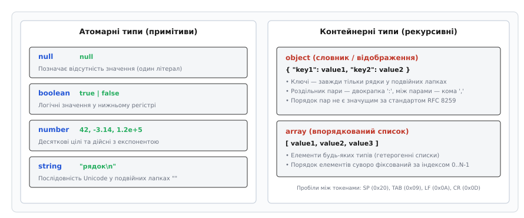
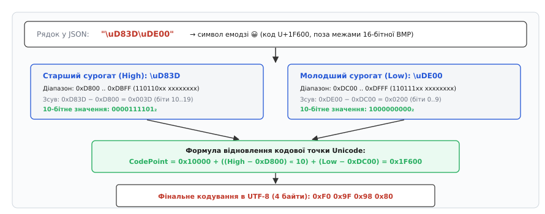
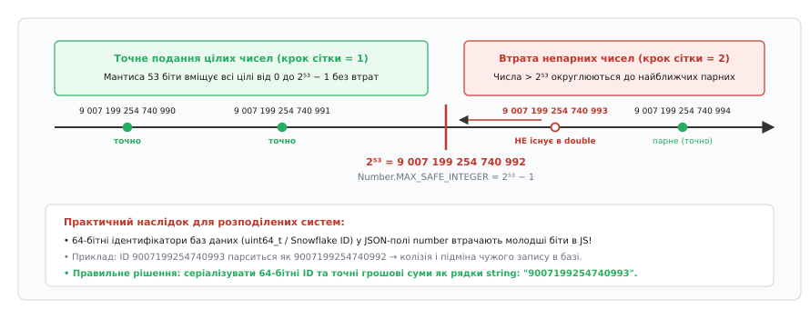
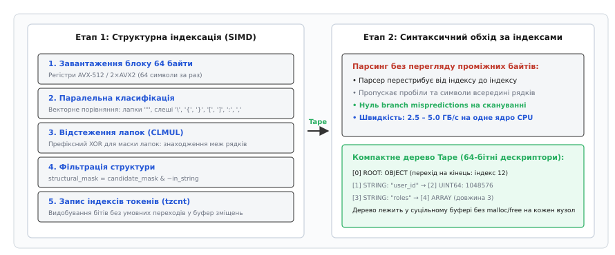

# JSON: текстове подання об'єктів і масивів

<preknowlist>
- [Лексичний аналіз](topic:programming/lexer-design) — розбиття вхідного тексту на токени, скінченні автомати та пропуск пробільних символів.
- [Формати без копіювання: доступ до полів просто в буфері](topic:programming/zero-copy-serialization) — чому створення об'єктних дерев у пам'яті споживає ресурси процесора та пам'ять.
- [Доповняльний код (числа зі знаком)](topic:programming/twos-complement) — представлення цілих чисел у двійковій системі та межі розрядності.
</preknowlist>

Два сервіси в розподіленій системі обмінюються замовленнями через HTTP API: перший відправляє 64-бітний числовий ключ транзакції `9007199254740993`, але після розбору текстового повідомлення на стороні клієнта у змінній опиняється `9007199254740992` — і запит списує кошти з чужого рахунку. Одночасно інший мікросервіс аварійно завершує роботу, бо текстовий рядок містив чотирибайтний юнікодний символ емодзі, записаний парою шістнадцяткових ескейп-послідовностей, які синтаксичний аналізатор не зміг коректно зібрати в єдиний UTF-8 потік байтів. Обидва збої відбулися в системі, яка використовує найпоширеніший формат обміну даними у світі — **JSON** (англ. *JavaScript Object Notation*, від латинського *notatio* — позначення, запис). Текстове подання здається оманливо простішим за двійкові структури, проте за його шістьма синтаксичними конструкціями стоїть строга математична граматика, апаратні обмеження двійкової арифметики з рухомою комою та проблеми швидкодії побайтового аналізу.

### Два стандарти одного формату: синтаксичний ECMA-404 та мережевий RFC 8259

Формат JSON унікальний тим, що його одночасно описують два чинні міжнародні документи, які мають різну мету, сферу застосування та рівень інженерної строгості:

1. **ECMA-404 (Ecma International, перше видання — 2013 рік):** Суто синтаксичний стандарт. Він визначає виключно формальну граматику символів — які послідовності байтів є синтаксично валідним текстом JSON, а які ні. ECMA-404 свідомо не накладає жодних обмежень на семантику та поведінку середовища виконання: він не визначає, чи мають ключі в об'єкті бути унікальними, не обмежує діапазон чи точність чисел, не задає максимальну глибину вкладеності контейнерів і не фіксує обов'язкове кодування символів.
2. **RFC 8259 (IETF, стандарт STD 90, 2017 рік):** Мережевий стандарт взаємосумісності (*interoperability*, від латинського *inter* — між, та *operari* — діяти). Він описує, як комп'ютерні системи повинні генерувати та споживати JSON у реальних мережевих протоколах (HTTP, WebSockets). RFC 8259 встановлює жорсткі інженерні вимоги:
   - **Обов'язкове кодування UTF-8:** Усі тексти JSON, що передаються між незалежними системами, **мусять** кодуватися в UTF-8. Старіші специфікації (зокрема RFC 4627) допускали UTF-16 і UTF-32, проте RFC 8259 остаточно заборонив їх для міжсистемного обміну без попередньої приватної домовленості сторін.
   - **Заборона мітки порядку байтів (BOM):** Мережевий потік JSON не повинен починатися з юнікодної мітки `U+FEFF` (байти `0xEF 0xBB 0xBF` в UTF-8), а аналізатори не мають права покладатися на її наявність для визначення кодування.
   - **Унікальність ключів в об'єктах:** Хоча синтаксична граматика допускає дублікати ключів, RFC 8259 попереджає, що поведінка парсерів при отриманні `{"a": 1, "a": 2}` є невизначеною: одні бібліотеки перезаписують значення останнім, інші створюють масив або генерують фатальну помилку розбору. Тому серіалізатори зобов'язані видавати лише унікальні ключі.
   - **MIME-тип:** Офіційним медіа-типом закріплено `application/json`.

Характерною рисою формату є повна **відсутність коментарів**. У синтаксисі немає конструкцій на кшталт `//` чи `/* ... */`. Це було свідомим рішенням автора формату Дугласа Крокфорда: як показав досвід HTML, XML і директив препроцесорів мов програмування, поява коментарів неминуче спонукає розробників інструментів вбудовувати всередину них власні директиви парсерів, прагми налагодження чи інструкції типізації. Щойно парсер починає покладатися на вміст коментарів, документ перестає бути універсальним: файл, створений під одну бібліотеку, ламається або поводиться інакше в іншій. Повна відсутність коментарів гарантує, що документ JSON є нейтральним каналом передавання стану даних. Детальний історичний контекст появи формату та протистояння з важковаговим XML розбирає [📜 Відкриття JSON: від вилучення XML до світового стандарту](topic:programming/json-format/hist-crockford-discovery.md).

### Шість базових типів та структурна граматика

Формальна граматика JSON у розширеній формі Бекуса–Наура (EBNF) визначається набором простих продукцій:

```ebnf
JSON-text = ws , value , ws ;
ws        = { "\u0020" | "\u0009" | "\u000A" | "\u000D" } ;
value     = "false" | "null" | "true" | object | array | number | string ;
object    = "{" , ws , [ member , { ws , "," , ws , member } ] , ws , "}" ;
member    = string , ws , ":" , ws , value ;
array     = "[" , ws , [ value  , { ws , "," , ws , value  } ] , ws , "]" ;
```

Увесь інформаційний простір документів будується рівно з **шести базових типів**.


*Шість базових типів JSON. Чотири атомарні типи (`null`, `boolean`, `number`, `string`) несуть кінцеві значення; два контейнерні типи (`object`, `array`) задають рекурсивні ієрархічні структури. Пробільні символи дозволені між будь-якими лексичними токенами.*

Типи поділяються на дві категорії:

1. **Атомарні (примітивні) типи:**
   - `null`: Літерал `null` виключно у нижньому регістрі. Позначає відсутність значення або порожній покажчик.
   - `boolean`: Два літерали `true` та `false` у нижньому регістрі.
   - `number`: Десяткове число довільної довжини зі знаком, дробовою частиною та десятковим порядком.
   - `string`: Послідовність із нуля або більше юнікодних символів, обов'язково взята в **подвійні лапки** `""`.
2. **Контейнерні (структурні) типи:**
   - `object`: Невпорядкований набір пар «ключ-значення», обмежений фігурними дужками `{}`. Ключем **завжди** виступає рядок `string`. Роздільником між ключем і значенням є двокрапка `:`, а між парами — кома `,`.
   - `array`: Впорядкована послідовність значень довільних типів, обмежена квадратними дужками `[]`. Елементи розділяються комами `,`.

Між структурними токенами (`{`, `}`, `[`, `]`, `:`, `,`) дозволено довільну кількість **пробільних символів** (*whitespace*):
- Звичайний пробіл `SP` (ASCII `0x20`);
- Горизонтальна табуляція `TAB` (ASCII `0x09`);
- Переведення рядка `LF` (ASCII `0x0A`);
- Повернення каретки `CR` (ASCII `0x0D`).

Будь-які інші недруковані чи керівні символи за межами рядків є синтаксичною помилкою.

У JSON навмисно **відсутні** складні типи мов програмування:
- Немає типу дати й часу (дати передають як рядки стандарту ISO 8601, наприклад `"2026-08-20T22:30:00Z"`);
- Немає сирих двійкових буферів (двійкові байти кодують у рядок Base64);
- Немає числових констант `NaN`, `Infinity` та `-Infinity`;
- Немає типу `undefined` або символьних ідентифікаторів.

Така простота гарантує, що будь-яка мова програмування — від асемблера й C до JavaScript, Go та Rust — може однозначно відобразити типи JSON на власну систему типів без залучення сторонніх компіляторів схем.

> 🔧 **Навіщо це.** Спроба серіалізувати `NaN` або `undefined` ламає сумісність між мовами. У Python значення `float('nan')` стандартний модуль `json` за замовчуванням записує у невалідний літерал `NaN`, який відхиляють суворі парсери Go чи C++. Якщо системі потрібні спеціальні значення відсутності чи помилки, їх кодують явно: літералом `null` або спеціальним рядковим полем-статусом усередині об'єкта.

### Юнікод, escape-послідовності та механіка сурогатних пар

Рядок у JSON — це послідовність символів Юнікоду. Більшість символів записуються безпосередньо у вихідному кодуванні UTF-8, проте для службових символів та байтів керування граматика вимагає використання **escape-послідовностей** (від англ. *escape* — уникати, виходити з контексту), що починаються зі зворотного слеша `\`.

Стандарт фіксує вісім обов'язкових двосимвольних послідовностей:
- `\"` — подвійна лапка (ASCII `0x22`);
- `\\` — зворотний слеш (ASCII `0x5C`);
- `\/` — прямий слеш (ASCII `0x2F`, дозволений для запобігання закриттю тегів `</script>` у HTML-сторінках);
- `\b` — забій / backspace (ASCII `0x08`);
- `\f` — перегін сторінки / form feed (ASCII `0x0C`);
- `\n` — переведення рядка / line feed (ASCII `0x0A`);
- `\r` — повернення каретки / carriage return (ASCII `0x0D`);
- `\t` — горизонтальна табуляція (ASCII `0x09`).

Усі керуючі символи в діапазоні ASCII `0x00..0x1F` (C0 control characters) **заборонено** залишати у сирому вигляді всередині JSON-рядків: вони обов'язково повинні бути замінені на одну з перелічених комбінацій або записані через шістнадцятковий ескейп `\uXXXX`.

Шістнадцятковий ескейп `\uXXXX` використовує чотири шістнадцяткові цифри для запису 16-бітного кодового значення (від `\u0000` до `\uFFFF`). Це покриває символи базової багатомовної площини (англ. *Basic Multilingual Plane*, BMP).

#### Проблема символів поза BMP та сурогатні пари UTF-16

Символи Юнікоду з кодовими точками, більшими за `U+FFFF` (зокрема більшість емодзі, математичні символи та рідкісні ієрогліфи), займають 21 біт у просторі кодових точок `U+10000..U+10FFFF`. Оскільки синтаксис JSON не має конструкції `\U0001F600` (як у мовах C чи Python), історично JSON запозичив механізм **сурогатних пар UTF-16** (англ. *surrogate pairs*).

Символ кодується двома послідовними 16-бітними сурогатами:
1. **Старший сурогат (High Surrogate):** Діапазон `0xD800 .. 0xDBFF` (біти `110110xx xxxxxxxx`).
2. **Молодший сурогат (Low Surrogate):** Діапазон `0xDC00 .. 0xDFFF` (біти `110111xx xxxxxxxx`).


*Декодування сурогатної пари UTF-16. Рядок `\uD83D\uDE00` містить старший та молодший сурогати, які аналізатор об'єднує за 21-бітною формулою в кодову точку `U+1F600` та кодує в 4 байти UTF-8.*

Математичний алгоритм відновлення 21-бітної кодової точки Юнікоду із сурогатної пари `(H, L)` виконується за три послідовні дії:

1. Від значення старшого сурогату віднімається база `0xD800`, що дає 10 старших бітів: `H' = H - 0xD800`.
2. Від значення молодшого сурогату віднімається база `0xDC00`, що дає 10 молодших бітів: `L' = L - 0xDC00`.
3. Отримані 20 бітів зсуваються й додаються до базового зміщення додаткових площин: `CodePoint = 0x10000 + (H' << 10) + L'`.

**Покрокове декодування символу емодзі 😀 (`"\uD83D\uDE00"`):**

```
H' = 0xD83D - 0xD800 = 0x003D                       [віднімання бази старшого сурогату: біти 0000111101₂]
L' = 0xDE00 - 0xDC00 = 0x0200                       [віднімання бази молодшого сурогату: біти 1000000000₂]
CodePoint = 0x10000 + (H' << 10) + L'               [базова формула зведення 21-бітної кодової точки]
          = 0x10000 + (0x003D << 10) + 0x0200       [підстановка обчислених зсувів H' та L']
          = 0x10000 + 0x0F400 + 0x0200              [зсув старших бітів: 0x003D << 10 = 0x0F400]
          = 0x1F600                                 [фінальна сума: кодова точка Unicode U+1F600]
```

Отримана кодова точка `U+1F600` перетворюється в стандартну 4-байтову послідовність UTF-8:
```
Байт 1: 11110xxx → 11110000₂ = 0xF0                [префікс 4-байтової послідовності UTF-8]
Байт 2: 10xxxxxx → 10011111₂ = 0x9F                [перший байт продовження: біти 10xxxxxx]
Байт 3: 10xxxxxx → 10011000₂ = 0x98                [другий байт продовження: біти 10xxxxxx]
Байт 4: 10xxxxxx → 10000000₂ = 0x80                [третій байт продовження: біти 10xxxxxx]
```

#### Неспарені сурогати (Lone Surrogates) та валідація UTF-8

Якщо парсер зустрічає старший сурогат без наступного молодшого (наприклад, `"\uD83Dabc"`), такий текст містить **неспарений сурогат** (*lone surrogate*). Згідно з RFC 8259, неспарені сурогати не мають відображення у валідному UTF-8. 

Суворі парсери зобов'язані переривати розбір із помилкою синтаксису, тоді як толерантні парсери замінюють невалідний сурогат на універсальний символ заміни Юнікоду `U+FFFD` (``, в UTF-8: `0xEF 0xBF 0xBD`). 

Крім того, під час валідації вхідного потоку UTF-8 парсер зобов'язаний відхиляти **наддовгі послідовності** (*overlong encodings*, наприклад запис нульового байта `0x00` як двох байтів `0xC0 0x80`), оскільки історично вони використовувалися зловмисниками для обходу фільтрів безпеки та ін'єкцій шляхів.

### Арифметика чисел та пастка точності IEEE 754 (цілі > 2^53 - 1)

Синтаксис чисел у JSON описується строгою граматикою:
- Опціональний знак мінус `-` (знак плюс `+` перед числом заборонений);
- Ціла частина: цифра `0` або послідовність цифр, що починається з `1..9` (провідні нулі на кшталт `0123` заборонені);
- Опціональна дробова частина: крапка `.`, за якою слідує щонайменше одна десяткова цифра;
- Опціональна експонента: літера `e` або `E`, опціональний знак `+` чи `-`, і одна або більше цифр.

Формально граматика ECMA-404 дозволяє числа **довільної довжини та абсолютної точності**: вираз із тисячі цифр є синтаксично коректним JSON-числом.

Проте в реальних системах виникає фундаментальна розбіжність між синтаксисом і машинним виконанням: розділ §6 RFC 8259 зазначає, що переважна більшість програмних реалізацій транслюють числові значення JSON у 64-бітний формат із рухомою комою подвійної точності стандарту **IEEE 754** (*binary64*, тип `double` у C/C++ та єдиний тип `number` у мовах JavaScript / Python).

#### Фізична межа мантиси 53 біти

У форматі IEEE 754 binary64 число кодується 64 бітами:
- 1 біт знака;
- 11 бітів зміщеного порядку (експоненти);
- 52 біти явної мантиси (дробової частини значущого числа).

Завдяки нормалізації (провідна одиниця перед комою не зберігається, а мається на увазі) мантиса забезпечує точність у **53 біти** (`52 + 1`).

Найбільше ціле число, яке разом з усіма попередніми цілими числами може бути представлене у форматі binary64 абсолютно точно без пропусків, дорівнює:

```
MAX_SAFE_INTEGER = 2⁵³ - 1 = 9 007 199 254 740 991
```


*Межа точності 2⁵³. Усі цілі числа до 2⁵³ мають крок дискретизації 1. Після позначки 2⁵³ найменший крок між сусідніми числами double стає рівним 2: непарні числа зникають і округлюються до найближчого парного.*

Коли ціле число перевищує `2⁵³` (`9 007 199 254 740 992`), відстань між двома сусідніми представленими значеннями (*Unit in the Last Place*, ULP) стає рівною `2`. Це означає, що **непарні цілі числа після 2⁵³ фізично не існують у форматі double**.

Якщо сервер відправляє 64-бітний числовий ідентифікатор бази даних:
```json
{
  "order_id": 9007199254740993
}
```

Клієнтський парсер на базі IEEE 754 округлює його до найближчого парного представленого значення:
```
9007199254740993 → 9007199254740992
```

Два різні записи з первинними ключами `9007199254740992` та `9007199254740993` після десеріалізації стають нерозрізними. Це призводить до колізій ідентифікаторів у розподілених базах даних (зокрема у генераторах 64-бітних Snowflake ID у Twitter/Discord), спотворення фінансових транзакцій і неможливості оновити правильний рядок у таблиці.

**Практична перевірка округлення великих цілих у C та C++:**

:::tabs
```c
#include <stdio.h>
#include <stdint.h>
#include <inttypes.h>

int main(void) {
    uint64_t original_id = 9007199254740993ULL; /* 2^53 + 1 */
    
    /* Парсинг числа в тип double (як це робить штатний JSON парсер) */
    double parsed_as_double = (double)original_id;
    uint64_t recovered_id = (uint64_t)parsed_as_double;

    printf("Початковий ID:    %" PRIu64 "\n", original_id);
    printf("Після double:     %" PRIu64 "\n", recovered_id);
    printf("Втрата точності:  %s\n", (original_id != recovered_id) ? "ТАК (значення змінено!)" : "НІ");

    return 0;
}
```
```cpp
#include <iostream>
#include <cstdint>
#include <format>

int main() {
    constexpr std::uint64_t original_id = 9007199254740993ULL; // 2^53 + 1

    // Парсинг числа у звичайний double (стандартна поведінка generic парсерів)
    const double parsed_as_double = static_cast<double>(original_id);
    const auto recovered_id = static_cast<std::uint64_t>(parsed_as_double);

    std::cout << std::format("Початковий ID:    {}\n", original_id);
    std::cout << std::format("Після double:     {}\n", recovered_id);
    std::cout << std::format("Втрата точності:  {}\n", 
                             (original_id != recovered_id) ? "ТАК (значення змінено!)" : "НІ");

    return 0;
}
```
:::

#### Двійкові дроби проти десяткових чисел

Іншою прихованою пасткою чисел є перетворення десяткових дробів у двійковий формат. Десяткове число `0.1` не має скінченного двійкового представлення: у двійковій системі це нескінченний періодичний дріб `0.0001100110011...₂`. При збереженні у 53-бітну мантису воно набуває значення `0.100000000000000005551115123126`. 

Тому операція `0.1 + 0.2` у коді дає `0.30000000000000004`, що ламає прямі порівняння рівності в бізнес-логіці. Сучасні високопродуктивні парсери використовують алгоритми точного переводу чисел (такі як алгоритм Леміра *Fast Float* або алгоритми *Ryu / Grisu*), щоб мінімізувати накладні витрати на обчислення значень мантиси й експоненти.

#### Інженерні правила захисту від втрати точності

1. **64-бітні та 128-бітні ідентифікатори — завжди рядками:** Будь-які беззнакові `uint64_t`, UUID, Snowflake ID або хеші передаються у форматі `{"order_id": "9007199254740993"}`. Рядкове представлення повністю виключає трансляцію в двійкову кому.
2. **Фінансові суми — у фіксованій комі або цілих центах:** Грошові значення ніколи не передають дробовими числами (`19.99` у двійковому float перетворюється на `19.989999999999998`). Їх передають або цілим числом найменших неподільних одиниць (`{"amount_cents": 1999}`), або рядком десяткового фіксованого формату (`{"amount": "19.99"}`) для обробки спеціалізованими бібліотеками довільної точності (*Arbitrary Precision Decimal*).

### Векторизований парсинг: архітектура simdjson і бітові маски

Класичні побайтові аналізатори JSON (наприклад, cJSON чи стандартні рекурсивні парсери) обходять вхідний буфер по одному символу за раз за допомогою циклу та таблиці скінченного автомата (*FSM*). 

Швидкість такого підходу обмежена трьома апаратними факторами:
1. **Хибні передбачення розгалужень (Branch Mispredictions):** Кожен символ тексту викликає перевірки умов (`if (c == '"')`, `if (c == '{')`), що збиває конвеєр сучасного процесора на нерівномірних даних.
2. **Затримки доступу до пам'яті (Memory Stalls):** Побайтове читання неефективно використовує 64-байтні кеш-лінії процесора L1.
3. **Стеля швидкості:** Традиційні парсери рідко перевищують швидкість 200–400 МБ/с на одне процесорне ядро.

2019 року дослідники Даніель Лемір (*Daniel Lemire*) та Джефф Ленґдейл (*Geoff Langdale*) створили архітектуру **simdjson**, яка довела швидкість розбору JSON до **2.5–5.0 ГБ/с на ядро** (часто впираючись у граничну пропускну здатність шини оперативної пам'яті).


*Двоетапний конвеєр векторизованого парсингу. На Етапі 1 векторні інструкції знаходять структурні символи без розгалужень і формують маску токенів. На Етапі 2 синтаксичний обхід формує компактну лінійну пам'ять вузлів Tape.*

Архітектура simdjson будується на принципі **двоетапного конвеєра** (*two-stage parsing*):

#### Етап 1: Структурна індексація (Structural Indexing)

Завдання першого етапу — знайти зміщення всіх структурних символів (`{`, `}`, `[`, `]`, `:`, `,`), а також початки чисел і літералів, пропустивши всі пробіли та символи всередині рядків, **не роблячи жодного розгалуження на рівні байтів**.

1. **Паралельне завантаження 64 байтів:** За допомогою інструкцій AVX-512 (або пари 256-бітних AVX2 / чотирьох 128-бітних ARM NEON) у векторні регістри завантажується 64 байти тексту за один такт.
2. **Векторна класифікація:** За допомогою векторного порівняння `_mm256_cmpeq_epi8` або табличної перестановки `_mm256_shuffle_epi8` процесор за 2–3 інструкції знаходить усі позиції:
   - Лапок `"`;
   - Зворотних слешів `\`;
   - Структурних символів `{`, `}`, `[`, `]`, `:`, `,`;
   - Пробільних символів `SP`, `TAB`, `LF`, `CR`.
   Результати переводяться в 64-бітні бітові маски через інструкцію видобутку бітів знака `_mm256_movemask_epi8` (`vpmovmskb`).
3. **Векторне відстеження лапок без розгалужень:**
   Головна складність: структурні символи всередині лапок (наприклад, кома в `"Київ, Україна"`) не є токенами граматики. Щоб знайти межі рядків, алгоритм використовує операцію **префіксного XOR** над бітовою маскою лапок:
   - Непарні послідовності слешів перед лапками (екранування `\"`) фільтруються за допомогою безпереносного множення (інструкція `PCLMULQDQ` / CLMUL).
   - Префіксний XOR перетворює пари бітів лапок `1000...0001` у суцільну маску одиниць `0111...1110`, яка позначає всі байти всередині рядка:
   ```
   quote_mask = 0010000100000000₂  (лапки на позиціях 2 і 7)
   in_string  = 0001111000000000₂  (усі байти між ними знаходяться всередині рядка)
   ```
4. **Фільтрація структурних символів:**
   Маска справжніх структурних токенів обчислюється однією бітовою операцією AND-NOT:
   ```
   true_structural = all_candidates & (~in_string)
   ```
5. **Запис індексів через `tzcnt`:**
   Позиції одиничних бітів у масці `true_structural` послідовно витягуються інструкцією апаратного підрахунку нулів у молодших розрядах `tzcnt` (або `_tzcnt_u64`), і зміщення записуються в лінійний масив без умовних переходів.

#### Етап 2: Синтаксичний обхід за індексами та генерація Tape

На другому етапі парсер взагалі не читає байти пробілів або символи рядків: він перестрибує безпосередньо за згенерованим масивом структурних індексів.

Результатом є **Tape** — компактний плоский масив 64-бітних слів у суцільному буфері:
- Кожен контейнерний вузол (`{` або `[`) записує в Tape дескриптор зі зміщенням на свій парний закриваючий символ (`}` або `]`). Це дозволяє користувачеві пропускати цілі піддерева об'єктів за `O(1)` операцій без парсингу їхнього вмісту.
- Рядки та числа зберігаються як прямі покажчики на зміщення у вхідному буфері без створення проміжних динамічних об'єктів пам'яті (*Zero-Allocation parsing*).

**Концептуальна схема бітової фільтрації токенів у C та C++:**

:::tabs
```c
#include <stdio.h>
#include <stdint.h>
#include <inttypes.h>

#if defined(_MSC_VER)
#include <intrin.h>
static inline int ctz64(uint64_t mask) {
    unsigned long idx;
    _BitScanForward64(&idx, mask);
    return (int)idx;
}
#else
static inline int ctz64(uint64_t mask) {
    return __builtin_ctzll(mask);
}
#endif

/* Демонстрація вилучення структурних токенів через бітову маску */
int main(void) {
    /* 
       Вхідний рядок (16 байтів):  { "a" : [ 1 , 2 ] }
       Позиції:                    0 123 4 5 6 7 8 9 0
    */
    uint64_t candidate_mask = (1ULL << 0) | (1ULL << 4) | (1ULL << 5) | 
                              (1ULL << 7) | (1ULL << 9) | (1ULL << 10);
    uint64_t in_string_mask = (1ULL << 2); /* символ 'a' всередині лапок */

    /* Вилучення токенів поза рядками */
    uint64_t structural_mask = candidate_mask & (~in_string_mask);

    printf("Знайдені індекси структурних токенів: ");
    while (structural_mask != 0) {
        int idx = ctz64(structural_mask);
        printf("%d ", idx);
        structural_mask &= (structural_mask - 1); /* Скидання молодшого біта */
    }
    printf("\n");

    return 0;
}
```
```cpp
#include <iostream>
#include <cstdint>
#include <bit>

int main() {
    // Вхідний рядок (16 байтів):  { "a" : [ 1 , 2 ] }
    // Позиції токенів:            0 123 4 5 6 7 8 9 0
    constexpr std::uint64_t candidate_mask = (1ULL << 0) | (1ULL << 4) | (1ULL << 5) | 
                                             (1ULL << 7) | (1ULL << 9) | (1ULL << 10);
    constexpr std::uint64_t in_string_mask = (1ULL << 2); // 'a' всередині лапок

    // Фільтрація структури однією операцією над бітовою маскою
    std::uint64_t structural_mask = candidate_mask & (~in_string_mask);

    std::cout << "Знайдені індекси структурних токенів: ";
    while (structural_mask != 0) {
        const int idx = std::countr_zero(structural_mask); // C++20 count trailing zeros
        std::cout << idx << " ";
        structural_mask &= (structural_mask - 1); // Скидання молодшого встановленого біта
    }
    std::cout << "\n";

    return 0;
}
```
:::

### Потоковий розбір: модель SAX та формат NDJSON

Коли розмір вхідного документа JSON перевищує сотні мегабайтів або обчислювальний вузол має жорсткі обмеження оперативної пам'яті (наприклад, у мікроконтролерах чи бекенд-процесах з обмеженням контейнера в 128 МБ), побудова повного об'єктного дерева в пам'яті (*DOM-підхід*) стає неможливою.

Існують дві стратегії подолання обмежень пам'яті:

1. **Подієвий розбір (SAX / StAX / Pull Parser):**
   Аналізатор зчитує потік байтів блоками фіксованого розміру і генерує події: `StartObject`, `KeyName("user")`, `StringValue("Olena")`, `EndObject`. Застосунок обробляє поля на льоту, не зберігаючи попередні вузли в пам'яті. Споживання оперативної пам'яті залишається сталим `O(1)` або пропорційним глибині вкладеності стека `O(D)`.
2. **Формат Newline Delimited JSON (NDJSON / JSON Lines):**
   Замість пакування тисяч записів у гігантський масив `[ {...}, {...} ]`, кожен об'єкт записується як окремий компактний однорядковий документ JSON, відокремлений символом нового рядка `\n` (`0x0A`):
   ```
   {"ts":1710000001,"event":"click","user":481}
   {"ts":1710000002,"event":"scroll","user":481}
   {"ts":1710000003,"event":"purchase","user":902}
   ```

Формат NDJSON володіє критичними інженерними перевагами для аналітики та обробки великих даних (*Big Data*):
- **Потокова асинхронність:** Кожен рядок може бути десеріалізований негайно після отримання з мережі без очікування закриваючої дужки `]` усього масиву.
- **Паралелізм (MapReduce):** Файл розміром 100 ГБ можна розбити на довільні сегменти за символом `\n` і обробляти паралельно на різних ядрах або вузлах кластера без координації стану.
- **Стійкість до помилок:** Якщо один рядок пошкоджений або обрізаний, обробник відкидає лише один запис і продовжує читання з наступного рядка, тоді як у класичному JSON один невалідний байт робить синтаксично недійсним увесь гігабайтний масив.

Повну робочу реалізацію потокового аналізатора з ковзним буфером для потоків NDJSON наведено у практичному розділі [⚙️ Потоковий розбір NDJSON: обробка великих потоків зі сталим споживанням пам'яті](topic:programming/json-format/proj-streaming-ndjson.md).

### Порівняння архітектур парсингу та інженерні компроміси

Вибір моделі роботи з JSON залежить від співвідношення між розміром даних, обмеженнями оперативної пам'яті та вимогами до пропускної здатності.

| Критерій | Класичний DOM-парсер (cJSON, Jackson) | SIMD-парсер (simdjson) | Потоковий парсер (SAX, StAX) | NDJSON конвеєр |
| :--- | :--- | :--- | :--- | :--- |
| **Швидкість розбору** | 100 – 400 МБ/с | 2500 – 5000 МБ/с | 200 – 600 МБ/с | 1000 – 3000 МБ/с |
| **Споживання пам'яті** | `3× – 8×` від розміру JSON | `1.2× – 1.5×` (буфер Tape) | `O(1)` сталий розмір буфера | `O(1)` розмір одного рядка |
| **Довільний доступ** | Повний (обхід дерева) | Швидкий (індекси Tape) | Немає (лише вперед) | За рядковими записами |
| **Максимальний розмір** | Обмежений пам'яттю RAM | Обмежений RAM (до ~4 ГБ) | Необмежений (потік) | Необмежений (терабайти) |
| **Підтримка паралелізму** | Однопотоковий розбір | Багатопотоковий по блоках | Послідовний потік | Довільне паралельне розбиття |

#### Захист від вразливостей десеріалізації

При роботі з ненадійними даними JSON створює специфічні вектори атак, від яких система повинна мати програмний захист:
1. **Атака на глибину стека (JSON Parser Stack Overflow):** Зловмисник надсилає повідомлення із тисячами відкритих дужок `[[[[...]]]]`. Наївний рекурсивний аналізатор вичерпує стек викликів і аварійно завершує процес. Надійні парсери мають ліміт максимальної глибини вкладеності (типово 64–128 рівнів).
2. **Атака на хеш-колізії ключів (Hash Flooding / HashDoS):** Якщо парсер поміщає ключі об'єкта в хеш-таблицю з детермінованою функцією хешування, передача сотень ключів зі спеціально підібраними колізіями перетворює вставку з `O(1)` на `O(N²)`, блокуючи ядро процесора на 100%. Використання хеш-функцій із рандомізованою сіллю (SipHash) нейтралізує цей вектор.
3. **Парсинг без модифікації буфера проти In-Situ парсингу:**
   Деякі бібліотеки (наприклад, RapidJSON у режимі in-situ) модифікують вхідний рядок JSON під час читання, замінюючи закриваючі лапки на нульові байти `\0`. Це прискорює створення `const char*`, але робить буфер непридатним для повторного читання іншими потоками та вимагає доступу на запис у пам'ять.

JSON залишається універсальним компромісом комп'ютерної індустрії: жертвуючи щільністю пакування бінарних форматів, він надає прозорий для людини, строго стандартизований і математично закінчений спосіб представлення довільних структур даних у будь-якому програмному середовищі.
