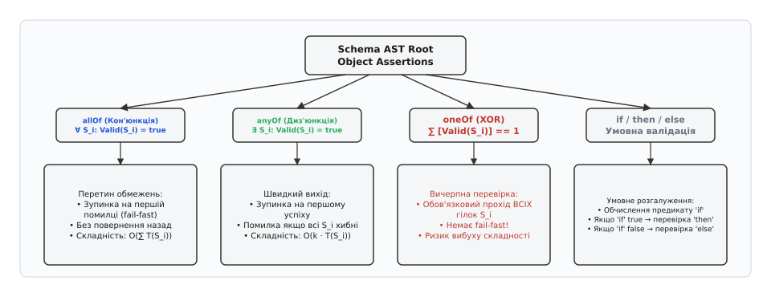
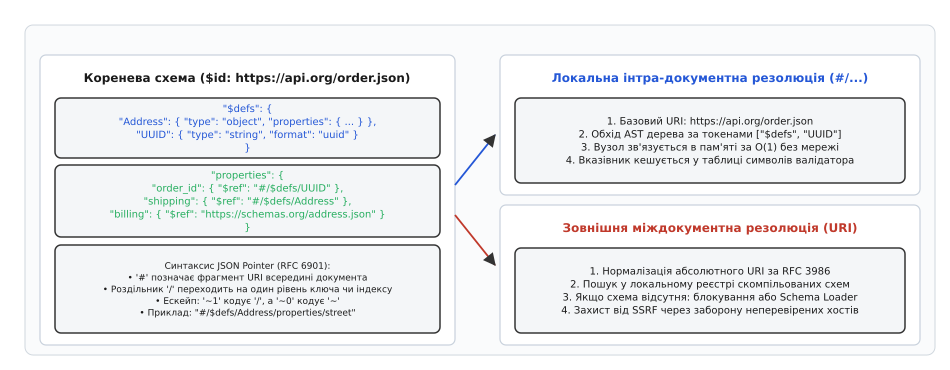
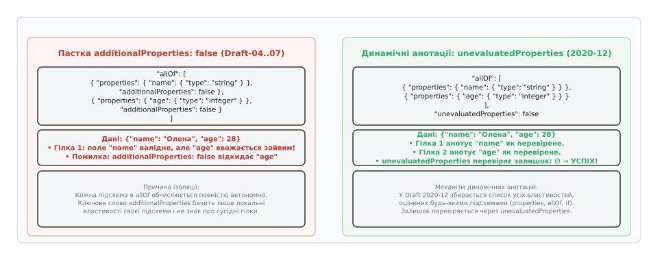
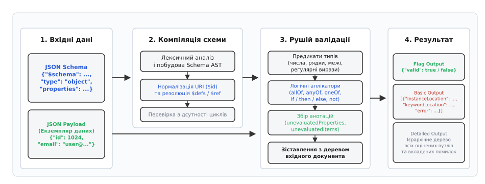

# JSON Schema: декларативний опис та валідація структури даних

<preknowlist>
- [JSON: текстове подання об'єктів і масивів](topic:programming/json-format) — синтаксис серіалізації об'єктів, ключів, масивів та скалярних типів.
- [Самоописовий формат](topic:programming/self-describing-format) — взаємозв'язок метаданих схеми та серіалізованого корисного навантаження.
</preknowlist>

Мережевий шлюз розподіленої системи щомиті отримує тисячі вхідних JSON-документів від зовнішніх клієнтів. Оскільки протокол JSON не містить убудованої інформації про типи, кожен серверний обробник змушений самостійно перевіряти структуру вхідного повідомлення: чи є поле `userId` додатнім цілим числом, чи містить масив `items` хоча б один елемент, і чи не передав клієнт сторонні небезпечні властивості. За відсутності формального опису ці перевірки перетворюються на каскади імперативних викликів `if (!payload.contains("id") || !payload["id"].is_integer())`, розкиданих по всьому коду застосунку.

Такий підхід породжує небезпечну фрагментацію: клієнтський інтерфейс, серверний бекенд та аналітичні сервіси реалізують правила валідації незалежно, що неминуче призводить до розсинхронізації бізнес-правил, непослідовних повідомлень про помилки та вразливостей до атак ін'єкцій. Декларативна валідація вирішує цю проблему, виносячи структурні обмеження у самостійний машинно-інтерпретований контракт — JSON Schema (від грецького *σχῆμα* — форма, план).

> 🔧 **Навіщо це.** Декларативна схема дозволяє відокремити структурний контракт від бізнес-логіки обробників. Один і той самий файл схеми використовується на API Gateway для відсікання некоректних запитів до потрапляння в бекенд, у генераторах клієнтських SDK (OpenAPI/Swagger), у статичних лінтерах конфігурацій (Kubernetes, CI/CD) та в автоматичних тестах контрактів.

---

## Декларативний контракт проти імперативних перевірок

В імперативному коді валідація змішується з логікою вилучення та приведення типів. Якщо в схемі даних змінюються обмеження (наприклад, максимальна довжина рядка або діапазон значень), розробник зобов'язаний вручну змінити десятки умовних операторів у різних модулях і мовах програмування.

Декларативний опис за допомогою JSON Schema визначає **що саме** є допустимим документом, залишаючи алгоритм перевірки спеціалізованому валідатору. Сама схема є звичайним JSON-документом, що дозволяє передавати її мережею, версіонувати в репозиторіях та динамічно застосовувати без перекомпіляції коду.

```json
{
  "$schema": "https://json-schema.org/draft/2020-12/schema",
  "$id": "https://api.example.com/schemas/user-registration.json",
  "type": "object",
  "required": ["username", "email", "age"],
  "properties": {
    "username": {
      "type": "string",
      "minLength": 3,
      "maxLength": 30,
      "pattern": "^[a-zA-Z0-9_-]+$"
    },
    "email": {
      "type": "string",
      "format": "email"
    },
    "age": {
      "type": "integer",
      "minimum": 18,
      "maximum": 120
    }
  },
  "additionalProperties": false
}
```

Контракт вище чітко декларує тип сутності, обов'язковий перелік ключів, регулярні вирази для формату ідентифікаторів, числові межі та заборону невідомих полів. Якщо вхідний JSON порушує будь-яке з цих правил, валідатор формує структурований звіт із точним зазначенням розташування дефекту.

---

## Еволюція специфікацій та діалекти

Специфікація JSON Schema пройшла тривалий шлях розвитку — від перших експериментальних чернеток у межах IETF до сучасного модульного стандарту.

```
Draft-04 (2013) ──► Draft-07 (2017) ──► Draft 2019-09 ──► Draft 2020-12
(OpenAPI 2/3.0)     (if/then/else)      (Vocabularies)    (OpenAPI 3.1)
```

Головні відмінності між історичними редакціями полягають у способі ідентифікації схем, механіці композиції та взаємодії з екосистемою OpenAPI:

1. **Draft-04 (2013):** Став промисловим де-факто стандартом завдяки інтеграції у Swagger 2.0 та OpenAPI 3.0. Використовував ключове слово `id` (без знака `$`), секцію `definitions` для підсхем та перевантажене слово `items` (яке могло бути або схемою, або масивом схем).
2. **Draft-07 (2017):** Запровадив булеві схеми (`true`/`false`), перейменував `id` на `$id` для уникнення конфліктів із користувацькими полями, додав ключове слово `const` та умовні аплікатори `if`, `then`, `else`.
3. **Draft 2019-09:** Перевів версіонування на річний формат (`YYYY-MM`) та розділив ядро на модульні словники (Vocabularies). Замінив `definitions` на `$defs`, впровадив механізм збору динамічних анотацій і ключове слово `unevaluatedProperties`.
4. **Draft 2020-12:** Фіналізував відокремлення позиційної валідації масивів через нове ключове слово `prefixItems` (залишивши `items` виключно для решти елементів) та запровадив динамічні посилання `$dynamicRef` / `$dynamicAnchor`. Саме ця версія досягла 100% сумісності з OpenAPI 3.1.

Детальний аналіз історичного протистояння та подолання розколу між IETF та OpenAPI наведено у вставці [Еволюція специфікацій JSON Schema](topic:programming/json-schema/hist-draft-evolution.md).

Мета-схема документа визначається за допомогою URI у полі `$schema`:

```json
{
  "$schema": "https://json-schema.org/draft/2020-12/schema",
  "$id": "https://company.org/schemas/order.json"
}
```

Поле `$schema` вказує валідатору, який набір правил та ключових слів слід використовувати для аналізу. Поле `$id` задає канонічний базовий URI (Base URI), від якого відлічуються всі відносні посилання всередині документа.

---

## Базові типи даних та ключові слова валідації

JSON Schema оперує сімома базовими типами даних, визначеними у стандарті RFC 8259: `null`, `boolean`, `object`, `array`, `number`, `string`, а також псевдотипом `integer` (числа без дробової частини).

Систематизований перелік усіх директив і параметрів валідації наведено у вставці [Довідник ключових слів JSON Schema](topic:programming/json-schema/api-keywords-reference.md).

### Числовий контроль
Для типів `number` та `integer` застосовуються математичні межі:
- `minimum` та `maximum` — нестрогі межі (`значення ≥ min`, `значення ≤ max`).
- `exclusiveMinimum` та `exclusiveMaximum` — строгі нерівності (`значення > min`, `значення < max`).
- `multipleOf` — кратність (`значення ÷ multipleOf` є цілим числом).

```json
{
  "type": "number",
  "minimum": 0.0,
  "exclusiveMaximum": 100.0,
  "multipleOf": 0.25
}
```

### Рядкові обмеження та формати
Для типу `string` доступні перевірки довжини, регулярних виразів та семантичних типів:
- `minLength` та `maxLength` вимірюють кількість символів у Unicode Code Points, запобігаючи помилкам підрахунку байтів у UTF-8.
- `pattern` приймає регулярний вираз синтаксису ECMA-262.
- `format` задає семантичний профіль: `date-time` (за стандартом RFC 3339 / ISO 8601), `email`, `ipv4`, `ipv6`, `uri`, `uuid`.

```json
{
  "type": "string",
  "format": "uuid",
  "pattern": "^[0-9a-f]{8}-[0-9a-f]{4}-4[0-9a-f]{3}-[89ab][0-9a-f]{3}-[0-9a-f]{12}$"
}
```

### Об'єкти та масиви
Для складних контейнерів JSON Schema розрізняє перевірку відомих ключів, позиційних елементів та залишкових властивостей:

1. **Об'єкти:** Ключове слово `properties` зіставляє схеми з точними назвами полів, `patternProperties` застосовує схеми за регулярними виразами назв ключів, а `required` вимагає обов'язкової наявності списку полів.
2. **Масиви:** У Draft 2020-12 кортежна валідація задається через `prefixItems: [schema1, schema2]`, де кожен елемент масиву перевіряється за власним індексом. Ключове слово `items` перевіряє всі наступні елементи після префікса. `uniqueItems: true` вимагає повної відсутності дублікатів.

---

## Композиція схем та логічні аплікатори

JSON Schema дозволяє об'єднувати схеми за допомогою формальних логічних операторів, які називаються **аплікаторами** (Applicators).

```
         ┌────────────────────────┐
         │    Schema AST Root     │
         └───────────┬────────────┘
     ┌───────────────┼───────────────┬───────────────┐
     ▼               ▼               ▼               ▼
┌─────────┐     ┌─────────┐     ┌─────────┐     ┌─────────┐
│ allOf   │     │  anyOf  │     │  oneOf  │     │ if/then │
│  (AND)  │     │  (OR)   │     │  (XOR)  │     │  (COND) │
└─────────┘     └─────────┘     └─────────┘     └─────────┘
```


*Деревоподібна композиція логічних аплікаторів та вартість обчислення гілок*

Логічні аплікатори мають різну обчислювальну вартість та правила виконання:

- **`allOf` (Кон'юнкція):** Документ валідний тоді й лише тоді, коли він задовольняє **всі** схеми в масиві. Використовується для накладання множинних обмежень (наприклад, базовий тип + додаткові бізнес-правила). Валідатор може завершити перевірку на першій помилці (Fail-fast). Складність лінійна: `O(∑ T(S_i))`.
- **`anyOf` (Диз'юнкція):** Документ валідний, якщо він задовольняє **хоча б одну** схему. Валідатор зупиняється на першому успішному збігу (Short-circuit). Складність: `O(k · T(S_i))`, де `k ≤ N`.
- **`oneOf` (Виключна диз'юнкція, XOR):** Документ валідний, якщо він задовольняє **рівно одну** схему. На відміну від `anyOf`, валідатор зобов'язаний виконати **всі** гілки перевірки, щоб переконатися, що успішний збіг не повторився двічі. Це унеможливлює швидке переривання і створює комбінаторне навантаження при глибокій вкладеності.
- **`not` (Заперечення):** Документ валідний, якщо він **не відповідає** вказаній підсхемі.
- **`if` / `then` / `else` (Умовні залежності):** Забезпечує детерміноване розгалуження без використання важкого `oneOf`. Якщо документ валідний за схемою `if`, до нього застосовується `then`, інакше — `else`.

```json
{
  "type": "object",
  "properties": {
    "paymentType": { "enum": ["card", "crypto"] }
  },
  "if": {
    "properties": { "paymentType": { "const": "card" } }
  },
  "then": {
    "required": ["cardNumber", "cvv"]
  },
  "else": {
    "required": ["walletAddress"]
  }
}
```

---

## Механізм перепосилань та резолюція URI

Для побудови модульних та рекурсивних структур JSON Schema використовує механізм перепосилань `$ref` разом із системою адресації JSON Pointer (RFC 6901).

```
   Коренева схема ($id: https://api.org/order.json)
   ├── $defs
   │    └── Address: { type: "object", ... }
   └── properties
        └── shipping: { "$ref": "#/$defs/Address" }  ──► [Локальна резолюція O(1)]
```


*Механізм резолюції посилань: локальний JSON Pointer проти завантаження зовнішніх схем*

### Локальна резолюція через JSON Pointer
Символ `#` позначає фрагмент URI, який інтерпретується як шлях усередині поточного документа. Скісна риска `/` здійснює перехід на один рівень вкладеності ключів або індексів.

Спеціальні символи всередині ключів ескейпляться за правилами RFC 6901:
- `~1` замінює символ `/`
- `~0` замінює символ `~`

Наприклад, вираз `{"$ref": "#/$defs/User~1Profile/email"}` вказує на підсхему, що лежить у полі з ключем `User/Profile` всередині секції `$defs`.

### Базовий URI та область видимості
Кожен вузол схеми може містити власне поле `$id`, яке змінює базовий URI для всіх його дочірніх елементів:

```json
{
  "$id": "https://example.com/schemas/main.json",
  "$defs": {
    "nested": {
      "$id": "https://example.com/schemas/sub/item.json",
      "properties": {
        "refField": { "$ref": "type.json" }
      }
    }
  }
}
```

У прикладі вище відносне посилання `type.json` у полі `refField` резольвиться не від `https://example.com/schemas/main.json`, а від локального базового URI `https://example.com/schemas/sub/type.json` відповідно до правил нормалізації RFC 3986.

### Динамічні посилання: `$dynamicAnchor` та `$dynamicRef`
У Draft 2020-12 вирішено класичну проблему розширення рекурсивних схем (наприклад, мета-схем або дерев довільної глибини). Класичний `$ref` жорстко прив'язаний до статичної лексичної адреси. Динамічні посилання `$dynamicRef` працюють подібно до поліморфного диспетчеризування у мовах програмування: під час рекурсивного спуску валідатор викликає якір `$dynamicAnchor`, перевизначений на вищому рівні стека виконання.

---

## Семантика анотацій проти валідації

Однією з найглибших проблем версій Draft-04..Draft-07 була взаємодія `allOf` та `additionalProperties: false`.

```
  ┌────────────────────────────────────────────────────────┐
  │ Пастка Draft-04..07: allOf + additionalProperties: false│
  │ • Гілка A бачить 'name', вважає 'age' забороненим      │
  │ • Гілка B бачить 'age', вважає 'name' забороненим      │
  │ ──► ВАЛІДАЦІЯ ПРОВАЛЕНА НАВІТЬ ДЛЯ КОРЕКТНОГО ОБ'ЄКТА  │
  └────────────────────────────────────────────────────────┘
```


*Порівняння additionalProperties та unevaluatedProperties під час композиції через allOf*

У ранніх стандартах ключове слово `additionalProperties` було суто локальним: воно бачило лише ті поля, які були оголошені в директиві `properties` **того самого об'єкта**. Якщо дві схеми об'єднувалися через `allOf`, кожна гілка нічого не знала про властивості іншої і відкидала валідний об'єкт.

### Рішення Draft 2020-12: unevaluatedProperties
Починаючи з Draft 2019-09/2020-12, валідатор працює у два шари:

1. **Assertions (Ствердження):** Перевіряють істинність умов (чи є значення числом, чи входить у діапазон).
2. **Annotations (Анотації):** Збирають інформацію про те, які саме ключі та індекси були успішно перевірені будь-якими ключовими словами (`properties`, `patternProperties`, `prefixItems`, `allOf`, `if`).

Ключове слово `unevaluatedProperties` запускається після завершення всіх аплікаторів, отримує повну множину анотованих властивостей і перевіряє виключно ті поля, до яких не торкнулася жодна підсхема:

```json
{
  "allOf": [
    {
      "properties": {
        "name": { "type": "string" }
      },
      "required": ["name"]
    },
    {
      "properties": {
        "age": { "type": "integer" }
      },
      "required": ["age"]
    }
  ],
  "unevaluatedProperties": false
}
```

Тепер об'єкт `{"name": "Олена", "age": 28}` успішно проходить валідацію: `name` оцінюється першою гілкою, `age` — другою, а `unevaluatedProperties` переконується, що в документі немає сторонніх незадекларованих полів.

---

## Архітектура валідаторів та компіляція AST

Швидкі сучасні валідатори (Ajv у Node.js, Bochs/Valijson у C++, jsonschema у Python) не виконують інтерпретацію JSON-дерева схеми «на льоту». Вони застосовують конвеєр компіляції.

```
       JSON Schema ──► [Lexer & Parser] ──► Schema AST
                                                  │
                                                  ▼
     Звіт про помилки ◄── [Валідатор O(N)] ◄── [Резолюція $ref]
     (Flag/Basic/Detailed)        ▲
                                  │
                             JSON Payload
```


*Конвеєр обробки схеми: компіляція AST, резолюція посилань та зіставлення з документом*

Етапи конвеєра:
1. **Синтаксичний розбір:** Перетворення JSON-тексту схеми в абстрактне синтаксичне дерево (Schema AST).
2. **Побудова таблиці символів та резолюція `$ref`:** Усі локальні `$defs` та зовнішні схеми зв'язуються у пам'яті через прямі вказівники на вузли AST. Виявляються циклічні залежності.
3. **Генерація предикатного коду / байткоду:** Перевірки типів та обов'язкових полів трансформуються у бітові маски та статичні таблиці зміщень, мінімізуючи розгалуження процесора (Branch Mispredictions).
4. **Однопрохідна валідація екземпляра:** Вхідний документ обходиться за один прохід `O(N)` у потоці без додаткових алокацій пам'яті.

Повний покроковий код скомпільованого предикатного рушія валідації наведено у вставці [Практична реалізація валідатора](topic:programming/json-schema/proj-validator-engine.md).

---

## Безпека, DoS-атаки та межі технології

Застосування валідації схем на межі мережевого периметра потребує врахування специфічних векторів атак на вичерпання ресурсів (Denial of Service).

### Регулярні вирази та ReDoS (Regular Expression DoS)
Ключове слово `pattern` приймає довільні регулярні вирази. Якщо валідатор використовує бектрекінговий рушій регулярних виразів (наприклад, стандартні рушії PCRE, JavaScript, Python), зловмисник може надіслати шаблон або рядок, який спричиняє катастрофічний бектрекінг зі складністю `O(2ⁿ)`. Для захисту валідатори зобов'язані обмежувати час виконання регулярних виразів або використовувати лінійні автоматні рушії (наприклад, RE2 або Rust regex).

### Нескінченна рекурсія та циклічні `$ref`
Схема може посилатися сама на себе без термінального базового випадку:

```json
{
  "$id": "https://example.com/loop.json",
  "properties": {
    "child": { "$ref": "https://example.com/loop.json" }
  }
}
```

Якщо вхідний документ містить циклічні посилання або глибоку вкладеність об'єктів `child.child.child...`, валідатор без контролю глибини ризикує переповнити системний стек викликів (Stack Overflow). Захист реалізується через встановлення ліміту глибини обходу (Recursion Depth Limit) та відстеження відвіданих вузлів.

### Безпека завантаження зовнішніх схем (SSRF)
Якщо валідатор автоматично завантажує схеми за абсолютними URL-адресами з мережі під час отримання `$ref: "http://internal-service.local/schema.json"`, виникає ризик атак типу Server-Side Request Forgery (SSRF) та витоку конфіденційної інформації через сканування внутрішньої мережі. Промислові валідатори за замовчуванням блокують мережеві запити, вимагаючи попередньої реєстрації всіх дозволених схем у локальному кеші.

### Принципова межа: валідація проти мутації
JSON Schema є суто **декларативним валідатором**, а не серіалізатором чи трансформером. Вона не змінює типи даних у вхідному документі (наприклад, не перетворює рядок `"42"` на число `42`), не заповнює значення за замовчуванням `default` (це завдання прикладного коду або десеріалізатора) і не видаляє сторонні поля. Її єдина функція — надати математично точну відповідь: чи відповідає структура документа оголошеному контракту.
