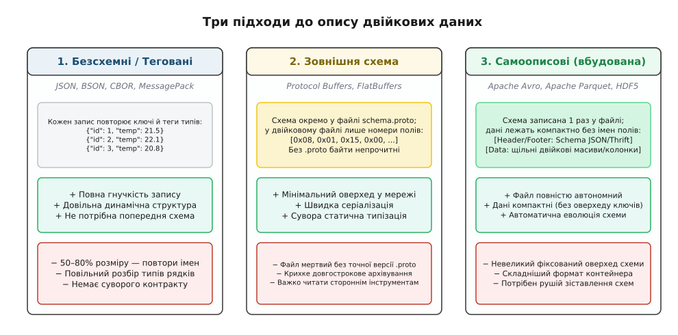
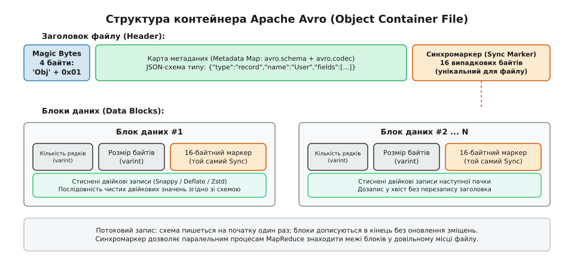
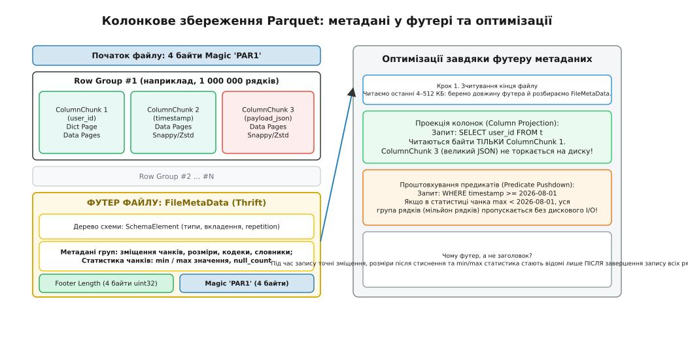
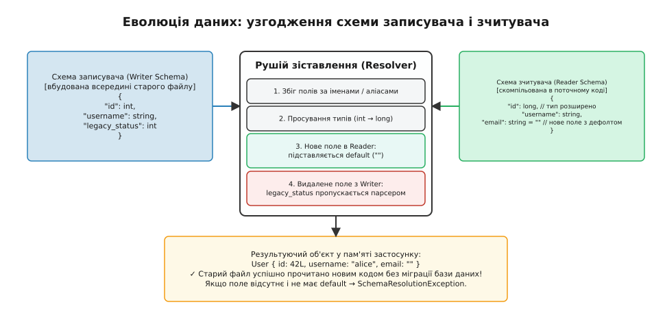

# Самоописовий формат: схема всередині файлу

<preknowlist>
- [Біти й порядок байтів](book:programming/bits-bytes-endianness) — як багатобайтні числа розкладаються на послідовність байтів у пам'яті та файлах.
- [Формати без копіювання](book:programming/zero-copy-serialization) — доступ до полів двійкового буфера за фіксованими зміщеннями без проміжного розбору.
- [JSON](book:programming/json-format) — текстове представлення об'єктів і масивів через пари ключ-значення.
- [Розкладка даних у пам'яті](book:programming/data-layout-aos-soa) — відмінність між масивом структур і структурою масивів та її вплив на доступ до полів.
</preknowlist>

Аналітичний сервіс відкриває двійковий файл розміром 800 мегабайтів, збережений у сховищі три роки тому фоновим процесом попередньої версії системи. Усередині файла лежить неперервний потік нулів та одиниць. Без зовнішнього опису ці байти німі: неможливо визначити, чи перші чотири байти позначають 32-бітне ціле число, 32-бітне число з рухомою комою за стандартом IEEE 754, чи довжину текстового рядка в кодуванні UTF-8. Якщо структуру даних було змінено пів року тому — наприклад, 32-бітний ідентифікатор користувача розширено до 64-бітного або додано нове поле статусу замовлення, — спроба прочитати цей файл класом поточної версії програми призведе або до аварійного завершення через вихід за межі пам'яті, або до тихого спотворення всіх числових значень.

Фундаментальна проблема довгострокового збереження та міжсистемного обміну даними полягає в тому, що двійкові байти, відокремлені від своєї структури, перетворюються на ентропійний шум. Щоб дані залишалися придатними до використання крізь роки, зміни версій компіляторів та різні мови програмування, файл повинен нести контракт своєї структури всередині себе. Формати, які реалізують цей принцип, називаються **самоописовими** (англ. *self-describing formats*).

### Тріада серіалізації: безсхемні, зовнішні та самоописові формати

Усі існуючі способи збереження та передачі структурованих даних у комп'ютерній інженерії поділяються на три архітектурні родини, кожна з яких робить власний вибір у компромісі між гнучкістю, компактністю та автономністю.


*Три архітектури збереження даних. Безсхемні формати дублюють метадані в кожному записі; зовнішні схеми створюють компактний двійковий потік, але втрачають сенс без зовнішнього файлу; самоописові формати поєднують автономність із компактністю двійкових масивів.*

Перша родина — **безсхемні або динамічно теговані формати** (JSON, BSON, CBOR, MessagePack). У них немає глобальної попередньої домовленості про форму об'єкта. Замість цього кожне окреме значення в кожному окремому рядку супроводжується власним текстовим ключем та байтом-тегом типу. Це дає максимальну динамічну гнучкість: кожен рядок у файлі може мати власну унікальну структуру. Проте ціна цієї гнучкості — колосальний «податок на метадані» (*metadata tax*). Якщо таблиця містить 50 колонок і 100 мільйонів рядків, назва поля `"customer_billing_country_code"` записується на диск 100 мільйонів разів. Навіть у двійкових варіантах (BSON) від 50% до 80% обсягу файлу займають повторювані назви ключів, а парсер змушений на кожному записі динамічно будувати таблиці хешів.

Друга родина — **формати із зовнішньою схемою** (Protocol Buffers, FlatBuffers, Cap'n Proto). Вони створювалися для високошвидкісного міжсервісного обміну (RPC). Схема структури описується окремо у файлі `.proto` або `.fbs`. Спеціальний компілятор генерує суворий код серіалізації для C++, Go чи Rust, а по мережі передаються лише числові теги полів і чисті значення. У двійковому потоці немає жодного зайвого байта. Але коли такий потік скидають на диск для холодного архівування, виникає критична крихкість: якщо через п'ять років оригінальний файл `.proto` втрачено або якщо в ньому змінили нумерацію полів, двійковий архів перетворюється на нерозбірливий набір байтів.

Третя родина — **самоописові формати зі збереженням схеми** (Apache Avro, Apache Parquet, Apache ORC, HDF5). Вони об'єднують переваги обох підходів:
1. Повна формальна схема структури (типи, імена, ієрархія, правила замовчування) записується всередину двійкового файлу **рівно один раз**.
2. Усі мільйони рядків або масивів даних зберігаються у вигляді щільних машинних двійкових значень без повторення імен полів чи тегів типів.
3. Будь-який сторонній інструмент може відкрити файл на довільній операційній системі, прочитати вбудовану схему й автоматично розібрати всі дані без наявності сторонніх заголовкових файлів чи кодогенераторів.

Еволюція цієї концепції — від перших наукових супутникових архівів до сучасних розподілених сховищ — розгорнута в [історії переходу від наукових матриць HDF до аналітичного Parquet](book:programming/self-describing-format/hist-from-hdf-to-parquet.md).

---

### Де розміщувати метадані: заголовок проти футера

Головне архітектурне роздоріжжя всередині самоописових форматів — це фізичне місце розташування схеми та метаданих усередині контейнера. Схему можна записати або на самому початку файлу (**заголовок**, англ. *header*), або в самому кінці (**футер**, англ. *footer*). Це рішення фундаментально визначає, для яких сценаріїв обробки оптимізований формат.

```
Варіант А (Header-first / Потоковий запис):
[ Magic ][ Вбудована JSON-схема ][ Sync Marker ][ Блок даних 1 ][ Блок даних 2 ] ... -> [Дозапис]

Варіант Б (Footer-first / Аналітичний доступ):
[ Magic ][ RowGroup 1: Col A, Col B ][ RowGroup 2: Col A, Col B ] ... [ FileMetaData ][ Footer Len ][ Magic ]
                                                                       ^                     |
                                                                       +-- читається першим -+
```

#### Заголовок файлу: Apache Avro та потоковий інжест

У форматі Apache Avro (а саме у контейнерному форматі *Object Container File*, OCF) схема записується на самому початку файлу.


*Контейнерний файл Apache Avro OCF. Заголовок містить повну схему у вигляді JSON-рядка та 16-байтний випадковий маркер. Блоки записів дописуються послідовно. Синхромаркер дозволяє воркерам MapReduce знаходити межі блоків у довільному місці файлу.*

Контейнер Avro влаштований так:
1. **Magic Bytes (4 байти):** символи ASCII `'O'`, `'b'`, `'j'` та байт версії `0x01`.
2. **Карта метаданих (Metadata Map):** асоціативний масив пар ключ-значення, закодований двійковим Avro. Обов'язковий ключ `"avro.schema"` містить канонічний JSON-текст повної схеми записів. Опційний ключ `"avro.codec"` вказує алгоритм компресії блоків (`"null"`, `"deflate"`, `"snappy"`, `"zstandard"`).
3. **Синхромаркер (Sync Marker, 16 байтів):** послідовність із 16 випадкових байтів, що генерується один раз під час створення файлу.
4. **Блоки даних (Data Blocks):** кожен блок починається з лічильника кількості записів у блоці (varint) та розміру стисненого блоку в байтах (varint). Далі йдуть сирі або стиснені байти записів, а завершується блок повторенням того самого 16-байтного синхромаркера.

Чому схема в заголовку ідеальна для потокового запису?
- **Низьке споживання пам'яті:** процес запису генерує заголовок на початку, після чого може неперервно дописувати нові блоки даних у хвіст файлу годинами або днями, скидаючи буфери на диск (*append-only stream*). Не потрібно тримати в пам'яті індекси чи повертатися у початок файлу для оновлення зміщень.
- **Розподілена паралельна обробка:** під час обробки 100-гігабайтного Avro-файлу кластером Hadoop чи Spark файл віртуально ділиться на спліти (наприклад, по 128 МБ). Воркер, якому дістався другий спліт (зміщення 128 МБ–256 МБ), зчитує заголовок файлу один раз, переходить на зміщення 128 МБ і просто сканує потік байтів вперед, доки не зустріне 16-байтний синхромаркер. Знайдений маркер однозначно сигналізує про початок валідного блоку даних.

Практичну реалізацію такого парсера наведено у [розборі двійкового контейнера Apache Avro та синхромаркерів](book:programming/self-describing-format/proj-avro-container-parser.md).

#### Футер файлу: Apache Parquet та колоночна аналітика

У форматі Apache Parquet (а також Apache ORC) схема та всі ключові метадані виносяться у **футер (хвіст) файлу**.


*Анатомія файлу Apache Parquet. Метадані FileMetaData у футері зберігають повне дерево схеми, фізичні зміщення колонок та min/max-статистику по групах рядків. Зчитувач читає останні байти файлу і виконує точкові звернення (seek) тільки до потрібних колонок.*

Файл Parquet організований як послідовність груп рядків (**Row Groups**, зазвичай від 100 МБ до 1 ГБ або від 100 тисяч до кількох мільйонів рядків). Усередині кожної групи рядків дані розкладені не по рядках, а по колонках (**Column Chunks**). Кожен колонковий чанк складається зі сторінок (**Pages**) розміром 1 МБ, де значення однієї колонки стискаються спеціалізованими алгоритмами (RLE, словникове кодування, Bit-Packing, Snappy/Zstd).

Наприкінці файлу розміщується блок метаданих **FileMetaData**, серіалізований за допомогою протоколу Thrift Compact Protocol. Він містить:
- **Дерево схеми (`SchemaElement`):** ієрархічний опис усіх типів, полів та рівнів вкладеності (правила `REQUIRED`, `OPTIONAL`, `REPEATED`).
- **Метадані груп рядків (`RowGroupMetaData`):** для кожного колонкового чанка вказано точне зміщення в байтах від початку файлу (`file_offset`), зміщення словникової сторінки, зміщення сторінок даних, кодек стиснення, сумарний нестиснений та стиснений розмір.
- **Статистика значень (`ColumnStatistics`):** мінімальне значення (`min_value`), максимальне значення (`max_value`), кількість порожніх значень (`null_count`) у межах цієї групи рядків.
- **Хвіст футера (останні 8 байтів файлу):** 4 байти цілого числа `footer_len` (uint32 Little-Endian) і 4 байти магічної сигнатури `'P'`, `'A'`, `'R'`, `'1'`.

Чому метадані Parquet зобов'язані бути у футері?
Під час генерації колонкового файлу програма накопичує велику пачку рядків у пам'яті, розбиває їх на колонки, кодує словниками, стискає сторінки алгоритмом Zstandard і записує на диск. На момент запису першої колонки неможливо знати, який розмір матимуть третя і десята колонки після стиснення, на якому точному байтовому зміщенні опиниться кожна сторінка, і які екстремальні значення (`min`/`max`) зустрінуться у мільйонному рядку. Усі ці метрики народжуються лише в процесі запису даних. Розміщення метаданих у футері дозволяє записати їх один раз наприкінці без потреби повторно перезаписувати заголовок файлу.

Як зчитувач виконує запит до Parquet:
1. Клієнт зчитує лише останні кілька кілобайтів файлу (або робить HTTP-запит `Range: bytes=-65536` до хмарного об'єктного сховища S3).
2. За останніми 8 байтами перевіряється сигнатура `PAR1` і зчитується `footer_len`.
3. Парсер десеріалізує `FileMetaData` і отримує вичерпну карту всього файлу: які колонки де лежать, як вони називаються, і яка статистика в кожній групі рядків.
4. Програма виконує цільові зміщення (*seek*) виключно до тих діапазонів байтів, які необхідні для запиту.

#### Розкладання вкладених структур: алгоритм Dremel (Definition та Repetition Levels)

Колонкове збереження плоских таблиць (де кожне поле є примітивом) тривіальне. Проте сучасні дані містять глибоко вкладені об'єкти, масиви та списки структур (наприклад, `user.addresses[].phones[]`).

Щоб розкласти довільне ієрархічне дерево об'єктів на плоскі вектори колонок без втрати структури вкладення та масивів, Parquet реалізує алгоритм розщеплення записів (*Record Shredding and Assembly*), винайдений у дослідницькому проєкті Google Dremel. Для кожного листового значення колонки обчислюються два невеликі цілі числа:

1. **Рівень визначення (Definition Level, `def_level`):** показує, скільки необов'язкових (*optional*) предків у ланцюжку вкладення дійсно присутні у поточному записі (не є `null`). Якщо максимальний рівень вкладеності поля дорівнює 3, а `def_level = 3`, значення фізично записано. Якщо `def_level = 2`, сам об'єкт існує, але його вкладене поле дорівнює `null`. Якщо `def_level = 0`, весь кореневий запис є порожнім. Це дозволяє компактно відрізняти «відсутність вкладеного поля» від «відсутності самого батьківського об'єкта» без збереження порожніх структур.
2. **Рівень повторення (Repetition Level, `rep_level`):** використовується для списків і масивів (*repeated fields*). Він вказує, на якому саме рівні ієрархічного шляху значення повторилося: `rep_level = 0` означає початок нового кореневого рядка, а `rep_level > 0` показує додавання нового елемента у відповідний вкладений масив.

```
Приклад розкладання запису:
User { id: 101, phones: ["+38050...", "+38067..."] }
User { id: 102, phones: null }
User { id: 103, phones: [] }

Колонка 'id':
  Значення: [101, 102, 103], def_level: [0, 0, 0], rep_level: [0, 0, 0]

Колонка 'phones':
  Значення: ["+38050...", "+38067..."]
  def_level: [1, 1, 0, 1]  (101 має 2 телефони, 102 - null, 103 - порожній список)
  rep_level: [0, 1, 0, 0]  (перший телефон починає список, другий повторює масив)
```

Завдяки пакуванню `def_level` та `rep_level` бітовими алгоритмами RLE (Run-Length Encoding) Parquet відновлює вихідне дерево JSON чи Protobuf-об'єктів на льоту, зберігаючи дані у вигляді суворо колоночних масивів.

#### Низькорівневе кодування сторінок Parquet

Усередині кожної колонкової сторінки значення не записуються як сирий масив `int` чи `string`. Формат застосовує спеціалізовані двійкові кодувальники:
- **Словникове кодування (Dictionary Encoding):** усі унікальні рядки чи значення зберігаються у заголовку сторінки у вигляді словника (масиву), а самі дані замінюються на компактні бітові індекси (наприклад, 2 біти на значення, якщо в словнику лише 4 унікальні країни).
- **Delta Binary Packed:** для монотонно зростаючих ідентифікаторів та міток часу зберігається не саме число, а різниця (*delta*) між сусідніми елементами. Масив міток часу розміром 1 ГБ стискається до кількох мегабайтів.
- **Byte Stream Split:** алгоритм для чисел із рухомою комою (float/double), який розщеплює потік чисел на окремі потоки знакових бітів, експонент і мантис. Однорідні біти експонент стискаються алгоритмом Zstandard майже в нуль.

---

### Наукові ієрархічні сховища: HDF5 та NetCDF

У наукових обчисленнях, геофізиці, кліматичному моделюванні та навчанні штучного інтелекту структура даних рідко є плоскою таблицею з рядків і колонок. Основним об'єктом тут виступає **багатовимірний тензор** (наприклад, 4D-масив атмосферного тиску з розмірністю `[час, висота, широта, довгота]`).

Для таких задач стандартом самоописового збереження є **HDF5** (*Hierarchical Data Format v5*) та побудований на його базі **NetCDF-4**.

```
Структура файлу HDF5 (ієрархія як файлова система):
/ (Root Group)
 ├── /metadata (атрибути: дата зйомки, калібрування)
 ├── /sensors
 │    ├── /infrared (Dataset: 3D-масив 2048x2048x16, Float32, chunked 64x64x16)
 │    └── /telemetry (Dataset: 1D-масив часових міток, Int64)
 └── /b-tree-nodes (внутрішні B-дерева індексації чанків і груп)
```

Внутрішня будова HDF5:
- **Суперблок (Superblock):** розташований на зміщенні 0 (або 512, 1024 байтів). Він містить версію формату, розміри адресних покажчиків файлу, розміри довжин і пряму адресу кореневої групи (*Root Group Symbol Table Entry*).
- **Ієрархічні групи та об'єкти:** HDF5 реалізує всередині одного файлу аналог файлової системи POSIX. Групи виконують роль каталогів, а датасети (*Datasets*) — роль файлів.
- **Заголовки об'єктів (Object Headers):** кожен датасет містить список повідомлень опису:
  1. *Datatype Message:* повний двійковий опис типу елементів (розрядність, порядок байтів Big/Little Endian, зміщення бітів для нестандартних цілих).
  2. *Dataspace Message:* розмірність тензора (наприклад, ранг `N=3`, розміри вимірів `[1000, 500, 200]`, обмеження максимальних розмірів для динамічно зростаючих масивів).
  3. *Layout Message:* спосіб розміщення елементів на диску — неперервний (*contiguous*), фрагментований (*chunked*) або компактний (*compact*, коли дрібні дані лежать прямо в заголовку).
  4. *Filter Pipeline Message:* ланцюжок фільтрів, застосованих до фрагментів (контрольна сума Fletcher32, перетасування байтів Shuffle, компресія Gzip/Szip/BLOSC).
  5. *Attribute Messages:* довільні користувацькі метадані у форматі ключ-значення (наприклад, одиниці вимірювання `"Kelvin"`, система координат або математичні коефіцієнти калібрування).

#### Фрагментація (*Chunking*), фільтр перетасування (*Shuffle*) та B-дерева

Головна технічна перевага HDF5 над простими масивами пам'яті полягає в механізмі багатовимірної фрагментації. Великий 4D-масив розміром 500 ГБ розбивається на незалежні прямокутні блоки — чанки (наприклад, `64×64×64×1`).

Адресація кожного чанка на диску виконується через спеціалізоване внутрішнє **B-дерево версії 2** (B-tree v2), ключем у якому є багатовимірні просторові координати чанка `(t, z, y, x)`.

Коли чанк записується на диск, він проходить через конвеєр фільтрів (*Filter Pipeline*):
1. **Фільтр перетасування байтів (Shuffle Filter):** якщо масив містить 4-байтні числа `float32`, фільтр групує всі нульові байти разом, усі перші байти разом, усі другі та всі треті. Оскільки старші байти плаваючих чисел у сусідніх точках простору майже однакові, утворюються довгі послідовності однакових байтів.
2. **Алгоритм компресії (Deflate / LZ4 / Zstandard / BLOSC):** стискає реорганізований буфер. Завдяки попередньому фільтру Shuffle ступінь стиснення наукових даних зростає у 2–4 рази порівняно зі стисненням сирого двійкового потоку.

Завдяки B-деревам та кешуванню чанків (*Chunk Cache*) дослідник може вирізати плоский 2D-зріз погоди над Україною на заданій висоті за мілісекунди, зчитуючи лише кілька потрібних чанків без сканування гігабайтів інших висот і часових проміжків.

---

### Двійкові теговані формати: BSON та CBOR

На протилежному полюсі від табличних і тензорних форматів знаходяться двійкові документи. Вони використовуються у документоорієнтованих базах даних (MongoDB) та протоколах інтернету речей (IoT).

#### BSON (Binary JSON)

BSON створено для оптимізації зберігання та пошуку документів у СУБД. Кожен документ BSON є префіксним:
- Перші 4 байти — 32-бітне ціле зі знаком (`int32` Little-Endian), що вказує **повний розмір документа в байтах** разом із цим заголовком.
- Далі слідує послідовність полів. Кожне поле починається з 1 байта типу (`0x01` — 64-бітне float, `0x02` — рядок UTF-8, `0x03` — вкладений документ, `0x07` — 12-байтний ObjectId, `0x10` — 32-бітне int), після якого йде назва поля у вигляді рядка з нульовим закінченням (C-string, закінчується байтом `0x00`), а потім саме значення.
- Завершує документ термінальний байт `0x00`.

Наявність загального розміру документа на початку дозволяє серверу баз даних пропустити весь гігантський документ в один крок (`seek` або зміщення покажчика на `size`), не аналізуючи його внутрішні теги. Проте повторення назв полів у кожному документі залишається головним недоліком формату.

#### CBOR (Concise Binary Object Representation, RFC 8949)

CBOR спроєктовано для мікроконтролерів, вбудованих систем та протоколів CoAP, де кожен байт на рахунку. Він відмовився від рядкових назв типів на користь ультракомпактного пакування в один байт заголовка:

```
Формат початкового байта CBOR (Initial Byte):
+---+---+---+---+---+---+---+---+
| Major Type|    Additional     |
|  (3 біти) |   Info (5 бітів)  |
+---+---+---+---+---+---+---+---+
 7   6   5   4   3   2   1   0
```

3 старших біти задають один із 8 основних типів (*Major Types*):
- `0`: беззнакове ціле (`unsigned int`)
- `1`: від'ємне ціле (`negative int`)
- `2`: масив сирих байтів (`byte string`)
- `3`: рядок тексту UTF-8 (`text string`)
- `4`: масив елементів будь-якого типу (`array`)
- `5`: асоціативний масив пар ключ-значення (`map`)
- `6`: семантичний тег (наприклад, мітка часу epoch, координати, великі числа BigNum)
- `7`: плаваюча кома та прості значення (false, true, null, float16, float32, float64)

5 молодших бітів (*Additional Information*) безпосередньо кодують або саме число (якщо воно від 0 до 23), або вказують, скільки наступних байтів займає значення: `24` — наступний 1 байт, `25` — 2 байти, `26` — 4 байти, `27` — 8 байтів.

CBOR забезпечує самоописовість на рівні окремого примітива: будь-який пристрій може повністю розпарсити двійкове дерево CBOR, знаючи лише стандарт RFC 8949, без попередньої схеми.

---

### Еволюція та узгодження схем (Schema Resolution)

Будь-яка реальна інформаційна система живе у часі: бізнес-вимоги змінюються, поля додаються, застарілі атрибути видаляються, а типи числових лічильників розширюються. У розподілених системах неможливо одномоментно оновити всі сервіси, що пишуть дані, та всі сервіси, що їх читають.

Головна сила самоописових форматів — це вбудований математичний механізм **узгодження схем** (*Schema Resolution*).


*Механізм зіставлення схем. Схема записувача W (з файлу) та схема зчитувача R (з коду) зіставляються за назвами полів. Видалені поля пропускаються без виділення пам'яті, нові поля ініціалізуються значеннями за замовчуванням, а числові типи безпечно підвищуються.*

Коли клієнтська програма відкриває файл, вона оперує двома різними схемами:
1. **Схема записувача (`W`, *Writer's Schema*):** точна структура даних, яка була актуальною в момент створення файлу і збережена в його заголовку/футері.
2. **Схема зчитувача (`R`, *Reader's Schema*):** структура даних, яку очікує поточна скомпільована версія програми.

Рушій десеріалізації виконує попарне зіставлення полів між `W` та `R` за суворими формальними правилами.

#### 1. Зіставлення та проекція полів

- Якщо поле присутнє і в `W`, і в `R`, його значення зчитується та конвертується у цільову змінну.
- Порядок полів у `W` та `R` не зобов'язаний збігатися: рушій зіставляє поля за їхніми **іменами** (або за секцією псевдонімів `aliases`).

#### 2. Обробка доданих полів (Forward Compatibility)

Якщо у новій схемі `R` з'явилося нове поле (наприклад, `"loyalty_tier"`), якого не існувало в старому файлі `W`:
- Рушій перевіряє, чи визначено для цього поля у схемі `R` значення за замовчуванням (`"default"`).
- Якщо `default` присутній (наприклад, `"standard"`), рушій присвоює його полю об'єкта в пам'яті.
- Якщо значення `default` не задано, виникає фатальна помилка узгодження (`SchemaResolutionException`), оскільки програма не може гарантувати коректність стану відсутнього поля.

> **Залізне правило еволюції:** будь-яке нове поле, що додається до схеми, **зобов'язане** мати явне значення `default`. Без цього старі файли стануть неможливими для читання новим кодом.

#### 3. Обробка видалених полів (Backward Compatibility)

Якщо в старій схемі `W` було поле `"fax_number"`, яке розробники видалили з поточної схеми `R`:
- Рушій зчитування не падає з помилкою.
- Використовуючи тип поля зі схеми `W`, парсер обчислює довжину значення у байтах і просто пропускає (*skips*) їх у двійковому буфері, не створюючи жодних об'єктів у купі (*heap memory*).

#### 4. Матриця просування числових типів (*Type Promotion*)

Якщо старий сервіс записував число як 32-бітне ціле `int`, а новий очікує 64-бітне `long`, рушій виконує автоматичне безвтратне перетворення за правилами розширення розрядності:

```
int    ──> long ──> float ──> double
string <──> bytes
```

Зворотне звуження (наприклад, читання `long` у змінну `int`) категорично заборонено, оскільки воно може призвести до неконтрольованого арифметичного переповнення або втрати точності.

---

### Аналітичні оптимізації завдяки вбудованим метаданим

У сучасних сховищах даних (*Data Lakehouse*) розміри окремих таблиць досягають петабайтів. Коли аналітик або SQL-рушій (DuckDB, Trino, Apache Spark, Snowflake, ClickHouse) виконує запит, самоописова природа формату Parquet перетворює метадані футера на потужний інструмент прискорення обчислень.

#### 1. Проекція колонок (Column Projection)

У типовій аналітичній таблиці може бути від 100 до 500 колонок, включаючи складні вкладені JSON-структури, масиви та текстові описи. Проте типовий аналітичний запит виглядає так:

```sql
SELECT country, SUM(order_amount)
FROM global_transactions
WHERE transaction_date >= '2026-08-01'
GROUP BY country;
```

Цьому запиту потрібні лише три колонки: `country`, `order_amount` та `transaction_date`. Усі інші 497 колонок для нього є зайвими.

Завдяки футеру Parquet:
1. Клієнт зчитує лише `FileMetaData` з кінця файлу.
2. Рушій знаходить зміщення та розміри чанків тільки для цих 3 колонок.
3. Програма завантажує з накопичувача (або через мережу з S3) рівно ті діапазони байтів, де лежать ці три колонки.
4. **Ефект:** обсяг дискового або мережевого вводу-виводу (I/O) скорочується на 95–99%. Запит над гігабайтним файлом завантажує лише 20–30 мегабайтів.

#### 2. Проштовхування предикатів (Predicate Pushdown) та пропуск груп рядків

Кожен колонковий чанк у футері Parquet містить блок статистики `ColumnStatistics`. Перед тим, як прочитати хоча б один байт даних групи рядків, аналітичний рушій звіряє умови блоку `WHERE` із цією статистикою:

```
Умова запиту: WHERE transaction_date >= '2026-08-01'

RowGroup #1: transaction_date min = '2026-01-01', max = '2026-03-31'
             max < '2026-08-01' -> Умова хибна!
             РІШЕННЯ: ПОВНИЙ ПРОПУСК RowGroup #1 (0 байтів прочитано з диска)

RowGroup #2: transaction_date min = '2026-04-01', max = '2026-07-31'
             max < '2026-08-01' -> Умова хибна!
             РІШЕННЯ: ПОВНИЙ ПРОПУСК RowGroup #2 (0 байтів прочитано з диска)

RowGroup #3: transaction_date min = '2026-07-15', max = '2026-09-30'
             Діапазон перетинає умову!
             РІШЕННЯ: Читаємо та декомпресуємо тільки потрібні колонки RowGroup #3.
```

Ця техніка називається **відсіканням груп рядків** (*Row Group Pruning*). Якщо дані відсортовано за датою або ідентифікатором, запит сканує лише 1–2% груп рядків у всьому файлі.

Крім того, якщо колонка закодована словником (*Dictionary Encoding*), рушій спочатку читає словникову сторінку (*Dictionary Page*). Якщо шукане значення (наприклад, `"Kyiv"`) відсутнє у словнику цієї групи рядків, уся група рядків відкидається без зчитування сторінок даних.

#### 3. Векторизоване декодування та SIMD

Коли дані зберігаються у вигляді однорідних двійкових масивів фіксованої довжини (наприклад, нестиснений масив чисел `int64`), сучасні процесори можуть завантажувати їх безпосередньо у векторні регістри AVX2 (256 бітів, 4 числа за такт) або AVX-512 (512 бітів, 8 чисел за такт).

Фільтрація та підсумовування колонок виконуються на швидкості пропускної здатності шини оперативної пам'яті (десятки гігабайтів на секунду), оскільки процесор не витрачає час на розбір текстових форматів, виділення об'єктів у купі чи розгалуження коду на кожному рядку.

---

### Зведена таблиця та критерії вибору формату

| Критерій | JSON / BSON | Apache Avro (OCF) | Apache Parquet | HDF5 / NetCDF-4 | Protocol Buffers |
| :--- | :--- | :--- | :--- | :--- | :--- |
| **Місце схеми** | У кожному значенні (теги) | Заголовок файлу (JSON) | Футер файлу (Thrift) | Суперблок + заголовки | Поза файлом (`.proto`) |
| **Організація даних** | Документ / Дерево | Порядкова (Row-oriented) | Колонкова (Columnar) | Тензори / Масиви / Дерево | Порядкова (Row stream) |
| **Швидкість дозапису** | Висока (append) | Дуже висока (потоковий append) | Низька (потребує закриття футера) | Середня (chunked append) | Максимальна |
| **Ефективність зрізів колонок** | Жахлива (сканування всього) | Низька (сканування всіх полів) | Максимальна (Column Projection) | Дуже висока (Hyperslab slicing) | Низька |
| **Пропуск блоків (Skip I/O)** | Неможливий | За синхромаркером (MapReduce) | За min/max-статистикою футера | За індексами B-дерев чанків | Неможливий |
| **Еволюція схем** | Ручна / Неструктурована | Повна (автоматичний Resolver) | Повна (на рівні колонок/ID) | Обмежена (зміна розмірностей) | Повна (за номерами полів) |
| **Головний домен** | Веб-API, NoSQL-документи | Потоковий інжест, шини Kafka, ETL | Аналітичні Lakehouse, OLAP, SQL | Наукові обчислення, ШІ, тензори | Низьколатентне RPC, IPC |

---

> 🔧 **Навіщо це.** Під час проєктування архітектури збереження даних дотримуйтеся трьох системних правил.
> 
> Перше: **Розділяйте транспорт і збереження.** Для зв'язку мікросервісів у реальному часі (RPC) використовуйте формати із зовнішньою схемою (Protobuf/gRPC) через їхню мінімальну мережеву вагу. Але в момент, коли потік подій перетинає межу довгострокового збереження на диску, негайно упаковуйте його у самоописовий контейнер (Avro для сирих потокових логів або Parquet для аналітичних таблиць). Це гарантує, що через 5 років ваші архіви не перетворяться на «цвинтар нерозбірливих байтів».
> 
> Друге: **Обирайте формат за профілем навантаження.** Якщо ваш сервіс записує події безперервним потоком і рідко виконує аналітичні агрегації по окремих полях — обирайте **Apache Avro**. Якщо ж дані зберігаються для аналітичних вибірок, дашбордів або SQL-запитів — безальтернативним вибором є **Apache Parquet**, оскільки проекція колонок та відсікання груп рядків зменшать ваші витрати на хмарні сховища та обчислювальні вузли у десятки разів.
> 
> Третє: **Ніколи не додавайте поле без значення за замовчуванням.** У будь-якому самоописовому форматі додавання нового обов'язкового поля без значення `default` руйнує зворотну сумісність. Ваша нова програма не зможе відкрити жоден файл, записаний учора.
