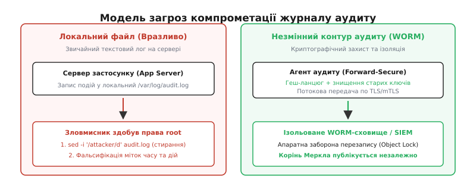
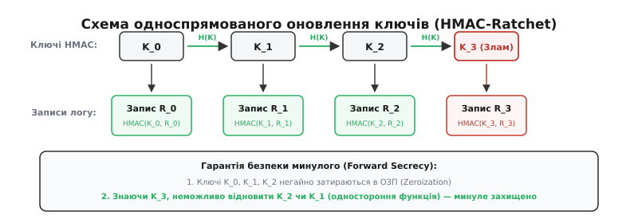
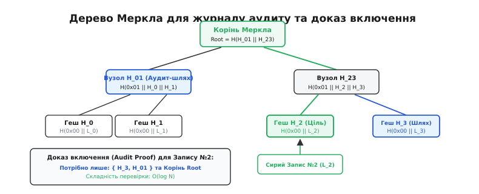

# Аудит-лог як вузол безпеки та незмінні журнали (Audit Logging)

<preknowlist>
- [Криптографічні геш-функції](topic:programming/cryptographic-hash) — односторонні перетворення даних фіксованої довжини зі стійкістю до колізій та зміни прообразу.
- [Дерево Меркла](topic:algorithms/merkle-tree) — бінарне дерево криптографічних гешів для компактного доведення цілісності та включення елементів.
- [Secure Boot і ланцюг довіри](topic:programming/firmware-secure-boot) — перевірка цифрових підписів перед виконанням коду та апаратний корінь довіри.
- [Принцип найменших привілеїв](topic:programming/least-privilege) — надання мінімально необхідного набору прав та модель відмови за замовчуванням.
- [Моделювання загроз](topic:programming/threat-modeling) — аналіз векторів атак за моделлю STRIDE та властивість невідмовності дій.
</preknowlist>

У процесинговому центрі платіжного сервісу зловмисник отримує доступ до облікового запису системного адміністратора бази даних. Протягом кількох хвилин він виконує прямий SQL-запит до таблиці транзакцій, змінює реквізити отримувача та переказує 2.5 мільйона гривень на підконтрольні рахунки. Одразу після цього зловмисник відкриває термінал сервера, запускає команду очищення текстових логів `sed -i '/UPDATE transactions/d' /var/log/app.log` і перезаписує журнал системного демона нулями через `cat /dev/null > /var/log/syslog`. Коли вранці служба фінансового моніторингу виявляє нестачу коштів, група реагування на інциденти стикається з порожніми або вибірково відредагованими файлами: неможливо встановити ні точний час компрометації, ні скомпрометований акаунт, ні повний перелік модифікованих записів.

Ця катастрофа розкриває фундаментальну інженерну різницю між звичайним діагностичним логуванням та безпековим аудитом: **текстовий файл на локальному диску належить операційній системі, і будь-який суб'єкт із привілеями адміністратора може безкарно переписати його історію**. Звичайний лог створюється для діагностики помилок розробниками; журнал аудиту створюється як судове свідчення, яке зобов'язане вистояти навіть тоді, коли сам сервер повністю захоплено ворогом.

**Журнал аудиту безпеки** (англ. *audit log*, від лат. *auditus* — «слухання, перевірка») — це спеціалізований незмінний потік структурованих записів про всі критичні операції в системі, захищений математичними гарантіями цілісності (лат. *integritas*), невідмовності (англ. *non-repudiation*) та хронологічної неперервності.

## Діагностичні логи проти журналів аудиту безпеки

У багатьох командах розробки журнали безпеки помилково сприймають як різновид виклику `printf` або стандартного додавання рядків у `syslog`. Таке змішування руйнує контур захисту, оскільки діагностичні логи та журнали аудиту мають діаметрально протилежні технічні вимоги.

| Властивість | Діагностичний лог (Debug/Trace) | Журнал аудиту (Security Audit) |
| :--- | :--- | :--- |
| Цільова аудиторія | Розробники та DevOps-інженери | Аудитори, SIEM, криміналісти |
| Режим доставки | Найкращі зусилля (Best-effort) | Гарантована доставка (Fail-secure) |
| Збереження при збоях | Допускається втрата записів | Втрата неприпустима (блокування) |
| Формат даних | Довільний текст, змінні рядки | Строга типізована схема (5W1H) |
| Конфіденційність | Ризик витоку паролів і PII | Обов'язкова фільтрація та маскування |
| Зміна історії | Дозволено ротацію та видалення | Незмінність (WORM), захист від root |

Коли розробник пише в лог `DEBUG: User login failed, password: secret123`, система створює критичну вразливість витоку облікових даних. Коли ж та сама система під навантаженням скидає логи через переповнення UDP-буфера, вона позбавляє службу безпеки можливості відстежити атаку розподіленої відмови в обслуговуванні або перебір паролів.

## Модель загроз журналу аудиту: як атакують історію подій

Щоб побудувати надійний журнал аудиту, інженер зобов'язаний розглядати сам журнал як першочергову ціль супротивника. Зловмисник, проникнувши в систему, завжди намагається нейтралізувати механізм моніторингу за чотирма основними векторами.


*Модель загроз: локальний текстовий лог може бути стертий або модифікований зловмисником із правами root. Захищений контур передбачає криптографічне скріплення записів ключами Forward-Secure та миттєве потокове вивантаження в ізольоване WORM-сховище.*

1. **Ретроспективна модифікація та стирання (Tampering & Deletion):** Здобувши права `root` або доступ до СУБД, зловмисник змінює часові мітки подій, видаляє рядки власної активності або вставляє правдоподібні дії інших користувачів, підставляючи невинних осіб.
2. **Ін'єкція фальшивих розділювачів (Log Injection / Log Forgery):** Якщо вхідні дані користувача записуються в лог без санітизації, зловмисник передає рядок з керуючими символами переносу рядка `\r\n` або ANSI escape-послідовностями:
   ```
   admin\n[2026-08-20T12:00:00Z] AUTH_SUCCESS user=admin ip=127.0.0.1
   ```
   Наївний парсер сприймає цей текст як два окремі легітимні системні записи, приховуючи справжню спробу зламу.
3. **Атака на виснаження ресурсів (Log Flooding DoS):** Зловмисник генерує мільйони штучних невдалих запитів, щоб переповнити локальний накопичувач або перевантажити мережевий канал до сервера збору логів. Якщо система налаштована некоректно, вона або падає, або мовчки перестає записувати нові події.
4. **Викрадення конфіденційних даних через логи:** Журнали подій збираються з усіх серверів в єдиний пул SIEM. Зловмисник без доступу до продуктивної бази даних може атакувати менш захищене сховище логів, щоб витягти з нього персональні дані клієнтів (PII), сесійні токени або внутрішні IP-адреси мережі.

Детальний аналіз того, як розвивалися ці загрози від перших атак на мейнфрейми до сучасних вимог «Помаранчевої книги» DoD TCSEC, наведено в [історичному нарисі розвитку систем аудиту](topic:programming/audit-logging/hist-orange-book-and-audit.md).

## Канонічна 5W1H-модель подій аудиту

Журнал аудиту не може складатися з вільних текстових повідомлень. Кожен запис зобов'язаний бути детермінованою структурою даних, яка дає вичерпні відповіді на шість класичних криміналістичних запитань (модель **5W1H**):

- **Хто (Who / Subject):** Унікальний незмінний ідентифікатор суб'єкта (`user_id`, `service_account`), його поточна роль, вихідна IP-адреса клієнта, ідентифікатор сесії та спосіб автентифікації (пароль, апаратний токен FIDO2, сертифікат mTLS).
- **Що (What / Action):** Стандартизоване найменування операції у форматі дієслова високого рівня (`iam.role.grant`, `database.table.drop`, `payment.transfer.execute`).
- **Над чим (On What / Target Object):** Цільовий ресурс, його тип, унікальний ідентифікатор (URI/ARN), а також криптографічний геш стану ресурсу до та після мутації.
- **Коли (When / Timestamp):** Фізичний час за шкалою UTC за стандартом ISO 8601 з мікросекундною або наносекундною точністю, доповнений монотонним системним лічильником для виявлення розсинхронізації годинників.
- **Де (Where / Context):** Назва вузла кластера, ідентифікатор процесу (PID/PPID), мережева зона, контейнерний простір імен та географічна прив'язка.
- **Чому та який результат (Why & Outcome):** Статус завершення (`SUCCESS`, `DENIED`, `ERROR`), код помилки та посилання на ідентифікатор політики безпеки, яка дозволила або заблокувала дію.

Повну технічну схему валідації полів у форматі JSON Schema та бінарні структури низькорівневих заголовків наведено у [специфікації канонічної схеми подій безпеки](topic:programming/audit-logging/api-audit-schema.md).

## Механізми криптографічної незмінності: ланцюги гешів та односпрямовані храповики

Щоб унеможливити непомітну модифікацію записів, журнал структурують у вигляді **ланцюга криптографічних гешів** (англ. *Cryptographic Hash Chain*). Кожен новий запис `R_i` включає в себе криптографічний геш усього попереднього запису `H_{i-1}`:

```
H_i = SHA-256(H_{i-1} || R_i)
```

Якщо зловмисник спробує змінити хоча б один біт у записі `R_k` (де `k < n`), це призведе до зміни значення `H_k`, що автоматично зробить недійсними всі наступні геші `H_{k+1}, ..., H_n` аж до кінця файлу. Проте сам по собі геш-ланцюг не захищає від зловмисника з правами `root`: маючи процесорний час, він може просто перерахувати всі геші `H_k..H_n` заново.

Для вирішення цієї проблеми застосовують криптографічний механізм **односпрямованого оновлення ключів** (англ. *Forward-Secure Integrity*, або *HMAC Ratchet*, запропонований Брюсом Шнаєром та Джоном Келсі).


*Храповик ключів Forward-Secure: ключ K_i оновлюється за односторонньою функцією H(K_i). Старий ключ негайно затирається в пам'яті. Злам сервера в момент часу T дає зловмиснику лише K_3, що унеможливлює підробку підписів R_0..R_2.*

Механізм працює за таким алгоритмом:
1. Під час запуску служби аудиту генерується початковий таємний ключ `K_0`.
2. Запис `R_i` підписується поточним ключем: `MAC_i = HMAC-SHA256(K_i, H_{i-1} || R_i)`.
3. Одразу після формування підпису генерується ключ наступної епохи за допомогою односторонньої геш-функції:
   ```
   K_{i+1} = SHA-256(K_i)
   ```
4. Попередній ключ `K_i` **негайно фізично затирається в оперативній пам'яті** (`explicit_bzero` або нульовий деструктор).

> 🔧 **Навіщо це.** Властивість односторонності геш-функції гарантує: знаючи `K_{i+1}`, математично неможливо обчислити `K_i`. Якщо хакер отримує повний контроль над сервером на кроці `m` і викрадає з пам'яті ключ `K_m`, він не може згенерувати дійсні підписи для історичних записів `R_0, ..., R_{m-1}`. Будь-яка спроба підмінити старі дані буде миттєво викрита аудитором, оскільки перевірочний ланцюг підписів розірветься.

Повний вихідний код робочої підсистеми з реалізацією геш-ланцюга та храповика ключів мовами C та C++ доступний у [практичній реалізації незмінного криптографічного журналу](topic:programming/audit-logging/proj-tamper-evident-log.md).

## Дерева Меркла та перевірка цілісності на масштабі

У розподілених системах, хмарних інфраструктурах та реєстрах прозорості (Certificate Transparency, Sigstore) аудиторам потрібно перевіряти записи серед сотень мільйонів подій без передачі гігабайтів сирих даних. Для цього записи пакують у **дерева Меркла** (англ. *Merkle Trees*).


*Дерево Меркла для журналу аудиту: перевірка наявності запису L_2 вимагає лише його сестри H_3 та сусіднього піддерева H_01. Перевірка здійснюється за O(log N) операцій без читання всього логу.*

Дерево Меркла надає дві ключові математичні гарантії:
1. **Доказ включення (Inclusion Proof / Audit Path):** Дозволяє клієнту переконатися, що його дія або транзакція дійсно потрапила в незмінний журнал. Розмір доказу становить лише `⌈log₂ N⌉` 32-байтових гешів. Для бази в 1 мільярд записів доказ містить лише 30 гешів (менше 1 КБ даних).
2. **Доказ узгодженості (Consistency Proof):** Дозволяє аудитору математично перевірити, що новий опублікований стан журналу розміром `N` є строгим продовженням попереднього стану розміром `M` (`M < N`), і лог-сервер не видалив жодного старого запису та не створив паралельної гілки історії.

Детальний математичний апарат, виведення формул розділення доменів для захисту від колізій другого прообразу та алгоритми перевірки розібрано в [математичному обґрунтуванні доказів дерева Меркла](topic:programming/audit-logging/math-merkle-audit-proof.md).

## Системна архітектура та захист від відмови

Надійність журналу аудиту визначається найслабшою ланкою в ланцюгу його збору та збереження. Промислова архітектура аудиту спирається на чотири системні бар'єри:

### 1. Збір подій на рівні ядра операційної системи
Користувацькі процеси можуть маніпулювати власними бібліотеками. Тому первинний збір критичних подій (виклики `execve`, `setuid`, `ptrace`, доступ до захищених файлів) виконується на рівні ядра через підсистему `auditd` (Netlink-сокети) або через сучасні зонди eBPF LSM (Linux Security Modules). Подія фіксується ядром до того, як процес користувача отримає керування після повернення із системного виклику.

### 2. Ізольоване потокове передавання (Out-of-Band Streaming)
Локальний диск сервера розглядається виключно як тимчасовий кільцевий буфер. Агент аудиту відкриває захищене mTLS-з'єднання з виділеним ізольованим сервером збору подій (SIEM / Log Aggregator) і передає записи в режимі реального часу. Навіть якщо атакований сервер буде фізично знищено через секунду після зламу, подія про виконання шкідливого процесу вже зафіксована на віддаленому сервері.

### 3. Сховища WORM (Write Once, Read Many) та Object Lock
Централізовані сервери аудиту скидають запечатані блоки логів у сховища класу WORM:
- Апаратні дискові масиви з оптичними носіями або прошивками, що апаратно блокують команду видалення чи перезапису сектора.
- Хмарні сховища з підтримкою режиму відповідності (наприклад, *Amazon S3 Object Lock in Compliance Mode*). У цьому режимі навіть обліковий запис власника компанії (*Root Account*) не має технічної можливості видалити або відредагувати файл до закінчення встановленого строку зберігання (наприклад, 7 років).

### 4. Політика поведінки при переповненні: Fail-Secure проти Fail-Open
Що має робити система, якщо мережа збору логів перевантажена, а локальний дисковий буфер заповнений на 100%?
- **Fail-Open (Небезпечний режим):** Продовжувати виконувати бізнес-операції, тимчасово відключивши логування. Зловмисники навмисно викликають такий стан через DoS-атаки, щоб діяти непомітно.
- **Fail-Secure / Fail-Closed (Захищений режим):** Операційна система або шлюз безпеки негайно блокує всі привілейовані операції та мутації даних, доки можливість надійного запису аудиту не відновиться. Для банківських та військових систем стандарти безпеки категорично вимагають дотримання режиму *Fail-Secure*.

### 5. Захист конфіденційності та маскування (PII Redaction)
Перед формуванням підпису та відправкою в загальну чергу всі конфіденційні поля (номери банківських карток, паролі, персональні ідентифікаційні номери) проходять через шлюз санітизації:
- **Незворотне маскування:** Заміна значень фіксованим шаблоном (наприклад, `4111 **** **** 1234`).
- **Детермінована псевдонімізація:** Заміна ідентифікатора клієнта криптографічним HMAC-гешем на окремому секретному ключі, що дозволяє корелювати дії користувача в системі без розкриття його реальної особи аудиторам.

## Регуляторна відповідність та судова готовність (Forensic Readiness)

Журнал аудиту безпеки є головним речовим доказом під час розслідування комп'ютерних злочинів та проходження обов'язкових аудитів відповідності. Провідні світові стандарти безпеки встановлюють суворі вимоги до контуру аудиту:

- **PCI-DSS v4.0 (Вимога 10):** Вимагає обов'язкового ведення детального аудиту всіх доступів до середовища даних власників платіжних карток (CDE), щоденного автоматизованого аналізу журналів, захисту від модифікації та зберігання історії щонайменше 12 місяців (з яких перші 3 місяці мають бути доступні для негайного онлайн-аналізу).
- **SOC 2 Type II (Trust Services Criteria):** Вимагає доказовості того, що система моніторингу виявляє несанкціоновані зміни конфігурації, а самі логи захищені від маніпуляцій з боку інженерного персоналу та адміністраторів інфраструктури.
- **ISO/IEC 27001 (Контроль A.12.4):** Регламентує обов'язковий захист журналів подій від підробки та несанкціонованого доступу, синхронізацію системних годинників за протоколом NTP з надійним джерелом точного часу (Stratum-1).
- **HIPAA Security Rule (§164.312(b)):** Вимагає впровадження апаратних та програмних механізмів, які записують та перевіряють будь-яку активність в інформаційних системах, що містять електронні захищені медичні дані (ePHI).

У судовій практиці цифрові докази мають юридичну силу лише за умови збереження безперервного ланцюга збереження доказів (англ. *Chain of Custody*). Поєднання WORM-сховищ, односпрямованих ключів Forward-Secure та періодичної публікації коренів Меркла забезпечує самоавтентифікацію електронних записів (Self-Authenticating Digital Records), що унеможливлює відхилення доказів у судовому процесі через підозри у фальсифікації.

## Синтез: непорушний ланцюг довіри

Журнал аудиту стає надійним вузлом безпеки лише тоді, коли всі його складові об'єднані в єдиний непорушний контур:

```
[Ядро ОС / eBPF] 
       │ (Перехоплення syscalls)
       ▼
[Канонізація 5W1H + Маскування PII]
       │
       ▼
[Геш-ланцюг + HMAC-Ratchet (Forward Secrecy)]
       │ (Знищення старих ключів)
       ▼
[Потокова передача mTLS] ──► [Ізольований SIEM] ──► [WORM-сховище Object Lock]
                                                        │
                                                        ▼
                                            [Публікація кореня Меркла]
```

Ця архітектура перетворює журнал аудиту з пасивного текстового файлу на активний криптографічний доказ. Вона позбавляє супротивника головної зброї — можливості приховати сліди злочину, гарантуючи повну підзвітність та невідмовність дій у цифровому просторі.
