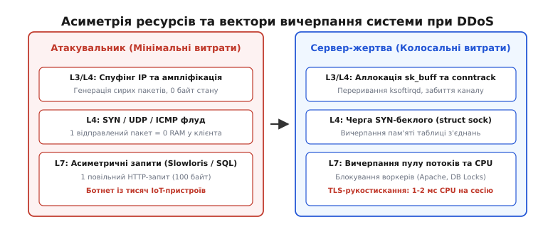
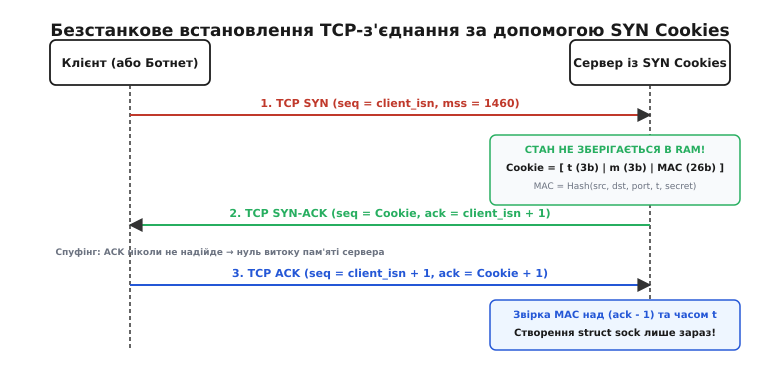
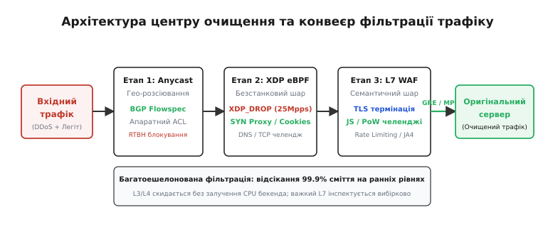

# Захист від DDoS-атак та зловживань: Anycast, SYN cookies, scrubbing

<preknowlist>
- [Anycast і глобальне балансування](book:communications/anycast) — маршрутизація однакової IP-адреси до найближчого вузла BGP.
- [Протокол BGP](book:communications/bgp) — протокол прикордонного шлюзу для керування міждоменними маршрутами інтернету.
- [Криптографічні гешфункції](book:programming/cryptographic-hash) — односторонні перетворення даних для контролю цілісності та генерації токенів.
- [Обмеження швидкості (Rate Limiting)](book:programming/rate-limiting) — алгоритми керування інтенсивністю запитів на основі лічильників та токенів.
- [Захист від повтору (Replay Protection)](book:programming/replay-protection) — криптографічні механізми перевірки свіжості та одноразовості повідомлень.
</preknowlist>

О десятій годині ранку платіжний шлюз великого інтернет-магазину потрапляє під раптовий шквал із 15 мільйонів підроблених TCP-пакетів на секунду. Фізичний оптичний канал у 10 Гбіт/с заповнений лише на десяту частину свого обсягу: дрібні 64-байтні пакети сумарно генерують ледь 960 Мбіт/с мережевого трафіку. Проте вже через 400 мілісекунд ядро Linux перестає відповідати на будь-які запити. Таблиця напіввідкритих з'єднань (`SYN backlog`) повністю забита фіктивними записами `struct request_sock`, системний процес обробки програмних переривань мережевої карти `ksoftirqd` на 100% утилізує всі ядра процесора, а пам'ять таблиці відстеження з'єднань `conntrack` переповнена. Справжні покупці отримують помилку тайм-ауту підключення ще до того, як їхній браузер зможе надіслати перший байт HTTP-запиту.

Цей сценарій демонструє головну загрозу сучасної мережевої інфраструктури: **розподілену відмову в обслуговуванні** (англ. *Distributed Denial of Service*, DDoS, від англ. *deny* — «відмовляти» та *service* — «обслуговування»). Зловмиснику не потрібно знаходити логічні помилки в коді чи зламувати криптографічні ключі: достатньо створити такий потік фальшивих або ресурсомістких подій, який вичерпає пропускну здатність каналів, пам'ять ядра або процесорний час серверів.

---

## 1. Фундаментальна асиметрія ресурсів: анатомія вичерпання системи

В основі будь-якої атаки на відмову в обслуговуванні лежить фізична та алгоритмічна **асиметрія витрат** (грец. *asymmetria* — «невідповідність, непропорційність») між тим, хто атакує, і тим, хто захищається.


*Асиметрія ресурсів: атакувальник витрачає мінімум зусиль на генерацію безстанкових пакетів, змушуючи сервер виділяти пам'ять ядра, таблиці сокетів та дорогі процесорні цикли.*

### Рівні асиметрії в протокольному стеку

1. **Мережевий та транспортний рівень (L3/L4 Asymmetry):**
   Щоб надіслати підроблений UDP- чи TCP SYN-пакет, атакувальнику потрібен лише відкритий сирий сокет (`raw socket`). Програма формує заголовок у пам'яті за кілька десятків тактів процесора і відправляє його в мережу. Атакувальник не зберігає жодного стану (нуль байтів RAM).
   Сервер-жертва, навпаки, при отриманні кожного пакета мусить пройти важкий конвеєр ядра Linux:
   - Обробити апаратне переривання мережевого адаптера (NIC) та передати керування драйверу в режимі опитування NAPI.
   - Виділити в оперативній пам'яті ядрову буферну структуру `struct sk_buff` (близько 256–512 байтів службових метаданих на кожен 64-байтний пакет).
   - Прогнати пакет крізь хуки фаєрвола Netfilter (`iptables`/`nftables`), де підсистема `nf_conntrack` виділяє структуру стану відстеження зв'язку та захоплює м'ютекс геш-таблиці.
   - Виділити структуру напіввідкритого з'єднання `struct request_sock` у черзі беклогу прослуховуваного порту.

2. **Фактор підсилення ампліфікаційних атак (Amplification Factor):**
   При атаках із відбиттям (англ. *Reflection DDoS*) зловмисник надсилає короткий запит із підробленою IP-адресою жертви до відкритого публічного сервера в інтернеті (рефлектора). Сервер-рефлектор генерує відповідь, розмір якої в десятки чи сотні разів перевищує розмір запиту, і спрямовує цей потік на жертву:
   - **DNS Amplification (RFC 4033):** Запит типу `ANY` або `DNSKEY` розміром 50 байтів породжує підписану DNSSEC-відповідь на 3000–4000 байтів (підсилення в **50–80 разів**).
   - **NTP `monlist`:** Запит розміром 234 байти повертає список останніх 600 клієнтів розміром до 48 Кбайт (підсилення до **556 разів**).
   - **Memcached UDP (порт 11211):** 15-байтовий запит `get` може повернути мегабайтний дамп збережених даних, забезпечуючи катастрофічне підсилення до **50 000 разів**.

3. **Прикладний та криптографічний рівень (L7 / TLS Asymmetry):**
   При встановленні захищеного з'єднання TLS 1.3 клієнт надсилає повідомлення `ClientHello` (кілька сотень байтів), для генерації якого потрібна одна базова операція на еліптичній кривій (наприклад, X25519, що займає менше 50 мікросекунд процесорного часу).
   Сервер для відповіді та валідації змушений виконати повне криптографічне рукостискання, згенерувати власний ключ, обчислити цифровий підпис сертифіката (RSA-2048 або ECDSA) і виділити контекст сесії в пам'яті процесу (від 20 до 80 Кбайт RAM на одне активне з'єднання). Співвідношення обчислювальних витрат сягає `1:15` на користь атакувальника.

4. **Семантичний рівень баз даних та бізнес-логіки (Application Abuse):**
   Клієнт надсилає крихітний HTTP-запит розміром 120 байтів: `GET /api/v1/search?query=a*&sort=rating_desc`.
   Для формування відповіді бекенд змушений:
   - Розпарсити HTTP-заголовки та JSON.
   - Перевірити сесійний JWT-токен або вичитати сесію з Redis.
   - Запустити важкий SQL-запит із повнотекстовим скануванням кількох таблиць, сортуванням мільйона рядків у тимчасовій таблиці на диску та завантаженням результатів у пам'ять додатка.
   
Тут асиметрія стає абсолютно фатальною: один надісланий кілобайт з боку клієнта спричиняє гігабайти дискового вводу-виводу (I/O) та секунди блокування процесорних ядер бази даних.

---

## 2. Рівень глобальної маршрутизації: BGP Anycast та Sinkholing

Коли потужність атаки досягає сотень гігабітів або кількох терабітів на секунду, жоден окремий сервер і жоден дата-центр у світі не можуть впоратися з потоком самостійно: фізичні вхідні оптичні порти та магістральні комутатори переповнюються ще на підході до мережі жертви.

Фундаментальним інженерним вирішенням цієї проблеми є технологія [Anycast-маршрутизації](book:communications/anycast) (англ. *anycast*, від лат. *unus* — «один» та англ. *cast* — «спрямовувати»).

```
                         ┌─── BGP Anycast PoP (Франкфурт) ───► Поглинає 400 Гбіт/с
                         │
Атака 1.2 Тбіт/с ────────┼─── BGP Anycast PoP (Сінгапур)   ───► Поглинає 500 Гбіт/с
(Розподілений ботнет)    │
                         └─── BGP Anycast PoP (Сан-Паулу)  ───► Поглинає 300 Гбіт/с
                                                                (Жоден PoP не перевантажено)
```

Замість розміщення єдиної публічної IP-адреси на одному сервері в одному дата-центрі, десятки центрів обробки даних (точок присутності, PoP — *Point of Presence*) по всьому світу налаштовуються з абсолютно однаковою IP-адресою та транслюють її глобальним інтернет-маршрутизаторам через протокол [BGP](book:communications/bgp).

### Механізм поглинання трафіку (Anycast Sinkholing)

Коли розподілений ботнет генерує гігантський потік атаки, трафік не концентрується в одній точці. Завдяки стандартному алгоритму вибору найкоротшого шляху BGP (*AS-Path length*) інтернет-провайдери спрямовують пакети кожного зараженого пристрою до **найближчого географічного та топологічного вузла Anycast**:
- Заражені пристрої в Європі потрапляють на сервери у Франкфурті та Лондоні.
- Азійська частина ботнету поглинається вузлами в Токіо та Сінгапурі.
- Американський трафік фільтрується в Сан-Хосе та Ашберні.

У результаті терабітна атака автоматично дробиться на десятки дрібних локальних потоків по 20–40 Гбіт/с, кожен з яких повністю вкладається в смугу пропускання регіонального вузла очищення.

### Протокольні інструменти магістрального відсікання: RTBH та BGP Flowspec

Якщо певна IP-адреса всередині автономної системи зазнає нездоланної атаки, що загрожує роботі всієї решти мережі, інженери застосовують два стандартизовані BGP-механізми:

1. **Remotely Triggered Black Hole (RTBH, RFC 7999):**
   Маршрутизатор жертви відправляє вищестоящому магістральному провайдеру BGP-анонс атакованої IP-адреси з префіксом `/32` та спеціальною стандартною спільнотою `BLACKHOLE` (`0xFFFF029A` або `65535:666`). Усі прикордонні маршрутизатори провайдера негайно перенаправляють увесь трафік до цієї адреси у віртуальний інтерфейс `Null0` (чорну діру). Це спричиняє повну недоступність цільової адреси, але рятує решту тисяч серверів компанії від колапсу каналу.

2. **BGP Flow Specification (BGP Flowspec, RFC 8955):**
   На відміну від «грубого» RTBH, Flowspec дозволяє передавати на магістральні маршрутизатори точні правила фільтрації (аналог розподіленого фаєрвола): скидати тільки UDP-трафік на порт 53 з розміром пакета понад 1000 байтів, не чіпаючи нормальний TCP-трафік на порти 80 та 443. Детальні формати структур та розширених спільнот Flowspec систематизовано в [довіднику правил BGP Flowspec та інтерфейсів фільтрації](book:programming/ddos-abuse-defense/api-scrubbing-pipeline.md).

---

## 3. Безстанковий захист транспортного рівня: TCP SYN Cookies

Навіть якщо канал зв'язку витримує обсяг трафіку, атака типу **SYN Flood** здатна вивести з ладу операційну систему жертви за лічені мілісекунди.

Стандартний триетапний процес встановлення з'єднання TCP (англ. *Three-Way Handshake*) вимагає збереження стану:
1. Клієнт надсилає пакет `SYN` (seq = `client_isn`).
2. Сервер виділяє блок пам'яті `struct request_sock`, зберігає параметри клієнта, запускає таймер повторного надсилання і відправляє у відповідь `SYN-ACK` (seq = `server_isn`, ack = `client_isn + 1`).
3. Клієнт завершує рукостискання пакетом `ACK` (seq = `client_isn + 1`, ack = `server_isn + 1`), після чого ядро створює повноцінний сокет у черзі `accept()`.

Якщо зловмисник генерує мільйони SYN-пакетів із випадкових неіснуючих IP-адрес (спуфінг), завершальний `ACK` ніколи не надійде. Черга напіввідкритих з'єднань (`SYN backlog`) миттєво заповнюється, і ядро починає відкидати всі нові вхідні запити від легітимних користувачів.

### Математична концепція ліквідації стану

У 1996 році Деніел Бернштейн та Ерік Шенк запропонували фундаментальне рішення — **SYN Cookies** (RFC 4987). Їхня логіка бездоганна: **сервер не повинен зберігати стан клієнта в пам'яті, якщо він може закодувати його безпосередньо у відповідь клієнту**.


*Безстанкове встановлення з'єднання: сервер формує ISN як криптографічний токен з часовою міткою та MSS. Стан у пам'яті виділяється лише після перевірки підпису у фінальному пакеті ACK.*

Сервер замінює псевдовипадковий початковий порядковий номер `server_isn` спеціально розрахованим 32-бітним числом — **Cookie**:

```
 31        29 28        26 25                                             0
┌────────────┬────────────┬─────────────────────────────────────────────────┐
│ Час t (3b) │ MSS m (3b) │           Криптографічний MAC s (26 бітів)      │
└────────────┴────────────┴─────────────────────────────────────────────────┘
```

1. **`t` (біти 31..29, 3 біти):** Повільний лічильник часу, що інкрементується кожні 64 секунди (`t = (time >> 6) & 0x07`). Повний оборот з 8 значень триває 512 секунд.
2. **`m` (біти 28..26, 3 біти):** Індекс максимального розміру сегмента (MSS), закодований як одне з 8 фіксованих табличних значень (наприклад: 536, 1200, 1400, 1440, 1452, 1460, 8960, 9000).
3. **`s` (біти 25..0, 26 бітів):** Усічений криптографічний код автентифікації (MAC), обчислений від 4-tuple IP-адрес і портів, порядкового номера клієнта, мітки `t` та локального секретного ключа сервера `K_secret`:

```
s = SipHash(src_ip, dst_ip, src_port, dport, client_isn, t, K_secret) & 0x03FFFFFF
```

### Верифікація третього пакета (ACK)

Сервер відправляє `SYN-ACK` із цим розрахованим значенням `Cookie` і **негайно видаляє будь-яку згадку про з'єднання зі своєї пам'яті** (0 байтів RAM у черзі беклогу).

Коли легітимний клієнт надсилає завершальний пакет `ACK`, поле підтвердження містить:

```
ack_seq = Cookie + 1
```

Сервер виконує три операції:
1. Віднімає одиницю: `Cookie = ack_seq - 1`.
2. Витягує часовий індекс `t` та індекс MSS `m`. Перевіряє, чи не застаріло вікно: поточний час `t_now` повинен відрізнятися від `t` не більше ніж на 1 одиницю (вікно допустимості 64–128 секунд).
3. Перераховує очікуваний MAC `s'` від адрес і портів пакета, використовуючи збережений у Cookie індекс `t`.

Якщо значення `s'` збігається з молодшими 26 бітами куки, ядро отримує математичний доказ того, що:
- Клієнт справді існує на вказаній IP-адресі (він отримав `SYN-ACK` і повернув його модифіковане значення).
- Пакет належить саме цьому з'єднанню і був згенерований не більше двох хвилин тому.

Лише в цей момент сервер виділяє повноцінну структуру сокета `struct sock` і передає з'єднання додатку. Якщо ж це була атака з підробленою адресою відправника, `ACK` ніколи не надійде, і пам'ять сервера залишається абсолютно незайманою.

Детальний історичний контекст винаходу та кризу Panix 1996 року висвітлено в [історичному нарисі винаходу SYN cookies та перших DDoS-криз](book:programming/ddos-abuse-defense/hist-syn-cookie-and-early-ddos.md). Повний математичний розрахунок імовірності колізій та бітового бюджету наведено в [математичному аналізі ентропії та ймовірності колізій SYN cookies](book:programming/ddos-abuse-defense/math-syn-cookie-entropy.md), а робочий програмний код генератора та валідатора — у [практичній реалізації та валідації TCP SYN Cookies](book:programming/ddos-abuse-defense/proj-syn-cookie-eval.md).

---

## 4. Високопродуктивна фільтрація в ядрі: eBPF та XDP

Незважаючи на ефективність SYN cookies, стандартний мережевий стек Linux має власну стелю продуктивності. Коли на мережевий інтерфейс надходить потік у 10–20 мільйонів пакетів на секунду (Mpps), центральний процесор витрачає до 80% свого часу суто на виділення та звільнення структур `struct sk_buff` у пам'яті ядра ще до того, як пакет дійде до фаєрвола `iptables` або `nftables`.

Для вирішення цього вузького місця було створено **XDP** (англ. *eXpress Data Path* — «експрес-шлях обробки даних») на основі технології **eBPF** (англ. *extended Berkeley Packet Filter*).

```
[ NIC Ring Buffer ] ──► [ XDP Hook (eBPF) ] ──► XDP_DROP (Миттєве скидання: 25 Mpps/ядро)
                                 │
                                 └──► XDP_PASS (Легітимний трафік: аллокація sk_buff)
```

Програма eBPF завантажується безпосередньо в драйвер мережевої карти (або в кремній SmartNIC) і виконується на найранішому етапі: щойно контролер завершив прямий доступ до пам'яті (DMA), до виділення будь-яких структур ядра.

### Швидкісна фільтрація XDP

Програма XDP перевіряє байти Ethernet-кадру та повертає дію за лічені наносекунди:
- `XDP_DROP` — миттєво відкинути пакет. Пам'ять повертається в кільцевий буфер драйвера. Одне ядро сучасного процесора здатне обробляти до **25–30 мільйонів пакетів на секунду** у режимі `XDP_DROP`.
- `XDP_TX` — відправити модифікований пакет назад у мережу через той самий порт (ідеально для безстанкової генерації `SYN-ACK` відповідей без залучення стека TCP ядра).
- `XDP_PASS` — пропустити перевірений легітимний пакет далі вгору до стандартного мережевого стека Linux.

Поєднання BGP Anycast та фільтрації XDP eBPF на рівні драйверів дозволяє сучасним хмарним провайдерам поглинати та фільтрувати об'ємні DDoS-атаки потужністю в мільярди пакетів на секунду без деградації операційних систем.

---

## 5. Центри очищення трафіку (Scrubbing Centers)

Для компаній, які не володіють власною глобальною Anycast-мережею, захист забезпечують спеціалізовані **центри очищення трафіку** (англ. *Scrubbing Centers*, від англ. *scrub* — «чистити, шкребти»).


*Багатоешелонований конвеєр центру очищення: трафік проходить від апаратного розсіювання на Anycast Edge до прикладного L7 WAF, повертаючись на цільовий сервер через тунель GRE.*

### Принцип роботи центру очищення

1. **Завертання трафіку (Traffic Redirection):**
   Під час виявлення атаки інженери або автоматичні системи детекції (аналізатори NetFlow/IPFIX) змінюють маршрутизацію: оголошують префікс клієнта через BGP Anycast провайдера захисту або змінюють DNS-записи (CNAME) на проксі-вузли очищення.
2. **Багатоступенева фільтрація (Multi-Tier Scrubbing):**
   - *Етап 1 (L3/L4 Stateless):* Апаратні фільтри на базі TCAM та правила BGP Flowspec відсікають ампліфікаційний UDP-флуд (NTP, DNS, Memcached) та невалідні пакети (відсутні контрольні суми, заборонені комбінації прапорців).
   - *Етап 2 (L4 Stateful & Challenge):* Модулі XDP eBPF запускають алгоритми SYN Proxy, TCP Reset Challenge та валідацію DNS-запитів, фільтруючи підроблені IP-адреси.
   - *Етап 3 (L7 Semantic):* Зворотні проксі-сервери термінують сесії TLS, аналізують поведінку клієнтів, обмежують частоту запитів та видають криптографічні челенджі.
3. **Реінжекція чистого трафіку (Clean Traffic Reinjection):**
   Очищений трафік передається на оригінальний сервер жертви (*Origin Server*) через інкапсульовані тунелі **GRE** (англ. *Generic Routing Encapsulation*), віртуальні канали MPLS або прямі фізичні оптичні стики (Cross-Connect). Оригінальний сервер налаштовує фаєрвол так, щоб приймати з'єднання **виключно** з довірених IP-адрес центру очищення, унеможливлюючи пряму атаку в обхід фільтрів.

### Асиметрична маршрутизація та Direct Server Return (DSR)

У центрах очищення високої потужності часто застосовують схему прямої відповіді сервера (**Direct Server Return**, DSR):
- **Вхідний потік (клієнт → сервер):** важкий і брудний трафік (DDoS-атака) проходить крізь фільтрувальні вузли центру очищення, де 99% пакетів відкидаються.
- **Передача на бекенд:** очищений запит інкапсулюється в тунель GRE і надсилається на оригінальний сервер бекенду.
- **Вихідна відповідь (сервер → клієнт):** сервер формує відповідь (наприклад, мегабайтний файл або відеотрансляцію) і відправляє її клієнту **напряму через свій стандартний інтернет-канал**, оминаючи центр очищення.

Для роботи DSR бекенд налаштовує спільну віртуальну адресу (VIP) на локальному інтерфейсі `dummy0` або `lo` з вимкненою відповіддю на ARP-запити (`arp_ignore = 1`). Це усуває вузьке місце пропускної здатності на вихідному каналі центру очищення.

---

## 6. Захист прикладного рівня (L7 Abuse Defense)

Коли зловмисники імітують легітимних користувачів, відкриваючи повноцінні TCP- та TLS-з'єднання через розподілені ботнети з реальних домашніх комп'ютерів чи IoT-пристроїв, механізми L3/L4 стають безсилими. Захист переміщується на прикладний рівень (**Layer 7**).

### Вектори прикладних атак та методи протидії

| Вектор атаки | Механізм деструктивного впливу | Інженерний контрзахід |
|---|---|---|
| **Slowloris** (повільні заголовки) | Клієнт надсилає HTTP-заголовки по 1 байту кожні 10 секунд, тримаючи відкритими тисячі сокетів і вичерпуючи пул воркерів вебсервера (Apache, Tomcat). | Асинхронні неблокуючі сервери на базі `epoll` (Nginx, Envoy), агресивні таймаути читання заголовків (`client_header_timeout 5s`), контроль мінімальної швидкості передачі даних. |
| **Slow POST / R-U-Dead-Yet** | Клієнт оголошує `Content-Length: 1000000` і надсилає тіло запиту зі швидкістю 1 байт на секунду, блокуючи пам'ять та потоки обробки. | Обмеження максимального часу передачі тіла (`client_body_timeout`), буферизація на рівні шлюзу з мінімальним порогом бітрейту. |
| **HashDoS** (колізії геш-таблиць) | Відправка HTTP POST із тисячами параметрів, що навмисно викликають колізію внутрішньої геш-функції мови (наприклад, Java/PHP), перетворюючи пошук у словнику з `O(1)` на `O(n)`. | Використання криптографічно стійких геш-функцій з рандомізованою сіллю для геш-таблиць ([SipHash](book:programming/cryptographic-hash)), жорстке обмеження кількості параметрів у запиті. |
| **ReDoS** (катастрофічний бектрекінг) | Передача рядка, що змушує регулярний вираз виконувати експоненційну кількість перевірок `O(2ⁿ)`, завантажуючи ядро CPU на 100%. | Використання детермінованих кінцевих автоматів (DFA-рушії: RE2, Rust regex) замість NFA з бектрекінгом; жорсткі таймаути виконання регулярних виразів. |
| **GraphQL Query Abuse** | Відправка глибоко вкладених або циклічних запитів (`{ user { friends { friends { friends ... } } } }`), що перевантажують базу даних. | Обмеження максимальної глибини запиту (Query Depth Limiting), статичний розрахунок вартості запиту (Query Cost Analysis) перед його виконанням. |
| **HTTP Request Flood / Scraping** | Мільйони валідних запитів до некешованих важких ендпоінтів бази даних (пошук, звіти, оформлення замовлення). | Багаторівневий [Rate Limiting](book:programming/rate-limiting), інтерактивні JavaScript/WASM-челенджі, криптографічний Proof of Work. |

### Відбитки клієнтів (Client Fingerprinting: JA3, JA4 та HTTP/2)

Зловмисники рідко використовують справжні повноцінні браузери: більшість ботів працюють на базі утиліт `curl`, бібліотек `Python requests`, `Go net/http` або кастомних бінарних файлів. Навіть якщо бот підробляє заголовок `User-Agent: Mozilla/5.0...`, його внутрішній криптографічний та мережевий стек видає справжню природу.

1. **Відбитки TLS (JA3 / JA4):**
   Під час відправки пакета `ClientHello` клієнт передає свій список підтримуваних шифрів (Cipher Suites), розширень TLS, еліптичних кривих та їхніх форматів. Оскільки порядок та склад цих параметрів жорстко зашиті в конкретну версію бібліотеки (OpenSSL, Go crypto/tls, BoringSSL у Chrome чи NSS у Firefox), їхній MD5/SHA-256 хеш (**JA3/JA4**) однозначно викриває скриптовий ботнет, що намагається видати себе за браузер Safari на iPhone.
2. **Відбитки HTTP/2 та TCP/IP (p0f):**
   Порядок відправки фреймів `SETTINGS`, початкові розміри вікон потоку, порядок заголовків HTTP/2 (псевдозаголовки `:method`, `:authority`, `:scheme`, `:path`) та пасивний аналіз TCP-параметрів (початковий TTL, порядок опцій TCP) дозволяють вебфаєрволу з високою точністю відрізняти автоматизовані інструменти від справжніх користувачів без показу нав'язливих капч.

---

## 7. Інженерний синтез: побудова ешелонованої оборони

Захист від розподілених атак ніколи не зводиться до одного чарівного інструмента. Надійна система будується за принципом **глибокоешелонованого захисту** (англ. *Defense in Depth*), де кожен шар фільтрує свій клас загроз:

```
┌───────────────────────────────────────────────────────────────────────────┐
│ 1. Рівень BGP & Anycast: Розсіювання терабітних об'ємів (Sinkholing)      │
├───────────────────────────────────────────────────────────────────────────┤
│ 2. Рівень BGP Flowspec & Апаратних ACL: Скидання ампліфікаційного UDP/ICMP│
├───────────────────────────────────────────────────────────────────────────┤
│ 3. Рівень XDP eBPF & Драйверів: Безстанкові SYN Cookies (25 Mpps/ядро)   │
├───────────────────────────────────────────────────────────────────────────┤
│ 4. Рівень Reverse Proxy (Nginx/Envoy): Асинхронний I/O проти Slowloris    │
├───────────────────────────────────────────────────────────────────────────┤
│ 5. Рівень L7 WAF & JA4: Відсікання ботів, TLS-фінгерпринти, PoW-челенджі  │
├───────────────────────────────────────────────────────────────────────────┤
│ 6. Рівень Додатка & БД: Rate Limiting, таймаути, SipHash, Circuit Breaker │
└───────────────────────────────────────────────────────────────────────────┘
```

### Зведена матриця ешелонованого захисту

| Рівень стеку | Клас атаки | Механізм захисту | Точка застосування | Накладні витрати / Затримка |
|---|---|---|---|---|
| **L3 (Мережевий)** | Терабітний UDP/ICMP флуд, IP-спуфінг | BGP Anycast Sinkholing, RTBH | Магістральні BGP-вузли (Edge) | 0 мс (природне скорочення RTT) |
| **L3/L4 (Протокольний)** | DNS/NTP/Memcached ампліфікація, фрагменти | BGP Flowspec, TCAM ACL | Прикордонні маршрутизатори | < 1 мкс (апаратне скидання) |
| **L4 (Транспортний)** | TCP SYN Flood, вичерпання backlog | XDP eBPF, TCP SYN Cookies | Мережевий драйвер NIC | < 50 нс на пакет |
| **L7 (Сесійний)** | Slowloris, Slow POST, TLS-флуд | Non-blocking epoll, JA4 WAF | Зворотний проксі (Nginx/Envoy) | < 1 мс |
| **L7 (Прикладний)** | HTTP Flood, Credential Stuffing, Scraping | JS/WASM Challenge, PoW, Token Bucket | WAF / API Gateway | 100–300 мс (лише для підозрілих) |
| **L7 (База даних)** | HashDoS, ReDoS, важкі SQL/GraphQL запити | SipHash, DFA regex, Query Cost Limit | Додаток / ORM / СУБД | 0 мс |

> 🔧 **Навіщо це.** Спроба вирішити проблему DDoS лише на рівні коду бекенда призводить до того, що сервер падає від вичерпання черги сокетів ядра. Спроба захиститися лише апаратним фаєрволом у власному дата-центрі призводить до того, що провайдер відключає клієнта через забиття оптичного кабелю. Справжня стійкість досягається лише тоді, коли важкі об'єми відсікаються без збереження стану на периферії інтернету, а додаток захищений від семантичних зловживань суворою валідацією та ізоляцією ресурсів.
