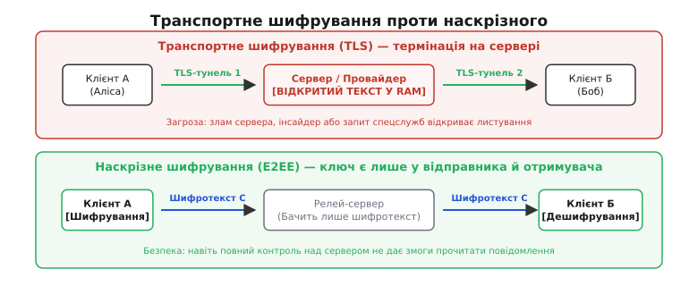
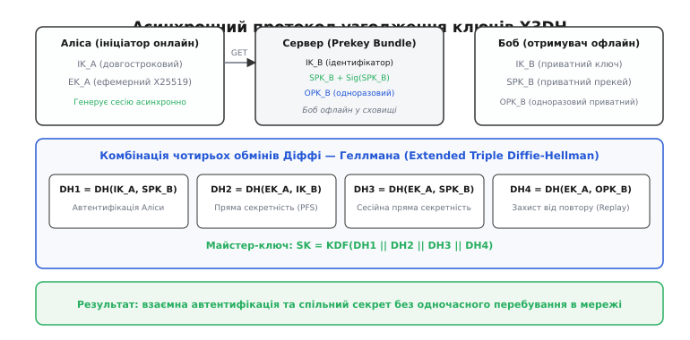
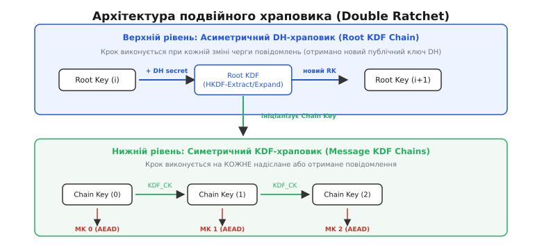
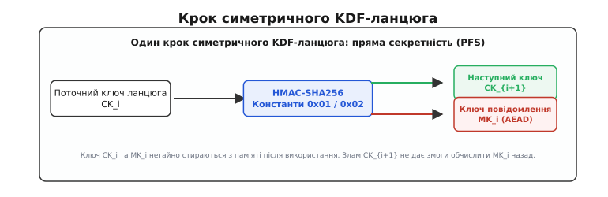
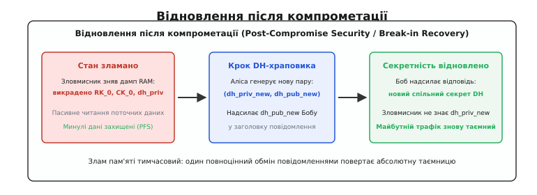
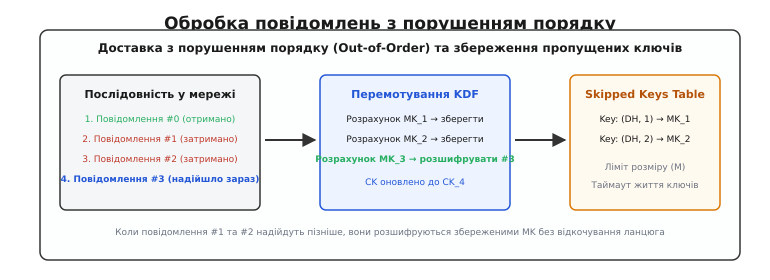

# Наскрізне шифрування: архітектура Signal Protocol та алгоритм Double Ratchet

<preknowlist>
- [Обмін ключами Діффі — Геллмана](topic:algorithms/diffie-hellman) — принцип узгодження спільного таємного ключа у відкритому каналі через асиметричну математику.
- [Криптографічні гешфункції](topic:programming/cryptographic-hash) — односторонні перетворення даних, лавинний ефект та стійкість до пошуку прообразу.
- [Похідні ключі: KDF і HKDF](topic:programming/key-derivation-function) — екстракція та розгортання псевдовипадкових ключів із криптографічного секрету.
- [Автентифіковане шифрування](topic:communications/authenticated-encryption) — режими AEAD (ChaCha20-Poly1305, AES-GCM) для одночасного захисту конфіденційності та цілісності.
- [Захист від повтору (replay)](topic:programming/replay-protection) — запобігання повторному впровадженню раніше перехоплених пакетів у мережевий сеанс.
</preknowlist>

Коли два пристрої обмінюються повідомленнями через хмарний сервер, звичайного транспортного шифрування TLS виявляється недостатньо. Протокол TLS створює криптографічний тунель між клієнтом і сервером, а потім між сервером і адресатом. Це означає, що в точці комутації — в оперативній пам'яті сервера-посередника — кожне повідомлення обов'язково розшифровується у відкритий текст. Злам хмарної інфраструктури, компрометація внутрішніх ключів компанії, зловмисний інсайдер, конфіскація обладнання або судова вимога відкривають стороннім особам прямий доступ до всього архіву листування.

Щоб позбутися потреби сліпо довіряти проміжним серверам, застосовують **наскрізне шифрування** (англ. *end-to-end encryption*, E2EE, від грец. *kryptos* — «таємний, прихований»). У моделі E2EE сервер розглядається як потенційно вороже середовище (англ. *zero-trust transport*): він лише маршрутизує зашифровані байти, не маючи математичної змоги розшифрувати бодай одне слово.


*Транспортне шифрування (TLS) розшифровує дані в пам'яті сервера, тоді як наскрізне (E2EE) тримає ключі виключно на пристроях кінцевих користувачів.*

Побудова наскрізного шифрування для сучасних мобільних додатків ставить три складні інженерні задачі:
1. **Асинхронність:** адресат може перебувати в офлайні цілодобово, але відправник повинен мати змогу згенерувати для нього зашифроване повідомлення негайно, без попереднього інтерактивного рукостискання в реальному часі.
2. **Пряма секретність** (англ. *Forward Secrecy*, PFS, від лат. *secretum* — «відокремлене, таємне»): якщо пристрій користувача викрадуть і витягнуть із нього поточні ключі, це не повинно дати змоги розшифрувати старі повідомлення, перехоплені з мережі в минулому.
3. **Зцілення після компрометації** (англ. *Break-in Recovery* або *Post-Compromise Security*): якщо зловмисник тимчасово перехопив повний стан пам'яті пристрою, система має автоматично відновити абсолютну конфіденційність наступних повідомлень, щойно користувачі обміняються кількома новими репліками.

Сучасним де-факто стандартом, що вирішує всі три проблеми, є **Signal Protocol** та його центральний механізм — алгоритм **Double Ratchet**.

---

### 1. Асинхронний старт сесії: протокол X3DH

Класичний протокол узгодження ключів Діффі — Геллмана вимагає, щоб обидві сторони були одночасно в мережі й надіслали одна одній свої відкриті ключі. Якщо Боб вимкнув смартфон або перебуває в дорозі, Аліса не може виконати інтерактивний обмін.

Для подолання цієї перешкоди застосовують протокол **X3DH** (англ. *Extended Triple Diffie-Hellman*). Його фундамент — концепція попередньо опублікованих ключів (**Prekeys**). Кожен користувач під час реєстрації або фонового оновлення генерує набір криптографічних ключів на еліптичній кривій Curve25519 (X25519) і завантажує їх у відкритому вигляді на сервер ключів:

1. **Ідентифікаційний ключ** (`IK`, англ. *Identity Key*) — довгостроковий відкритий ключ користувача, що однозначно визначає його обліковий запис або пристрій.
2. **Підписаний прекей** (`SPK`, англ. *Signed Prekey*) — середньостроковий відкритий ключ, який регулярно змінюється (наприклад, раз на тиждень) і завірений цифровим підписом Ed25519 від ідентифікаційного ключа `IK`. Це унеможливлює підміну прекея скомпрометованим сервером.
3. **Пул одноразових прекеїв** (`OPK_1, OPK_2, ... OPK_n`, англ. *One-Time Prekeys*) — пачка одноразових відкритих ключів. Сервер видає один такий ключ на кожну нову спробу ініціалізації сесії й одразу видаляє його зі свого сховища.

Коли Аліса вирішує вперше написати Бобу, вона надсилає запит до сервера й отримує криптографічний пакунок Боба (англ. *Prekey Bundle*): `{IK_B, SPK_B, Sig_B(SPK_B), OPK_B}`. Навіть якщо Боб офлайн, Аліса має все необхідне, щоб самостійно обчислити спільний сесійний ключ.

Аліса генерує власний випадковий одноразовий **ефемерний ключ** (`EK_A`, від грец. *ephemeros* — «одноденний, скороминущий») і виконує послідовність із чотирьох скалярних множень на еліптичній кривій:

```
DH1 = X25519(IK_A_priv, SPK_B_pub)   [Автентифікація: Аліса доводить право володіння IK_A]
DH2 = X25519(EK_A_priv, IK_B_pub)    [Пряма секретність: прив'язка ефемерного ключа до Боба]
DH3 = X25519(EK_A_priv, SPK_B_pub)   [Сесійна таємність: комбінація двох тимчасових ключів]
DH4 = X25519(EK_A_priv, OPK_B_pub)   [Одноразовий захист від повторного викрадення/replay]
```


*Чотири складові асинхронного обміну X3DH поєднують автентифікацію ініціатора та пряму секретність сесії навіть тоді, коли отримувач перебуває в офлайні.*

Усі чотири отримані значення конкатенуються й подаються на вхід криптографічної функції розгортання ключів HKDF на базі SHA-256:

```
SK = HKDF(salt = 0³², IKM = DH1 || DH2 || DH3 || DH4, info = "WhisperTextProtocolX3DH", L = 32)
```

Отримане 256-бітне значення `SK` стає початковим майстер-секретом сесії. Аліса шифрує своє перше повідомлення цим ключем і надсилає його Бобу разом зі своїми відкритими ключами `IK_A` та `EK_A`, а також ідентифікатором використаного `OPK_B`.

Коли Боб з'являється в мережі, він бере `IK_A` та `EK_A` із заголовка, знаходить у своєму захищеному локальному сховищі закриті ключі `SPK_B_priv` та `OPK_B_priv` і виконує ті самі чотири обчислення `DH1...DH4`. Обидві сторони отримують однаковий `SK`, не сказавши одна одній жодного слова в реальному часі.

> 🔧 **Навіщо чотири DH замість одного.** Якщо обмежитися лише `DH(IK_A, IK_B)`, компрометація довгострокових ключів через п'ять років дозволить розшифрувати всі минулі сесії. Якщо прибрати `DH1`, будь-хто зможе сфабрикувати сесію від імені Аліси. Якщо прибрати одноразовий `DH4`, сервер зможе повторно згодовувати старий прекей, що відкриє шлях до атак повтору. Чотири компоненти зв'язують докупи ідентичність, сесійну ефемерність та одноразовий захист.

Історичний шлях криптографічних протоколів від синхронного OTR до сучасного асинхронного стандарту X3DH викладено у вставці [📜 Від Off-the-Record до Signal Protocol: еволюція асинхронного криптографічного зв'язку](topic:programming/end-to-end-encryption/hist-otr-to-signal.md).

Строгий математичний виклад скалярної алгебри Curve25519 та ентропійні оцінки функції HKDF для протоколу X3DH наведено у матеріалі [🧮 Математичний апарат X3DH та ентропійні ланцюги Double Ratchet](topic:programming/end-to-end-encryption/math-double-ratchet.md).

---

### 2. Верифікація відбитків ключів: Safety Numbers

Протокол X3DH захищає від пасивного прослуховування та гарантує автентифікацію, але спирається на сервер як на каталог відкритих ключів. Якщо сервер ключів буде скомпрометовано або замінено активним зловмисником (атака Man-in-the-Middle, MitM), сервер може підсунути Алісі підроблений бандл Боба з власними ключами `IK_Attacker`. У такому разі сервер зможе перехоплювати й перешифровувати всі повідомлення.

Для виявлення активного посередника застосовують **коди безпеки** (англ. *Safety Numbers* або *числові відбитки*). Це криптографічний відбиток (геш), розрахований від конкатенації ідентифікаційних ключів обох співрозмовників:

```
Fingerprint = SHA-512(sort(IK_A, IK_B) || User_ID_A || User_ID_B)
```

Отриманий 512-бітний геш форматується у вигляді 60 десяткових цифр або QR-коду. Користувачі звіряють ці цифри або сканують QR-код під час особистої зустрічі чи через довірений незалежний канал зв'язку. Якщо сервер підмінить ідентифікаційний ключ бодай на один біт, числа на екранах Аліси й Боба гарантовано відрізнятимуться.

---

### 3. Подвійний храповик: архітектура Double Ratchet

Узгоджений за допомогою X3DH початковий ключ `SK` не можна використовувати для прямого шифрування тривалого потоку повідомлень. Якби Аліса й Боб шифрували сотні повідомлень одним ключем, викрадення поточного стану пам'яті скомпрометувало б увесь діалог від початку до кінця.

Розв'язанням є алгоритм **Double Ratchet** (англ. *ratchet* — «храповик», механічний зубчастий механізм, що вільно обертається лише в один бік і блокує зворотний рух). Алгоритм поєднує в собі два незалежні храповики:
1. **Симетричний KDF-храповик** (англ. *Symmetric KDF Chain*): на кожне надіслане чи отримане повідомлення вираховує новий одноразовий ключ шифрування та знищує старий.
2. **Асиметричний DH-храповик** (англ. *Diffie-Hellman Ratchet*): під час кожної зміни напрямку розмови генерує нову пару ключів на еліптичній кривій і змішує новий спільний секрет із кореневим станом.


*Дворівнева структура Double Ratchet: кореневий асиметричний храповик оновлюється під час зміни напрямку діалогу, а симетричні ланцюги крокують на кожне надіслане повідомлення.*

---

### 4. Симетричний KDF-ланцюг: механізм прямої секретності (PFS)

Симетричний ланцюг забезпечує безперервну генерацію унікальних ключів для кожного окремого повідомлення всередині однієї черги (наприклад, коли Аліса відправляє десять реплік поспіль).

Він працює за принципом криптографічного ланцюга гешів. Поточний стан ланцюга зберігається в змінній `CK` (англ. *Chain Key* — ключ ланцюга, 32 байти).

Щоб зашифрувати `i`-те повідомлення, стан робить крок уперед за допомогою двох викликів HMAC-SHA256 з різними фіксованими байтовими константами:

```
MK_i     = HMAC-SHA256(key = CK_i, data = 0x01)   [Ключ повідомлення для AEAD]
CK_{i+1} = HMAC-SHA256(key = CK_i, data = 0x02)   [Наступний стан ланцюга]
```


*Односторонній рух симетричного храповика: отримання нового ключа ланцюга та разового ключа повідомлення зі швидким затиранням попереднього стану в пам'яті.*

Одразу після обчислення:
1. Текст шифрується алгоритмом автентифікованого шифрування AEAD (наприклад, ChaCha20-Poly1305 або AES-256-GCM) за допомогою ключа `MK_i`.
2. Значення `MK_i` негайно та надійно затирається в пам'яті нулями (функцією на зразок `explicit_bzero`).
3. Попередній стан `CK_i` перезаписується значенням `CK_{i+1}`.

> 🔧 **Чому це дає пряму секретність.** Функція HMAC-SHA256 є криптографічно односторонньою (стійкою до пошуку прообразу). Якщо зловмисник через місяць захопить пристрій і витягне з оперативної пам'яті поточний ключ ланцюга `CK_{100}`, обчислити з нього значення `CK_{99}` або `MK_{99}` математично неможливо. Усі минулі повідомлення лишаються надійно запечатаними.

Проте симетричний ланцюг має фундаментальну вразливість: він рухається лише вперед за детермінованим алгоритмом без додавання нової зовнішньої ентропії. Якщо зловмисник зробив повний знімок пам'яті на кроці `CK_{100}`, він зможе самостійно обчислювати всі наступні ключі: `CK_{101} → MK_{101}`, `CK_{102} → MK_{102}` і читати весь майбутній трафік.

Для захисту майбутнього потрібен другий храповик — асиметричний.

---

### 5. Асиметричний DH-храповик: зцілення після компрометації (Break-in Recovery)

Асиметричний храповик вводить у систему свіжу ентропію щоразу, коли черга відправлення переходить від одного співрозмовника до іншого (крок типу «ping-pong»).

В основі лежить кореневий ланцюг із ключем `RK` (англ. *Root Key* — кореневий ключ, 32 байти), який ініціалізується значенням `SK` із протоколу X3DH.

Кожен учасник постійно утримує актуальну ефемерну ключову пару Діффі — Геллмана:
- Аліса: `(dhs_priv_A, dhs_pub_A)`
- Боб: `(dhs_priv_B, dhs_pub_B)`

Коли Аліса надсилає повідомлення, вона прикріплює свій поточний відкритий ключ `dhs_pub_A` до заголовка кожного зашифрованого кадру.

Поки Аліса пише сама (повідомлення 1, 2, 3), працює лише її симетричний ланцюг `CK_send`. Боб розшифровує їх за допомогою свого симетричного ланцюга `CK_recv`.

Щойно Боб вирішує відповісти Алісі:
1. Боб генерує **абсолютно нову** ключову пару DH: `(dhs_priv_B_new, dhs_pub_B_new)`.
2. Боб обчислює спільний секрет із попереднім відкритим ключем Аліси:
   ```
   DH_secret = X25519(dhs_priv_B_new, dhs_pub_A)
   ```
3. Боб пропускає цей секрет крізь кореневий KDF, отримуючи новий `RK` та новий ключ ланцюга відправлення `CK_send`:
   ```
   RK_{new}, CK_send = HKDF-Expand(HKDF-Extract(salt = RK_{old}, IKM = DH_secret), L = 64)
   ```
4. Боб шифрує відповідь і додає `dhs_pub_B_new` до її заголовка.


*Злам пам'яті є тимчасовим: новий раунд генерації випадкових ефемерних ключів DH повертає системі повну таємність.*

Коли Аліса отримує повідомлення Боба й бачить новий відкритий ключ `dhs_pub_B_new`, вона дзеркально виконує той самий асиметричний крок:
1. Обчислює `DH_secret = X25519(dhs_priv_A, dhs_pub_B_new)`.
2. Оновлює свій `RK` та отримує новий ланцюг отримання `CK_recv`.
3. Генерує власну нову пару `dhs_priv_A_new` для наступних відповідей.

> 🔧 **Як працює посткомпрометаційне зцілення.** Уявіть, що шкідливе програмне забезпечення скопіювало всю пам'ять Аліси в момент `t_0`. Зловмисник знає всі поточні ключі (`RK`, `CK_send`, `dhs_priv_A`). Але на наступному кроці Боб створює новий секрет `dhs_priv_B_new` на власному (незараженому) пристрої за допомогою апаратного генератора випадкових чисел. Зловмисник не знає цього секрету. Коли новий `DH_secret` змішується з `RK`, оновлений кореневий ключ стає для шпигуна абсолютно випадковим шумом. Зловмисник назавжди втрачає можливість читати листування, навіть якщо пасивно записуватиме весь трафік.

---

### 6. Робота в ненадійних мережах: обробка пропущених і затриманих пакетів

Мобільний інтернет не гарантує ні своєчасної доставки, ні збереження порядку пакетів (проблема *Out-of-Order Delivery*). Повідомлення №3 може прийти раніше за повідомлення №1 та №2, або взагалі після зміни кількох кроків DH-храповика.

Якщо наївний приймач просто виконає крок ланцюга під час отримання повідомлення №3, ключ для повідомлення №1 буде знищено, і коли воно нарешті надійде через дві хвилини, розшифрувати його стане неможливо.

Для розв'язання цієї проблеми кожне повідомлення супроводжується відкритим 40-байтним заголовком:
- `dh_pub` (32 байти) — поточний відкритий ключ DH відправника.
- `pn` (4 байти, *Previous Number*) — кількість повідомлень, надісланих у попередньому DH-ланцюгу.
- `n` (4 байти, *Message Number*) — порядковий індекс повідомлення в поточному DH-ланцюгу.

Коли пристрій отримує повідомлення з індексом `n = 3`, а його внутрішній лічильник перебуває на `nr = 0`, приймач виконує алгоритм **перемотування вперед**:

1. Приймач обчислює `MK_0` для повідомлення №0 і розшифровує його (якщо воно надійшло).
2. Для пропущених повідомлень №1 та №2 приймач розраховує ключі:
   ```
   MK_1 = HMAC(CK_1, 0x01);  CK_2 = HMAC(CK_1, 0x02);
   MK_2 = HMAC(CK_2, 0x01);  CK_3 = HMAC(CK_2, 0x02);
   ```
3. Значення `MK_1` та `MK_2` зберігаються у спеціальній таблиці **пропущених ключів** (англ. *Skipped Message Keys Table*) за ключем пошуку `(dh_pub, index)`.
4. Стан ланцюга оновлюється до `CK_3`, обчислюється `MK_3`, і поточне повідомлення №3 успішно розшифровується.


*Буферизація пропущених ключів повідомлень дозволяє дешифрувати кадри, що затрималися в мережі, без порушення стану основного криптографічного ланцюга.*

Коли запізніле повідомлення №1 врешті потрапляє на пристрій, приймач знаходить готовий `MK_1` у таблиці, розшифровує корисне навантаження й негайно видаляє ключ із таблиці.

> 🔧 **Захист від атак вичерпання пам'яті (DoS).** Зловмисник може надіслати підроблений заголовок із номером `n = 2 000 000 000`. Якби приймач почав генерувати два мільярди проміжних ключів, це призвело б до миттєвого зависання процесора та вичерпання пам'яті. Тому реалізації Signal Protocol жорстко обмежують максимальний стрибок уперед константою `MAX_FORWARD_STEPS` (зазвичай 2000 кроків) та розмір таблиці пропущених ключів `MAX_SKIPPED_KEYS` (наприклад, 1000 ключів із таймаутом життя).

Повний опис структур даних, полів заголовків та інтерфейсу API сесії Double Ratchet представлено у вставці [📋 Інтерфейс та структури даних сесії Double Ratchet](topic:programming/end-to-end-encryption/api-signal-protocol.md).

Практичний сирцевий код автомата станів, детермінованого оновлення ключів та обробки ковзного вікна пропущених ключів міститься у вставці [⚙️ Реалізація автомата станів Double Ratchet мовами C та C++](topic:programming/end-to-end-encryption/proj-double-ratchet.md).

---

### 7. Спростовність листування: автентифікація без цифрових підписів

Однією з найважливіших філософських та криптографічних властивостей Signal Protocol є **спростовність** (англ. *Plausible Deniability* або *Deniable Authentication*).

У традиційних схемах на базі PGP автор підписує кожен лист своїм невідмовним цифровим підписом RSA або ECDSA. Якщо приватний лист буде опубліковано, будь-яка третя особа може математично довести в суді, що саме власник закритого ключа створив цей документ.

Signal Protocol повністю відмовляється від цифрових підписів на рівні окремих повідомлень. Автентифікація досягається через симетричні коди автентифікації повідомлень (MAC) або AEAD, ключі від яких обчислюються зі спільного секрету Діффі — Геллмана:

```
MK = HMAC(CK, 0x01)
Ciphertext, Tag = AEAD_Encrypt(MK, Plaintext, Header)
```

Оскільки спільний секрет `SK` та ключі повідомлень `MK` відомі **обом** учасникам діалогу (і Алісі, і Бобу):
1. **Під час діалогу:** Боб знає, що сам він не створював це повідомлення, тому впевнений на 100%, що автором є Аліса.
2. **Після завершення сесії:** якщо Боб покаже розшифроване повідомлення та ключ `MK` третій особі (суду, журналістам чи спецслужбам), Аліса може законно заявити, що повідомлення сфабриковане. Оскільки Боб має той самий ключ `MK`, він мав повну технічну змогу власноруч згенерувати будь-який фальшивий шифротекст із валідним тегом автентифікації.

Це забезпечує повну аналогію живій приватній розмові за зачиненими дверима: співрозмовники чують і впізнають один одного, але розмова не записується нотаріально.

---

### 8. Практична реалізація шифрування кадру (C та C++)

Розглянемо практичний приклад: підготовка зашифрованого повідомлення на боці відправника та його обробка на боці отримувача.

Приклад демонструє генерацію унікального ключа повідомлення `MK`, формування відкритого заголовка та автентифіковане шифрування AEAD.

:::tabs
```c
#include <stdint.h>
#include <stddef.h>
#include <string.h>
#include <stdbool.h>

#define KEY_LEN       32
#define TAG_LEN       16

typedef struct {
    uint8_t  dh_pub[KEY_LEN];
    uint32_t pn;
    uint32_t n;
} message_header_t;

typedef struct {
    uint8_t cks[KEY_LEN];   // ключ ланцюга відправлення
    uint8_t dhs_pub[KEY_LEN];
    uint32_t ns;            // лічильник повідомлень
    uint32_t pn;            // розмір попереднього ланцюга
} sender_state_t;

// Безпечне очищення конфіденційної пам'яті
static void secure_wipe(void *ptr, size_t len) {
    volatile uint8_t *p = (volatile uint8_t *)ptr;
    while (len--) *p++ = 0;
}

// Псевдо-функція HMAC для демонстрації кроку KDF
static void kdf_step(uint8_t next_ck[KEY_LEN], uint8_t mk[KEY_LEN], const uint8_t ck[KEY_LEN]) {
    for (int i = 0; i < KEY_LEN; ++i) {
        mk[i]      = (uint8_t)(ck[i] ^ 0x01); // HMAC(ck, 0x01)
        next_ck[i] = (uint8_t)(ck[i] ^ 0x02); // HMAC(ck, 0x02)
    }
}

// Спрощена заглушка AEAD (у реальності: crypto_aead_chacha20poly1305_encrypt)
static void aead_encrypt(
    uint8_t *ciphertext, uint8_t tag[TAG_LEN],
    const uint8_t *plaintext, size_t len,
    const uint8_t *aad, size_t aad_len,
    const uint8_t key[KEY_LEN]
) {
    for (size_t i = 0; i < len; ++i) ciphertext[i] = plaintext[i] ^ key[i % KEY_LEN];
    for (size_t i = 0; i < TAG_LEN; ++i) tag[i] = (uint8_t)(key[i] ^ (aad_len > 0 ? aad[0] : 0));
}

int encrypt_message(
    sender_state_t *state,
    const uint8_t *plaintext, size_t plaintext_len,
    message_header_t *out_hdr,
    uint8_t *out_ciphertext, uint8_t out_tag[TAG_LEN]
) {
    uint8_t mk[KEY_LEN];

    // 1. Крок симетричного храповика
    kdf_step(state->cks, mk, state->cks);

    // 2. Формування заголовка (асоційовані дані для AEAD)
    memcpy(out_hdr->dh_pub, state->dhs_pub, KEY_LEN);
    out_hdr->pn = state->pn;
    out_hdr->n  = state->ns++;

    // 3. Автентифіковане шифрування з AAD
    aead_encrypt(out_ciphertext, out_tag,
                 plaintext, plaintext_len,
                 (const uint8_t *)out_hdr, sizeof(message_header_t),
                 mk);

    // 4. Негайне затирання ключа повідомлення
    secure_wipe(mk, sizeof(mk));
    return 0;
}
```
```cpp
#include <array>
#include <vector>
#include <span>
#include <cstdint>
#include <cstring>
#include <utility>

struct MessageHeader {
    std::array<uint8_t, 32> dh_pub{};
    uint32_t pn{0};
    uint32_t n{0};
};

struct EncryptedPayload {
    MessageHeader              header;
    std::vector<uint8_t>       ciphertext;
    std::array<uint8_t, 16>    auth_tag{};
};

class RatchetEncryptor {
public:
    static constexpr size_t KeyLen = 32;
    static constexpr size_t TagLen = 16;

    RatchetEncryptor(std::array<uint8_t, KeyLen> initial_cks,
                     std::array<uint8_t, KeyLen> dh_pub,
                     uint32_t pn = 0)
        : cks_(initial_cks), dhs_pub_(dh_pub), pn_(pn) {}

    ~RatchetEncryptor() {
        wipe(cks_);
    }

    EncryptedPayload encrypt(std::span<const uint8_t> plaintext) {
        auto [next_cks, mk] = kdf_step(cks_);
        cks_ = next_cks;

        MessageHeader hdr{
            .dh_pub = dhs_pub_,
            .pn     = pn_,
            .n      = ns_++
        };

        EncryptedPayload result;
        result.header = hdr;
        result.ciphertext.resize(plaintext.size());

        // AEAD шифрування з асоційованими даними (заголовок як AAD)
        aead_encrypt(result.ciphertext, result.auth_tag,
                     plaintext,
                     std::span<const uint8_t>(reinterpret_cast<const uint8_t*>(&hdr), sizeof(hdr)),
                     mk);

        wipe(mk);
        return result;
    }

private:
    std::array<uint8_t, KeyLen> cks_{};
    std::array<uint8_t, KeyLen> dhs_pub_{};
    uint32_t ns_{0};
    uint32_t pn_{0};

    static void wipe(std::span<uint8_t> buf) {
        volatile uint8_t *p = buf.data();
        for (size_t i = 0; i < buf.size(); ++i) p[i] = 0;
    }

    static std::pair<std::array<uint8_t, KeyLen>, std::array<uint8_t, KeyLen>>
    kdf_step(const std::array<uint8_t, KeyLen> &ck) {
        std::array<uint8_t, KeyLen> next_ck{}, mk{};
        for (size_t i = 0; i < KeyLen; ++i) {
            mk[i]      = static_cast<uint8_t>(ck[i] ^ 0x01);
            next_ck[i] = static_cast<uint8_t>(ck[i] ^ 0x02);
        }
        return {next_ck, mk};
    }

    static void aead_encrypt(
        std::span<uint8_t> ciphertext,
        std::span<uint8_t, TagLen> tag,
        std::span<const uint8_t> plaintext,
        std::span<const uint8_t> aad,
        const std::array<uint8_t, KeyLen> &key
    ) {
        for (size_t i = 0; i < plaintext.size(); ++i) {
            ciphertext[i] = plaintext[i] ^ key[i % KeyLen];
        }
        for (size_t i = 0; i < TagLen; ++i) {
            tag[i] = static_cast<uint8_t>(key[i] ^ (aad.empty() ? 0 : aad[0]));
        }
    }
};
```
:::

---

### 9. Межі захисту: що не покриває наскрізне шифрування

Наскрізне шифрування гарантує математичну конфіденційність корисного навантаження в незахищеному транспортному каналі, але воно не є абсолютною панацеєю проти всіх векторів компрометації інформаційних систем:

1. **Метадані комунікації (Metadata):** E2EE приховує *вміст* повідомлення, але не приховує факт самого спілкування. Сервер і мережеві провайдери точно бачать, хто, кому, коли, з якої IP-адреси та якого розміру надіслав пакет. Аналіз обсягу та таймінгу пакетів (*Traffic Analysis*) дає змогу виявити соціальні зв'язки та поведінкові патерни користувачів.
2. **Безпека кінцевих пристроїв (Endpoint Security):** криптографія безсила, якщо на смартфоні чи комп'ютері встановлено шпигунське програмне забезпечення, клавіатурний шпигун (кейлогер) або зловмисник має фізичний доступ до розблокованого екрана. Усі повідомлення розшифровуються в пам'яті для відображення в користувацькому інтерфейсі.
3. **Хмарні резервні копії (Unencrypted Backups):** якщо користувач увімкнув автоматичне створення резервних копій чатів у хмарні сховища (наприклад, Google Drive чи Apple iCloud) без додаткового окремого наскрізного шифрування бекапів, уся історія листування зберігається на серверах третьої сторони у розшифрованому вигляді.
4. **Масштабування на групові чати:** класичний Double Ratchet працює за схемою «точка-точка» (Point-to-Point). Для групових чатів на сотні учасників застосовують протокол **Sender Keys** (де кожен відправляє повідомлення за власним симетричним ланцюгом, а ключ ланцюга розсилається кожному учаснику індивідуально через E2EE) або новий відкритий стандарт IETF **MLS** (англ. *Messaging Layer Security*, RFC 9420), що будує деревоподібний груповий храповик *TreeKEM*.
