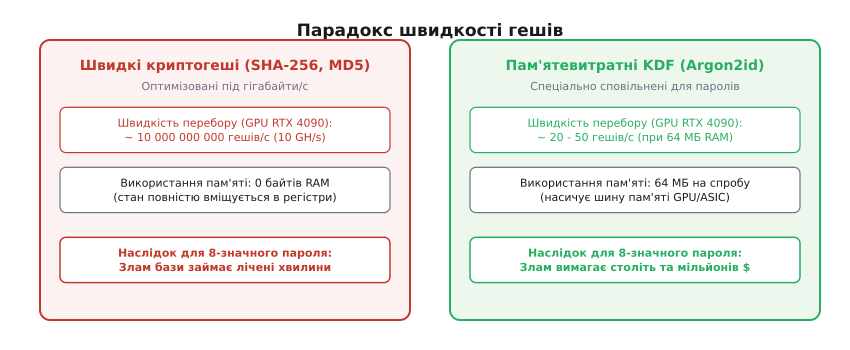
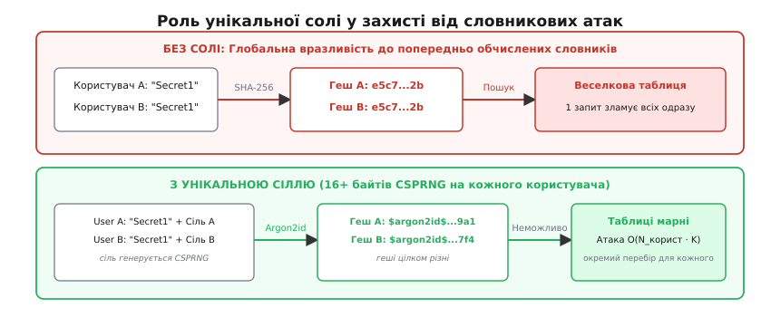
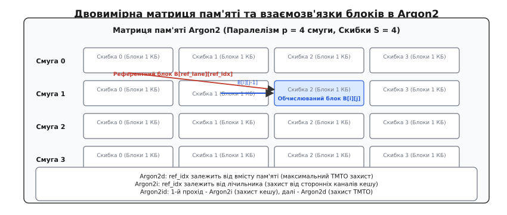
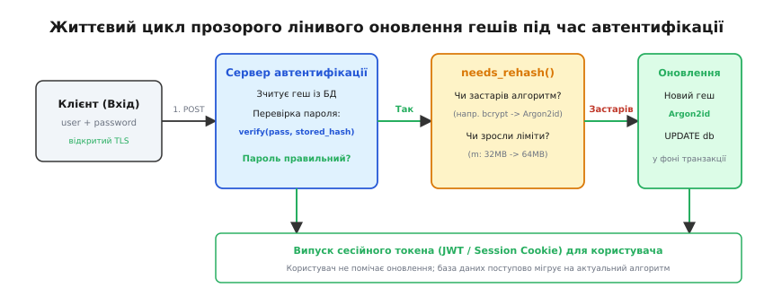

# Безпечне зберігання паролів: Argon2, bcrypt, scrypt та захист від перебору

<preknowlist>
- [Криптографічні гешфункції](topic:programming/cryptographic-hash) — односторонність, стійкість до колізій і пошуку прообразу.
- [Атаки за часом (timing side-channel)](topic:programming/timing-attack) — витік секретних даних через вимірювання затримок виконання операцій.
- [Функції виведення ключів (KDF)](topic:programming/key-derivation-function) — розгортання ентропії короткого секрету в повнорозмірний криптографічний ключ.
</preknowlist>

Коли внаслідок вразливості SQL-ін'єкції або витоку резервної копії зловмисник отримує повний дамп таблиці облікових записів із десятьма мільйонами рядків, архітектура зберігання паролів залишається єдиним бар'єром між інцидентом витоку даних і повною компрометацією облікових записів користувачів. Якщо паролі були збережені за допомогою швидких універсальних криптографічних гешфункцій на зразок `SHA-256` або `MD5`, ферма з восьми сучасних відеокарт перебирає понад 80 мільярдів комбінацій на секунду, розкриваючи до 85% людських паролів за перші 40 хвилин атаки. Безпечне зберігання паролів вимагає не просто одностороннього перетворення, а створення штучної обчислювальної та просторової асиметрії: перевірка одного пароля на сервері повинна тривати частку секунди, але вимагати таких апаратних ресурсів, щоб офлайн-перебір мільйонів варіантів ставав для зловмисника економічно та фізично нездійсненним.

## 1. Парадокс швидкості: чому швидкі геші вбивають безпеку паролів

Криптографічні гешфункції загального призначення (від англ. *hash* — кришити, рубати) — такі як SHA-256, SHA-3, BLAKE2 та BLAKE3 — оптимізовані для максимальної пропускної здатності при мінімальному навантаженні на процесор. Їхнє інженерне призначення полягає в перевірці цілісності гігабайтних файлів, обчисленні цифрових підписів та побудові структур даних у блокчейнах зі швидкістю в сотні мегабайтів або гігабайтів на секунду.

Для перевірки цілісності швидкість є головною чеснотою. Проте для захисту паролів висока швидкість стає фатальною вразливістю.

Асиметрія між легітимною автентифікацією та атакою повного перебору (*brute-force*, від франц. *brut* — грубий, сирий) полягає в частоті виконання операції:
* **Легітимний сервер автентифікації** перевіряє пароль лише один раз у момент входу користувача. Якщо ця операція триває 100 мілісекунд, людина не відчуває жодної затримки інтерфейсу, а сервер здатен комфортно обслуговувати десятки входів на секунду на кожне ядро.
* **Зловмисник із вкраденим дампом бази даних** виконує операцію офлайн на власному обчислювальному кластері. Йому не потрібно взаємодіяти з мережевим API або дотримуватися лімітів частоти запитів. Він паралельно перевіряє мільярди кандидатів із попередньо згенерованих словників.


*Асиметрія швидкості між універсальними гешфункціями та пам'ятевитратними функціями виведення ключів на GPU та ASIC.*

Внутрішня структура алгоритмів сімейства SHA складається з простих 32- або 64-бітних операцій: циклічних зсувів, побітового виключального АБО (XOR) та додавання за модулем `2^{32}`. Внутрішній стан SHA-256 займає лише 32 байти пам'яті (вісім 32-бітних регістрів).

Такий малий робочий стан ідеально підходить для архітектури графічних процесорів (GPU) та спеціалізованих інтегральних схем (ASIC, від англ. *Application-Specific Integrated Circuit*). На одному кремнієвому кристалі сучасного GPU розміщуються десятки тисяч паралельних потокових ядер, кожне з яких незалежно перебирає власний діапазон паролів без потреби звернення до зовнішньої оперативної пам'яті. В результаті одна споживча відеокарта рівня RTX 4090 обчислює близько 10 мільярдів гешів SHA-256 за секунду.

Щоб нейтралізувати паралелізм GPU та ASIC, функція зберігання паролів повинна бути **штучно сповільненою** та **пам'ятевитратною** (*memory-hard*).

## 2. Анатомія загрози: витік бази даних, веселкові таблиці та криптографічна сіль

Якщо система зберігає паролі у вигляді прямого гешу `Hash(password)`, навіть повільний алгоритм залишається вразливим до двох масових векторів атак: атаки за словником збігів та атаки за попередньо обчисленими таблицями.

### Проблема однакових гешів

Користувачі схильні вибирати передбачувані паролі. У базі з мільйона користувачів тисячі людей матимуть однаковий пароль `Password123!`. Якщо геш обчислюється детерміновано без додаткових параметрів:

```
Hash("Password123!") = e5c76f...2b   [для користувача 1]
Hash("Password123!") = e5c76f...2b   [для користувача 2]
```

Зловмисник бачить однакові рядки в базі й миттєво робить висновок, що користувачі мають ідентичні паролі. Зламавши один такий геш, атакуючий отримує доступ до облікових записів тисяч користувачів одночасно.

### Веселкові таблиці (Rainbow Tables)

До появи обов'язкової рандомізації зловмисники масово використовували компроміс між часом і пам'яттю (Time-Memory Trade-Off, TMTO), запропонований Мартіном Геллманом. Замість того, щоб перебирати паролі під час кожного злому, атакувальник одноразово обчислював гігантські ланцюжки редукцій для мільярдів популярних комбінацій і записував початкові та кінцеві точки ланцюжків на жорсткий диск.

Отримавши дамп бази даних без солі, зловмисник виконував швидкий бінарний пошук по готовій таблиці й за частки мілісекунди відновлював відкритий текст пароля без виконання обчислень.

Детальний математичний апарат редукційних ланцюжків, рівняння кривої компромісу Геллмана `T · M² = O(N²)` та оцінку інформаційної ентропії Шенона для користувацьких паролів наведено у вставці [Математика ентропії, TMTO та моделі пам'ятевитратності](topic:programming/password-hashing/math-tmto-and-entropy.md).

### Механізм криптографічної солі

Криптографічна сіль (*salt*) — це послідовність випадкових байтів високої ентропії (від грец. *ἐν* — в і *τροπή* — поворот, перетворення), яка генерується за допомогою криптографічно стійкого генератора псевдовипадкових чисел (CSPRNG) індивідуально для кожного користувача під час створення або зміни пароля.


*Унікальна сіль перетворює одну групову атаку на N незалежних обчислень і руйнує попередньо обчислені веселкові таблиці.*

Сіль зберігається у відкритому вигляді у фінальному рядку гешу. Її призначення — **не приховати секрет, а гарантувати унікальність вхідних даних**.

```
Hash(Salt_A || "Password123!") = 9a1f8c...4e   [користувач A, сіль 16 байтів]
Hash(Salt_B || "Password123!") = 7f4d2a...1b   [користувач B, інша сіль]
```

Вплив унікальної солі на безпеку:
1. **Знищення попередньо обчислених таблиць:** Веселкові таблиці стають абсолютно марними, оскільки таблицю довелося б генерувати окремо для кожної унікальної 128-бітної солі.
2. **Неможливість групового злому:** Зловмисник не може перевірити одного кандидата-пароля проти всієї бази даних за один прохід. Якщо в базі є `U` користувачів, атакуючий змушений виконувати перебір окремо для кожного користувача, що збільшує сумарну складність атаки в `U` разів.

Критичне правило безпеки: **сіль ніколи не повинна бути статичною або глобальною для всієї системи**. Статична сіль (яку іноді помилково називають сіллю додатку) захищає від готових публічних таблиць, але не захищає від побудови спеціалізованої таблиці саме під цю систему і дозволяє паралельну атаку на всіх користувачів бази.

## 3. Від ітерацій до пам'яті: межі PBKDF2 та народження bcrypt і scrypt

Сама по собі сіль не сповільнює перебір окремого запису: якщо функція швидка, зловмисник перебирає комбінації `Hash(Salt || candidate)` з тією ж колосальною швидкістю. Для реального захисту потрібне кероване сповільнення.

### Межі процесорно-орієнтованого сповільнення: PBKDF2

Стандарт PBKDF2 (Password-Based Key Derivation Function 2, RFC 2898) запропонував концепцію ітеративного гешування: псевдовипадкова функція (зазвичай HMAC-SHA256) застосовується в циклі `c` разів:

```
U₁ = PRF(Password, Salt)
U₂ = PRF(Password, U₁)
...
U_c = PRF(Password, U_{c-1})
DK = U₁ ⊕ U₂ ⊕ ... ⊕ U_c
```

Якщо встановити `c = 600 000` ітерацій, обчислення одного пароля на сервері займає близько 100 мс.

Проте PBKDF2 страждає від фундаментального архітектурного недоліку: **він вимагає лише лінійного часу процесора, але не вимагає оперативної пам'яті**. Внутрішній стан HMAC-SHA256 займає менше 100 байтів. На спеціалізованому чипі ASIC розробник розміщує тисячі мікроядер PBKDF2 на одному кристалі. Зловмисник створює паралельні конвеєри, які виконують мільйони ітерацій за копійки спожитої електроенергії.

### Адаптивний блоковий підхід: bcrypt (1999)

Алгоритм `bcrypt`, створений Нільсом Провосом та Девідом Мазьєром для OpenBSD, вперше реалізував механізм адаптивного розширення ключа Eksblowfish (*Expensive Key Schedule*).

Ключові особливості bcrypt:
1. **Логарифмічний фактор вартості (`cost`):** Кількість раундів обчислюється як `2^{cost}`. Збільшення `cost` на 1 вдвічі збільшує час обчислення на будь-якому обладнанні. Сьогодні стандартним значенням є `cost = 12` (4096 раундів) або `cost = 13` (8192 раунди).
2. **Внутрішні таблиці підстановок (S-бокси):** Алгоритм постійно модифікує чотири S-бокси загальним обсягом 4 КБ у процесі виконання раундів. У 1999 році часті псевдовипадкові читання з 4 КБ пам'яті повністю зупиняли паралелізацію на доступному апаратному забезпеченні, оскільки швидкі кеші процесорів L1 значно випереджали пам'ять прискорювачів.

**Обмеження bcrypt:**
* **Жорсткий ліміт довжини пароля у 72 байти:** Внутрішній алгоритм Blowfish використовує 576-бітний ключ. Будь-які байти пароля після 72-го просто відкидаються. Якщо користувач введе пароль довжиною 100 байтів, останні 28 байтів ніяк не вплинуть на результат гешу.
* **Фіксований обсяг пам'яті 4 КБ:** Сучасні графічні чипи мають сотні кілобайтів надшвидкої спільної пам'яті (shared memory / L1 cache) на кожен обчислювальний мультипроцесор (SM), що дозволяє розміщувати сотні незалежних екземплярів bcrypt паралельно без деградації продуктивності.

### Пам'ятевитратний прорив: scrypt (2009)

Щоб унеможливити створення дешевих паралельних ASIC-чипів, Колін Персіваль розробив алгоритм `scrypt`. Його ідея полягала в тому, щоб змусити алгоритм виділяти великий масив оперативної пам'яті (наприклад, 16–32 МіБ) під час кожної спроби перевірки пароля.

Алгоритм `scrypt` базується на механізмі `SMix`:
1. Спочатку алгоритм послідовно заповнює масив із `N` блоків псевдовипадковими даними, використовуючи функцію BlockMix на основі шифру Salsa20/8.
2. Потім алгоритм виконує `N` кроків псевдовипадкового читання: індекс наступного блоку для читання обчислюється на основі значення поточного блоку.

Оскільки зловмисник не може передбачити, який із `N` блоків знадобиться на наступному кроці, він змушений зберігати весь масив у пам'яті. Виробництво ASIC-чипа з мегабайтами вбудованої пам'яті SRAM на кожне ядро вимагає гігантської площі кремнію (*Silicon Area*), що робить виготовлення апаратури для зламу економічно нерентабельним.

Історичну ретроспективу від перших реалізацій у Bell Labs до фіналу всесвітнього криптографічного конкурсу викладено у вставці [Історія еволюції гешування паролів](topic:programming/password-hashing/hist-phc-and-evolution.md).

## 4. Архітектура Argon2: сучасний золотий стандарт (RFC 9106)

У 2015 році міжнародний консорціум провідних криптографів після двох років досліджень у рамках конкурсу Password Hashing Competition (PHC) обрав алгоритм `Argon2` (автори: Алекс Бірюков, Даніель Діну, Дмитро Ховратович) як офіційний світовий стандарт для захисту паролів та виведення ключів.

### Внутрішня структура матриці пам'яті

Argon2 виділяє безперервний масив пам'яті обсягом `m` кілобайтів. Ця пам'ять організована у вигляді двовимірної матриці з `p` паралельних смуг (*lanes*), де кожна смуга розбита на `q = m / (p · 1024)` блоків. Кожен окремий блок має фіксований розмір рівно **1024 байти** (1 КіБ) і складається зі 128 беззнакових 64-бітних цілих чисел (`uint64_t`).


*Організація пам'яті Argon2 у смуги та скибки з псевдовипадковими референтними зв'язками між блоками.*

Обчислювальний процес складається з `t` повних проходів (ітерацій) по всій матриці пам'яті. Кожен прохід розбивається на 4 синхронізаційні скибки (*slices*).

Обчислення нового блоку `B[i][j]` (де `i` — номер смуги, `j` — номер блоку в смузі) виконується компресійною функцією `G` на основі внутрішнього раундового перетворення BLAKE2b:

```
B[i][j] = G(B[i][j-1], B[ref_lane][ref_index])
```

Функція `G` бере два 1-кілобайтні блоки:
1. Попередній блок у тій самій смузі `B[i][j-1]`.
2. Референтний блок `B[ref_lane][ref_index]`, вибраний псевдовипадково з уже обчислених блоків.

Компресійна функція `G` перетворює 1-кілобайтну матрицю у два послідовні етапи: спочатку виконується перемішування рядків матриці (Column step), а потім — перемішування діагоналей (Diagonal step). Кожне базове перетворення `G(a, b, c, d)` оперує чотирма 64-бітними словами за формулою модифікованого раунду BLAKE2b:

```
a = (a + b + 2 · (a mod 2³²) · (b mod 2³²)) mod 2⁶⁴
d = (d ⊕ a) >>> 32
c = (c + d + 2 · (c mod 2³²) · (d mod 2³²)) mod 2⁶⁴
b = (b ⊕ c) >>> 24
a = (a + b + 2 · (a mod 2³²) · (b mod 2³²)) mod 2⁶⁴
d = (d ⊕ a) >>> 16
c = (c + d + 2 · (c mod 2³²) · (d mod 2³²)) mod 2⁶⁴
b = (b ⊕ c) >>> 63
```

Це перетворення забезпечує надзвичайно швидку дифузію бітів на процесорах із підтримкою векторних інструкцій AVX2 та AVX-512, одночасно гарантуючи високу криптографічну стійкість.

### Три режими роботи: Argon2d, Argon2i та Argon2id

Вибір способу адресації референтного блоку визначає стійкість до двох різних класів загроз: атак через сторонні канали часу доступу до кешу (*cache-timing side-channels*) та часово-просторових апаратних компромісів (TMTO).

1. **Argon2d (Data-Dependent):**
   * Номери `ref_lane` та `ref_index` обчислюються напряму з бітів попереднього блоку пам'яті.
   * *Перевага:* Максимальний захист від GPU та ASIC. Зловмисник не може заздалегідь знати порядок обчислення блоків і не здатний оптимізувати конвеєр пам'яті.
   * *Недолік:* Оскільки адреси пам'яті залежать від секретних даних, звернення до кеш-ліній процесора можуть бути зафіксовані шкідливим процесом на тій самій фізичній машині (атаки Prime+Probe, Flush+Reload).
   * *Сфера застосування:* Криптовалюти, шифрування дисків (де атакуючий не має спільного CPU з процесом розшифрування).

2. **Argon2i (Data-Independent):**
   * Номери референтних блоків генеруються детермінованим генератором псевдовипадкових чисел на основі номера ітерації, смуги та позиції блоку, **без огляду на вміст пароля чи попередніх блоків**.
   * *Перевага:* Повний імунітет до атак сторонніми каналами кешу, оскільки шаблон звернення до пам'яті є абсолютно однаковим для будь-якого пароля.
   * *Недолік:* Більша чутливість до TMTO-атак при малій кількості ітерацій, оскільки граф залежностей відомий наперед.

3. **Argon2id (Hybrid Mode — Рекомендований стандарт):**
   * Поєднує обидва підходи:
     * Під час першої ітерації перша половина блоків (перші дві скибки) обчислюється за правилами **Argon2i** (детерміновано). Це гарантує безпечну ініціалізацію пам'яті без витоків через кеш-лінії.
     * Решта скибок першого проходу та всі наступні ітерації обчислюються за правилами **Argon2d** (дані-залежно). Це забезпечує максимальну стійкість проти паралельного апаратного перебору на ASIC.
   * *Сфера застосування:* **Абсолютний дефолт для збереження паролів користувачів у веб-системах та базах даних (RFC 9106).**

Повну граматику серіалізації, точні бінарні формати та матрицю калібрування параметрів наведено у вставці [Довідник інтерфейсів та форматів PHC, Argon2 і bcrypt](topic:programming/password-hashing/api-password-hashers.md).

## 5. Серверний перець (Pepper) та апаратний захист секретів

Навіть найстійкіший алгоритм Argon2id захищає дані лише доти, доки обчислювальні витрати на перебір перевищують ресурси зловмисника. Для паролів низької складності (наприклад, 6–8 символів) зловмисник із великим бюджетом усе одно може знайти відповідність. Щоб унеможливити офлайн-атаку в принципі, архітектура застосовує серверний перець (*pepper*).

| Характеристика | Криптографічна сіль (Salt) | Серверний перець (Pepper) |
| :--- | :--- | :--- |
| **Місце збереження** | Відкрито поруч із гешем у базі даних (у рядку PHC). | Окремо від бази: змінні середовища, HashiCorp Vault, AWS KMS, HSM. |
| **Унікальність** | Унікальна для кожного користувача (16+ байтів CSPRNG). | Єдиний таємний ключ (256 бітів) або невеликий пул ключів з версіонуванням. |
| **Мета захисту** | Запобігання колізіям, знищення веселкових таблиць. | Захист у разі витоку дампа БД (без компрометації ключів сервера). |
| **Секретність** | Не є таємницею. | **Суворо таємний криптографічний ключ.** |

### Дві моделі реалізації перцю

1. **Внутрішній секретний ключ Argon2 (`secret`):**
   Параметр секретного ключа `K` передається у виклик `argon2id_hash_raw`. Біти перцю безпосередньо змішуються з паролем та сіллю під час ініціалізації первинного блоку `H₀`. Якщо зловмисник вкрав базу даних, але не отримав доступ до конфігурації сервера або сховища секретів, він не може розпочати перебір, оскільки йому невідомий обов'язковий 256-бітний ключ.

2. **Зовнішня HMAC-обгортка (HMAC-SHA256):**
   Пароль перед передачею в гешер загортається в криптографічний код автентифікації повідомлень:

```
pre_hash = HMAC-SHA256(pepper_key, user_password)
final_hash = Argon2id(pre_hash, salt, m, t, p)
```

Переваги HMAC-обгортки:
* Знімає будь-які обмеження довжини вхідного пароля (пароль будь-якої довжини стискається до фіксованих 32 байтів).
* Повністю усуває проблему 72 байтів у застарілих бібліотеках bcrypt.
* Дозволяє легко організувати ротацію перцю шляхом версіонування ідентифікатора ключа.

## 6. Клієнтське гешування проти серверного: пастка наївного хешування

Поширеною інженерною спокусою є ідея обчислювати геш пароля на боці клієнта (у браузері користувача на JavaScript або в мобільному додатку), щоб сервер взагалі не отримував відкритий пароль через мережу:

```
[Клієнт] -- Hash(password) --> [Сервер]
```

Ця наївна схема створює фатальну ілюзію безпеки. Для сервера результуючий клієнтський геш сам по собі стає новим відкритим паролем (*password equivalent*). Якщо зловмисник перехопить переданий клієнтський геш або вкраде його з бази даних, йому не потрібно розкривати початковий текст: він просто надсилає вкрадений геш на сервер і успішно проходить авторизацію.

### Коректні криптографічні протоколи (PAKE)

Якщо архітектура вимагає нульового знання пароля на сервері, застосовуються протоколи автентифікації з підтвердженням пароля (Password-Authenticated Key Exchange, PAKE) — такі як **SRP-6a** (Secure Remote Password) або сучасний стандарт **OPAQUE** (RFC 9534):
1. Клієнт і сервер виконують інтерактивний криптографічний обмін повідомленнями на основі асиметричної криптографії та еліптичних кривих.
2. Сервер зберігає лише верифікатор пароля (*password verifier*), за яким неможливо виконати вхід.
3. У результаті діалогу обидві сторони обчислюють спільний сесійний ключ шифрування, доводячи володіння паролем без передачі самого секрету або його прямого гешу по мережі.

Для класичних веб-додатків золотим стандартом залишається передача відкритого пароля через захищений канал TLS із подальшим виконанням Argon2id безпосередньо на захищеному сервері автентифікації.

## 7. Безпечна верифікація та захист від сторонніх каналів

Правильна реалізація перевірки пароля на сервері вимагає суворого дотримання двох правил низькорівневого коду: порівняння за константний час та гарантоване очищення пам'яті.

### Атаки за часом (Timing Attacks)

Звичайна функція порівняння рядків у мовах C/C++ (`strcmp`, `memcmp`) оптимізована для швидкості: вона перевіряє байти по черзі й негайно повертає результат при виявленні першого незбіжного символу:

```
Stored:  $argon2id$...9sNk8bZ3y9Y9...
Input:   $argon2id$...9sNk8bZ3y9Y0...   [розбіжність в останньому байті -> час T_max]
Input:   $argon2id$...0sNk8bZ3y9Y9...   [розбіжність у першому байті -> час T_min]
```

Якщо зловмисник має можливість надсилати запити через локальну мережу з низькою дисперсією затримок або вимірює час відповіді високоточними таймерами, він здатний побайтово реконструювати правильний геш, орієнтуючись на ледь помітні зміни затримки відповіді (у наносекундах).

Для захисту використовується функція побітового порівняння зі строго фіксованим часом виконання.

:::tabs
```c
int constant_time_memcmp(const void *a, const void *b, size_t size) {
    const unsigned char *p1 = (const unsigned char *)a;
    const unsigned char *p2 = (const unsigned char *)b;
    unsigned char result = 0;
    for (size_t i = 0; i < size; i++) {
        result |= p1[i] ^ p2[i];
    }
    return result == 0;
}
```
```cpp
#include <span>
#include <cstdint>

[[nodiscard]] bool constant_time_equal(std::span<const uint8_t> a, std::span<const uint8_t> b) noexcept {
    if (a.size() != b.size()) return false;
    uint8_t diff = 0;
    for (size_t i = 0; i < a.size(); ++i) {
        diff |= (a[i] ^ b[i]);
    }
    return diff == 0;
}
```
:::

Цикл завжди проходить рівно `size` ітерацій незалежно від того, де саме розташована перша розбіжність.

### Гарантоване занулення чутливих буферів (Memory Cleansing)

Відкритий пароль, переданий користувачем у запиті на авторизацію, потрапляє в оперативну пам'ять процесу (стек або купу). Якщо після перевірки пам'ять просто звільняється через `free()` або вихід з функції, відкритий секрет залишається в незанулених сторінках RAM і може бути викрадений через утиліти інспекції пам'яті, аварійні дампи ядра (*core dumps*) або вразливості класу Heartbleed.

Виклик стандартної функції `memset(password_buffer, 0, len)` часто **повністю вирізається компілятором** у процесі оптимізації відсікання мертвого запису (Dead Store Elimination), якщо після цього буфер більше не читається.

Для гарантованого занулення використовуються бар'єри пам'яті, системні виклики `explicit_bzero()` (BSD/Linux), `SecureZeroMemory()` (Windows) або `OPENSSL_cleanse()`.

Робочий конвеєр із безпечним очищенням буферів на основі RAII-обгорток у C++ та низькорівневих бар'єрів у C реалізовано у вставці [Конвеєр верифікації та прозорої міграції паролів](topic:programming/password-hashing/proj-argon2-rehash-pipeline.md).

## 8. Стратегія прозорої міграції: життєвий цикл лінивого оновлення

У міру зростання потужності процесорів та вдосконалення атак параметри вартості неминуче застарівають. Якщо система використовувала bcrypt з `cost = 10` п'ять років тому, сьогодні вона повинна перейти на Argon2id з пам'яттю 64 МіБ.

Проблема полягає в тому, що адміністратор бази даних не знає відкритих паролів користувачів і не може перерахувати геші пакетним фоновим скриптом (оскільки перерахувати геш без відкритого пароля математично неможливо).

Єдине правильне архітектурне рішення — **ліниве прозоре оновлення (Lazy Rehash)** у момент автентифікації.


*Автоматична верифікація та прозоре підвищення параметрів вартості гешу в момент успішного входу користувача.*

### Алгоритм роботи механізму

1. Користувач надсилає логін і відкритий пароль через захищений TLS-канал.
2. Сервер зчитує збережений геш із бази даних і перевіряє його відповідним алгоритмом (старим чи новим).
3. Якщо пароль невірний — повертається стандартна помилка `401 Unauthorized`.
4. Якщо пароль правильний — викликається перевірка `needs_rehash(stored_hash, target_policy)`:
   * Чи збігається алгоритм із цільовим (наприклад, чи це все ще старий `$2b$` замість `$argon2id$`)?
   * Чи є параметри `m`, `t`, `p` меншими за актуальну системну політику?
5. Якщо геш застарів:
   * Сервер негайно обчислює новий геш з актуальними параметрами за допомогою відкритого пароля, який прямо зараз знаходиться в пам'яті.
   * Оновлений рядок PHC асинхронно записується в базу даних: `UPDATE users SET password_hash = ? WHERE id = ?`.
6. Користувачеві видається сесійний токен або cookie. Користувач не помічає затримки або змін, а база даних поступово та природно мігрує на сучасні стандарти безпеки.

## 9. Стійкість до відмови в обслуговуванні (DoS) та виробничі пастки

Оскільки Argon2id навмисно спроєктований як важкий алгоритм (споживає 64 МіБ пам'яті та близько 100 мс процесорного часу), він створює привабливу поверхню для атак на вичерпання ресурсів (Denial of Service, DoS).

Якщо зловмисник відправить 1000 одночасних фіктивних запитів на еліпс входу `/api/login`, непідготовлений сервер спробує виділити `1000 · 64 МіБ = 64 ГБ` оперативної пам'яті, що призведе до спрацьовування механізму OOM Killer ядра Linux та падіння процесу.

### Захисні бар'єри в архітектурі бекенду

1. **Ізольований пул потоків і семафори:** Операції гешування паролів повинні виконуватися в окремому пулі потоків із суворим обмеженням паралелізму: `MaxConcurrentHashes = NumCpuCores`. Якщо всі слоти зайняті, нові запити ставляться в коротку чергу або відхиляються з кодом `429 Too Many Requests`.
2. **Обмеження швидкості на рівні API Gateway (Rate Limiting):** Запити на автентифікацію лімітуються за IP-адресою та цільовим логіном (наприклад, не більше 5 спроб на хвилину).
3. **Захист від переліку користувачів (Dummy Hashing):** Якщо клієнт намагається увійти під неіснуючим логіном, сервер не повинен повертати помилку миттєво (це дозволяє зловмиснику скласти список валідних email-адрес за швидкістю відповіді). Сервер зобов'язаний виконати фіктивне обчислення Argon2id з випадковою сіллю та паролем-заглушкою, вирівнюючи час відповіді.

## 10. Сучасний контекст: паролі, Passkeys та WebAuthn

В останні роки індустрія безпеки активно впроваджує безпарольні стандарти автентифікації на основі криптографії відкритих ключів: **FIDO2 / WebAuthn** (Passkeys). У цій моделі пароль взагалі відсутній: приватний ключ користувача надійно запечатаний в апаратному анклаві пристрою (Secure Enclave / TPM), а сервер зберігає лише відкритий ключ.

Проте безпечне зберігання паролів залишається фундаментальною інженерною вимогою з трьох причин:
* **Спадщина та зворотна сумісність:** Мільярди існуючих систем та апаратних клієнтів не підтримують Passkeys і потребуватимуть класичної автентифікації ще десятиліттями.
* **Резервні канали відновлення (Account Recovery):** Більшість безпарольних сервісів зберігають майстер-пароль як вторинний фактор відновлення доступу при втраті фізичного ключа або смартфона.
* **Шифрування даних на нульовому знанні (End-to-End Encryption):** У сервісах на зразок 1Password, Bitwarden або Proton пароль використовується не просто для перевірки на сервері, а як вхідний секрет для виведення локального майстер-ключа шифрування сховища за допомогою Argon2id.

> 🔧 **Навіщо це.**
>
> 1. **Вибір дефолту для нових систем:** Завжди використовуйте **Argon2id** (RFC 9106) з базовими параметрами: `m = 65536` КіБ (64 МіБ), `t = 3` ітерації, `p = 4` потоки.
> 2. **Генерація солі:** Генеруйте щонайменше 16 байтів криптографічно стійкої солі (`CSPRNG`) для кожного пароля окремо. Ніколи не використовуйте повторювану або статичну сіль.
> 3. **Зберігання в базі:** Зберігайте геш виключно у стандартному текстовому форматі PHC String Format (`$argon2id$v=19$m=...`), що дозволяє інкапсулювати всі параметри в одному полі.
> 4. **Серверний перець:** Застосовуйте зовнішню HMAC-SHA256 обгортку з 256-бітним ключем, збереженим у системі управління секретами (KMS/Vault).
> 5. **Прозора міграція:** Реалізуйте функцію `needs_rehash()` у конвеєрі авторизації для безшовного підвищення параметрів вартості під час входів користувачів.
> 6. **Гігієна коду:** Порівнюйте геші тільки через константно-часові функції та гарантовано занулюйте відкриті паролі в пам'яті через `explicit_bzero` або безпечні RAII-деструктори.
