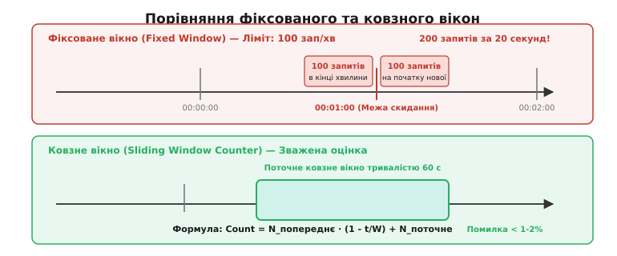
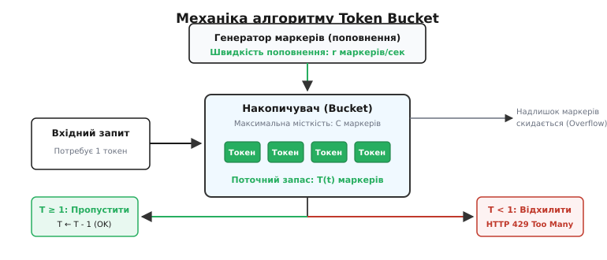
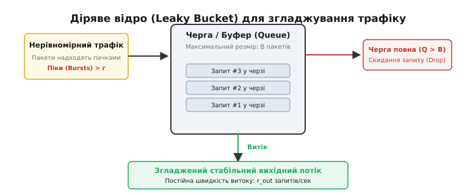
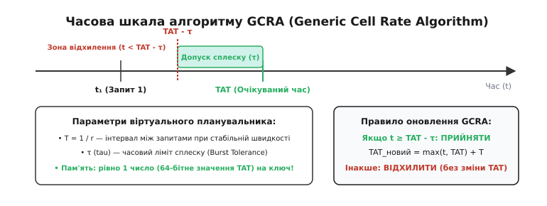
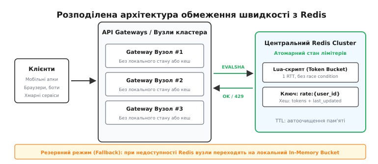

# Обмеження швидкості (Rate Limiting) як архітектура: Token Bucket, Leaky Bucket

<preknowlist>
- [DDoS і захист від зловживань](book:programming/ddos-abuse-defense) — природа розподілених атак на вичерпання ресурсів та базові рівні мережевої фільтрації.
- [Межі довіри](book:programming/trust-boundaries) — концепція поділу архітектурних зон на зовнішні ненадійні контури та захищені внутрішні сервіси.
- [Поверхня атаки](book:programming/attack-surface) — аналіз відкритих публічних точок входу та методів їхнього звуження.
- [Гонка між перевіркою й використанням (TOCTOU)](book:programming/toctou-race) — вразливість неузгодженості стану між моментом зчитування та моментом мутації даних.
- [Аудит-лог як вузол](book:programming/audit-logging) — фіксація підозрілих подій та реєстрація перевищення лімітів безпеки.
</preknowlist>

У типовому хмарному маркетплейсі сервіс пошуку товарів обробляє запит за 40 мілісекунд, споживаючи одне з'єднання з пулу бази даних PostgreSQL та 15% потужності процесорного ядра для повнотекстового ранжування. За нормальних умов кластер із 20 вузлів бездоганно витримує 5 000 запитів на секунду. Проте о другій годині ночі сторонній агрегатор цін запускає неоптимізований багатопотоковий парсер, який спрямовує на кінцеву точку `/api/v1/search` 25 000 запитів щомиті.

За перші 200 мілісекунд пул із 200 з'єднань з базою даних повністю вичерпується. Нові запити блокують робочі потоки сервера в очікуванні вільного підключення, пам'ять процесів заповнюється чергами невідісланих HTTP-пакетів, а час відповіді зростає з 40 мілісекунд до 60 000 мілісекунд. Мережевий балансувальник фіксує таймаут перевірки працездатності (health-check) і по черзі виключає перевантажені вузли з маршрутизації. Навантаження миттєво перерозподіляється на вцілілі екземпляри, спричиняючи повний каскадний колапс (англ. *cascading failure*) усієї інфраструктури, включно з критичними сервісами оплати та авторизації.

Ця аварія демонструє фундаментальну асиметрію сучасних мережевих систем: пропускна здатність вхідного мережевого інтерфейсу (10 чи 40 Гбіт/с) у тисячі разів перевищує обчислювальну здатність прикладного бекенду. Без примусового архітектурного регулювання вхідного потоку будь-який клієнт — чи то зловмисник із ботнетом, чи то помилковий скрипт легітимного розробника — здатен одноосібно паралізувати всю систему. **Обмеження швидкості** (англ. *rate limiting*, від *rate* — «темп, швидкість, норма» та *limit* — «межа, кордон») — це комплекс алгоритмічних, системних і мережевих механізмів, які контролюють інтенсивність споживання ресурсів, гарантують справедливий розподіл потужностей між користувачами та забезпечують стабільність системи під будь-яким навантаженням.

---

## Два фундаментальні підходи: Traffic Policing проти Traffic Shaping

Перш ніж аналізувати алгоритми, необхідно провести чітку межу між двома принципово різними моделями управління трафіком:

1. **Відсікання трафіку (Traffic Policing):**
   Система миттєво аналізує кожен вхідний запит. Якщо інтенсивність потоку вкладається у встановлену квоту, запит негайно пропускається далі. Якщо квоту перевищено, запит **скидається без виконання** — клієнт отримує статус помилки `429 Too Many Requests` або мережевий пакет відкидається (Drop). Відсікання не вносить жодної додаткової затримки в легітимні запити та не споживає пам'ять на утримання черг.
2. **Згладжування трафіку (Traffic Shaping):**
   Система не відхиляє надлишкові запити одразу, а розміщує їх у проміжній черзі (буфері очікування). Запити витягуються з черги та передаються на виконання із суворо контрольованою, рівномірною швидкістю. Згладжування перетворює рвані сплески на плавний потік, але неминуче збільшує затримку (англ. *latency*) для тих запитів, які потрапили в чергу.

```
Вхідний нерівномірний потік:  ||||| |||  |  ||||||||  ||
                                  │
         ┌────────────────────────┴────────────────────────┐
         ▼                                                 ▼
[ Traffic Policing ]                             [ Traffic Shaping ]
  (Скидання надлишку)                              (Буферизація в черзі)
         │                                                 │
  Пропущено: ||||. . . . . .                       Вихід:  | | | | | | | | |
  Скинуто:         ||| ||||||                      (рівномірний темп із затримкою)
```

Вибір між цими підходами диктується природою навантаження: публічні HTTP API та захисні шлюзи майже завжди використовують **Traffic Policing**, оскільки утримання мільйонів відкритих HTTP-з'єднань у черзі пам'яті вичерпує файлові дескриптори сервера. Навпаки, фонові черги задач (обробка відео, відправлення сповіщень, інтеграція з банківськими реєстрами) застосовують **Traffic Shaping** для захисту повільних зовнішніх API.

Історично обидві концепції зародилися в телекомунікаційних комутаторах 1980-х років під час розробки протоколів швидкої комутації пакетів, про що детально розповідає [історичний нарис еволюції обмеження швидкості від ATM до API](book:programming/rate-limiting/hist-traffic-shaping-to-api.md).

---

## Алгоритм 1: Фіксоване вікно (Fixed Window Counter)

Найпростіший підхід до відсікання надлишкового трафіку базується на розбитті часу на статичні неперетинні календарні інтервали (вікна) фіксованої тривалості `W` (наприклад, 1 хвилина: `00:00–01:00`, `01:00–02:00`).

### Механізм роботи

Для кожного клієнта (ідентифікованого за IP-адресою чи API-ключем) створюється цілочисельний лічильник.
1. Поточний час округлюється вниз до початку вікна: `current_window = floor(timestamp / W)`.
2. Ключ у сховищі формується як комбінація ідентифікатора та номера вікна: `key = "rate:" + user_id + ":" + current_window`.
3. При надходженні запиту лічильник за ключем інкрементується на 1:
   - Якщо `counter ≤ Limit`, запит дозволено.
   - Якщо `counter > Limit`, запит відхиляється з кодом 429.
4. Після завершення вікна старий ключ автоматично видаляється за тайм-аутом (TTL), а для нового вікна відлік починається з нуля.

### Критична вразливість: Подвійний сплеск на межі вікон (2x Burst Flaw)

Незважаючи на простоту реалізації та мінімальне споживання пам'яті (лише один числовий лічильник на клієнта), фіксоване вікно має фундаментальну архітектурну діру.


*Порівняння фіксованого та ковзного вікон: на межі двох фіксованих вікон клієнт здатний надіслати подвійну квоту запитів за короткий проміжок часу, що повністю нівелює захист бекенду.*

Розглянемо ліміт у **100 запитів на хвилину**:
- Клієнт нічого не надсилає перші 50 секунд.
- О `00:00:55` клієнт відправляє 100 запитів. Усі вони потрапляють у перше вікно і успішно пропускаються.
- О `00:01:01` настає нове вікно. Лічильник скидається в 0.
- Клієнт миттєво відправляє ще 100 запитів у новому вікні.

**Результат:** за 10-секундний інтервал між `00:00:55` та `00:01:05` система пропустила **200 запитів**, тобто фактична інтенсивність навантаження перевищила дозволений ліміт у два рази. Якщо бекенд розрахований на максимум 100 запитів на хвилину, такий сплеск гарантовано перевантажить процесор і вичерпає пам'ять.

---

## Алгоритм 2: Ковзне вікно логів (Sliding Window Log)

Щоб усунути проблему граничних сплесків, необхідно відмовитися від штучних календарних меж і оцінювати точну кількість запитів у рухомому інтервалі `[t_now - W, t_now]`.

### Механізм роботи

Для кожного клієнта створюється впорядкована за часом структура даних (Sorted Set або двозв'язний список), у якій зберігаються часові мітки (Unix Timestamps) кожного прийнятого запиту:

1. Коли надходить новий запит у момент `t_now`, із множини видаляються всі застарілі часові мітки, для яких `t < t_now - W`.
2. Підраховується кількість елементів, що залишилися в множині.
3. Якщо поточна кількість елементів `< Limit`:
   - Запис `t_now` додається до множини.
   - Запит успішно виконується.
4. Якщо кількість елементів `≥ Limit`:
   - Запит відхиляється, нова часова мітка не записується.

### Аналіз та обмеження

Ковзне вікно логів забезпечує бездоганну математичну точність: у будь-який довільно обраний 60-секундний відрізок часу кількість запитів гарантовано не перевищить `Limit`. Подвійний сплеск на межах стає фізично неможливим.

Проте за цю точність доводиться платити пам'яттю. Якщо користувачеві дозволено 5 000 запитів на хвилину, а система обслуговує 100 000 активних користувачів, сервер повинен зберігати в пам'яті до 500 000 000 64-бітних чисел. З урахуванням накладних витрат на покажчики впорядкованих дерев (Redis ZSET потребує близько 64 байтів на елемент), це вимагає понад 30 ГБ оперативної пам'яті виключно для збереження логів rate limiter. Крім того, операції видалення застарілих елементів мають часову складність `O(log N + M)`, що сповільнює обробку під час пікового навантаження.

---

## Алгоритм 3: Зважене ковзне вікно (Sliding Window Counter)

Алгоритм зваженого ковзного лічильника поєднує мінімальні витрати пам'яті фіксованого вікна з точністю ковзного логу. Він базується на зваженій апроксимації між лічильниками попереднього та поточного вікон.

### Механізм роботи

Час розбивається на звичайні фіксовані блоки тривалістю `W`. Система зберігає лише два цілі числа на клієнта:
- `N_prev` — кількість запитів, зафіксованих у попередньому вікні.
- `N_curr` — кількість запитів у поточному, ще не завершеному вікні.

Нехай з початку поточного вікна минуло `t_offset` секунд (`0 ≤ t_offset < W`). Тоді частка часу, яка ще перекривається з попереднім 60-секундним інтервалом, становить `(W - t_offset) / W`.

Оцінка поточної інтенсивності `N_est` розраховується за формулою:

```
N_est = N_prev · (1 - t_offset / W) + N_curr
```

Якщо `N_est < Limit`:
- `N_curr` збільшується на 1.
- Запит дозволяється.
Інакше запит відхиляється.

**Приклад розрахунку:**
Нехай ліміт становить 100 запитів/хв (`W = 60` с).
У попередній хвилині було виконано `N_prev = 80` запитів.
У поточній хвилині на 18-й секунді (`t_offset = 18`) надійшов черговий запит, а `N_curr = 20`.

```
Вага попереднього вікна: 1 - 18/60 = 1 - 0.30 = 0.70
Оцінка навантаження: N_est = 80 · 0.70 + 20 = 56 + 20 = 76 запитів
```

Оскільки `76 < 100`, запит успішно пропускається, а `N_curr` стає рівним 21.

> 🔧 **Навіщо це.**
> Зважене ковзне вікно потребує лише 16 байтів пам'яті на клієнта і розраховується за дві арифметичні операції `O(1)`. Завдяки лінійному згасанню ваги попереднього вікна піковий сплеск на межі 60-ї секунди плавно враховується в наступному інтервалі, запобігаючи подвоєнню трафіку. Похибка цієї апроксимації при типовому мережевому розподілі не перевищує 0.05%, що робить її галузевим стандартом у системах на кшталт Cloudflare.

---

## Алгоритм 4: Накопичувач маркерів (Token Bucket)

На відміну від віконних лічильників, які штучно прив'язуються до часових інтервалів, алгоритм **накопичувача маркерів** (Token Bucket) моделює безперервне поповнення прав на передачу даних.


*Механіка алгоритму Token Bucket: генератор поповнює накопичувач маркерами зі швидкістю r. Вхідний запит споживає токен і пропускається, якщо токенів вистачає. При порожньому відрі запит негайно відхиляється.*

### Принцип роботи

1. Накопичувач має максимальну місткість `C` токенів (англ. *capacity*). Це максимальний розмір сплеску (burst size), який система здатна пропустити миттєво без затримки.
2. Маркери безперервно додаються в накопичувач із фіксованою швидкістю `r` токенів на секунду (англ. *refill rate*).
3. Якщо накопичувач заповнений до максимуму `C`, нові маркери переливаються через край і знищуються (надлишок скидається).
4. Коли надходить запит:
   - Якщо в накопичувачі є щонайменше 1 токен, із нього списується 1 токен, а запит негайно пропускається.
   - Якщо токенів менше 1, запит негайно відхиляється з кодом 429 (або скидається).

### Техніка лінивого поповнення (Lazy Refill)

Найважливіша інженерна оптимізація Token Bucket полягає в тому, що системі **не потрібні фонові таймери** для додавання токенів. Поповнення розраховується аналітично під час прибуття запиту за формулою:

```
tokens = min(C, tokens + (t_now - t_last) · r)
```

де `t_last` — часова мітка попереднього звернення клієнта.

Це дозволяє утримувати стан лімітера у вигляді всього двох числових значень `(tokens, t_last)` із часовою складністю обробки `O(1)`. Детальний математичний аналіз тривалості поглинання сплесків та виведення формул швидкості наведено в [математичному аналізі динаміки накопичувача](book:programming/rate-limiting/math-bucket-dynamics.md).

---

## Алгоритм 5: Діряве відро (Leaky Bucket)

Якщо Token Bucket дозволяє клієнту витратити весь накопичений запас токенів за одну мілісекунду, створюючи короткочасний сплеск на бекенді, то алгоритм **дірявого відра** (Leaky Bucket) призначений для примусового перетворення будь-якого рваного трафіку на ідеально рівномірний вихідний потік.


*Діряве відро (Leaky Bucket) для згладжування трафіку: вхідні запити потрапляють у чергу фіксованого розміру B. Із дна відра запити витікають на обробку з постійною швидкістю r_leak. Якщо черга переповнюється, нові запити скидаються.*

### Механізм черги

1. Відро є чергою FIFO (First-In, First-Out) фіксованої місткості `B` елементів.
2. Вхідні запити довільної інтенсивності додаються у хвіст черги. Якщо черга заповнена (`queue_size == B`), вхідний запит скидається (Overflow Drop).
3. Із дна черги робочий процес витягує запити із суворо константною швидкістю `r_leak` запитів на секунду (наприклад, рівно 1 запит кожні 100 мілісекунд).

### Головна відмінність: Token Bucket проти Leaky Bucket

Часто ці два алгоритми плутають, проте між ними існує принципова різниця в поведінці при виникненні сплесків:

| Критерій | Token Bucket (Traffic Policing) | Leaky Bucket (Traffic Shaping) |
|---|---|---|
| **Реакція на сплеск** | Пропускає сплеск розміром до `C` миттєво без затримки | Буферизує сплеск у чергу, видаючи запити з фіксованим темпом |
| **Вихідний потік** | Може бути нерівномірним (сплески + паузи) | Ідеально рівномірний та згладжений (константна швидкість) |
| **Пам'ять** | `O(1)` (зберігає лише 2 числа) | `O(B)` (зберігає чергу самих запитів або їхніх контекстів) |
| **Додаткова затримка** | `0` мілісекунд для дозволених запитів | Від `0` до `B / r_leak` секунд очікування в черзі |

---

## Алгоритм 6: Generic Cell Rate Algorithm (GCRA)

У високопродуктивних системах на базі C/C++ чи розподілених кешах збереження черги в пам'яті є небажаним. **Generic Cell Rate Algorithm (GCRA)**, або алгоритм віртуального планування, забезпечує математичну поведінку Leaky Bucket без утримання черги, використовуючи лише **одне 64-бітне число** на клієнта.


*Часова шкала алгоритму GCRA: теоретичний час прибуття (TAT) визначає очікуваний момент наступного запиту. Якщо запит надходить раніше границі TAT - tau, він відхиляється. При успішному проходженні TAT зміщується вперед на інтервал T.*

### Механізм віртуального планування

Замість підрахунку кількості токенів або пакетів у черзі, GCRA розраховує **теоретичний час прибуття** `TAT` (англ. *Theoretical Arrival Time*) для наступного ідеального запиту.

Параметри:
- `T = 1 / r` — інтервал між запитами при номінальній швидкості (англ. *emission interval*).
- `τ` (tau) — часовий допуск сплеску (англ. *burst tolerance*).

Коли запит надходить у фізичний момент часу `t_arr`:
1. Обчислюється найбільш ранній допустимий час прибуття: `t_earliest = TAT - τ`.
2. Якщо `t_arr < t_earliest`:
   - Запит прийшов занадто рано (клієнт вичерпав ліміт сплеску).
   - Запит **відхиляється** (Reject), значення `TAT` не змінюється.
3. Якщо `t_arr ≥ t_earliest`:
   - Запит **дозволяється** (Accept).
   - Розраховується нове значення `TAT`:
     ```
     TAT_next = max(t_arr, TAT) + T
     ```

Завдяки тому, що стан зведено до єдиної змінної `TAT`, алгоритм GCRA ідеально підходить для реалізації без блокувань (Lock-Free) на атомарних інструкціях процесора CAS (Compare-And-Swap). Готові потокобезпечні модулі на мовах C та C++ розібрані у [практичній реалізації алгоритмів Token Bucket та GCRA](book:programming/rate-limiting/proj-token-bucket.md).

---

## Розширені моделі: Алгоритми з двома швидкостями (srTCM та trTCM)

У корпоративних інфраструктурах часто недостатньо простого двійкового рішення «пропустити або відхилити». Потрібно гнучко диференціювати запити за пріоритетами, виділяючи гарантовану смугу та допустимий надлишок. Для цього застосовують алгоритми кольорового маркування:

1. **Single Rate Three Color Marker (srTCM, RFC 2697):**
   Використовує два накопичувачі маркерів, що поповнюються з **однаковою швидкістю** `CIR` (Committed Information Rate), але мають різну місткість:
   - `CBS` (Committed Burst Size) — гарантована місткість.
   - `EBS` (Excess Burst Size) — надлишкова місткість.
   - Запити маркуються трьома кольорами:
     - **Зелений (Green):** запит вмістився в `CBS` — гарантоване негайне виконання.
     - **Жовтий (Yellow):** `CBS` вичерпано, але вистачило токенів у `EBS` — виконання з нижчим пріоритетом або за умови наявності вільних ресурсів.
     - **Червоний (Red):** обидва відра порожні — негайне відхилення (HTTP 429).
2. **Two Rate Three Color Marker (trTCM, RFC 2698):**
   Використовує два незалежні накопичувачі з **різними швидкостями**:
   - `CIR` / `CBS` — гарантована швидкість та сплеск.
   - `PIR` / `PBS` — пікова швидкість (Peak Information Rate) та піковий сплеск.
   Це дозволяє контролювати як середньодобове споживання, так і миттєві пікові викиди трафіку.

---

## Розподілене обмеження швидкості: Архітектура та виклики

Коли сервіс масштабується на десятки вузлів у кластері Kubernetes позаду балансувальника навантаження (AWS ALB, Cloudflare або NGINX), локальні лімітери в пам'яті окремих процесів втрачають ефективність: кожен екземпляр бачить лише частку загального трафіку клієнта.


*Розподілена архітектура з центральним Redis Cluster: API Gateways виконують атомарні Lua-скрипти поповнення та списання токенів за 1 RTT. При падінні Redis система перемикається на локальні розділені лімітери.*

### 1. Атомарність та вразливість TOCTOU

Наївна реалізація розподіленого лімітера через Redis зазвичай робить два послідовні запити:
1. `GET rate:user_123` (перевірка поточного залишку).
2. Якщо токенів вистачає: `SET rate:user_123 (tokens - 1)`.

Між командами `GET` та `SET` виникає класичний стан гонки (TOCTOU — Time-of-Check to Time-of-Use): якщо два вузли API Gateway одночасно перевірять баланс клієнта з 1 токеном, обидва вважатимуть операцію дозволеною і спишуть по токену, в результаті чого клієнт виконає 2 запити замість 1.

**Рішення:** використання **атомарних Lua-скриптів у Redis** або Redis Functions. Скрипт виконується на стороні рушія Redis в один потік, гарантуючи неподільність операцій зчитування, розрахунку лінивого поповнення та списання токенів за один мережевий запит (1 RTT). Повний код та опис інтерфейсу наведено в [довіднику протокольних заголовків та Redis Lua контрактів](book:programming/rate-limiting/api-rate-limit-headers.md).

### 2. Розсинхронізація годинників (Clock Skew)

У розподілених системах системні годинники різних серверів ніколи не збігаються абсолютно точно: похибка синхронізації NTP між вузлами може становити від 2 до 50 мілісекунд.
- Якщо часову мітку `now` генерує кожен Gateway локально, запит на Вузол 1 (годинник якого поспішає на 20 мс), за яким слідує запит на Вузол 2 (годинник якого відстає на 20 мс), спричинить ситуацію, коли час «потече назад» (`Δt < 0`).
- **Архітектурне правило:** Для розрахунку лінивого поповнення в централізованих сховищах завжди використовується або час самого сервера Redis (`redis.call('TIME')`), або монотонні зміщення, що валідуються на стороні скрипта через `math.max(0, now - last_updated)`.

### 3. Стійкість до збоїв: Стратегії Fail-Open проти Partitioned Fallback

Що робити, якщо кластер Redis стає тимчасово недоступним через мережеве розділення (Network Partition)?
1. **Fail Closed (Сувора безпека):** Блокувати всі вхідні запити. Використовується виключно для банківських транзакцій, де перевищення ліміту загрожує прямими фінансовими втратами.
2. **Fail Open (Пріоритет доступності):** Пропускати всі запити клієнтів. Використовується для більшості публічних API, щоб збій допоміжного сервісу лімітів не призвів до повного падіння продукту.
3. **Partitioned Local Fallback (Гібридний режим):** При втраті зв'язку з Redis кожен API Gateway автоматично вмикає внутрішній `LockFreeGcraLimiter` із локальною квотою:
   ```
   Local_Limit = Total_Limit / N_gateways
   ```
   Це дозволяє зберегти захист бекенду навіть у повністю автономному режимі роботи вузлів.

---

## Де застосовувати обмеження: Топологічні рівні системи

Ефективна архітектура безпеки ніколи не покладається на єдиний лімітер, а вибудовує ешелонований захист (Defense in Depth) на кількох рівнях:

```
[ Клієнтський трафік ]
         │
         ▼
[ 1. Мережева межа (Edge / CDN / WAF) ]  ──► Захист від DDoS за IP (Token Bucket)
         │
         ▼
[ 2. API Gateway / Reverse Proxy ]      ──► Аутентифіковані користувачі (Redis GCRA)
         │
         ▼
[ 3. Проміжне ПЗ мікросервісу ]         ──► Бізнес-операції за діями (Sliding Window)
         │
         ▼
[ 4. Бази даних та черги повідомлень ]  ──► Пули з'єднань, семафори (Leaky Bucket)
```

1. **Мережева межа (Edge / CDN / WAF):**
   Cloudflare, AWS WAF, Fastly. Відсікає неавтентифікований об'ємний трафік та атаки на вичерпання каналів за грубими ознаками (IP-адреса, підмережа CIDR, геолокація).
2. **Шлюз API (API Gateway / Reverse Proxy):**
   Envoy Proxy, Kong, NGINX. Відсікає запити на основі автентифікації (JWT токени, API-ключі), контролює відповідність тарифним планам клієнтів за допомогою розподіленого Redis.
3. **Прикладний рівень (Application Middleware):**
   Захищає окремі ресурсомісткі маршрути (наприклад, експорт звітів у PDF, запити до штучного інтелекту, надсилання SMS-підтверджень). Ліміти розраховуються за складними комбінованими ключами (`user_id + action_type`).
4. **Рівень сховищ та асинхронних черг (Data Layer):**
   Регулює навантаження на бази даних за допомогою семафорів, обмеження пулів підключень та черг Leaky Bucket для повільних фонових завдань.

---

## Практичні вектори атак та протидія

Сучасні зловмисники застосовують витончені методи для обходу примітивних лімітерів:

1. **Розподілений брутфорс через ротацію IP (Proxy Pools):**
   Зловмисник орендує пул із 50 000 резидентних проксі-серверів і надсилає по одному запиту підбору пароля з кожного IP раз на 10 хвилин. Лімітер за `client_ip` не спрацьовує, оскільки кожен окремий IP генерує мізерне навантаження.
   - *Контрзахід:* Впровадження **багатовимірних лімітів**. Одночасно відстежуються два ключі: ліміт на IP (`10 запитів/хв`) та глобальний ліміт на цільовий ресурс, наприклад, спроби входу на конкретний акаунт `rate:login:{email}` (`5 спроб/хв`).
2. **Атаки уповільнення з'єднань (Slowloris / HTTP/2 Stream Multiplexing):**
   Зловмисник відкриває сотні з'єднань і надсилає байти заголовків зі швидкістю 1 байт кожні 10 секунд. Оскільки запит формально ще не завершено, фільтр рівня додатків його не бачить.
   - *Контрзахід:* Обмеження швидкості на транспортному рівні (Layer 4) — контроль кількості одночасних TCP-з'єднань на IP (`limit_conn` в NGINX) та жорсткі таймаути читання заголовків (`client_header_timeout`).
3. **Хвильове навантаження (Thundering Herd / Retry Storms):**
   При поверненні помилки 429 тисячі некоректно запрограмованих клієнтських додатків миттєво повторюють запит синхронно через фіксований інтервал (наприклад, рівно через 1.0 секунду), створюючи циклічні руйнівні хвилі трафіку.
   - *Контрзахід:* Обов'язкова передача заголовка `Retry-After` з додаванням випадкового клієнтського шуму (Full Jitter), що розмиває хвилю в часі.

---

## Критерії вибору: Матриця прийняття архітектурних рішень

Для вибору оптимального алгоритму обмеження швидкості використовуйте таку інженерну матрицю:

| Сценарій застосування | Рекомендований алгоритм | Обґрунтування вибору |
|---|---|---|
| **Публічний REST / GraphQL API** | **Token Bucket** або **GCRA** | Дозволяє користувачам здійснювати природні швидкі сплески (завантаження сторінки з ресурсами), жорстко контролюючи середню швидкість. Мінімальне споживання пам'яті. |
| **Високонавантажений Proxy (Envoy/NGINX)** | **Lock-Free GCRA** | Стан зведено до одного 64-бітного числа `TAT`. Відсутність м'ютексів та блокувань пам'яті забезпечує максимальну швидкість обробки на одне ядро. |
| **Захист від парсингу та брутфорсу** | **Sliding Window Counter** | Зважений лічильник усуває граничні стрибки 2× на стиках хвилин без потреби зберігати окремі часові мітки кожного звернення. |
| **Черги відправки SMS / Банківські шлюзи** | **Leaky Bucket (Queue)** | Зовнішні провайдери штрафують за перевищення ліміту або блокують запити. Черга гарантує строго рівномірну швидкість викликів без сплесків. |
| **Платні підписки з місячним лімітом** | **Fixed Window Counter** | Якщо ліміт обчислюється у масштабі місяця (наприклад, 1 000 000 запитів з 1 по 30 число), мікросплески не мають значення, а фіксоване вікно тривіально скидається за календарем. |

---

## Підсумковий синтез

Обмеження швидкості — це не просто захисний екран від зловмисників, а фундаментальний інструмент стабілізації розподілених систем, що забезпечує:
- **Передбачуваність навантаження:** гарантію того, що прикладний бекенд ніколи не отримає більше роботи, ніж здатний виконати його пул з'єднань із базою даних.
- **Ізоляцію клієнтів (Fairness):** усунення проблеми «галасливого сусіда» (Noisy Neighbor Problem), коли один некоректно написаний клієнтський скрипт деградує якість обслуговування для тисяч інших користувачів.
- **Фінансову безпеку:** захист бюджету організації від неконтрольованого зростання витрат при використанні сторонніх хмарних сервісів із похвилинною чи позапитовою тарифікацією.
