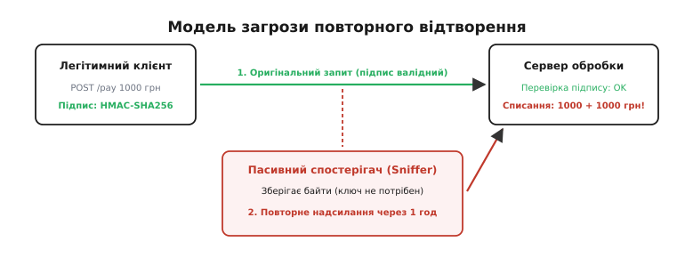
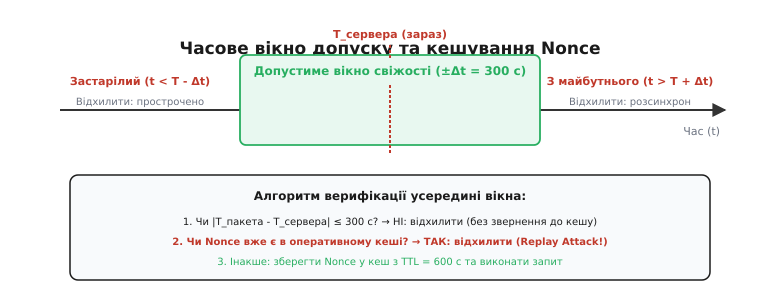
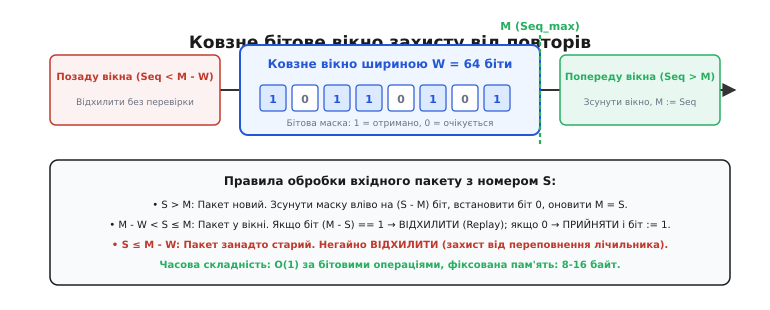
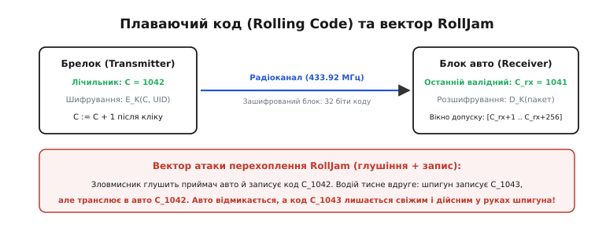
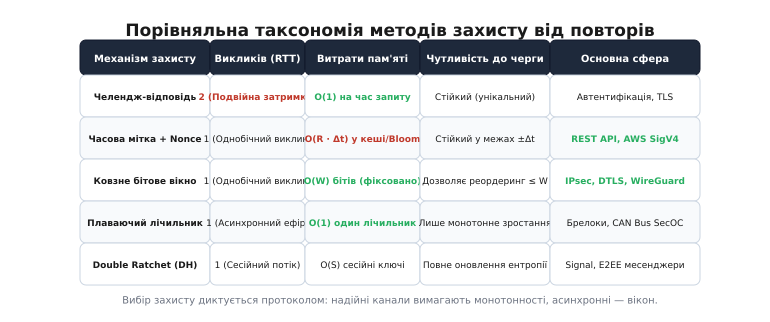

# Захист від атак повторного відтворення (Replay Protection)

<preknowlist>
- [Криптографічні геш-функції](topic:programming/cryptographic-hash) — односторонні математичні перетворення до фіксованої довжини для гарантії незмінності даних.
- [Автентифіковане шифрування (AEAD)](topic:communications/authenticated-encryption) — поєднання симетричного шифрування та перевірки цілісності за спільним таємним ключем.
- [Secure Boot і ланцюг довіри](topic:programming/firmware-secure-boot) — перевірка цифрових підписів перед виконанням коду та апаратний корінь довіри.
- [Підпис і верифікація вебхука](topic:programming/webhook-security) — механізм автентифікації асинхронних HTTP-викликів через HMAC-підпис.
- [Автентифікація челендж-відповідь](topic:communications/challenge-response) — доказ володіння секретом без його передачі через випадковий запит-виклик.
</preknowlist>

У системі дистанційного банківського обслуговування клієнт надсилає підписаний цифровим сертифікатом HTTP-запит на переказ 10 000 гривень зі свого поточного рахунку на депозит. Запит проходить через TLS-тунель, але на транзитному проксі-сервері локальної мережі корпоративний агент моніторингу записує весь потік зашифрованих байтів. Зловмисник, отримавши доступ до цього дампу трафіку, не має закритого ключа клієнта і не може змінити суму чи рахунок отримувача. Проте він бере точну копію сирого байтового масиву і відправляє його на банківський сервер знову через десять хвилин, а потім ще сто разів поспіль. Оскільки криптографічний підпис у кожному пакеті математично бездоганний, наївний сервер щоразу визнає команду дійсною і списує з рахунку клієнта вже мільйон гривень.

Така ж катастрофа відбувається в системах фізичного доступу: радіоприймач біля шлагбаума або гаражних воріт перехоплює радіосигнал від легітимного брелока, записує хвильовий пакет і транслює його в ефір уночі, коли власника немає вдома. Замок слухняно відмикається, бо вхідний код збігається з еталоном.

Ці ситуації викривають головну ілюзію початківців у безпеці: **шифрування гарантує конфіденційність, а цифровий підпис — цілісність та авторство, але жоден із них сам по собі не гарантує свіжості повідомлення**. Зловмиснику не потрібно ламати математику криптографічного алгоритму, якщо він може змусити систему виконати стару правду вдруге. **Захист від повторного відтворення** (англ. *replay protection*, від *replay* — «переграти, відтворити знову») — це сукупність протокольних та архітектурних механізмів, які пов'язують кожне повідомлення з неповторним динамічним контекстом: фізичним часом, монотонним станом лічильника або непередбачуваною ентропією отримувача.

---

## Анатомія загрози: чому сильна криптографія безсила перед повтором

Щоб зрозуміти вразливість, розкладемо криптографічний пакет на складові. Нехай клієнт формує команду `M` (наприклад, `Transfer(10000)`), обчислює цифровий підпис `S = Sign(K_priv, M)` за допомогою приватного ключа (лат. *privatus* — «особистий») або код автентифікації повідомлення `H = HMAC(K_shared, M)` і передає пару `(M, S)` у відкриту мережу.


*Модель загрози повтору: пасивний спостерігач записує легітимний підписаний пакет і надсилає його повторно. Сервер успішно звіряє математичний підпис і повторно виконує мутацію стану, якщо в протоколі відсутня перевірка свіжості.*

Сервер, отримавши пакет `(M, S)`, виконує функцію перевірки `Verify(K_pub, M, S)`. Ця функція є **чистою математичною операцією** (статичною детермінованою функцією):
- Вона перевіряє, чи не змінено байти в повідомленні `M` (цілісність, лат. *integritas*).
- Вона перевіряє, чи створено підпис саме володарем ключа (автентичність, грец. *authentikos* — «справжній»).

Але математична функція перевірки не має доступу до просторово-часового контексту:
1. Вона не знає, о котрій годині було створено цей підпис.
2. Вона не знає, скільки разів цей байтовий масив уже перетинав мережевий інтерфейс.
3. Вона не знає, чи призначався цей підпис для виконання саме на цьому сервері саме в цю мілісекунду.

Для функції `Verify` повідомлення, підписане рік тому, є настільки ж істинним, як і повідомлення, створене мілісекунду тому. Якщо стан бізнес-системи змінюється під дією команди (відбувається мутація балансу, відмикання реле, перезавантаження пристрою), багаторазове відтворення валідного сигналу призводить до фатальних наслідків.

### Різниця між випадковим дублем та атакою зловмисника

Варто розрізняти дві споріднені, але принципово різні причини появи повторних повідомлень:
- **Мережеві збої та ретраї (Accidental Network Duplication):** Клієнт надіслав запит, сервер його виконав, але відповідь загубилася через скидання пакета на транзитному маршрутизаторі. Клієнтська бібліотека спрацьовує за таймаутом і повторює запит із чистими намірами. Тут завдання полягає в забезпеченні ідемпотентності бізнес-логіки.
- **Зловмисна атака повторення (Adversarial Replay Attack):** Стороння особа навмисно записує чужий пакет у каналі зв'язку і транслює його в систему пізніше, прагнучи отримати несанкціоновану вигоду або порушити роботу сервісу.

Історія розвитку криптографії знає десятки прикладів, коли теоретично доведені протоколи виявлялися дірявими на практиці саме через replay-атаки — від класичної помилки в протоколі Нідгема-Шредера 1978 року до зламу автомобільних брелоків через RollJam. Детальний розбір цих знакових інцидентів та еволюції контрзаходів винесено в [історичний нарис атак повторного відтворення](topic:programming/replay-protection/hist-keeloq-and-early-replay.md).

Щоб ліквідувати цю сліпу пляму, інженер зобов'язаний внести в кожне повідомлення динамічний фактор свіжості (англ. *freshness guarantee*). Залежно від топології системи, вимог до затримки та наявності стану між учасниками використовують п'ять фундаментальних підходів.

---

## Підхід 1: Інтерактивний челендж-відповідь (Server Nonce)

Найбільш надійний спосіб переконатися, що клієнт діє «тут і зараз», — змусити його відповісти на щойно згенеровану сервером випадкову загадку. Це класична схема **челендж-відповідь** (англ. *challenge-response*, від *challenge* — «виклик, завдання»).

Механізм працює за три послідовні кроки:
1. **Запит виклику:** Клієнт надсилає запит наміру: «Я хочу виконати дію `X`».
2. **Генерація Nonce:** Сервер звертається до криптографічно стійкого генератора псевдовипадкових чисел (CSPRNG) і створює 128-бітне число `R` (англ. *nonce*, від давньоанглійського виразу *for the nonce* — «на один конкретний випадок»). Сервер зберігає `R` у своїй оперативній пам'яті зі статусом «очікує відповіді» і коротким таймаутом (наприклад, 10 секунд).
3. **Підпис виклику:** Клієнт формує підпис `S = Sign(K_priv, M || R)` і повертає його серверу.

Сервер знаходить збережений `R`, перевіряє підпис, негайно **видаляє `R` зі своєї пам'яті** та виконує команду. Якщо зловмисник спробує надіслати той самий пакет ще раз, сервер відповість відмовою: токен `R` уже знищено, він більше не дійсний.

```
Клієнт                               Сервер
  │                                     │
  │ ──────── 1. Запит дії ────────────► │
  │                                     │ [Генерує випадковий Nonce R]
  │                                     │ [Зберігає R в таблиці сесій]
  │ ◄─────── 2. Виклик (Nonce R) ────── │
  │                                     │
  │ [Підписує: Sign(M || R)]            │
  │                                     │
  │ ──────── 3. Команда + Підпис ─────► │ [Звіряє підпис над M || R]
  │                                     │ [ВИДАЛЯЄ R з пам'яті]
  │                                     │ [Виконує команду M]
  │ ◄─────── 4. Результат (200 OK) ──── │
```

> 🔧 **Навіщо це.** Схема із серверним Nonce є абсолютно невразливою до розсинхронізації годинників між машинами: клієнт узагалі не зобов'язаний знати поточний час. Вона використовується в протоколах автентифікації FIDO2/WebAuthn, банківських смарт-картках EMV та протоколах рукостискання TLS, де сервер щоразу генерує свіжий `ServerHello.random`.

**Ціна підходу:** Подвоєння мережевої затримки (Round-Trip Time, RTT). Для виконання однієї корисної дії клієнт змушений зробити два послідовні мережеві звернення (запит виклику → отримання токена → виконання). У високонавантажених мікросервісних API або в асинхронних чергах повідомлень така затримка є неприйнятною.

---

## Підхід 2: Часове вікно свіжості та кешування одноразових чисел (Timestamp + Nonce Cache)

Коли подвійний мережевий виклик неможливий, переходять до неінтерактивного захисту (один виклик на транзакцію). Відправник сам додає до повідомлення два критичні параметри:
1. **Часову мітку** `T` (англ. *timestamp*) — поточний час генерації запиту за шкалою UTC.
2. **Клієнтський Nonce** `N` — унікальний криптографічний 128-бітний ідентифікатор (наприклад, UUIDv4 або випадкові 16 байтів).

Підпис накладається на повний кортеж даних: `S = HMAC(K, Method || URI || Body || T || N)`.


*Алгоритм верифікації з часовим вікном: відхилення годинника |T_пакета - T_сервера| > Δt відкидається без читання бази. У межах вікна Nonce шукається в оперативному кеші: знайдене число викриває повтор, нове записується з TTL.*

### Дворівневий фільтр перевірки

Отримувач, прийнявши пакет `(M, T, N, S)`, виконує дворівневу перевірку:

**Рівень 1: Фільтр розсинхронізації годинників (Clock Skew Window).**
Сервер обчислює різницю між своїм поточним системним часом `T_now` і міткою пакета `T`:

```
|T_now - T| ≤ Δt
```

Параметр `Δt` — це допустиме вікно толерантності (зазвичай від 60 до 300 секунд). Якщо пакет прийшов із запізненням понад `Δt` (застарілий пакет) або з майбутнього більш ніж на `Δt` (некоректний годинник клієнта), сервер **негайно відхиляє його без звернення до бази даних**.

**Рівень 2: Перевірка та збереження Nonce у кеші.**
Якщо часова мітка потрапила у вікно `[T_now - Δt, T_now + Δt]`, сервер шукає ідентифікатор `N` у швидкому кеші (Redis, Memcached або локальний in-memory буфер):
- Якщо `N` уже присутній у кеші — зафіксовано спробу повторного відтворення (Replay Attack!). Запит відхиляється.
- Якщо `N` відсутній — сервер перевіряє підпис `S`, виконує бізнес-логіку і **атомарно записує `N` у кеш із часом життя (TTL) рівним `2 · Δt`**.

Чому саме `2 · Δt`? Пакет із міткою `T` може законно циркулювати в мережі щонайбільше `Δt` секунд після відправки (поки не вийде за лівий край вікна). Після того, як мітка `T` старіє більше ніж на `Δt`, її відсікає фільтр першого рівня за часом, і зберігати `N` у пам'яті більше немає жодної потреби: пам'ять автоматично звільняється.

### Тонкощі синхронізації часу: секунди координації та NTP-змазування

У реальних дата-центрах фізичний час серверів підтримується демонами `chrony` або `ntpd`. Проте інженери стикаються з двома специфічними крайовими випадками:
1. **Стрибки часу (Clock Step):** При раптовій синхронізації годинник сервера може перескочити вперед або назад на кілька секунд. Якщо час перескочив назад, старі запити можуть повторно потрапити у вікно валідності. Щоб цьому запобігти, на серверах безпеки налаштовують плавне регулювання швидкості таймера (англ. *clock slewing*), забороняючи миттєві стрибки.
2. **Секунди координації (Leap Seconds):** Додавання високосної секунди (23:59:60) у деяких операційних системах викликає дублювання секунди `59` або стрибок на секунду `00`. Сучасні хмарні провайдери (AWS, Google Cloud) застосовують техніку розмивання секунди (Leap Smear), розтягуючи зайву секунду на 24 години у вигляді крихітного сповільнення ходу кварцового резонатора.

### Проблема пам'яті під високим навантаженням та ймовірнісні фільтри

Якщо API приймає 50 000 запитів за секунду, а вікно `Δt = 300` с, у кеші одночасно перебуває:

```
N_total = 50 000 запитів/с · 600 с = 30 000 000 одноразових ключів
```

Збереження 30 мільйонів UUID у традиційній геш-таблиці потребує гігабайт оперативної пам'яті. Щоб утримати константний обсяг пам'яті, інженери застосовують **фільтри Блума з ротацією поколінь** (Generation Slicing).

Суть полягає у підтримці двох бітових масивів: фільтра поточного вікна `B_curr` та попереднього вікна `B_prev`. Кожні `Δt` секунд старий фільтр скидається, а поточний стає попереднім. Перевірка наявності Nonce виконується за `O(k)` геш-операцій над бітами, стискаючи необхідну пам'ять у десятки разів ціною мінімальної контрольованої ймовірності хибного відхилення. Повний математичний вивід оптимальної кількості геш-функцій `k`, формули колізій та оцінки ризику хибного блокування наведено в [математичному аналізі ковзних масок та фільтрів Блума](topic:programming/replay-protection/math-sliding-bitmap.md).

Практичну реалізацію такого верифікатора підписів для прикладних API (із захистом від атак за часом і кільцевим буфером) можна знайти у [проєкті верифікатора підписів з кешем одноразових чисел](topic:programming/replay-protection/proj-timestamp-nonce-cache.md).

---

## Підхід 3: Монотонні порядкові номери та ковзне бітове вікно (RFC 6479)

У транспортних мережевих протоколах (IPsec, DTLS, WireGuard, QUIC), де пакети передаються через ненадійні дейтаграми UDP на швидкостях гігабітів за секунду, синхронізація часу через NTP не забезпечує мікросекундної точності, а кешування рядкових Nonce призвело б до паралічу маршрутизаторів.

Тут застосовують інший математичний принцип: **строго монотонний лічильник послідовності** (англ. *sequence number*) у поєднанні з **ковзною бітовою маскою** (англ. *sliding window bitmask*).

### Як працює бітова маска

Відправник утримує 64-бітний цілочисельний лічильник `Seq`, який стартує з 1 і збільшується на 1 для кожного надісланого пакета: `Seq_out = Seq_out + 1`. Значення `Seq` вкладається в незашифрований заголовок пакета (наприклад, заголовок ESP) і обов'язково покривається загальним криптографічним кодом цілісності (HMAC або AEAD auth tag).

Отримувач підтримує стан, який складається лише з двох елементів:
1. `M` (англ. *maximum sequence*) — найбільший номер послідовності, який було успішно прийнято та верифіковано.
2. `Bitmap` — бітовий масив фіксованої ширини `W` (наприклад, 64 або 128 бітів), де кожен біт на позиції `i` (від `0` до `W - 1`) вказує, чи було отримано пакет із номером `M - i`.


*Ковзне бітове вікно: отримання пакета з номером S > M зсуває маску вліво на (S - M) бітів. Пакети всередині вікна перевіряються за значенням відповідного біта, а пакети лівіше вікна відкидаються як застарілі.*

Коли надходить вхідний пакет із номером `S`:

```
1. Випадок S > M (Пакет новий, випереджає відомий максимум):
   Δ = S - M
   Якщо Δ < W:
     Маска зсувається вліво на Δ бітів: Bitmap = (Bitmap << Δ) | 1
   Інакше (стрибок більше ширини вікна):
     Маска повністю скидається: Bitmap = 1
   Оновлюється максимум: M = S
   Пакет ПРИЙМАЄТЬСЯ.

2. Випадок M - W < S ≤ M (Пакет потрапив усередину вікна через мережеве перевпорядкування):
   offset = M - S
   Якщо (Bitmap & (1 << offset)) != 0:
     Пакет ВІДХИЛЯЄТЬСЯ (дублікат — Replay Attack!).
   Інакше:
     Позначаємо біт: Bitmap = Bitmap | (1 << offset)
     Пакет ПРИЙМАЄТЬСЯ.

3. Випадок S ≤ M - W (Пакет відстає від максимуму більше ніж на ширину вікна):
   Пакет ВІДХИЛЯЄТЬСЯ негайно (застарілий пакет, загроза переповнення).
```

### Реалізація перевірки та фіксації

Нижче наведено базову структуру перевірки та фіксації номера послідовності мовами C та C++:

:::tabs
```c
#include <stdint.h>
#include <stdbool.h>

#define REPLAY_WIN_SIZE 64

typedef struct {
    uint64_t seq_max;
    uint64_t bitmap;
} replay_filter_t;

bool replay_filter_check(const replay_filter_t *f, uint64_t seq) {
    if (seq == 0) return false;
    if (seq > f->seq_max) return true; // новий пакет
    uint64_t diff = f->seq_max - seq;
    if (diff >= REPLAY_WIN_SIZE) return false; // занадто старий
    return (f->bitmap & ((uint64_t)1 << diff)) == 0; // true якщо ще не бачили
}

void replay_filter_commit(replay_filter_t *f, uint64_t seq) {
    if (seq > f->seq_max) {
        uint64_t diff = seq - f->seq_max;
        f->bitmap = (diff < REPLAY_WIN_SIZE) ? ((f->bitmap << diff) | 1) : 1;
        f->seq_max = seq;
    } else {
        uint64_t diff = f->seq_max - seq;
        if (diff < REPLAY_WIN_SIZE) {
            f->bitmap |= ((uint64_t)1 << diff);
        }
    }
}
```
```cpp
#include <cstdint>

class ReplayFilter {
public:
    static constexpr uint64_t WindowSize = 64;

    [[nodiscard]] bool check(uint64_t seq) const noexcept {
        if (seq == 0) return false;
        if (seq > seq_max_) return true;
        const uint64_t diff = seq_max_ - seq;
        if (diff >= WindowSize) return false;
        return (bitmap_ & (uint64_t{1} << diff)) == 0;
    }

    void commit(uint64_t seq) noexcept {
        if (seq > seq_max_) {
            const uint64_t diff = seq - seq_max_;
            bitmap_ = (diff < WindowSize) ? ((bitmap_ << diff) | 1) : 1;
            seq_max_ = seq;
        } else {
            const uint64_t diff = seq_max_ - seq;
            if (diff < WindowSize) {
                bitmap_ |= (uint64_t{1} << diff);
            }
        }
    }

private:
    uint64_t seq_max_{0};
    uint64_t bitmap_{0};
};
```
:::

Повний багатослівний варіант вікна з підтримкою 128/512 бітів та багатопотокового середовища наведено у [проєкті реалізації ковзного бітового вікна](topic:programming/replay-protection/proj-sliding-window.md). А формати заголовків ESP, правила ESN та параметри SecOC описано у [довіднику протокольних контрактів захисту від повтору](topic:programming/replay-protection/api-replay-defense.md).

---

## Підхід 4: Плаваючий код (Rolling Codes) в автономних радіоканалах

В автономних системах без зворотного зв'язку — автомобільних ключах, бездротових пультах шлагбаумів та датчиках охоронної сигналізації — приймач не може надіслати челендж, а передавач не має зв'язку з інтернетом для точного часу.

Для таких умов було створено алгоритм **плаваючого коду** (англ. *rolling code*, або *hopping code*), найвідомішим втіленням якого став алгоритм **KeeLoq**.


*Принцип плаваючого коду: лічильник натискань шифрується симетричним ключем. Приймач відкриває замок, якщо лічильник більший за збережений у межах вікна. Вектор RollJam використовує глушіння для крадіжки невикористаного свіжого коду.*

### Механізм синхронізації

1. Брелок містить 16- або 32-бітний лічильник `Counter`, збережений в енергонезалежній пам'яті EEPROM. При кожному натисканні кнопки лічильник збільшується: `Counter = Counter + 1`.
2. Значення лічильника разом із серійним номером брелока та бітами кнопок шифрується блоковим шифром за спільним майстер-ключем `K_dev`: `Encrypted_Block = Encrypt(K_dev, Counter || Flags || Seed)`.
3. Приймач розшифровує отриманий блок і перевіряє значення лічильника `C_rx` відносно останнього успішно прийнятого значення `C_last`:
   - Якщо `C_rx == C_last + 1` — штатне відкриття, оновлюємо `C_last = C_rx`.
   - Якщо `C_last + 1 < C_rx ≤ C_last + 256` — користувач кілька разів натиснув кнопку поза зоною дії приймача (Open Window). Замок відмикається, `C_last = C_rx`.
   - Якщо `C_rx ≤ C_last` — пакет відкидається як перехоплений повтор.

### Межа надійності: вразливість до атак вибіркового глушіння (RollJam)

Слабке місце будь-якого однобічного плаваючого коду — відсутність підтвердження отримання від автомобіля. Як продемонстрував Семі Камкар у 2015 році пристроєм RollJam, нападник може заблокувати радіоефір вузькосмуговою завадою і перехопити перший код `C_1`. Коли водій тисне кнопку вдруге, пристрій перехоплює код `C_2`, але одночасно транслює в автомобіль записаний код `C_1`. Автомобіль відкривається, а в руках зловмисника залишається повністю свіжий, ще не використаний приймачем код `C_2`.

Для подолання цієї фундаментальної вразливості сучасні автомобільні системи відмовилися від чистого KeeLoq на користь двосторонніх протоколів зв'язку на базі UWB (Ultra-Wideband) та Bluetooth LE з криптографічним вимірюванням часу польоту радіосигналу (Distance Bounding / Time-of-Flight), де перехоплення та затримка сигналу фізично виявляються за швидкістю світла.

---

## Підхід 5: Ефемерні ключі та криптографічні храповики (Double Ratchet)

Найвищий рівень захисту від перегравання досягається тоді, коли повідомлення не просто перевіряється на свіжість, а в принципі **не може бути розшифроване вдруге**, оскільки сам ключ для його розшифрування безповоротно знищується відразу після використання.

Цей принцип реалізовано в алгоритмі **Double Ratchet** (протокол Signal, WhatsApp, Matrix):
1. Кожне текстове повідомлення шифрується унікальним разовим ключем `K_msg`.
2. Ключ `K_msg` генерується за допомогою односторонньої геш-функції (KDF-ланцюжка) від внутрішнього стану храповика.
3. Щойно повідомлення відправлено або прийнято, стан зміщується вперед на один крок, а старий ключ `K_msg` безповоротно стирається з пам'яті (властивість Forward Secrecy — пряма таємність).

Якщо нападник перехопить зашифроване повідомлення і надішле його знову, приймач не зможе його розшифрувати: стан KDF уже пішов уперед, старий ключ знищено, і повторне обчислення того самого ключа математично неможливе.

### Захист ранніх даних у TLS 1.3 0-RTT

У протоколі TLS 1.3 (RFC 8446) оптимізація 0-RTT (Zero Round-Trip Time) дозволяє клієнту надсилати зашифровані прикладні дані в першому ж польоті пакетів разом із `ClientHello` на основі попередньо виданого сесійного квитка (PSK).

Оскільки пакет 0-RTT відправляється до завершення нового асиметричного рукостискання, він за своєю природою відкритий для replay-атак. Стандарт TLS 1.3 визначає три механізми захисту від повтору ранніх даних:
1. **Регістри одноразових квитків (Single-Use Tickets / Strike Registers):** Сервер зберігає унікальний ідентифікатор кожного квитка і дозволяє його використання рівно один раз. Повторне з'єднання з тим самим квитком скидається до повного 1-RTT рукостискання.
2. **Перевірка вікна часу квитка (Client Hello Recording):** Сервер перевіряє вік квитка `ticket_age` та поточний час. У межах короткого вікна (наприклад, 10 секунд) сервер кешує геші `ClientHello` для виявлення дублікатів.
3. **Обмеження на рівні протоколу додатків:** Сервери додатків зобов'язані приймати у режимі 0-RTT виключно безпечні ідемпотентні HTTP-методи (`GET`, `HEAD`), перенаправляючи мутуючі команди (`POST`, `PUT`, `DELETE`) на виконання тільки після повного підтвердження сесії.

---

## Порівняльний аналіз тактик захисту

Вибір конкретного інструменту захисту від повторного відтворення диктується мережевими умовами та архітектурними обмеженнями системи.


*Матриця архітектурного вибору: порівняння методів за кількістю викликів (RTT), навантаженням на пам'ять, стійкістю до перевпорядкування та типовою сферою застосування.*

| Механізм | Викликів (RTT) | Пам'ять сервера | Синхронізація часу | Сфера застосування |
| :--- | :--- | :--- | :--- | :--- |
| **Челендж-відповідь (Nonce)** | 2 (Висока затримка) | `O(1)` на відкриту сесію | Не потрібна | Автентифікація FIDO2, SSH, банківські картки EMV |
| **Timestamp + Nonce Cache** | 1 (Мінімальна затримка) | `O(R · Δt)` у кеші / Bloom | Обов'язкова (NTP, `±Δt`) | REST API, AWS SigV4, підпис вебхуків, Kerberos |
| **Ковзне бітове вікно (Seq)** | 1 (Мінімальна затримка) | `O(W)` бітів (фіксовано 16 Б) | Не потрібна | IPsec ESP, DTLS, WireGuard, QUIC |
| **Плаваючий лічильник (Rolling)** | 1 (Однобічний ефір) | `O(1)` (4 байти лічильника) | Не потрібна | Брелоки авто, шлагбауми, шина CAN (AUTOSAR SecOC) |
| **Ефемерний храповик (Ratchet)** | 1 (Потокове з'єднання) | `O(S)` стан ключів сесії | Не потрібна | Месенджери E2EE (Signal, WhatsApp), TLS 1.3 |

> 🔧 **Навіщо це.** Захист від повтору — це не додаткова «опція» криптографії, а необхідна умова її працездатності в реальному світі. Будь-яка система, що виконує мутацію стану на основі підписаних даних (платіж, відкриття замка, перезавантаження контролера, оновлення конфігурації), без захисту від перегравання залишається відкритою для повного компрометування простим перехопленням мережевого трафіку.

---

## Типові помилки реалізації та крайові випадки

1. **Відсутність криптографічного покриття мітки або Nonce.** Часова мітка `Timestamp` або номер `Seq` передаються у відкритому заголовку HTTP/IP, але не входять у підписуваний рядок HMAC. Зловмисник просто підставляє свіжий `Timestamp = now()` у старий перехоплений пакет. **Правило:** усе, що визначає свіжість, зобов'язане бути невіддільною частиною підпису або коду автентифікації.
2. **Перевірка підпису після мутації стану (Replay State Poisoning).** Якщо бітова маска або кеш Nonce оновлюються *до* повної криптографічної перевірки HMAC, зловмисник може надсилати фальшиві пакети з номерами з майбутнього, вибиваючи легітимні пакети з вікна або засмічуючи пам'ять кешу (DoS-атака на стан).
3. **Недостатня ентропія клієнтського Nonce.** Якщо клієнт генерує Nonce за допомогою слабкого псевдовипадкового генератора (наприклад, `rand()` у C або лінійного конгруентного датчика), нападник може передбачити наступні значення Nonce і змусити сервер відхилити легітимні запити через штучні колізії.
4. **Некоректна обробка переповнення лічильника.** При використанні 32-бітного лічильника `Seq` у гігабітних мережах переповнення `2³²` досягається за кілька годин. Якщо протокол не підтримує 64-бітні розширені номери (ESN) або примусову переініціалізацію сесії (Rekeying), після переповнення лічильник скидається в 0, і всі наступні легітимні пакети відхиляються як застарілий повтор.
5. **Гонка перевірки та фіксації у розподіленому кеші (TOCTOU Replay).** Якщо перевірка наявності Nonce та його запис у Redis виконуються двома окремими мережевими командами `EXISTS` та `SET`, зловмисник може надіслати два дублікати паралельно, пройшовши перевірку на обох воркерах до того, як перший встигне зафіксувати ключ. Захист вимагає атомарної команди `SET ... NX EX` або виконання Lua-скрипта на стороні Redis.
