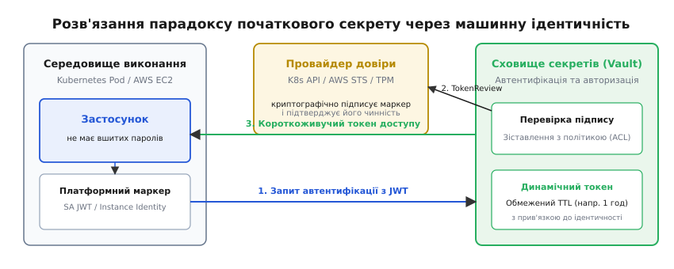
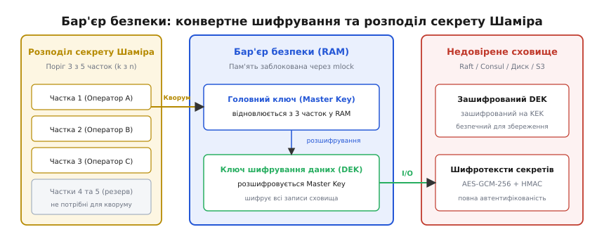
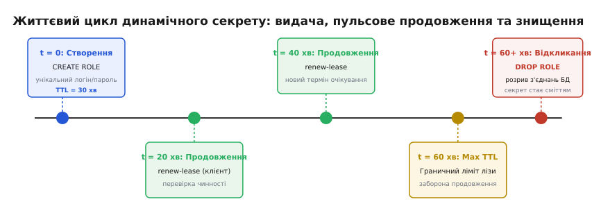
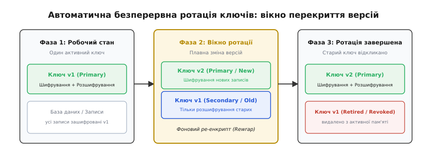

# Керування секретами, HashiCorp Vault та автоматична ротація ключів

<preknowlist>
- [Найменші привілеї й deny-by-default](book:programming/least-privilege) — надання мінімально необхідного доступу та заборона будь-яких дій за замовчуванням.
- [Межі довіри](book:programming/trust-boundaries) — розподіл системи на ізольовані контури безпеки з різними рівнями доступу.
- [Шифрування у спокої й ключі](book:programming/encryption-at-rest) — конвертне шифрування даних на диску за допомогою ключів KEK та DEK.
- [Аудит-лог як вузол](book:programming/audit-logging) — незмінний журнал подій для повної фіксації кожного факту доступу та операцій автентифікації.
- [Конфігурація застосунків](book:programming/config-design) — проєктування налаштувань програми та відокремлення параметрів середовища від вихідного коду.
</preknowlist>

О другій годині ночі автоматизований конвеєр неперервної інтеграції виконує збірку мікросервісу обробки платіжних транзакцій: інженер випадково залишає в одному з тестових сценаріїв статичний токен доступу до хмарного сховища з правами адміністратора. Через сто сорок секунд сканувальний бот зчитує ключ із публічного журналу збірки, а ще через три хвилини зловмисники ініціюють паралельне завантаження резервних копій бази даних обсягом вісімсот гігабайтів та запускають сотню високонавантажених обчислювальних вузлів. Коли чергова зміна реагує на аварійне сповіщення системи моніторингу витрат, рахунок за хмарну інфраструктуру перевищує сорок дві тисячі доларів, а дані мільйона користувачів опиняються у відкритому доступі.

Цей інцидент ілюструє головну вразливість сучасних розподілених систем: якщо безпека спирається на статичні, довгоживучі облікові дані, будь-який одиничний витік інформації автоматично перетворюється на повну катастрофу. Єдиний спосіб усунути цю вразливість — зробити секрети короткоживучими, динамічно генерованими для кожного клієнта та автоматично ротованими без зупинки системи.

---

### Межа між конфігурацією та секретами

У традиційній розробці параметри роботи програми часто складають в єдиний текстовий файл налаштувань. Проте між звичайною конфігурацією та секретами існує принципова різниця:

1. **Конфігурація**: Описує режим функціонування системи — таймаути мережевих з'єднань, розміри пулів потоків, назви черг повідомлень або мережеві адреси кінцевих точок API. Ці дані є ідемпотентними, не надають прав на виконання привілейованих операцій, можуть зберігатися у відкритому вигляді у репозиторії версій Git, виводитися в діагностичні логи та кешуватися на будь-якому рівні інфраструктури.
2. **Секрети** (лат. *secretum* — таємне, приховане): Криптографічні артефакти, володіння якими є беззаперечним доказом ідентичності або авторизації суб'єкта. До них належать паролі до баз даних, приватні ключі TLS/SSH, симетричні ключі шифрування, токени доступу OAuth та API-ключі платіжних систем.

Головна властивість секрету полягає в тому, що його компрометація є **незворотною**: якщо ключ опинився в чужих руках, зловмисник отримує повні повноваження легітимного власника. Тому секрети мають суворий життєвий цикл: генерація, захищена передача, ізольоване збереження в пам'яті, регулярна **ротація** (лат. *rotatio* — круговий рух, обертання) та негайне відкликання в разі підозри на витік.

Детальніше про те, чому спроби зберігати секрети у звичайних змінних оточення чи текстових файлах зазнали поразки в ході розвитку індустрії, читайте в [історії виникнення криптографічних сховищ та відмови від змінних оточення](book:programming/secrets-management/hist-secrets-evolution.md).

---

### Парадокс початкового секрету (Secret Zero) та машинна ідентичність

Коли інфраструктура переходить на централізоване сховище секретів, виникає фундаментальний логічний парадокс, відомий як проблема **«початкового секрету»** (*Secret Zero*): щоб застосунок міг звернутися до захищеного сховища та отримати пароль від бази даних, він сам повинен спершу довести свою ідентичність, тобто надати сховищу свій власний автентифікаційний токен. Але де саме зберегти цей початковий токен, щоб його не вкрали?

Якщо записати початковий токен у конфігураційний файл на диску контейнера, проблема витоку повертається на попередній рівень. 


*Розв'язання парадоксу початкового секрету через машинну ідентичність та платформену атестацію.*

Сучасна архітектура розв'язує цей парадокс через відмову від статичних токенів на користь **машинної ідентичності на основі платформеної атестації**:

1. **Довірене середовище виконання**: Застосунок запускається у керованому контурі — наприклад, у кластері Kubernetes або на віртуальній машині хмарного провайдера (AWS, Google Cloud, Azure).
2. **Платформений маркер**: Середовище виконання самостійно монтує у процес короткоживучий криптографічний маркер, підписаний асиметричним ключем самої платформи. У Kubernetes це криптографічно підписаний JWT-токен облікового запису служби (*ServiceAccount Token*), у хмарі AWS — підписаний запит до сервісу захищених маркерів (*AWS STS GetCallerIdentity*), у фізичних серверах — атестаційний сертифікат довіреного платформного модуля (TPM).
3. **Обмін ідентичності на токен**: Застосунок надсилає цей платформений маркер до сховища секретів (Vault).
4. **Зворотна перевірка (*TokenReview*)**: Сховище звертається безпосередньо до API платформи оркестрації, перевіряє цифровий підпис маркера, переконується, що запит надійшов саме від зазначеного пода у визначеному просторі імен, і лише після цього видає короткоживучий токен доступу до сховища зі строгим часом життя (*TTL*).

Завдяки такій схемі розробникам більше не потрібно створювати, передавати чи зберігати жодних початкових паролів: довіра виводиться автоматично з факту фізичного запуску програми у верифікованому контурі оркестратора.

---

### Архітектура криптографічного бар'єра HashiCorp Vault

Централізоване сховище секретів не має права довіряти постійному носію, на якому воно збережене. Якщо зловмисник викраде образ диска віртуальної машини або зробить дамп сховища даних (Raft, Consul чи PostgreSQL), він не повинен отримати жодного відкритого байта.

У системі **HashiCorp Vault** цей захист реалізовано через концепцію **криптографічного бар'єра безпеки** (*Security Barrier*) та дворівневе конвертне шифрування.


*Бар'єр безпеки Vault: конвертне шифрування даних та відновлення головного ключа через схему Шаміра.*

#### Конвертне шифрування та життєвий цикл ключів

Уся інформація всередині сховища підпорядковується чіткій криптографічній ієрархії:

- **Ключ шифрування даних (DEK, Data Encryption Key)**: 256-бітний випадковий симетричний ключ AES-GCM, який безпосередньо шифрує та автентифікує кожен запис у сховищі.
- **Головний ключ шифрування (KEK / Master Key)**: Ключ, яким зашифровано сам DEK. Головний ключ ніколи не записується на диск і існує виключно у захищеній оперативній пам'яті працюючого процесу Vault.
- **Недовірене сховище**: Постійна база даних бачить лише зашифрований блок DEK та масив зашифрованих записів із контрольною сумою HMAC.

#### Запечатування та схема розділення секрету Шаміра

Під час старту або перезапуску сервер Vault перебуває у **запечатаному стані** (*Sealed*). У цьому стані сервер відхиляє всі клієнтські запити, оскільки його оперативна пам'ять порожня, а головний ключ відсутній.

Щоб перевести сервер у робочий стан (**розпечатати**, *Unseal*), використовується порогова криптографічна схема розділення секрету Аді Шаміра (англ. *Shamir's Secret Sharing*):

1. Під час первинної ініціалізації кластера головний ключ `K` математично розбивається на `n` незалежних часток (наприклад, `n = 5`);
2. Встановлюється мінімальний кворум `k` (наприклад, `k = 3`), необхідний для відновлення початкового значення;
3. Частки роздаються різним операторам безпеки;
4. Жодна окрема частка не дає жодної інформації про ключ `K`. Лише коли будь-які 3 з 5 операторів вводять свої частки через API, алгоритм інтерполяції полінома Лагранжа відновлює значення головного ключа `K` безпосередньо в оперативній пам'яті;
5. Відновлений головний ключ розшифровує DEK, після чого криптографічний бар'єр відкривається для обробки запитів клієнтів.

У сучасних хмарних інфраструктурах ручний процес розпечатування часто замінюють на **автоматичне розпечатування** (*Auto-unseal*), де головний ключ шифрується апаратним модулем безпеки (HSM) або керованою службою управління ключами хмарного провайдера (AWS KMS, GCP Cloud KMS, Azure Key Vault).

---

### Динамічні секрети та керування орендою (Leases)

Традиційний підхід до збереження паролів у статичних KV-сховищах (*Key-Value*) має критичну ваду: один і той самий пароль до бази даних використовується десятками екземплярів мікросервісу роками. Якщо цей пароль витікає через лог або скомпрометований вузол, радіус ураження охоплює всю систему, а зміна пароля вимагає синхронного оновлення конфігурацій усього кластера.

Фундаментальне досягнення сучасних систем керування секретами — це концепція **динамічних секретів** (*Dynamic Secrets*).


*Життєвий цикл динамічного секрету: видача унікального облікового запису, пульсове продовження оренди та автоматичне знищення.*

#### Механізм роботи динамічного рушія

Коли застосунку потрібен доступ до бази даних (наприклад, PostgreSQL), він не читає статичний пароль, а звертається до рушія баз даних Vault:

1. **Генерація на вимогу**: Vault самостійно генерує унікальне ім'я користувача (наприклад, `v-token-app-c3b879a9-1692561234`) та криптографічно стійкий випадковий пароль;
2. **Створення ролі в СУБД**: Через своє внутрішнє адміністративне підключення Vault виконує SQL-команди:
   ```sql
   CREATE ROLE "v-token-app-c3b879a9-1692561234" WITH LOGIN PASSWORD 'A1b!C2d#E3f$G4h%' VALID UNTIL '2026-08-20 22:00:00';
   GRANT SELECT, INSERT, UPDATE ON ALL TABLES IN SCHEMA public TO "v-token-app-c3b879a9-1692561234";
   ```
3. **Видача з ідентифікатором оренди**: Vault повертає застосунку згенеровані облікові дані разом з унікальним ідентифікатором оренди `lease_id` та часом життя `lease_duration` (наприклад, 1800 секунд);
4. **Пульсове продовження (*Heartbeat Lease Renewal*)**: Поки застосунок працює коректно, його фоновий потік періодично надсилає запит до сховища на подовження оренди;
5. **Автоматичне знищення (*Revocation*)**: Якщо застосунок завершив роботу, або якщо час оренди досяг максимального ліміту (*Max TTL*), або якщо оператор безпеки виявив аномальну активність, Vault виконує команду:
   ```sql
   DROP ROLE "v-token-app-c3b879a9-1692561234";
   ```

Кожен окремий процес отримує власні, ізольовані облікові дані. Якщо один із сотні серверів виявляється скомпрометованим, оператор анулює одну конкретну оренду без найменшого впливу на роботу решти дев'яноста дев'яти вузлів.

Повний опис контрактів API для роботи з динамічними базами даних та транзитним рушієм наведено в [інтерфейсі транзитного шифрування та динамічних секретів Vault API](book:programming/secrets-management/api-vault-transit.md).

---

### Криптографія як сервіс (Transit Secret Engine)

У багатьох сценаріях застосунку взагалі не потрібно знати криптографічні ключі для шифрування конфіденційних даних клієнтів (номерів кредитних карток, медичних записів або персональних ідентифікаторів).

Традиційна помилка полягає у завантаженні симетричного ключа шифрування в пам'ять кожного бекенд-сервісу. Якщо зловмисник отримує доступ до пам'яті процесу через вразливість переповнення буфера або RCE, він викрадає сам ключ і розшифровує всю базу даних.

**Рушій транзитного шифрування** (*Transit Engine*) змінює цю парадигму:
- Ключі шифрування генеруються всередині Vault і **ніколи не залишають його криптографічний бар'єр**;
- Застосунок, якому потрібно зберегти номер картки, надсилає відкритий текст через HTTP POST-запит до кінцевої точки `/v1/transit/encrypt/card-key`;
- Vault виконує шифрування алгоритмом AES-GCM-256 та повертає шифротекст із маркером версії `vault:v1:...`;
- База даних зберігає лише зашифровані рядки;
- Для читання даних застосунок надсилає шифротекст на кінцеву точку `/v1/transit/decrypt/card-key`.

Такий підхід повністю виводить ключі з зони досяжності прикладного коду та перетворює сховище на спеціалізований криптографічний процесор.

---

### Алгоритми безперервної ротації ключів (Zero-Downtime Rotation)

Ротація криптографічних ключів та облікових записів баз даних є обов'язковою вимогою стандартів безпеки (PCI-DSS, SOC2, ISO 27001). Проте наївна заміна ключа «в один момент» гарантовано ламає високонавантажену систему через розсинхронізацію між вузлами.


*Стани безперервної ротації ключів: вікно перекриття версій для роботи без зупинки системи.*

#### Багатоверсійні стани ключів шифрування

Для шифрування даних застосовується кінцевий автомат із трьома фазами життя ключа:

1. **Фаза 1: Одиночний активний ключ (`v1`)**: Ключ `v1` є єдиним (*Primary*), використовується як для нових операцій шифрування, так і для розшифрування наявних записів.
2. **Фаза 2: Вікно перекриття ротації (`v1 + v2`)**: 
   - Викликається команда ротації; генерується ключ `v2`, який стає основним (*Primary*);
   - Усі нові операції запису шифруються виключно ключем `v2`;
   - Ключ `v1` переходить у вторинний стан (*Secondary / Decrypt-Only*): він заборонений для нових записів, але залишається активним для читання старих документів;
   - Запускається фоновий процес перешифрування (*Rewrap / Re-encryption*), який поступово зчитує старі шифротексти `vault:v1:...` і перешифровує їх на `vault:v2:...` безпосередньо всередині сховища;
3. **Фаза 3: Відкликання старого ключа (`v1 → Retired`)**: Щойно у базі даних не залишається жодного запису з префіксом `vault:v1:`, старий ключ `v1` назавжди деактивується або видаляється з пам'яті.

#### Подвійний пул користувачів баз даних (Blue-Green Credential Rotation)

Для ротації статичних або напівстатичних паролів баз даних без переривання виконання транзакцій застосовують алгоритм чергування двох незалежних облікових записів:

```
[Стан 1: Активний пул А]   Користувач: app_user_blue  (100% трафіку)
                           Користувач: app_user_green (не існує або неактивний)
                                      ↓
[Стан 2: Створення пулу Б] Vault створює app_user_green з новим паролем.
                           Застосунок підключає другий пул з'єднань до бази.
                                      ↓
[Стан 3: Перемикання пулу] Застосунок атомарно перемикає новий трафік на app_user_green.
                           Старі з'єднання app_user_blue плавно допрацьовують (drain).
                                      ↓
[Стан 4: Знищення пулу А]  Усі старі транзакції завершено. Пул А закрито.
                           Vault видаляє обліковий запис app_user_blue.
```

Цей шаблон забезпечує нульовий час простою (*Zero Downtime*) та унеможливлює ситуацію, коли запит клієнта обривається через раптову зміну пароля посеред виконання складної транзакції.

Детальну архітектуру та вихідний код клієнтського модуля, що реалізує захищене потокове оновлення без блокувань, наведено у [практичній реалізації клієнта безперервної ротації секретів із захистом пам'яті](book:programming/secrets-management/proj-secret-rotation.md).

---

### Гігієна оперативної пам'яті: Захист секретів у рантаймі

Навіть якщо секрет безпечно передано через TLS та успішно розшифровано, він залишається вразливим, поки зберігається в оперативній пам'яті процесу.

Існує три головні загрози для секретів у пам'яті застосунку:

#### 1. Вимивання у swap-простір на диск
Коли в операційній системі вичерпується вільна фізична оперативна пам'ять, підсистема віртуальної пам'яті ядра скидає неактивні анонімні сторінки у swap-розділ жорсткого диска. Секрет залишається записаним у магнітних комірках або флешпам'яті SSD навіть після вимкнення живлення сервера.

Для запобігання цій загрозі всі буфери з обліковими даними повинні виділятися на вирівняних сторінках і фіксуватися в фізичній пам'яті за допомогою системного виклику блокування:
:::tabs
```c
/* Блокування сторінки у фізичній пам'яті (заборона swap) */
if (mlock(secret_buffer, buffer_size) != 0) {
    perror("mlock failed");
}
```
```cpp
/* Блокування сторінки у пам'яті з перевіркою помилок через виняток */
if (::mlock(secret_buffer.data(), secret_buffer.size()) != 0) {
    throw std::system_error(errno, std::generic_category(), "mlock failed");
}
```
:::
Цей виклик гарантує, що сторінка ніколи не буде вивантажена на диск.

#### 2. Попадання в аварійні дампи пам'яті (Core Dumps)
Під час аварійного падіння процесу (наприклад, за сигналом `SIGSEGV`) ядро операційної системи записує повний стан адресного простору у файл core dump для подальшого аналізу інженерами. Якщо утиліта дампу збереже конфіденційні сторінки, секрет потрапить до системи збору діагностики.

Захист досягається встановленням прапорця ядра:
:::tabs
```c
#ifdef MADV_DONTDUMP
madvise(secret_buffer, buffer_size, MADV_DONTDUMP);
#endif
```
```cpp
#ifdef MADV_DONTDUMP
::madvise(secret_buffer.data(), secret_buffer.size(), MADV_DONTDUMP);
#endif
```
:::

#### 3. Оптимізації компілятора та стирання зачистки (Dead Store Elimination)
Коли програма завершує обробку пароля, виклик звичайного занулення пам'яті `memset(password, 0, size)` перед звільненням ресурсу часто виявляється марним:
:::tabs
```c
/* Небезпечний підхід: компілятор видалить memset під час оптимізації */
memset(password, 0, sizeof(password));
free(password);

/* Безпечний підхід: явний бар'єр занулення пам'яті */
explicit_bzero(password, sizeof(password));
free(password);
```
```cpp
/* Безпечний підхід у C++: захисна зачистка через span перед деструктором */
::explicit_bzero(password_span.data(), password_span.size());
```
:::
Сучасні оптимізувальні компілятори (GCC, Clang) аналізують граф потоку даних. Бачачи, що пам'ять після виклику `memset` одразу звільняється або виходить з області видимості функції, компілятор розцінює цей запис як «мертвий» (*Dead Store*) і **повністю видаляє машинну інструкцію занулення**. В результаті пароль залишається у сирій пам'яті процесу на невизначений час.

Для гарантованого фізичного знищення байтів слід використовувати виключно спеціалізовані бар'єрні виклики:
- У Linux / POSIX: `explicit_bzero(password, sizeof(password))`;
- У Windows: `SecureZeroMemory(password, sizeof(password))`;
- У C11: `memset_s(password, sizeof(password), 0, sizeof(password))`.

---

> 🔧 **Навіщо це.**
> 
> У реальній інженерній практиці надійність захисту секретів визначається не довжиною згенерованого пароля, а автоматизацією його життєвого циклу. 
> 
> Дотримання чотирьох непорушних архітектурних правил дозволяє звести ризик компрометації до мінімуму:
> 1. **Жодних секретів у коді та образах**: Будь-який пароль, записаний у файл конфігурації, Git-репозиторій чи Dockerfile, вважається скомпрометованим у момент його написання.
> 2. **Машинна ідентичність замість статичних ключів**: Сервіси повинні доводити свої повноваження через платформену атестацію оркестратора (Kubernetes JWT, AWS STS).
> 3. **Динамічний короткий строк життя (*TTL*)**: Облікові дані повинні автоматично знищуватися через десятки хвилин після створення.
> 4. **Криптографія як сервіс**: Якщо системі потрібно шифрувати дані, застосунок не повинен володіти ключем шифрування — операції делегуються централізованому транзитному бар'єру.

---

### Підсумковий синтез архітектури

Керування секретами трансформувалося з простого механізму зберігання текстових рядків у комплексну дисципліну криптографічного посередництва та контролю меж довіри. 

Сучасна система безпеки функціонує як динамічний конвеєр:
- Платформа оркестрації криптографічно засвідчує факт існування та легітимності процесу;
- Сховище секретів верифікує атестацію та відкриває доступ до своїх ізольованих рушіїв;
- Додаток отримує або транзитний канал криптографічних операцій, або одноразові облікові дані з обмеженою лізою;
- Клієнтська бібліотека блокує пам'ять від вивантаження на диск, підтримує пульс оренди та безперервно підміняє застарілі облікові записи на нові без зупинки обробки запитів.

Лише за такої побудови системи витік будь-якого окремого маркера стає незначним інцидентом із заздалегідь обмеженим строком дії, а не катастрофічним зломом усієї корпоративної інфраструктури.
