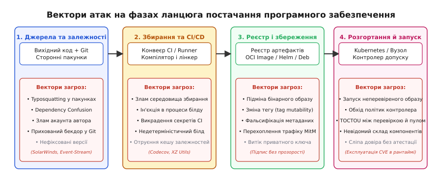
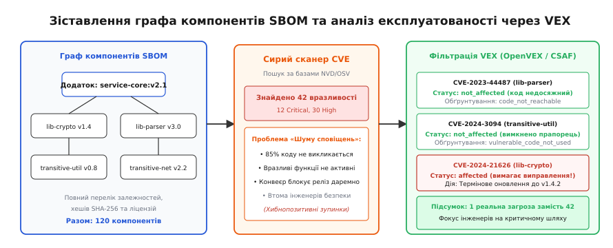
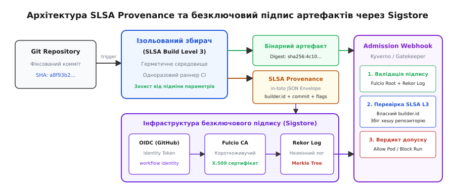

# Безпека ланцюга постачання ПЗ: SBOM, SLSA та підпис артефактів

<preknowlist>
- [Криптографічні гешфункції](topic:programming/cryptographic-hash) — властивості односторонніх функцій, стійкість до колізій і пошуку прообразу.
- [Межі довіри](topic:programming/trust-boundaries) — розподіл системи на зони з різним рівнем безпеки та валідація даних на перетинах меж.
- [Принцип найменших привілеїв](topic:programming/least-privilege) — надання лише необхідного мінімуму прав та заборона дій за замовчуванням (*deny-by-default*).
- [Секрети й ротація](topic:programming/secrets-management) — безпечне зберігання токенів доступу, підписувальних ключів і короткоживучих сертифікатів.
- [Політики як код](topic:programming/policy-as-code) — декларативний опис правил безпеки та їх автоматична перевірка точками ухвалення рішень (PDP).
- [Аудит-лог як вузол](topic:programming/audit-logging) — незмінна фіксація записів подій для доведення невідворотності перевірки.
</preknowlist>

У грудні 2020 року інженери з кібербезпеки виявили, що офіційне оновлення платформи моніторингу мереж SolarWinds Orion містило витончений бекдор Sunburst. Понад вісімнадцять тисяч корпоративних клієнтів, серед яких були міністерства та ключові фінансові установи, завантажили й розгорнули шкідливий компонент. Найбільш показовим фактом інциденту було те, що вихідний код у приватному репозиторії Git залишався абсолютно чистим: розробники проходили обов'язкові взаємні перевірки змін, статичні аналізатори не фіксували підозрілих патернів, а згенерована динамічна бібліотека `SolarWinds.Orion.Core.BusinessLayer.dll` мала дійсний цифровий підпис офіційного сертифіката компанії. Зловмисники не зламували систему контролю версій: вони отримали доступ до внутрішнього сервера збирання, де фоновий процес перехоплював виклики компілятора `MSBuild`, на льоту вставляв шкідливі інструкції в тимчасові файли коду за секунди до генерації байткоду й миттєво видаляв усі сліди після завершення компіляції.

Цей злам оголив фундаментальну слабкість класичної парадигми безпеки програмного забезпечення. Роками індустрія зосереджувалася на аналізі вихідного коду: перевірці синтаксису, пошуку помилок керування пам'яттю, контролі прав доступу до репозиторію та статичному тестуванні (SAST). Проте готовий цифровий продукт є результатом складної інженерної трансформації, у якій вихідний код поєднується зі сторонніми бібліотеками, компілюється інструментами сторонніх розробників, пакується у контейнери на хмарних раннерах і передається через ланцюжок реєстрів. Якщо хоча б одна ланка цієї трансформації скомпрометована, перевірений і безпечний вихідний код гарантовано перетворюється на отруєний бінарний артефакт.

Захист цього шляху становить сутність безпеки ланцюга постачання програмного забезпечення (англ. *Software Supply Chain Security*; лат. *provenire* — походити, виникати). Вона вимагає безумовного підтвердження чотирьох властивостей: повної ідентифікації кожного вхідного компонента (SBOM), неспростовного доведення походження та умов збирання бінарного файлу (SLSA Provenance), криптографічного засвідчення автентичності артефактів без ризику витоку довгоживучих ключів (Sigstore) та автоматичного примусового контролю цих гарантій на етапі розгортання в робочому середовищі.

---

### Анатомія ланцюга та класифікація векторів атак

Щоб зрозуміти, де виникають уразливості, необхідно простежити повний шлях перетворення абстрактної ідеї інженера на процес, запущений у виробничому кластері. Сучасний ланцюг постачання складається з п'яти послідовних фаз, кожна з яких має власні специфічні вектори компрометації.


*Вектори атак на різних етапах ланцюга постачання: компрометація джерел, складального конвеєра, реєстру артефактів та середовища виконання.*

#### 1. Фаза вихідного коду та авторів
Перша ланка — це робочі станції розробників і система контролю версій Git. Зловмисник може діяти безпосередньо через облікові записи інженерів або шляхом маніпуляцій із репозиторієм:
- **Злам облікового запису або соціальна інженерія**: Захоплення токенів доступу розробника (через фішинг чи витік із локальних конфігурацій) дозволяє додавати шкідливі комміти в основну гілку в обхід процесів рецензування.
- **Атаки на сторонні відкриті бібліотеки (Upstream Poisoning)**: Зловмисник роками робить корисні внески у відкритий проєкт, втирається в довіру до автора, отримує права супроводжувача (*maintainer*) і згодом впроваджує замаскований бекдор.

#### 2. Фаза резолюції залежностей
Сучасні програми рідко пишуться з нуля: до 80–90% обсягу коду типового вебсервісу становлять зовнішні пакунки з відкритих екосистем (NPM, PyPI, Maven, Crates.io, Go modules). На цьому стику виникають два поширені класи атак:
- **Тайпосквотинг (англ. *Typosquatting*)**: Публікація шкідливого пакунка з назвою, схожою на популярну бібліотеку (наприклад, `cross-env` проти `crossenv` або `loadsh` проти `lodash`), розрахована на випадкову одруківку інженера під час встановлення залежностей.
- **Плутанина залежностей (англ. *Dependency Confusion*)**: Якщо внутрішній проєкт компанії використовує приватну бібліотеку з назвою `@internal/payment-utils` версії `1.0.0`, зловмисник реєструє в публічному реєстрі (NPM або PyPI) однойменний пакунок із версією `99.0.0`. Менеджери пакунків, налаштовані без жорсткої ізоляції просторів імен, за замовчуванням завантажують версію з найвищим номером із публічного джерела.

#### 3. Фаза складального середовища (CI/CD та Build Pipeline)
Навіть якщо вихідний код і всі залежності бездоганні, зловмисник може атакувати саме середовище збирання:
- **Компрометація раннерів (*Compromised Runners*)**: Якщо конвеєр CI/CD виконує кроки збирання у спільних або неізольованих контейнерах, шкідливий скрипт із попереднього завдання може залишити резидентний процес, підмінити системний компілятор, інструменти лінкування чи змінні оточення.
- **Викрадення секретів збирання**: Багато конвеєрів мають доступ до ключів розгортання в хмарі, паролів баз даних або сертифікатів підпису. Небезпечні скрипти тестування можуть прочитати ці змінні оточення та надіслати їх на зовнішній сервер.

#### 4. Фаза реєстрів артефактів
Після компіляції скомпільований бінарний файл, архів або образ OCI передається до реєстру зберігання:
- **Мутабельність тегів (англ. *Tag Mutability*)**: Тег образу контейнера (наприклад, `service:v1.2.0` або `latest`) не є криптографічною гарантією. Зловмисник із правами запису в реєстр може перезаписати образ під тим самим тегом, підмінивши бінарний вміст без зміни номера версії в маніфестах розгортання.
- **Підробка метаданих**: Зміна конфігураційного маніфесту безпосередньо у сховищі артефактів без відповідного перекомпілювання коду.

#### 5. Фаза розгортання та виконання
Остання ланка — завантаження артефакту на цільовий сервер або у кластер Kubernetes:
- **Запуск неперевірених артефактів**: Відсутність обов'язкової криптографічної перевірки підпису дає змогу адміністратору чи зловмиснику вручну запустити будь-який сторонній образ.
- **Гонка часу перевірки та використання (англ. *Time-of-Check to Time-of-Use*, TOCTOU)**: Система безпеки перевіряє образ під час створення маніфесту пода, але до моменту фактичного витягування образу з реєстру вузол кластера завантажує підмінений шар.

Детальніше про те, як ці вектори еволюціонували від концептуальної лекції Кена Томпсона про компіляторний бекдор 1984 року до складних тарбол-ін'єкцій сьогодення, викладено в [історії еволюції атак на ланцюг постачання від Томпсона до інциденту в XZ Utils](topic:programming/supply-chain-security/hist-supply-chain-attacks.md).

---

### Специфікація компонентів ПЗ (SBOM): За межами простих lock-файлів

Першим кроком до захисту ланцюга є точна інвентаризація всіх елементів, із яких складається готовий продукт. Цю задачу вирішує специфікація компонентів програмного забезпечення — SBOM (англ. *Software Bill of Materials*; за аналогією з виробничою відомістю деталей у машинобудуванні).

Часто виникає хибне враження, що файли блокування версій, такі як `package-lock.json` у Node.js, `go.sum` у Go або `poetry.lock` у Python, уже є повноцінним описом компонентів. Це не так через три принципові обмеження:

1. **Екосистемна ізоляція**: Lock-файл описує лише бібліотеки однієї конкретної мови програмування. Він повністю ігнорує базовий шар операційної системи контейнера (наприклад, пакети `glibc`, `openssl`, `libcurl` в образі Debian чи Alpine), версію системного компілятора та допоміжні утиліти.
2. **Відсутність інформації про збирання**: У маніфесті пакетного менеджера немає даних про те, якими прапорцями оптимізації компілювався бінарний файл, які системні заголовки використовувалися та хто саме ініціював процес збирання.
3. **Несумісність ідентифікаторів**: Кожна екосистема використовує власний синтаксис назв, що унеможливлює наскрізний пошук за глобальними базами вразливостей (CVE/NVD) без складних перехідників.

Справжній SBOM — це стандартизований, машиннозчитуваний документ, який описує повне дерево транзитивних залежностей, хеші файлів, ліцензійні умови та взаємозв'язки між компонентами всієї системи.

```
       [ Застосунок: payment-service:v2.0 ]
                    │
       ┌────────────┴────────────┐ (прямі залежності)
       ▼                         ▼
 [ lib-auth:v1.3 ]         [ lib-crypto:v2.1 ]
       │                         │
       ▼ (транзитивна)           ▼ (транзитивна)
[ lib-jwt:v0.9 ]           [ lib-bn:v1.0 ]
       │
       ▼ (системний рівень)
[ libssl.so.3 (Debian package: 3.0.11-1) ]
```

#### Стандарти формату: SPDX та CycloneDX
В індустрії утвердилися два відкриті формати опису SBOM:

1. **SPDX (англ. *Software Package Data Exchange*, ISO/IEC 5962:2021)**: Створений під егідою Linux Foundation. Історично фокусувався на ліцензійній чистоті відкритого ПЗ, але в сучасних версіях (SPDX 2.3 та 3.0) містить повний апарат для опису безпеки, хешів файлів та графів залежностей.
2. **OWASP CycloneDX**: Створений спільнотою OWASP спеціально для задач кібербезпеки та автоматизованого аналізу ризиків. Відзначається компактною структурою у форматах JSON та XML, нативною підтримкою апаратних компонентів (HBOM), сервісів (SaaS-BOM) та вбудованою інтеграцією зі стандартами обміну даними про вразливості.

#### Ідентифікація компонентів: PURL та CPE
Для однозначної прив'язки компонентів до баз даних уразливостей SBOM використовує два типи універсальних ідентифікаторів:

- **PURL (англ. *Package URL*)**: Канонічний текстовий рядок, який стандартизує синтаксис опису пакетів незалежно від платформи:
  `pkg:golang/github.com/gin-gonic/gin@v1.9.1`
  `pkg:deb/debian/libssl3@3.0.11-1~deb12u2?arch=amd64`
  `pkg:npm/%40angular/animation@12.3.1`
- **CPE (англ. *Common Platform Enumeration*)**: Структурований формат, розроблений NIST, що традиційно використовується у базі National Vulnerability Database (NVD):
  `cpe:2.3:a:openssl:openssl:3.0.11:*:*:*:*:*:*:*`

Генерація SBOM зазвичай виконується автоматично на етапі CI/CD за допомогою спеціалізованих інструментів аналізу (Syft, Trivy, cdxgen), які досліджують файлову систему скомпільованого контейнера, витягують списки встановлених пакетів ОС і мовних залежностей та обчислюють їхні контрольні суми SHA-256.

---

### Обмін даними про експлуатованість уразливостей (VEX)

Впровадження автоматичного сканування SBOM породжує нову критичну проблему: **шум сповіщень (*alert fatigue*)**. 

Коли сканер безпеки зіставляє повний список із п'ятисот компонентів контейнера з базою відомих уразливостей CVE, він часто знаходить десятки вразливостей категорій *High* та *Critical*. За замовчуванням політика безпеки вимагає зупинити розгортання релізу. Проте детальний інженерний аналіз показує, що 85–90% цих знахідок є хибнопозитивними з точки зору реальної загрози для цього конкретного застосунку:
- Уразливий фрагмент коду міститься у функції, яка взагалі ніколи не імпортується та не викликається в проекті (*dead code*);
- Уразливість вимагає специфічного прапорця конфігурації, який у цьому сервісі вимкнено;
- Перед уразливою бібліотекою стоїть проміжний шар валідації, який відфільтровує шкідливе корисне навантаження (*payload*).

Зупинка розгортання через неексплуатовані вразливості паралізує команду розробки. Щоб відокремити формальну наявність уразливого коду від реальної можливості його атаки, створено стандарт **VEX (англ. *Vulnerability Exploitability eXchange*)**.


*Зіставлення специфікації компонентів SBOM та фільтрації експлуатованості VEX для відсікання хибнопозитивних сповіщень сканерів.*

VEX — це структурований машинозчитуваний документ (у форматах OpenVEX або CSAF), який публікується авторами програмного забезпечення або командою безпеки разом з артефактом. VEX-документ прив'язується до конкретної версії продукту й чітко декларує один із чотирьох статусів для кожної виявленої CVE:

1. **`not_affected` (не впливає)**: Компонент присутній у бінарному дереві, але уразливість не може бути використана. Цей статус вимагає обов'язкового зазначення стандартизованого обґрунтування (*justification*):
   - `code_not_reachable` — уразливий метод чи модуль не має шляхів виконання з точки входу програми;
   - `vulnerable_code_cannot_be_controlled_by_adversary` — вхідні дані, що надходять до вразливого блоку, не контролюються користувачем;
   - `inline_mitigations_already_exist` — захисні заходи реалізовані у навколишньому коді;
   - `vulnerable_code_not_in_execute_path` — функціонал заблокований архітектурно.
2. **`affected` (впливає)**: Уразливість реальна, шлях атаки відкритий. Потрібні негайні дії (оновлення чи блокування).
3. **`fixed` (виправлено)**: Уразливість була усунена у цій збірці артефакту.
4. **`under_investigation` (досліджується)**: Аналіз триває; тимчасовий статус для нових вразливостей нульового дня.

Поєднання SBOM і VEX перетворює «сліпе» блокування на точковий інженерний аналіз: сканер безпеки зіставляє граф компонентів, виявляє вразливості, накладає VEX-фільтр і зупиняє розгортання лише тоді, коли виявлено статус `affected` або відсутнє формальне обґрунтування для критичної CVE.

---

### Криптографічний підпис та безключова інфраструктура Sigstore

Наявність SBOM і VEX-документів має сенс лише тоді, коли можна гарантувати, що ці файли та сам бінарний артефакт не були модифіковані зловмисником після їхнього створення. Традиційним інструментом забезпечення цілісності є асиметричний цифровий підпис (грец. *κρυπτός* — прихований + *γράφω* — пишу).

Проте класична модель підпису (на базі PGP/GPG ключів або довгоживучих X.509 сертифікатів) на практиці довела свою непридатність для автоматизованих конвеєрів збирання через дві системні вади:

1. **Проблема зберігання секретних ключів**: Якщо для підпису контейнера в CI/CD потрібен приватний ключ, цей ключ записується в налаштування репозиторію (*Secrets*). Будь-який розробник із правами на зміну конфігурації конвеєра або зловмисник, що використав уразливість у тестовому скрипті, може викрасти цей ключ і безперешкодно підписувати шкідливі бінарні файли від імені організації.
2. **Проблема відкликання ключів (*Key Revocation*)**: У разі компрометації закритого ключа відкликати його через традиційні списки відкликання (CRL/OCSP) надзвичайно складно. Неможливо достовірно встановити, чи був конкретний артефакт підписаний легітимно до моменту крадіжки ключа, чи вже зловмисником після неї.

Для вирішення цієї кризи проєкт з відкритим кодом **Sigstore** (створений за участі Linux Foundation, Google та Red Hat) запропонував концепцію **безключового підпису (*Keyless Signing*)**.

```
[ CI/CD Runner: GitHub Actions ]
       │
       │ 1. Генерація одноразової пари ключів (ECDSA) в пам'яті
       │ 2. Отримання OIDC Token (ідентичність: repo, workflow, commit)
       ▼
 [ Fulcio CA (Короткоживучий засвідчувальний центр) ]
       │
       │ 3. Перевірка OIDC токена
       │ 4. Випуск сертифіката X.509 (термін дії: 10 хвилин)
       ▼
 [ Клієнт підпису: Cosign ]
       │
       │ 5. Підпис гешу артефакту
       │ 6. Публікація запису про підпис
       ▼
 [ Rekor Transparency Log (Незмінний Merkle Tree журнал) ]
       │
       │ 7. Повернення криптографічної квитанції (SET)
       ▼
 [ Знищення приватного ключа з пам'яті раннера ]
```

Архітектура Sigstore базується на взаємодії трьох незалежних вузлів:

#### 1. Fulcio — сертифікаційний центр короткоживучих ключів
Замість постійного закритого ключа конвеєр збирання генерує нову пару асиметричних ключів безпосередньо в оперативній пам'яті для кожної операції збирання. Далі раннер запитує токен автентифікації OpenID Connect (OIDC) у свого хмарного провайдера (наприклад, GitHub Actions, GitLab CI або Google Cloud). Цей токен містить криптографічно засвідчені твердження (*claims*): URL репозиторію, назву гілки, SHA комміту та назву файлу конвеєра.

Раннер передає OIDC-токен і відкритий ключ до центру сертифікації **Fulcio**. Fulcio валідує токен і випускає цифровий сертифікат X.509, у якому відкритий ключ прив'язується не до абстрактного імені особи, а безпосередньо до OIDC-ідентичності робочого процесу CI/CD. Головна особливість сертифіката Fulcio — його **екстремально короткий термін дії (10–15 хвилин)**.

#### 2. Rekor — незмінний журнал прозорості підписів
Щойно артефакт підписано одноразовим ключем, підпис, сертифікат і геш артефакту записуються до загальнодоступного журналу **Rekor**. 

Rekor побудований як криптографічне дерево Меркла (*Merkle Tree*, аналогічно до систем Certificate Transparency). Записи в Rekor можна лише додавати (*append-only*); змінити або видалити збережений запис математично неможливо без порушення кореневого гешу дерева. У відповідь на публікацію Rekor повертає підписану квитанцію про внесення в журнал — Signed Entry Timestamp (SET).

#### 3. Знищення ключа та процедура верифікації
Отримавши квитанцію від Rekor, раннер прикріплює сертифікат, підпис і квитанцію до артефакту в реєстрі (використовуючи утиліту `cosign`) і **негайно знищує приватний ключ із пам'яті**. Приватного ключа більше не існує в природі: його неможливо вкрасти, витягнути з бекапів чи скомпрометувати.

Як виконується верифікація через рік після завершення дії 10-хвилинного сертифіката? Клієнт перевірки (наприклад, валідатор у Kubernetes):
1. Перевіряє, що бінарний файл відповідає підпису;
2. Перевіряє за журналом Rekor, що цей підпис було зафіксовано саме в той короткий проміжок часу, коли сертифікат Fulcio був дійсним;
3. Зчитує з сертифіката дані OIDC і звіряє їх із білим списком дозволених репозиторіїв та гілок.

---

### Фреймворк SLSA: Рівні безпеки складального процесу

Сам по собі факт наявності цифрового підпису не гарантує безпеки програми: якщо зловмисник скомпрометував середовище збирання, він згенерує шкідливий артефакт, і система бездоганно підпише його легітимним ключем. 

Підпис засвідчує **автентичність джерела**, але не доводить **безпеку процесу**.

Щоб встановити стандартизовані критерії довіри до самого процесу збирання, консорціум OpenSSF розробив фреймворк **SLSA (англ. *Supply-chain Levels for Software Artifacts*, вимовляється як «сальса»)**.


*Ланцюжок гарантій SLSA та безключовий підпис: від фіксації комміту до перевірки незмінного журналу Rekor контрольними точками допуску.*

Головний документ SLSA — це **атестація походження (англ. *Provenance*; лат. *attestari* — засвідчувати)**. Це структурований документ у форматі in-toto, який фіксує:
- З якого саме репозиторію та точного гешу комміту було зібрано артефакт;
- Яка версія та ідентифікатор збирача (*Builder ID*) виконували компіляцію;
- Які зовнішні параметри та змінні оточення були передані процесу збирання;
- Повний список гешів усіх вхідних матеріалів і залежностей (*materials/resolvedDependencies*).

#### Специфікація рівнів збирання SLSA v1.0 (Build Track)

| Рівень SLSA | Вимоги до процесу збирання | Захист від загроз | Гарантії походження (Provenance) |
| :--- | :--- | :--- | :--- |
| **Build L1** | Автоматизоване збирання скриптом (не вручну на лептопі). | Фіксація помилок ручного копіювання файлів. | Базовий документ про вихідні джерела. Може генеруватися самим збирачем, не захищений від підробки. |
| **Build L2** | Використання розміщеного сервісу збирання (Hosted Build Service). | Захист від втручання локального розробника в процеси компіляції. | Атестація підписується безпосередньо сервісом збирання (наприклад, GitHub Hosted Runner), а не призначеним для користувача кодом. |
| **Build L3** | Повна ізоляція середовища збирання від користувача. Неможливість впливу коду на генерацію метаданих. | Захист від фальсифікації походження навіть у разі спроби шкідливого коду підмінити метадані в процесі білду. | Непідробна (*unforgeable*) атестація, згенерована захищеною площиною керування збирача. |

#### Герметичність та відтворюване збирання
Найвищим рівнем інженерних гарантій є досягнення двох властивостей процесу:

1. **Герметичне збирання (англ. *Hermetic Build*)**: Процес компіляції виконується в середовищі з повністю вимкненим доступом до зовнішньої мережі. Усі залежності, компілятори, бібліотеки та заголовки завантажуються заздалегідь, перевіряються за списком точних гешів SHA-256 і монтуються в ізольований контейнер у режимі «лише читання». Це унеможливлює динамічне завантаження шкідливого коду під час фази виконання `make` чи `npm install`.
2. **Відтворюване збирання (англ. *Reproducible Builds*)**: Інженерний стан складального конвеєра, коли незалежні повторні запуски процесу збирання на різних фізичних серверах із однакового комміту вихідного коду продукують **байт-у-байт ідентичні бінарні артефакти**. 

Для досягнення відтворюваності необхідно усунути всі джерела недетермінізму компіляції:
- Фіксація часових міток у бінарних заголовках (використання змінної `SOURCE_DATE_EPOCH` замість системного годинника);
- Сортування порядку обходу файлів у каталогах перед передачею лінкеру (файлові системи можуть повертати файли у випадковому порядку `readdir()`);
- Фіксація системної локалі та порядку розміщення секцій компілятором.

Повна структура службових полів і JSON-схема предикатів стандарту детально розібрані у [довідці специфікації предикатів SLSA Provenance v1.0 та атестацій in-toto](topic:programming/supply-chain-security/api-slsa-provenance.md).

---

### Точки контролю допуску в середовищі виконання (Admission Control)

Останній бар'єр захисту ланцюга постачання знаходиться безпосередньо перед виконанням бінарного файлу або розгортанням контейнера у виробничому кластері (наприклад, Kubernetes).

Якщо сервер розгортання сліпо виконує команду запуску образу, вся попередня робота з генерації SBOM, VEX та підписів втрачає практичний сенс. Для примусового дотримання правил використовують контролери допуску (англ. *Admission Controllers*, такі як Kyverno, Sigstore Policy Controller або Open Policy Agent / Gatekeeper).

```
   [ Запит: kubectl apply -f pod.yaml ]
                    │
                    ▼
     [ API Server (Kubernetes) ]
                    │
                    ▼ (Mutating/Validating Webhook)
     [ Контролер допуску: Kyverno / OPA ]
                    │
   ┌────────────────┴────────────────┐
   │ 1. Звірка Digest образу         │
   │ 2. Валідація підпису Cosign     │
   │ 3. Перевірка Rekor Log          │
   │ 4. Оцінка SLSA L3 Provenance    │
   │ 5. Фільтрація блокуючих CVE/VEX │
   └────────────────┬────────────────┘
                    │
           ┌────────┴────────┐
   (Allow) │                 │ (Deny)
           ▼                 ▼
   [ Запуск Pod у K8s ]   [ 403 Forbidden: Помилка політики ]
```

#### Алгоритм роботи валідаційного вебхука:
1. **Резолюція гешу образу**: Контролер перехоплює запит на створення пода й замінює мутабельний тег (`image:v1.2.0`) на його точний криптографічний дайджест (`image@sha256:4c10a3...`), що запобігає атакам класу TOCTOU.
2. **Перевірка підпису через Sigstore**: Контролер звертається до реєстру, завантажує підпис і сертифікат, перевіряє квитанцію в Rekor та валідує відповідність кореневому сертифікату Fulcio.
3. **Оцінка політики походження (SLSA Verification)**: Контролер аналізує вкладену атестацію in-toto:
   - Чи збігається `builder.id` із довіреним пулом корпоративних збирачів?
   - Чи відповідає `source.uri` офіційному репозиторію організації?
   - Чи зібрано образ із захищеної гілки `main` або релізного тегу?
4. **Контроль безпеки уразливостей (SBOM + VEX)**: Перевіряється наявність актуального SBOM та відсутність у ньому вразливостей зі статусом `affected` рівня *Critical*.

Якщо хоча б одна з цих умов не виконується, вебхук повертає жорстку відмову, і под ніколи не запускається на робочих вузлах кластера. Практичний приклад побудови такого автоматизованого конвеєра валідації наведено в [інженерному проєкті верифікації атестацій та підписів артефактів](topic:programming/supply-chain-security/proj-artifact-attestation.md).

---

### Типові пастки, крайові випадки та ціна впровадження

Побудова захищеного ланцюга постачання вимагає чіткого розуміння архітектурних компромісів та обмежень технологій:

#### 1. Ілюзія безпеки: Підписаний шкідливий код
Найнебезпечніша помилка менеджменту — вважати, що наявність підпису Sigstore або рівня SLSA L3 автоматично гарантує відсутність уразливостей у додатку. Підпис підтверджує лише те, що **бінарний файл був зібраний саме з комміту `X` вказаним конвеєром `Y`**. Якщо інженер у комміті `X` навмисно чи випадково написав уразливий SQL-запит або залишив жорстко закодований пароль, SLSA чесно зафіксує це походження й підпише шкідливий артефакт. Безпека ланцюга повинна працювати виключно в тандемі з суворими правилами рецензування коду (правило двох пар очей, захист гілок) та динамічним аналізом.

#### 2. Статична проти динамічної лінковки в контексті SBOM
У середовищах із динамічним зв'язуванням (наприклад, C/C++ застосунки, що покладаються на `.so` бібліотеки хостової ОС), SBOM, згенерований на етапі компіляції, фіксує лише версії заголовків і бібліотек складального середовища. Якщо на цільовому сервері системний адміністратор оновлює версію `libssl.so` через `apt upgrade`, фактичний рантайм-стан відхиляється від статичного SBOM. Статичне зв'язування (Go, Rust, або C/C++ зі статичними бібліотеками) усуває цей розрив, оскільки весь бінарний код інкапсулюється в артефакт, але вимагає повної перекомпіляції застосунку для закриття будь-якої вразливості в спільних бібліотеках.

#### 3. Надійність OIDC-провайдера
У безключовій моделі Sigstore критичною точкою відмови стає провайдер ідентичності (GitHub, GitLab, Google, Okta). Якщо зловмисник отримує права адміністратора в обліковому записі організації на GitHub, він може налаштувати власний шкідливий workflow, отримати легітимний OIDC-токен від GitHub Actions і згенерувати цілком валідний сертифікат Fulcio. Тому політики контролерів допуску повинні перевіряти не лише факт підпису через Sigstore, але й точні параметри: конкретний шлях до файлу конвеєра (наприклад, `.github/workflows/release.yml`) та обмеження на конкретні хеші коммітів.

> 🔧 **Навіщо це.** Безпека ланцюга постачання перетворює розробку з моделі сліпої віри в модель безумовної криптографічної перевірки. Вона позбавляє організацію страху перед оновленням сотень сторонніх залежностей, захищає від внутрішніх атак на складальні конвеєри та забезпечує юридично неспростовний аудит походження кожної строчки коду, що потрапляє на виробничі сервери.
