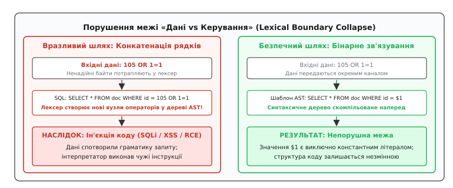
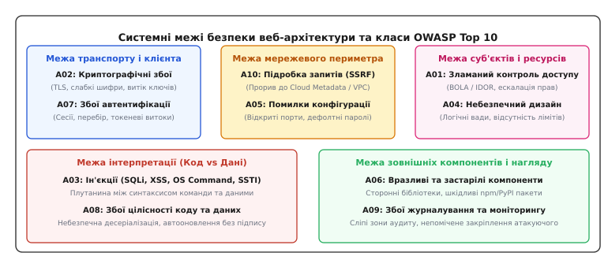
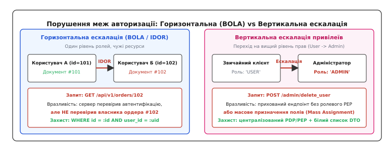
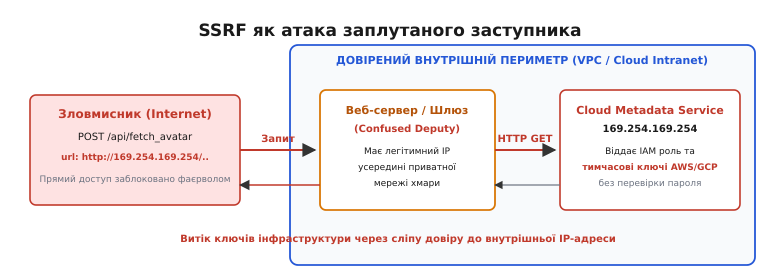

# Класи веб-вразливостей: OWASP Top 10 та порушення меж безпеки

<preknowlist>
- [Межі довіри](topic:programming/trust-boundaries) — концепція розділення підсистем із різними рівнями привілеїв.
- [Поверхня атаки](topic:programming/attack-surface) — сукупність усіх доступних ззовні точок входу та інтерфейсів.
- [Моделювання загроз](topic:programming/threat-modeling) — систематичний аналіз шляхів компрометації системи.
- [Найменші привілеї й deny-by-default](topic:programming/least-privilege) — надання лише мінімально необхідних прав за замовчуванням.
- [Криптографічні гешфункції](topic:programming/cryptographic-hash) — незворотні математичні перетворення для захисту цілісності даних.
- [Захист від повтору (replay)](topic:programming/replay-protection) — запобігання повторному використанню валідних перехоплених повідомлень.
</preknowlist>

У системі електронної комерції автентифікований користувач із чинним ідентифікатором сесії переглядає рахунок-фактуру за адресою `/api/v1/invoices/84021`. Змінивши в адресному рядку браузера лише одну цифру на `/api/v1/invoices/84020`, він миттєво отримує повний податковий звіт, банківські реквізити та домашню адресу зовсім іншого клієнта. У цей момент жоден мережевий пакет не був підроблений на рівні TCP, криптографічний протокол TLS 1.3 відпрацював бездоганно, сесійний токен JWT успішно пройшов перевірку підпису, а серверний процес не зазнав виходу за межі виділеної пам'яті. Катастрофа конфіденційності сталася виключно через те, що бекенд перевірив факт наявності облікового запису, але не перевірив межу власності між суб'єктом та запитуваним ресурсом.

Цей інцидент розкриває головний закон безпеки прикладного рівня: **програмна вразливість — це завжди дефект або повне руйнування системної межі довіри**. Початківці часто уявляють хакерські атаки як складне математичне зламування шифрів або низькорівневу маніпуляцію машинним кодом. На практиці понад 90% успішних атак на веб-застосунки експлуатують прості логічні розриви між тим, що розробник неявно припускав, і тим, як розподілена система інтерпретує вхідний потік байтів насправді.

## Анатомія межі безпеки: два фундаментальні закони веб-захисту

Веб-застосунок за своєю природою є багатоланковим конвеєром обробки неструктурованих текстових або бінарних потоків: клієнтський браузер надсилає HTTP-запит через мережу, проксі-сервер або шлюз маршрутизує його до сервісу застосунку, той звертається до реляційної СУБД чи стороннього мікросервісу і повертає динамічно скомпільовану відповідь у форматі JSON або HTML.

У цьому ланцюжку діють дві головні площини поділу:

1. **Межа між керуванням і даними (Control Plane vs Data Plane):** процесори, синтаксичні аналізатори баз даних (SQL), інтерпретатори командних оболонок операційної системи та браузерні DOM-рушії повинні чітко розрізняти, де закінчується незмінна синтаксична інструкція програми і де починаються пасивні користувацькі дані.
2. **Межа між суб'єктом і об'єктом (Subject vs Object Authority):** кожен запит до сховища даних або виконання бізнес-операції повинні звірятися з моделлю повноважень — чи має поточний суб'єкт (автентифікований користувач, сервісний процес) явне право на маніпуляцію цим конкретним екземпляром сутності.


*Порушення межі між кодом та даними: небезпечна конкатенація змінює синтаксичне дерево AST (зліва), тоді як бінарна параметризація фіксує структуру виразу наперед (справа).*

Коли руйнується перша межа — виникає сімейство **ін'єкцій** (Injection): інтерпретатор приймає чужі дані за власні команди. Коли руйнується друга межа — виникає **зламаний контроль доступу** (Broken Access Control) або атака **заплутаного заступника** ([confused deputy](topic:programming/confused-deputy)).

Щоб систематизувати ці типи руйнувань і дати інженерам єдину мову аналізу ризиків, міжнародний консорціум Open Web Application Security Project створив стандарт **OWASP Top 10** — узгоджену таксономію (грец. *taxis* — «порядок» + *nomos* — «закон») найбільш критичних класів ризиків для безпеки веб-застосунків. Про те, як цей список розвивався від наївного переліку багів раннього вебу до сучасної емпіричної моделі ризиків, розповідає [історичний нарис еволюції OWASP Top 10](topic:programming/web-vulnerability-classes/hist-owasp-evolution.md).


*Систематизація категорій OWASP Top 10 за архітектурними межами системи, які вони компрометують.*

---

## Клас 1: Зламаний контроль доступу (A01: Broken Access Control)

Контроль доступу (англ. *access control*, від лат. *auctoritas* — «право, влада») — це процедура, за якою система гарантує, що користувач діє суворо в межах призначених йому повноважень. За статистикою OWASP, дефекти авторизації є найпоширенішою загрозою сучасного вебу, охоплюючи понад 94% протестованих додатків.


*Горизонтальна ескалація (BOLA/IDOR) між користувачами одного рангу та вертикальна ескалація привілеїв до ролі адміністратора.*

### Горизонтальна ескалація (BOLA / IDOR)
Небезпечне пряме посилання на об'єкт (Insecure Direct Object Reference, IDOR), або порушення авторизації на рівні об'єктів (Broken Object Level Authorization, BOLA), виникає тоді, коли сервер використовує наданий клієнтом ідентифікатор без перевірки права власності:

```
Запит: GET /api/v2/messages/10852
Серверний код (вразливий):
Message msg = db.find(Message.class, id);
return msg.toJson();
```

Сервер сліпо довіряє числу `10852`. Оскільки користувач легітимно автентифікований у системі, сесійний фільтр пропускає запит, а контролер повертає приватне листування сторонньої людини. 

Захист полягає у зв'язуванні запиту з контекстом поточного суб'єкта (англ. *scope-bound query*):
```sql
SELECT * FROM messages WHERE id = :id AND (sender_id = :user_id OR recipient_id = :user_id);
```

### Порушення авторизації на рівні функцій (BFLA) та вертикальна ескалація
Вертикальна ескалація (лат. *scala* — «сходи») відбувається, коли звичайний користувач отримує доступ до функцій із вищими привілеями (наприклад, панелі адміністратора):

- **Захист через невідомість (Security through obscurity):** приховування кнопки «Видалити користувача» в клієнтському інтерфейсі (UI) без перевірки ролі на кінцевому серверному маршруті `POST /api/admin/users/delete`. Будь-який запит через консоль розробника або cURL успішно виконує операцію.
- **Підміна HTTP-дієслів (HTTP Verb Tampering):** наївний фільтр безпеки налаштований на блокування запитів `POST /admin/settings` для неадміністраторів, але конфігурація не враховує методи `PUT`, `PATCH` або `GET`, які бекенд-фреймворк обробляє тим самим контролером.
- **Масове призначення атрибутів (Mass Assignment / Over-posting):** сліпе перенесення тіла JSON-запиту в модель бази даних. Якщо зловмисник додасть поле `{"is_admin": true, "role": "superuser"}` під час оновлення свого публічного профілю `PUT /api/profile`, наївний ORM автоматично запише нові привілеї в таблицю облікових записів.

### Мультитенентна ізоляція (Tenant Isolation)
У корпоративних SaaS-платформах критичною є ізоляція між різними компаніями-клієнтами (орендарями, tenants). Витік ідентифікатора однієї організації в запит іншої створює катастрофічний комплаєнс-інцидент.

Стратегії ізоляції на рівні бази даних:
1. **Захист на рівні рядків (Row-Level Security, RLS):** у PostgreSQL створюється системна політика безпеки, яка автоматично додає фільтр `tenant_id = current_setting('app.current_tenant')` до кожного запиту на рівні ядра СУБД, унеможливлюючи витік даних навіть у разі помилки в прикладному коді.
2. **Окремі схеми або бази даних (Schema-per-tenant):** фізичний розподіл з'єднань, де пул підключень обирається динамічно за піддоменом або ідентифікатором організації.

### Архітектура PEP / PDP
Для запобігання дефектам контролю доступу використовують розділення на точку ухвалення рішень (Policy Decision Point, PDP) та точку застосування політики (Policy Enforcement Point, PEP), детально розглянуті в концепції [Політики як код](topic:programming/policy-as-code) та принципі [Найменші привілеї й deny-by-default](topic:programming/least-privilege).

> 🔧 **Навіщо це.** Авторизація ніколи не повинна реалізовуватися розрізненими блоками `if (user.role == 'admin')` всередині кожного контролера. Централізований інтерцептор на рівні шлюзу та перевірка власника на рівні репозиторію гарантують, що додавання нового API-ендпоінта не створить діру через забутий рядок перевірки.

---

## Клас 2: Ін'єкції та плутанина інтерпретатора (A03: Injection)

Ін'єкція (лат. *injectio* — «упорскування, введення») — це клас дефектів, за яких вхідний потік даних змінює синтаксичну структуру командного виразу в інтерпретаторі.

### Механізм колапсу синтаксичного дерева (AST)
Будь-який інтерпретатор (SQL-сервер, Bash, браузерний HTML-парсер, рушій шаблонів Jinja/Twig) працює у два етапи:
1. **Лексичний аналіз (Lexing):** розбиття тексту на токени (ключові слова, оператори, ідентифікатори, літерали).
2. **Синтаксичний аналіз (Parsing):** побудова абстрактного синтаксичного дерева (Abstract Syntax Tree, AST), яке визначає порядок виконання операцій.

Розглянемо вразливий SQL-запит, створений через пряму конкатенацію (лат. *concatenatio* — «зчеплення ланцюгом»):
```sql
"SELECT * FROM users WHERE email = '" + user_input + "' AND password_hash = '" + pass_hash + "'"
```

Якщо `user_input` містить рядок `admin@corp.com' --`, лексичний аналізатор бачить символ одинарної лапки `'` не як частину адреси електронної пошти, а як **керівний термінатор рядкового літерала**. Наступні символи `--` сприймаються як початок коментаря SQL.

У результаті синтаксичне дерево змінюється:
```
               [SELECT]
              /        \
          [users]    [WHERE]
                        |
                     [EQUALS]
                     /      \
                 [email]  ['admin@corp.com']
```

Гілка перевірки пароля взагалі видаляється з дерева AST. Інтерпретатор виконує запит, що повертає запис адміністратора без будь-якої перевірки пароля.

### Параметризація проти санітизації
Спроби видалити небезпечні символи за чорними списками (наприклад, вирізати лапки або ключове слово `UNION`) завжди зазнають поразки через складність правил кодування та вкладеність граматик.

Єдиним надійним захистом є **бінарне зв'язування параметрів (Prepared Statements)**:
1. Клієнт надсилає текст запиту із заповнювачами (placeholders): `SELECT * FROM users WHERE email = ? AND password_hash = ?`.
2. СУБД парсить запит і фіксує дерево AST. Структура дерева стає константною.
3. Клієнт надсилає масив значень параметрів окремим бінарним повідомленням по мережі.

СУБД поміщає отримані байти строго у вузли листків дерева як непрозорі значення. Навіть якщо рядок містить сотню лапок та символів коментарів, граматика запиту не може змінитися за визначенням. Робочі приклади реалізації параметризації на C, C++, Python та TypeScript наведено в [практикумі захисту системних меж](topic:programming/web-vulnerability-classes/proj-boundary-validation.md).

### Ін'єкції команд операційної системи (OS Command Injection)
Вразливість виникає, коли бекенд виконує системну утиліту (наприклад, перетворення зображення через ImageMagick або виклик `ping`) через виклики C-функції `system()` або `popen()`, які під капотом запускають командний процесор `/bin/sh -c`.

Якщо ім'я файлу передається безпосередньо у рядок команди:

:::tabs
```c
char cmd[256];
snprintf(cmd, sizeof(cmd), "convert %s output.png", user_filename);
system(cmd);
```
```cpp
std::string cmd = "convert " + user_filename + " output.png";
std::system(cmd.c_str());
```
:::

Передача імені `image.jpg; rm -rf /` призведе до виконання команди видалення файлів із привілеями веб-сервера.

Захист: категорична відмова від викликів командного процесора оболонки. Замість `system()` необхідно використовувати функції прямого запуску процесів сімейства `execve()` або `posix_spawn()`, де ім'я виконуваного файлу та кожен аргумент передаються як окремі елементи масиву `argv[]`, виключаючи інтерпретацію символів розділення `;`, `&&`, `|`.

### Шаблонні ін'єкції (Server-Side Template Injection, SSTI)
У сучасних веб-фреймворках рушії шаблонів (Jinja2, Twig, Velocity, Freemarker) використовуються для генерації динамічних сторінок. Якщо користувацький текст конкатенується безпосередньо в текст самого шаблону замість передачі у вигляді змінної контексту:
```python
template = jinja2.Template(f"Hello {user_input}")  # ВРАЗЛИВО!
template.render()
```
Введення конструкції `{{ 7 * 7 }}` поверне `Hello 49`. Маніпулюючи рефлексією мови (наприклад, обходом ієрархії класів через `__class__.__mro__` у Python), зловмисник знаходить завантажений клас `subprocess.Popen` і отримує повне виконання довільного коду (Remote Code Execution, RCE) на сервері.

### XML External Entity (XXE)
Якщо веб-сервіс приймає XML-документи (SOAP, SAML, завантаження SVG/DOCX) і парсить їх зі стандартними налаштуваннями, зловмисник може оголосити зовнішню сутність:
```xml
<?xml version="1.0"?>
<!DOCTYPE root [
  <!ENTITY xxe SYSTEM "file:///etc/passwd">
]>
<user><name>&xxe;</name></user>
```
Під час парсингу XML-процесор зчитує системний файл `/etc/passwd` або виконує внутрішній HTTP-запит. Захист вимагає явного вимкнення обробки зовнішніх DTD (Document Type Definitions) у налаштуваннях парсера (`setFeature("http://apache.org/xml/features/disallow-doctype-decl", true)`).

### Міжсайтовий скриптинг (Cross-Site Scripting, XSS)
XSS — це ін'єкція коду JavaScript у контекст браузера жертви. Коли веб-додаток вбудовує неперевірені дані у відповідь HTML, браузер клієнта не може відрізнити легітимний скрипт сайту від шкідливого коду, доданого атакуючим.

Види XSS:
- **Збережений (Stored / Persistent):** шкідливий код записується в базу даних (наприклад, у коментар або відгук) і виконується у браузері кожного користувача, який відкриває цю сторінку.
- **Відбитий (Reflected):** скрипт передається в параметрах HTTP-запиту (наприклад, `?search=<script>...`) і повертається сервером у тексті відповіді.
- **На основі DOM (DOM-based):** вразливість виникає повністю на клієнті, коли JavaScript-код читає дані з ненадійного джерела (англ. *source*, наприклад `location.hash`) і передає їх у небезпечний приймач (англ. *sink*, наприклад `element.innerHTML = ...` або `eval()`).

Наслідки XSS включають крадіжку сесійних cookie (якщо відсутній прапорець `HttpOnly`), перехоплення натискань клавіш (keylogging), читання вмісту сторінки та виконання дій від імені користувача.

Захист вимагає контекстного екранування виведення (HTML entity encoding всередині тегів, JavaScript encoding всередині скриптових блоків) та впровадження політики захисту контенту CSP, параметри якої задокументовано в [довіднику захисних HTTP-заголовків](topic:programming/web-vulnerability-classes/api-security-headers.md).

---

## Клас 3: Заплутаний заступник і підробка запитів (A10: SSRF та CSRF)

Архітектурний патерн **заплутаного заступника** ([confused deputy](topic:programming/confused-deputy)) виникає, коли привілейована програма виконує дію за вказівкою менш привілейованого суб'єкта, помилково використовуючи власний авторитет замість авторитету замовника.

### Міжсайтова підробка запиту (Cross-Site Request Forgery, CSRF)
У класичній схемі [CSRF](topic:programming/csrf) заступником виступає браузер жертви. Якщо веб-сайт використовує неявну автентифікацію через сесійні cookie, браузер автоматично додає ці кукі до кожного запиту на цільовий домен — навіть якщо запит ініційовано сторонньою шкідливою сторінкою через прихований `<form action="https://bank.com/transfer" method="POST">`.

Контрзаходи:
1. Використання атрибута `SameSite=Strict` або `SameSite=Lax` для сесійних cookie.
2. Впровадження випадкових криптографічних анти-CSRF токенів (Synchronizer Token Pattern), що передаються в кастомних HTTP-заголовках або тілі запиту.

### Підробка запитів на стороні сервера (Server-Side Request Forgery, SSRF)
Якщо у CSRF заступником є клієнтський браузер, то в SSRF заплутаним заступником стає **сам серверний бекенд**.


*Механіка Server-Side Request Forgery: бекенд виступає невільним посередником, транслюючи запити зловмисника до закритої хмарної служби метаданих.*

Розглянемо веб-сервіс, що генерує попередній перегляд сторінок або завантажує аватари користувачів за URL-адресою:
```
POST /api/fetch_preview HTTP/1.1
Host: example.com
Content-Type: application/json

{"url": "http://169.254.169.254/latest/meta-data/iam/security-credentials/admin-role"}
```

Якщо сервер наївно викликає бібліотечний HTTP-клієнт над переданою адресою, запит надсилається з внутрішнього мережевого інтерфейсу сервера.

Наслідки SSRF:
1. **Викрадення хмарних секретів:** у середовищах AWS, Google Cloud, Azure адреса локального каналу `169.254.169.254` (Link-Local Metadata Service) віддає тимчасові токени доступу до хмарної інфраструктури без пароля для будь-якого процесу всередині віртуальної машини.
2. **Сканування внутрішнього периметра:** опитування приватних сервісів (Redis, Memcached, Elasticsearch), які часто розгортаються без автентифікації у розрахунку на захищеність внутрішньої мережі VPC.
3. **Читання локальних файлів:** якщо бібліотека підтримує схеми `file:///etc/passwd` або `gopher://`.

```
Схема небезпечного прориву периметра через SSRF:
[Зовнішній клієнт] 
       │ 1. POST url="http://169.254.169.254/..."
       ▼
[Публічний веб-сервер] (Має доступ до внутрішньої підмережі)
       │ 2. HTTP GET http://169.254.169.254/...
       ▼
[Служба метаданих AWS/GCP]
       │ 3. IAM токени доступу
       ▼
[Публічний веб-сервер]
       │ 4. Повертає тіло відповіді клієнту
       ▼
[Зловмисник] (Отримує повний доступ до хмарного кластера)
```

Захист від SSRF вимагає жорсткої санітизації URL, ручного резолвінгу IP та блокування з'єднань із приватними діапазонами (RFC 1918, RFC 3927, Loopback), а також блокування редиректів та примусового увімкнення служби метаданих IMDSv2 (вимагає попереднього отримання сесійного токена через HTTP PUT запит із заголовком `X-aws-ec2-metadata-token-ttl-seconds`).

---

## Клас 4: Криптографічні збої та витік таємниць (A02: Cryptographic Failures)

Ця категорія охоплює проблеми захисту конфіденційності (лат. *confidentia* — «довіра») та цілісності даних як під час передачі мережею (Data in Transit), так і під час збереження на дискових носіях (Data at Rest).

### Типові першопричини збоїв
1. **Передача чутливих даних у відкритому вигляді:** використання чистого HTTP або застарілих версій TLS 1.0/1.1 із вразливими наборами шифрів (RC4, 3DES).
2. **Ненадійне зберігання паролів:** хешування паролів швидкими алгоритмами загального призначення (MD5, SHA-1, SHA-256) без використання солі (salt) та фактора сповільнення. Такі хеші миттєво зламуються на графічних процесорах за допомогою райдужних таблиць. Для правильного збереження обов'язкові адаптивні функції [Зберігання паролів](topic:programming/password-hashing) (Argon2id, bcrypt, scrypt).
3. **Використання слабких генераторів псевдовипадкових чисел:** генерація сесійних ключів або токенів відновлення пароля через стандартні функції `rand()` чи `Math.random()`. Вони базуються на лінійних конгруентних генераторах (LCG), стан яких можна повністю обчислити за кількома попередніми значеннями. Необхідно використовувати виключно криптографічно стійкі генератори (CSPRNG — `/dev/urandom`, `getrandom()`, `crypto.getRandomValues()`).
4. **Небезпечні режими блокового шифрування:** використання режиму ECB (Electronic Codebook), де однакові блоки відкритого тексту перетворюються на ідентичні блоки шифротексту, зберігаючи структуру вихідних даних.

Керування життєвим циклом ключів шифрування та їхня автоматична ротація детально розглянуті в темі [Секрети й ротація](topic:programming/secrets-management).

---

## Клас 5: Небезпечний дизайн та дефекти конфігурації (A04 та A05)

Принципова відмінність категорії **Insecure Design** (Небезпечний дизайн) від решти класів полягає в тому, що це **архітектурний дефект, а не помилка реалізації в коді**. Ідеально написаний код без жодної помилки переповнення буфера чи синтаксичної ін'єкції буде вразливим, якщо сама логіка системи містить концептуальну ваду.

### Приклади небезпечного дизайну
- **Відсутність захисту від перебору та автоматизації:** скидання пароля через 6-значний цифровий код без обмеження швидкості спроб ([Rate Limiting](topic:programming/rate-limiting)). Зловмисник може перебрати всі 1 000 000 варіантів за кілька хвилин.
- **Стан гонки в бізнес-транзакціях:** одночасне надсилання десяти паралельних запитів на виведення коштів з рахунку, де залишок перевіряється до блокування рядка в базі даних.
- **Небезпечні процедури відновлення доступу:** використання статичних «секретних запитань» («Дівоче прізвище матері»), відповіді на які легко знайти у відкритих джерелах.

Подолання цих ризиків вимагає систематичного застосування [Моделювання загроз](topic:programming/threat-modeling) ще на етапі проектування архітектури до написання першого рядка коду.

### Помилки конфігурації (A05: Security Misconfiguration)
Дефекти конфігурації виникають на рівні інфраструктури, веб-серверів, хмарних сховищ та фреймворків:
- **Залишені облікові записи за замовчуванням:** стандартні паролі `admin/admin` або дефолтні секретні ключі підпису сесій у конфігураційних файлах фреймворку. Захист вимагає впровадження парадигми [Безпечні дефолти й відмова захисту](topic:programming/secure-defaults).
- **Детальні повідомлення про помилки (Stack Traces):** відображення повного дампу виклику функції з іменами файлів, версіями бібліотек та фрагментами SQL-запитів кінцевому користувачеві при виникненні винятку (Exception).
- **Надмірно дозвольні налаштування CORS (Cross-Origin Resource Sharing):** заголовок `Access-Control-Allow-Origin: *` у поєднанні з `Access-Control-Allow-Credentials: true`, що дає стороннім сайтам змогу зчитувати приватні дані автентифікованих користувачів.
- **Публічно доступні S3-бакети або панелі моніторингу:** незахищені інтерфейси Prometheus, Swagger UI чи `/actuator/env` у виробничому середовищі.

---

## Клас 6: Цілісність коду, десеріалізація та ланцюг постачання (A08 та A06)

Сучасні веб-додатки будуються на базі тисяч сторонніх модулів із відкритим вихідним кодом (npm, PyPI, Maven, NuGet, Crates.io). Вразливості в цьому шарі порушують межу довіри до середовища виконання.

### Небезпечна десеріалізація (Insecure Deserialization)
Серіалізація (лат. *series* — «ряд, ланцюг») — це процес перетворення об'єкта в пам'яті на послідовність байтів для збереження або передачі мережею. Десеріалізація відновлює об'єкт із цього потоку.

Якщо формат серіалізації підтримує збереження типів та інстанціювання довільних класів (наприклад, стандартний `pickle` у Python, `ObjectInputStream` у Java або `serialize()` у PHP), зловмисник може сформувати бінарний пакет, який під час розпакування виконає довільний код.

Механізм атаки на базі ланцюжків гаджетів (Gadget Chains):
1. Зловмисник знаходить класи, присутні в classpath програми (наприклад, у популярній бібліотеці Apache Commons Collections), які мають так звані «магічні методи» життєвого циклу (`readObject()`, `__destruct()`, `__wakeup()`).
2. Створюється вкладена ієрархія об'єктів, де виклик одного методу провокує виклик іншого, зрештою доходячи до виклику `Runtime.getRuntime().exec()`.
3. Бекенд десеріалізує отриманий потік байтів, вважаючи його звичайними даними сесії, і автоматично запускає шкідливий процес.

Захист: категорична відмова від поліморфної десеріалізації на користь чистих структурних форматів даних (JSON, Protocol Buffers), де вхідні байти інтерпретуються суворо як пари «ключ-значення» без створення виконуваних класів.

### Безпека ланцюга постачання (A06: Vulnerable Components)
Атаки на [Ланцюг постачання](topic:programming/supply-chain-security) полягають у компрометації легітимних бібліотек (Typosquatting, захоплення облікових записів розробників на GitHub/npm, впровадження шкідливого коду у відкриті репозиторії). 

Для нейтралізації ризику застосовують автоматичний аналіз складу програмного забезпечення (Software Bill of Materials, SBOM), фіксацію контрольних сум пакетів (lockfiles) та регулярний статичний аудит залежностей.

---

## Клас 7: Ідентифікація, сесії та моніторинг (A07 та A09)

### Збої ідентифікації та автентифікації (A07)
Автентифікація (грец. *authentikos* — «справжній, дійсний») встановлює особу користувача, а сесія підтримує цей стан між окремими HTTP-запитами.

Критичні дефекти:
- **Фіксація сесії (Session Fixation):** сервер не змінює ідентифікатор сесії після успішного входу користувача. Якщо зловмисник змусив жертву перейти за посиланням із наперед встановленим `session_id`, він отримує доступ до облікового запису відразу після авторизації жертви.
- **Вразливості токенів JWT (JSON Web Tokens):** використання слабких секретних ключів для алгоритму `HS256`, підтримка небезпечного алгоритму `none` (коли сервер приймає токен без підпису), або атака підміни алгоритму з асиметричного RSA на симетричний HMAC із використанням публічного ключа сервера як таємниці.
- **Відсутність захисту від підбору:** відсутність багатофакторної автентифікації (MFA) та захисту від атак заповнення облікових даних (Credential Stuffing), коли списки вкрадених паролів з інших сервісів автоматично перевіряються на цільовому сайті.

### Збої журналювання та моніторингу (A09)
За даними індустріальних досліджень, середній час від моменту компрометації системи до її виявлення (Dwell Time) становить понад 200 днів. Без належного [Аудит-лог як вузол](topic:programming/audit-logging) зловмисники можуть місяцями перебувати всередині інфраструктури, перехоплювати трафік та вивантажувати бази даних без жодної реакції з боку системних адміністраторів.

Вимоги до аудиту:
- Логування всіх подій відхилення авторизації, помилок входу та підозрілих винятків із фіксацією контексту (IP-адреса, User-Agent, ідентифікатор користувача, часова мітка).
- Захист самих журналів: заборона запису паролів та токенів у лог (Log Sanitization) та відправка подій на віддалений сервер у режимі append-only для захисту від стирання слідів після злому.

---

## Систематична матриця класів вразливостей та контрзаходів

| Клас OWASP Top 10 | Порушена системна межа | Першопричина вразливості | Основний архітектурний контрзахід |
| :--- | :--- | :--- | :--- |
| **A01: Broken Access Control** | Суб'єкт ↔ Об'єкт | Відсутність перевірки прав на конкретний ID сутності (BOLA/IDOR) | Scope-bound запити, централізовані PDP/PEP фільтри |
| **A02: Cryptographic Failures** | Транспорт / Сховище | Слабкі алгоритми, відсутність солі, відкритий протокол | TLS 1.3, Argon2id, шифрування AES-GCM / XTS, CSPRNG |
| **A03: Injection** | Керування ↔ Дані | Конкатенація рядків розмиває граматику виразу (AST) | Бінарні Prepared Statements, контекстне екранування |
| **A04: Insecure Design** | Бізнес-логіка | Відсутність моделювання загроз та обмеження операцій | Моделювання загроз (STRIDE), Rate Limiting, анти-гонки |
| **A05: Security Misconfiguration** | Системне середовище | Дефолтні паролі, увімкнений debug, помилки CORS/S3 | Автоматизовані Hardening-маніфести, заборона за замовчуванням |
| **A06: Outdated Components** | Ланцюг постачання | Непатчені та вразливі сторонні модулі / пакети | SBOM, автоматизований SCA аналіз, lockfiles |
| **A07: Identification Failures** | Межа ідентичності | Фіксація сесії, слабкі токени, вразливість до перебору | Ротація сесій при вході, MFA, `HttpOnly` `__Host-` cookies |
| **A08: Software/Data Integrity** | Цілісність коду | Поліморфна десеріалізація, непідписані оновлення | Суворі DTO схеми (JSON/Protobuf), цифрові підписи артефактів |
| **A09: Logging Failures** | Спостережуваність | Відсутність слідів вторгнення, сліпі зони аудиту | Append-only аудит-лог, SIEM інтеграція, сповіщення |
| **A10: SSRF** | Мережевий периметр | Сліпа довіра до внутрішніх IP (Confused Deputy) | Валідація IP після резолвінгу, IMDSv2, сегментація мережі |

---

## Архітектурний висновок: Перехід до нульової довіри (Zero Trust)

Головний урок еволюції веб-вразливостей полягає в усвідомленні того, що **периметра безпеки не існує**. Класична модель «захищеної корпоративної фортеці», де внутрішні сервіси вважаються надійними лише тому, що вони знаходяться за міжмережевим екраном, остаточно себе вичерпала.

Сучасна захищена веб-архітектура базується на парадигмі [Zero-trust](topic:programming/zero-trust) (Нульова довіра):
1. **Кожен запит розглядається як потенційно ворожий**, навіть якщо він надійшов від сусіднього мікросервісу всередині того самого кластера Kubernetes. Для взаємодії між сервісами використовується взаємна автентифікація mTLS (Mutual TLS) на базі стандартів SPIFFE/SPIRE.
2. **Автентифікація та авторизація виконуються на кожній межі ресурсу**, а не одноразово на вхідному API-шлюзі. Кожен сервіс самостійно перевіряє право суб'єкта на виконання конкретної операції над конкретним об'єктом.
3. **Дані та команди строго розділені на рівні типів і протоколів**, виключаючи небезпечну конкатенацію в будь-якому компоненті системи.
4. **Принцип найменших привілеїв (Least Privilege)** діє на всіх рівнях: сервісні акаунти отримують доступ лише до мінімально необхідних таблиць бази даних, файлової системи та черг повідомлень.

Тільки системна ізоляція меж та перевірка кожного кроку виконання дозволяють будувати розподілені системи, стійкі до неминучих дефектів у коді окремих модулів.
