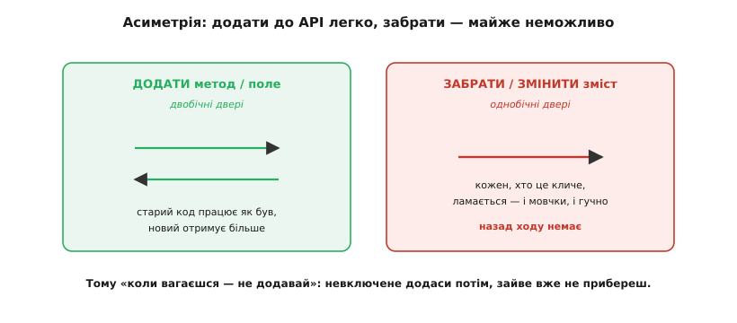

# Дизайн API модуля/бібліотеки як рішення письмом

<preknowlist>
- [Зчеплення і зв'язність](book:programming/coupling-cohesion) — як частини коду залежать одна від одної; API — це і є та поверхня, через яку одна частина чіпляється за іншу.
- [SRP — єдина відповідальність](book:programming/single-responsibility) — «одна причина змінюватися» на модуль; без цього важко відчути, де провести межу API.
</preknowlist>

Слово **API** (англ. *Application Programming Interface* — інтерфейс прикладного програмування) звучить як щось технічне й вузьке — купа функцій, які ти викликаєш. Але за ним ховається значно простіша й важливіша річ. **API — це рішення, записане так, щоб ним могли скористатися інші, і оприлюднене.** Ти вирішив, як твій шматок коду виглядає ззовні: які виклики він пропонує, що приймає, що повертає, чого обіцяє не робити. Щойно цим рішенням почав користуватися хтось інший — воно перестало бути твоїм особистим. Тепер це обіцянка.

І от у цій обіцянці — уся суть. Код усередині ти можеш переписати вночі, і ніхто не дізнається. А от обіцянку, яку ти дав назовні, потихеньку забрати вже не вийде: на ній тримається чужий код. Тому дизайн API — це не «розставити функції зручно». Це вирішити, **що саме ти обіцяєш світу**, розуміючи, що взяти слово назад буде дорого. Гарний архітектор проєктує API так само обережно, як юрист пише контракт: кожне слово тут — зобов'язання.

> 🔧 **Навіщо це.** Ти пишеш API щоразу, коли виносиш функцію в заголовок, робиш клас публічним чи піднімаєш HTTP-ендпойнт. Це не рідкісна подія «для бібліотек» — це половина щоденної роботи. Різниця між командою, яка роками рухається легко, і командою, яку душить власний код, часто зводиться до того, наскільки свідомо вони проводили ці межі. Погано продумана межа не болить сьогодні — вона надсилає рахунок через рік, коли її вже кличуть із сотні місць.

## Шов між «моїм» і «чужим»

Уяви бібліотеку роботи з файлом. Ззовні вона пропонує три дії: відкрити, прочитати, закрити. Усередині — буфери, кеш, блокування, якась структура, що тримає стан. Провести межу означає вирішити: що з цього видно назовні, а що лишається твоєю приватною справою.

```
open(path) -> Handle
read(Handle, buf, n)
close(Handle)
```

Це видима частина — те, на що спираються ті, хто тебе кличе. А буфер, алгоритм читання з диска, внутрішня структура файлу — приховане. Різниця між цими двома половинами не косметична, вона **визначає, що ти можеш міняти без болю**.


*Рішення проходить рівно по пунктирній лінії: усе видиме — обіцянка, яку доведеться тримати; усе приховане — свобода, якою можна користуватися вільно. Проектувати API — значить свідомо вирішити, де ця лінія.*

Ця думка стара й точна. Ще в 1972 році Девід Парнас (David Parnas) у роботі «On the Criteria To Be Used in Decomposing Systems into Modules» сказав річ, що перевернула погляд на розбиття програм: ділити систему на модулі треба **не за кроками обробки даних**, а за тим, **яке важке рішення кожен модуль ховає від решти**. Модуль існує, щоб приховати рішення — те, що найімовірніше зміниться. Тоді зміна цього рішення лишається всередині й не тече назовні. Саме звідси росте вся ідея «API як межі»: те, що модуль обіцяє, — стабільне; те, що він ховає, — вільне для зміни. Ця пара — публічна обіцянка й прихована свобода — і є єдиний зміст усього дизайну API. Кому цікава лінія від цієї думки Парнаса через Джошуа Блоха до Річа Гікі — вона винесена окремо. [Історія: як API з деталі перетворився на актив.](book:programming/api-design/hist-api-as-asset.md)

І що більше ти ховаєш за цією межею, то дешевша зміна. Поки структуру файлу видно назовні — хтось читає її поля напряму, — ти прикутий до неї назавжди. Щойно вона прихована за `Handle`, ти можеш замінити її цілком: переписати на асинхронне читання, додати кеш, змінити розкладку в пам'яті — і жоден виклик не зламається. Обсяг прихованого — це буквально міра твоєї майбутньої свободи.

## Головна асиметрія: додати легко, забрати — ні

Тепер найважливіше, що робить дизайн API окремим ремеслом. **Розширювати опубліковане API дешево, а зрізати з нього — майже неможливо.** Ці дві дії несиметричні, і вся обережність випливає саме звідси.

Додати новий метод чи новий необов'язковий параметр — це двобічні двері. Старий код, який про новинку не знає, працює точно як раніше; новий код отримує більше. Ніхто не постраждав. А от прибрати метод, перейменувати його чи, найпідступніше, **тихо змінити його зміст** (той самий виклик тепер поводиться інакше) — це двері в один бік. Кожен, хто на це спирався, ламається. Причому іноді гучно — код не збирається; а іноді мовчки — збирається, але робить не те, і ти дізнаєшся про це в проді через тиждень.



*Додавання лишає старий код цілим — двері працюють в обидва боки. Видалення чи зміна змісту виклику ламає всіх, хто на ньому тримався, і повернутися вже не можна. Ця несиметрія — головна причина обережності.*

Звідси випливає найкорисніше правило дизайну API, яке сформулював Джошуа Блох (Joshua Bloch) у доповіді на OOPSLA 2006: **коли вагаєшся — не включай.** Кожну частину API роби якомога меншою, але не меншою за потрібне. Причина проста й асиметрична: те, чого ти не додав сьогодні, ти спокійно додаси завтра, коли зрозумієш, що воно справді потрібне й у якій формі. А те, що додав дарма, вже не прибереш — на ньому встиг хтось повиснути. Реальна історія будь-якої довговічної бібліотеки — це купа методів, які колись «здавалися корисними», а тепер їх тягнуть десятиліттями, бо на них зав'язані клієнти; найдешевший спосіб не мати цього тягаря — просто його не створювати. Тому в сумніві дешевша помилка — пропустити, а не додати: тримай публічну поверхню вузькою, а розширюй її лише коли потреба стала реальною. Найкоротший підсумок Блоха звучить так: гарне API схоже на маленьку мову, і якщо воно вдале, код на ньому читається як проза.

Що з цим робити, коли API вже опубліковане й міняти таки треба? Тут працює думка Річа Гікі (Rich Hickey) з доповіді «Spec-ulation» (2016): усі зміни варто робити **нарощуванням** (англ. *accretion* — накопичення шар за шаром), а не ламанням. Потрібна інша поведінка функції — дай їй **нове ім'я**, лишивши стару поруч. Стара обіцянка тримається, нова живе біля неї; ніхто не зламався. Правильна зміна — це або дати більше (нова можливість), або вимагати менше (послабити умову входу); неправильна — забрати обіцяне чи посилити вимогу. Як провести цю думку в реальному C-коді — окремо, з робочими прикладами непорушного зростання. [Як ростити C-API, нікого не ламаючи (opaque struct, versioned struct, `_v2`-функції).](book:programming/api-design/proj-versioned-c-api.md)

## Чому зміну так дорого коштувати: рахунок за викликами

Чому взагалі «забрати» дорого, а «додати» дешево? Тому що ціну платить не той, хто міняє, а всі, хто **викликає**. Це просто рахунок.

Нехай твоє API кличуть із `N` місць. Додаєш новий необов'язковий метод — жодне з тих `N` місць чіпати не треба, бо старі виклики лишилися дійсні. Ціна зміни для клієнтів — нуль. Прибираєш або міняєш зміст методу — тепер кожне з `N` місць, що ним користувалося, треба знайти, зрозуміти, виправити й перевірити. Ціна росте разом із популярністю: що корисніше було API, то більше на ньому висить, то дорожче його ламати. Виходить парадокс — успіх API робить його жорсткішим. Саме тому опубліковане широко API — це майже незворотне рішення: не тому, що технічно не можна змінити файл, а тому, що рахунок за зміну лягає на тисячі чужих рядків. І та сама дія «винести назовні» коштує зовсім різного залежно від того, хто по той бік межі: внутрішнє API, яке кличуть із трьох місць твого ж репозиторію, міняєш дешево — знайшов усі три й виправив; публічне API бібліотеки, яку завантажили тисячі, міняти майже неможливо. Через це досвідчені інженери радше опублікують **менше**, ніж потім героїчно підтримуватимуть зайве, — межу виносять назовні свідомо, зваживши аудиторію, а не на автоматі. Хто хоче побачити цю асиметрію як формулу — вартість зміни, чому «одностороння» межа дорожчає з аудиторією, коли межа справді незворотна — це виведено окремо. [Математика: асиметрія вартості й «двері в один бік».](book:programming/api-design/math-change-cost.md)

## Той самий закон на всіх масштабах

Найцінніше в цьому погляді — що він **один** для всіх рівнів. Межа є межа: чи це сигнатура однієї функції, чи публічний клас бібліотеки, чи формат повідомлення між двома сервісами по мережі — скрізь працює той самий закон обіцянки й асиметрії. Змінюється лише **ціна**.


*Один принцип на трьох масштабах. Що ширша аудиторія по той бік межі, то дорожча зміна: аргумент функції правиш за хвилину, формат події між сервісами — місяцями й з узгодженням чужих команд. Дизайн той самий, ставки різні.*

На рівні функції межа — це її сигнатура і те, що вона обіцяє зробити (і чого не псує). Тут стануть у пригоді сусідні принципи дизайну: щоб клієнт залежав від того, **що** межа обіцяє, а не **як** усередині зроблено, залежність направляють на абстракцію — [принцип інверсії залежностей (DIP)](book:programming/dependency-inversion) каже спиратися на інтерфейс, а не на конкретну реалізацію. Щоб додавати нову поведінку, не переписуючи й не ламаючи наявних викликів, межу роблять розширюваною за [принципом відкритості/закритості (OCP)](book:programming/open-closed) — відкрита для розширення, закрита для правок. Обидва — про те саме: тримати обіцянку сталою, а зміну вводити нарощуванням.

На рівні модуля межа — це публічні класи й заголовки, а стабільність обіцянки прийнято позначати номером версії (семантичне версіонування). На рівні сервісів межа — формат повідомлень або HTTP-контракт, і тут з'являється додатковий біль: обидва боки живуть окремо й розгортаються не разом, тож ламати формат не можна навіть на секунду. У [подієвій архітектурі](book:programming/event-driven-architecture) та між [мікросервісами](book:programming/microservices) схема події стає таким самим публічним API, як заголовок бібліотеки, — з тією ж асиметрією, лише дорожчою.

## Межа як мова, а не лише як список функцій

Є ще один шар, на якому API — це рішення, і він тонший за набір сигнатур. Межа несе **мову**: імена, поняття, форму даних, за якими дві сторони домовляються розуміти світ однаково. Коли твій модуль каже «Замовлення», а сусідній під тим самим словом розуміє щось інше, це не дрібниця найменувань — це два різні світи, зшиті докупи, і шов протікатиме.

У предметно-орієнтованому проєктуванні (DDD, англ. *Domain-Driven Design*) цю думку доводять до кінця: межа модуля — це водночас межа **мови**. Усередині [обмеженого контексту](book:programming/bounded-context) кожне слово має один точний зміст; на межі, де контексти стикаються, значення слів різні, і зшивати їх треба свідомо. Коли твоя система спирається на чуже API з іншою моделлю світу, її не пускають усередину «як є» — між ними ставлять [антикорупційний шар (ACL)](book:programming/anti-corruption-layer), що перекладає чужі поняття у твої, щоб чужа модель не просочилася й не спотворила твою. Тобто API — це не тільки «які функції», а й «якою мовою ми домовилися говорити через цю межу».

## Рішення варто записати — разом із причиною

Якщо API — це рішення, то, як і будь-яке важливе рішення, його варто **зафіксувати разом із причиною**. Не самі сигнатури (їх видно з коду), а *чому* межа проведена саме тут: що ти свідомо сховав, що обіцяв, від чого відмовився і якою була альтернатива. За півроку ти забудеш; за рік прийде інша людина й, не знаючи причини, «поправить» межу — і зламає те, заради чого її будували.

Саме для цього ведуть короткі записи рішень — [журнал архітектурних рішень (ADR)](book:programming/architecture-decision-records): один компактний файл на рішення, де сказано контекст, вибір і наслідки. Для API це особливо цінно, бо межу міняти дорого, і кожна майбутня спроба її зачепити має спершу впертися в записану причину, чому вона така. Без цього сліду API з роками перетворюється на набір рішень, яких **ніхто вже не розуміє**, — а незрозумілу межу бояться чіпати, обходять милицями, і вона тихо стає [технічним боргом](book:programming/technical-debt), що дорожчає з кожним обходом.

> 🔧 **Навіщо це.** Найдорожчі помилки в API — не в тому, що хтось написав погану сигнатуру, а в тому, що причину доброї сигнатури забули, і хтось інший із добрих намірів її «спростив». Один абзац записаного рішення поруч із публічним методом рятує роки: він каже майбутньому тобі не «що тут», а «чому саме так і чого не можна чіпати».

## Реалізацію перепишеш, межа лишиться

**Межа коду переживе його нутрощі.** Реалізацію ти перепишеш десять разів; API, яким користуються, лишиться. Тому проектувати його варто як те, що доведеться тримати довго, — свідомо, вузько й із записаною причиною.
