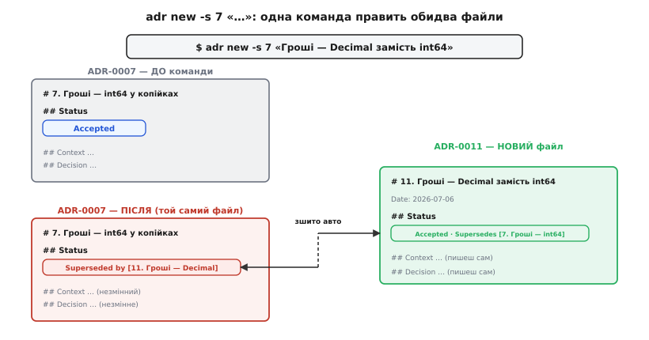
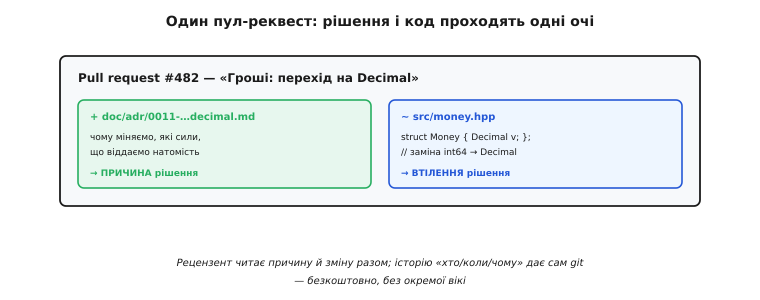

# ⚙️ Вести журнал інструментом: adr-tools на практиці

Записати рішення — це дисципліна, а не програма. Але дисципліна тримається легше, коли рутина навколо неї коштує нуль зусиль. Уяви, що ти щойно вирішив важливе й хочеш це зафіксувати. Треба: знайти правильну теку, придумати наступний номер (а чи не зайнятий уже сьомий кимось у сусідній гілці?), назвати файл у тому самому стилі, що й попередні, вписати сьогоднішню дату, розкласти п'ять стандартних розділів, а якщо це рішення **скасовує** старе — ще й піти у старий файл і вручну поміняти йому статус, не забувши поставити зустрічні посилання в обидва боки. Кожен із цих кроків дрібний. Але разом вони — саме той тертя-податок, через який гарний намір «записуватиму рішення» тихо вмирає на третьому тижні.

`adr-tools` Ната Прайса (Nat Pryce) знімає рівно цей податок. Це не редактор, не база даних і не сервіс — це купка невеликих скриптів оболонки (Bash), які роблять механічну частину: заводять теку, рахують номер, ставлять дату, кладуть шаблон і — найцінніше — автоматично зшивають пару «замінює / замінено» у двох файлах одразу. Прайс — той самий інженер, що разом зі Стівом Фріменом (Steve Freeman) написав книжку *Growing Object-Oriented Software, Guided by Tests*; його інструмент навмисно крихітний і навмисно робить лише те, що комп'ютер робить краще за людину — рахує й переписує однакове. Суть ADR лишається за людиною: **чому** ми так вирішили й від чого відмовилися. Це інструмент не виведе.

> 🔧 **Навіщо це.** Різниця між «командою в терміналі» і «десятьма ручними кроками» — не в економії тридцяти секунд. Вона в тому, **чи буде запис зроблено взагалі**. Практика ADR живе рівно доти, доки завести новий запис дешевше, ніж полінуватися. Інструмент опускає цю ціну до однієї команди — і тим тримає журнал живим.

## Що це за штука й звідки взялася

`adr-tools` — це репозиторій `npryce/adr-tools` на GitHub: набір POSIX-скриптів, які встановлюються як одна команда `adr` з підкомандами. Кожен запис — звичайний Markdown-файл у теці проєкту (типово `doc/adr/`), названий за схемою `NNNN-короткий-titlе-через-дефіс.md`, де `NNNN` — порядковий номер із провідними нулями: `0001-…`, `0002-…`. Формат самого запису — той, що описав Майкл Найгард (Michael Nygard): заголовок, статус, контекст, рішення, наслідки. Інструмент лише **обгортка** навколо цього формату: він не вигадав ні структуру ADR, ні ідею тримати рішення в репозиторії — він зробив дешевою рутину навколо них.

*(Статус фактів: усе нижче звірено з README та скриптами репозиторію `npryce/adr-tools` — усталено. Прайс як співавтор GOOS — усталено.)*

Домовимося про приклад, наскрізний для всієї розповіді, — той самий, що й у решті матеріалу про ADR: команда веде фінансовий застосунок і колись вирішила зберігати гроші як ціле число копійок у `int64` (щоб `double` не крав копійку на округленнях). Мине час — і команда захоче це рішення **переглянути**: перейти на десятковий тип `Decimal`, бо додалися валюти з трьома знаками після коми й складні податкові правила, де самих копійок замало. Ось на цій парі рішень — старому й тому, що його змінює, — найкраще видно, що саме інструмент робить руками, а що лишає людині.

## Перший крок: завести журнал

У порожньому репозиторії журналу ще нема. Одна команда створює його:

```
$ adr init
```

Що вона робить: створює теку `doc/adr/` і кладе в неї **перший** запис — `0001-record-architecture-decisions.md`. Це не звичайне рішення про код, а рішення **про сам процес**: «ми вирішили вести архітектурні рішення як ADR у форматі Найгарда». Зміст його — короткий, зі статусом `Accepted` і посиланням на статтю Найгарда як на джерело формату. Ідея тут тонша, ніж здається: сам факт, що команда веде журнал, — теж архітектурне рішення, і воно теж заслуговує запису. Тому нульовий-перший ADR у кожному проєкті на `adr-tools` виглядає однаково — це підпис під згодою грати за правилами.

Хочеш іншу теку — передаєш її як аргумент:

```
$ adr init docs/decisions
```

Тоді всі майбутні записи лягатимуть туди; інструмент запам'ятовує вибір через прихований файл-маркер у корені, щоб наступні команди знали, де журнал.

## Головна команда: новий запис

Кожне нове рішення заводиться так:

```
$ adr new "Гроші зберігаємо як int64 у копійках"
```

За цією однією командою відбувається все механічне заразом. Інструмент дивиться, який номер уже найбільший у теці, бере наступний — скажімо, `0007`. Робить із заголовка слаг у нижньому регістрі через дефіси. Складає ім'я файлу `0007-groshi-zberihaiemo-yak-int64-u-kopiykah.md` (насправді зі слагом він працює латиницею — на практиці заголовки для файлів пишуть англійською, `0007-money-as-integer-cents.md`, а українську лишають у тілі; про це — нижче в пастках). Вписує сьогоднішню дату. Розкладає всередині порожній кістяк Найгарда й відкриває файл у твоєму редакторі — тому, що заданий змінними оточення `$VISUAL` чи `$EDITOR`.

Заготовка, яку ти побачиш усередині, — рівно та форма, про яку йдеться в самій темі ADR:

```markdown
# 7. Гроші зберігаємо як int64 у копійках

Date: 2026-03-14

## Status

Accepted

## Context

The issue motivating this decision, and any context that influences or constrains the decision.

## Decision

The change that we're proposing or have agreed to implement.

## Consequences

What becomes easier or more difficult to do and any risks introduced
by the change that will need to be mitigated.
```

Три речі варто помітити одразу. По-перше, статус за замовчуванням — `Accepted`: інструмент виходить із того, що ти записуєш **уже ухвалене** рішення, а не чернетку на обговорення (хочеш «Proposed» — міняєш рядок руками). По-друге, англомовні підказки в розділах — це **плейсхолдери**, які треба замінити своїм текстом, а не лишати. По-третє, номер у заголовку (`# 7.`) і номер у назві файлу (`0007-`) інструмент тримає узгодженими сам — тобі не треба слідкувати за нумерацією.

Далі — найважливіша частина, і її інструмент **не зробить**: заповнити «Контекст» силами, а «Наслідки» — чесною ціною. Ось як виглядає той самий ADR-0007, коли людина зробила свою частину роботи:

```markdown
# 7. Гроші зберігаємо як int64 у копійках

Date: 2026-03-14

## Status

Accepted

## Context

Фінансовий звіт не має права загубити копійку — розбіжність навіть в
одну копійку між сумою рядків і підсумком ламає довіру до всього звіту.
Тип double зберігає числа у двійковому форматі з рухомою комою: 0.10
там не представне точно, і на сотнях додавань похибки накопичуються.
Усі наші суми на цьому етапі — у гривнях і копійках, тобто два знаки
після коми; більшого дробу бізнес поки не має. int64 вміщує суми до
~9.2·10¹⁸ копійок — це з запасом більше за будь-які реальні гроші.

## Decision

Гроші зберігаємо як ціле число копійок у типі int64. Жодних double у
грошових обчисленнях. Показ (гривні.копійки) — форматуванням на межі
з користувачем: ділення на 100 лише в мить виводу, не в обчисленнях.

## Consequences

+ Арифметика точна: додавання й віднімання цілих не округлюють нічого.
+ Порівняння на рівність надійне (int == int, без ε-допусків).
− Код багатослівніший: скрізь потрібні явні копійки, а для показу —
  ділення на 100 з окремою обробкою знаку й дробової частини.
− Множення (податок, відсоток) вимагає обережного округлення вручну —
  результат уже не завжди ціла копійка.
− Прив'язка до двох знаків: валюта з трьома знаками (напр. динар)
  у цю модель не влізе без переробки.
```

Останній мінус — не випадковий. Це той самий тиск, що за рік і змусить команду рішення переглянути. Чесно записаний мінус у «Наслідках» — це не самобичування, а **сигнал майбутньому**: ось де модель тонка, ось звідки прийде наступна зміна.


*Інструмент кладе кістяк і службові поля; сили в контексті й ціну в наслідках пише людина. Автоматика знімає рутину, але не думання.*

## Серце інструменту: скасувати старе рішення

Тепер — те, заради чого `adr-tools` найбільше й варто мати. Минув рік, додалися валюти з трьома знаками й податкові правила, де копійок замало. Команда вирішує перейти на десятковий тип. Наївно це означало б: створити новий файл, а тоді **не забути** піти в старий ADR-0007, поміняти йому статус, вписати посилання на новий, а в новому — зустрічне посилання на старий. Чотири ручні дії у двох файлах, і кожну легко забути — особливо зустрічний лінк у старому файлі, бо ти вже думаєш про новий.

Одна команда робить усе це сама:

```
$ adr new -s 7 "Гроші зберігаємо як Decimal"
```

Прапорець `-s 7` (від *supersede* — заміщувати) каже: цей новий запис **замінює** ADR номер 7. Що інструмент робить у відповідь:

1. Створює новий файл — скажімо, `0011-money-as-decimal.md` — зі свіжою датою й статусом `Accepted`, як завжди.
2. У **новому** файлі, у розділі `## Status`, додає рядок `Supersedes 0007-money-as-integer-cents.md → 7. Гроші зберігаємо як int64 у копійках` — посилання назад на скасоване рішення.
3. Іде у **старий** файл `0007-…` і міняє йому статус: замість самотнього `Accepted` там з'являється `Superseded by 0011-money-as-decimal.md → 11. Гроші зберігаємо як Decimal` — посилання вперед, на того, хто прийшов на зміну.

Обидва боки зшиті, обидва файли посилаються один на одного, і жодного ручного кроку. Це рівно та робота, яку комп'ютер робить бездоганно, а людина забуває.


*Одна команда `adr new -s 7` править обидва файли: старому проставляє «замінено», новому — «замінює», і зшиває їх посиланнями в обидва боки. Руками цей зустрічний лінк у старому файлі найлегше забути.*

Важливий нюанс, який легко проґавити: `-s` **не видаляє** старий ADR-0007. Він лишається на місці, читабельний, лише під новим статусом — рівно так, як велить головне правило журналу: причина, чому свого часу обрали `int64`, ніколи не застаріває, і стерти її було б утратою. Прапорців `-s` можна дати кілька, якщо одне рішення заміняє відразу два-три старі: `adr new -s 7 -s 9 "…"`.

## Довільні зв'язки: коли одне рішення не заміняє, а лише зачіпає інше

Не всі зв'язки між рішеннями — це заміна. Часом одне рішення не скасовує інше, а **уточнює**, **доповнює** чи **залежить** від нього. Для цього є окрема команда `adr link` і прапорець `-l` у `adr new`.

Скажімо, після переходу на `Decimal` (ADR-0011) команда окремим рішенням фіксує, **як саме** округляти при множенні на податкову ставку, — це ADR-0014, і воно не заміняє 0011, а **деталізує** його. Зв'язати вже наявні записи можна так:

```
$ adr link 14 "Amends" 11 "Amended by"
```

Читається як речення: запис 14 «доповнює» (`Amends`) запис 11, а зворотно запис 11 «доповнено» (`Amended by`) записом 14. Інструмент вписує обидва рядки у відповідні файли. Тип зв'язку — довільний текст: `Amends`, `Refines`, `Depends on`, `Relates to` — яка формулювання точніше опише стосунок, таку й пишеш. Так само зв'язок можна поставити одразу при створенні нового запису прапорцем `-l "14:Amends:Amended by"`.

Різниця між `-s` і `-l` по суті одна: `-s` окремо ще й **міняє статус** старого на «замінено» (бо заміна виводить старе рішення з гри), а `link` лише додає рядки-зв'язки, не чіпаючи статусів (бо доповнення обидва рішення лишає чинними).

## Оглянути журнал: список і карта

Коли записів набирається десятки, стають у пригоді дві оглядові команди. Проста — перелік:

```
$ adr list
doc/adr/0001-record-architecture-decisions.md
doc/adr/0007-money-as-integer-cents.md
doc/adr/0011-money-as-decimal.md
doc/adr/0014-tax-rounding-rule.md
```

Складніша й корисніша — зміст (table of contents) і граф зв'язків. Зміст генерується в Markdown і його зазвичай кладуть у `README.md` теки журналу, щоб на GitHub зразу був клікабельний покажчик:

```
$ adr generate toc > doc/adr/README.md
```

А граф `adr generate graph` віддає опис у форматі Graphviz (мова `dot`), де кожен ADR — вузол, а «замінює/доповнює» — стрілки між ними. Проганяєш його через `dot` — і маєш картинку еволюції рішень, де видно, що з чого виросло й що чим замінене. Обидві команди читають ті самі файли й ті самі рядки статусів/зв'язків, які поставили `new` і `link`, — тобто карта завжди відповідає стану журналу, бо будується з нього, а не ведеться окремо.

> 🔧 **Навіщо це.** `generate toc` варто повісити в pre-commit-гачок або в CI: тоді покажчик журналу оновлюється сам щоразу, коли додається ADR, і ніколи не розходиться з реальним вмістом теки. Ручний покажчик, який треба не забути дописати, — це ще одне джерело тертя й ще одна річ, що тихо застаріває; згенерований — не застаріває ніколи.

## Де це стає живим: ADR у git-рев'ю поруч із кодом

Тепер найважливіша частина — не команди, а те, **де** все це відбувається. Оскільки ADR — звичайний файл у тому самому репозиторії, що й код, він природно потрапляє в ту саму гілку, той самий коміт і той самий пул-реквест, що й зміна, яку описує.

Практично це означає ось що. Розробник, що робить перехід на `Decimal`, в одній гілці робить дві речі разом:

```
$ git checkout -b money-decimal
$ adr new -s 7 "Гроші зберігаємо як Decimal"     # заводить 0011 + міняє статус 0007
$ $EDITOR doc/adr/0011-money-as-decimal.md        # пише контекст, рішення, наслідки
$ $EDITOR src/money.hpp                            # власне зміна коду
$ git add doc/adr/0011-money-as-decimal.md \
          doc/adr/0007-money-as-integer-cents.md \
          src/money.hpp
$ git commit -m "Гроші: перехід на Decimal (ADR-0011)"
$ git push -u origin money-decimal
```

І далі відкриває пул-реквест. У дифі рецензент бачить **разом**: змінений старий ADR (статус став «замінено»), новий ADR із причинами й ціною, і власне зміну в `money.hpp`. Одні очі, одне обговорення, один момент часу. Рецензент може посперечатися не лише з кодом, а й із **рішенням** — «а точно `Decimal`, а не масштабоване ціле з фіксованим дробом?» — і ця суперечка теж лишається в історії пул-реквесту.


*Рішення і код, що його втілює, їдуть в одному пул-реквесті. Причина проходить те саме рев'ю, що й зміна, а «хто, коли, чому» дає сама система контролю версій — без окремої вікі.*

Звідси виходить кілька безкоштовних властивостей, кожна — прямий наслідок того, що запис лежить у git, а не у вікі. Автор, дата й історія правок кожного ADR — це просто `git log` та `git blame` по файлу; окремо їх вести не треба. Рішення не можна «випадково не побачити»: воно в дифі, а не за три кліки в окремій системі. І воно версіонується разом із кодом — переключився на тег піврічної давнини, і бачиш ADR-и рівно в тому стані, у якому вони були тоді.

Код, що дотримується рішення, замикає коло — короткий коментар-місток від рядка коду до причини:

:::tabs
```cpp
// Гроші тримаємо в Decimal (не int64, не double).
// Причини, відкинуті варіанти й ціна: doc/adr/0011-money-as-decimal.md
// (це рішення замінило ADR-0007 «int64 у копійках» — див. посилання там).
//
// Коротко: int64-копійки не вмістили валют із трьома знаками й податкових
// правил зі складним округленням; double заборонений через похибку на дробах.

#include "decimal.hpp"

struct Money {
    Decimal amount;                       // десятковий тип, точний на дробах

    Money operator+(Money o) const { return { amount + o.amount }; }
    Money operator*(int scale) const { return { amount * scale }; }
};

// Наступний, хто захоче «повернути на int64 для швидкості», спершу
// прочитає ADR-0011 і побачить, ЧОМУ від int64 свідомо пішли — і не
// повторить уже пройдену помилку.
```
```python
# Гроші тримаємо в Decimal (не int-копійки, не float).
# Причини, відкинуті варіанти й ціна: doc/adr/0011-money-as-decimal.md
# (це рішення замінило ADR-0007 «int64 у копійках» — див. посилання там).
#
# Коротко: int-копійки не вмістили валют із трьома знаками й податкових
# правил зі складним округленням; float заборонений через похибку на дробах.

from dataclasses import dataclass
from decimal import Decimal

@dataclass(frozen=True)
class Money:
    amount: Decimal                       # десятковий тип, точний на дробах

    def __add__(self, o: "Money") -> "Money":
        return Money(self.amount + o.amount)

    def __mul__(self, scale: int) -> "Money":
        return Money(self.amount * scale)

# Наступний, хто захоче «повернути на int-копійки для швидкості», спершу
# прочитає ADR-0011 і побачить, ЧОМУ від них свідомо пішли — і не
# повторить уже пройдену помилку.
```
```go
// Гроші тримаємо в Decimal (не int64, не float64).
// Причини, відкинуті варіанти й ціна: doc/adr/0011-money-as-decimal.md
// (це рішення замінило ADR-0007 «int64 у копійках» — див. посилання там).
//
// Коротко: int64-копійки не вмістили валют із трьома знаками й податкових
// правил зі складним округленням; float64 заборонений через похибку на дробах.

import "github.com/shopspring/decimal" // де-факто десятковий тип для Go

type Money struct {
	Amount decimal.Decimal // десятковий тип, точний на дробах
}

// У Go немає перевантаження операторів, а decimal.Decimal рахує
// методами Add/Mul — тож обгортаємо їх у методи Money:
func (m Money) Add(o Money) Money {
	return Money{m.Amount.Add(o.Amount)}
}

func (m Money) Mul(scale int) Money {
	return Money{m.Amount.Mul(decimal.NewFromInt(int64(scale)))}
}

// Наступний, хто захоче «повернути на int64 для швидкості», спершу
// прочитає ADR-0011 і побачить, ЧОМУ від int64 свідомо пішли — і не
// повторить уже пройдену помилку.
```
```rust
// Гроші тримаємо в Decimal (не i64, не f64).
// Причини, відкинуті варіанти й ціна: doc/adr/0011-money-as-decimal.md
// (це рішення замінило ADR-0007 «i64 у копійках» — див. посилання там).
//
// Коротко: i64-копійки не вмістили валют із трьома знаками й податкових
// правил зі складним округленням; f64 заборонений через похибку на дробах.

use rust_decimal::Decimal; // де-факто десятковий тип для Rust

#[derive(Clone, Copy)]
struct Money {
    amount: Decimal, // десятковий тип, точний на дробах
}

// Decimal реалізує трейти Add і Mul, тож оператори + і * працюють:
impl std::ops::Add for Money {
    type Output = Money;
    fn add(self, o: Money) -> Money {
        Money { amount: self.amount + o.amount }
    }
}

impl std::ops::Mul<i64> for Money {
    type Output = Money;
    fn mul(self, scale: i64) -> Money {
        Money { amount: self.amount * Decimal::from(scale) }
    }
}

// Наступний, хто захоче «повернути на i64 для швидкості», спершу
// прочитає ADR-0011 і побачить, ЧОМУ від i64 свідомо пішли — і не
// повторить уже пройдену помилку.
```
:::

Один рядок-посилання в коментарі перетворює журнал із паперу на живий інструмент: він з'єднує **що** написано в коді з **чому** — і робить це за один клік, а не через археологію в чиїйсь пам'яті.

## Заготовка-шаблон, яку варто мати перед очима

`adr new` кладе кістяк сам, але корисно тримати шаблон і як окремий орієнтир — щоб бачити цілий бланк і не пропустити розділ, коли пишеш ADR руками чи в іншому інструменті. Ось повна заготовка з підказками, **що саме** писати в кожному розділі (підказки — у дужках, у справжньому записі їх заміняють текстом):

```markdown
# NNNN. Коротка назва рішення активним іменником

Date: РРРР-ММ-ДД

## Status

(Одне слово чи рядок: Proposed | Accepted | Deprecated |
 Superseded by NNNN-….md → NNNN. …. Нове рішення — зазвичай Accepted.)

## Context

(СИЛИ в грі — без самого рішення. Які вимоги тиснуть, які обмеження
 не обійти, які факти й ризики важать, чого команда боїться. Хто
 прочитає чесний контекст, той сам дійде того самого висновку.)

## Decision

(ЩО саме вирішили — активним голосом: «Ми зберігаємо…», «Ми виносимо…».
 Одне-два речення суті плюс, за потреби, ключові межі рішення.)

## Consequences

(НАСЛІДКИ — і виграш, і ЦІНА. Що стало легше (+), що стало важче (−),
 яку нову залежність завели, від чого відмовилися. Розділ без мінусів —
 підозрілий: значить, ціну сховали.)
```

Три розділи легко написати, четвертий — «Наслідки» з чесними мінусами — саме той, що відрізняє зрілий запис від реклами. Якщо в тебе там лише плюси, ти або обрав справді безкоштовне рішення (рідкість), або не додумав ціну.

## Пастки: де практика ламається навіть з інструментом

Інструмент прибирає механічне тертя, але не рятує від змістових помилок. Три з них убивають журнал певніше за все інше.

**Писати заднім числом.** Найпідступніша пастка, бо виглядає невинно: «нема часу зараз, запишу рішення потім, коли розберуся». Проблема в тому, що «потім» контекст уже інший. Ти вже знаєш, чим усе скінчилося, вагання забулися, глухі кути стерлися — і в «Контекст» лягає гладенька, причесана, **вигадана** логіка, з якої зникло все живе. А саме живе — справжні страхи, реальні альтернативи, те, чого боялися, — і є найцінніше в ADR. Запис, зроблений заднім числом, технічно існує, але бреше про минуле: він показує рішення таким, яким воно **здається** тепер, а не яким **було** тоді. Ліки одні — заводити ADR у мить рішення, поки сили ще в голові; `adr new` для того й зроблено однокомандним, щоб це нічого не коштувало.

**Роздувати запис.** Друга пастка — перетворити ADR на технічну документацію: вписати туди схему всієї системи, приклади коду на пів екрана, покрокову інструкцію з розгортання. Довгий ADR має дві біди. По-перше, його ніхто не дочитає — а отже й не прочитає причину, заради якої він існує. По-друге (тонше), автор, знаючи, що треба заповнити багато, починає **лити воду** й губить головне серед деталей. Здорова межа — одна-дві сторінки. Контекст — сили, не переказ архітектури. Рішення — що вирішили, не як його реалізувати построково (це робота коду й коментарів у ньому). Наслідки — ціна й виграш, не туторіал. Усе, що не відповідає на «чому саме так», у ADR зайве.

**Документувати дрібниці.** Третя й найпідступніша пастка — писати ADR на **все підряд**. Спокуса зрозуміла: якщо записувати рішення корисно, то записувати більше рішень — корисніше, так? Ні. Коли команда заводить ADR на назву змінної, на вибір бібліотеки-хелпера для одного модуля, на дрібне локальне рішення — журнал тоне в шумі. Важливі записи губляться серед дрібних, писати їх стає обтяжливо, люди починають робити це абияк, і за місяць-два практика відмирає — не від ліні, а від **перевантаження**. Груба перевірка, що ловить дрібницю: уяви, що через рік хтось захоче це рішення скасувати. Відкат дешевий і тихий, нікого не зачіпає, причина очевидна з коду — **не пиши**, це зворотне рішення, шкода часу й місця в журналі. Відкат болючий, зачіпає багатьох, звужує майбутнє, а причина неочевидна — **пиши**, це рівно той випадок, заради якого ADR існує.

Є й четверта, суто інструментальна пастка, дрібніша за змістом, але дратівна на практиці: **слаг файлу з нелатинських літер**. `adr new` будує ім'я файлу з заголовка, і кирилиця в імені файлу репозиторію — джерело болю (різні системи по-різному її нормалізують, посилання ламаються, `git` подекуди екранує символи в шляхах). Тому усталена практика — **заголовок для імені файлу писати латиницею** (`adr new "Money as Decimal"` → `0011-money-as-decimal.md`), а українську версію заголовка й увесь зміст класти всередину файлу, у рядок `#`. Ім'я файлу — технічний ідентифікатор, тіло — текст для людей; змішувати їх не варто.

## Що взяти з собою

`adr-tools` не робить нічого, чого не можна зробити руками, — і в цьому вся суть. Він забирає рівно ту роботу, яку комп'ютер робить бездоганно, а людина забуває: порахувати номер, поставити дату, назвати файл однаково, а головне — зшити пару «замінює / замінено» в двох файлах, не проґавивши зустрічний лінк. `adr init` заводить журнал одним рухом; `adr new` створює запис із готовим кістяком; `adr new -s N` заміняє старе рішення й перешиває обидва статуси; `adr link` в'яже довільні зв'язки; `adr generate toc/graph` малює карту з тих самих файлів. Усе це — навколо простого факту, що ADR лежить у git поруч із кодом, а тому їде в тому самому пул-реквесті, проходить те саме рев'ю й безкоштовно отримує від системи контролю версій автора, дату й історію.

Але жоден інструмент не напише за тебе чесний контекст із справжніми силами й чесні наслідки зі справжньою ціною — а це і є ADR. Автоматика опускає ціну рутини до нуля саме для того, щоб уся твоя увага лишалася там, де вона потрібна: на причинах. Записуй їх у мить рішення, коротко, з мінусами й лише на те, що варте запису, — а нумерацію й зустрічні посилання лиши машині.
