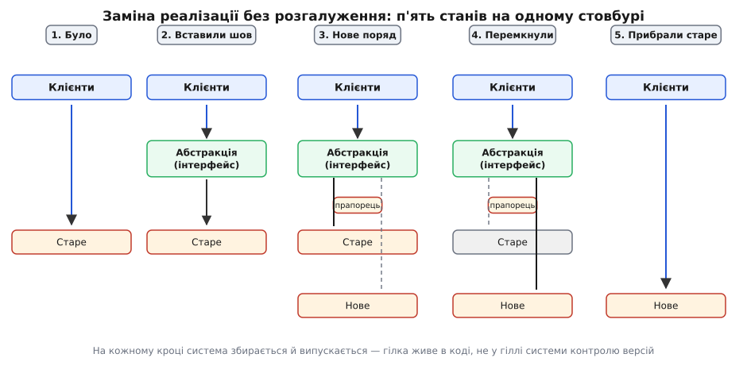
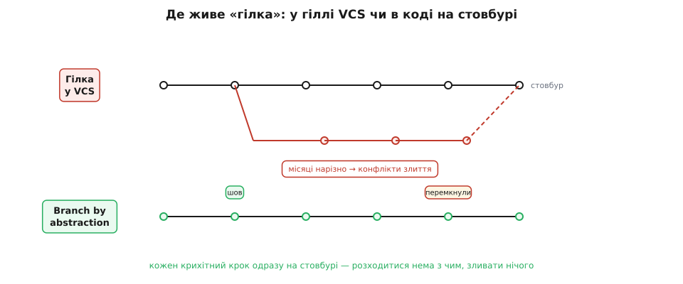

# Branch by abstraction

<preknowlist>
- [Інтерфейс проти реалізації](topic:programming/interface-vs-implementation) — поділ на те, ЩО модуль обіцяє зовні, і ЯК він це робить усередині; шов, у який стають дві реалізації по черзі, — це саме такий інтерфейс.
- [Принцип інверсії залежностей](topic:programming/dependency-inversion) — як змусити клієнта спиратися на абстракцію, а не на конкретний клас; без цього нема куди підставити другу реалізацію.
- [Прапорці функцій](topic:programming/feature-flags) — умикач у коді, яким на льоту обирають одну з двох гілок поведінки; ним і перемикають стару реалізацію на нову.
- [Зчеплення і зв'язність](topic:programming/coupling-cohesion) — чому пряма залежність від конкретного класу «прибиває» код до нього; послаблене зчеплення — умова того, щоб заміна взагалі була можлива.
</preknowlist>

Уяви, що в живому застосунку треба замінити велику, глибоко врослу деталь. Стару бібліотеку доступу до бази — на нову. Саморобну систему сповіщень — на чергу повідомлень. Одну мову шаблонів — на іншу. Річ, яку ти хочеш вирвати, торкається сотень місць: її гукають з усіх усюд, на неї спираються тести, від неї залежить збірка. І ось звична пастка: заміна така велика, що «за один присід» її не зробити — потрібні тижні, а то й місяці роботи.

Найпростіший на вигляд вихід — і найпідступніший. Створюєш довгу гілку в системі контролю версій, ідеш туди й починаєш велику перебудову. Здається логічним: хай хаос переробки не заважає решті команди. Але поки ти рубаєш ліс у своїй гілці, стовбур (`main`) живе далі — туди щодня ллються чужі коміти. Твоя гілка і стовбур **розходяться**, і що довше триває робота, то далі вони одне від одного. А наприкінці на тебе чекає злиття двох версій, що місяцями змінювалися нарізно, — і це не рутина, а окремий важкий проєкт із конфліктами в тих самих файлах, які всі й правили. Велика зміна карає саме тоді, коли ти нарешті думав, що впорався.

Branch by abstraction («розгалуження абстракцією») — прийом, що прибирає цю кару. Сама техніка стара, як абстракція, але [назву їй дали лише 2007 року](topic:programming/branch-by-abstraction/hist-bba-naming.md), і вона несе точну думку: **гілку роблять не в системі контролю версій, а в коді**. Замість розводити дві версії програми по різних гілках репозиторію, ти тримаєш обидві реалізації **поряд, на одному стовбурі**, за спільною абстракцією — і перемикаєшся між ними, коли готовий. Уся команда весь час на `main`, система весь час збирається й випускається, а велика заміна повзе вперед крихітними, безпечними кроками. Зливати наприкінці нема чого, бо ти ніколи й не розходився.

> 🔧 **Навіщо це.** Не «щоб гарно», а щоб **не зупиняти випуск під час великої перебудови**. Бізнес рідко може дозволити «заморозимо релізи на два місяці, поки міняємо базу». Branch by abstraction тримає застосунок придатним до випуску **на кожному кроці** заміни: у будь-яку мить можна зібрати, протестувати й викотити те, що на стовбурі, — навіть коли міграція зроблена наполовину. Це і є те, що робить велику зміну сумісною з безперервним постачанням, а не ворожою до нього.

## Звідки береться абстракція

Ключове слово — **абстракція (лат. *abstractio* — відтягування, відокремлення)**: ми відтягуємо від конкретної деталі її суть, лишаючи для клієнтів **обіцянку**, а не ім'я класу. Поки код по всьому застосунку гукає стару бібліотеку прямо, за іменем, підставити замість неї нову ніде: заміна довелося б у сотні місць одночасно. Тому перший рух — не міняти реалізацію, а **вставити між клієнтами й деталлю тонкий шов**: інтерфейс, що описує лише те, що клієнтам справді потрібно від цієї деталі, її поняттями — «зберегти замовлення», «надіслати сповіщення», — і жодним словом про нутрощі.

Коли шов на місці й **усі** клієнти ходять уже через нього, стається головне: стара реалізація перестала бути незамінною. Тепер за тією самою обіцянкою можна поставити **другу** реалізацію — нову бібліотеку, нову чергу — і жоден клієнт не помітить різниці, бо він бачить лише інтерфейс. Дві реалізації **співіснують** за одним швом. Лишається обрати, котра з них працює: це вирішує [прапорець](topic:programming/feature-flags) — маленький умикач у коді чи в конфізі, що спрямовує виклики в стару або нову гілку. Спочатку прапорець дивиться на стару (нічого не змінилося для користувача, ти лише допилюєш нову збоку). Коли нова готова й перевірена — перемикаєш, спостерігаєш, і якщо все добре, **прибираєш** стару реалізацію разом із прапорцем. Часто після цього прибирають і сам шов, якщо він більше не потрібен.

Ось увесь життєвий шлях заміни, розкладений на п'ять станів на одному стовбурі:


*Клієнти весь час дивляться в один шов; під ним стара й нова реалізації по черзі стають активними за прапорцем, і система лишається придатною до випуску на кожному кроці.*

Придивись, чому це працює. Небезпека великої зміни — в **одномоментності**: коли треба перемкнути все й одразу, будь-яка помилка валить усе й одразу. Branch by abstraction розтягує ту саму заміну в **послідовність дрібних, оборотних кроків**, кожен з яких лишає систему цілою. Вставити інтерфейс — крок, після якого все компілюється і працює. Перевести одного клієнта на інтерфейс — теж. Додати нову реалізацію, якою ще ніхто не користується, — теж безпечно. І сам момент перемикання — не стрибок через прірву, а поворот прапорця, який так само легко повернути назад. Ризик не зникає, але дрібниться на порції, які легко зважити й відкотити.

## Як це виглядає в коді

Візьмімо конкретне: у застосунку є сповіщення користувачам, і зараз їх шле саморобний клас `LegacyMailer`, прибитий цвяхами по всьому коду. Мета — переїхати на нову систему через чергу повідомлень, не зупиняючи випуск. Пройдімо ті самі п'ять станів.

**Стан 1 — було.** Клієнти гукають конкретний клас прямо. Замінити його ніде — доведеться правити кожне місце виклику:

:::tabs
```ts
// Клієнт прибитий до конкретної реалізації
class OrderService {
  private mailer = new LegacyMailer();      // ім'я деталі просочилося в логіку

  placeOrder(order: Order) {
    // ...бізнес-логіка...
    this.mailer.sendMail(order.email, "Замовлення прийнято");
  }
}
```
```py
# Клієнт прибитий до конкретної реалізації
class OrderService:
    def __init__(self):
        self.mailer = LegacyMailer()          # ім'я деталі просочилося в логіку

    def place_order(self, order):
        # ...бізнес-логіка...
        self.mailer.send_mail(order.email, "Замовлення прийнято")
```
:::

**Стан 2 — вставляємо шов.** Оголошуємо абстракцію поняттями клієнта — «сповіщувач», а не «поштар» і не «черга», — і робимо так, щоб стару реалізацію вона огортала. Клієнт більше не називає клас, він приймає абстракцію ззовні:

:::tabs
```ts
// Шов: обіцянка мовою клієнта, без натяку на пошту чи чергу
interface Notifier {
  notify(to: string, message: string): void;
}

// Стара реалізація тепер лише виконує обіцянку
class LegacyMailerNotifier implements Notifier {
  private mailer = new LegacyMailer();
  notify(to: string, message: string) {
    this.mailer.sendMail(to, message);
  }
}

class OrderService {
  constructor(private notifier: Notifier) {}   // залежність від шва, не від деталі
  placeOrder(order: Order) {
    // ...бізнес-логіка...
    this.notifier.notify(order.email, "Замовлення прийнято");
  }
}
```
```py
from abc import ABC, abstractmethod

# Шов: обіцянка мовою клієнта, без натяку на пошту чи чергу
class Notifier(ABC):
    @abstractmethod
    def notify(self, to: str, message: str) -> None: ...

# Стара реалізація тепер лише виконує обіцянку
class LegacyMailerNotifier(Notifier):
    def __init__(self):
        self._mailer = LegacyMailer()
    def notify(self, to, message):
        self._mailer.send_mail(to, message)

class OrderService:
    def __init__(self, notifier: Notifier):    # залежність від шва, не від деталі
        self._notifier = notifier
    def place_order(self, order):
        # ...бізнес-логіка...
        self._notifier.notify(order.email, "Замовлення прийнято")
```
:::

Після цього кроку **нічого не змінилося для користувача** — сповіщення так само йдуть старим шляхом, — але код уже готовий прийняти другу реалізацію. Це важлива риса прийому: більшість роботи припадає на кроки, які **нічого не ламають і нічого не вмикають**, лише розчищають місце.

**Стан 3 — нове поряд.** Пишемо другу реалізацію тієї самої обіцянки. Вона може бути ще неповна чи невідлагоджена — байдуже, бо нею **ще ніхто не користується**. І ставимо прапорець, який поки що дивиться на стару:

:::tabs
```ts
// Нова реалізація — та сама обіцянка, інші нутрощі
class QueueNotifier implements Notifier {
  constructor(private queue: MessageQueue) {}
  notify(to: string, message: string) {
    this.queue.publish("notifications", { to, message });
  }
}

// Вибір реалізації за прапорцем — одне місце на весь застосунок
function makeNotifier(flags: Flags): Notifier {
  return flags.enabled("queue-notifications")
    ? new QueueNotifier(messageQueue)
    : new LegacyMailerNotifier();
}
```
```py
# Нова реалізація — та сама обіцянка, інші нутрощі
class QueueNotifier(Notifier):
    def __init__(self, queue):
        self._queue = queue
    def notify(self, to, message):
        self._queue.publish("notifications", {"to": to, "message": message})

# Вибір реалізації за прапорцем — одне місце на весь застосунок
def make_notifier(flags):
    if flags.enabled("queue-notifications"):
        return QueueNotifier(message_queue)
    return LegacyMailerNotifier()
```
:::

**Стан 4 — перемикаємо.** Коли нова реалізація готова й перевірена, повертаємо прапорець на неї. Тут стане в пригоді те, що обидві реалізації живі одночасно: перш ніж перемкнути всіх, можна [ганяти нову **паралельно** зі старою й звіряти вихід](topic:programming/branch-by-abstraction/proj-parallel-run-verify.md) — на частині користувачів, у тестовому середовищі, з логуванням розбіжностей. Перемикання роблять поступово: спершу 1% користувачів, тоді 10%, тоді всіх — і на кожному щаблі дивляться на метрики. Помітили біду — прапорець **миттю повертають назад**, на стару реалізацію, без розгортання нової версії й без відкату коду.

**Стан 5 — прибираємо старе.** Нова реалізація попрацювала на всіх, довіра є. Тепер видаляємо `LegacyMailerNotifier`, сам `LegacyMailer` і прапорець — код худне, залишається одна чиста гілка. Часто на цьому й спиняються; іноді прибирають і сам інтерфейс `Notifier`, якщо він більше нічого не розв'язує. Прибирання — **повноправна частина** прийому, а не «колись потім»: недоприбрані мертві гілки й прапорці — це вже [технічний борг](topic:programming/technical-debt), який швидко накопичується, якщо кожну міграцію не доводити до кінця.

Уся розгалуженість тут — оці кілька рядків у `makeNotifier`. Немає гілки в репозиторії, немає розходження, немає злиття. «Гілка» — це `if` за прапорцем, і вона живе рівно стільки, скільки триває міграція.

## Чому не просто довга гілка у VCS

Спокуса зробити все у гілці системи контролю версій нікуди не зникає, тому варто побачити різницю поруч.


*Довга гілка у VCS місяцями розходиться зі стовбуром, і наприкінці її боляче зливати; branch by abstraction лишає кожен крок одразу на стовбурі — розходитися нема з чим.*

Річ у тім, що довга гілка у VCS відкладає інтеграцію — а саме інтеграція й болить. Поки твоя гілка живе окремо, ти не знаєш, чи твоя переробка узгоджується з тим, що роблять інші; конфлікти накопичуються **невидимо** й вибухають усі разом наприкінці. Branch by abstraction робить протилежне: кожен крихітний крок **одразу вливається у стовбур** і одразу перевіряється разом з усім, що написали інші. Це і є [безперервна інтеграція](topic:programming/ci-cd) у чистому вигляді — інтегруєшся постійно, дрібними порціями, тож інтеграція ніколи не встигає стати проблемою.

Є й приємний наслідок для відкоту. Якщо велику зміну везла довга гілка, «відкотити» пів шляху після злиття майже неможливо — усе переплетено в одному великому коміті. Коли ж перемикання — це прапорець, відкат безкоштовний: повернув умикач, і система знову на старій гілці, без нового розгортання. Ризик перемикання зводиться з «страшно, бо назад дороги нема» до «спокійно, бо назад — один рух».

Це не означає, що гілки у VCS зло взагалі. Для короткого, ізольованого шматка роботи, який живе годину-дві, гілка чудова. Прийом б'є саме по **великих, довгих, розлогих** змінах, де ціна розходження зі стовбуром встигає стати нестерпною — і підмінює довге розходження в репозиторії коротким співіснуванням у коді.

## Межі й пастки прийому

Branch by abstraction не безплатний, і чесно бачити, де він муляє.

Найперше — **не кожну зміну варто так робити**. Якщо переробка мала й швидка, ставити навколо неї шов, другу реалізацію й прапорець — зайва церемонія, що коштує більше, ніж сама зміна. Прийом окупається там, де заміна велика й довга настільки, що альтернатива — місяці в довгій гілці. Дрібне міняй прямо.

Друге — **абстракція мусить бути чесною**. Весь фокус тримається на тому, що інтерфейс говорить поняттями клієнта й не протікає деталями старої реалізації. Якщо шов повторює форму саме старої бібліотеки — з її `flush`, `rowId`, `smtpCode` у назвах методів, — то нова реалізація не влізе в нього без викрутасів, і ти отримаєш абстракцію, крізь яку однаково видно стару деталь. Тоді перемикання не буде безшовним. Провести шов **чесно**, мовою задачі, — найтонша й найважливіша частина роботи; це той самий [поділ на інтерфейс і реалізацію](topic:programming/interface-vs-implementation), доведений до практичного випробування заміною.

Третє — **дисципліна прибирання**. Поки міграція триває, у коді живуть **обидві** гілки й прапорець, тобто складність тимчасово зростає, а не спадає. Це терпимо, бо тимчасово, — але лише якщо доводити до кінця. Покинута наполовину міграція лишає застосунок з двома реалізаціями назавжди, і наступний, хто прийде, не знатиме, котра справжня. Тому «прибрати старе» — не факультатив, а завершальний крок, без якого прийом обертається на джерело безладу.

І останнє, тонше: **не будь-що замінюване через абстракцію**. Якщо стару й нову реалізації неможливо змусити жити поряд — наприклад, обидві хочуть монопольно володіти тим самим ресурсом, тим самим файлом на диску чи тією самою таблицею в базі, — то співіснування за швом не збудуєш, і прийом не застосовний у чистому вигляді. Тоді шукають інші шляхи: розводять дані, роблять міграцію в кілька етапів на рівні сховища. Branch by abstraction сильний саме там, де **дві реалізації можуть спокійно існувати одночасно**, — і це його головна передумова, яку варто перевірити першою.

Якщо стягнути все в одне речення: велику зміну не роблять одним стрибком і не ховають у довгу гілку — її **розкладають на дрібні кроки за спільним швом, тримають стару й нову реалізації поряд на стовбурі й перемикаються прапорцем, доводячи до кінця й прибираючи за собою**. Тоді застосунок лишається живим і придатним до випуску весь час, поки під ним міняють одну з найглибших деталей.
