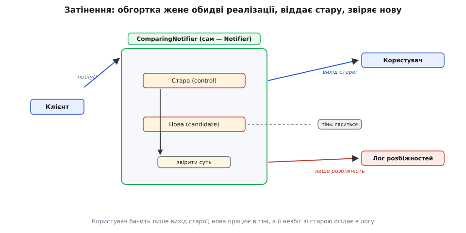

# ⚙️ Паралельний прогін старої й нової реалізацій зі звіркою виходу

Настає момент, коли нова реалізація за спільним швом уже написана, а стара ще жива поряд — і треба вирішити, чи можна перемикати на нову бойовий потік. Тести проходять, на localhost працює. Але тести перевіряють те, що ти **здогадався** перевірити, а стара реалізація за роки в експлуатації обросла поведінкою, якої ніхто вже не пам'ятає: якийсь кутовий випадок форматування, якесь мовчазне ковтання порожнього входу, якийсь порядок, на який хтось нижче за течією непомітно сперся. Перемкнути наосліп — це поставити на те, що нова реалізація відтворює **всю** цю поведінку, зокрема ту, про яку ти не знаєш. Ставка велика: якщо помилився, зламаєш це в бойовому потоці, на живих користувачах.

Є спосіб не ставити наосліп. Раз обидві реалізації живі одночасно за одним швом — можна на кожному справжньому виклику **гнати обидві** й **звіряти їхній вихід**, але користувачеві повертати й далі результат старої, перевіреної. Нова працює **в тіні**: її відповідь нікуди не йде, окрім порівняння. Кожна розбіжність між старою й новою — це знахідка, точний сигнал «ось тут нова поводиться інакше, ніж стара», зібраний на **реальних** даних, яких жоден тест не вигадав би. Ти накопичуєш цю статистику днями, вичищаєш розбіжності одну за одною — і перемикаєш аж тоді, коли на бойовому потоці нова вже давно дає те саме, що стара. Ставка перетворюється на впевненість, підперту фактом.

Цей прийом має усталену назву в англомовній практиці — **shadowing** (затінення) або **dark launch** (темний запуск): нова гілка бачить справжній трафік, але її результат гаситься, не доходячи до користувача. Термін «dark launch» увів Facebook близько 2008–2011 років, описуючи запуск чату — код нової служби вантажили в бойове середовище й гнали крізь нього справжні звернення, не малюючи жодного елемента інтерфейсу, щоб зміряти навантаження ще до відкриття функції. *(Це задокументована практика; Facebook пізніше називав свій інструмент керування доступом до функцій «Gatekeeper». Статус — усталено.)* Розберімо цей прийом руками: задача, ідея обгортки-звіряча, робочий код і — найважливіше — пастки, через які наївне «просто виклич обидві» тихо руйнує бойову систему.

## Задача: перевірити нову на бойових даних, не зачепивши користувача

Повернімося до сповіщень із задачі-власника. За швом `Notifier` живуть дві реалізації: стара `LegacyMailerNotifier`, що шле пошту саморобним поштарем, і нова `QueueNotifier`, що кладе повідомлення в чергу. Обидві виконують ту саму обіцянку — `notify(to, message)`. Нова написана, тести зелені. Питання одне: чи можна їй довіряти бойовий потік?

Наївна відповідь — «перемкнути прапорець і подивитися». Небезпека тут у тому, що **сповіщення — це побічний ефект, який видно користувачеві**. Якщо нова реалізація десь помиляється — не тому листу, не з тим текстом, не в той момент, — користувач одразу це отримає. Ти дізнаєшся про баг зі скарги, а не з логу, і платитимеш за нього репутацією, а не рядком у метриках.

Хочеться натомість такого: на кожному справжньому виклику `notify` **нова реалізація теж відпрацьовує**, ми **звіряємо** її результат зі старим, **записуємо** розбіжність, якщо вона є, — а користувачеві віддаємо результат **старої**, бо їй ми вже довіряємо. Нова тихо накопичує докази своєї правоти (або неправоти) на бойових даних, нічого не ламаючи.

Але тут-таки вигулькує головна складність, яка й робить цю задачу цікавою, а не тривіальною. `notify` **не повертає значення для порівняння** — вона щось **робить**: надсилає лист, кладе в чергу. Що тут звіряти? І гірше: якщо ми чесно викличемо **обидві**, користувач дістане **два** сповіщення — одне від старої, одне від нової. Затінення побічного ефекту — це не те саме, що затінення чистого обчислення, і саме ця відмінність визначає весь дизайн. Тримаймо її в голові; повернемося до неї, коли дійде до пасток.

Почнімо з простішого випадку, де порівнювати **є що** і побічного ефекту **нема**, — а тоді розберемося, що робити зі справжнім `notify`.

> 🔧 **Навіщо це.** Паралельний прогін зі звіркою — це найдешевший відомий спосіб купити впевненість у великій заміні. Альтернатива — перемкнути й ловити багато в бойовому потоці — коштує зламаних користувацьких сценаріїв, розслідувань за скаргами й нічних відкотів. Затінення переносить усю цю ціну **вперед**, у тихий період спостереження, де баг нової реалізації спливає рядком у логу розбіжностей, а не сваркою в підтримці. Ти платиш подвійним обчисленням і трохи складнішим кодом — і отримуєш заміну без сюрпризів.

## Ідея: обгортка, що звіряє, — теж реалізація шва

Ось у чому елегантність прийому. Звіряч — це не якийсь окремий механізм збоку. Це **ще одна реалізація того самого шва** `Notifier`, яка всередині тримає дві інші й керує ними. Клієнт її не відрізняє від будь-якого іншого `Notifier` — бо вона чесно виконує ту саму обіцянку. А всередині вона робить три речі: викликає стару (її результат — той, що піде клієнтові), викликає нову (в тіні), звіряє й логує розбіжність.

Це прямий доказ того, що шов проведено чесно. Якщо абстракція справді відв'язана від конкретних реалізацій, то в неї можна вставити **декоратор** — обгортку, яка сама є `Notifier` і містить `Notifier`, — і жоден клієнт цього не помітить. Звіряч-обгортка стає в той самий роз'єм, куди ставали стара й нова поодинці.


*Звіряч сам є реалізацією шва й тримає всередині стару та нову. Користувач бачить лише вихід старої; вихід нової затінено — він живе рівно доти, доки його порівняють зі старим, а розбіжність осідає в логу.*

Спершу візьмімо чистий випадок для ясності самого механізму звірки: нехай реалізація **повертає значення** й **не має побічного ефекту** — скажімо, `render(template, data): string`, що будує текст сповіщення. Стару верстку тексту міняємо на нову, і звіряти можна прямо рядок із рядком. Обгортка виглядає так:

:::tabs
```ts
interface Renderer {
  render(template: string, data: Record<string, unknown>): string;
}

// Звіряч — сам реалізація шва, тримає стару (control) й нову (candidate)
class ComparingRenderer implements Renderer {
  constructor(
    private control: Renderer,      // стара, їй довіряємо — її вихід іде клієнтові
    private candidate: Renderer,    // нова, у тіні
    private log: MismatchLog,
  ) {}

  render(template: string, data: Record<string, unknown>): string {
    const result = this.control.render(template, data);   // це піде користувачеві

    // Нова — в тіні. Її помилка НЕ сміє зачепити користувача,
    // тож ловимо все, що вона кине, і трактуємо як розбіжність.
    try {
      const shadow = this.candidate.render(template, data);
      if (shadow !== result) {
        this.log.mismatch({ template, control: result, candidate: shadow });
      }
    } catch (err) {
      this.log.candidateThrew({ template, error: err });
    }

    return result;                  // завжди повертаємо перевірене
  }
}
```
```py
from typing import Protocol, Any

class Renderer(Protocol):
    def render(self, template: str, data: dict[str, Any]) -> str: ...

# Звіряч — сам реалізація шва, тримає стару (control) й нову (candidate)
class ComparingRenderer:
    def __init__(self, control: Renderer, candidate: Renderer, log: "MismatchLog"):
        self._control = control      # стара, їй довіряємо — її вихід іде клієнтові
        self._candidate = candidate  # нова, у тіні
        self._log = log

    def render(self, template: str, data: dict[str, Any]) -> str:
        result = self._control.render(template, data)   # це піде користувачеві

        # Нова — в тіні. Її помилка НЕ сміє зачепити користувача,
        # тож ловимо все, що вона кине, і трактуємо як розбіжність.
        try:
            shadow = self._candidate.render(template, data)
            if shadow != result:
                self._log.mismatch(template=template, control=result, candidate=shadow)
        except Exception as err:
            self._log.candidate_threw(template=template, error=err)

        return result               # завжди повертаємо перевірене
```
:::

Придивись до двох рішень, які тут не випадкові. По-перше, результат клієнтові готують **першим**, зі старої, і повертають його **безумовно** — хай там що станеться з новою, користувач дістане перевірену відповідь. По-друге, виклик нової загорнутий у перехоплення **всіх** винятків: у тіні нова не має права впасти назовні. Її падіння — це теж розбіжність, ще й найважливіша: «на цьому вході нова взагалі не працює». Ловимо, логуємо, живемо далі. Ці дві риси — не прикраса, а суть безпечного затінення: **нова не впливає ні на результат, ні на живучість** гарячого шляху.

Це рівно та конструкція, яку GitHub 2016 року виніс у бібліотеку **Scientist** — інструмент «наукового» рефакторингу критичних шляхів. Її народила конкретна біда: інженер Рік Бредлі переписував складний ендпойнт, що повертав довгі списки репозиторіїв, і не мав певності, що тести покривають усі кутові випадки; тож він нашвидку вкрутив у код виклик нової реалізації поряд зі старою, який щоразу записував у метрики, коли нова поводилася **інакше**. З цього хаку й виросла бібліотека. *(Задокументовано; гем `scientist` 1.0.0 вийшов 3 лютого 2016 року, попередньо обкатаний усередині GitHub. Статус — усталено.)* Її словник — це точні наші ролі: старий блок звуть **control** (контроль), новий — **candidate** (кандидат), бібліотека завжди повертає результат контролю, звіряє з кандидатом і **публікує** розбіжності. Ми щойно написали руками рівно те, що вона робить.

Нова стоїть у роз'єм так само просто, як стояли стара й нова поодинці — на час спостереження замість готового `Renderer` збираємо звіряч:

:::tabs
```ts
// На час спостереження клієнт отримує звіряч замість готової реалізації
function makeRenderer(flags: Flags): Renderer {
  const legacy = new LegacyRenderer();
  const modern = new ModernRenderer();

  if (flags.enabled("render-shadow-compare")) {
    return new ComparingRenderer(legacy, modern, mismatchLog);
  }
  return flags.enabled("render-use-modern") ? modern : legacy;
}
```
```py
# На час спостереження клієнт отримує звіряч замість готової реалізації
def make_renderer(flags: "Flags") -> Renderer:
    legacy = LegacyRenderer()
    modern = ModernRenderer()

    if flags.enabled("render-shadow-compare"):
        return ComparingRenderer(legacy, modern, mismatch_log)
    return modern if flags.enabled("render-use-modern") else legacy
```
:::

Зверни увагу: сам факт затінення — теж під прапорцем. Затінення не безкоштовне (про його ціну — нижче), тож умикати його треба свідомо й вимикати, коли докази зібрано. Прапорців тут три стани світу: чисто стара, стара+тінь-нова, чисто нова — і ми рухаємося цими станами поступово.

## Розкочування прапорцем: 1% → 10% → 100%, і миттєвий відкіт

Затінення на **кожному** виклику одразу — теж ризик: якщо нова реалізація важка або десь підвисає, ти подвоїш навантаження на весь бойовий потік заради спостереження. Тому вмикають його **порціями**, спрямовуючи в тінь спершу крихітну частку викликів, і на кожному щаблі дивляться на дві речі: **частку розбіжностей** (скільки відсотків затінених викликів розійшлися) і **вартість** (наскільки нова просадила час і ресурс). Ось прапорець, що вміє відсоток:

:::tabs
```ts
interface Flags {
  // Детермінований відсоток: той самий ключ+ідентифікатор → та сама відповідь,
  // тож один користувач стабільно або в тіні, або ні — не мерехтить від виклику до виклику.
  sampled(key: string, id: string): boolean;
}

class ComparingRenderer implements Renderer {
  constructor(
    private control: Renderer,
    private candidate: Renderer,
    private log: MismatchLog,
    private flags: Flags,
  ) {}

  render(template: string, data: Record<string, unknown>): string {
    const result = this.control.render(template, data);

    // У тінь потрапляє лише вибрана відсотком частка викликів
    if (this.flags.sampled("render-shadow-percent", template)) {
      const started = performance.now();
      try {
        const shadow = this.candidate.render(template, data);
        this.log.timing("candidate", performance.now() - started);   // вартість
        if (shadow !== result) {
          this.log.mismatch({ template, control: result, candidate: shadow });
        }
      } catch (err) {
        this.log.candidateThrew({ template, error: err });
      }
    }
    return result;
  }
}
```
```py
from typing import Protocol
import time

class Flags(Protocol):
    # Детермінований відсоток: той самий ключ+ідентифікатор → та сама відповідь,
    # тож один користувач стабільно або в тіні, або ні — не мерехтить від виклику до виклику.
    def sampled(self, key: str, id: str) -> bool: ...

class ComparingRenderer:
    def __init__(self, control, candidate, log, flags):
        self._control, self._candidate = control, candidate
        self._log, self._flags = log, flags

    def render(self, template, data):
        result = self._control.render(template, data)

        # У тінь потрапляє лише вибрана відсотком частка викликів
        if self._flags.sampled("render-shadow-percent", template):
            started = time.perf_counter()
            try:
                shadow = self._candidate.render(template, data)
                self._log.timing("candidate", time.perf_counter() - started)  # вартість
                if shadow != result:
                    self._log.mismatch(template=template, control=result, candidate=shadow)
            except Exception as err:
                self._log.candidate_threw(template=template, error=err)
        return result
```
:::

Ключова тонкість тут — слово **детермінований** у коментарі до `sampled`. Наївний відсоток — це `random() < 0.01` на кожному виклику. Він працює для «затінити 1% викликів», але **ламається**, щойно один логічний суб'єкт (користувач, замовлення) робить кілька викликів: той самий користувач то потрапляє в тінь, то ні, мерехтить від запиту до запиту. Для чистого читання це терпимо, а от коли перемикання стосується стану — це катастрофа (користувач бачить нову поведінку на одному запиті й стару на наступному). Тому відсоток рахують **не від кидка монети, а від хешу стабільного ідентифікатора**: `hash(key + id) % 100 < percent`. Тоді рішення про конкретний `id` **стале в часі** — він або завжди в обраній частці, або завжди поза нею. Так виглядає чесна реалізація:

:::tabs
```ts
import { createHash } from "node:crypto";

class PercentFlags implements Flags {
  constructor(private percentByKey: Map<string, number>) {}

  sampled(key: string, id: string): boolean {
    const pct = this.percentByKey.get(key) ?? 0;   // 0 → вимкнено; 1, 10, 100 — щаблі
    if (pct >= 100) return true;
    if (pct <= 0) return false;
    // Хеш стабільного id → рівномірне число 0..99; те саме id → та сама відповідь
    const h = createHash("sha256").update(`${key}:${id}`).digest();
    const bucket = h.readUInt32BE(0) % 100;
    return bucket < pct;
  }
}
```
```py
import hashlib

class PercentFlags:
    def __init__(self, percent_by_key: dict[str, int]):
        self._percent_by_key = percent_by_key

    def sampled(self, key: str, id: str) -> bool:
        pct = self._percent_by_key.get(key, 0)     # 0 → вимкнено; 1, 10, 100 — щаблі
        if pct >= 100:
            return True
        if pct <= 0:
            return False
        # Хеш стабільного id → рівномірне число 0..99; те саме id → та сама відповідь
        digest = hashlib.sha256(f"{key}:{id}".encode()).digest()
        bucket = int.from_bytes(digest[:4], "big") % 100
        return bucket < pct
```
:::

Тепер розкочування — це рух одного числа в конфізі, без розгортання коду:

```
render-shadow-percent:  0  →  1  →  10  →  50  →  100
                        │     │      │      │       │
                        │     │      │      │       └─ уся тінь: нова бачить весь потік,
                        │     │      │      │          статистика розбіжностей повна
                        │     │      │      └─ половина: вартість під навантаженням видна
                        │     │      └─ 10%: перші рідкісні кутові випадки повилазили
                        │     └─ 1%: перший дотик бойових даних, ловимо грубі розбіжності
                        └─ вимкнено: звіряч стоїть, але нову не гукає
```

На кожному щаблі ти дивишся в лог. Порожній лог розбіжностей на 1% нічого не доводить — 1% може просто не зачепити рідкісний вхід, на якому нова падає. Тому щабель підіймають лише коли поточний **чистий**: розбіжностей нема (або всі пояснені й прийнятні), а вартість терпима. Побачив сплеск розбіжностей чи те, що нова просаджує час, — **вертаєш число назад**, у конфізі, миттєво. Відкіт тут безкоштовний рівно тому ж, чому й у самого прийму branch by abstraction: перемикання — це не розгортання, а поворот прапорця. Дійшовши до чистих 100% тіні, ти вже маєш повну картину: нова на **всьому** бойовому потоці кілька днів дає те саме, що стара. Аж тоді перемикаєш **справжній** прапорець — той, що робить нову активною, — і її вихід уперше йде користувачеві. Ставки більше нема: є доведений факт.

Ось увесь шлях затінення, розкладений на щаблі й рішення на кожному:

```
1. Постав звіряч у роз'єм (прапорець render-shadow-compare = увімк).
2. render-shadow-percent: 0 → 1.  Дивись лог розбіжностей і timing.
3. Чисто? → 10.  Брудно? → назад на 0, лагодь нову, повтори.
4. Чисто? → 50 → 100.  На кожному щаблі те саме рішення.
5. 100% тіні кілька днів чисто → перемикай СПРАВЖНІЙ прапорець на нову.
6. Нова активна й стабільна → прибери звіряч, стару й прапорці (стан 5 прийому).
```

## Пастка перша: недетермінізм — розбіжність, якої нема

Перший затінений прогін майже завжди залляє лог розбіжностями, і більшість із них — **фальшиві**. Причина в тім, що стара й нова реалізації виконуються **не в ту саму мить** і **не тим самим викликом**, тож усе, що залежить від моменту чи від зовнішнього стану, у них законно різне — а наївне порівняння «біт у біт» кричить про розбіжність там, де насправді все гаразд.

Найтиповіші джерела фальшивих розбіжностей:

- **Час.** Стара підставила `now()` на мілісекунду раніше за нову. Результати містять різні мітки часу — і `!==` спрацював, хоча логіка ідентична.
- **Ідентифікатори.** Кожна реалізація згенерувала свій `UUID`, свій номер запиту. Вони **мусять** бути різні — це не баг.
- **Порядок.** Стара повернула список у одному порядку, нова — у іншому, а семантично множина та сама (наприклад, порядок ключів у сериалізованому об'єкті).
- **Випадковість і зовнішній стан.** Один звернувся до кешу, що між двома викликами встиг оновитися; один узяв інший елемент з-під балансувальника.

Ліки — **порівнювати не сирий вихід, а його суть**, нормалізувавши все несуттєве. Це те саме місце, де бібліотека Scientist дає гак `compare` замість голого `==`: ти сам кажеш, що означає «однаково» для **цієї** пари реалізацій. Практично — зводиш обидва результати до канонічного вигляду (виполюєш мітки часу, згенеровані id, сортуєш колекції) і порівнюєш уже його:

:::tabs
```ts
// Порівнюємо СУТЬ, а не сирий вихід: нормалізуємо все, що законно різне
function sameNotification(a: Notification, b: Notification): boolean {
  const canon = (n: Notification) => ({
    to: n.to,
    body: n.body.trim(),
    // мітку часу й згенерований id викидаємо — вони МУСЯТЬ різнитися
    attachments: [...n.attachments].sort(),   // порядок несуттєвий → сортуємо
  });
  return JSON.stringify(canon(a)) === JSON.stringify(canon(b));
}
```
```py
import json

# Порівнюємо СУТЬ, а не сирий вихід: нормалізуємо все, що законно різне
def same_notification(a: "Notification", b: "Notification") -> bool:
    def canon(n):
        return {
            "to": n.to,
            "body": n.body.strip(),
            # мітку часу й згенерований id викидаємо — вони МУСЯТЬ різнитися
            "attachments": sorted(n.attachments),   # порядок несуттєвий → сортуємо
        }
    return json.dumps(canon(a), sort_keys=True) == json.dumps(canon(b), sort_keys=True)
```
:::

Тут ховається пастка в пастці. Нормалізацію легко перестаратися: якщо ти виполеш **забагато**, то замаскуєш **справжню** розбіжність. Скажімо, збив обидві мітки часу до однакового значення «щоб не шуміло» — і проґавив, що нова помилилася в часовому поясі на години. Нормалізація мусить прибирати рівно те, що **законно** недетерміноване, і жодним рухом більше. Кожен виполений вимір — це свідоме «тут різниця не має значення, і ось чому»; якщо ти не можеш це договорити, вимір лишай і розбирайся з розбіжністю по суті.

> 🔧 **Навіщо це.** Фальшиві розбіжності від недетермінізму — головна причина, чому команди закидають затінення, ледь почавши: лог тоне в тисячах «розбіжностей», у яких насправді нічого не розійшлося, і сигнал губиться в шумі. Час, витрачений на чесну нормалізацію **перед** розкочуванням, окупається одразу: після неї кожен запис у логу — **справжня** знахідка, а не артефакт того, що дві функції запустилися в різні наносекунди. Порівнюєш суть, а не годинник.

## Пастка друга: побічні ефекти обох гілок — не можна робити двічі по-справжньому

Тепер повернімося до відкладеного — і це найважча пастка, та, що відрізняє затінення чистого обчислення від затінення дії. `render` повертав рядок і **нічого не робив** — його безпечно кликати двічі. Але справжній `notify` **надсилає лист**. Якщо звіряч чесно викличе стару й нову, користувач дістане **два** сповіщення. Затінення, задумане непомітним, стало помітним найгрубіше.

Це загальний закон: **затінювати можна лише реалізацію без зовнішнього побічного ефекту — читання, обчислення, перетворення.** Щойно гілка **пише** назовні (шле лист, знімає гроші, кладе рядок у базу, публікує в чергу), її не можна виконати «в тіні по-справжньому», бо зовнішній ефект тінь не ховає — його побачить світ. Бібліотека Scientist каже це прямо в документації: вона безпечна лише для методів, що **не міняють даних**; для тих, що міняють, затінення в лоб не годиться.

Виходів із цього три, і вибір між ними — окреме інженерне рішення.

**Перший — розділити рішення й дію (найкращий, коли можливий).** Часто побічний ефект — це лише **останній** крок, а вся складність, яку варто звіряти, сидить у **обчисленні перед ним**: кому слати, з яким текстом, чи слати взагалі. Тоді виділяємо чисту частину — «вирішити, що надіслати» — і затінюємо **її**, а сам «надіслати» лишаємо поза звіркою, одноразовим, зі старої гілки. Це те саме розчеплення на [чисте ядро й побічний ефект на краю](book:programming/pure-functions-side-effects), лише прикладене до затінення: звіряємо ядро, дію не чіпаємо.

:::tabs
```ts
// Розчеплюємо: РІШЕННЯ (чисте, звіряємо) окремо від ДІЇ (ефект, не дублюємо)
interface NotificationPlanner {
  plan(order: Order): NotificationPlan;   // кому, що, чи слати — чисте, без ефекту
}

class NotifyService {
  constructor(
    private planner: NotificationPlanner,   // сюди підставляємо ComparingPlanner
    private send: (plan: NotificationPlan) => void,   // ефект — поза звіркою
  ) {}

  notify(order: Order): void {
    const plan = this.planner.plan(order);   // тут стара й нова звіряються В ТІНІ
    this.send(plan);                          // а шлемо РІВНО РАЗ, за планом старої
  }
}
```
```py
from typing import Protocol, Callable

# Розчеплюємо: РІШЕННЯ (чисте, звіряємо) окремо від ДІЇ (ефект, не дублюємо)
class NotificationPlanner(Protocol):
    def plan(self, order: "Order") -> "NotificationPlan": ...   # кому, що, чи слати — чисте

class NotifyService:
    def __init__(self, planner: NotificationPlanner, send: Callable[["NotificationPlan"], None]):
        self._planner = planner   # сюди підставляємо ComparingPlanner
        self._send = send         # ефект — поза звіркою

    def notify(self, order: "Order") -> None:
        plan = self._planner.plan(order)   # тут стара й нова звіряються В ТІНІ
        self._send(plan)                    # а шлемо РІВНО РАЗ, за планом старої
```
:::

Тепер `ComparingPlanner` — це наш звіряч із першого прикладу, тільки над `plan()`: обидві планувалки рахують план, ми звіряємо два **плани** (чисті дані!), а надсилає систему **один** план — старий. Уся ризикована логіка перевірена на бойових даних, а лист пішов один. Це найчистіший вихід, і він майже завжди досяжний, бо в більшості дій справді є що відокремити: рішення — окремо, ефект — окремо.

**Другий — тіньовий ефект (dry-run): нова гілка робить свою дію «понарошку».** Коли рішення від дії не відокремити чисто, нову реалізацію заганяють у **режим сухого прогону**: вона проходить увесь свій шлях, але на самому краю замість справжнього надсилання **записує, що́ надіслала б**. Тоді звіряти можна намір нової з дією старої, а світ бачить лише дію старої.

:::tabs
```ts
// Нова у сухому режимі: доходить до краю, але не шле — лише фіксує намір
class DryRunQueueNotifier implements Notifier {
  constructor(private captured: NotificationPlan[]) {}
  notify(to: string, message: string) {
    // весь реальний шлях побудови повідомлення — крім останнього кроку publish()
    this.captured.push({ to, body: message });   // намір, а не дія
  }
}
```
```py
# Нова у сухому режимі: доходить до краю, але не шле — лише фіксує намір
class DryRunQueueNotifier:
    def __init__(self, captured: list["NotificationPlan"]):
        self._captured = captured
    def notify(self, to: str, message: str) -> None:
        # весь реальний шлях побудови повідомлення — крім останнього кроку publish()
        self._captured.append({"to": to, "body": message})   # намір, а не дія
```
:::

Сухий прогін слабший за розчеплення: він перевіряє нову **майже** до кінця, але **не** сам фінальний запис у чергу — а саме там може ховатися своя біда (черга відхилила формат, впав серіалізатор). Тому dry-run бере на віру найостанніший крок; це компроміс, на який ідуть, коли рішення й дію не розчепити.

**Третій — обов'язкова умова: якщо ефект **ідемпотентний**, обидві гілки можуть писати по-справжньому.** Рідкісний, але важливий випадок: коли дія влаштована так, що **повтор нічого не змінює**. Наприклад, обидві гілки записують один і той самий рядок за одним ключем — друга запис просто перезаписує той самий стан. Тоді хай пишуть обидві: світ побачить один результат. Ключове слово тут — [ідемпотентність](book:programming/idempotency): операція, яку можна безпечно повторити з тим самим наслідком. Надсилання листа **не** ідемпотентне (два листи — це два листи), а от «встановити поле профілю в значення X» — ідемпотентне. Перевір цю властивість **чесно**, перш ніж покластися на неї: якщо помиляєшся, дублюватимеш ефект у бойовому потоці.

Одне речення, що стягує всю пастку: **затінюй обчислення, а не дію**; якщо в реалізації є зовнішній ефект — або відокрем його від рішення й звіряй рішення, або жени нову сухим прогоном, або (лише якщо ефект справді ідемпотентний) дозволь писати обом. Наївне «виклич обидві» без цієї перевірки — прямий шлях надіслати кожному користувачеві по два листи.

## Пастка третя: подвійне виконання коштує грошей

І остання, тверезлива. Затінення означає, що на кожному затіненому виклику система виконує роботу **двічі** — стару й нову. Це не безкоштовно, і ціну треба бачити наперед, а не відкривати з рахунку за хмару.

Розкладімо, за що саме платиш:

- **Процесор і час.** Дві реалізації замість однієї. Якщо нова важча за стару (а часто саме тому її й переписують — щоб потім була легша, але **зараз**, сира, вона може бути повільнішою), затінення на 100% потоку може відчутно просадити пропускну здатність. Ось чому в звіряч вкручено `timing`: вартість — рівноправна метрика поряд із розбіжностями.
- **Зовнішні виклики й гроші.** Якщо нова гілка б'є в платний зовнішній сервіс (запит до API з погодинною тарифікацією, звернення до бази під навантаженням), кожен затінений виклик — це реальна копійка або реальне навантаження на залежність, помножені на частку затінення.
- **Латентність, якщо звіряти синхронно.** У наших прикладах нова гілка виконувалася **послідовно** зі старою, тобто додавала свій час до відповіді користувачеві. Для дешевої нової це дрібниця, для важкої — ні.

Останній пункт має пряме пом'якшення: якщо нова гілка **читає** (не пише) і її результат потрібен лише для звірки, а не користувачеві, — її виконують **асинхронно**, поза гарячим шляхом. Стара відповідає користувачеві **негайно**, а нова доганяє в тіні, коли встигне, і звірку роблять уже після того, як користувач отримав своє. Тоді затінення взагалі не додає латентності — лишається тільки вартість процесора й зовнішніх викликів:

:::tabs
```ts
render(template: string, data: Record<string, unknown>): string {
  const result = this.control.render(template, data);   // користувач отримує ЦЕ негайно

  if (this.flags.sampled("render-shadow-percent", template)) {
    // Нова доганяє в тіні поза гарячим шляхом — латентності користувачеві не додає.
    queueMicrotask(() => {
      try {
        const shadow = this.candidate.render(template, data);
        if (shadow !== result) this.log.mismatch({ template, control: result, candidate: shadow });
      } catch (err) {
        this.log.candidateThrew({ template, error: err });
      }
    });
  }
  return result;   // не чекаємо на тінь
}
```
```py
import asyncio

def render(self, template, data):
    result = self._control.render(template, data)   # користувач отримує ЦЕ негайно

    if self._flags.sampled("render-shadow-percent", template):
        # Нова доганяє в тіні поза гарячим шляхом — латентності користувачеві не додає.
        async def shadow_run():
            try:
                shadow = self._candidate.render(template, data)
                if shadow != result:
                    self._log.mismatch(template=template, control=result, candidate=shadow)
            except Exception as err:
                self._log.candidate_threw(template=template, error=err)
        asyncio.get_event_loop().create_task(shadow_run())
    return result   # не чекаємо на тінь
```
:::

Асинхронна тінь знімає латентність, але **не** знімає вартості процесора й зовнішніх викликів — робота все одно робиться двічі. Саме тому затінення — **тимчасовий** режим, а не постійний: його вмикають на дні спостереження й вимикають, щойно докази зібрано. Тримати звіряч у бойовому потоці «про всяк випадок» назавжди — значить платити подвійним обчисленням вічно, а це вже [технічний борг](book:programming/technical-debt), не страховка. Затінення — це риштування навколо заміни: поки міграція йде — воно тримає, коли добудовано — його знімають.

Ось чому відсоткове розкочування бере до уваги **обидві** осі, а не саму лише правильність. Ти піднімаєш частку затінення, лише коли поточний щабель чистий **і** за розбіжностями (нова дає те саме), **і** за вартістю (нова коштує терпимо). Дійшовши до 100% чистих за обома — маєш повне право перемикати, знаючи не тільки що нова **правильна**, а й що вона по кишені. А після перемикання — прибираєш звіряч, як прибирають ліси з добудованого дому.

## Що лишається в руках

Паралельний прогін зі звіркою перетворює найстрашніший момент великої заміни — «перемикаю й молюся» — на тихе накопичення доказів. Обгортка-звіряч сама є реалізацією шва: вона тримає стару й нову, повертає користувачеві перевірене зі старої, а нову жене в тіні й звіряє. Розкочують затінення відсотком — 1% → 10% → 100% — на детермінованому за стабільним id прапорці, дивлячись на кожному щаблі і на розбіжності, і на вартість, і відкочуючи миттєво поворотом числа в конфізі. Перемикають справжній прапорець аж тоді, коли на всьому бойовому потоці нова кілька днів дає те саме, що стара, — за терпимою ціною.

Три пастки визначають, де прийом працює, а де ламається. Недетермінізм заллє лог фальшивими розбіжностями — тож порівнюй **суть**, нормалізувавши час, id і порядок, але не виполюючи справжньої різниці. Побічний ефект обох гілок не сховати в тінь — тож затінюй **обчислення, а не дію**: відокрем рішення від ефекту й звіряй рішення, або жени нову сухим прогоном, або (лише за чесної ідемпотентності) дозволь писати обом. Подвійне виконання коштує процесора, грошей і, якщо звіряти синхронно, латентності — тож звіряй читання асинхронно поза гарячим шляхом і пам'ятай, що затінення тимчасове, а не вічне.

Стягуючи все в одне: **раз обидві реалізації живі поряд за одним швом, змусь їх працювати разом, поки не переконаєшся, — гони обидві на бойових даних, звіряй суть виходу, розкочуй відсотком з миттєвим відкотом, і ніколи не затінюй те, що пише назовні, без розчеплення дії від рішення.** Тоді перемикання перестає бути стрибком через прірву й стає останнім рядком у логу, де розбіжностей уже давно нема.
