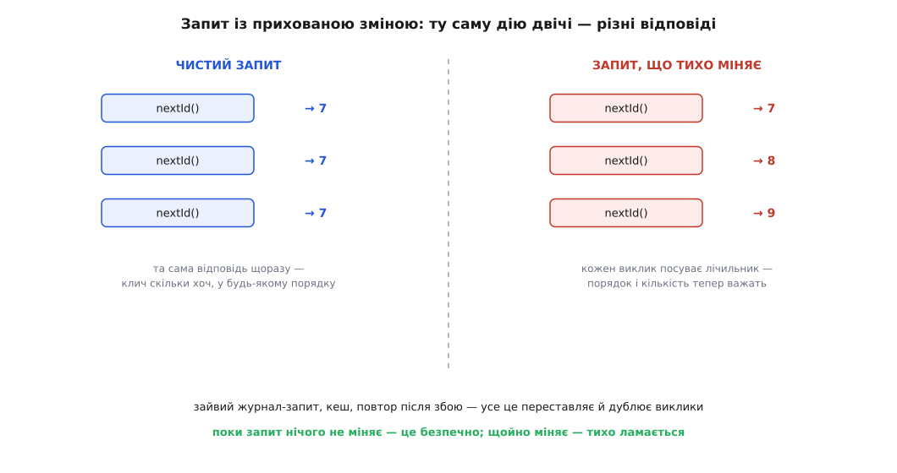

# Розділення команд і запитів (CQS)

<preknowlist>
- [Інтерфейс проти реалізації](topic:programming/interface-vs-implementation) — різниця між тим, ЩО метод обіцяє зовні, і тим, ЯК влаштований усередині; CQS — правило саме про обіцянку в підписі методу.
- [Чисті функції і побічні ефекти](topic:programming/pure-functions-side-effects) — що таке побічний ефект (зміна стану поза поверненням) і чому виклик без ефектів безпечніший; запит у CQS — це майже чиста функція.
- [Інкапсуляція](topic:programming/encapsulation) — дані й правила над ними живуть за однією стіною; CQS ділить те, що крізь цю стіну проходить, на два роди — «зроби» і «скажи».
</preknowlist>

Уяви, що питаєш касира: «скільки в мене на рахунку?» — а він, називаючи суму, тихцем списує з тебе гривню за довідку. Питання нешкідливе, ти ставиш його часто, іноді двічі поспіль, щоб пересвідчитися, — і щоразу непомітно бідніший. Ти нічого не наказував, ти лише **запитав**, а стан світу від твого запитання змінився. У житті це шахрайство; у коді — звичайнісінький метод, який пишуть щодня, не помічаючи, що накоїли.

Правило, яке каже так не робити, зветься **розділенням команд і запитів** (англ. *Command–Query Separation*, скорочено CQS). Формулюється воно в одне речення: **кожен метод — або команда, що щось міняє й нічого не повертає, або запит, що щось повертає й нічого не міняє, але ніколи обидва разом.** Або, ще коротше, як любив казати автор правила: **питання не повинно міняти відповідь.**

На перший погляд це схоже на дрібну стилістичну примху — ну хочеться комусь, щоб методи були охайні. Насправді за цим стоїть різниця, від якої залежить, чи можна довіряти власному коду, коли на нього дивишся. Розберімося чому, і почнемо з того, що це взагалі за два роди методів.

## Два роди: «зроби це» і «скажи мені»

Будь-який метод, який ти викликаєш на об'єкті, робить одне з двох. Або він **щось змінює** в світі — списує гроші, зберігає запис, вимикає пристрій, додає рядок у список. Або він **щось повідомляє** тобі про світ — скільки на рахунку, чи порожній кошик, який розмір черги. Перше — команда (лат. *commando* — доручаю), наказ у формі методу: «зроби це». Друге — запит (англ. *query*, від лат. *quaerere* — шукати, питати): «скажи мені».


*Два чисті роди й заборонений між ними гібрид. Команда діє й мовчить; запит відповідає й не чіпає. Метод, що робить і те, й те, — саме та пастка, проти якої існує правило.*

Різниця видна вже в підписі, ще до тіла методу. Команда зазвичай нічого не повертає — її результат не значення, а **зміна стану**: `account.withdraw(200)`, `order.cancel()`, `list.add(item)`. Запит навпаки — весь його сенс у поверненому значенні, і стану він чіпати не має: `account.balance()`, `cart.isEmpty()`, `queue.size()`. Правило CQS ставить між цими родами стіну: метод належить рівно одному з них. `balance()` не сміє списувати комісію. `withdraw()` не сміє повертати «новий залишок», спокушаючи викликача читати стан через дію.

> 🔧 **Навіщо це.** Поглянь на будь-який незнайомий метод у чужому коді. Якщо ти твердо знаєш, що всі запити тут нічого не міняють, то `if (account.balance() > 0)` читається спокійно: перевірка нешкідлива, її можна поставити де завгодно, повторити, обгорнути в лог. Коли ж цієї гарантії немає, кожне читання стає підозрілим — а раптом воно щось робить? Ти вже не можеш просто дивитися на код, ти мусиш **лізти всередину кожного запиту** й перевіряти, чи він, бува, не кусається. CQS — це обіцянка, яка звільняє від цієї підозри: запит безпечний, крапка.

## Чому це не косметика: прихована зміна ламає тихо

Найглибша причина розділяти команду й запит — не охайність, а те, що трапляється, коли їх злити. Запит із прихованим побічним ефектом — це найпідступніший рід помилки, бо він **не падає**. Він тихо дає різні відповіді на те саме питання, і код довкола, написаний із розрахунку на нешкідливе читання, починає поводитися дивно там, де ти найменше цього чекаєш.

Візьмімо метод, що видає наступний ідентифікатор. Назва `nextId()` звучить як запит — «скажи мені наступний номер». Але всередині він тихцем інкрементує лічильник, тож насправді це прихована команда, замаскована під запит:

:::tabs
```ts
class IdSource {
  private counter = 6;
  // виглядає як запит, а насправді МІНЯЄ стан щовиклику
  nextId(): number {
    this.counter += 1;
    return this.counter;
  }
}
```
```python
class IdSource:
    def __init__(self) -> None:
        self._counter = 6

    # виглядає як запит, а насправді МІНЯЄ стан щовиклику
    def next_id(self) -> int:
        self._counter += 1
        return self._counter
```
:::

А тепер уяви цілком буденні речі, які роблять із запитами, бо запити ж безпечні. Хтось додає рядок у журнал: `log("видаю id " + source.nextId())` — поруч із реальним використанням `save(source.nextId())`. Тепер об'єкт з'їв **два** номери там, де мав з'їсти один, і в базу пішов не той id, що в лозі. Хтось інший, оптимізуючи, вирішує кешувати «дороге» читання. Хтось третій обгортає виклик у повтор після збою мережі — і повтор посуває лічильник ще раз. Кожна з цих дій цілком законна над справжнім запитом і руйнівна над цим самозванцем.



*Та сама послідовність викликів дає різне залежно від того, чи запит чистий. Поки він нічого не міняє, повтори й перестановки нешкідливі. Щойно міняє — кожен зайвий виклик зсуває стан, і код, що покладався на безпечність читання, ламається без жодної помилки.*

Ось де корінь. Коли запит чистий, у тебе є **свобода**, за яку не треба платити: виклики запитів можна переставляти місцями, повторювати, кешувати їхній результат — і жодна з цих дій нічого не зіпсує, бо чіпати нема чого. Ця свобода — тиха, ти нею користуєшся щохвилини, навіть не називаючи: пишеш `total()` двічі в сусідніх рядках і певен, що обидва рази те саме число. Прихована зміна цю свободу забирає — і забирає **мовчки**, не попереджаючи компілятором чи падінням, а лише дивною поведінкою через три екрани звідси.


*Що дає поділ. Запит, який нічого не міняє, стає безпечним у три способи одразу — його можна вільно переставляти, повторювати й кешувати. Команда цих вольностей позбавлена, зате вся зміна стану зібрана в неї, а не розлита по методах, що видають себе за нешкідливі.*

Це та сама думка, що живе в понятті [чистої функції](topic:programming/pure-functions-side-effects): виклик, який лише обчислює відповідь із входів і нічого не чіпає, можна аналізувати, кешувати й переставляти, бо він **прозорий за посиланням** — вираз можна замінити його значенням, і програма не помітить. CQS не вимагає від запиту повної чистоти (запит може читати поля об'єкта, тобто залежати від стану), але вимагає головного її боку: запит не має **міняти** нічого спостережуваного. Це послаблена, але страшенно практична форма тієї самої гарантії.

## Звідки взялося: Меєр, Eiffel і контракти

Правило не з'явилося з повітря — його сформулював [Бертран Меєр (Bertrand Meyer), французький інформатик, творець мови Eiffel](topic:programming/command-query-separation/hist-meyer-cqs.md), у книзі «Object-Oriented Software Construction» (перше видання — 1988, Prentice Hall). Це усталений факт, а не пізніша легенда: термін і його канонічне формулювання йдуть саме звідти.

Варто знати, звідки Меєр до цього дійшов, бо це пояснює, чому правило в нього таке безкомпромісне. Eiffel будувалася навколо **проєктування за контрактом** (англ. *Design by Contract*): кожен метод має передумову (що мусить бути істинним, аби його викликати) і постумову (що він гарантує по завершенні), і ці умови — частина коду, а не коментаря. У такій системі запит, що потайки міняє стан, — катастрофа: він руйнує саму можливість міркувати про контракти. Якщо `balance()` при виклику щось списує, то передумова наступного методу, яка спирається на баланс, стає невизначеною — бо сам факт її перевірки зсунув те, що перевіряють. CQS у Меєра — не окрема забаганка, а **необхідна підпора** під контракти: лише коли запити безсторонні, їх можна вільно вставляти в передумови й інваріанти, не боячись, що перевірка зіпсує перевірюване.

Тому в Eiffel поділ на команди й запити не порада, а частина культури мови, як і сам механізм контрактів. Це рідкість: більшість мов правило CQS ніяк не підтримують, лишаючи його на совісті програміста. Найближче до підтримки підходить `const` у C++ — позначка, що метод не міняє об'єкта, тобто по суті оголошення «це запит», яку компілятор береться стерегти. Але навіть вона перевіряє лише фізичну незмінність бітів об'єкта, а не ширшу обіцянку «жодного спостережуваного ефекту».

## Чесний виняток: коли злити доводиться

Тепер найважче — бо сліпе дотримання правила теж робить код гіршим, і про це чесно писав уже сам Меєр, а ще пряміше — [Мартін Фаулер](topic:programming/command-query-separation/hist-meyer-cqs.md). Є випадки, де команда й запит зрослися так, що розчепити їх коштує дорожче, ніж лишити.

Класичний приклад — `pop()` у стека. Він **і** знімає верхній елемент (команда, міняє стан), **і** повертає його (запит). За чистим CQS це порушення, і його можна розвести на `top()` (подивитися верхній, нічого не знявши) плюс окремий `pop()` (зняти, нічого не повернувши). Але така пара відкриває бридку **гонитву**: між твоїм `top()` і твоїм `pop()` інший потік може встигнути щось зробити зі стеком, і ти знімеш не те, що бачив. Атомарний «зняти-і-віддати» тут не примха, а спосіб зробити операцію неподільною. Фаулер формулює свою позицію без викрутасів: «я волію дотримуватися цього принципу, коли можу, але готовий порушити його заради свого `pop`».

Той самий випадок — ітератор із методом `next()`, що й повертає поточний елемент, і посуває курсор далі; або лічильник, де атомарний `incrementAndGet()` навмисне поєднує зміну й читання, щоб між ними не влізла гонитва. У всіх цих випадках злиття команди й запиту — свідоме інженерне рішення заради атомарності, а не недбалість.

Як же відрізнити чесний виняток від прихованого баґа? Питанням про **чесність підпису**. `pop()` не бреше: усі знають, що він і знімає, і віддає, — це в природі стека, назва не обіцяє нешкідливості. Натомість `balance()`, що списує комісію, або `nextId()`, що посуває лічильник, **брешуть**: їхні назви кажуть «я лише питаю», а вони діють. Правило CQS насправді захищає не так букву «команда окремо, запит окремо», як **чесність**: метод не повинен виглядати нешкідливим запитом, а поводитися як команда. Де поєднання очевидне з назви й потрібне для атомарності — воно чесне. Де воно потайне — це та сама пастка з касиром і гривнею.

> 🔧 **Навіщо це.** Практичне правило на щодень: порушуй CQS лише тоді, коли поєднання **видно з назви** й воно потрібне для неподільності операції. `pop`, `next`, `incrementAndGet` — чесні, бо ніхто не сплутає їх із безневинним читанням. Але щойно ти ловиш себе на тому, що метод із назвою-запитом (`get…`, `is…`, `find…`, `calculate…`) десь усередині щось зберігає, шле, лічить чи міняє — це не виняток, це помилка, яку треба розчепити, поки вона не почала давати різні відповіді на те саме питання.

## Як помітити й розчепити порушення

На практиці порушення CQS рідко виглядають зухвало — це не хтось навмисне сховав `save()` у `get()`. Частіше вони наростають непомітно: метод-запит колись був чистим, а потім у нього дописали «лінивий» кеш, «до речі, оновимо лічильник відвідувань», «заодно залогуємо». Кожне доповнення здавалося дрібним, а разом вони перетворили безневинне читання на приховану команду.

Найпростіший сигнал, який видно очима, — **назва свідчить про запит, а тіло щось міняє**. Метод зветься `getUser`, `isReady`, `calculateTotal`, `findOrder` — назва обіцяє відповідь без наслідків, — а всередині є присвоєння полю, виклик `save`, надсилання події, зміна колекції. Це майже завжди варте розчеплення. Загальна форма ліків одна: **витягни зміну в окрему команду, лиши в запиті тільки повернення**. Було одне «прочитати й потихеньку записати» — стало явна команда, що змінює, і чистий запит, що лише відповідає; викликач тепер сам вирішує, коли міняти, а коли просто дивитися. Як саме проводити таке розчеплення на реальному брудному коді — крок за кроком, разом із хитрішими випадками на кшталт лінивої ініціалізації та кешу, де зміна прихована «нешкідливо», — розбирає [покроковий рефакторинг запиту з побічним ефектом у чисту пару команда-запит](topic:programming/command-query-separation/proj-split-query-side-effect.md).

Окремо варто назвати випадок, який плутають найчастіше, — **лінива ініціалізація**. Метод `getConnection()` при першому виклику створює з'єднання, а далі повертає збережене. Формально він міняє стан (кешує з'єднання), тобто порушує CQS. Але зовні цей ефект **непомітний**: скільки не клич `getConnection()`, ти щоразу дістаєш те саме з'єднання, і жоден твій виклик не зсуває спостережувану відповідь. Такий «прихований» ефект, що не проступає назовні, більшість вважає прийнятним — він не забирає в тебе тієї свободи переставляти й повторювати, заради якої правило й існує. Межа тут не «чи є присвоєння всередині», а «**чи бачить викликач різницю**»: якщо ні — правило по суті дотримане, хай навіть біти й ворухнулися.

## Коли правило виростає з методу в архітектуру

CQS живе на рівні одного методу — це його природний масштаб. Але та сама думка, піднята на кілька поверхів угору, стає одним із помітних архітектурних прийомів. Якщо на рівні методу ми не змішуємо команду й запит в одну процедуру, то чому б на рівні цілого застосунку не розвести **бік команд** і **бік запитів** у дві окремі моделі — одну, заточену на зміну стану з усіма правилами, і другу, заточену на швидке читання під екрани?

Саме це робить [CQRS](topic:programming/cqrs) — розділення відповідальності команд і запитів: те саме розрізнення, але вже не між двома методами на спільних даних, а між двома моделями, кожна зі своїм типом, схемою і шляхом крізь код. Назва навіть дзеркалить CQS не випадково — це визнання родоводу. Але важливо не сплутати масштаби: CQS — дешеве, майже безкоштовне правило дисципліни, якого варто триматися **скрізь**; CQRS — вагоме архітектурне рішення з власною ціною, яке беруть лише під конкретним тиском. Одне — гігієна на кожен метод, друге — інструмент проти рідкої, але реальної проблеми, коли одна модель не тягне і запис, і читання.

І в цьому вся практична вага CQS. Це не велике рішення, яке треба зважувати, — це маленька постійна звичка, що коштує майже нічого й окупається щодня. Розділяючи те, що діє, і те, що відповідає, ти лишаєш у коді дорогоцінну властивість: **на запити можна дивитися спокійно**. Читання нічого не ламає, його можна повторити, переставити, обгорнути логом, — і саме ця тиха певність, помножена на тисячі місць у програмі, робить код таким, якому знову можна довіряти з першого погляду.
