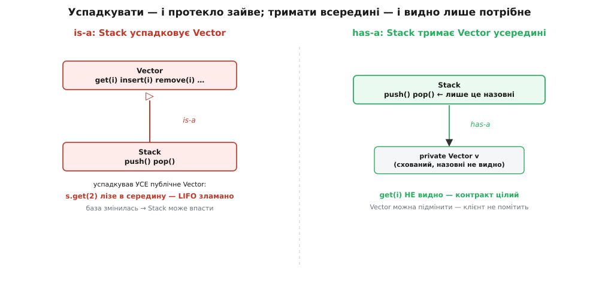

# Композиція над спадкуванням

<preknowlist>
- [Інтерфейс проти реалізації](book:programming/interface-vs-implementation) — різниця між тим, ЩО тип обіцяє назовні, і тим, ЯК він це робить усередині; спадкування небезпечне саме тим, що протикає реалізацію крізь межу.
- [Принцип абстракції в програмуванні](book:programming/abstraction-principle) — чому одну ідею ховають за назвою, а деталі лишають усередині; на цьому стоїть уся розмова про інкапсуляцію.
</preknowlist>

Коли в об'єктній мові з'являється потреба **перевикористати** вже написаний код, під рукою лежать два різні інструменти, і на око вони роблять те саме. Перший — **спадкування (англ. *inheritance*)**: оголошуєш новий клас нащадком старого, і він одразу отримує всі його поля та методи задарма. Другий — **композиція (лат. *compositio* — складання докупи)**: кладеш старий об'єкт полем усередину нового й делегуєш йому потрібну роботу. Обидва дають доступ до чужої поведінки. Але наслідки в них — протилежні, і саме тому автори класичної книги про патерни проєктування винесли в один із головних принципів об'єктного дизайну коротку фразу: **надавай перевагу композиції об'єктів над спадкуванням класів**.

Розберімося, чому ця порада — не смак і не мода, а прямий висновок із того, що спадкування ламає рівно ту межу, заради якої вся об'єктність і затівалась.

## Дві форми зв'язку: «є» проти «має»

Найточніше різницю видно, якщо промовити зв'язок словами. Спадкування каже: нащадок **є** різновидом предка (англ. *is-a*). `Коло` **є** `Фігурою`; `Собака` **є** `Твариною`. Композиція каже: об'єкт **має** щось усередині (англ. *has-a*). `Машина` **має** `Двигун`; `Замовлення` **має** список `Товарів`.

Це не гра слів. «Є» — це заява про **тотожність виду**: усюди, де очікують предка, нащадок мусить підійти без застережень, бо він і справді той самий вид, лише конкретніший. «Має» — це заява про **володіння**: об'єкт користується іншим як інструментом, тримає його при собі, але сам ним не стає й нічого про його вид не обіцяє.

І от у чому підступ. Мова дозволяє написати `extends` (успадкувати) там, де за змістом мало б стояти «має». Синтаксично помилки немає, код збереться. А зв'язок вийде брехливий — і за нього доведеться платити щоразу, коли предка чіпатимуть.

## Спадкування протикає реалізацію крізь межу

Уся об'єктність тримається на одній обіцянці: об'єкт ховає своє нутро й спілкується зі світом лише через оголошений [інтерфейс](book:programming/interface-vs-implementation). Клієнт знає, **що** об'єкт уміє, і не знає — та й не мусить — **як** він це робить. Зміни реалізацію всередині, лиши інтерфейс тим самим, і жоден клієнт не помітить. Ця стіна між «що» і «як» зветься **інкапсуляцією (лат. *in capsula* — у коробочці)**, і вона — головна причина, чому великі програми взагалі вдається супроводжувати.

Спадкування цю стіну **пробиває зсередини**. Нащадок бачить не тільки публічний інтерфейс предка — він бачить його `protected`-нутрощі, може викликати внутрішні методи, покладається на те, в якому порядку предок робить свою роботу. Нащадок знає предка **не як чорну коробку, а як відкриту схему**. Тому будь-яка зміна в предку, навіть цілком безпечна на вигляд, здатна тихо зламати нащадка. Автори того самого принципу сформулювали це різко: **спадкування ламає інкапсуляцію**.

Явище має власну назву — **проблема крихкого базового класу (англ. *fragile base class problem*)**. Крихка вона тому, що дивлячись **лише** на код предка, ти не можеш сказати, чи безпечна твоя правка: безпечність залежить від того, як саме на цей код спираються нащадки, а їх можуть бути десятки в різних файлах і навіть у чужих проєктах. Проблема визріла наприкінці 1980-х із поширенням C++, а коли в 1995-му виходила Java, її автори свідомо додали гарантії двійкової сумісності, щоб бодай частину цього болю зняти. Історію народження самого принципу та проблеми крихкої бази — хто, коли і в якій суперечці це виклав — розгорнуто в [окремій нотатці](book:programming/composition-inheritance/hist-gof-principle.md).

> 🔧 **Навіщо це.** Крихка база — не теоретичний острах. Класичний доказ лежить у стандартній бібліотеці Java: `Stack` там оголошено нащадком `Vector` (`class Stack extends Vector`). Наслідок — катастрофа контракту: стек мав би пускати лише `push`/`pop` згори, але через успадкований `get(i)`, `insert(i)`, `remove(i)` у нього **протекли** всі методи вектора. Тепер будь-хто може залізти в середину стека за індексом і зламати LIFO-порядок, заради якого стек і існує. Сьогоднішня документація Java прямо радить замість цього класу брати `Deque` — але прибрати старий `Stack` уже не можна, бо на нього зав'язаний чужий код. Один необдуманий `extends` двадцять років не дає нічого виправити.



*Той самий стек двома способами. Успадкуєш вектор — і крізь межу протече все зайве, ламаючи саму суть стека. Триматимеш вектор усередині приватним полем — і назовні вийде рівно те, що ти дозволив.*

Полагодити цей приклад легко — і лагодить його саме композиція. Замість «стек **є** вектор» скажи «стек **має** вектор усередині»:

:::tabs
```cpp
// Було: контракт протікає — успадкували ВЕСЬ вектор
class Stack : public std::vector<int> {   // s.at(2), s.insert(...) — усе відкрито
public:
    void push(int x) { push_back(x); }
    int  pop() { int x = back(); pop_back(); return x; }
};

// Стало: вектор СХОВАНО полем, назовні лише push/pop
class Stack {
    std::vector<int> data;                // приватне — клієнт його не бачить
public:
    void push(int x) { data.push_back(x); }
    int  pop() { int x = data.back(); data.pop_back(); return x; }
    bool empty() const { return data.empty(); }
};
```
```python
# Було: контракт протікає — успадкували ВЕСЬ список
class Stack(list):                        # s[2], s.insert(...) — усе відкрито
    def push(self, x): self.append(x)
    def pop_top(self): return self.pop()

# Стало: список СХОВАНО полем, назовні лише push/pop
class Stack:
    def __init__(self):
        self._data = []                   # приватне — клієнт його не бачить
    def push(self, x): self._data.append(x)
    def pop(self): return self._data.pop()
    def empty(self): return not self._data
```
:::

У другому варіанті `data` — приватне поле, і `get(i)` назовні просто немає: контракт стека цілий. Ба більше, тепер вільно підмінити `std::vector` на `std::deque` чи власне сховище — жоден клієнт не зачепиться, бо він ніколи й не знав, що всередині вектор. Це і є повернута інкапсуляція: композиція **не протикає** реалізацію, вона її **ховає**.

## Друга біда спадкування: класи вибухають

Навіть коли зв'язок «є» чесний, у спадкування є вада, що б'є по великих системах ще боляче. Клас часто треба уточнювати **одразу за кількома незалежними осями** — а спадкування вміє нарощувати лише одну лінію нащадків. Осі починають перемножуватися.

Уяви ворога в грі. Він відрізняється **зброєю** (меч чи лук) і **бронею** (легка, важка, магічна). Спробуй укласти це спадкуванням — і доведеться завести клас на кожну **комбінацію**: `МечоносецьУЛегкій`, `МечоносецьУВажкій`, `ЛучникУМагічній`… Дві зброї на три броні — уже шість класів. Додай отруту — стане дванадцять. Додай здатність літати — двадцять чотири. **Кожна нова вісь не додає, а множить.** Це і є славнозвісний **вибух підкласів**: дерево нащадків розростається як добуток осей і швидко стає некерованим.


*Спадкування вимагає окремий клас під кожну комбінацію осей — їхня кількість росте як добуток. Композиція тримає осі окремими наборами деталей, і кількість росте як сума; комбінацію збирають уже під час роботи.*

Композиція розриває добуток на суму. Ворог не **успадковує** зброю й броню — він їх **має**: тримає всередині поле «зброя» і поле «броня», а конкретну поведінку кожного бере як окрему змінну деталь. Тоді двом видам зброї й трьом видам броні відповідають **два плюс три — п'ять** незалежних деталей, і будь-яку з шести комбінацій збирають, просто підставивши потрібну пару вже під час роботи:

:::tabs
```cpp
// Кожна вісь — окремий інтерфейс поведінки
struct Weapon { virtual int  hit()   const = 0; virtual ~Weapon() = default; };
struct Armor  { virtual int  block() const = 0; virtual ~Armor()  = default; };

struct Sword : Weapon { int hit()   const override { return 10; } };
struct Bow   : Weapon { int hit()   const override { return 6;  } };
struct Light : Armor  { int block() const override { return 2;  } };
struct Heavy : Armor  { int block() const override { return 7;  } };

// Ворог НЕ успадковує зброю чи броню — він їх ТРИМАЄ
class Enemy {
    std::unique_ptr<Weapon> weapon;
    std::unique_ptr<Armor>  armor;
public:
    Enemy(std::unique_ptr<Weapon> w, std::unique_ptr<Armor> a)
        : weapon(std::move(w)), armor(std::move(a)) {}
    int attack() const { return weapon->hit(); }
    int defend() const { return armor->block(); }
};

// Будь-яку комбінацію збирають на місці — нового класу не треба
Enemy archer(std::make_unique<Bow>(), std::make_unique<Heavy>());
```
```python
# Кожна вісь — окремий інтерфейс поведінки
class Weapon: 
    def hit(self):   ...   # скільки шкоди завдає
class Armor:  
    def block(self): ...   # скільки шкоди тримає

class Sword(Weapon): 
    def hit(self):   return 10
class Bow(Weapon):   
    def hit(self):   return 6
class Light(Armor):  
    def block(self): return 2
class Heavy(Armor):  
    def block(self): return 7

# Ворог НЕ успадковує зброю чи броню — він їх ТРИМАЄ
class Enemy:
    def __init__(self, weapon, armor):
        self.weapon = weapon
        self.armor  = armor
    def attack(self): return self.weapon.hit()
    def defend(self): return self.armor.block()

# Будь-яку комбінацію збирають на місці — нового класу не треба
archer = Enemy(Bow(), Heavy())
```
:::

Щоб додати арбалет, пишеш **один** новий клас `Crossbow` — і він одразу поєднується з усіма бронями, які вже є. У світі спадкування довелось би завести стільки нових класів, скільки є видів броні. Різниця «сума проти добутку» на кількох осях перетворюється на прірву. Повний перехід «дерево-вибух → композиція» на робочому C++ — з обома версіями поряд, підрахунком, скільки класів дає кожен підхід, і чесним виміром ціни делегувальних обгорток — розібрано в [окремому проєкті-рефакторингу](book:programming/composition-inheritance/proj-strategy-refactor.md).

> 🔧 **Навіщо це.** Це той самий важіль, що й [принцип відкритості-закритості (OCP)](book:programming/open-closed): систему хочеться розширювати, **не переписуючи** наявне. Композиція дає це майже дарма — нову поведінку додаєш новою деталлю, стару не чіпаєш. А ще кожна деталь тут — окрема **стратегія**, яку можна підмінити навіть під час роботи програми: змінив ворогові зброю на льоту — і жодного нового типу не знадобилось. Цей самий хід «винеси змінну поведінку в об'єкт, що підставляється» оформлений як окремий патерн [Стратегія](book:programming/strategy).

## «Є» — це обіцянка підстановки, а не спосіб зекономити код

Звідки ж береться спокуса писати `extends` не там, де слід? З того, що спадкування **на вигляд економніше**: одним словом отримуєш чужі поля й методи, не набираючи делегувальних обгорток. Спокуса — трактувати спадкування як **інструмент перевикористання коду**. Саме тут корінь помилки.

Спадкування — це **не про перевикористання**, а про **заміщуваність**. Коли ти кажеш «`B` **є** `A`», ти обіцяєш світові, що будь-де, де код працює з `A`, туди можна тихо підставити `B` — і все лишиться коректним. Це строга обіцянка, і вона зветься **принципом підстановки Лісков (англ. *Liskov substitution*)**, за іменем Барбари Лісков, яка сформулювала його ще в 1980-х. Нащадок мусить не просто **мати** методи предка, а **поводитися** як предок скрізь, де на предка розраховують.

Класичний доказ від протилежного — прямокутник і квадрат. Математично квадрат **є** прямокутник, тож рука тягнеться написати `Квадрат extends Прямокутник`. Але прямокутник обіцяє: постав ширину — висота не зміниться. Квадрат цю обіцянку **порушує**: у нього сторони рівні, тож зміна ширини мусить потягти висоту. Код, що спокійно працював із прямокутником («поставив ширину 5, висоту 4, чекаю площу 20»), отримавши квадрат, раптом дасть 25. Нащадок **має** всі методи предка — і все одно **не є** ним, бо порушив обіцянку поведінки. Формальний бік цього принципу — коваріантність, передумови й постумови, інваріанти — виведено в [окремому розборі підстановки Лісков](book:programming/liskov-substitution).

Звідси й практичне правило-фільтр: перш ніж написати `extends`, спитай не «чи хочу я тутешні методи?», а «чи справді мій клас **підійде всюди**, де очікують базовий, не зламавши жодної обіцянки?». Якщо відповідь «ні» — тобі потрібне «має», не «є». Композиція.

## Коли спадкування таки доречне

З усього цього не випливає «спадкування — зло, ніколи не вживай». Випливає інше: спадкування — **вузький інструмент із чіткими показаннями**, а не спосіб за замовчуванням тягати чужий код. Воно доречне, коли збігаються всі умови:

Зв'язок **є справжнім і сталим «є»** — нащадок чесно проходить перевірку Лісков і залишиться таким надалі. База **спроєктована під успадкування навмисно**: її автор подумав, які методи можна перевизначати й у якому порядку вони викликаються, і **задокументував** це. Правило тут відоме: базу або проєктуй і документуй під спадкування — **або заборони його** (у C++ це `final`). Спадкувати від класу, який просто **опинився поруч** і має зручні методи, — і є та помилка, від якої застерігає принцип.

Найчистіший випадок, де спадкування безпечне майже завжди, — **успадкування самого інтерфейсу**, а не реалізації: абстрактний базовий клас без жодного тіла методів (в C++ — суто віртуальні функції, `= 0`). Тут протікати нема чому — предок не має нутрощів, лише перелік обіцянок, — тож крихка база просто не виникає. Саме так і треба читати повну назву принципу: перевагу віддають композиції об'єктів над спадкуванням **класів** (реалізації), тимчасом як спадкування **інтерфейсів** — цілком здоровий фундамент, на якому стоїть, зокрема, [інверсія залежностей (DIP)](book:programming/dependency-inversion).

## Ціна композиції — і чому вона зазвичай варта того

Чесність вимагає назвати й видаток. Композиція **не безкоштовна**: замість одного слова `extends` пишеш поле й **делегувальні методи** — короткі обгортки, що переадресовують виклик усередину (`void push(int x) { data.push_back(x); }`). Це трохи більше набору й ще один рівень непрямості: щоб побачити, що станеться, треба знати, який саме об'єкт зараз лежить у полі.

Але подивись, що ти за цю ціну купуєш. Інкапсуляцію не пробито — нутро сховане, його вільно міняти. Осі не перемножуються — кількість деталей росте сумою, а комбінації збираються під час роботи. Поведінку можна **підмінити на льоту**, чого жорстке дерево нащадків не вміє в принципі. І зв'язок чесний: «має» нічого не обіцяє про вид, тож і зламати цю обіцянку нема як. За кілька зайвих рядків обгорток ти отримуєш систему, яку не боляче міняти, — а міняють код майже весь час його життя. Тому типова відповідь і звучить як **надавай перевагу** композиції: не «завжди», а «за замовчуванням, поки спадкування не довело своє право конкретними показаннями».

Зрештою, увесь цей вибір — окремий випадок ширшої дисципліни: тримати [зчеплення слабким, а зв'язність високою](book:programming/coupling-cohesion). Спадкування реалізації — це найтісніше зчеплення з усіх можливих: нащадок зрощений із нутром предка. Композиція те зчеплення послаблює до тонкої лінії — публічного інтерфейсу деталі. Обирати «має» замість «є» щоразу, коли «є» не є строго обов'язковим, — значить щодня, дрібними рішеннями, тримати систему такою, яку ще можна змінити завтра.
