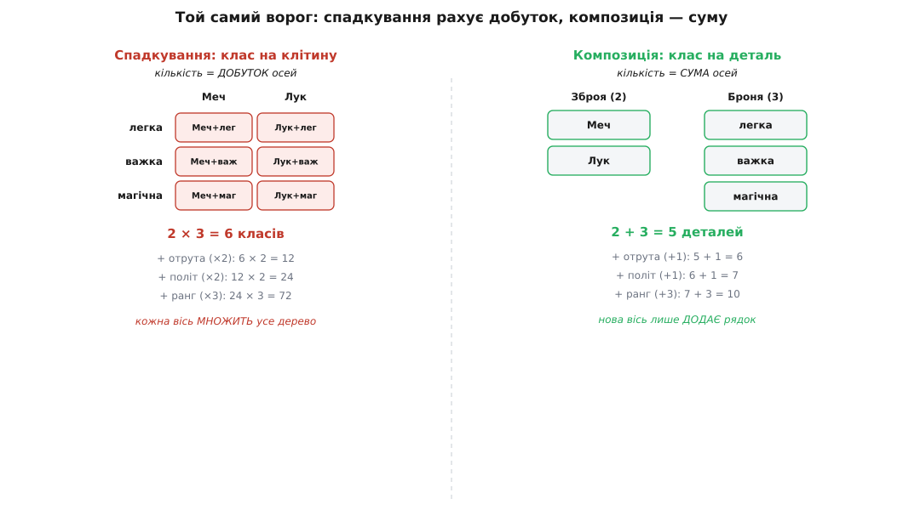
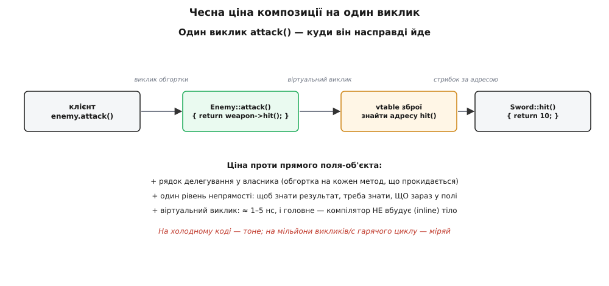

# ⚙️ Рефакторинг «дерево-вибух → композиція» на робочому C++: рахуємо класи, міряємо ціну

Про перевагу композиції легко сказати гаслом: «не плоди підкласи, підставляй поведінку». Гасло правдиве, але порожнє доти, доки не сядеш переписувати справжній код і не побачиш на власні очі, як одна нова вимога добудовує до ієрархії не один клас, а цілий поверх. Тому візьмемо конкретну, до болю знайому задачу з ігрового коду, доведемо наївну спадкову ієрархію до стану, коли вона тріщить, порахуємо **точно**, скільки класів дає кожна нова вісь, а тоді перепишемо те саме на композицію — і так само точно порахуємо, у що ця перемога обходиться. Не «композиція краща», а: ось стільки класів там, ось стільки деталей тут, ось стільки рядків обгорток і наносекунд на виклик доводиться доплатити, і ось де ця доплата перестає окупатися.

Увесь код нижче — робочий C++, який компілюється як є (стандарт C++14 і новіший). Обидві версії стоятимуть поряд, щоб різницю було видно не на словах, а в самих типах.

## Задача: ворог, що росте за кількома осями

Уяви бойову систему. Ворог у ній визначається кількома **незалежними** характеристиками. Спершу двома:

- **зброя** — чим б'є: меч, лук;
- **броня** — чим тримає удар: легка, важка.

Кожна характеристика дає своє число — зброя вирішує, скільки шкоди завдає атака, броня — скільки шкоди поглинає захист. Поки що це весь функціонал: ворог уміє `attack()` (повернути завдану шкоду) і `defend()` (повернути поглинуту). Дрібниця, здавалося б.

Але задача не статична — вона **росте**, і саме в цьому вся сіль. За тиждень дизайнер приносить третю вісь: **стихія** зброї (звичайна, вогняна, крижана) — вона додає ефект понад базову шкоду. За ще тиждень — четверту: **рух** (піший, кінний, летючий), що міняє, як ворог наближається. І це не кінець; так у грі буває завжди — осей стає більше, а не менше.

Питання, на яке чесно відповідає ця вставка, вузьке й кількісне: **скільки нового коду коштує кожна така нова вісь** — за спадкового підходу й за композиційного? Бо саме вартість «додати ще одну вимогу» вирішує, чи житиме система, чи задихнеться під власною вагою.

## Наївний старт: клас на кожну комбінацію

Найпряміший об'єктний рефлекс — на кожен **вид** ворога завести свій клас. Меченосець — клас. Лучник — клас. Але ж меченосець буває в легкій броні й у важкій, і поводяться вони по-різному (різна шкода, різний захист), тож…

Тут і криється пастка, у яку так легко впасти. Оскільки зброя й броня незалежні, а поведінка залежить від **обох**, окремий тип доводиться заводити на кожну їхню **комбінацію**. Не «меченосець», а «меченосець-у-легкій» і «меченосець-у-важкій» — окремо. Ось цей код, чесно доведений до кінця:

:::tabs
```cpp
#include <cstdio>

// Базовий ворог: обіцяє два числа — завдану й поглинуту шкоду.
class Enemy {
public:
    virtual int attack() const = 0;   // скільки шкоди завдає
    virtual int defend() const = 0;   // скільки шкоди тримає
    virtual ~Enemy() = default;
};

// Кожна КОМБІНАЦІЯ зброя×броня — окремий клас.
class SwordLight : public Enemy {
public:
    int attack() const override { return 10; }  // меч
    int defend() const override { return 2;  }   // легка
};
class SwordHeavy : public Enemy {
public:
    int attack() const override { return 10; }  // меч
    int defend() const override { return 7;  }   // важка
};
class BowLight : public Enemy {
public:
    int attack() const override { return 6; }   // лук
    int defend() const override { return 2; }    // легка
};
class BowHeavy : public Enemy {
public:
    int attack() const override { return 6; }   // лук
    int defend() const override { return 7; }    // важка
};
```
```python
from abc import ABC, abstractmethod

# Базовий ворог: обіцяє два числа — завдану й поглинуту шкоду.
class Enemy(ABC):
    @abstractmethod
    def attack(self): ...   # скільки шкоди завдає
    @abstractmethod
    def defend(self): ...   # скільки шкоди тримає

# Кожна КОМБІНАЦІЯ зброя×броня — окремий клас.
class SwordLight(Enemy):
    def attack(self): return 10   # меч
    def defend(self): return 2    # легка
class SwordHeavy(Enemy):
    def attack(self): return 10   # меч
    def defend(self): return 7    # важка
class BowLight(Enemy):
    def attack(self): return 6    # лук
    def defend(self): return 2    # легка
class BowHeavy(Enemy):
    def attack(self): return 6    # лук
    def defend(self): return 7    # важка
```
:::

Два види зброї, дві броні — **чотири** класи. Код компілюється, працює, і на цьому масштабі навіть виглядає невинно. Але вже тут видно перший тривожний знак: подивись, скільки разів повторилося число `10`. Меч завдає десять і в `SwordLight`, і в `SwordHeavy` — та сама логіка меча продубльована в кожному класі, де меч зустрічається. Зміниш баланс меча на `12` — правити доведеться у **двох** місцях, а забудеш одне — дістанеш ворога, що б'є мечем по-різному залежно від броні. Це вже прямий підрив [принципу DRY](topic:programming/dry-kiss-yagni): та сама істина про меч живе у двох копіях, і копії розповзаються.

Тепер додаймо третю вісь — **броню «магічна»** — і порахуймо, що станеться.

:::tabs
```cpp
// Додаємо ОДНУ броню — а класів доводиться дописати стільки,
// скільки є видів зброї:
class SwordMagic : public Enemy {
public:
    int attack() const override { return 10; }
    int defend() const override { return 5; }
};
class BowMagic : public Enemy {
public:
    int attack() const override { return 6; }
    int defend() const override { return 5; }
};
// Було 4 → стало 6. Одна нова броня коштувала ДВА класи.
```
```python
# Додаємо ОДНУ броню — а класів доводиться дописати стільки,
# скільки є видів зброї:
class SwordMagic(Enemy):
    def attack(self): return 10
    def defend(self): return 5
class BowMagic(Enemy):
    def attack(self): return 6
    def defend(self): return 5
# Було 4 → стало 6. Одна нова броня коштувала ДВА класи.
```
:::

Ось воно, серце проблеми, у голих числах. Одна нова броня додала не один клас, а **стільки класів, скільки є видів зброї**. Бо кожен новий різновид однієї осі мусить одружитися з **кожним** наявним різновидом усіх інших осей. Кількість класів — це не сума видів по осях, це їхній **добуток**:

```
осі             види          класів (добуток)
зброя           2
броня           3             2 × 3 = 6
```

І далі кожна нова вісь не додає до цього числа, а **множить** його:

```
+ стихія  (3 види):   2 × 3 × 3        = 18 класів
+ рух     (3 види):   2 × 3 × 3 × 3    = 54 класи
+ ранг    (5 видів):  2 × 3 × 3 × 3 × 5 = 270 класів
```



*Той самий ворог, порахований двома способами. Спадкування вимагає клас на кожну клітину матриці — кількість росте як добуток видів по осях. Композиція тримає осі окремими стовпчиками деталей — кількість росте як сума, а комбінацію збирають уже під час роботи.*

Двісті сімдесят класів на п'ять осей — і це ще скромна гра. Але справжня катастрофа навіть не в самому числі. Вона в тому, що **кожен** із цих класів дублює логіку своїх складників. Число «шкода меча = 10» після додавання всіх осей живе у `2×3×3×5 / 2 = 135` копіях — у кожному класі, де є меч. Один рядок балансу — сто тридцять п'ять місць для правки й сто тридцять п'ять шансів схибити. Це вже не незручність, це система, яку **фізично неможливо супроводжувати**.

> 🔧 **Навіщо це.** Порахуй добуток осей своєї реальної моделі, перш ніж заводити клас на комбінацію. Три осі по три-чотири види — і ти вже за сотнею класів, кожен з яких дублює чужу логіку. Це та точка, де «просто ще один підклас» перестає бути дрібним рішенням: воно тихо зобов'язує тебе до цілого поверху нових типів на кожну наступну вимогу. Побачив у моделі кілька незалежних осей, за якими об'єкт уточнюється, — це майже завжди сигнал, що комбінувати їх треба **композицією**, а не множити спадкуванням.

## Ідея: винести кожну вісь в окремий об'єкт, що підставляється

Корінь вибуху — в тому, що спадкування вміє нарощувати лише **одну** лінію нащадків, а ми силуємо його виразити **кілька незалежних** осей одразу. Кожна вісь тягне свою лінію, лінії перемножуються — звідси добуток.

Розв'язок — перестати кодувати вісь **типом ворога** й почати кодувати її **окремим об'єктом усередині ворога**. Ворог не *є* меченосцем-у-важкій; ворог *має* зброю (яка знає, як бити) і *має* броню (яка знає, як тримати). Зброя й броня стають самостійними об'єктами зі своєю поведінкою, а ворог лише **тримає** їх у полях і делегує їм роботу.

Кожна вісь дістає свій **інтерфейс поведінки** — маленький абстрактний клас, що оголошує рівно одну операцію цієї осі. Конкретні різновиди осі — це реалізації інтерфейсу, і їх рівно стільки, скільки видів на осі, **незалежно** від інших осей. Меч — один клас `Sword`, і він поєднується з будь-якою бронею без жодного нового типу.

Такий винесений у підставний об'єкт «змінний шматок поведінки» має усталену назву — **стратегія (англ. *strategy*)**. Це один із класичних патернів проєктування: банда чотирьох (Erich Gamma, Richard Helm, Ralph Johnson, John Vlissides) у книзі «Design Patterns» 1994 року сформулювала його намір дослівно так — *визначити родину алгоритмів, загорнути кожен окремо й зробити їх взаємозамінними, щоб алгоритм міг мінятися незалежно від клієнта, який ним користується* (усталене формулювання, підтверджене за першоджерелом). Наша зброя й броня — це рівно родини взаємозамінних алгоритмів: «як завдати шкоди» і «як поглинути шкоду». Ширше цей патерн — як окрему ідею, а не лише прийом рефакторингу — розібрано в темі про [стратегію](topic:programming/strategy).

Ключова перевага, заради якої все й затівається: кількість класів із **добутку** перетворюється на **суму**. Дві зброї плюс три броні — це `2 + 3 = 5` класів-стратегій, і всі шість комбінацій збираються з них уже під час роботи, підстановкою потрібної пари. Нова вісь тепер лише **додає** свій стовпчик, а не множить усе дерево.

## Робочий код: композиційна версія поряд

Ось те саме, переписане на стратегії. Зверни увагу, як зникло дублювання: число «шкода меча = 10» тепер живе в **одному** місці — у класі `Sword`, — хоч би скільки осей ми додали згодом.

:::tabs
```cpp
#include <cstdio>
#include <memory>
#include <utility>

// ── Вісь «зброя»: інтерфейс + різновиди (по одному класу на вид) ──
struct Weapon {
    virtual int  hit()  const = 0;      // скільки шкоди завдає
    virtual const char* name() const = 0;
    virtual ~Weapon() = default;
};
struct Sword : Weapon {
    int hit() const override { return 10; }       // логіка меча — В ОДНОМУ місці
    const char* name() const override { return "меч"; }
};
struct Bow : Weapon {
    int hit() const override { return 6; }
    const char* name() const override { return "лук"; }
};

// ── Вісь «броня»: інтерфейс + різновиди ──
struct Armor {
    virtual int  block() const = 0;     // скільки шкоди тримає
    virtual const char* name() const = 0;
    virtual ~Armor() = default;
};
struct Light : Armor {
    int block() const override { return 2; }
    const char* name() const override { return "легка"; }
};
struct Heavy : Armor {
    int block() const override { return 7; }
    const char* name() const override { return "важка"; }
};
struct Magic : Armor {
    int block() const override { return 5; }
    const char* name() const override { return "магічна"; }
};

// ── Ворог НЕ успадковує осі — він їх ТРИМАЄ полями ──
class Enemy {
    std::unique_ptr<Weapon> weapon;     // яка зброя зараз
    std::unique_ptr<Armor>  armor;      // яка броня зараз
public:
    Enemy(std::unique_ptr<Weapon> w, std::unique_ptr<Armor> a)
        : weapon(std::move(w)), armor(std::move(a)) {}

    // Делегувальні обгортки: ворог не рахує сам, а перепитує деталь.
    int attack() const { return weapon->hit();  }
    int defend() const { return armor->block(); }

    void describe() const {
        std::printf("ворог: %s + %s → атака %d, захист %d\n",
                    weapon->name(), armor->name(), attack(), defend());
    }
};
```
```python
# ── Вісь «зброя»: інтерфейс + різновиди (по одному класу на вид) ──
class Weapon:
    def hit(self):  ...   # скільки шкоди завдає
    def name(self): ...
class Sword(Weapon):
    def hit(self):  return 10        # логіка меча — В ОДНОМУ місці
    def name(self): return "меч"
class Bow(Weapon):
    def hit(self):  return 6
    def name(self): return "лук"

# ── Вісь «броня»: інтерфейс + різновиди ──
class Armor:
    def block(self): ...   # скільки шкоди тримає
    def name(self):  ...
class Light(Armor):
    def block(self): return 2
    def name(self):  return "легка"
class Heavy(Armor):
    def block(self): return 7
    def name(self):  return "важка"
class Magic(Armor):
    def block(self): return 5
    def name(self):  return "магічна"

# ── Ворог НЕ успадковує осі — він їх ТРИМАЄ полями ──
class Enemy:
    def __init__(self, weapon, armor):
        self.weapon = weapon        # яка зброя зараз
        self.armor  = armor         # яка броня зараз

    # Делегувальні обгортки: ворог не рахує сам, а перепитує деталь.
    def attack(self): return self.weapon.hit()
    def defend(self): return self.armor.block()

    def describe(self):
        print(f"ворог: {self.weapon.name()} + {self.armor.name()} → "
              f"атака {self.attack()}, захист {self.defend()}")
```
:::

Порахуймо тепер те, що коштувало 6 класів у спадковій версії. Тут — `Weapon`, `Sword`, `Bow` (три сутності на вісь зброї) і `Armor`, `Light`, `Heavy`, `Magic` (чотири на вісь броні). Формально це більше **іменованих** типів, ніж 6, — і чесний спостерігач мусить це визнати, а не замовчати. Але дивись, що станеться далі, коли осі почнуть рости, — саме там ховається справжня різниця.

Складання конкретного ворога — це не оголошення нового класу, а звичайний вираз, який пишуть **під час роботи**:

:::tabs
```cpp
int main() {
    // Будь-яка комбінація збирається на місці — БЕЗ нового типу.
    Enemy knight(std::make_unique<Sword>(), std::make_unique<Heavy>());
    Enemy archer(std::make_unique<Bow>(),   std::make_unique<Light>());
    Enemy mage  (std::make_unique<Sword>(), std::make_unique<Magic>());

    knight.describe();   // ворог: меч + важка → атака 10, захист 7
    archer.describe();   // ворог: лук + легка → атака 6,  захист 2
    mage.describe();     // ворог: меч + магічна → атака 10, захист 5
    return 0;
}
```
```python
# Будь-яка комбінація збирається на місці — БЕЗ нового типу.
knight = Enemy(Sword(), Heavy())
archer = Enemy(Bow(),   Light())
mage   = Enemy(Sword(), Magic())

knight.describe()   # ворог: меч + важка → атака 10, захист 7
archer.describe()   # ворог: лук + легка → атака 6,  захист 2
mage.describe()     # ворог: меч + магічна → атака 10, захист 5
```
:::

Три різні вороги — жодного нового класу. У спадковій версії кожен із цих рядків вимагав би окремого типу, оголошеного заздалегідь; тут вони — просто три різні набори деталей, зібрані на льоту.

### Ось де композиція починає вигравати: додаємо вісь

Уся розмова про «суму проти добутку» лишається абстрактною, доки не додаси нову вимогу й не порахуєш **обидві** ціни поряд. Зробімо це. Дизайнер приніс вісь **стихія** — три види: звичайна, вогняна, крижана.

У **спадковій** версії це означає: узяти кожен із наявних 6 класів і розмножити його на 3 стихії. Було 6 — стало 18. Дописати доведеться **12 нових класів**, кожен — знову з продубльованою логікою зброї й броні.

У **композиційній** — це означає дописати рівно один новий інтерфейс і три його реалізації:

:::tabs
```cpp
// Нова вісь — новий інтерфейс + по одному класу на вид. І ВСЕ.
struct Element {
    virtual int  bonus() const = 0;     // додаткова шкода від стихії
    virtual const char* name() const = 0;
    virtual ~Element() = default;
};
struct Plain : Element {
    int bonus() const override { return 0; }
    const char* name() const override { return "звичайна"; }
};
struct Fire : Element {
    int bonus() const override { return 4; }
    const char* name() const override { return "вогонь"; }
};
struct Ice : Element {
    int bonus() const override { return 3; }
    const char* name() const override { return "крига"; }
};
```
```python
# Нова вісь — новий інтерфейс + по одному класу на вид. І ВСЕ.
class Element:
    def bonus(self): ...   # додаткова шкода від стихії
    def name(self):  ...
class Plain(Element):
    def bonus(self): return 0
    def name(self):  return "звичайна"
class Fire(Element):
    def bonus(self): return 4
    def name(self):  return "вогонь"
class Ice(Element):
    def bonus(self): return 3
    def name(self):  return "крига"
```
:::

А в самому ворогові — одне нове поле й один допис у делегуванні:

:::tabs
```cpp
class Enemy {
    std::unique_ptr<Weapon>  weapon;
    std::unique_ptr<Armor>   armor;
    std::unique_ptr<Element> element;    // ← нове поле
public:
    Enemy(std::unique_ptr<Weapon> w, std::unique_ptr<Armor> a,
          std::unique_ptr<Element> e)
        : weapon(std::move(w)), armor(std::move(a)), element(std::move(e)) {}

    // атака тепер = базова шкода зброї + бонус стихії
    int attack() const { return weapon->hit() + element->bonus(); }
    int defend() const { return armor->block(); }
};
```
```python
class Enemy:
    def __init__(self, weapon, armor, element):
        self.weapon  = weapon
        self.armor   = armor
        self.element = element    # ← нове поле

    # атака тепер = базова шкода зброї + бонус стихії
    def attack(self): return self.weapon.hit() + self.element.bonus()
    def defend(self): return self.armor.block()
```
:::

Порахуймо різницю прямо, бо саме заради неї весь рефакторинг:

```
додали вісь «стихія» (3 види)

спадкування:   6 класів  →  18 класів   (+12 нових класів, добуток ×3)
композиція:    +1 інтерфейс + 3 реалізації  =  +4 сутності (сума +3)
```

Ось точка, у якій композиція переганяє спадкування й далі відривається дедалі більше. На першій осі композиція навіть трохи **програвала** за кількістю іменованих типів (7 проти 6) — за рахунок окремих інтерфейсів. Але кожна наступна вісь коштує спадкуванню **добуток** (усе дерево множиться), а композиції — **суму** (дописуємо один стовпчик). Що більше осей, то ширша прірва: на п'ятій осі це вже 270 класів проти двох з половиною десятків невеликих. І весь цей час композиційна версія **не дублює** нічого: меч знає, що завдає 10, в одному-єдиному місці.

### Підміна поведінки під час роботи — те, чого дерево не вміє в принципі

У спадкової ієрархії вид ворога зашитий у його тип **назавжди**: об'єкт класу `SwordHeavy` є меченосцем-у-важкій від народження до смерті, і зробити з нього лучника можна хіба знищивши й створивши інший об'єкт. Тип у C++ не міняють на льоту.

Композиція знімає це обмеження задарма — бо вид тепер не в типі, а в **полі**, а поле можна перепризначити. Додаймо ворогові зброю, що ламається в бою й міняється на іншу:

:::tabs
```cpp
class Enemy {
    std::unique_ptr<Weapon> weapon;
    std::unique_ptr<Armor>  armor;
public:
    Enemy(std::unique_ptr<Weapon> w, std::unique_ptr<Armor> a)
        : weapon(std::move(w)), armor(std::move(a)) {}

    int attack() const { return weapon->hit(); }
    int defend() const { return armor->block(); }

    // Підміна стратегії НА ЛЬОТУ — той самий об'єкт, інша поведінка.
    void rearm(std::unique_ptr<Weapon> w) { weapon = std::move(w); }
};

int main() {
    Enemy foe(std::make_unique<Sword>(), std::make_unique<Heavy>());
    std::printf("до: атака %d\n", foe.attack());   // до: атака 10

    foe.rearm(std::make_unique<Bow>());            // меч зламався — беремо лук
    std::printf("після: атака %d\n", foe.attack()); // після: атака 6
    return 0;
}
```
```python
class Enemy:
    def __init__(self, weapon, armor):
        self.weapon = weapon
        self.armor  = armor

    def attack(self): return self.weapon.hit()
    def defend(self): return self.armor.block()

    # Підміна стратегії НА ЛЬОТУ — той самий об'єкт, інша поведінка.
    def rearm(self, w): self.weapon = w

foe = Enemy(Sword(), Heavy())
print(f"до: атака {foe.attack()}")      # до: атака 10

foe.rearm(Bow())                        # меч зламався — беремо лук
print(f"після: атака {foe.attack()}")   # після: атака 6
```
:::

Той самий `foe` — той самий об'єкт за тією самою адресою — щойно бив мечем на 10, а тепер б'є луком на 6. Жодного нового типу, жодного знищення об'єкта; змінилося лише те, що лежить у полі `weapon`. Це і є пряма винагорода за «має» замість «є»: поведінка стала **даними**, які можна підмінити, а не властивістю типу, яку намертво відлито при створенні. Той самий важіль «розширювати, не переписуючи наявне» лежить в основі [принципу відкритості-закритості](topic:programming/open-closed): нову зброю додаєш новим класом `Weapon`, старого ворога не чіпаєш, а перемкнути його на цю зброю можна навіть під час бою.

## Чесна ціна композиції

Тепер найважливіша частина, яку гасла зазвичай замовчують. Композиція **не безкоштовна**, і інженер, що видає її за чисту перемогу, або не міряв, або лукавить. Назвемо кожен видаток поіменно й, де можна, числом.



*Куди насправді йде один виклик attack() у композиційній версії. Замість прямого читання поля ворог кличе власну обгортку, та — віртуальний метод зброї, і лише стрибок через таблицю віртуальних методів доводить до реального тіла. Три ланки замість однієї — ось матеріальна форма ціни.*

**Видаток перший: рядки делегувальних обгорток.** У спадковій версії ворог отримував методи предка задарма — саме слово `extends` (чи `: public`) дарувало їх без жодного рядка. У композиційній кожен метод, що прокидається всередину до деталі, доводиться **написати руками** як коротку обгортку:

```cpp
int attack() const { return weapon->hit();  }   // обгортка: сам не рахує, перепитує
int defend() const { return armor->block(); }   // ще одна обгортка
```

Це реальний код, якого в спадковій версії не було. Поки методів два — це два рядки, дрібниця. Але уяви багатий інтерфейс на два десятки операцій, де кожна лише перекидає виклик усередину, — і ти пишеш два десятки однакових на вигляд обгорток. Це нудно, це шум, і в цьому криється справжня спокуса `extends`: він **економить саме ці рядки**. Спадкування виграє тут — і програє скрізь-інде; уся суть принципу в тому, що ці зекономлені рядки не варті зламаної інкапсуляції та вибуху класів.

**Видаток другий: зайвий рівень непрямості.** У спадковій версії, дивлячись на `SwordHeavy`, ти бачиш поведінку одразу — вона в цьому ж класі. У композиційній, дивлячись на `Enemy`, ти **не знаєш**, що поверне `attack()`, доки не з'ясуєш, який саме об'єкт зараз лежить у полі `weapon`. Поведінка «поїхала» на крок убік — у деталь, — і щоб її прочитати, треба зробити цей крок. Для людини, що читає код, це додаткова ланка міркування; для машини — додаткове розіменування вказівника.

**Видаток третій, найтонший: віртуальний виклик.** `weapon->hit()` — це не пряме звертання до відомої функції. `weapon` — вказівник на абстрактний `Weapon`, і яка саме реалізація `hit()` спрацює, вирішується **під час роботи** через **таблицю віртуальних методів (англ. *vtable*)**. Механізм такий: за вказівником лежить схований покажчик на vtable потрібного класу; звідти вантажиться адреса конкретного `hit()`; і лише тоді відбувається стрибок за цією адресою. Виходить ланцюжок «завантажити vtable → завантажити адресу методу → непрямий виклик» замість одного прямого переходу. Як саме влаштована ця таблиця й скільки вона важить у пам'яті — розкрито в темі про [таблицю віртуальних методів C++](topic:programming/virtual-dispatch-cpp).

Скільки це коштує в тактах — прикиньмо чесно, за порядком величин:

```
Прямий виклик (тип відомий на компіляції):  часто ВБУДОВУЄТЬСЯ (inline) → ≈ 0
Віртуальний виклик через vtable:
    завантажити покажчик vtable        ≈ 1–2 такти (влучання в кеш)
    завантажити адресу методу з vtable ≈ 1–2 такти
    непрямий стрибок за адресою        ≈ кілька тактів
                                       ─────────────────
    разом на сучасному ядрі            ≈ 1–5 нс за влучання в кеш
```

Самі ці одиниці наносекунд — ще не головна втрата. Головне ховається в першому рядку: прямий виклик функції, відомої на компіляції, компілятор часто **вбудовує** (англ. *inline*) — вставляє тіло функції прямо в місце виклику, і тоді сам виклик коштує нуль, а вбудований код ще й відкривається дальшим оптимізаціям. Віртуальний виклик вбудувати **не можна**: компілятор не знає наперед, яка реалізація спрацює, тож мусить залишити справжній виклик — а разом із ним зачиняються двері для цілого класу оптимізацій навколо. Ось де віртуальність кусає найдужче: не так самим стрибком, як **втраченим вбудовуванням** (це усталений факт про вартість віртуальних викликів у C++, підтверджений вимірами).

Коли ця ціна важить, а коли ні — вирішує **частота виклику**, і тут працює той самий закон масштабу, що й усюди:

```
attack() кличеться раз на кадр на ворога (сотні за кадр):
    сотні × 5 нс = одиниці мікросекунд на кадр → ТОНЕ, не помітиш

attack() кличеться в тісному циклі мільйони разів за секунду:
    10⁶ × 5 нс = 5 мс щосекунди, та ще й без вбудовування → МОЖЕ ВАЖИТИ
```

Для ігрового ворога, чий `attack()` рахується кілька сотень разів за кадр, наносекунда віртуального виклику **тоне** в мільйонах інших тактів кадру — платити її не гріх. Для гарячого внутрішнього циклу, що крутиться мільйони разів на секунду, та сама віртуальність уже відчутна, і рішення інше. Але — і це критично — **реальну ціну не вгадують, а міряють**: [профілювальник](topic:programming/profiling) покаже, чи справді ці виклики у твоєму гарячому шляху, чи це надумана тривога. Оптимізувати віртуальність, якої профіль не бачить, — марна робота й [передчасна оптимізація](topic:programming/premature-optimization).

## Де межа: коли композиція вже не окупається

З усього сказаного не випливає «завжди композиція». Випливає інше: композиція — стандартний вибір, але вона має чіткі межі, за якими доплата перестає окупатися виграшем. Назвемо ці межі, бо чесний рефакторинг знає, коли **не** рефакторити.

**Осей насправді одна, і вона така назавжди.** Уся сила композиції — в розриві добутку на суму, а добуток вибухає лише коли осей **кілька незалежних**. Якщо вісь справді одна — ворог відрізняється тільки зброєю й нічим більше, і так буде завжди — то стратегія на цю єдину вісь купує тобі хіба підміну на льоту, а платиш ти повним набором обгорток та віртуальності. Тут проста ієрархія `Sword`/`Bow` під спільним `Weapon` (тобто спадкування **інтерфейсу**, а не реалізації комбінацій) буває чесніша й простіша за композицію: одна вісь у добуток не розганяється.

**Гарячий шлях, де віртуальність доведено болить.** Якщо профіль показав, що `attack()` крутиться мільйони разів на секунду й віртуальні виклики з'їдають помітну частку часу, ціна непрямості перестає «тонути» — і тоді композицію через vtable варто замінити на щось без віртуального виклику. У C++ для цього є набір прийомів, що дають ту саму гнучкість підстановки без вартості віртуальності: підстановка стратегії **шаблонним параметром** (тип-стратегія відомий на компіляції, виклик вбудовується) або зберігання поведінки в `std::function` чи в дискримінованому об'єднанні. Це вже не «спадкування проти композиції», а «яка саме композиція» — але вибирати механізм треба **під заміряний профіль**, а не наперед.

**Комбінація завжди фіксована й відома на старті.** Якщо кожен ворог створюється раз, живе з одним набором деталей і ніколи їх не міняє, то головна родзинка композиції — підміна на льоту — просто не потрібна. Виграш звужується до «сума проти добутку» на кількості класів; він лишається реальним при багатьох осях, але якщо осей мало, а підміна не потрібна, різниця між підходами тане, і брати складніший інструмент немає підстав.

**Осей мало й вони не ростуть.** Якщо в моделі всього дві осі по два види, і дизайн уже сталий — нових осей не передбачається, — то `2 × 2 = 4` класи не вибухають ні в що страшне, а композиція коштує тобі повний набір інтерфейсів, обгорток і непрямості заради виграшу, якого при чотирьох класах майже немає. Тут спокійно можна лишити чотири прямі класи: вибух, якого лякається принцип, просто не настане.

Спосіб мислити про всю цю межу один. Композиція розриває добуток на суму, дає підміну на льоту й ховає реалізацію — а коштує рядками обгорток, рівнем непрямості й наносекундами віртуального виклику. Ставка виправдана, коли осей **кілька** й вони **ростуть**, коли підміна поведінки **потрібна**, а виклики **не** в доведено гарячому циклі, — тобто майже завжди в живій системі, що змінюється. Марна вона там, де вісь одна й стала, комбінація фіксована, а профіль тицяє в ці самі виклики. Тому й типова відповідь звучить не «завжди композиція», а **надавай перевагу** композиції: за замовчуванням, доки конкретні показання — єдина вісь, гарячий цикл, фіксований набір — не переважать чаші терезів. Урешті це той самий обмін, яким зважують будь-яке архітектурне рішення: [слабке зчеплення й висока зв'язність](topic:programming/coupling-cohesion) коштують трохи більше коду сьогодні, щоб система лишалася змінюваною завтра, — а міняють код майже весь час його життя.
