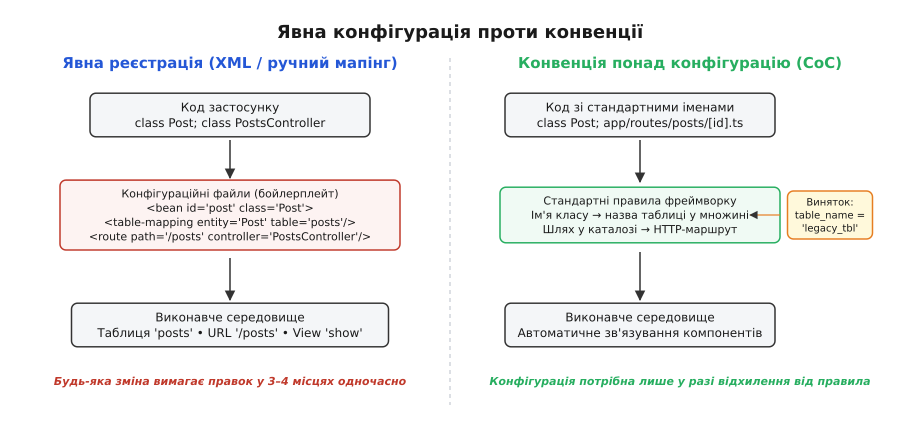
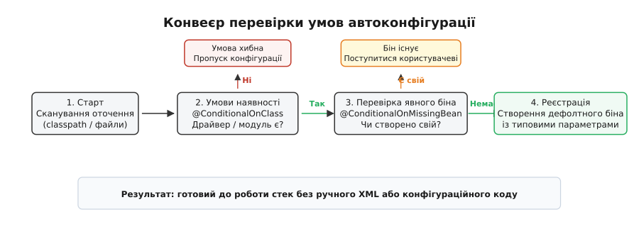

# Конвенція замість конфігурації: зменшення бойлерплейту

<preknowlist>
- [Каркас проти бібліотеки: напрямок виклику](topic:programming/framework-vs-library) — куди спрямовано стрілку виклику та як каркас захоплює життєвий цикл програми.
- [Конфігурація](topic:programming/config-design) — як проєктувати параметри систем та відокремлювати код від оточення.
- [Модель–подання–контролер (MVC)](topic:programming/mvc) — класичне розділення відповідальностей у прикладних застосунках.
- [Active Record](topic:programming/active-record) — як об'єктний шар зв'язується зі схемою реляційної бази даних.
- [Зчеплення і зв'язність](topic:programming/coupling-cohesion) — якими зв'язками скріплено компоненти системи та як змінюється вартість підтримки.
</preknowlist>

У типовому інформаційному проєкті на п'ятдесят сутностей предметної області інженер створює клас моделі `Post`, контролер `PostsController` та екранний шаблон `show.html`. За класичного підходу явної конфігурації цей код не може почати роботу самостійно: розробник зобов'язаний відкрити файл дескриптора бази даних і вказати, що клас `Post` зв'язаний із таблицею `posts`, а поле `authorId` відображається на стовпчик `author_id`. Потім він відкриває маніфест маршрутизації й описує, що HTTP-запит `GET /posts/{id}` викликає дію `show` класу `PostsController`. Після цього відкриває конфігуратор інверсії керування й реєструє контролер як компонент системи. Разом на кожні десять рядків змістовної бізнес-логіки припадає сорок рядків службових декларацій у трьох різних конфігураційних файлах.

Ця рутина не лише сповільнює темп розробки, а й створює приховані джерела відмов. Якщо інженер виправить назву класу у вихідному коді, але пропустить один рядок у текстовому маніфесті, компілятор не видасть попередження. Програма збереться без зауважень, але впаде під час першого реального виклику з помилкою відсутності обробника. Архітектурне протиріччя тут очевидне: система вимагає детальних інструкцій для зв'язків, які у переважній більшості випадків є повністю передбачуваними й типовими.

Парадигма **конвенції понад конфігурацію** (Convention over Configuration, скорочено CoC; лат. *conventio* — угода, домовленість) розв'язує цю проблему через перенесення рішень за замовчуванням у саму структуру каркаса. Каркас встановлює набір узгоджених домовленостей про імена, типи та розташування файлів. Доки розробник дотримується цих домовленостей, система зв'язує компоненти автоматично без жодного конфігураційного рядка. Конфігурація перестає бути обов'язковою передумовою запуску й перетворюється на інструмент обробки виняткових ситуацій.

## Парадокс гнучкості: як явна конфігурація стає баластом

На ранніх етапах розвитку корпоративних систем повна конфігурованість вважалася головною архітектурною чеснотою. Ідея полягала в максимальній автономності компонентів: якщо таблицю в базі даних перейменують із `users` на `tbl_accounts_2004`, або якщо дію контролера знадобиться прив'язати до іншого мережевого шляху, це мало б відбуватися шляхом простої зміни текстового файлу без перекомпіляції та повторного збирання бінарного коду.

Проте на практиці ця теоретична гнучкість обернулася важким податком на щоденний супровід системи:

1. **Синхронізаційний шум та розпорошення контексту:** Будь-яка зміна структури даних — додавання нового стовпчика, зміна типу поля, створення нового API-ендпоінта — вимагає синхронного редагування кількох розрізнених артефактів. Розробник змушений утримувати в робочій пам'яті не лише бізнес-алгоритм, а й повну топологію текстових маніфестів системи.
2. **Втрата статичної типізації та контролю компілятора:** Більшість конфігураційних форматів (XML, JSON, YAML) оперують чистими рядками. Зв'язок між символом у вихідному коді мови програмування та його рядковим представленням у маніфесті стає невидимим для статичних аналізаторів, компіляторів та засобів автоматичного рефакторингу. Перейменування методу в середовищі розробки залишає застарілий рядок у конфігураторі, гарантуючи збій під час виконання.
3. **Когнітивне перевантаження інженерної команди:** Коли кожна дія вимагає обов'язкової декларації, суттєві налаштування (наприклад, параметри пулу з'єднань, політики безпеки або тайм-аути розподілених транзакцій) губляться серед тисяч рядків рутинного бойлерплейту.


*Порівняння явного зв'язування компонентів через конфігураційні маніфести та автоматичного зіставлення за правилами конвенції фреймворку.*

Явна конфігурація є виправданою лише тоді, коли варіантів поведінки дійсно багато і вони є рівноцінними за частотою використання. Коли ж один варіант обирається у 95% ситуацій, необхідність його постійного повторення стає чистим пасивом кодової бази. Докладний розбір історичного глухого кута, до якого зайшла індустрія на початку 2000-х років, наведено у вставці [Історичний нарис: бунт проти XML-пекла та народження Ruby on Rails](topic:programming/convention-over-configuration/hist-rails-xml-hell.md).

## Конвенція як стандартний вибір: філософія CoC

Парадигма CoC не відкидає налаштування як такі. Вона докорінно змінює їхнє системне призначення: **конфігурація існує виключно для опису відхилень від стандартної норми**.

Якщо структура каталогу, назва класу чи ім'я методу відповідають установленим правилам фреймворку, система розглядає намір розробника як однозначно визначений. Зв'язки між сутностями, таблицями СКБД, мережевими маршрутами та шаблонами інтерфейсу виводяться автоматично під час аналізу коду або під час ініціалізації середовища виконання.

Фундаментальні принципи цієї парадигми:

- **Розумні значення за замовчуванням (Sensible Defaults):** Якщо інженер оголошує підключення до реляційної бази даних і не зазначає додаткових параметрів, каркас обирає безпечні й зважені константи: пул на 10–20 з'єднань, протокол перевірки зв'язку перед виділенням потоку та кодування UTF-8. Розробник не пише конфігурацію заради конфігурації.
- **Однорідність структури між проєктами:** Усі застосунки, побудовані на базі одного каркаса, мають ідентичну організацію коду. Інженер, переходячи в новий проєкт або репозиторій, миттєво орієнтується в розташуванні моделей, контролерів, міграцій та тестів без необхідності читання внутрішньої документації.
- **Декларування лише винятків (Override by Exception):** Конфігураційний файл перестає бути повною картою зв'язків системи й стискається до кількох точкових рядків, які описують нестандартні ситуації — наприклад, підключення до успадкованої таблиці із застарілою схемою найменування полів.

## Анатомія та механізми втілення конвенцій

Щоб конвенція функціонувала як надійний інженерний механізм, каркас має спиратися на чіткі програмні алгоритми інтерпретації домовленостей. У сучасних архітектурах застосовуються чотири основні способи практичного втілення CoC.

### 1. Морфологічні та лексичні угоди в ORM та MVC

Об'єктно-реляційні перетворювачі архітектурного патерну [Active Record](topic:programming/active-record) будують міст між об'єктною мовою та реляційною базою даних за допомогою формальних правил словозміни (inflection rules):

1. **Ім'я класу в однині → ім'я таблиці у множині:** Клас `Product` автоматично пов'язується з таблицею `products`, а клас `Category` — з таблицею `categories`. Спеціалізований модуль морфології враховує винятки англійської граматики (`Person` → `people`, `Analysis` → `analyses`, `Child` → `children`).
2. **Первинний ключ за замовчуванням:** Кожна таблиця містить сурогатний первинний ключ з уніфікованою назвою `id`. Модель не потребує опису цього поля у вихідному коді — воно інстанціюється динамічно на основі аналізу схеми таблиці.
3. **Зовнішні ключі реляційних зв'язків:** Якщо сутність `Order` містить декларацію зв'язку `belongs_to :customer`, каркас без додаткових вказівок шукає в таблиці `orders` стовпчик `customer_id`, який посилається на `id` таблиці `customers`.
4. **Проміжні таблиці для зв'язку багато-до-багатьох:** Для зв'язку між `Article` та `Tag` конвенція вимагає створення проміжної таблиці `articles_tags`, назва якої формується шляхом лексикографічного сортування імен сутностей у множині.
5. **Автоматичне відображення контролера на подання:** Коли в класі `UsersController` завершується виконання дії `edit`, каркас не вимагає виклику функції візуалізації. Він автоматично шукає шаблон `views/users/edit.html` і передає туди всі публічні поля контролера.

### 2. Файлова система як схема виконання (File-system Routing)

У сучасних веб-фреймворках (Next.js, SvelteKit, Nuxt, Remix) конвенція переноситься безпосередньо в топологію файлової системи. Замість підтримки центрального імперативного списку маршрутів структура папок на диску безпосередньо транслюється в дерево HTTP-диспетчеризації:

- Файл `app/routes/blog/[slug]/page.tsx` автоматично реєструється як обробник маршруту `GET /blog/:slug`.
- Сегменти у квадратних дужках `[slug]` інтерпретуються компілятором як динамічні параметри запиту, значення яких автоматично вилучаються з URL та передаються у властивості компонента.
- Спеціальні зарезервовані імена файлів виконують строго визначені системні ролі:
  - `layout.tsx` — спільний макет, що автоматично огортає всі сторінки поточної гілки каталогів;
  - `loading.tsx` — стан завантаження та скелетний інтерфейс, що активується під час асинхронного отримання даних;
  - `error.tsx` — межа ізоляції помилок (Error Boundary), яка локалізує збої рендерингу без падіння всього застосунку;
  - `route.ts` — низькорівневий обробник сирих HTTP-запитів (REST API endpoint).

Алгоритмічну модель префіксного дерева та покроковий розбір зіставлення таких маршрутів мовами C та C++ наведено у вставці [Алгоритм розпізнавання конвенційних маршрутів у файловій системі](topic:programming/convention-over-configuration/proj-routing-resolution.md).

### 3. Умовна автоконфігурація (Conditional Autoconfiguration)

У статично типізованих екосистемах із динамічним завантаженням класів (наприклад, у Java за допомогою Spring Boot або Quarkus) конвенція реалізується через сканування оточення та аналіз наявності артефактів під час старту віртуальної машини.

Анотація `@EnableAutoConfiguration` запускає конвеєр перевірки предикатів, аналізуючи стан оточення за допомогою байткод-інспекції:

- `@ConditionalOnClass`: Якщо в оточенні виявлено присутність класу драйвера `org.postgresql.Driver`, каркас самостійно створює та конфігурує пул з'єднань з базою даних PostgreSQL.
- `@ConditionalOnMissingBean`: Каркас реєструє власну стандартну реалізацію сервісу (наприклад, серійного кодувальника JSON або менеджера транзакцій) лише за умови, що розробник не надав власного явного компонента в контексті застосунку.
- `@ConditionalOnProperty`: Поведінка модулів активується або модифікується залежно від значень змінних середовища без необхідності ручного написання умовних розгалужень у коді.


*Послідовність перевірки умов у конвеєрі автоконфігурації: фреймворк створює стандартні компоненти лише тоді, коли розробник не надав власної реалізації.*

### 4. Конвенції систем збирання та організації коду (Build Systems & Packaging)

Конвенція понад конфігурацію охоплює не лише високорівневі веб-каркаси, а й фундаментальні інструменти збирання програмного забезпечення:

- **Стандартна структура каталогів (Maven Standard Directory Layout):** Утиліти збирання Apache Maven та Gradle очікують знайти вихідний код у каталозі `src/main/java`, ресурси конфігурації у `src/main/resources`, а модульні тести — у `src/test/java`. Завдяки цій домовленій структурі розробникові не потрібно вказувати компілятору шляхи до десятків каталогів у файлі збирання `pom.xml`.
- **Автоматичне виявлення та запуск тестів:** Тестові фреймворки (JUnit, PyTest, Vitest, Go test) автоматично сканують репозиторій і запускають усі функції чи класи, які відповідають конвенційним шаблонам назв (наприклад, файли з суфіксом `_test.go`, префіксом `test_` або анотацією `@Test`). Це усуває потребу в ручному веденні списків тестових наборів (Test Suites).
- **Пакетний менеджмент та маніфести (Cargo, Go Modules, npm):** У мові Rust інструмент `cargo` автоматично вважає файл `src/main.rs` точкою входу для виконуваного бінарного файлу, а `src/lib.rs` — точкою входу для бібліотеки, дозволяючи збирати складні пакети взагалі без ручного опису цілей компіляції.

## Механіка інфлекції: правила морфології та словникові бази

Автоматичне відображення назв сутностей на таблиці реляційних баз даних опирається на спеціалізовані морфологічні рушії (Inflectors). Модуль інфлекції перетворює рядки між одниною, множиною, верблюжим регістром (`CamelCase`) та зміїним регістром (`snake_case`) за допомогою системи регулярних правил та словників винятків:

1. **Регулярні граматичні трансформації:**
   - Слова, що закінчуються на шиплячі приголосні (`s`, `x`, `z`, `ch`, `sh`), отримують закінчення `-es` (`box` → `boxes`, `status` → `statuses`).
   - Слова на приголосну з `y` змінюють закінчення на `-ies` (`category` → `categories`, `company` → `companies`).
   - Стандартні іменники отримують суфікс `-s` (`product` → `products`, `invoice` → `invoices`).
2. **Таблиці нерегулярних винятків та незлічуваних слів:**
   Модуль інфлектора містить вбудовану таблицю історичних винятків мови (`person` → `people`, `man` → `men`, `child` → `children`, `mouse` → `mice`, `datum` → `data`). Крім того, інфлектор розпізнає незлічувані іменники (`equipment`, `information`, `money`, `species`), форма множини яких збігається з одниною.
3. **Розпізнавання абревіатур та складених назв:**
   Конвенційний транслятор розбиває складні назви класів на окремі лексеми за межами великих літер: `FiscalYearReport` транслірується в ім'я таблиці `fiscal_year_reports`. При цьому інструмент дозволяє реєструвати фіксовані абревіатури (наприклад, `APIClient` перетворюється на `api_client`, а не на `a_p_i_client`).

## Архітектура інтроспекції та кешування метаданих

Автоматичне виведення зв'язків вимагає від каркаса збору інформації про структуру програми. Щоб ця процедура не створювала неприпустимих накладних витрат під час обробки кожного запиту, системи CoC застосовують дворівневу архітектуру метаданих.

Під час холодного старту застосунку або при першому зверненні до ресурсу каркас виконує фазу інтроспекції:
1. **Інтроспекція схеми СКБД:** Модуль ORM звертається до системного каталогу реляційної бази даних (`information_schema.columns` або `PRAGMA table_info`), зчитує список стовпчиків, типи даних, обмеження нульових значень та первинні ключі.
2. **Побудова внутрішньої карти дескрипторів:** Отримана інформація упаковується в компактні незмінні структури пам'яті (Memory Descriptor Maps). Усі наступні операції вибірки, створення чи валідації полів звертаються до цієї локальної карти без повторних запитів до системних таблиць СКБД.
3. **Різниця між середовищами розробки та виробництва:** У режимі розробки (`development`) каркас застосовує спеціальні завантажувачі класів, які відстежують зміни файлів на диску (`inotify`, `kqueue`) та динамічно скидають кеш метаданих для забезпечення швидкого циклу зворотного зв'язку (Hot Module Replacement). У виробничому середовищі (`production`) інтроспекція виконується однократно під час прогріву процесу (Warm-up phase), після чого структури метаданих блокуються від змін, зводячи обчислювальний оверхед конвенцій до нуля.

## Наскрізне простеження: життєвий цикл запиту за конвенцією

Щоб зрозуміти, як окремі конвенції складаються в єдиний злагоджений механізм, простежимо повний шлях проходження вхідного HTTP-запиту в системі від мережевого сокета до генерації відповіді:

1. **Отримання мережевого пакета:** Операційна система передає TCP-потік веб-серверу (Kestrel, Puma, Netty, Node.js). Сервер розбирає заголовки та виділяє HTTP-метод (`GET`) і рядок шляху (`/posts/42`).
2. **Маршрутизація за файловим деревом:** Диспетчер передає шлях у префіксне дерево маршрутизації. Відбувається токенізація на сегменти `["posts", "42"]`. Перший сегмент зіставляється зі статичною папкою `posts`, другий — з динамічною папкою `[id]`. Значення `42` записується у словник динамічних параметрів.
3. **Вибір та інстанціювання контролера:** Каркас застосовує лексичне правило конвенції: для ресурсу `posts` створюється екземпляр класу `PostsController`. Якщо застосовується контейнер впровадження залежностей (IoC), системні сервіси автоматично передаються в конструктор контролера за типами інтерфейсів.
4. **Виконання ланцюжка посередників (Middleware Pipeline):** Каркас викликає зареєстровані конвенційні фільтри: автентифікацію, перевірку CSRF-токенів та логування.
5. **Виконання дії та взаємодія з ORM:** Контролер викликає метод `Post.find(params[:id])`. Модель `Post` через конвенційний інфлектор знає, що шукати потрібно в таблиці `posts` за стовпчиком `id = 42`. Формується та виконується оптимізований SQL-запит `SELECT * FROM posts WHERE id = 42 LIMIT 1`. Отриманий кортеж автоматично відображається на поля об'єкта `Post`.
6. **Автоматична резолюція подання:** Дія контролера завершується без явного виклику методу рендерингу. Каркас за конвенцією шукає шаблон `views/posts/show.html.erb` (або компонент `page.tsx`), передає йому об'єкт моделі та генерує фінальне HTML/JSON-тіло відповіді.
7. **Відправка відповіді клієнту:** Сформована HTTP-відповідь повертається через сокет клієнтові з автоматично встановленими заголовками `Content-Type`, `Content-Length` та кодом стану `200 OK`.

На кожному з цих семи етапів розробник не написав жодного рядка зв'язувального конфігураційного коду — вся взаємодія відбулася за заздалегідь узгодженими системними домовленостями.

## Еволюція парадигми: три покоління конвенцій

За два десятиліття свого існування підхід CoC пройшов три виразні еволюційні етапи:

1. **Перше покоління: Динамічні текстові конвенції (2004–2010 роки).**
   Каркаси епохи Ruby on Rails 1.x–3.x та раннього Grails спиралися на динамічну природу інтерпретованих мов. Зв'язки між сутностями обчислювалися в момент першого виклику за допомогою динамічного метапрограмування (`method_missing`, маніпуляції з таблицями символів). Цей підхід забезпечував неперевершену швидкість прототипування, проте мав суттєві недоліки: повна відсутність перевірок на етапі компіляції та падіння продуктивності через постійний динамічний диспатчинг методів.
2. **Друге покоління: Анотаційні та байткод-конвенції (2010–2018 роки).**
   З появою Spring Boot, ASP.NET Core та NestJS конвенції адаптувалися під статично типізовані платформи. Замість чистого текстового зіставлення системи почали використовувати декларативні анотації разом із глибоким скануванням байткоду та рефлексією під час старту застосунку. Це повернуло строгу типізацію параметрів та покращило верифікацію, проте призвело до значного збільшення часу холодного старту та важкого споживання пам'яті через роботу динамічних проксі-об'єктів (CGLIB/ByteBuddy).
3. **Третє покоління: Компільовані типізовані конвенції (2018–дотепер).**
   Сучасні системи (Next.js з TypeScript App Router, SvelteKit, Quarkus AOT, Rust макроси) перенесли конвенції безпосередньо у фазу компіляції та статичного збирання проєкту (Ahead-Of-Time). Інструменти збирання сканують дерево каталогів або декларації типів і автоматично генерують строгий, оптимізований код зв'язування. Якщо розробник перейменує динамічний сегмент у файловій системі, компілятор TypeScript негайно вкаже на помилку типізації у всіх компонентах, які посилаються на старий маршрут. Це забезпечує ідеальний синтез: максимальну лаконічність конвенцій із абсолютною надійністю статичної компіляції.

## Порівняльний аналіз екосистем: від динамічних мов до статичної типізації

Реалізація парадигми CoC суттєво різниться залежно від філософії та можливостей мови програмування:

1. **Динамічне метапрограмування (Ruby, Python, PHP):**
   У Ruby on Rails конвенції реалізуються на льоту через перехоплення повідомлень об'єктів (`method_missing`, `const_missing`) та динамічне визначення методів у таблицях класів. Під час першого звернення до атрибута `user.email` модель надсилає запит до схеми бази даних, дізнається про існування стовпчика `email` і динамічно генерує аксесор у пам'яті. Це забезпечує максимальну стислість коду, але переносить усі помилки на етап виконання.
2. **Байткод-інспекція та статична конфігурація (Java, C#, Kotlin):**
   У статично типізованих мовах конвенції опираються на рефлексію, анотації та препроцесори. Spring Boot аналізує байти скомпільованих `.class` файлів бібліотек до їх фактичного завантаження завантажувачем класів (ClassLoader), що запобігає виникненню фатальних помилок `ClassNotFoundException`. Останніми роками індустрія переходить до компіляційного аналізу (Ahead-Of-Time, AOT), де конвенційні зв'язки генеруються у вигляді чистого коду під час збирання проєкту (Quarkus, Micronaut, Spring AOT).
3. **Файловий AST-аналіз у веб-екосистемах (TypeScript, JavaScript):**
   У середовищі Node.js та сучасних браузерних бандлерах (Vite, Turbopack, Webpack) конвенція перетворюється на статично згенерований код під час компіляції. Інструмент сканує дерево файлів `app/`, будує абстрактне синтаксичне дерево (AST) маршрутів та створює типізовані маніфести, завдяки чому виклики маршрутів перевіряються компілятором TypeScript на етапі написання коду.
4. **Мінімалізм та явна композиція (Go, Rust):**
   Екосистеми Go та Rust історично відкидають парадигму CoC. Філософія Go («Explicit is better than implicit») наполягає на тому, що кожен маршрут, кожен обробник і кожне поле структури мають бути явно зареєстровані у функції `main()`. Замість неявної магії рефлексії чи сканування файлів ці мови використовують явну кодогенерацію (`go generate`) або макроси компіляції (Rust declarative and procedural macros). Це усуває несподівані побічні ефекти під час виконання та робить потік керування абсолютно прозорим для читання.

## Діагностика та інструменти прозорості у світі конвенцій

Щоб зменшити негативний ефект «неявної магії», зрілі конвенційні фреймворки надають обов'язковий набір вбудованих утиліт командного рядка для візуалізації прихованих зв'язків:

- **Інспекція таблиці маршрутів (`bin/rails routes`, `artisan route:list`):** Команда формує повну зведену таблицю всіх діючих HTTP-маршрутів, вказуючи відповідні URL-шаблони, HTTP-дієслова, цільові класи контролерів та внутрішні методи обробки.
- **Звіт про стан умов автоконфігурації (Spring Boot ConditionEvaluationReport):** Запуск застосунку з прапорцем `--debug` або звернення до кінцевої точки `/actuator/conditions` виводить детальний аудит кожного умовного біна: чому саме певна автоконфігурація була увімкнена (Positive Matches) або проігнорована (Negative Matches).
- **Маніфест збирання маршрутів (Next.js Build Output):** Під час виконання команди `next build` компілятор виводить інтерактивну карту файлових маршрутів, позначаючи статичні сторінки (SSG), динамічно генеровані на сервері ендпоінти (SSR) та розміри результуючих бандлів JavaScript.

## Ціна домовленостей: неявна магія та когнітивне навантаження

Незважаючи на значне підвищення швидкості розробки та усунення конфігураційного шуму, парадигма конвенцій несе в собі системні інженерні компроміси, які впливають на життєвий цикл проєкту.

### 1. Проблема «неявної магії» (Implicit Magic)

Коли поведінка системи не випливає з явного ланцюжка викликів у тексті програми, виникає ілюзія магічного функціонування коду. Інженер-початківець бачить порожній клас моделі без жодного оголошеного поля, який проте вміє зберігати дані в СКБД, проводити перевірку валідності та взаємодіяти з іншими сутностями.

Якщо розробник не розуміє внутрішніх механізмів каркаса — рефлексії, динамічного проксування об'єктів, метапрограмування або сканування каталогів — діагностика збоїв перетворюється на метод спроб і помилок, оскільки стек викликів виявляється перевантаженим внутрішніми проміжними шарами фреймворку.

### 2. Ускладнення статичного аналізу та навігації в IDE

У класичній системі з явною композицією знайти місце виклику функції тривіально: виклик `orderService.process(order)` є прямим символьним посиланням, яке легко відстежується компілятором, лінтером та стандартними засобами пошуку використання в середовищі розробки.

У системі, побудованій на конвенціях, зв'язок виникає динамічно за непрямими текстовими збігами:
- Дія контролера `show` виконується тому, що прийшов запит на URL `/orders/1`, а не тому, що в коді існує прямий виклик методу `show`.
- Зміна назви файлу з `users_controller.rb` на `user_controller.rb` тихо вимикає обробку запитів без генерації помилок на етапі компіляції.
- Автоматичний глобальний рефакторинг та перейменування символів стають ненадійними, якщо інструменти аналізу коду не оснащені спеціальними плагінами під конкретний каркас.

### 3. Поріг входження через неписані знання (Tribal Knowledge)

Код із явною конфігурацією є самоописовим: відкривши дескриптор, інженер бачить точний список зв'язків між класами, таблицями та маршрутами.

Конвенційний код виглядає лаконічним, проте вимагає від спеціаліста глибокого володіння неписаними правилами конкретної технології. Інженер повинен точно пам'ятати, як саме фреймворк розрізняє файли `page.tsx` та `route.ts`, які префікси методів контролера автоматично огортаються в транзакцію та які правила англійської множини застосовує вбудований інфлектор.

### 4. Крихкість імен та приховані друкарські помилки (Typo Fragility)

Оскільки зв'язування компонентів спирається на рядкові назви методів, файлів та каталогів, друкарська помилка в одному символі ламає логіку без явного повідомлення про причину. Наприклад, назва файлу `posts.contrller.ts` замість `posts.controller.ts` або функція `before_action` замість `before_filter` у застарілій версії каркаса просто призводить до ігнорування файлу під час завантаження. Система продовжує працювати, але критичний обробник безпеки або валідації виявляється вимкненим.

## Вихід за межі: аварійні люки та межі застосування

Будь-яка конвенція залишається життєздатною лише доти, доки вона передбачає простий та локальний механізм відмови від стандартного правила — **аварійний люк** (Escape Hatch).

Коли бізнес-вимога не вкладається в типовий сценарій (наприклад, необхідно взаємодіяти з успадкованою таблицею `tbl_archive_cust_2001`, де первинним ключем слугує текстове поле `ACC_CODE`), каркас зобов'язаний надати можливість точкового перевизначення без потреби відмови від усієї моделі:

```ruby
# Приклад на мові Ruby (каркас Active Record):
# Модель зберігає всі можливості ORM, але точково змінює нестандартні параметри.
class CustomerAccount < ApplicationRecord
  self.table_name = "tbl_archive_cust_2001"
  self.primary_key = "ACC_CODE"
end
```

Якщо фреймворк не дозволяє гнучкого локального виходу за межі власних домовленостей і вимагає або стовідсоткового прийняття конвенцій, або переписування коду з нуля — така архітектура є надмірно жорсткою та швидко призводить до деградації системи при ускладненні бізнес-вимог.

### Критерії вибору: конвенція чи явна композиція

Обираючи архітектурний підхід для конкретного модуля системи, інженер зважує компроміс між швидкістю розробки та прозорістю контролю:

| Критерій оцінки | Конвенція понад конфігурацію (CoC) | Явна конфігурація та композиція |
| :--- | :--- | :--- |
| **Швидкість старту (Time-to-market)** | Максимальна: мінімум коду для створення працюючого продукту. | Помірна: вимагає попереднього опису графів взаємодії. |
| **Однорідність кодової бази** | Висока: усі сервіси та модулі мають ідентичну структуру. | Варіативна: кожна підсистема може бути зв'язана у власний спосіб. |
| **Прозорість налагодження** | Нижча: стек викликів проходить через неявні шари каркаса. | Абсолютна: потік виконання чітко видно від точки входу до виконавця. |
| **Сфера оптимального використання** | CRUD-сервіси, веб-інтерфейси, API-шлюзи, типова інфраструктура. | Складні доменні ядра, критичні обчислювальні алгоритми, протоколи реального часу. |

Конвенція понад конфігурацію перемагає там, де завдання є масовим і стандартизованим. Вона звільняє розробника від рутини постійного зв'язування очевидних компонентів, концентруючи зусилля на унікальній логіці системи. Водночас у ядрах критичних предметних областей явна композиція та прямий контроль залишаються незамінним фундаментом надійності та довгострокової підтримки.\n