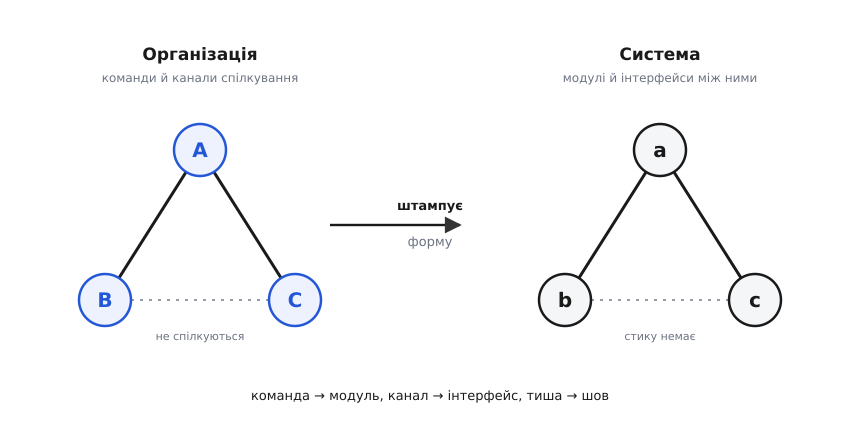
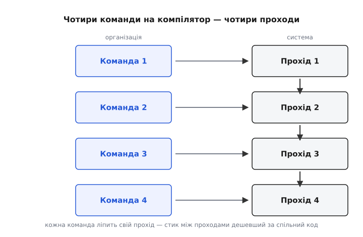

# Закон Конвея

<preknowlist>
- [Зчеплення і зв'язність](book:programming/coupling-cohesion) — наскільки частини коду залежать одна від одної й наскільки кожна цілісна всередині; закон Конвея пояснює, звідки береться те чи те.
- [Тактики змінюваності](book:programming/modifiability-tactics) — слабке зчеплення, вузькі стики як мета доброго дизайну; закон показує, що ця мета вирішується не лише в коді.
- [Обмежений контекст](book:programming/bounded-context) — самостійний шматок системи з власною межею й мовою; типова одиниця, що збігається з межею команди.
</preknowlist>

Двоє інженерів пишуть той самий сервіс за сусідніми столами. Через рік дивишся в код — і два їхні шматки зрослися в один клубок: спільні структури, прямі виклики в чуже нутро, ніякої межі. А поряд — дві команди на різних поверхах, які бачаться раз на тиждень; їхні частини системи стикуються через вузький, чіткий контракт і живуть окремо. Ніхто цих меж не малював навмисне. Вони **виросли самі** — і виросли рівно за формою того, хто з ким скільки говорив. Форму системі задав не архітектор. Її задала мапа розмов. Це не примха конкретного проєкту, а закономірність, у якої є ім'я, механізм і навіть виміряні докази.

## Спостереження, у якому переставлено причину з наслідком

Природно думати так: спершу продумуємо архітектуру, тоді під неї збираємо людей. Спершу креслення, потім бригада. Але з програмними системами частіше стається **навпаки** — і саме це 1968 року зауважив інженер **Мелвін Конвей** (англ. *Melvin E. Conway*, нар. 1931). Він сформулював так гостро, що фраза пережила півстоліття:

```
Організації, які проєктують системи, приречені видавати проєкти,
що є копіями комунікаційних структур цих організацій.
```

Вчитаймося, бо тут глибше, ніж здається. Конвей не каже м'яко «команди впливають на код». Він каже жорстко: структура коду **є копією** структури спілкування. Не «схожа» — копія. І слово **«приречені»** (англ. *constrained*) — теж не випадкове: не «схильні», не «часто», а змушені обмеженням, від якого не втечеш. Історія цієї фрази цікава сама собою — стаття [«Як комітети винаходять?»](book:programming/communication-paths/hist-conway-law.md) спершу дістала відмову від Harvard Business Review «бо ви не довели тезу», вийшла в галузевому журналі Datamation, а ім'я «закон Конвея» їй за сім років дав Фред Брукс у «Міфічному людино-місяці».

> 🔧 **Навіщо це.** Практичний висновок різкий: **межі твоєї системи наполовину визначені ще до першого рядка коду** — тим, як нарізані команди й хто з ким щодня на дзвінках. Тому питання «де пройде межа модуля?» насправді часто вже вирішене питанням «хто з ким сидить і говорить?». Дивишся на майбутню архітектуру — подивись спершу на оргсхему.

## Чому саме «копія»: гомоморфізм на пальцях

Слово «копія» здається перебільшенням, поки не побачиш механізм. А він майже механічний — і Конвей, людина з математичним вишколом, заклав під нього точну назву: **гомоморфізм** (гр. *homós* — той самий + *morphḗ* — форма), відповідність, що зберігає структуру.

Розкладімо термін, бо він лякає дужче за саму ідею. Уяви обидві речі — і організацію, і систему — як **графи**: кружечки й лінії. У графі організації кружечок — це команда, а лінія — канал спілкування між двома командами. У графі системи кружечок — це модуль, а лінія — інтерфейс, стик між двома модулями. У звичному випадку, коли **кожен модуль пише своя окрема команда**, ці два графи виходять **однакові**: тим самим візерунком кружечків і ліній. Кожній команді відповідає свій модуль, кожному каналу спілкування — свій інтерфейс, а де команди **не** говорять — там стику **немає**.



*Той самий візерунок кружечків і ліній ліворуч і праворуч. Команда відображається в модуль, канал спілкування — в інтерфейс, а тиша між двома командами — у відсутній шов. Структуру спілкування ніби штампують у структуру коду.*

Ось звідки береться саме **копія**, а не просто вплив. Щоб два модулі стикувалися чисто, люди, які їх пишуть, мусять **домовитися про стик** до останньої дрібниці: формат даних, хто відповідає за перевірку, що робити з порожнім полем, хто повторює спробу при збої. Кожна така домовленість — **акт спілкування**: розмова, лист, спільний документ, нарада. Двоє за сусідніми столами узгодять що завгодно за п'ять хвилин біля дошки — тому їм **дешево** сплести свої шматки багатим, тісним зв'язком. Дві команди на різних поверхах платять за кожне узгодження дорого — і несвідомо **уникають** його, лишаючи інтерфейс максимально вузьким і рідким. Люди течуть шляхом найменшого опору спілкування; тому дешевше стикувати те, що легше обговорити, — і граф розмов протікає в граф коду.

Тонкість, у яку легко впасти: **бідний стик — не завжди поганий стик**. Іноді дві далекі команди роблять чистішу межу, ніж двоє за одним столом, — бо коли узгоджувати дорого, ти **змушений** зробити інтерфейс справді вузьким і чітким, а це і є ознака доброго дизайну ([слабке зчеплення](book:programming/coupling-cohesion)). Дешевизна ж спілкування спокушає до тісноти: двоє за сусідніми столами непомітно сплітають модулі в клубок саме тому, що їм щоразу **надто легко** «домовмося ще про одне поле». Закон Конвея байдужий до якості: він однаково точно копіює і добру структуру команд, і погану. Штамп не питає, гарний він чи кривий, — він просто точно переносить форму.

## Що закон передбачає

Найцінніше в законі — не пояснення провалів заднім числом, а **передбачення наперед**. Якщо граф системи повторить граф команд, то, глянувши на команди, можна вгадати архітектуру ще до коду.

Найвідоміша ілюстрація цього — про компілятор. Ерік Реймонд у своєму «Словнику хакера» (англ. *The New Hacker's Dictionary*) переказав закон Конвея одним рядком, який відтоді цитують усі: **«Якщо чотири групи працюють над компілятором, ви дістанете чотирипрохідний компілятор»** (англ. *If you have four groups working on a compiler, you'll get a 4-pass compiler*). Не тому, що задача вимагає рівно чотирьох проходів, а тому, що **чотири команди виліплять чотири шматки**: кожна відповідає за свій прохід, а стик між проходами (передав проміжне подання далі) дешевший за спільний код усередині. Число команд віддрукувалося в числі частин.



*Кожна команда ліпить свій прохід, бо стик між проходами дешевший за спільний код усередині одного. Кількість команд стає кількістю частин системи — форма організації проступає у формі продукту.*

Звідси головна практична навичка: **читай оргсхему як чернетку архітектури**. Три команди — чекай трьох великих частин зі швами між ними. Одна велика команда, де всі гукають через кімнату, — чекай моноліта, де все переплетено. Дивна межа в коді часто виявляється просто відбитком дивної межі між людьми — сервіс, розрізаний навпіл через два офіси; модуль, у який усі лізуть, бо ним «володіють усі», тобто ніхто.

## Це не метафора — це виміряли

Докір Harvard Business Review — «ви не довели тезу» — за сорок років обернувся іронією: закон **виміряли лінійкою на живому коді**, і він вистояв. Два незалежні докази варті згадки.

Перший — **гіпотеза віддзеркалення** (англ. *mirroring hypothesis*): слабко зв'язані організації творять модульніші системи, ніж тісно зв'язані. Дослідники зіставили пари продуктів однакового призначення від організацій протилежного складу (комерційна фірма в одній будівлі проти розкиданої спільноти відкритого коду) і виявили, що слабко зв'язана організація щоразу видавала помітно модульніший продукт. Розбір цього — у сусідній темі про [комунікаційні шляхи](book:programming/communication-paths).

Другий доказ прямий і промовистий. 2008 року Начіаппан Нагаппан, Брендан Мерфі й Віктор Базілі (англ. *Nagappan, Murphy, Basili*) з Microsoft Research узяли **весь код Windows Vista** — 3404 бінарники, понад 50 мільйонів рядків — і спитали: що краще передбачає, де в коді будуть дефекти після випуску? Вони порівняли звичні метрики коду (складність, покриття тестами, кількість правок, залежності, довипускові баги) з **організаційними** метриками: скільки різних відділів торкалося цього коду, наскільки глибоко в оргструктурі сидить його власник, яка частка інженерів компанії його чіпала. Результат був недвозначний: **організаційні метрики передбачали дефекти точніше за всі метрики самого коду**. Не те, який код, а **хто і як організований навколо нього**, найкраще віщувало, де він зламається.

> 🔧 **Навіщо це.** Це перевертає звичну діагностику. Коли модуль постійно ламається, перший інстинкт — «поганий код, треба переписати». Але дані Vista кажуть: спершу спитай, **скільки команд ним володіє і чи є в нього єдиний господар**. Модуль, розмазаний по трьох відділах без чіткого власника, гнитиме, хоч як гарно його перепиши, — бо його форму тримає крива структура команд, і вона відросте.

## Дві дороги: прокляття або важіль

Закон читають двома протилежними способами, і різниця між ними — це різниця між жертвою й архітектором.

**Перший — як прокляття.** Ти малюєш на дошці три чисті сервіси, пишеш стандарти, проводиш рев'ю, а через півроку дивишся в код і бачиш один клубок: платежі лізуть у таблиці каталогу, доставка смикає внутрішні функції платежів. Що сталося? У тебе одна велика команда, де всі спілкуються з усіма, — а раз домовитися легко, то й полізти в чуже легко. Ти малював три сервіси, а структура спілкування малювала моноліт. Кожне рев'ю, кожне «ну не роби так» — це гребля проти течії: тримається, поки тиснеш, відпустив — розмило. Технічно бездоганна архітектура, накреслена всупереч тому, як влаштоване спілкування, приречена — закон тихо перепише її під справжню мапу розмов.

**Другий — як важіль.** Якщо система однаково скопіює структуру команд, то, свідомо **вибираючи структуру команд**, ти обираєш і структуру системи. Це [зворотний маневр Конвея](book:programming/inverse-conway): спершу вирішуємо, яку архітектуру хочемо, а тоді нарізаємо команди й канали так, щоб закон Конвея видав саме її. Хочеш три слабко зв'язані сервіси — зроби три автономні команди, які всередині спілкуються густо, а між собою рідко й через чіткий контракт. Закон зробить решту.

Тут ховається типова помилка, яку варто побачити на прикладі. Скажімо, потрібна система з трьох частин — приймання замовлень, оплата, доставка, — кожна змінюється незалежно. Наївний шлях: три **функційні** команди — «фронтендники», «бекендники», «дібіейщики». Що видасть закон? Кожна фіча прошиватиме всі три команди навхрест, вимагаючи тристороннього узгодження на кожну дрібницю, а сервіси розмажуться по командних межах — жодна частина не буде автономною. Правильний шлях: три **наскрізні** команди «замовлення», «оплата», «доставка», кожна зі своїм шматком фронту, беку й даних. Тоді межа команди збігається з бажаною межею сервісу, і система виходить саме такою, як задумано.

Щоб побачити цей механізм у коді — як та сама структура команд, заведена **як дані**, дає порахувати передбачений граф модулів і показати, де ляже шов, — розібрано в [окремому проєкті](book:programming/conways-law/proj-org-to-modules.md).

## Де закон ламається

Аналогія «організація → архітектура» точна, але має тріщини, і чесний інженер їх бачить.

**Формальний оргчарт бреше.** Закон говорить про **реальну** структуру спілкування, а не про мальовані квадратики HR. Двоє з різних «офіційних» команд, що дружать і сидять поруч, спілкуються дешево — і зроблять зв'язок усупереч схемі. Дивитися треба на живі канали: хто з ким справді щодня говорить, чат, сусідство, спільні наради.

**Оргчартом не купиш якісний код.** Правильні межі команд дають правильну **топологію** — хто з ким зв'язаний, де проляжуть шви. Але чи буде код усередині кожного шматка добрий, тестований, читний — цього структура не гарантує. Можна ідеально розсадити команди й усе одно мати три погано написані сервіси замість одного погано написаного моноліта. Закон керує **швами**, не якістю тканини між ними.

**Люди — не прямокутники.** Перекроїти команди — це місяці, звільнення, злі наради й політика; реорганізація б'є по живих людях, а не по вузлах графа, і її не відкотиш `git revert`. Тому маневр із командами окупається лише на **великих, довгих** ставках (новий продукт, перехід на [мікросервіси](book:programming/microservices), розділення платформи), а не як спосіб полагодити один негарний модуль.

## Що з цим робити щодня

Закон Конвея — не одне рішення на старті, а лінза, крізь яку варто дивитися постійно. Коротко, що вона дає.

**Читай оргсхему перед діаграмою компонентів.** Ще до першого класу подивись, як нарізані команди й хто з ким реально щодня говорить, — там уже проступають майбутні шви. Дві діаграми, команд і компонентів, мусять збігтися; розбіжність — надійний прогноз болю, бо переможе діаграма команд.

**Тримай межі команд і межі частин на одній лінії.** Коли автономний шматок системи збігається з автономною командою, стик виходить чистим сам собою — це і є природний спосіб різати великі системи, від [модульного моноліта](book:programming/modular-monolith) до окремих сервісів, де межа модуля збігається з межею команди й з [обмеженим контекстом](book:programming/bounded-context). Коли одна фіча розмазана по трьох командах, стик гниє від тристороннього узгодження.

**Пам'ятай про розмір.** Команда може тримати в голові лише стільки, скільки тримає; сервіс, більший за цю межу, гнитиме, бо ним ніхто не володіє цілком. Природний розмір частини — не більший, ніж одна команда здатна осягнути; звідси стандарт «команда навколо сервіса». Як саме кроїти команди під потоки цінності й де межа їхнього розміру — розгортають [топології команд](book:programming/team-topologies) і [когнітивне навантаження команди](book:programming/cognitive-load-teams).

**Користуйся законом навмисне, а не терпи його.** Хочеш певну архітектуру — спершу вибудуй під неї спілкування, і система віділлється в потрібну форму сама. А ще пам'ятай, що організації змінюються; архітектура, прибита до сьогоднішньої оргсхеми намертво, застаріє разом із нею — тому її тримають [здатною еволюціонувати](book:programming/evolutionary-architecture).

Мудрий архітектор не бореться з законом Конвея й не терпить його — він ставить його собі на службу, бо розуміє головне: він проєктує не лише систему, а й **розмови людей, які її будують**, і саме ці розмови врешті визначать, якою система стане.
