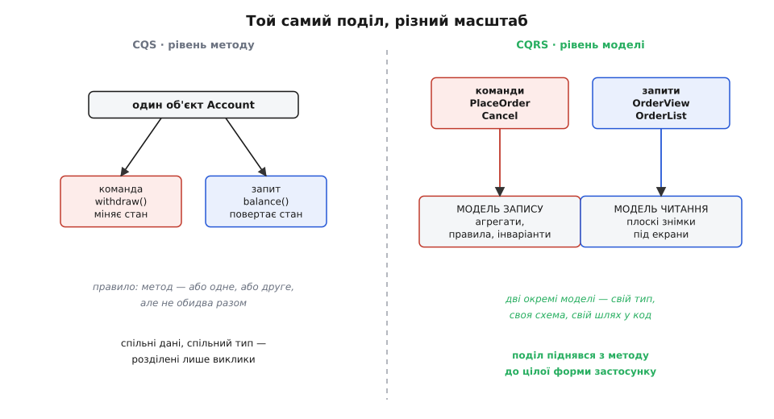
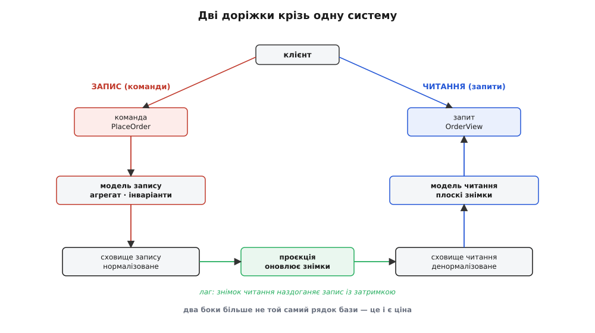

# CQRS

<preknowlist>
- [Розділення команд і запитів (CQS)](book:programming/command-query-separation) — правило, що метод — або команда (щось міняє), або запит (щось повертає), але не обидва; CQRS — це та сама думка, піднята з рівня методу на рівень моделі.
- [DDD-лайт](book:programming/domain-driven-design) — модель предметної області з поведінкою, а не мішок даних; CQRS має сенс саме там, де на боці запису живуть справжні правила.
- [Агрегат і корінь](book:programming/aggregates-consistency) — межа узгодженості, всередині якої правила тримаються разом; модель запису в CQRS будується навколо агрегатів.
- [Кінцева узгодженість на практиці](book:programming/eventual-consistency) — коли дві копії даних сходяться не миттєво, а трохи згодом; щойно читання й запис живуть у різних сховищах, ти платиш саме цим.
</preknowlist>

Візьми будь-який об'єкт, що представляє замовлення в застосунку, і поглянь, скільки різних господарів його смикають. З одного боку до нього приходять зміни: оформити, скасувати, додати позицію, застосувати знижку. Кожна така дія мусить перевірити правила — чи не порожній кошик, чи вистачає товару, чи не перевищено ліміт кредиту — і лише тоді дозволити зміну. З іншого боку той самий об'єкт хоче показувати себе на екрані: список замовлень користувача, картка замовлення з іменем клієнта й адресою доставки, звіт «продажі за місяць». І ось тут той самий тип починає рватися навпіл.

Бо ці дві сторони тягнуть модель у **протилежні** боки. Щоб перевірити правило перед зміною, модель має бути точною й строгою: справжні сутності, справжні інваріанти, жодного зайвого поля, все нормалізовано, щоб не було двох суперечливих копій одного факту. А щоб намалювати екран, зручно якраз навпаки: один плаский рядок, де вже склеєно ім'я клієнта, назви товарів, підсумкова сума — все, що треба показати, в одному місці, без жодного походу по десятьох таблицях. Перше просить нормалізації й поведінки. Друге просить денормалізації й голих даних. Одна модель не може бути обома одразу без компромісу, і компроміс цей щодня муляє: або читання тягне за собою купу з'єднань таблиць і повільне, або запис обростає полями «для відображення», які до правил не мають стосунку й лише каламутять інваріанти.

CQRS (англ. *Command Query Responsibility Segregation* — «розділення відповідальності команд і запитів») робить одну просту річ із цим болем: перестає вдавати, що це одна модель. Змінам — своя модель. Читанням — своя. Дві сторони більше не заважають одна одній, бо їх більше нічого не змушує бути тим самим типом, тією самою схемою, тим самим шляхом крізь код.

> 🔧 **Навіщо це.** Придивись, коли твоя доменна сутність починає рости в один бік «для логіки», а в інший «для показу» — це той самий розрив у зародку. Поля на кшталт `displayName`, `formattedTotal`, `customerAddressCached` осідають на моделі, що мала б тримати правила, і ти вже не певен, що на ній інваріант, а що — зручність для екрана. CQRS дає імʼя цьому напруженню й спосіб його зняти: розвести те, що міняє стан, і те, що його показує, у дві різні речі. Уся стаття про те, як далеко це розведення варто вести — і де воно з ліків перетворюється на нову хворобу.

## Звідки взялося: одне правило, піднесене на поверх вище

Назва довга, але за нею — думка, яку ти, найпевніше, вже знаєш під коротшим іменем. Бертран Меєр, творець мови Eiffel, у книзі «Object-Oriented Software Construction» (1988) сформулював [розділення команд і запитів (CQS)](book:programming/command-query-separation): кожен метод об'єкта має бути **або** командою, що щось міняє й нічого не повертає, **або** запитом, що щось повертає й нічого не міняє — але ніколи обома разом. Причина проста: запит, який тихцем міняє стан, підступний — ти читаєш `getBalance()`, а воно списало комісію, і твій код поводиться дивно, бо саме питання щось зіпсувало. Розвівши їх, ти дістаєш властивість золоту: запити безпечно кликати скільки завгодно й у будь-якому порядку, бо вони нічого не чіпають.

CQRS — це той самий поділ, **піднятий з рівня методу на рівень цілої моделі**. Меєрове правило каже: у межах одного об'єкта не змішуй команду й запит в один метод. CQRS каже: у межах усього застосунку не змішуй **бік команд** і **бік запитів** в одну модель. Той самий принцип, лише масштаб інший — замість двох методів на спільних даних маємо дві окремі моделі, кожна зі своїм типом, своєю схемою, своїм шляхом у код.



*CQS розводить лише виклики на спільному об'єкті: дані одні, тип один, різні тільки методи. CQRS розводить самі моделі — бік запису й бік читання стають різними типами з різними схемами. Поділ той самий, масштаб піднявся з методу до форми застосунку.*

Термін «CQRS» пустив у обіг [не Меєр, а Ґреґ Янґ близько 2010 року](book:programming/cqrs/hist-cqrs-from-cqs.md), у розмовах довкола предметно-орієнтованого проєктування; за пів року до того схожу ідею під іншими словами описував Уді Даган. Механізм, як це часто буває, старший за назву — розводити читання й запис пробували давно, — але саме коротка формула «дві моделі, а не одна» зробила прийом обговорюваним.

## Найлегша форма: дві моделі, одна база

Тут одразу треба розвіяти найпоширенішу оману, бо вона відлякує людей від CQRS дужче за все інше. Багато хто чув «CQRS» і уявляє собі окрему базу для читання, шину подій, які переливають зміни, і всю ту важку машинерію розподіленої системи. Це можливий, але **крайній** різновид. У своїй суті CQRS не вимагає ні двох баз, ні подій, ні мікросервісів. Найлегша його форма — **дві моделі коду над однією й тією самою базою даних**.

Виглядає це так. Замість одного сервісу `OrderService` із двадцятьма методами, де впереміш `placeOrder`, `getOrderView`, `cancelOrder`, `listOrdersForUser`, ти розділяєш обов'язки на два боки. Бік команд бере на себе все, що міняє стан, і робить це через справжню доменну модель із правилами. Бік запитів бере на себе все, що дані лише повертає, і робить це найкоротшим шляхом — часто взагалі повз доменну модель, простим читанням у плоский тип під конкретний екран.

Покажу це кодом. Це загальний прикладний рівень застосунку, тож наведу двома мовами, якими такий код і пишуть на практиці. Спершу бік команд — тут живе поведінка:

:::tabs
```ts
// КОМАНДА — намір змінити стан. Проста структура: що зробити й з чим.
type PlaceOrder = { userId: string; items: LineItem[] };

class PlaceOrderHandler {
  constructor(private orders: OrderRepository) {}

  handle(cmd: PlaceOrder): void {
    // доменна модель із правилами: конструктор боронить інваріанти
    const order = Order.create(cmd.userId, cmd.items);
    order.reserveStock();          // кине помилку, якщо товару бракує
    this.orders.save(order);       // зберігаємо нормалізовано
  }
}
```
```python
from dataclasses import dataclass

# КОМАНДА — намір змінити стан. Проста структура: що зробити й з чим.
@dataclass
class PlaceOrder:
    user_id: str
    items: list[LineItem]

class PlaceOrderHandler:
    def __init__(self, orders: OrderRepository) -> None:
        self._orders = orders

    def handle(self, cmd: PlaceOrder) -> None:
        # доменна модель із правилами: конструктор боронить інваріанти
        order = Order.create(cmd.user_id, cmd.items)
        order.reserve_stock()       # кине помилку, якщо товару бракує
        self._orders.save(order)    # зберігаємо нормалізовано
```
:::

А тепер бік запитів — тут поведінки нема **взагалі**, лише дані під екран:

:::tabs
```ts
// ЗАПИТ повертає плоский тип рівно під потребу екрана — не доменний Order.
type OrderView = {
  id: string; customerName: string; total: number; status: string;
};

class OrderQueries {
  constructor(private db: Db) {}

  // читаємо коротким шляхом; жодних правил, жодних агрегатів
  getOrderView(id: string): OrderView {
    return this.db.queryOne(`
      SELECT o.id, u.name AS customerName, o.total, o.status
      FROM orders o JOIN users u ON u.id = o.user_id
      WHERE o.id = ?`, [id]);
  }
}
```
```python
from dataclasses import dataclass

# ЗАПИТ повертає плоский тип рівно під потребу екрана — не доменний Order.
@dataclass
class OrderView:
    id: str
    customer_name: str
    total: float
    status: str

class OrderQueries:
    def __init__(self, db: Db) -> None:
        self._db = db

    # читаємо коротким шляхом; жодних правил, жодних агрегатів
    def get_order_view(self, order_id: str) -> OrderView:
        return self._db.query_one("""
            SELECT o.id, u.name AS customer_name, o.total, o.status
            FROM orders o JOIN users u ON u.id = o.user_id
            WHERE o.id = ?""", [order_id])
```
:::

База — одна. Таблиці — ті самі. Але два боки більше не діляться моделлю. `PlaceOrderHandler` не знає про `OrderView`, а `OrderQueries` не знає про доменний `Order` з його правилами й навіть не завантажує його — воно читає рівно ті стовпці, що потрібні екрану, одним запитом. Кожен бік вільний розвиватися у свій бік: команда — точнішати в правилах, запит — швидшати й денормалізуватися, і вони одне одному більше не заважають.

Ось у чому вся сіль, і її легко проґавити за модними словами. **Це вже CQRS.** Жодної другої бази, жодних подій. Просто ти перестав змушувати одну модель служити двом панам. Величезна частина реальної користі CQRS сидить саме тут, на цьому дешевому рівні, і далі можна не йти — а більшість систем далі й не мусить.

> 🔧 **Навіщо це.** Найдорожча помилка з CQRS — почати з важкого кінця. Люди читають про окремі бази й проєкції, лякаються складності й або тягнуть її туди, де вона не потрібна, або уникають CQRS зовсім. Правильний вхід — з найлегшого боку: розділи команди й запити на рівні коду в тій самій базі. Це коштує майже нічого, дає одразу читабельніший поділ обовʼязків — і лишає двері відчиненими, якщо колись знадобиться розвести й сховища. Ніколи не бери більше CQRS, ніж болить прямо зараз.

## Коли розводять і сховища — і чим за це платять

Настає момент, коли самого поділу коду замало. Уяви екран головної сторінки великої крамниці: топ товарів, персональні поради, лічильники, зведення. Щоб зібрати його з нормалізованих таблиць запису, треба десяток важких з'єднань і агрегацій — і кожне відкриття сторінки б'є по тій самій базі, що приймає замовлення. Читання починає заважати запису: звіти гальмують оформлення, оформлення сповільнює звіти. Ось де CQRS робить наступний крок — **окреме сховище під читання**.

Тепер бік запису пише у своє нормалізоване сховище (де живуть правила й [агрегати](book:programming/aggregates-consistency)), а бік читання читає зі свого — денормалізованого, де дані вже складені в готові до показу знімки. Один рядок «замовлення для картки» містить усе відразу: жодних з'єднань, читання блискавичне. Ці два сховища можна навіть тримати в різних технологіях — запис у реляційній базі заради строгості, читання в чомусь, заточеному під швидку віддачу.

Але тут, і саме тут, CQRS перестає бути безкоштовним і виставляє рахунок. Два сховища мусять якось узгоджуватися: щойно команда змінила стан у сховищі запису, ця зміна має долетіти до сховища читання. Долітає вона через **проєкцію** (англ. *projection* — «проєкція», відображення) — код, що бере зміну з боку запису й перебудовує відповідні знімки на боці читання. І долітає **не миттєво**.



*Дві доріжки крізь одну систему: команди йдуть униз лівим боком до нормалізованого сховища, запити піднімаються правим із денормалізованого. Проєкція посередині наздоганяє одне сховище за іншим — але з лагом, тож знімок читання якусь мить показує вчорашній стан.*

Ця затримка й є та ціна, яку CQRS править за розділені сховища. Між моментом, коли команда змінила дані, і моментом, коли проєкція оновила знімок для читання, минає час — мілісекунди, іноді секунди. У цей проміжок два боки **розходяться**: запис уже знає нову правду, а читання ще показує стару. Це [кінцева узгодженість](book:programming/eventual-consistency) — дані **зрештою** зійдуться, але не в ту саму мить.

І це б'є по користувачеві найнесподіванішим чином. Людина натискає «змінити адресу доставки», система приймає команду, сторінка перезавантажується — а там стара адреса, бо проєкція ще не встигла. Користувач у паніці тисне ще раз. Для нього це баг: «я ж зберіг, чому не видно?». Насправді система працює правильно, просто читання відстало на пів секунди. Такі речі доводиться **свідомо** проєктувати: або показати «зміни застосовуються, оновіть за мить», або на цьому конкретному екрані читати з боку запису, жертвуючи швидкістю заради свіжості. Розрив узгодженості не зникає — його можна лише сховати від очей або обійти там, де він нестерпний.

Часто зміну з боку запису переносять на бік читання як [подію](book:programming/event-driven-architecture): команда відпрацювала, оголосила факт «замовлення оформлено», проєкція на цей факт підписана й перебудовує знімок. Так CQRS природно сходиться з подієвим стилем — але, наголошую, **не зобовʼязаний** до нього: переливати зміни можна й простіше, хоч би періодичним перечитуванням.

Щоб побачити весь цей перехід суцільно, а не уривками, [покроковий рефакторинг одного товстого сервісу в CQRS](book:programming/cqrs/proj-split-command-query.md) проводить одну реалізацію від єдиної моделі-мішанки через розділення команд і запитів у коді до окремого сховища читання з проєкцією — показуючи на робочому коді, що саме дає й чим платить кожен крок, зокрема як акуратно провести проєкцію та як обійти лаг на екрані, де він муляє.

> 🔧 **Навіщо це.** Питання-запобіжник перед тим, як розводити сховища: «**чи витримає користувач, що прочитане на мить відставатиме від записаного?**». На стрічці новин чи в каталозі товарів — легко, ніхто й не помітить. На екрані «мій баланс одразу після переказу» чи «підтвердження щойно поданої заявки» — боляче, людина чекає негайної правди. Кінцева узгодженість — не дрібний технічний нюанс, а зміна того, що користувач бачить після своєї дії. Не розводь сховища, поки не назвав уголос, де саме проступить лаг і що ти з ним зробиш.

## Чим CQRS не є

Довкола CQRS наросло стільки супутніх ідей, що сам прийом за ними загубився. Розчистьмо, бо плутанина тут коштує дорого.

**CQRS — це не event sourcing.** [Зберігання подій](book:programming/event-sourcing) — це коли стан тримають як послідовність подій, а не як поточний знімок. Воно **часто ходить у парі** з CQRS (події з боку запису зручно проєктувати в читання), і тому їх постійно плутають. Але це дві різні речі: можна мати CQRS без жодної події (дві моделі над звичайною базою, як вище), і можна мати зберігання подій без розділення читання й запису. Не бери одне лише тому, що взяв інше.

**CQRS — це не мікросервіси й не окрема база за замовчуванням.** Найлегша форма живе в одному застосунку, в одній базі, і це повноцінний CQRS. Окремі сховища, окремі сервіси — це **можливе** посилення для випадків, де самого поділу коду замало, а не означення прийому.

**CQRS — це не спосіб «зробити архітектуру правильною».** Це інструмент проти конкретного напруження — коли одна модель не тягне і запис, і читання. Нема цього напруження — CQRS лише додасть швів на порожньому місці.

Мартін Фаулер, який чимало писав про цей прийом, застерігає прямо й різко: «для більшості систем CQRS додає ризикованої складності», і радить «бути дуже обережним із його застосуванням», бо «в більшості випадків, що я бачив, усе виходило негаразд — CQRS ставав вагомою силою, що заганяла систему в серйозні халепи». Це не заклик його уникати — це попередження не тягнути важку форму туди, де вистачило б легкої або й жодної.

## Коли окупається, а коли шкодить

Звести все до одного орієнтира. CQRS окупається там, де **читання й запис справді різні за формою чи навантаженням** — і що більша ця різниця, то глибшу форму прийому варто брати.

Найлегша форма (два боки коду, одна база) окупається майже завжди, щойно на боці запису зʼявляються справжні правила, а на боці читання — складні екрани й звіти. Вона дешева, читабельна й нічим не загрожує: бери сміливо, це радше гігієна, ніж важке рішення.

Важка форма (окремі сховища, проєкції, кінцева узгодженість) окупається лише під конкретним тиском: читань **набагато** більше, ніж записів, і вони настільки важкі, що заважають запису; або читанню потрібна геть інша схема даних; або два боки треба масштабувати нарізно. Тоді ціна кінцевої узгодженості й зайвого руху даних виправдана виграшем.

А от де CQRS **шкодить**: проста читанко-записна робота, де модель одна й та сама, дані плоскі, правил майже нема — звичайний реєстр записів. Тут два боки лише подвоять код і роздмухають плутанину, нічого не купивши: розводити нема чого, бо напруження, проти якого існує прийом, тут відсутнє. Так само шкідливо тягнути важку форму (окремі бази, події) там, де вистачило б легкої: ти платиш лагом і складністю розподіленої системи за проблему, якої не було.

Останнє, найважливіше. CQRS — не сходинка зрілості, яку конче треба здолати, і не мета. Це відповідь на одне питання: **чи тягне одна модель і запис, і читання, чи вони рвуть її в різні боки?** Тягне — лиши одну, не вигадуй швів. Рве — розділи, і рівно настільки глибоко, наскільки болить: спершу код, потім, якщо припече, сховища. Різниця між CQRS-ліками й CQRS-хворобою — не в самому прийомі, а в тверезості того, хто зважує, скільки його брати.
