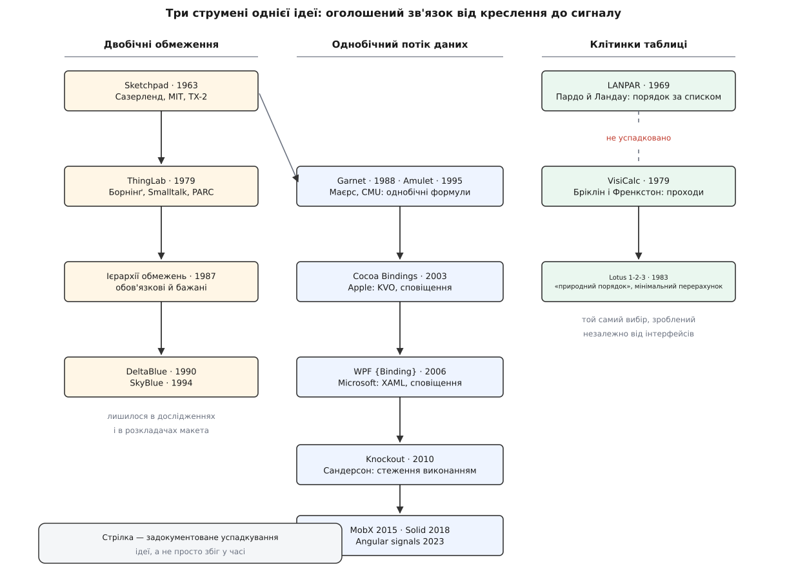
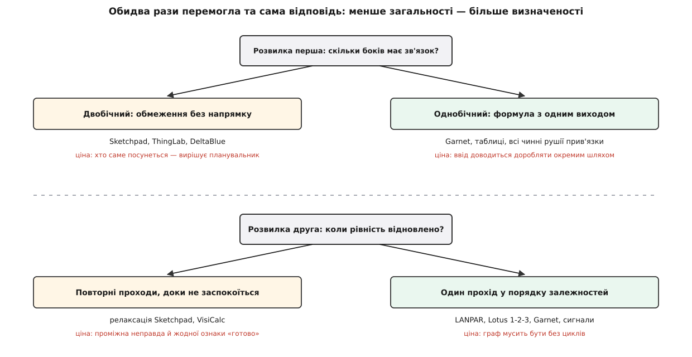

# 📜 Родовід прив'язки: від геометричних обмежень до порядку перерахунку

Ідея «оголоси зв'язок — машина його триматиме» старша за перший інтерфейсний каркас на чотири десятиліття, і народилася вона не в інтерфейсах, а в кресленні: перша програма, яка вміла тримати оголошений зв'язок, тримала не текст поля вводу, а перпендикулярність двох відрізків. Дорога від того креслення до сучасного `computed` — це історія двох розвилок, які галузь пройшла кілька разів незалежно й щоразу вибрала слабший, зате визначений варіант. Знати цю дорогу варто не задля дат: обидві розвилки лишилися всередині кожного чинного рушія прив'язки, і кожне його дивацтво — наслідок того давнього вибору.

## Креслення, яке тримає слово

Наприкінці 1961 року Айвен Сазерленд (Ivan Sutherland) сів за TX-2 у Лінкольнівській лабораторії MIT — машину з небаченими на той час 70 тисячами слів пам'яті, світловим пером і осцилографічним екраном. У січні 1963-го він подав дисертацію «Sketchpad: A Man-Machine Graphical Communication System», а навесні того ж року доповів її на весняній спільній обчислювальній конференції. Через двадцять п'ять років, у 1988-му, за цю роботу він дістав премію Тюрінга.

Що саме муляло? Креслення на папері — це слід графіту, і більш нічого. Про два відрізки на папері не можна сказати «вони завжди паралельні»: паралельність існує в голові рисувальника, а не в аркуші. Сазерлендів хід був простий на слово й важкий на діло: дати рисувальникові змогу **висловити математичну умову на вже накреслені частини** — оці два відрізки однакової довжини, оцей кут прямий, оця точка лежить на оцій прямій — і зробити так, щоб малюнок цю умову тримав сам, хоч би куди тягли світлове перо.

Ключова риса цих умов у тому, чого в них **немає**. Умова «точки P і Q збігаються» не каже, хто з них має посунутися. Обмеження (англ. *constraint*) — це рівність без напрямку, як рівність у шкільній алгебрі, а не присвоєння. Саме тому Sketchpad не міг просто «обчислити наслідок»: наслідку як такого не існувало, доводилося **розв'язувати систему**.

Розв'язував Sketchpad двома різними способами, і різниця між ними — зародок усього подальшого. Перший, названий у дисертації «однопрохідним методом», працював там, де для конкретного типу умови існував прямий рецепт: якщо відомо, які змінні вільні, значення для них рахується формулою за один крок. Другий був запасним і загальним — **релаксація**. Кожне обмеження вміло сказати, наскільки воно зараз порушене, — числом, яке дорівнює нулю рівно тоді, коли умова виконана:

```
Помилка обмеження «точки P і Q мають збігтися»:
  e = (Px − Qx)² + (Py − Qy)²        e = 0 ⟺ умова виконана

Сумарна помилка змінної v — сума помилок усіх обмежень, у яких вона бере участь:
  E(v) = e₁(v) + e₂(v) + … + eₙ(v)

Крок: посунути v туди, де E(v) менша. Обійти так усі змінні. Повторити.
Зупинка: коли сумарна помилка впала нижче порога.
```

Це чисельний метод, а не винахід графіки: рухаючи змінні по черзі й щоразу враховуючи вже оновлені сусідні, Sketchpad робив те, що в обчислювальній математиці зветься [методом Гаусса — Зейделя](topic:math/gauss-seidel), а в інженерній практиці 1930-х дістало від Річарда Саутвелла (Richard Southwell) назву «релаксація» — «послаблення» напруг у конструкції.

Разом із методом Sketchpad успадкував і три його неприємні риси, які нікуди не зникли досі. Він **повільний**: кожен прохід зачіпає всі змінні, і проходів потрібно багато. Він не має **ознаки готовності**: зупиняються не тоді, коли стало правильно, а тоді, коли перестало помітно мінятися. І між проходами малюнок перебуває в станах, яких у задачі не існує, — точки вже поїхали, але ще не туди. Сазерленд це знав і йшов на це свідомо: платою за загальність — за те, що умовою може бути «будь-що обчислюване», — була відсутність будь-якого порядку обчислень.

## Обмеження переїжджають в інтерфейс

У березні 1979 року Алан Борнінґ (Alan Borning) захистив у Стенфорді дисертацію про ThingLab, а в липні того ж року вийшла її перероблена версія технічним звітом Xerox PARC (SSL-79-3). ThingLab був написаний на Smalltalk-76 і прямо називав себе продовженням Sketchpad: ті самі обмеження, але вже не лише над геометрією — над електричними колами, мостами під навантаженням, графічними калькуляторами, розкладками елементів на екрані. До обмежень додалася об'єктна структура: частини й ціле, класи, успадкування.

І ось тут двобічність обмежень уперше показала не силу, а зуби. Візьміть найпростіший зв'язок двох полів на екрані:

```
цельсій = (фаренгейт − 32) · 5 / 9
```

Як рівність це бездоганно. Як програма — недостатньо: коли користувач правнув одне з полів, треба знати, **яке з двох** тепер вважати заданим, а яке перераховувати. Одна рівність, дві змінні, два різні розв'язки, і рівність сама не каже, котрий брати. Сазерлендова релаксація на цьому питанні просто не спинялася: вона рухала обидві змінні й приходила кудись — куди саме, залежало від початкового стану.

Відповідь, яку знайшла школа Борнінґа, — **ієрархії обмежень** (Борнінґ, Дуйсберг, Фріман-Бенсон і колеги, 1987): крім обов'язкових умов, у системі є бажані, різної сили, і серед них найважливіша — «лишайся, де був». Тоді питання «хто рухається» стає розв'язним: рухається той, чиє бажання лишитися слабше. Плановики, які будували з такої ієрархії конкретний напрямок обчислення й уміли перебудовувати його при кожній зміні, дістали назви DeltaBlue (1990) і SkyBlue (Майкл Саннелла, 1994).

Тим часом у Карнеґі-Меллона Бред Маєрс (Brad Myers) із колегами будував Garnet — набір для графічних інтерфейсів на Common Lisp, показаний широкій публіці 1990 року, а потім його наступника Amulet на C++ (1995–1997). Garnet свідомо відмовився від того, за що билися в Сіетлі: його обмеження були **однобічні й обов'язкові**. Формула має один вихідний слот; вона щось читає й кудись пише; напрямок відомий наперед. Багатобічність до Garnet усе-таки прибудували — Multi-Garnet Саннелли й Борнінґа (1992), — але це лишилося надбудовою, а не мейнстримом.

Відмова від двобічності виглядає збіднінням, і саме тому вона така важлива. Щойно кожна формула має відомий вихід, зв'язки перестають бути рівняннями й стають **орієнтованим графом**. У графі без циклів існує порядок, у якому кожен вузол рахується після всіх своїх входів, — [топологічне сортування](topic:algorithms/topological-sort). А там, де є такий порядок, релаксація непотрібна взагалі: один прохід, кожен вузол рахується рівно раз, проміжних неіснуючих станів немає, і момент «готово» настає точно, а не за порогом. Загальність проміняли на визначеність — і виграли.

Друге, що Garnet передав у спадок кожному сучасному рушієві, — спосіб **дізнатися залежності**. Formula-обмеження в Garnet не оголошувало, від чого воно залежить: система просто дивилася, які виклики читання слотів формула зробила, поки виконувалася, і з цього складала список. Змінився слот — система вже знала, кого перерахувати. Це те саме автоматичне стеження, яке сьогодні живить `computed` і сигнали; воно старше за веб.

Про десятиліття цієї роботи Гарнетова й Амулетова команда написала відверту підсумкову статтю (Вандер Занден, Гальтерман, Маєрс та ін., 2001) — про змагання алгоритмів односторонніх обмежень, які вони перепробували за десять років. Найцікавіше в тій статті — предмет суперечки. Розв'язати обмеження виявилося легко; важким лишалося питання, **коли саме** обчислювати — одразу після зміни чи ліниво, на момент читання. Це рівно те питання, яке досі розділяє рушії прив'язки й досі не має однієї правильної відповіді.


*Струмінь обмежень видихнувся в дослідженнях; струмінь однобічних формул дійшов до кожного каркаса; струмінь клітинок пройшов ту саму розвилку сам по собі.*

## Клітинка як найчистіший рушій зв'язування

Паралельно з інтерфейсною лінією йшла інша, яку рідко згадують поруч, — і дарма, бо саме вона довела ті самі висновки без жодного графічного контексту.

Улітку 1969 року двоє нещодавніх випускників Гарварда, Рене Пардо (Rene Pardo) і Ремі Ландау (Remy Landau), зробили для бюджетування в телекомунікаційних компаніях систему LANPAR — «мову для програмування масивів у довільному порядку». У ній уже було те, що згодом стане очевидним для кожного: **посилання вперед** (клітинка може згадувати клітинку, яку ще не описано) і **природний порядок перерахунку** — система сама впорядковувала обчислення за залежностями.

Доказовий статус тут варто розрізнити. Твердження «LANPAR — перша електронна таблиця» походить переважно від самих авторів і його важко перевірити незалежно; а от твердження про алгоритм спирається на первинний документ — патентну справу США № 4,398,249. Відомство спершу відмовило, вважаючи винахід суто математичним; після дванадцяти років оскаржень Суд митних і патентних апеляцій 5 серпня 1982 року (In re Pardo, 684 F.2d 912) відмову скасував, і рішення стало помітним прецедентом про патентоздатність алгоритмів. Кінець історії менш переможний: у середині 1990-х суд визнав патент невиконуваним через недобросовісну поведінку заявників при подачі, і апеляційна інстанція це підтвердила.

Головне ж інше: **у VisiCalc цього не було**. Коли 1979 року Ден Бріклін (Dan Bricklin) — задум народився в нього ще студентом Гарвардської школи бізнесу — і Боб Френкстон (Bob Frankston), який написав код, випустили таблицю для Apple II, вона перераховувала клітинки просто підряд: рядок за рядком або стовпець за стовпцем, на вибір користувача. Формула, що посилалася на клітинку нижче за порядком обходу, на першому проході брала старе значення. Ліки були ті самі, що в Sketchpad: **повторювати прохід, доки значення не перестануть мінятися**.

```
Клітинки:  A1 = 2      B1 = C1·2      C1 = A1 + 1
Порядок обходу — рядком: A1, B1, C1

прохід 1:  A1 = 2      B1 = 0·2 = 0     C1 = 2 + 1 = 3     ← B1 показує неправду
прохід 2:  A1 = 2      B1 = 3·2 = 6     C1 = 3
прохід 3:  нічого не змінилося → зупинка
           9 обчислень, 3 проходи, один хибний проміжний стан

За списком залежностей:  A1 → C1 → B1
прохід 1:  A1 = 2      C1 = 3           B1 = 6
           3 обчислення, 1 прохід, жодного хибного стану
```

Це та сама релаксація, лише без похідних і порогів: ітерація до нерухомої точки замість упорядкованого обчислення. І ціна та сама — проміжні стани, яких у житті таблиці не було, та відсутність вбудованої ознаки «готово»: користувач дізнавався, що перерахунок завершено, з того, що чергове натискання нічого не змінило.

Lotus 1-2-3, що вийшла 1983 року, здобула ринок кількома речами одразу, і однією з них був **природний порядок перерахунку**: таблиця вела список залежностей і рахувала клітинку раніше за всіх, хто від неї залежить. Другою — **мінімальний перерахунок**: чіпати лише ті формули, яких зміна справді стосується. Обидва прийоми — це буквально те, що робить сучасний рушій сигналів: позначити застарілим усе нижче за течією та обійти позначене в топологічному порядку.

Варто затримати око на тому, що тут сталося. Таблична лінія нічого не знала про Sketchpad і не мала графічних обмежень; вона розв'язувала свою задачу з нуля — і дійшла до тієї самої розвилки й того самого вибору. Коли два незалежні струмені сходяться в одній відповіді, це вже не мода, а властивість самої задачі.

## Прив'язка приходить у каркаси

Слово «прив'язка» в його теперішньому значенні прийшло у широкий вжиток на початку 2000-х, коли механізм переїхав з дослідницьких наборів у промислові.

Cocoa Bindings з'явилися у Mac OS X 10.3 Panther 2003 року, поверх пари технологій кодування й спостерігання за ключами (KVC та KVO). Через три роки, у листопаді 2006-го, Microsoft випустила WPF у складі .NET Framework 3.0, а з ним розмітку XAML і вираз `{Binding}`. Обидві системи відповіли на питання «звідки рушій дізнається про зміну» однаково: **джерело саме скаже** — через сповіщення спостерігачам про зміну властивості. Це [спостерігач](topic:programming/observer), опущений до рівня окремого поля, і саме тому обидві платформи вимагали від моделі спеціальної форми: успадкування, атрибута, реалізації інтерфейсу сповіщення.

Різниця з Garnet тут глибша, ніж здається. Сповіщення дає ребра графа поштучно — «ця прив'язка слухає цю властивість», — але не дає **графа**. Похідне значення в такій системі не є вузлом: його або обчислює перетворювач по дорозі, або програміст руками заводить ще одну властивість і руками ж не забуває надіслати з неї сповіщення. Гарнетів трюк — вивести залежності з того, що формула прочитала, поки виконувалася, — у 2003 та 2006 роках у промислових наборах не застосовували.

Повернув його у веб Стів Сандерсон (Steve Sanderson) у липні 2010 року разом із бібліотекою Knockout: `ko.computed` виконує вашу функцію, дорогою запам'ятовує, які спостережувані значення вона прочитала, і підписується саме на них. Чи знав автор про Garnet, документи не кажуть — механізм тотожний, пряме успадкування не засвідчене, тож чесніше говорити про повторний винахід, ніж про запозичення.

Далі маятник хитнувся в інший бік: масові каркаси середини 2010-х відповіли на те саме питання протилежно — перераховувати весь опис подання наново й порівнювати результат зі старим. Дрібнозернисте стеження за залежностями на кілька років випало з моди, але не зникло: MobX Мішеля Вестстрате (2015) прямо називає своїми джерелами Knockout та систему стеження Meteor. А потім вернулося вже як окрема іменована річ — **сигнал**. Раян Карніато (Ryan Carniato), автор Solid (робота почалася 2016-го, публічний випуск — 2018-й), казав про мотив без манівців: він хотів і далі користуватися дрібнозернистими реактивними взірцями, які полюбив у Knockout. Команда Angular, додаючи сигнали у версії 16 (2023), окремо подякувала Карніато за консультації. Так лінія Garnet → Knockout → Solid → Angular замикається на тому самому механізмі, з якого починалася: залежність визначається тим, що прочитано під час виконання. [Реактивне програмування](topic:programming/reactive-programming) в тій частині, де воно про залежності, а не про час, — це той самий струмінь під іншою назвою.

## Дві розвилки, які проходять усі

Історія тут не збігається з хронологією, бо той самий вибір робили в різні десятиліття різні люди, які нічого не знали одне про одного.

**Перша розвилка — скільки боків має зв'язок.** Sketchpad і ThingLab узяли двобічні обмеження, і за це заплатили розв'язувачем, чий результат залежить від того, як планувальник вибрав напрямок. Garnet, електронні таблиці й геть усі чинні рушії прив'язки взяли однобічну формулу з відомим виходом. Двобічність вижила рівно в одному вузькому місці — у полі вводу, куди користувач пише руками, — і навіть там доброю практикою вважається повернути асиметрію свідомо.

**Друга розвилка — коли рівність відновлено.** Релаксація Sketchpad і перерахунок VisiCalc відповіли «повторюй, доки не заспокоїться»; LANPAR, Lotus 1-2-3, Garnet і сучасні сигнали відповіли «пройди раз у порядку залежностей». Перша відповідь загальніша: вона переживає цикли й неоднозначність. Друга вимагає графа без циклів — і натомість дає точний момент готовності та роботу, пропорційну лише зачепленій частині графа.


*Обидва рази вибирали не потужніший розв'язувач, а той, чий графік роботи відомий наперед.*

Спільне в обох виборах одне: галузь щоразу віддавала загальність за визначеність. Це й пояснює форму сучасних рушіїв — те, чому вони [описують відношення, а не порядок дій](topic:programming/declarative-vs-imperative), але всередині тримають орієнтований граф і сортують його; чому цикл у залежностях вони вважають помилкою, а не задачею для розв'язувача; і чому двобічна прив'язка лишається окремим, обережно обгородженим випадком.

Одне питання з трьох цей родовід так і не закрив. Що таке зв'язок і в якому порядку його відновлювати — вирішено двічі й однаково. А от **коли** обчислювати — одразу чи ліниво, за одну мікрозадачу чи за кадр — досі відкрите: те саме, на що скаржилася Гарнетова команда 2001 року, читач сьогодні бачить у вигляді `nextTick` і `updateComplete`.
