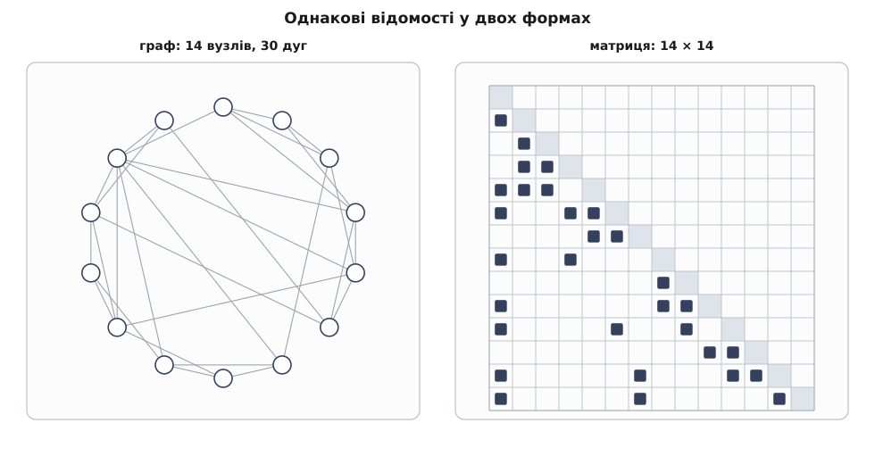
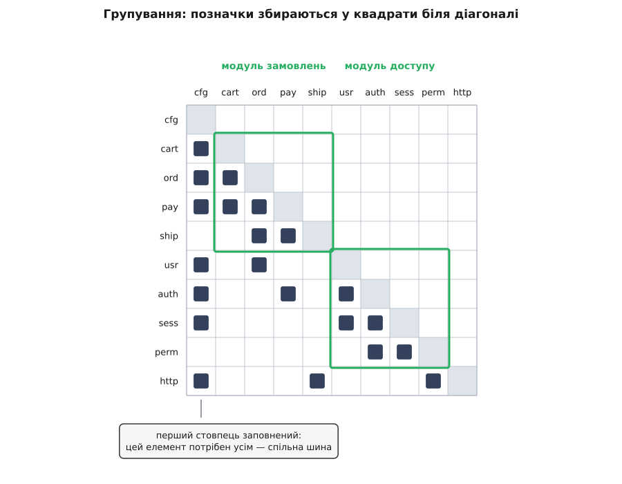

# Матриця залежностей (DSM)

<preknowlist>
- [Зчеплення і зв'язність](topic:programming/coupling-cohesion) — що означає «модуль A залежить від модуля B», і чому кількість та напрямок таких залежностей визначають ціну зміни.
- [Теорія графів](topic:math/graph-theory) — орієнтований граф, дуга, шлях, цикл, досяжність і матриця суміжності: матриця залежностей — це саме вона, тільки прочитана інженерно.
</preknowlist>

Ти збираєшся правити один модуль. Ще до першого рядка правки має прозвучати питання: **куди ця зміна дістане?** Одразу за ним друге: **у якому порядку цю систему взагалі можна складати й перевіряти?** І третє: **що з неї можна відрізати — окремою бібліотекою, окремим сервісом, окремою командою?**

Питання різні, а відповідь на всі три лежить в одному місці — і цього місця немає в жодному файлі. Вона лежить **між** файлами: у наборі фактів «цей потребує того». Кожен окремий факт видно неозброєним оком, досить розгорнути список імпортів. Але поодинці жоден із них нічого не важить; важить лише вся сукупність — а її ніхто ніколи не бачив цілком.

Природний порив — намалювати граф: кружечки з іменами, стрілки між ними. На десятьох модулях це працює. На тридцятьох картинка стає клубком, у якому стрілки перетинаються частіше, ніж кудись ведуть, і щоб дізнатися, хто потребує модуля `db`, доводиться водити пальцем по лініях. На трьохстах малювати нема сенсу взагалі. Причина не в лінощах художника: кількість дуг росте як квадрат кількості вузлів, а площина в нас двовимірна й перетинів не уникнути.

Але сама інформація нікуди не зникла й лишилася скінченною та точною. Для кожної впорядкованої пари елементів існує рівно одна відповідь «так» або «ні». Таких пар *n*², і вони чудово вкладаються у звичайну квадратну таблицю: елементи по рядках, ті самі елементи в тому самому порядку по стовпцях, у клітинці — позначка або порожньо. Ця таблиця й називається **матрицею залежностей**, або DSM: у первісному, ще не програмному значенні — *design structure matrix*, «матриця структури проєкту»; у програмному світі частіше кажуть *dependency structure matrix*, «матриця структури залежностей». Скорочення однакове, предмет той самий.

## Що записує клітинка

Перш ніж малювати таблицю, треба домовитися про дві речі, і обидві важать більше, ніж здається.

Перша — **що вважати елементом**. Файл, клас, пакет, збірка, сервіс, крок процесу — це вибір рівня, і матриці різних рівнів для однієї системи виглядають по-різному. Друга — **що вважати залежністю**. Імпорт? Виклик функції? Успадкування? Згадка типу в сигнатурі? Запис у ту саму таблицю бази? Рядок у конфізі, за яким контейнер підставить реалізацію? Кожна відповідь дає свою матрицю, і жодна з них не «правильніша» — вони просто про різне. Домовленість треба зафіксувати й тримати, бо порівнювати можна лише матриці, побудовані за однаковим правилом.

Далі — угода про напрямок. Візьмімо ту, яка в програмному світі найпоширеніша: **позначка в клітинці (i, j) означає «елемент рядка i потребує елемент стовпця j»**. Діагональ (i, i) сенсу не має й лишається порожньою — її просто зафарбовують, щоб око чіплялося за неї як за орієнтир.


*Рядок і стовпець того самого елемента відповідають на два протилежні питання. Діагональ ділить площину матриці на дві половини, і те, у якій половині опинилася позначка, залежить не від системи, а від обраного порядку елементів — на цій обставині тримається вся користь від матриці.*

Обов'язково перевіряй, у який бік читає матрицю твій інструмент: половина програм показує транспоновану угоду, «стовпець потребує рядок». Інформація однакова, а картинка дзеркальна, і читати її навпаки означає бачити орієнтовану систему точно навиворіт.

Тепер варто чесно сказати, чого в матриці **немає**. У ній рівно стільки ж відомостей, скільки в орієнтованому графі залежностей: це його матриця суміжності, ані байтом більше. Матриця не додає знання. Вона додає **форму** — а від форми залежить, які питання взагалі можна поставити й за скільки часу отримати відповідь.

## Чому таблиця не розсипається на масштабі

Порівняймо дві форми чесно, за тим, чого коштує кожна операція читання.

У намальованому графі положення вузла — вільний параметр, і його треба десь узяти. Гарне розкладання (мало перетинів, короткі дуги) — окрема важка задача оптимізації, у якої на реальних розмірах немає доброго розв'язку. Питання «хто потребує `db`» вимагає простежити всі лінії, що входять у вузол, а вони приходять із різних боків і перетинаються з чужими. Дві сусідні на картинці вершини можуть бути ніяк не пов'язані, а пов'язані — на протилежних краях.

У матриці положення елемента не вільне: воно задане його номером у списку, однаковим для рядка й для стовпця. Звідси все інше. Позначки ніколи не перетинаються, бо кожна сидить у своїй клітинці. Питання «хто потребує `db`» — це один вертикальний погляд уздовж стовпця `db`. Питання «що потрібно `db`» — один горизонтальний погляд уздовж рядка. Розмір картинки не залежить від кількості залежностей: 300 елементів — це завжди сітка 300×300, хай там у ній 900 позначок чи 9000.

І головне: коли клітинка стає меншою за букву, матриця не вмирає. Імена вже не прочитати, але **візерунок** видно чудово — де густо, де порожньо, де позначки збилися у квадрат, де витягнулися в суцільну смугу. Око людини влаштоване так, що згустки й порожнечі в сітці воно ловить миттєво, без жодного зусилля. Клубок ліній на тому самому масштабі не показує нічого.



*Той самий набір залежностей у двох формах. Ліворуч інформація є, але недоступна: щоб відповісти на будь-яке питання, треба простежити лінії. Праворуч кожна відповідь — це погляд уздовж рядка або стовпця, а згустки позначок видно навіть тоді, коли підписи вже нечитабельні.*

> 🔧 **Навіщо це.** Найдорожча година нового розробника у великій системі — перша, коли він намагається зрозуміти, з чого вона складається. Матриця залежностей рівня пакетів на одному екрані дає те, чого не дає ні дерево тек, ні документація: видно, які пакети ні від чого не залежать (з них можна починати читання), які потрібні всім (їх доведеться зрозуміти першими) і які збилися в клубок (у них не варто лізти без провідника). Той самий екран у рев'ю відповідає на питання «чи ця гілка не додала нової залежності через пів системи» — за секунди й без суперечок про смаки.

## Рядок і стовпець — два різні питання

Дві суми по одному елементу вимірюють дві різні речі, і плутати їх — типова й дорога помилка.

**Сума по рядку** — скільки елементів потрібно цьому. Це його вхідна ціна: стільки треба зібрати, підняти або підмінити заглушками, щоб він хоч запустився в тесті. Рядок, у якому позначено майже все, — це елемент, що тягнеться до всієї системи. Ім'я в нього зазвичай гарне («сервіс замовлень», «менеджер»), а суть — диспетчер, який сам нічого не робить, зате знає про всіх.

**Сума по стовпцю** — скільки елементів потребують цього. Це його ціна зміни: стільки місць може зачепити правка всередині. Стовпець, у якому позначено майже все, — це спільне ядро: базові типи, журнал, конфіг. Саме по собі це не хвороба; хвороба починається, коли таке ядро ще й часто змінюється, бо тоді кожна його правка розходиться системою хвилею.

Звідси випливає давнє правило, яке з матриці видно як факт, а не як настанову: **чим повніший стовпець елемента, тим стабільнішим він мусить бути**. Елемент, від якого залежать усі, не має права залежати від того, що часто змінюється, — інакше він передає чужу нестабільність далі всім своїм користувачам. Технічний прийом, яким цю вимогу задовольняють, коли ядру таки треба щось від верхніх шарів, — [інверсія залежностей](topic:programming/dependency-inversion): ядро оголошує інтерфейс і залежить від нього, а конкретну реалізацію підставляють ззовні; у матриці це видно як перевернута позначка — вона переїздить у дзеркальну клітинку.

Порожні рядки й порожні стовпці теж говорять. Порожній рядок — елемент, який нічого не потребує: чисті типи, математика, константи. Порожній стовпець — елемент, якого ніхто не потребує: або це вхідна точка системи, або мертвий код, і розрізнити ці два випадки матриця не може, а ти можеш за секунду.

## Переставляння: єдина дія, що нічого не змінює й показує все

Порядок елементів у списку ми обрали довільно — за абеткою, за текою, за часом появи. На саму систему він не впливає ніяк: від того, що два рядки помінялися місцями, жодна залежність не з'явилася й не зникла. Але **переставити рядки й стовпці треба одночасно й однаково** — бо рядок і стовпець із номером *i* належать тому самому елементу, і зсунути одне без другого означає зіпсувати таблицю. Мовою матриць така одночасна перестановка — це перехід від матриці A до P·A·Pᵀ, і в ній рівно ті самі позначки, лише в інших клітинках.

Дія нічого не змінює, зате дозволяє поставити питання про форму. Ось воно: **чи існує такий порядок елементів, за якого всі позначки опиняться нижче діагоналі?**

Розберімо, що означало б «так». Позначка нижче діагоналі — це залежність елемента від того, хто стоїть **раніше** за нього в списку. Якщо всі позначки нижче, то кожен елемент потребує лише тих, хто вже пройдений. Отже, список можна читати згори вниз, і в кожній точці все потрібне вже позаду. Це і є порядок збирання, порядок вивчення, порядок випуску. Такий порядок називають топологічним, а знаходить його [топологічне сортування](topic:algorithms/topological-sort) — обхід, що видає вершини так, щоб кожна стояла після всіх, кого потребує.

І одразу «ні». Якщо `A` потребує `B`, а `B` потребує `A`, то в будь-якому порядку один із них стоїть раніше, а отже принаймні одна позначка неминуче опиняється **вище** діагоналі. Це не властивість невдалого впорядкування — це властивість самої системи. Матриця стає повністю трикутною тоді й лише тоді, коли в графі залежностей **немає жодного циклу**.

Ось у чому сила ходу. Питання «чи є в системі циклічні залежності» звучить абстрактно і перевіряється важко. Питання «чи вдалося зігнати всі позначки на один бік діагоналі» — геометричне, і відповідь на нього видно з відстані витягнутої руки. Одна властивість системи перекладена в іншу — у форму плями на картинці.

Тут потрібне уточнення, без якого легко помилитися. Позначка вище діагоналі **в конкретному порядку** ще нічого не доводить: можливо, порядок просто невдалий. Доводить лише неможливість — коли жоден порядок її не прибирає. Тому одного погляду мало, потрібна процедура.

## Розбиття: як знайти справжні модулі

Процедура називається **розбиттям** (англ. *partitioning*) і будується на найпростішій ідеї: знімати те, що знімається.

Знайди елементи з **порожнім рядком** — вони не потребують нічого. Постав їх на початок списку й викресли з матриці. Після викреслювання порожніми стануть рядки тих, хто потребував лише знятих, — постав їх наступними й викресли теж. Симетрично з другого кінця: елемент із **порожнім стовпцем** нікому не потрібен, його можна ставити в кінець списку й знімати.

Поки процес іде, він видає готовий порядок. Цікаве починається, коли він зупиняється: лишається група, у якій **кожен елемент і когось потребує, і комусь потрібен**. Зняти нічого не можна — а це рівно означає, що всередині групи є цикл. Точніше, така група розпадається на [сильно зв'язні компоненти](topic:algorithms/strongly-connected-components): множини елементів, кожні два з яких досяжні один з одного.

Стисни кожну таку компоненту в один умовний вузол — отримаєш **конденсацію**, граф без циклів за побудовою. Його вже можна впорядкувати топологічно, і цей порядок, розгорнутий назад у самі елементи, дає **блочно-трикутний вигляд** матриці: усе нижче діагоналі, окрім квадратних блоків, що сидять **на** діагоналі, — по одному на кожну компоненту. Позначки вище діагоналі лишаються тільки всередині цих блоків, і жоден порядок їх звідти не прибере.

Практично це рахують не викреслюванням, а алгоритмом Тарджана — одним [обходом у глибину](topic:algorithms/depth-first-search) за час O(V + E), тобто лінійно від розміру графа. [Робоча програма, що будує матрицю з переліку залежностей, знаходить блоки й друкує впорядковану таблицю](topic:programming/design-structure-matrix/proj-dsm-partition.md), розібрана окремо разом із пастками, які чекають на реальних кодових базах.

**Приклад: шість модулів невеликого сервера.** Залежності зчитані з імпортів: `log` потребує `config`; `db` потребує `config` і `log`; `order` потребує `db`, `log` і `billing`; `billing` потребує `db` і `order`; `http` потребує `order`, `billing` і `log`. Спершу порядок — абетковий, як у теці.

```
          bil  cfg  db   htp  log  ord
   bil     ■    ·    ×    ·    ·    ×
   cfg     ·    ■    ·    ·    ·    ·
   db      ·    ×    ■    ·    ×    ·
   htp     ×    ·    ·    ■    ×    ×
   log     ·    ×    ·    ·    ■    ·
   ord     ×    ·    ×    ·    ×    ■

   позначок вище діагоналі: 4
```

Тепер розбиття. Порожній рядок один — `cfg`, він іде першим. Після його викреслювання порожніє рядок `log` — другим. Після `log` порожніє `db` — третім. Далі не знімається нічого: `order` потребує `billing`, `billing` потребує `order`. Це компонента з двох елементів. З іншого кінця знімається `http` — його стовпець порожній, ним ніхто не користується.

```
          cfg  log  db   ord  bil  htp
   cfg     ■    ·    ·    ·    ·    ·
   log     ×    ■    ·    ·    ·    ·
   db      ×    ×    ■    ·    ·    ·
   ord     ·    ×    ×    ■    ×    ·
   bil     ·    ·    ×    ×    ■    ·
   htp     ·    ×    ·    ×    ×    ■
                        └──блок──┘

   позначок вище діагоналі: 1 — і вона всередині блоку
```


*Обидві таблиці описують ту саму систему з тими самими одинадцятьма залежностями — змінився лише порядок, у якому виписані елементи. Праворуч видно і план збирання (згори вниз), і єдине місце, де він неможливий: обведений блок, чию внутрішню позначку не прибрати жодним переставлянням.*

Порядок збирання прочитується згори вниз: `config`, `log`, `db`, потім `order` разом із `billing`, потім `http`. Єдина позначка вище діагоналі — `order` потребує `billing` — сидить у блоці 2×2 і звідти нікуди не подінеться.

Ось що каже цей блок, і заради цього все й робилося. `order` і `billing` лежать у різних теках, мають різні імена й різних власників у списку відповідальних. Але зібрати один без другого не можна. Протестувати один без другого — теж, хіба через заглушку, яка повторює половину поведінки сусіда. Випустити нову версію одного, не випускаючи другого, не можна. Віддати їх двом командам не можна: будь-яка правка інтерфейсу між ними вимагає одночасної згоди обох. За всіма ознаками, які взагалі щось значать на практиці, `order` і `billing` — **один модуль**, який лише вдає з себе два. Матриця це показує, а дерево тек приховує.

Саме тому вимога тримати залежності ациклічними — не естетична примха, а умова того, щоб оголошені модулі були модулями насправді; у неї є ім'я і власна історія — [принцип ациклічності залежностей](topic:programming/acyclic-dependencies).

> 🔧 **Навіщо це.** Блочно-трикутна форма — це готовий план збирання. Порядок рядків задає порядок компіляції й порядок випуску пакетів; кожен діагональний блок — це набір, який доведеться складати, версіонувати й випускати як одне ціле. Коли команда сперечається, чи можна винести підсистему в окремий репозиторій, суперечка закінчується за хвилину: якщо підсистема — це рівно один діагональний блок або кілька повних блоків підряд, її можна відрізати; якщо вона розсікає блок навпіл — не можна, поки блок не розірвано.

## Розривання: що робити з блоком

Знайти блок — половина справи. Друга половина — **розривання** (англ. *tearing*): вибрати всередині блоку залежності, які треба прибрати, щоб блок став трикутним.

Прибрати можна не будь-яку. Мінімальний набір дуг, видалення яких робить граф ациклічним, — задача, для якої не існує швидкого точного алгоритму, тож на практиці шукають наближено. Але оптимізувати кількість тут і не треба: інженерне питання не «яких дуг менше», а «яка з них помилкова».

Різниця видно на прикладі. `order` потребує `billing`, бо після створення замовлення хоче виставити рахунок. `billing` потребує `order`, бо хоче прочитати склад замовлення, щоб порахувати суму. Дві дуги — але вони різної природи. Друга описує **дані**: рахунку потрібні позиції, це чесна залежність від структури. Перша описує **дію в майбутньому**: замовлення не потребує рахунка, щоб бути замовленням, — воно лише хоче, щоб хтось відреагував на його появу. Розривати треба саме її, і способів кілька: винести виклик у шар, що стоїть вище обох; оголосити в `order` інтерфейс «повідомити про створення» і підставити реалізацію ззовні; замінити прямий виклик подією, на яку `billing` підписаний.

У всіх трьох випадках у матриці відбувається одне й те саме: позначка або зникає, або переїздить у дзеркальну клітинку — і блок 2×2 розсипається на два окремі рядки. Матриця показала **де** розривати; чим саме — вирішує розуміння предмету, і жоден алгоритм цього не підкаже.

Коли кандидатів на розрив кілька й вони рівноцінні на око, допомагає **числова матриця**: замість «так/ні» в клітинці стоїть вага — кількість місць виклику, кількість імпортованих імен, частота спільних правок. Дуга вагою 1 розривається за годину, дуга вагою 200 означає, що межа проведена принципово не там, і чесніше об'єднати обидва елементи в один, ніж мучити їх інтерфейсом.

## Групування: де межі хочуть пролягти

Розбиття відповідає на питання про порядок і цикли. Друга операція над матрицею відповідає на інше: **де мали б проходити межі модулів**.

Ідея та сама — переставляння, — але ціль інша: зібрати позначки в щільні квадрати, що торкаються діагоналі, і залишити якнайменше позначок поза ними. Квадрат — це група елементів, які густо потребують одне одного й рідко потребують решти. Це визначення модуля, отримане не з наміру автора, а з фактичної тканини коду: висока частка внутрішніх зв'язків, низька частка зовнішніх — те саме, що [зчеплення і зв'язність](topic:programming/coupling-cohesion) описують словами.

Групування — задача оптимізації з цільовою функцією, і функцію треба вибрати. Звичайна форма: сумарна ціна взаємодій, де взаємодія всередині групи коштує дешево, а між групами — дорого, причому ціна росте з розміром групи, щоб алгоритм не звалив усе в одну купу. Різні ваги дають різні розбиття; єдино правильного немає. Тому результат групування — це **пропозиція до обговорення**, а не вирок: машина показує, як код злипся насправді, а рішення, чи це і є правильні межі предметної області, ухвалює людина, дивлячись на [обмежені контексти](topic:programming/bounded-context) й на те, що змінюється разом.



*Два щільні квадрати — це модулі, знайдені за фактичною тканиною коду. Поодинокі позначки між квадратами — місця, де модулі говорять одне з одним; їх мало, і кожну можна назвати. Перший стовпець належить елементу, який не влазить у жоден квадрат: його потребують майже всі. Це не помилка групування, а спільна шина.*

Майже завжди після групування лишається кілька елементів, які опираються: їхні позначки розмазані по всіх групах одразу. Це журнал, конфіг, базові типи, утиліти часу. Заганяти їх у якусь групу силоміць — псувати картину; правильна відповідь — визнати їх окремим спільним шаром, яким дозволено користуватися всім, і далі вимагати від нього рівно однієї речі: майже ніколи не змінюватися. Так у матриці народжується той самий поділ на шари, який зазвичай оголошують наперед, — тільки тут він виведений із коду, а не приписаний йому; про свідоме проведення таких шарів — [шарова архітектура](topic:programming/layered-architecture).

Групи, знайдені в матриці коду, варто покласти поруч із іншою матрицею — тією, де елементи це люди й команди, а позначка означає «ці двоє мусять домовлятися». Розбіжність двох картинок — найточніший з відомих ранніх сигналів про майбутні проблеми, і пояснює її [закон Конвея](topic:programming/conways-law): структура системи повторює структуру спілкування тих, хто її будує.

## Непряма досяжність і вартість поширення

Прямі позначки — ще не вся правда. Зміна в `config` торкається `log` напряму, а `db` — уже через `log`, і далі йде хвилею. Питання «куди дістане зміна», з якого все почалося, стосується не сусідів, а всіх досяжних.

Матриця це вміє. Якщо A — матриця прямих залежностей, то в булевому множенні (де «плюс» це «або», а «множення» це «і») добуток A·A позначає пари, з'єднані шляхом довжини рівно два, A³ — довжини три, і так далі. Об'єднання всіх степенів разом з одиничною матрицею дає **матрицю видимості** V: позначка в (i, j) означає, що зміна в j може дістатися i хоч якимось шляхом. Це [транзитивне замикання](topic:algorithms/transitive-closure) графа залежностей, а обчислюється воно швидше, ніж підказує визначення: досить пройти конденсацію у зворотному топологічному порядку, накопичуючи бітові маски.

```cpp
// Рядок матриці — бітова маска: біт j стоїть, якщо i потребує j напряму.
// (Для n > 64 замість uint64_t беруть масив слів — логіка та сама.)
using Row = std::uint64_t;
std::vector<Row> dep(n, 0), vis(n, 0);

// vis[i] — усе, що бачить i: сам плюс усе досяжне з нього.
// Блоки конденсації беремо у ЗВОРОТНОМУ топологічному порядку,
// тож кожен блок, на який цей посилається назовні, уже порахований.
// Усередині блоку видимість спільна, тому рахуємо її раз на весь блок.
for (const Block& b : blocks_reverse_topo) {
    Row v = 0;
    for (int i : b.members) v |= 1ull << i;      // блок бачить сам себе цілком
    for (int i : b.members) {                    // проходимо ВСІ рядки блоку,
        Row r = dep[i];                          // тому сусід зсередини блоку
        while (r) {                              // нічого не загубить: його власні
            int j = std::countr_zero(r);         // виходи назовні додасть його рядок
            r &= r - 1;                          // (погасити молодший біт)
            v |= vis[j];
        }
    }
    for (int i : b.members) vis[i] = v;
}

long long total = 0;                             // скільки всього видимо
for (int i = 0; i < n; ++i) total += std::popcount(vis[i]);
double propagation = double(total) / (double(n) * n);
```

Щільність матриці видимості — частка заповнених клітинок від усіх *n*² — має ім'я: **вартість поширення** (англ. *propagation cost*). Читається вона так: якщо навмання ткнути пальцем в елемент і змінити його, яку частку системи ця зміна потенційно зачепить. Гарна властивість цієї величини — вона однакова, хоч з якого боку рахуй: сума «скільки бачу я» по всіх елементах дорівнює сумі «скільки бачать мене», бо це одні й ті самі позначки, лише переглянуті по стовпцях замість рядків.

**Приклад: та сама шістка модулів.** Рахуємо, скільки елементів бачить кожен, разом із собою.

```
   cfg  → {cfg}                                  = 1
   log  → {log, cfg}                             = 2
   db   → {db, cfg, log}                         = 3
   ord  → {ord, db, log, bil, cfg}               = 5
   bil  → {bil, db, ord, log, cfg}               = 5
   htp  → {htp, ord, bil, db, log, cfg}          = 6
                                          сума  = 22

   вартість поширення = 22 / 6² = 22 / 36 ≈ 61 %
```

Шістдесят один відсоток — багато, але порівнювати це число з чужими не можна: на малих системах воно завжди велике, бо кожен елемент неминуче бачить помітну частку з небагатьох. Величина має сенс лише в порівнянні **однієї системи із самою собою в різні моменти** або з системою схожого розміру. Зверни увагу й на те, звідки взялися дві п'ятірки: `order` і `billing` бачать однаково, бо сидять в одній компоненті — циклічний блок робить видимість своїх членів спільною і тим самим підіймає вартість поширення для всіх, хто до нього дотягується.

Саме на такому вимірюванні побудоване одне з небагатьох акуратних свідчень того, що свідома перебудова заради модульності справді щось міняє, а не лише виглядає гарніше на схемі. Ален Маккормак, Джон Руснак і Карлісс Болдвін (Management Science, 2006) порахували вартість поширення для Mozilla до й після свідомої перебудови заради модульності: 17.35 % проти 2.78 % — тобто після перебудови випадкова зміна файлу потенційно сягала приблизно на 80 % менше файлів, ніж до неї. [Звідки взялася сама матриця й хто приніс її в програмування](topic:programming/design-structure-matrix/hist-steward-dsm.md) — окрема історія, що почалася зовсім не з коду. [Математика замикання: булеві степені, критерій ациклічності через нільпотентність і чому щільність не залежить від напрямку читання](topic:programming/design-structure-matrix/math-visibility-closure.md) — розібрана окремо.

## Де матриця мовчить і де бреше

Матриця точна рівно настільки, наскільки точний спосіб, яким її здобули. Ось перелік місць, де вона розходиться з дійсністю, і всі вони трапляються щодня.

**Позначку ставить видобувач, а не істина.** Статичний аналіз бачить імпорти й виклики. Він не бачить залежності, схованої в рядку конфігу, за яким контейнер підставляє реалізацію; не бачить виклику через відображення типів; не бачить, що два сервіси зв'язані спільним форматом повідомлення. Матриця покаже гарну трикутну картину, а система при цьому впаде від зміни, якої в ній не позначено.

**Рівень елемента міняє відповідь.** Матриця пакетів і матриця файлів тієї самої системи не подібні. Укрупнення ховає цикли всередині пакета — і породжує нові між пакетами, бо досить однієї пари файлів, що дивляться одне на одного через межу, щоб два пакети злиплися в блок. Тому дивитися треба на обох рівнях: пакетний — щоб бачити форму, файловий — щоб бачити причину.

**Позначка не має ваги.** Один виклик і чотириста викликів виглядають однаково. Через це матриця однаково суворо лає дрібну технічну залежність і глибоке переплетення. Ліки прості — числова матриця, але вона потрібна не завжди, а лише коли доходить до вибору, що саме розривати.

**Структурна залежність — не єдиний вид залежності.** Два файли можуть не знати одне про одного зовсім і при цьому змінюватися завжди разом: спільна домовленість про формат, однакове магічне число, дзеркальні гілки в двох місцях. Матриця імпортів таку пару не покаже. Покаже інша матриця — побудована не з коду, а з історії правок, де позначка означає «ці двоє часто потрапляють в один коміт»; це [логічне зчеплення](topic:programming/logical-coupling), і накладені одна на одну дві матриці ловлять саме те, що кожна поодинці пропускає.

**І головне: матриця нічого не знає про зміст.** Ідеально трикутна матриця над неправильним поділом системи — це акуратно впорядкована неправильна система. Матриця скаже, що модулі можна складати по черзі, і промовчить про те, що предметна область порізана не по суглобах. Форма — необхідна умова здорової структури, але не достатня, і плутати ці дві речі означає оптимізувати те, що вимірюється, замість того, що важить. Ціна такої плутанини накопичується так само тихо, як [технічний борг](topic:programming/technical-debt).

## Оголошена матриця проти справжньої

Матриця, побудована з коду, — дзеркало: вона показує те, що є. Але щойно структура системи стала таблицею, у неї з'явився й другий спосіб ужитку — виписати таблицю **бажаного** й порівняти дві.

Виглядає це просто. Ти оголошуєш правила виду «шар домену не має права дивитися на шар доступу до даних», «модуль `billing` не має права дивитися на `http`», «до `log` можна всім». Кожне правило — це заборонена або дозволена клітинка. Далі щоразу будується справжня матриця з коду й накладається на оголошену. Клітинка, у якій є позначка й немає дозволу, — порушення з точним іменем: хто, кого, у якому файлі.

Різниця між двома матрицями має точну назву — це і є [ерозія архітектури](topic:programming/architecture-erosion), виміряна в клітинках. І саме тому перевірка живе в конвеєрі складання, а не в голові рев'юера: людина не втримає в пам'яті триста правил, а порівняння двох таблиць — арифметика. Порушення, спіймане в день появи, коштує однієї правки; те саме порушення через рік вростає в десяток місць і стає блоком на діагоналі.

Тут же видно, чому корисно оголошувати матрицю бажаного **до** того, як код написано. Оголошена таблиця — це проєктне рішення, зафіксоване у формі, яку можна перевірити машинно; вона перетворює архітектуру з наміру на властивість, яку система або має, або не має, без місця для тлумачень. А система, чия матриця складається в трикутник, має властивість, вартішу за будь-яку метрику: її можна зрозуміти **по черзі**, починаючи з чогось, що не потребує нічого. Здатність бути зрозумілою в якомусь порядку — це, зрештою, найчесніше з робочих означень архітектури.
