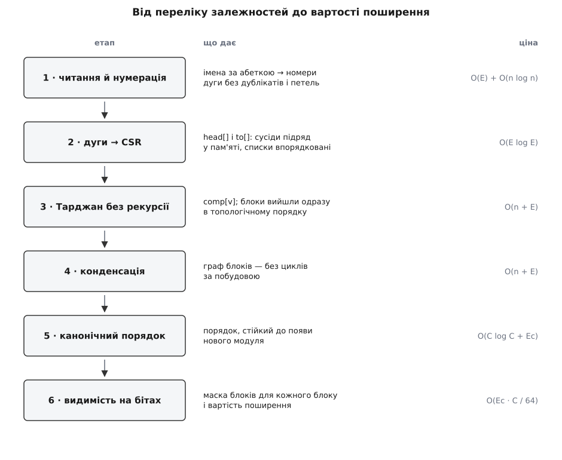
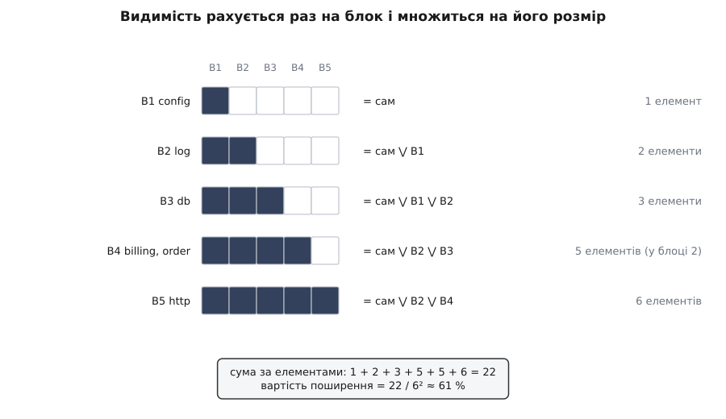

# ⚙️ Програма розбиття: від переліку залежностей до блоків і вартості поширення

<preknowlist>
- [Сильно зв'язні компоненти](topic:algorithms/strongly-connected-components) — множини вершин, кожні дві з яких досяжні одна з одної; саме вони стають квадратними блоками на діагоналі, і саме їх шукає алгоритм Тарджана.
- [Обхід у глибину](topic:algorithms/depth-first-search) — обхід графа, що йде вглиб, поки є куди, і повертається лише вичерпавши гілку; на його часах входу й виходу тримається весь пошук компонент.
- [Топологічне сортування](topic:algorithms/topological-sort) — упорядкування вершин ациклічного графа так, щоб кожна стояла після всіх, від кого залежить; тут воно дає порядок рядків матриці.
- [Транзитивне замикання](topic:algorithms/transitive-closure) — від «хто мій сусід» до «хто взагалі досяжний»; воно й перетворює матрицю прямих залежностей на матрицю видимості.
</preknowlist>

Тут уся програма цілком: на вхід — текстовий перелік рядків «модуль → модуль», на вихід — упорядкована матриця з позначеними блоками, поіменний список усіх циклів, вартість поширення і ненульовий код повернення, коли в системі з'явився новий цикл. Її ставлять у конвеєр складання й забувають — доки хтось не замкне залежність, і тоді збірка падає з точним іменем винуватця.

Задача суто системна: мільйон вузлів, обхід графа без рекурсії, бітові слова замість множин, стала пам'ять на кадр стека. C++ дає тут рівно те, що потрібно, — суміжність у суцільному масиві, `std::uint64_t` як маску на 64 елементи, `std::countr_zero`, що лягає в одну машинну інструкцію.

## Що на вході

Програма свідомо стоїть **після** видобувача. Побудова переліку залежностей і його розбиття — дві різні задачі: перша залежить від мови, збірника й угоди про те, що вважати залежністю, друга не залежить ні від чого. Розділивши їх текстовим файлом, ти дістаєш проміжний формат, який видно оком, який лягає в `git diff` і який однаково годиться для Java, Go, TypeScript і C++.

```
# deps.txt — «хто потребує» -> «кого потребує»
log     -> config
db      -> config
db      -> log
order   -> db
order   -> log
order   -> billing
billing -> db
billing -> order
http    -> order
http    -> billing
http    -> log
```

Звідки береться цей файл — окрема робота, і майже завжди її вже зроблено чужими руками: `jdeps` для Java, `go list -deps` для Go, `madge` для TypeScript, а для C++ достатньо файлів залежностей, які компілятор і так пише за ключем `-MMD`. Головне — щоб правило було одне на весь файл: не можна в одному прогоні змішувати імпорти пакетів з успадкуванням класів, бо порівнювати потім не буде чого з чим. Що саме видобувач здатен побачити, а що ні, вирішує [статичний аналіз](topic:programming/static-analysis): імпорти й виклики він бачить, а залежності, схованої в рядку конфігу, за яким контейнер підставляє реалізацію, — уже ні.

Рядок без стрілки — це просто ім'я елемента, який ні від чого не залежить: так у матрицю потрапляють листки, до яких ніхто не веде дугу.

## Дві структури, а не одна

Перше рішення ухвалюється до першого рядка коду: **як тримати матрицю**.

Спокуса — тримати її щільно, бітами: рядок *i* це маска, біт *j* стоїть, якщо *i* потребує *j*. Виглядає точним відображенням предмета, але коштує *n*²/8 байтів: п'ять тисяч елементів — 3.1 МіБ, п'ятдесят тисяч — 312 МіБ, і будь-який прохід по такій матриці вже не менший за *n*²/64 слів. Тим часом реальні матриці залежностей **порожні**: у кодовій базі з п'яти тисяч файлів дуг зазвичай десятки тисяч, а не двадцять п'ять мільйонів.

Тому основне представлення тут — списки суміжності в суцільному масиві (CSR: один масив `to` з усіма сусідами підряд і масив `head` з межами). Пам'ять O(*n* + *E*), обхід усіх дуг рівно O(*E*), жодних порожніх клітинок.

Бітові слова з'являються там, де відповідь **справді щільна**, — у видимості. Транзитивне замикання може заповнити майже всю площину, і тоді маска на 64 елементи в одному слові перетворює об'єднання множин на один OR: за одну машинну дію робиться те, на що інакше пішло б 64 перевірки. Кожна структура стоїть там, де форма даних збігається з формою відповіді.

Друге рішення теж ухвалюється рано: **номери елементів роздаються за абеткою імен**, а не в порядку появи в файлі. Видобувач може обходити теки в довільному порядку, файлова система на різних машинах віддає їх по-різному — і якби номер залежав від порядку рядків, той самий репозиторій давав би різний вивід на різних машинах. Один `std::sort` по іменах — і вся подальша робота детермінована.



*Кожен етап віддає наступному одну структуру й ніколи не повертається назад. Дорогий тут лише останній: розбиття лінійне від розміру графа, а замикання неминуче квадратичне від кількості блоків — просто поділене на розрядність машинного слова.*

## Читання: імена стають номерами

Далі — сама програма, сім шматків підряд: у тому самому порядку вони складаються в один файл `dsm.cpp`.

```cpp
// dsm.cpp — розбиття матриці залежностей.
// g++ -std=c++20 -O2 -o dsm dsm.cpp
//   ./dsm deps.txt
//   ./dsm deps.txt --baseline cycles.txt        (новий блок → код повернення 2)
//   ./dsm deps.txt --write-baseline cycles.txt

#include <algorithm>
#include <bit>
#include <cstdint>
#include <cstdio>
#include <cstdlib>
#include <fstream>
#include <iostream>
#include <queue>
#include <string>
#include <unordered_map>
#include <unordered_set>
#include <vector>

using Word = std::uint64_t;
static constexpr int WBITS = 64;

struct Input {
    std::vector<std::string> name;              // id → ім'я, за абеткою
    std::vector<std::pair<int, int>> edge;      // (хто потребує, кого потребує)
    std::vector<char> loop;                     // петля сам-на-себе
    long long dup = 0, self = 0;                // скільки відкинуто
};

static std::string trim(const std::string& s) {
    const size_t a = s.find_first_not_of(" \t\r\n");
    if (a == std::string::npos) return {};
    return s.substr(a, s.find_last_not_of(" \t\r\n") - a + 1);
}

static Input read_edges(std::istream& in) {
    std::unordered_map<std::string, int> seen;
    std::vector<std::string> raw;
    std::vector<std::pair<int, int>> arc;

    auto id_of = [&](const std::string& s) {
        const auto [it, fresh] = seen.emplace(s, (int)raw.size());
        if (fresh) raw.push_back(s);
        return it->second;
    };

    std::string line;
    while (std::getline(in, line)) {
        if (const size_t h = line.find('#'); h != std::string::npos) line.resize(h);
        const size_t arrow = line.find("->");
        if (arrow == std::string::npos) {
            const std::string lone = trim(line);       // елемент без залежностей
            if (!lone.empty()) id_of(lone);
            continue;
        }
        const std::string a = trim(line.substr(0, arrow));
        const std::string b = trim(line.substr(arrow + 2));
        if (!a.empty() && !b.empty()) arc.emplace_back(id_of(a), id_of(b));
    }

    // Перенумерація за абеткою: номер елемента більше не залежить від того,
    // у якому порядку видобувач виплюнув рядки, — отже, не залежить і вивід.
    const int n = (int)raw.size();
    std::vector<int> byname(n);
    for (int i = 0; i < n; ++i) byname[i] = i;
    std::sort(byname.begin(), byname.end(),
              [&](int x, int y) { return raw[x] < raw[y]; });

    Input g;
    g.name.resize(n);
    std::vector<int> newid(n);
    for (int k = 0; k < n; ++k) { newid[byname[k]] = k; g.name[k] = raw[byname[k]]; }

    g.edge.reserve(arc.size());
    for (const auto& e : arc) g.edge.emplace_back(newid[e.first], newid[e.second]);

    std::sort(g.edge.begin(), g.edge.end());
    g.edge.erase(std::unique(g.edge.begin(), g.edge.end()), g.edge.end());
    g.dup = (long long)arc.size() - (long long)g.edge.size();

    g.loop.assign(n, 0);                          // петлі геть з матриці, але в облік
    std::vector<std::pair<int, int>> keep;
    keep.reserve(g.edge.size());
    for (const auto& e : g.edge) {
        if (e.first == e.second) { g.loop[e.first] = 1; ++g.self; }
        else keep.push_back(e);
    }
    g.edge.swap(keep);
    return g;
}
```

Сортування дуг тут робить одразу три роботи. Воно **прибирає дублікати**: чотириста імпортів того самого модуля перетворюються на одну дугу, інакше подальша лінійність від *E* була б лінійністю від кількості рядків у файлі. Воно **впорядковує списки суміжності** — сусіди кожного вузла виходять за зростанням номера, і на цьому тримається відтворюваність обходу. І воно **збирає петлі в одне місце**: діагональ матриці за угодою порожня, тож дуга «сам на себе» з матриці зникає, але не зникає з обліку.

## Дуги стають CSR

```cpp
struct Csr {
    int n = 0;
    std::vector<int> head, to;                    // head має n + 1 елемент
};

static Csr build_csr(int n, const std::vector<std::pair<int, int>>& edge) {
    Csr g;
    g.n = n;
    g.head.assign(n + 1, 0);
    for (const auto& e : edge) ++g.head[e.first + 1];
    for (int i = 0; i < n; ++i) g.head[i + 1] += g.head[i];
    g.to.resize(edge.size());
    std::vector<int> put = g.head;                // куди класти наступного сусіда
    for (const auto& e : edge) g.to[put[e.first]++] = e.second;
    return g;
}
```

Два проходи й жодного окремого виділення пам'яті на вузол. Сусіди елемента *v* лежать у `to[head[v] .. head[v+1])` — суцільним шматком, який процесор читає лінійно й передбачувано. Порівняно з `vector<vector<int>>` це не косметика: там кожен вузол — окреме виділення й окремий промах кеша на кожному переході.

## Тарджан без рекурсії

Тепер головне. Компоненти шукає алгоритм Тарджана: один обхід у глибину, дві мітки на вершину — час входу `idx` і найменший час входу, досяжний із піддерева `low`, — і окремий стек кандидатів. Коли після повернення виявляється `low[v] == idx[v]`, вершина *v* — корінь компоненти, і все, що лежить над нею в стеку кандидатів, разом із нею й становить компоненту.

Класичний виклад пише його рекурсією, і на слайді це справді коротше. У програмі, яку запускають на живій кодовій базі, рекурсія — помилка. Глибина обходу дорівнює найдовшому ланцюжку залежностей, а ланцюжки в шаруватому коді бувають довгі: домен через сервіси через сховище через драйвери. Кадр рекурсивного Тарджана — це адреса повернення, збережені регістри й кілька локальних змінних, десь 48–80 байтів. Типовий стек головного потоку — 8 МіБ на Linux і 1 МіБ на Windows (обидва налаштовуються, але не тим, хто запускає твій бінарник у чужому конвеєрі). Тобто межа — приблизно сто тисяч вершин там і п'ятнадцять тисяч тут, а за нею не помилка з поясненням, а мовчазне падіння.

Явний стек кадрів знімає питання назавжди: кадр тут — два `int`, вісім байтів, і лежить він у купі, а не в стеку потоку. Мільйон вершин углиб — вісім мегабайтів `std::vector`, і жодної різниці між операційними системами.

```cpp
struct Frame { int v; int e; };                   // вершина і номер наступної дуги

// Компоненти нумеруються в порядку виходу, а він УЖЕ топологічний:
// якщо компонента A потребує компоненти B, то comp[B] < comp[A].
static int tarjan(const Csr& g, std::vector<int>& comp) {
    const int n = g.n;
    std::vector<int> idx(n, -1), low(n, 0);
    std::vector<char> onstk(n, 0);
    std::vector<int> cand;                        // стек кандидатів
    std::vector<Frame> call;                      // стек кадрів замість рекурсії
    comp.assign(n, -1);
    int timer = 0, ncomp = 0;

    for (int root = 0; root < n; ++root) {
        if (idx[root] != -1) continue;            // кілька незв'язаних частин — звідси
        idx[root] = low[root] = timer++;
        cand.push_back(root);
        onstk[root] = 1;
        call.push_back({root, g.head[root]});

        while (!call.empty()) {
            const int v = call.back().v;
            const int e = call.back().e;
            if (e < g.head[v + 1]) {
                call.back().e = e + 1;            // зсунути ДО можливого push_back:
                const int w = g.to[e];            // після нього посилання на кадр мертве
                if (idx[w] == -1) {
                    idx[w] = low[w] = timer++;
                    cand.push_back(w);
                    onstk[w] = 1;
                    call.push_back({w, g.head[w]});
                } else if (onstk[w]) {
                    low[v] = std::min(low[v], idx[w]);
                }
                continue;
            }
            if (low[v] == idx[v]) {               // v — корінь компоненти
                for (;;) {
                    const int w = cand.back();
                    cand.pop_back();
                    onstk[w] = 0;
                    comp[w] = ncomp;
                    if (w == v) break;
                }
                ++ncomp;
            }
            call.pop_back();
            if (!call.empty()) {                  // повернення в батька
                const int p = call.back().v;
                low[p] = std::min(low[p], low[v]);
            }
        }
    }
    return ncomp;
}
```

Один рядок тут вартий окремої уваги: `call.back().e = e + 1;` стоїть **до** `call.push_back(...)`, і не випадково. Природний варіант «взяти посилання на верхній кадр і працювати з ним» ламається мовчки: `push_back` може перевиділити масив, і посилання починає вказувати у звільнену пам'ять. Помилка не проявляється на маленьких входах, бо перевиділення трапляється рідко, — і чекає, поки граф підросте. Тому кадр тут читається значеннями, а зміна записується назад одразу.

Друга річ, яку варто взяти безкоштовно. Тарджан **виходить із компонент у зворотному топологічному порядку**: компонента закривається лише тоді, коли всі, до кого вона дотягується, уже закриті. У нашій угоді «рядок потребує стовпця» це означає, що компоненти нумеруються так, що кожна потребує лише менших номерів, — тобто топологічний порядок уже отриманий, і сортувати нема чого. Окремий прохід топологічного сортування далі все одно з'явиться, але не заради порядку — заради його **стійкості**.

## Конденсація і чому порядку замало

```cpp
struct Cond {
    int count = 0;
    std::vector<std::vector<int>> members;        // блок → елементи, за зростанням id
    std::vector<std::pair<int, int>> edge;        // (блок-споживач, блок-постачальник)
};

static Cond condense(const Csr& g, const std::vector<int>& comp, int ncomp) {
    Cond c;
    c.count = ncomp;
    c.members.assign(ncomp, {});
    for (int v = 0; v < g.n; ++v) c.members[comp[v]].push_back(v);
    for (int v = 0; v < g.n; ++v)
        for (int e = g.head[v]; e < g.head[v + 1]; ++e)
            if (comp[v] != comp[g.to[e]]) c.edge.emplace_back(comp[v], comp[g.to[e]]);
    std::sort(c.edge.begin(), c.edge.end());
    c.edge.erase(std::unique(c.edge.begin(), c.edge.end()), c.edge.end());
    return c;
}

// Порядок блоків: кожен після всіх, кого потребує. Серед незалежних блоків
// беремо той, чий перший елемент менший за абеткою, — і вивід стає не лише
// відтворюваним, а СТІЙКИМ: поява нового модуля не перетасовує решту.
static std::vector<int> canonical_order(const Cond& c) {
    std::vector<int> pending(c.count, 0);
    std::vector<std::vector<int>> users(c.count);
    for (const auto& e : c.edge) { ++pending[e.first]; users[e.second].push_back(e.first); }

    auto worse = [&](int x, int y) { return c.members[x][0] > c.members[y][0]; };
    std::priority_queue<int, std::vector<int>, decltype(worse)> ready(worse);
    for (int b = 0; b < c.count; ++b) if (pending[b] == 0) ready.push(b);

    std::vector<int> order;
    order.reserve(c.count);
    while (!ready.empty()) {
        const int b = ready.top();
        ready.pop();
        order.push_back(b);
        for (const int u : users[b]) if (--pending[u] == 0) ready.push(u);
    }
    return order;                                 // коротший за count — лише при помилці
}
```

Різниця між «детермінованим» і «стійким» виводом дорого коштує тим, хто її не помітив.

Порядок, який дає сам Тарджан, **детермінований**: на тих самих вхідних даних він той самий. Але він виходить із порядку обходу, а порядок обходу — з номерів вершин. Додай один новий модуль з іменем на літеру `a` — і всі номери зсунуться, корені обходу підуть іншими шляхами, а незалежні між собою блоки, які нічим не пов'язані з новачком, поміняються місцями. Матриця на екрані не змінилася по суті, зате `git diff` показує триста переставлених рядків, і ніхто вже не бачить у ньому єдиної справжньої зміни.

Сортування за Каном — брати той блок, у якого не лишилося незадоволених потреб, — із чергою з пріоритетом лікує саме це. Серед блоків, готових до виводу, щоразу вибирається один і той самий: той, чий перший за абеткою елемент стоїть раніше. Тепер порядок залежить лише від **самої структури залежностей і від імен**, а не від історії обходу: доки залежності між двома блоками не змінилися, їхнє взаємне положення не зміниться теж.

## Матриця на бітових словах

```cpp
struct Layout {
    std::vector<int> row;                         // номер рядка → елемент
    std::vector<int> at;                          // елемент → номер рядка
    std::vector<int> pos;                         // блок → його номер у порядку
};

static Layout lay_out(const Cond& c, const std::vector<int>& order, int n) {
    Layout L;
    L.row.reserve(n);
    for (const int b : order)
        for (const int v : c.members[b]) L.row.push_back(v);
    L.at.assign(n, 0);
    for (int k = 0; k < n; ++k) L.at[L.row[k]] = k;
    L.pos.assign(c.count, 0);
    for (int k = 0; k < (int)order.size(); ++k) L.pos[order[k]] = k;
    return L;
}

// Щільна бітова DSM у порядку друку. Пам'ять n²/8 байтів: 5 000 елементів —
// 3.1 МіБ, 50 000 — 312 МіБ, тож будуємо її лише коли справді показуємо.
static std::vector<Word> dense_dsm(const Csr& g, const Layout& L) {
    const int n = g.n;
    const size_t W = ((size_t)n + WBITS - 1) / WBITS;
    std::vector<Word> m((size_t)n * W, 0);
    for (int k = 0; k < n; ++k) {
        const int v = L.row[k];
        Word* dst = &m[(size_t)k * W];
        for (int e = g.head[v]; e < g.head[v + 1]; ++e) {
            const int j = L.at[g.to[e]];
            dst[j / WBITS] |= Word(1) << (j % WBITS);
        }
    }
    return m;
}

static void print_matrix(const Csr& g, const Input& in, const Cond& c,
                         const std::vector<int>& comp, const Layout& L, int limit) {
    const int n = g.n;
    if (n > limit) {
        std::printf("матриця не друкується: %d елементів (межа --limit %d)\n\n", n, limit);
        return;
    }
    const std::vector<Word> m = dense_dsm(g, L);
    const size_t W = ((size_t)n + WBITS - 1) / WBITS;

    int wide = 7;
    for (const std::string& s : in.name) wide = std::max(wide, (int)s.size());
    const int prefix = 3 + 2 + wide + 2 + 6;

    if (n >= 10) {                                // рядок десятків
        std::string h((size_t)prefix, ' ');
        for (int k = 1; k <= n; ++k) h.push_back(k < 10 ? ' ' : char('0' + k / 10 % 10));
        std::printf("%s\n", h.c_str());
    }
    std::string h((size_t)prefix, ' ');           // рядок одиниць
    for (int k = 1; k <= n; ++k) h.push_back(char('0' + k % 10));
    std::printf("%s\n", h.c_str());

    for (int k = 0; k < n; ++k) {
        const int v = L.row[k];
        std::string cells((size_t)n, '.');
        for (int j = 0; j < n; ++j)
            if ((m[(size_t)k * W + j / WBITS] >> (j % WBITS)) & 1) cells[j] = 'x';
        cells[k] = in.loop[v] ? '@' : '#';        // діагональ; '@' — петля сам-на-себе
        char blk[16];
        std::snprintf(blk, sizeof blk, "B%d%s", L.pos[comp[v]] + 1,
                      c.members[comp[v]].size() > 1 ? "*" : "");
        std::printf("%3d  %-*s  %-6s%s\n", k + 1, wide, in.name[v].c_str(), blk,
                    cells.c_str());
    }
    std::printf("\n");
}
```

Позначки тут навмисно ASCII, а не гарні `■` і `×`. Вивід програми живе в журналі складання, проходить крізь `grep`, лягає в `diff` і подекуди читається інструментом, що рахує байти замість символів. Кожен символ рамкової графіки в UTF-8 займає три байти, і `%-*s` вирівнює **байти**: одне неанглійське ім'я модуля — і таблиця поїхала. Одна ця обставина ламала більше звітів, ніж усі помилки в алгоритмах разом.

## Видимість і вартість поширення

Видимість рахується не по елементах, а по блоках. Усередині сильно зв'язної компоненти всі бачать те саме — інакше вони не були б однією компонентою, — тож рахувати кожному окремо означає повторити ту саму роботу стільки разів, скільки в блоці членів. Замість цього маска будується одна на блок і **над блоками**: біт *j* стоїть, якщо блок дотягується до блоку *j*. Ціна падає з *n*² до *C*² бітів, а на кодових базах із великими клубками різниця відчутна.

```cpp
struct Visibility {
    std::vector<Word> bits;                       // блок → маска блоків (себе включно)
    std::vector<long long> seen;                  // блок → скільки ЕЛЕМЕНТІВ бачить його член
    long long total = 0;
    double cost = 0.0;
};

static Visibility visibility(const Cond& c, const std::vector<int>& order, int n) {
    const int C = c.count;
    const size_t W = ((size_t)C + WBITS - 1) / WBITS;
    Visibility r;
    r.bits.assign((size_t)C * W, 0);
    r.seen.assign(C, 0);

    std::vector<std::vector<int>> deps(C);
    for (const auto& e : c.edge) deps[e.first].push_back(e.second);

    // Порядок такий, що блок іде ПІСЛЯ всіх, кого потребує, — отже, на момент
    // обробки всі доданки вже готові, і достатньо одного проходу.
    for (const int b : order) {
        Word* dst = &r.bits[(size_t)b * W];
        dst[b / WBITS] |= Word(1) << (b % WBITS);          // блок бачить сам себе
        for (const int d : deps[b]) {
            const Word* src = &r.bits[(size_t)d * W];
            for (size_t k = 0; k < W; ++k) dst[k] |= src[k];
        }
    }

    for (int b = 0; b < C; ++b) {                 // маска блоків → кількість елементів
        long long s = 0;
        const Word* src = &r.bits[(size_t)b * W];
        for (size_t k = 0; k < W; ++k) {
            Word w = src[k];
            while (w) {
                const int j = (int)k * WBITS + std::countr_zero(w);
                w &= w - 1;                       // погасити молодший установлений біт
                s += (long long)c.members[j].size();
            }
        }
        r.seen[b] = s;
        r.total += (long long)c.members[b].size() * s;
    }
    r.cost = (double)r.total / ((double)n * n);
    return r;
}
```



*Кожен рядок дістає свою маску одним OR-ом уже готових масок тих, кого він потребує, — жодних степенів матриці й жодних повторних обходів. Блок із двох елементів дає той самий рядок маски, але вносить у суму подвійну вагу: обидва його члени бачать однаково.*

Множення на розмір блоку тут не косметика, а суть: вартість поширення визначена **по елементах**, а не по блоках. Елемент, що втрапив у клубок із десяти модулів, бачить усе, що бачить клубок, — і кожен із десяти вносить у суму цю повну видимість. Саме тому один цикл підіймає число не на дещицю, а стрибком.

## Складання докупи

```cpp
static std::string signature(const std::vector<int>& mem,
                             const std::vector<std::string>& name) {
    std::string s;
    for (size_t k = 0; k < mem.size(); ++k) { if (k) s += ','; s += name[mem[k]]; }
    return s;
}

static std::string brief(const std::vector<int>& mem,
                         const std::vector<std::string>& name) {
    std::string s;
    for (size_t k = 0; k < mem.size() && k < 3; ++k) { if (k) s += ", "; s += name[mem[k]]; }
    if (mem.size() > 3) s += ", … (" + std::to_string(mem.size()) + ")";
    return s;
}

static void print_cycles(const Csr& g, const Input& in, const Cond& c,
                         const std::vector<int>& comp, const std::vector<int>& order,
                         const Layout& L) {
    int cyc = 0;
    for (const int b : order) if (c.members[b].size() > 1) ++cyc;
    std::printf("циклів (блоків більш ніж з одного елемента): %d\n", cyc);
    for (const int b : order) {
        if (c.members[b].size() <= 1) continue;
        std::printf("  B%d  %s\n", L.pos[b] + 1, signature(c.members[b], in.name).c_str());
        for (const int v : c.members[b])
            for (int e = g.head[v]; e < g.head[v + 1]; ++e)
                if (comp[g.to[e]] == b)
                    std::printf("      %s -> %s\n", in.name[v].c_str(),
                                in.name[g.to[e]].c_str());
    }
    std::printf("\n");
}

static int check_baseline(const Input& in, const Cond& c, const std::vector<int>& order,
                          const Layout& L, const std::string& path) {
    std::ifstream f(path);
    if (!f) { std::fprintf(stderr, "еталон не читається: %s\n", path.c_str()); return 1; }
    std::unordered_set<std::string> known;
    std::string line;
    while (std::getline(f, line)) {
        const std::string s = trim(line);
        if (!s.empty()) known.insert(s);
    }
    int fresh = 0;
    for (const int b : order) {
        if (c.members[b].size() <= 1) continue;
        const std::string s = signature(c.members[b], in.name);
        if (!known.count(s)) {
            std::printf("НОВИЙ блок B%d: %s\n", L.pos[b] + 1, s.c_str());
            ++fresh;
        }
    }
    if (fresh) { std::printf("нових блоків: %d — збірка падає\n", fresh); return 2; }
    std::printf("нових блоків немає\n");
    return 0;
}

static int write_baseline(const Input& in, const Cond& c, const std::vector<int>& order,
                          const std::string& path) {
    std::ofstream f(path);
    if (!f) { std::fprintf(stderr, "еталон не пишеться: %s\n", path.c_str()); return 1; }
    for (const int b : order)
        if (c.members[b].size() > 1) f << signature(c.members[b], in.name) << '\n';
    return 0;
}

int main(int argc, char** argv) {
    std::string src, baseline, write;
    int limit = 60;
    for (int i = 1; i < argc; ++i) {
        const std::string a = argv[i];
        if (a == "--baseline" && i + 1 < argc) baseline = argv[++i];
        else if (a == "--write-baseline" && i + 1 < argc) write = argv[++i];
        else if (a == "--limit" && i + 1 < argc) limit = std::atoi(argv[++i]);
        else if (!a.empty() && a[0] != '-') src = a;
        else { std::fprintf(stderr, "не розумію аргумент: %s\n", a.c_str()); return 1; }
    }

    std::ifstream file;
    std::istream* stream = &std::cin;
    if (!src.empty()) {
        file.open(src);
        if (!file) { std::fprintf(stderr, "не читається: %s\n", src.c_str()); return 1; }
        stream = &file;
    }

    const Input in = read_edges(*stream);
    const int n = (int)in.name.size();
    if (n == 0) { std::printf("порожній вхід\n"); return 0; }

    const Csr g = build_csr(n, in.edge);
    std::vector<int> comp;
    const int ncomp = tarjan(g, comp);
    const Cond c = condense(g, comp, ncomp);
    const std::vector<int> order = canonical_order(c);
    if ((int)order.size() != ncomp) {             // конденсація ациклічна за побудовою
        std::fprintf(stderr, "внутрішня помилка: цикл у конденсації\n");
        return 1;
    }
    const Layout L = lay_out(c, order, n);

    std::printf("елементів: %d, дуг: %zu, блоків: %d", n, in.edge.size(), ncomp);
    if (in.dup)  std::printf(", дублікатів відкинуто: %lld", in.dup);
    if (in.self) std::printf(", петель сам-на-себе: %lld", in.self);
    std::printf("\n\n");

    print_matrix(g, in, c, comp, L, limit);
    print_cycles(g, in, c, comp, order, L);

    const Visibility vis = visibility(c, order, n);
    std::vector<int> show = order;
    if ((int)show.size() > limit) {               // на великих системах — лише найважчі
        const size_t k = std::min<size_t>(10, show.size());
        std::partial_sort(show.begin(), show.begin() + k, show.end(),
                          [&](int a, int b) {     // при рівних — за абеткою, а не «як вийде»
                              if (vis.seen[a] != vis.seen[b]) return vis.seen[a] > vis.seen[b];
                              return c.members[a][0] < c.members[b][0];
                          });
        show.resize(k);
    }
    std::printf("видимість (скільки елементів бачить кожен член блоку):\n");
    for (const int b : show)
        std::printf("  B%-3d %-40s %lld\n", L.pos[b] + 1,
                    brief(c.members[b], in.name).c_str(), vis.seen[b]);
    std::printf("\n  сума за елементами: %lld\n", vis.total);
    std::printf("  вартість поширення: %lld / %d² = %.1f %%\n\n", vis.total, n,
                100.0 * vis.cost);

    if (!write.empty()) return write_baseline(in, c, order, write);
    if (!baseline.empty()) return check_baseline(in, c, order, L, baseline);
    return 0;
}
```

**Прогін на файлі з початку.**

```
елементів: 6, дуг: 11, блоків: 5

                    123456
  1  config   B1    #.....
  2  log      B2    x#....
  3  db       B3    xx#...
  4  billing  B4*   ..x#x.
  5  order    B4*   .xxx#.
  6  http     B5    .x.xx#

циклів (блоків більш ніж з одного елемента): 1
  B4  billing,order
      billing -> order
      order -> billing

видимість (скільки елементів бачить кожен член блоку):
  B1   config                                   1
  B2   log                                      2
  B3   db                                       3
  B4   billing, order                           5
  B5   http                                     6

  сума за елементами: 22
  вартість поширення: 22 / 6² = 61.1 %
```

Одна-єдина позначка стоїть вище діагоналі — `billing → order` у клітинці (4, 5), — і вона всередині блоку `B4*`. Жоден інший порядок рядків її звідти не прибере, бо `order` теж потребує `billing`: обидві дуги виписані в переліку циклів під блоком.

## Скільки це коштує

```
читання й нумерація   O(E) хешування + O(n log n) сортування імен
дуги → CSR            O(E log E) сортування, далі O(n + E)
Тарджан               O(n + E), пам'ять 13 байтів на вершину + 8 на кадр
конденсація           O(n + E + Ec log Ec)
канонічний порядок    O(C log C + Ec)
видимість             O(Ec · C / 64) слів
друк матриці          O(n²) символів
```

Розбиття лінійне від розміру графа — і це не наближення, а точний факт: кожна дуга розглядається рівно один раз, кожна вершина кладеться в стек кандидатів рівно один раз. Єдине, що псує чисте O(*V* + *E*), — сортування дуг заради дедуплікації, і його ціна O(*E* log *E*) на живих даних губиться на тлі читання файла.

Дорога частина — замикання. Кожен блок збирає маску з масок усіх, кого потребує; це Σ deg(*b*) · ⌈*C*/64⌉ слів, тобто O(*Ec* · *C*/64), а в найгіршому разі, коли конденсація майже повна, O(*C*³/64). У термінах вихідного графа це та сама відома оцінка O(*V* · *E*/*w*), де *w* — розрядність слова. Ділення на 64 — не косметична поправка: воно перетворює хвилини на секунди, і саме заради нього тут бітові слова.

Пам'ять на кодовій базі з 5 000 файлів і 40 000 імпортів:

```
дуги (двічі, до й після дедуплікації)   40 000 · 8 · 2  ≈  640 КіБ
CSR (to + head)                         40 000 · 4 + 20 КіБ  ≈  180 КіБ
мітки Тарджана (idx, low, onstk)        5 000 · 9  ≈  45 КіБ
маски видимості, якщо C ≈ 5 000         5 000 · 5 000 / 8  ≈  3.1 МіБ
щільна DSM (лише коли друкуємо)         5 000 · 5 000 / 8  ≈  3.1 МіБ
```

Разом менш ніж вісім мегабайтів і частка секунди — тобто перевірку можна ставити не в нічну збірку, а в кожен запит на злиття.

## Пастки на живих кодових базах

**Петлі сам-на-себе.** Вони трапляються частіше, ніж здається, — але не тому, що файл імпортує себе. Вони народжуються при **укрупненні**: коли ти згортаєш матрицю файлів у матрицю пакетів, кожна дуга `a/x.go → a/y.go` стає дугою `a → a`. На рівні пакета це нормально й не значить нічого, на рівні файлів такого не буває взагалі. Тому програма петлю з матриці прибирає (діагональ зайнята) і показує символом `@`, але **не** оголошує циклом: рахувати її порушенням має сенс лише на тому рівні, де вона неможлива в принципі.

**Дублікати дуг.** Модуль, що імпортує сусіда в сорока файлах, дає сорок однакових рядків. Прибрати їх обов'язково, інакше «лінійно від *E*» стає лінійно від кількості згадок. Але перед тим, як прибрати, їх варто **порахувати**: кількість повторів — це вага дуги, і саме вона відрізняє технічну залежність в одному місці від глибокого переплетення, яке не розірвати за годину. Один рядок замість `std::unique` — прохід із підрахунком однакових пар — і з тієї самої структури виходить числова матриця.

**Кілька незв'язаних частин.** У будь-якому великому репозиторії є шматки, які взагалі нічим не пов'язані: інструменти складання, тести, окремий сервіс у тій самій теці. Тому зовнішній цикл обходу мусить пробувати **кожну** вершину як корінь, а не одну. І тому ж взаємний порядок незв'язаних частин лишається довільним — його доводиться закріплювати навмисно, інакше він поїде від найменшого дотику.

**Детермінований — це ще не стійкий.** Три місця в цій програмі можуть тихо давати «правильний, але щоразу інший» вивід: номери вершин (лікується сортуванням імен), порядок сусідів (лікується сортуванням дуг) і вибір серед готових блоків (лікується чергою з пріоритетом). Четверте — `std::partial_sort` у виводі найважчих блоків: він не стабільний, тож при рівних значеннях порядок був би «як вийде», і компаратор доводиться доповнювати порівнянням за іменем. Правило просте: **будь-яке місце, де програма щось вибирає з рівних, — джерело нестійкості**, доки ти не назвав правило вибору вголос.

**Код повернення й еталон.** Перевірка в [конвеєрі складання](topic:programming/ci-cd) має падати не на будь-якому циклі, а лише на **новому**: у великій системі старі клубки вже є, і вимога вичистити їх усі перед першим запуском означає, що перевірку не ввімкнуть ніколи. Тому еталон — файл із підписами відомих блоків, а порівнюється саме множина підписів, а не їхня кількість: коли один цикл полагодили, а другий завели, число не змінилося, а система стала іншою. Еталону дозволено лише **коротшати**: рядок звідти видаляють, коли цикл розірвано, і не дописують ніколи без окремої розмови. Так із простого коду повернення виходить [фітнес-функція](topic:programming/fitness-functions) — виконуване правило, яке система або задовольняє, або ні.

**Реєстр літер і форма шляху.** `src/Foo.ts` і `src/foo.ts` на Windows — той самий файл, а в програмі — два різні елементи, і кожен зі своїм рядком у матриці. Те саме роблять `./src/a` і `src/a`, прямі й зворотні скісні риски, шляхи від кореня репозиторію й від теки збірки. Нормалізувати треба у видобувачі, один раз, і краще звести все до нижнього реєстру й прямих скісних, ніж потім розгадувати, чому блок складається з двох імен, що відрізняються однією великою літерою.

**Матриця, яку ніхто не подивиться.** Триста елементів — це 90 000 символів виводу: надрукувати не проблема, прочитати неможливо. Тому в програмі є `--limit`, а на великих системах працює не картинка, а три числа: кількість блоків, розмір найбільшого й вартість поширення. Картинку тоді малюють окремо, у SVG, і дивляться на візерунок — але це вже інша програма, і живиться вона тими самими `L.row` та бітовими рядками, що вже пораховані тут.

**Порівнюваність чисел.** Вартість поширення від двох різних видобувачів або з двох різних рівнів укрупнення — це два різні числа про різні речі. Порівнювати їх між собою не можна взагалі; порівнювати можна лише одну систему з собою вчорашньою, за незмінного правила видобування. Тому файл `deps.txt` варто зберігати поруч зі звітом: коли через півроку число підстрибне вдвічі, першим питанням буде не «що сталося з кодом», а «чи не змінився видобувач».
