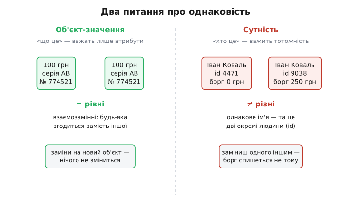
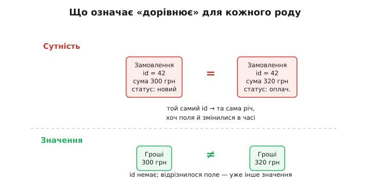

# Сутність і об'єкт-значення

<preknowlist>
- [Незмінність як прийом дизайну](topic:programming/immutability) — об'єкт, створений раз, більше не міняється; на цьому стоїть половина сенсу об'єкта-значення.
- [Інваріант програми](topic:programming/invariants) — правило, що має бути істинним завжди; сутність і об'єкт-значення розрізняються тим, хто ці правила стереже.
- [Типи як дизайн](topic:programming/type-driven-design) — коли форму даних добираєш так, щоб хибний стан узагалі не можна було записати; об'єкт-значення — найпростіший приклад цього.
</preknowlist>

Візьми дві стодоларові банкноти й поклади поруч. Тепер спитай себе чесно: чи є між ними якась різниця, що важить? Номери серій різні, але тобі байдуже — обидві це «сто доларів», і якщо я непомітно поміняю їх місцями, у світі не станеться нічого. Ти маєш рівно те саме, що мав.

А тепер уяви двох людей на ім'я Іван Коваль. Однакове ім'я, однаковий зріст, навіть однаковий рік народження. Помінялися вони місцями — і це вже катастрофа: один винен банку двісті гривень, а спишуть їх з другого. Тут різниця важить абсолютно, хоч на папері обидва «Івани Ковалі» на вигляд однакові.

Ось і вся ідея, навколо якої обертається ця стаття. **Деякі речі в програмі важать тим, ЩО вони таке; інші — тим, ХТО вони таке.** Банкнота важлива своїм значенням: сто доларів — це сто доларів, звідки б вони не взялися. Людина важлива своєю тотожністю: Іван — це Іван, навіть якщо схуд, змінив прізвище й переїхав. Першу річ називають **об'єктом-значенням**, другу — **сутністю**, і навчитися бачити, котре перед тобою, — один із найкорисніших навичок у моделюванні даних. Бо код, який плутає ці два роди, тихо гниє: то порівнює не те, то дозволяє змінити незмінне, то губить тотожність там, де вона єдине, що мало значення.

## Два питання, з яких усе випливає

Щоб зрозуміти, чому поділ такий фундаментальний, постав до будь-якого об'єкта два питання й подивися, яка відповідь для нього природна.

Перше питання: **«Коли дві такі речі вважати однаковими?»** Візьми дату 3 березня 2026 року. Якщо в одному місці програми ти створив цю дату, а в іншому — теж, це та сама дата чи дві різні? Очевидно, та сама: у дати немає «примірників», є лише значення. А тепер візьми замовлення в інтернет-крамниці. Двоє клієнтів замовили той самий товар, на ту саму суму, тієї самої хвилини — це одне замовлення чи два? Звісно, два: їх треба зібрати окремо, доставити окремо, і якщо одне скасують, друге лишається. Однаковий вміст тут не робить їх однаковими.

Друге питання: **«Що станеться, якщо ця річ зміниться в часі?»** Гроші не змінюються: сто гривень сьогодні — це ті самі сто гривень, що й учора, як число `100`. Якщо ти хочеш «змінити суму», ти насправді береш *інше* число. А от клієнт змінюється щодня: сьогодні його борг нуль, завтра двісті, післязавтра знову нуль. І це весь час **той самий клієнт** — ми стежимо за ним крізь усі ці зміни. У нього є те, що Ерік Еванс, який і закріпив цей поділ у дизайні, назвав «ниткою тяглості й тотожності» (англ. *a thread of continuity and identity*): щось незмінне, що тримає всі мінливі стани як стани *однієї* речі.

Складімо відповіді разом — і два роди проступлять самі:



*Об'єкт-значення визначається атрибутами: збіглися атрибути — це те саме, речі взаємозамінні. Сутність визначається тотожністю: однакові атрибути не роблять її тим самим, бо в неї є окреме «хто».*

**Об'єкт-значення (англ. *value object*, від лат. *valere* — мати вагу, вартість)** — це річ, яку повністю визначають її атрибути. Дві такі речі з однаковими атрибутами — це те саме; тотожності в них немає, тож питати «котра з двох» безглуздо. Гроші, дата, координата, колір, діапазон, адреса, номер телефону — усе це значення.

**Сутність (англ. *entity*, від лат. *ens* — суще, те, що є)** — це річ із власною тотожністю, окремою від атрибутів. Її атрибути можуть цілком збігтися з чужими або цілком змінитися з часом — вона лишається собою. Клієнт, замовлення, рахунок, автомобіль (за VIN), працівник — усе це сутності.

> 🔧 **Навіщо це.** Перше, що ти робиш, сідаючи моделювати будь-яку ділянку — від складу до бухгалтерії, — це саме цей сорт для кожного поняття. Помилка тут дорога й довга: якщо ти зробив адресу сутністю (дав їй `id`, поклав у таблицю з ключем), то дві однакові адреси в тебе тепер «різні», і код тоне в перевірках «а це справді та сама вулиця чи інша?». Якщо ж, навпаки, зробив клієнта значенням, то щойно він змінив прізвище — для системи це вже *інша людина*, і його історія розсипається. Правильний сорт з першого дня економить місяці розплутування.

## Тотожність: звідки вона береться і навіщо

У сутності мусить бути щось, що не залежить від атрибутів і тримає її «нитку». Це — **ідентифікатор (англ. *identifier*, від лат. *idem* — той самий)**: маленький окремий шматочок, єдине завдання якого — відповідати на питання «це та сама річ?». Він як інвентарний номер на музейному експонаті: сама картина може тьмяніти, реставруватися, змінювати раму — номер лишається, і саме за ним її впізнають.

Звідки береться цей ідентифікатор — питання не дрібне, бо від нього залежить, чи тотожність надійна.

**Іноді його дає сам предмет.** У автомобіля є VIN, у книги — ISBN, у людини (у деяких системах) — номер паспорта. Це **природний ключ**: він народжений поза твоєю програмою, і ти лише переймаєш його. Зручно, поки він справді унікальний і незмінний, — а це підводить частіше, ніж здається: паспорт міняють, ISBN колись перевидавали з тим самим номером, «унікальний» email клієнт віддає іншій людині.

**Найчастіше тотожність призначаєш ти сам.** Програма видає новий ідентифікатор під час народження сутності й більше його не чіпає. Тут два поширені шляхи, і вибір між ними — реальне рішення дизайну:

```
Автоінкремент (1, 2, 3, …)        UUID (550e8400-e29b-41d4-…)
─────────────────────────         ────────────────────────────
короткий, читабельний             довгий, нечитабельний
видає база при вставці            можна згенерувати будь-де,
                                   ще до запису в базу
підказує обсяг («вже 40000?»)     нічого не виказує назовні
унікальний в одній таблиці        унікальний глобально, між
                                  сервісами й базами
```

Різниця не косметична. Автоінкремент видає **база** в момент вставки — тож поки об'єкт не збережений, тотожності в нього ще немає, і зв'язати кілька нових об'єктів між собою до запису важко. UUID можна викарбувати **в коді**, ще до будь-якого дотику до бази, — новий об'єкт має тотожність від першої мілісекунди життя. Тому в системах, де об'єкти народжуються далеко від бази (кілька сервісів, офлайн-клієнт, черга подій), UUID часто єдиний робочий вибір: два вузли, що не бачать один одного, все одно не зіткнуться ідентифікаторами.

Головне про ідентифікатор — його **не порівнюють на «схожість» і майже ніколи не змінюють**. Він рівний самому собі й квит. Щойно ти ловиш себе на думці «а зробімо тотожність з імені та дати народження» — зупинись: це означає, що ти взяв атрибути (мінливі, повторювані) і намагаєшся зробити з них те, що має бути незмінним і унікальним. Двоє людей з однаковим ім'ям і датою народження існують; людина, що змінила ім'я, — та сама. Тотожність із атрибутів рано чи пізно збреше.

## Рівність — ось де поділ стає кодом

Найгостріше сорт проявляється в одній буденній операції: перевірці `a == b`. Питання «чи ці дві речі рівні?» має **дві геть різні відповіді** залежно від роду, і саме тут програмісти найчастіше отримують тихі баги.

Для **сутності** рівність — це рівність тотожності. Два об'єкти рівні тоді й лише тоді, коли в них однаковий ідентифікатор. Атрибути не дивляться взагалі: замовлення №42 сьогодні «на 300 грн, новий», а завтра «на 320 грн, оплачене» — це **той самий об'єкт** у двох станах, а не два різні.

Для **об'єкта-значення** рівність — це рівність усіх атрибутів. Ідентифікатора немає, тож порівнюють вміст: збіглося все поле в поле — рівні; відрізнилося хоч одне — це вже інше значення, і жодного «але це той самий об'єкт» тут немає.



*Сутність рівна за id: поля можуть змінюватися в часі, річ лишається собою. Об'єкт-значення рівний за всіма полями одразу: id у нього немає, різне поле означає інше значення.*

Подивимося, як це лягає в код. Ось об'єкт-значення «Гроші» — його рівність рахується за вмістом, а мова сама допомагає, щойно ми покажемо їй, які поля важать:

:::tabs
```ts
// Об'єкт-значення: рівність — за ВМІСТОМ, тотожності немає.
// Незмінний (readonly), нове значення — новий об'єкт.
class Money {
  constructor(
    readonly amount: number,   // у копійках, щоб не було дробів
    readonly currency: string,
  ) {}

  equals(other: Money): boolean {
    // жодного id — порівнюємо всі атрибути
    return this.amount === other.amount
        && this.currency === other.currency;
  }

  add(other: Money): Money {
    if (this.currency !== other.currency)
      throw new Error("не можна додавати різні валюти");
    return new Money(this.amount + other.amount, this.currency);  // НОВИЙ об'єкт
  }
}

const a = new Money(30000, "UAH");
const b = new Money(30000, "UAH");
a.equals(b);           // true — 300 грн це 300 грн, хоч це різні об'єкти в пам'яті
a === b;               // false — але це вже питання про пам'ять, а не про гроші
```
```python
from dataclasses import dataclass

# frozen=True робить об'єкт незмінним І дає рівність за полями «безкоштовно»:
# dataclass сам згенерує __eq__, що порівнює всі поля, і __hash__.
@dataclass(frozen=True)
class Money:
    amount: int          # у копійках
    currency: str

    def add(self, other: "Money") -> "Money":
        if self.currency != other.currency:
            raise ValueError("не можна додавати різні валюти")
        return Money(self.amount + other.amount, self.currency)  # НОВИЙ об'єкт

a = Money(30000, "UAH")
b = Money(30000, "UAH")
a == b            # True — рівність за вмістом, як і має бути для значення
a is b            # False — різні об'єкти в пам'яті, але нам байдуже
```
:::

Зверни увагу на дрібницю з великими наслідками: `Money` **незмінний**. Це не примха, а прямий висновок із того, що він значення. Число `300` не можна «зробити трохи більшим» — можна лише взяти інше число. Так само й гроші: `add` не чіпає старий об'єкт, а повертає новий. І це рятує від цілого класу бід — тих самих [аліасингових](topic:programming/immutability) помилок, коли на один об'єкт дивляться з двох місць і хтось потай його переписує. Якщо ти передав комусь `Money` і знаєш, що його не можна змінити, тобі байдуже, скільки посилань на нього гуляє системою: жодне не зіпсує іншим. Об'єкт-значення й незмінність — майже сіамські близнюки; змінний об'єкт-значення (наприклад, дата, якій можна пересунути день прямо в місці) — джерело найпідступніших багів, бо ти міняєш його «тут», а він мовчки міняється й «там».

А ось сутність — тут усе навпаки: рівність за `id`, а стан живе й змінюється:

:::tabs
```ts
// Сутність: рівність — за ТОТОЖНІСТЮ (id), стан вільно змінюється в часі.
class Order {
  private status: "новий" | "оплачений" | "скасований" = "новий";

  constructor(readonly id: string) {}    // id незмінний — це нитка тотожності

  pay(): void  { this.status = "оплачений"; }   // стан МІНЯЄТЬСЯ — і це нормально
  cancel(): void { this.status = "скасований"; }

  equals(other: Order): boolean {
    return this.id === other.id;         // тільки id, атрибути не дивимось
  }
}

const o1 = new Order("ord-42");
o1.pay();                                // стан змінився
const same = new Order("ord-42");        // той самий id — та сама сутність
o1.equals(same);                         // true — попри те, що стани різні
```
```python
class Order:
    def __init__(self, id: str):
        self.id = id                     # незмінна нитка тотожності
        self.status = "новий"            # стан — мінливий

    def pay(self):    self.status = "оплачений"     # МІНЯЄМО стан — це нормально
    def cancel(self): self.status = "скасований"

    def __eq__(self, other):
        return isinstance(other, Order) and self.id == other.id   # тільки id

    def __hash__(self):
        return hash(self.id)             # хеш теж від id, не від стану

o1 = Order("ord-42")
o1.pay()                                 # стан змінився
same = Order("ord-42")                   # той самий id
o1 == same                               # True — рівність за тотожністю
```
:::

Різниця в `equals`/`__eq__` — це не деталь реалізації, а **закодований сорт речі**. Коли колега за півроку прочитає ці два класи, він одразу побачить: `Order` порівнюється за `id` — отже, це те, що живе в часі й має тотожність; `Money` порівнюється за полями — отже, це чисте значення, і його можна вільно копіювати й викидати. Правильно написана рівність — це документ про природу об'єкта, який компілятор ще й перевіряє.

> 🔧 **Навіщо це.** Найпідступніший баг цієї теми — сутність із рівністю за вмістом. Уяви, що `Order` порівнюється за всіма полями. Кладеш два замовлення одного клієнта на однакову суму в множину — і вона вважає їх дублікатом, лишає одне. Або навпаки: змінив статус замовлення — і воно «перестало дорівнювати саме собі» вчорашньому, загубилося в кеші за старим ключем. Обидва баги виглядають як містика («куди зникло замовлення?»), а корінь один: рівність не за тотожністю там, де мала бути за нею. Тому в багатьох командах рівність сутності зводять до `id` раз і назавжди — у спільному базовому типі, щоб ніхто випадково не порівняв сутності за вмістом.

## Об'єкт-значення, що вміє за себе постояти

Може здатися, що об'єкт-значення — дрібничка: обгортка навколо числа чи рядка, навіщо взагалі клас? Тут криється друга, менш очевидна, але, може, важливіша користь. Об'єкт-значення — природне місце, щоб **раз і назавжди замкнути правило про своє власне значення**.

Розглянь email. У «наївному» коді це просто рядок `string`, і тоді питання «а це валідний email?» переслідує тебе **скрізь**: у формі реєстрації, у сервісі розсилки, у звіті, у міграції даних. Щоразу хтось має згадати перевірити — і рано чи пізно хтось забуде, і в базу заповзе `"привіт, світе"` як чиясь адреса. Правило розмазане по всій системі, а отже, його ніде немає по-справжньому.

Тепер зроби email об'єктом-значенням із **однією умовою**: він не може *існувати* невалідним.

:::tabs
```ts
class Email {
  private constructor(readonly value: string) {}   // конструктор закритий

  // єдиний вхід — через фабрику, що перевіряє
  static create(raw: string): Email {
    const normalized = raw.trim().toLowerCase();
    if (!/^[^@\s]+@[^@\s]+\.[^@\s]+$/.test(normalized))
      throw new Error(`не email: ${raw}`);
    return new Email(normalized);
  }

  equals(other: Email): boolean { return this.value === other.value; }
}

// Далі по всій системі тип Email — це ГАРАНТІЯ, а не надія:
function sendWelcome(to: Email) {
  // тут НЕ треба перевіряти — якщо в руках Email, він уже валідний і нормалізований
}

Email.create("  Ivan@Example.COM ");   // ок → зберігає "ivan@example.com"
Email.create("привіт");                 // кине помилку тут-таки, а не колись потім
```
```python
import re
from dataclasses import dataclass

_RE = re.compile(r"^[^@\s]+@[^@\s]+\.[^@\s]+$")

@dataclass(frozen=True)
class Email:
    value: str

    def __post_init__(self):
        # dataclass кличе це одразу після створення — місце для перевірки інваріанта
        norm = self.value.strip().lower()
        if not _RE.match(norm):
            raise ValueError(f"не email: {self.value}")
        object.__setattr__(self, "value", norm)   # frozen — тож так записуємо нормалізоване

def send_welcome(to: Email) -> None:
    ...   # тут перевіряти НЕ треба: тип Email == уже валідний і нормалізований

Email("  Ivan@Example.COM ")   # ок → зберігає "ivan@example.com"
Email("привіт")                # ValueError одразу, а не колись у глибині системи
```
:::

Дивись, що сталося. Правило «валідний email» перестало бути чиєюсь відповідальністю, яку можна забути, і стало **властивістю самого типу**. Невалідний `Email` тепер неможливо навіть створити — а отже, будь-де в програмі, де в тебе на руках `Email`, ти маєш **гарантію**, а не надію. Це і є [дизайн через типи](topic:programming/type-driven-design): ти зробив так, що хибний стан просто не можна записати, і компілятор або конструктор ловить помилку в момент народження даних, а не за три екрани нижче, де вже незрозуміло, звідки взялося сміття.

Ця «самозахисність» — привілей саме об'єкта-значення, і ось чому. Значення незмінне: перевірив його один раз при народженні — і воно **лишиться** валідним назавжди, бо змінити його ніхто не може. Сутність так не вміє: вона живе, її стан крутиться, і одна перевірка при народженні нічого не гарантує через годину. Тому об'єкти-значення часто стають **цеглинами**, з яких складають сутність: `Order` тримає всередині `Money`, `Email`, `Address` — і кожна цеглинка вже сама відповідає за свою правильність. Сутності лишається стерегти правила, які стосуються *зв'язку* між цеглинками (наприклад, «сума замовлення = сумі рядків»), — а це вже робота [агрегата](topic:programming/aggregates-consistency), який тримає цілу купу пов'язаних об'єктів у злагоді. Історію того, як цей поділ на два роди виріс із патерна Фаулера в повноцінну класифікацію Еванса, варто прочитати окремо — вона добре показує, *чому* про це взагалі почали думати. [(про народження поділу)](topic:programming/entity-value-object/hist-value-object-lineage.md)

## Той самий предмет — різний сорт у різних місцях

Тут чекає пастка, на якій спотикаються навіть досвідчені: сорт речі — **не її вроджена властивість, а рішення в контексті**. Одне й те саме поняття в одній системі — сутність, а в іншій — значення. І це не помилка когось із них; це різні задачі.

Візьми адресу. У застосунку доставки їжі адреса — майже завжди **значення**: тобі важить лише *куди* нести, «Хрещатик 1» це «Хрещатик 1», два однакові рядки — та сама точка, тотожність не потрібна. А тепер поштова служба, що прокладає маршрути й ставить на будинки трекери: там адреса стає **сутністю** зі своїм `id`, історією («тут раніше був інший індекс»), станом («доставка сюди тимчасово зупинена»). Той самий «Хрещатик 1» тепер конкретний об'єкт, за яким стежать у часі.

Що змінилося? Не адреса — **питання до неї**. Щойно з'являється потреба стежити за річчю крізь зміни, вести її історію, відрізняти цей конкретний примірник від такого самого — річ стала сутністю. Поки ж усе, що треба, — це «яке значення», і два однакові значення взаємозамінні, — це об'єкт-значення. Тому правильне питання, сідаючи моделювати, — не «що це за річ узагалі?», а «що ця система хоче з нею робити?». Купюра для касира — значення; та сама купюра для криміналіста, що відстежує конкретну банкноту за номером, — сутність. Сорт живе в задачі, не в предметі.

> 🔧 **Навіщо це.** Через це не буває «правильної відповіді раз і назавжди» — і це звільняє. Не треба сперечатися абстрактно, «адреса — сутність чи ні»; треба спитати про *цю* систему: чи стежимо ми за конкретною адресою крізь час? Ні — значення, і ти економиш собі таблицю, ключі та купу перевірок тотожності. Так — сутність, і ти свідомо береш на себе тягар тотожності, бо він тут окупається. Рішення в контексті — це менше догми й більше інженерії.

## Як не переплутати: коротка перевірка

Коли перед тобою нове поняття й ти вагаєшся, постав йому три питання поспіль — і сорт випаде майже завжди:

- **Чи маю я стежити за цією річчю крізь зміни?** Так (клієнт, замовлення, рахунок міняються, а я веду їх далі) → сутність. Ні (сума, дата, колір просто *є*) → значення.
- **Чи дві такі речі з однаковим вмістом — це те саме?** Так (дві «300 грн» взаємозамінні) → значення. Ні (два замовлення на 300 грн — окремі) → сутність.
- **Чи потрібен цій речі окремий ідентифікатор, щоб її впізнавати?** Так → сутність. Ні, її повністю впізнають за вмістом → значення.

Три питання дивляться на одне й те саме з різних боків, тож зазвичай дають узгоджену відповідь; якщо ж вони розходяться — це сигнал, що поняття всередині склеїло дві речі, і його треба розділити. Класичний приклад: «клієнт» у тебе водночас і жива людина, за якою стежиш (сутність), і «контактні дані на момент замовлення» (значення — знімок, що не мусить мінятися заднім числом, коли людина переїде). Розчепивши їх, ти прибираєш ту саму пастку, через яку стара доставка раптом «переїжджає» разом із клієнтом.

І остання, найпрактичніша порада: **сумніваєшся — почни зі значення**. Значення дешевше (немає таблиці, ключа, тягаря тотожності), простіше (незмінне, рівність за вмістом сама собою) і безпечніше (само стереже свою правильність). Підвищити значення до сутності потім, коли з'явиться реальна потреба стежити за ним, — невелика робота. А ось зайва тотожність, роздана всьому підряд, розповзається системою й потім дорого вичищається. Значення — стан за замовчуванням; сутність — усвідомлений крок, коли річ справді має жити в часі.
