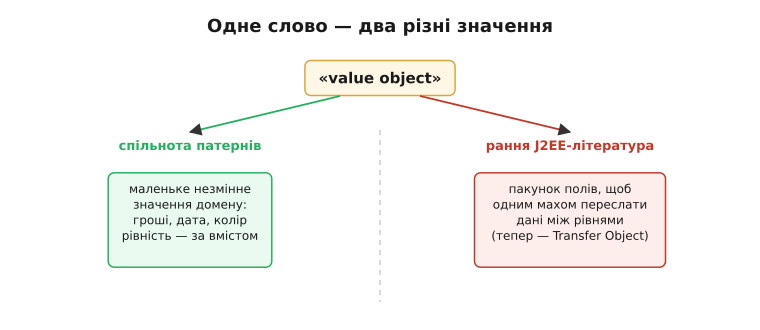
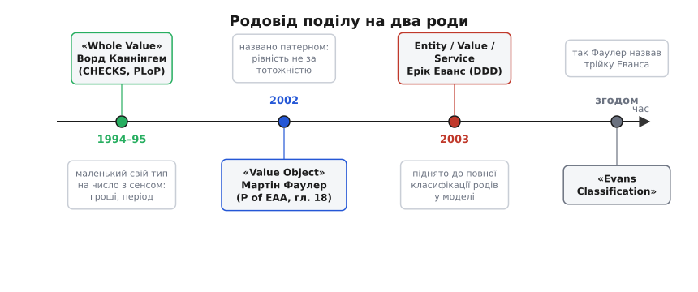

# 📜 Як народився поділ на два роди

Поділ речей на ті, що важать своїм **значенням**, і ті, що важать своєю **тотожністю**, здається сьогодні таким очевидним, що важко повірити: якихось двадцять п'ять років тому назви для нього ще не було. Програмісти, звісно, і раніше відчували різницю — ніхто ж не плутав суму на рахунку з самим рахунком. Але відчувати різницю й **мати слово**, щоб її назвати, вказати на неї колезі, вписати в чек-лист дизайну, — це дві дуже різні речі. Поки поняття без імені, воно ніби й не існує: про нього не можна коротко сказати, його не помічаєш там, де воно ховається, і кожен винаходить свій напівусвідомлений спосіб з ним поводитися.

Історія цього поділу цікава саме тим, що це історія **називання** — як розмита інтуїція «ну, деякі штуки просто інші» поступово загострилася до пари точних понять із чіткими правилами. І, як часто буває з називанням, найгостріше воно знадобилося тоді, коли одне й те саме слово почали тягти в різні боки й народилася плутанина, з якої треба було якось вибиратися.

## Слово «value object» тягнуть у два боки

Наприкінці 1990-х у світі корпоративного софту слово «value object» уже вживали — але означало воно геть не те, що означає тепер, а часом і дві протилежні речі водночас. Це і є та точка, з якої варто починати: не з чистого аркуша, а з **плутанини**, бо саме вона зробила потребу в ясному понятті відчутною.

З одного боку, у спільноті, що займалася **патернами проєктування** (це той рух, що виріс із «банди чотирьох» — книги *Design Patterns* 1994 року й щорічних конференцій PLoP, Pattern Languages of Programming), «value object» уже потроху означало приблизно те, що й сьогодні: маленький об'єкт, який важить своїм вмістом, а не тим, котрий він з-поміж однакових.

З іншого боку — і саме це збивало з пантелику — у ранній літературі про **J2EE** (це платформа Java для серверних застосунків, що гриміла на зламі століть) те саме слово «value object» присвоїли зовсім іншому патернові. Там воно означало **пакунок полів, який збирають докупи, щоб одним махом переслати дані з одного шару системи в інший** — скажімо, з бази ближче до екрана, не смикаючи мережу по разу на кожне поле. Це навіть не про значення в нашому сенсі; це про транспорт даних.



*Одне слово тягли в два різні боки: у спільноті патернів «value object» означало маленьке незмінне значення домену, а в ранній J2EE-літературі — пакунок полів для пересилання між рівнями системи. Зіткнення цих двох ужитків згодом і змусило перейменувати другий на Transfer Object.*

Це зіткнення не пройшло тихо. Автори впливової збірки *Core J2EE Patterns* (Дінна Алур, Джон Крупі, Ден Малкс), що вийшла з-під крила Sun Microsystems, у першому виданні назвали свій «пакунок для передачі» саме **Value Object** — і наштовхнулися на те, що спільнота патернів уже застовпила це слово за іншим поняттям. У наступному виданні вони патерн **перейменували на Transfer Object** — а ще ширше він відомий як **Data Transfer Object (DTO)**. Слово звільнили, конфлікт зняли, але сам факт, що двом різним речам два різні табори дали одну назву, показав головне: інтуїція «є якісь особливі маленькі об'єкти» витала в повітрі, а спільної, точної, узгодженої мови для неї ще бракувало.

> 🔧 **Навіщо це.** Ця стара плутанина — не мертвий музейний експонат. Слово «value object» і досі зрідка спливає в старому Java-коді чи в чиїйсь голові саме в J2EE-значенні (пакунок для передачі), а не в тому, про яке ця книга. Тому в командах, де перетинаються люди з різним стажем, іноді доводиться питати вголос: «ти зараз про value object як незмінне значення домену чи про DTO?» — бо це буквально два різні патерни з двома різними цілями, які колись ділили одну назву. Знати цю розвилку — значить не сплутати їх на рівному місці.

## Глибший корінь: «ціле значення» Ворда Каннінгема

Перш ніж хтось назвав це «value object» у теперішньому сенсі, ідею вже висловили — тільки під іншим ім'ям і з іншим наголосом. Її автор — **Ворд Каннінгем (Ward Cunningham)**, американський програміст, той самий, що згодом винайшов вікі. У пакунку патернів під назвою *CHECKS Pattern Language of Information Integrity* — набір з десяти патернів про те, як відрізняти добрі дані від зіпсутих, — першим стоїть патерн **Whole Value**, «ціле значення». Датується цей текст **1994 роком**; невдовзі його опублікували у збірці праць першої конференції з патернів (*Pattern Languages of Program Design*, 1995).

> **Що за конференція PLoP.** У 1994-му спільнота розробників уперше зібралася окремо на тему патернів проєктування — обговорювати не готові рецепти, а мову, якою про них говорити. Праці цих зустрічей виходили книжками-збірками; саме там уперше надрукували чимало ідей, що потім розійшлися галуззю. *Whole Value* — одна з таких ранніх ідей.

Суть патерна Каннінгем сформулював так (переклад збережено близько до оригіналу):

```
Whole Value:
   Створюй спеціалізовані значення, щоб кількісно
   виражати свою модель предметної області, і вживай
   ці значення як аргументи повідомлень та як одиниці
   входу й виходу.
```

Що це означає по-людськи. Не передавай суму грошей голим числом `double`, а дату — трійкою цілих. Зроби для «суми грошей» **окремий свій тип**, для «періоду» — свій, для «номера телефону» — свій; і хай кожен такий тип несе **цілий, осмислений шматок** інформації туди, де він потрібен. Приклади, які наводить сам Каннінгем, промовисті: **валюта, календарний період, номер телефону** — рівно ті поняття, що згодом стануть хрестоматійними об'єктами-значення. Наголос у нього був не на рівності й не на незмінності (це доклали пізніше), а на **цілісності**: маленький тип має нести повне, самодостатнє значення, а не голе число без сенсу, яке легко сплутати з іншим таким самим голим числом.

Тут варто чесно розрізнити, **що саме** зробив Каннінгем, а що — ні, бо історію легко перекрутити в «він усе винайшов». *Whole Value* — це ще не поділ на два роди. У ньому немає протиставлення сутності; немає слова «entity»; немає правила про рівність за вмістом чи за тотожністю. Є одна половина майбутньої картини — ідея, що для важливих значень домену варто заводити власні маленькі типи, а не тягати примітиви. Це фундамент, на якому потім звели решту. Настанова «маленький тип із власним сенсом замість голого числа» — прямий предок того, що ми тепер звемо об'єктом-значенням; але **назви** й **повного поділу** доклали інші люди й пізніше.

## Мартін Фаулер робить «Value Object» названим патерном

Наступний крок — і перше чітке ім'я в теперішньому сенсі — зробив **Мартін Фаулер (Martin Fowler)**, британсько-американський інженер і автор, у книжці *Patterns of Enterprise Application Architecture* (скорочено *P of EAA*). Книга вийшла **наприкінці 2002 року** у видавництві Addison-Wesley (передмова датована ще травнем 2002-го; на титулі стоїть копірайт 2003-го — звична для книжок розбіжність між друком і формальним роком). Патерн **Value Object** займає в ній розділ 18.

Фаулерове означення — коротке до афористичності, і саме така стислість зробила його таким чіпким:

```
Value Object — це маленький простий об'єкт,
на кшталт грошей чи діапазону дат, рівність
якого не спирається на тотожність.
```

(В оригіналі: *«a small simple object, like money or a date range, whose equality isn't based on identity»*.)

Придивися, що тут з'явилося понад те, що дав Каннінгем. По-перше, **назва в теперішньому сенсі** — «Value Object», закріплена як патерн у широковживаній книжці. По-друге, і це головне, — **критерій рівності** як осердя поняття. Каннінгем казав «зроби маленький осмислений тип»; Фаулер додав ключове: **рівність такого об'єкта — не за тотожністю, а за вмістом**. Дві однакові суми грошей рівні, бо це однакові суми, а не тому, що це «той самий» об'єкт у пам'яті. І з цього критерію природно випливає друга риса, яку Фаулер підкреслив окремо, — **незмінність**: об'єкт-значення слід робити незмінним, щоб уникнути [аліасингових](topic:programming/immutability) багів, коли на одну спільну штуку дивляться з двох місць і хтось потай її переписує, ламаючи іншим. Приклад, на якому Фаулер це показував, — координата (пара `x`, `y`) і той-таки діапазон дат.

Цікаво, що Фаулер **не** будував у *P of EAA* повну класифікацію родів. Value Object там — окремий патерн серед багатьох інших патернів корпоративної архітектури, поряд із зовсім не спорідненими речами на кшталт мапінгу на базу даних чи організації бізнес-логіки. Половину картини — «що таке значення й чому воно рівне за вмістом» — Фаулер виклав ясно й дав їй тверде ім'я. Але поставити цю половину **навпроти другої**, звести обидва роди в одну струнку систему з чіткими межами — це вже зробить наступного року інша людина.

## Ерік Еванс піднімає це до класифікації

Рік по тому, у **серпні 2003-го**, вийшла книжка, яка й закріпила поділ у тому вигляді, в якому ним користуються дотепер: **Ерік Еванс (Eric Evans)**, *Domain-Driven Design: Tackling Complexity in the Heart of Software* (те саме видавництво Addison-Wesley). Якщо Фаулер дав одну половину ясну назву, то Еванс зробив дещо більше: він поставив поруч **три роди об'єктів** — **Entity, Value Object, Service** — і показав, що це не випадковий список, а спосіб дивитися на всю модель предметної області. Саме цю трійку згодом і назвуть **класифікацією Еванса (Evans Classification)** — назву, до речі, пустив у вжиток той-таки Фаулер, уже посилаючись на Еванса.

Сила Еванса — у формулюваннях, які влучили точно в серце обох понять. Сутність він означив так:

```
Багато об'єктів визначаються не своїми атрибутами,
а ниткою тяглості й тотожності.
```

(В оригіналі: *«Many objects are not fundamentally defined by their attributes, but rather by a thread of continuity and identity»*.)

Ось воно — те, чого бракувало Фаулеровому боку картини. «Нитка тяглості й тотожності» (*a thread of continuity and identity*) — це образ, що вмить пояснює, **чому** сутність лишається собою крізь зміни: є щось незмінне, що протягнуте крізь усі її мінливі стани й тримає їх як стани **однієї** речі, а не низки різних. Клієнт міняє прізвище, адресу, борг — а нитка та сама, і за нею ми впізнаємо, що це досі він.

А об'єкт-значення Еванс окреслив дзеркально, і так само влучно:

```
Об'єкти-значення створюють, щоб подати ті елементи
задачі, які нас обходять лише тим, ЩО вони таке,
а не хто вони чи котрі з-поміж однакових.
```

(В оригіналі: *«VALUE OBJECTS are instantiated to represent elements of the design that we care about only for what they are, not who or which they are»*.)

Ця пара — «нитка тяглості й тотожності» проти «важить лише те, що воно, а не хто чи котре» — і є та вісь, навколо якої досі обертається весь поділ. Одним реченням на кожен рід Еванс сказав те, що доти доводилося пояснювати абзацами й прикладами.



*Родовід поділу: спершу Каннінгем дав ідею окремого «цілого значення», далі Фаулер закріпив «Value Object» як патерн із рівністю за вмістом, а Еванс підняв це до повної класифікації родів у моделі; трійку Entity/Value/Service згодом і назвали «класифікацією Еванса».*

## Що саме бентежило — і чому поділ виявився таким корисним

Тепер варто спитати найголовніше: а **що**, власне, було не так доти, що знадобилося аж окреме поняття? Адже код писали й до 2003-го, і суми з рахунками якось не плутали.

Бентежило ось що. Різницю між «важить значення» і «важить тотожність» кожен програміст ніс у голові **напівусвідомлено** — і через це раз у раз ухвалював те саме рішення наосліп, щоразу заново, без спільного орієнтира. Питання «а чи потрібен цій штуці власний `id`?», «а як порівнювати дві такі речі?», «а можна її міняти на місці чи ні?» поставали в коді **порізно**, у різних місцях, і на кожне відповідали окремо й часто **неузгоджено**. Той самий об'єкт в одному кутку системи порівнювали за вмістом, а в іншому — за посиланням; десь адресі давали `id`, а десь ту саму адресу тягали голим рядком. Наслідок — тихі, підступні баги, у яких **корінь один**, а на вигляд усі різні: то дублікат у множині, бо сутність зрівняли за вмістом; то «зникле» замовлення, бо змінили поле, за яким його клали в кеш; то незмінне, що хтось таки змінив крізь спільне посилання.

Поділ на два роди виявився таким корисним саме тому, що він **зшив усі ці розрізнені питання в одне**. Замість того, щоб про кожну властивість думати окремо, ти ставиш поняттю **одне** питання — «це в мене сутність чи об'єкт-значення?» — і **всі** дрібніші відповіді випадають одразу й узгоджено:

```
Визначив рід — і решта стає на місця сама:

                     сутність              об'єкт-значення
рівність          за тотожністю (id)      за всім вмістом
змінність         живе, стан крутиться     незмінний
власний id        потрібен                 не потрібен
дублікати         різні, хоч і однакові    однакові = одне
```

Оце «одне рішення замість розсипу дрібних» і є справжня цінність називання. Поки поняття не було, кожен програміст щоразу винаходив свій напівсвідомий спосіб — і половину часу помилявся, бо тримати всю цю таблицю в голові без імені, яке її згортає, важко. Щойно з'явилися два слова з чіткими межами, стало можна коротко сказати колезі «клієнт — сутність, гроші — значення» й **бути певним**, що ви обидва маєте на увазі те саме: однакові правила рівності, змінності, тотожності. Поняття перестало бути мовчазною інтуїцією кожного окремо й стало **спільною мовою команди** — а спільна мова і є те, заради чого патерни взагалі придумують.

Є в цій історії ще одна тонкість, яку варто помітити. Сам Фаулер згодом чесно застеріг: ці три роди — з тих, що «впізнаєш, коли бачиш» (*I know it when I see it*), і **точну межу** між ними іноді провести важко, а слова легко «замулюються» сусідніми ідеями, коли їх тягнуть у чужі контексти (як воно й сталося з тим J2EE-«value object»). Тобто поділ — не залізний закон природи з чіткою формулою на всі випадки, а **гострий і напрочуд корисний інструмент мислення**, який працює саме тому, що дає раду з двадцятьма дрібними рішеннями за одне. І цінність його не в тому, що він раз і назавжди відповідає, «адреса — сутність чи ні» (як ми бачили, це залежить від задачі), а в тому, що він дає **правильне питання** й гарантує: щойно ти на нього відповів, купа інших питань відповідає себе сама.

Отака дуга: розмита інтуїція «є якісь особливі маленькі значення» → окремий тип у Каннінгема → назва й критерій рівності у Фаулера → повна класифікація з двома дзеркальними формулюваннями в Еванса. Кожен доклав свій шматок, ніхто не зробив усе сам — і в підсумку галузь отримала два слова, які тепер здаються такими самоочевидними, що вже й не віриться, як без них узагалі писали код.

---

**Статус доказовості.** Усе викладене — **усталений факт**, підтверджений опублікованими першоджерелами: *Whole Value* — патерн Ворда Каннінгема з *CHECKS Pattern Language* (текст 1994 р., опублікований у збірці *Pattern Languages of Program Design*, 1995); *Value Object* як названий патерн — розділ 18 книжки Мартіна Фаулера *Patterns of Enterprise Application Architecture* (Addison-Wesley, друк кінця 2002 р., копірайт 2003); класифікація Entity / Value Object / Service та наведені означення — книжка Еріка Еванса *Domain-Driven Design* (Addison-Wesley, серпень 2003 р.); термін «Evans Classification» ужив і поширив Мартін Фаулер. Наведені цитати перекладено з англійських оригіналів, які збережено в дужках поряд.
