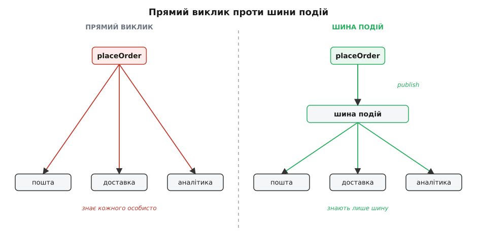
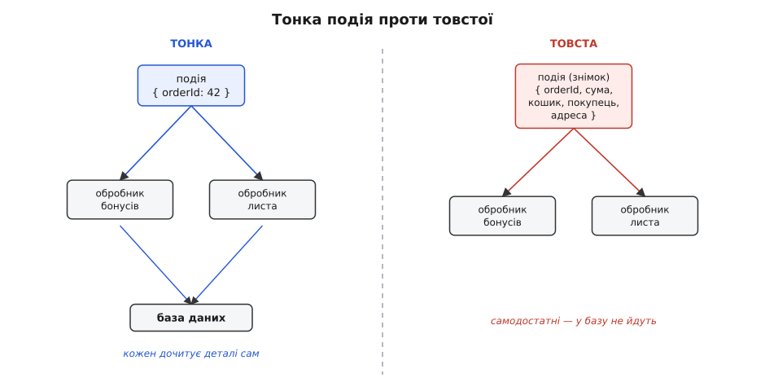

# Подієва архітектура всередині застосунку

<preknowlist>
- [Зчеплення і зв'язність](book:programming/coupling-cohesion) — чому пряме знання одного модуля про інший коштує грошей на супроводі; подієвий стиль — це передусім спосіб зменшити зчеплення.
- [Принцип інверсії залежностей](book:programming/dependency-inversion) — стрілка залежності має вказувати на абстракцію, а не на конкретику; шина подій — крайня форма цієї інверсії.
- [Спостерігач](book:programming/observer) — базовий механізм «суб'єкт сповіщає підписників про зміну стану»; подієва архітектура виростає прямо з цієї ідеї, розгорнутої на весь застосунок.
- [Чисті функції і побічні ефекти](book:programming/pure-functions-side-effects) — що таке побічний ефект і чому реакцію на подію корисно тримати окремо від обчислення; без цього не видно, де закінчується «факт» і починається «наслідок».
</preknowlist>

Уяви типовий код оформлення замовлення. Функція `placeOrder` списала товар зі складу, зберегла замовлення в базу — і тут починається наростання. Треба ще надіслати листа покупцеві. Нарахувати бонусні бали. Повідомити службу доставки. Оновити лічильник продажів для аналітики. Кожна нова вимога бізнесу дописує в `placeOrder` ще один рядок, ще один виклик чужого модуля, ще одну причину, чому ця функція може зламатися. За рік вона розростається до трьохсот рядків і знає геть про все на світі — про пошту, про доставку, про аналітику, про бонуси. Змінили шаблон листа — лізеш у код замовлення. Ця функція перетворилася на **вузол**, крізь який проходить пів системи, і будь-яка правда збоку тягне правку тут.

Причина болю не в кількості роботи — роботу все одно треба зробити. Причина в тому, що `placeOrder` **сама вирішує, кого покликати**. Вона тримає в собі список усіх зацікавлених і мусить його знати. А зацікавлених стає більше з кожним місяцем. Виходить, модуль, чия єдина справа — оформити замовлення, відповідає ще й за те, щоб не забути нікого сповістити. Це два різні обов'язки, зшиті в одному місці, і саме шов між ними тріщить.

Подієва архітектура (англ. *event-driven* — «керована подіями») перевертає це відношення. Замість того, щоб `placeOrder` знала своїх слухачів і кликала кожного поіменно, вона робить одну-єдину річ понад свою роботу: **оголошує факт**. «Замовлення оформлено» — і все. Хто на цей факт реагує, скільки їх, що саме вони роблять — `placeOrder` не знає й знати не хоче. Реакції живуть окремо, кожна у своєму модулі, і самі підписуються на факт, який їх цікавить.

Ідея ця не нова й не абстрактна: вона виросла з дуже практичного джерела — [історії подієвого стилю](book:programming/event-driven-architecture/hist-event-driven-lineage.md), від циклів подій перших графічних інтерфейсів і патерна «спостерігач» до самого терміна, який 2003-го запустив у обіг аналітик Gartner Рой Шульте (той самий, що сімома роками раніше ввів «сервісно-орієнтовану архітектуру»).

> 🔧 **Навіщо це.** Це прямий обмін однієї валюти на іншу: ти жертвуєш очевидністю потоку заради дешевизни зміни. У прямому виклику видно все — відкрив `placeOrder` і бачиш весь ланцюг наслідків. У подієвому — не видно з місця оголошення, хто зреагує, зате **нова реакція додається, не торкаючись коду, що подію породив**. Коли система молода й потік простий — очевидність цінніша. Коли реакцій багато й вони множаться від різних команд і причин — цінніша розв'язка. Уся стаття про те, як зважити цей обмін і не заплатити зайвого.

## Три ролі: хто оголошує, що оголошено, хто слухає

Щоб механізм працював, розкладімо його на три частини, бо кожна несе свою відповідальність і плутати їх — типова помилка початківця.

**Подія (event)** — це запис про те, **що вже сталося**. Ключове слово — минулий час. Не «оформи замовлення» (це наказ, команда), а «замовлення оформлено» (це факт). Різниця не косметична. Наказ адресований конкретному виконавцеві й очікує, що той його виконає; якщо виконавця нема — наказ провалився. Факт нікому не адресований і нічого не очікує: він просто істинний. `OrderPlaced` лишається правдою, навіть якщо на неї ніхто не підписаний. Саме тому подію іменують дієсловом доконаного виду в минулому: `OrderPlaced`, `PaymentReceived`, `UserRegistered`. Тест простий: якщо назву можна прочитати як розпорядження — це ще не подія, це замаскована команда.

**Видавець (publisher)**, або джерело події, — той, хто цей факт оголошує. У прикладі це `placeOrder`. Його робота після переходу на події **зменшується**: зробити своє й опублікувати, що зробив. Він не тримає списку слухачів і не залежить від жодного з них.

**Підписник (subscriber)**, або обробник (handler), — той, хто на факт реагує. Надіслати листа. Нарахувати бали. Кожен підписник — окремий модуль з однією ясною справою, і він **сам** заявляє шині: «мене цікавить `OrderPlaced`».

Між ними стоїть **шина подій (event bus)** — посередник, який приймає оголошення від видавця й розносить його всім, хто підписався. Видавець кидає подію в шину; шина знає підписників; підписники отримують. Ні видавець не знає підписників, ні підписники — видавця. Вони знайомі лише з шиною та з формою події. Це і є та інверсія залежностей у чистому вигляді: обидві сторони залежать від спільної абстракції (типу події), а не одна від одної.



*Зліва видавець знає кожного слухача особисто — додати нового означає торкнутися його коду. Справа він знає лише шину; нові слухачі підключаються збоку, джерело події не змінюється.*

## Найпростіша шина, яку можна написати

Абстракція звучить туманно, поки не побачиш код. А тут і бачити нема чого складного — шина подій у своєму ядрі це словник, що відображає ім'я події на список функцій-обробників. Ось повна робоча реалізація; це загальний прикладний код, тож покажу двома мовами, якими такі речі й пишуть на практиці.

:::tabs
```ts
type Handler = (event: unknown) => void;

class EventBus {
  private handlers = new Map<string, Handler[]>();

  // підписник заявляє інтерес до типу події
  subscribe(eventType: string, handler: Handler): void {
    const list = this.handlers.get(eventType) ?? [];
    list.push(handler);
    this.handlers.set(eventType, list);
  }

  // видавець оголошує факт; шина розносить його всім підписаним
  publish(eventType: string, event: unknown): void {
    for (const handler of this.handlers.get(eventType) ?? []) {
      handler(event);
    }
  }
}
```
```python
from collections import defaultdict
from typing import Callable

class EventBus:
    def __init__(self) -> None:
        self._handlers: dict[str, list[Callable]] = defaultdict(list)

    # підписник заявляє інтерес до типу події
    def subscribe(self, event_type: str, handler: Callable) -> None:
        self._handlers[event_type].append(handler)

    # видавець оголошує факт; шина розносить його всім підписаним
    def publish(self, event_type: str, event: object) -> None:
        for handler in self._handlers[event_type]:
            handler(event)
```
:::

Двадцять рядків — і вся суть уже тут. Тепер `placeOrder` не кличе пошту й доставку; вона кличе `bus.publish`. А кожна реакція живе окремо:

:::tabs
```ts
// збірка застосунку: підписки в одному місці
bus.subscribe("OrderPlaced", (e) => sendConfirmationEmail(e));
bus.subscribe("OrderPlaced", (e) => awardLoyaltyPoints(e));
bus.subscribe("OrderPlaced", (e) => notifyShipping(e));

// сам видавець нічого про них не знає
function placeOrder(cart: Cart): void {
  const order = saveOrder(cart);
  reserveStock(order);
  bus.publish("OrderPlaced", { orderId: order.id, userId: cart.userId });
}
```
```python
# збірка застосунку: підписки в одному місці
bus.subscribe("OrderPlaced", lambda e: send_confirmation_email(e))
bus.subscribe("OrderPlaced", lambda e: award_loyalty_points(e))
bus.subscribe("OrderPlaced", lambda e: notify_shipping(e))

# сам видавець нічого про них не знає
def place_order(cart: Cart) -> None:
    order = save_order(cart)
    reserve_stock(order)
    bus.publish("OrderPlaced", {"order_id": order.id, "user_id": cart.user_id})
```
:::

Придивись, що сталося з формою залежностей. Раніше стрілки йшли **з** `placeOrder` **до** пошти, доставки, аналітики — модуль замовлення залежав від усіх них. Тепер стрілки йдуть **до шини** з обох боків: `placeOrder` залежить від шини, обробники залежать від шини, а один від одного — ніхто. Додати шосте, десяте, соте сповіщення — це дописати рядок `subscribe` у збірці застосунку. Код `placeOrder` при цьому не розгортаєш і навіть не відкриваєш. Ось за що платить обмін: **точку, де народжується факт, ти замикаєш раз і більше не чіпаєш**, скільки б наслідків не наростало.

> 🔧 **Навіщо це.** Найдорожчий код — той, що доводиться змінювати найчастіше, бо кожна зміна ризикує щось зламати. `placeOrder` — саме такий гарячий вузол: бізнес постійно вигадує нові наслідки замовлення. Замкнувши його на публікацію одного факту, ти виводиш його з-під вогню: гаряче тепер лише в обробниках, а кожен з них дрібний, окремий і ламається сам по собі, не тягнучи за собою решту. Ти локалізував зону змін.

## Що це насправді розв'язує, а що ні

Легко захопитися й розкидати події всюди. Тому варто чітко назвати, яку саме проблему подієвий стиль лікує, — бо поза нею він лише додає туману.

Він лікує **зчеплення напрямку «один-до-багатьох, що росте»**. Симптом упізнаваний: одна дія тягне список наслідків, і список цей **подовжується від вимог різних людей**. Замовлення оформлене — і бухгалтерія хоче проведення, маркетинг хоче подію в аналітику, підтримка хоче лист, склад хоче резервування. Усі ці бажання б'ють в одну функцію й змушують її знати про чужі царини. Подія розриває цей зв'язок: функція оголошує факт, а кожна царина сама вирішує, чи їй цікаво.

Він **не лікує** простий лінійний потік, де крок B справді має статися одразу після A, ти це бачиш і воно не множиться. Якщо після збереження треба індексувати запис для пошуку — і більше нічого, ніколи — прямий виклик `search.index(record)` чесніший за подію. Він видимий, його легко налагодити, стек викликів веде прямо до причини. Загорнути його в подію означає заплатити невидимістю потоку, нічого не купивши: розв'язувати нічого, зв'язок один і стабільний.

Ось де межа стає найгострішою. Подія — це **втрата видимого потоку в обмін на розв'язку**. Коли реакцій багато й вони мінливі — розв'язка того варта. Коли реакція одна й стала — ти просто сховав прямий виклик за посередником і тепер, щоб зрозуміти, «а що ж буде після цього рядка», мусиш шукати підписників по всьому проєкту. Це реальна ціна, і платити її треба свідомо.

> 🔧 **Навіщо це.** Правило-орієнтир на щодень: питай не «чи можна зробити це подією», а «**чи росте цей список наслідків від різних причин**». Росте — подія окупиться. Не росте, наслідок один і стабільний — лиши прямий виклик, він чесніший. Подієва архітектура — інструмент проти розростання зв'язків, а не універсальний спосіб «зробити красиво».

## Синхронно чи асинхронно — і чому це різні світи

Наша шина викликає обробники **зараз же, у тому самому потоці**: `publish` не повертається, доки всі підписники не відпрацювали. Це синхронна шина. Вона проста, її легко зрозуміти й налагодити — але має пастку, на якій горять постійно.

Розглянь `placeOrder` знову. Вона викликала `bus.publish("OrderPlaced", ...)`, шина синхронно пішла по обробниках, і третій із них — `notifyShipping` — поліз у зовнішній сервіс доставки, а той не відповідає п'ять секунд. Уся `placeOrder` висить ці п'ять секунд. Гірше: якщо `notifyShipping` кине виняток — а зовнішні виклики кидають винятки — і його ніхто не піймав, він проб'ється крізь `publish` назад у `placeOrder` і **зірве оформлення замовлення**. Тобто збій у другорядному сповіщенні доставки скасував головну дію. Так бути не повинно: факт «замовлення оформлено» вже істинний, замовлення в базі, а ми через дрібницю робимо вигляд, що його нема.

Звідси два рішення, і треба ясно бачити різницю.

**Синхронна шина в межах однієї транзакції.** Обробники — частина тієї самої операції. Якщо будь-хто впав — падає все, зміни відкочуються. Це доречно, коли наслідки — **невіддільна частина** дії й мусять або статися всі разом із нею, або не статися зовсім. Наприклад, оновити зведений баланс рахунку після проведення: якщо не оновилося — краще відкотити й саме проведення, бо інакше дані розійдуться.

**Асинхронна шина.** `publish` лише **кладе подію в чергу** й одразу повертається; обробники відпрацюють потім, в іншому потоці чи іншому такті циклу подій. Тепер `placeOrder` завершується миттєво, не чекаючи ні пошти, ні доставки; повільний чи впалий обробник її не зачіпає. Це доречно, коли наслідки **самостійні** й головна дія не має від них залежати: лист, аналітика, сповіщення доставки.

Ось асинхронний варіант — розв'язка в часі, не лише в коді. Тут TypeScript особливо на своєму місці: цикл подій вбудований у саму мову.

```ts
class AsyncEventBus {
  private handlers = new Map<string, ((e: unknown) => Promise<void> | void)[]>();

  subscribe(type: string, h: (e: unknown) => Promise<void> | void): void {
    const list = this.handlers.get(type) ?? [];
    list.push(h);
    this.handlers.set(type, list);
  }

  // повертається ОДРАЗУ; обробники йдуть у наступному такті циклу подій
  publish(type: string, event: unknown): void {
    const handlers = this.handlers.get(type) ?? [];
    queueMicrotask(async () => {
      for (const h of handlers) {
        try {
          await h(event);            // падіння одного не валить видавця…
        } catch (err) {
          console.error(`handler for ${type} failed`, err);  // …його ловлять тут
        }
      }
    });
  }
}
```

Зверни увагу на два зрушення, які асинхронність приносить разом. По-перше, `publish` більше нічого не повертає видавцеві — той оголосив факт і пішов, не знаючи й не питаючи про долю наслідків. По-друге, з'явився `try/catch` довкола кожного обробника: раз збій уже не може дійти до видавця, його **мусить** ловити хтось інший, інакше він просто зникне мовчки. Асинхронна шина знімає одну проблему (зчеплення в часі) і тут-таки віддає натомість дві нові — обробку помилок, яку більше нікому передати, і втрату гарантії «все або нічого». Це не вада реалізації, це природа асинхронності: розв'язавши в часі, ти розв'язав і долі.

Глибший бік цієї розв'язки — доставка **між процесами**, коли видавець і підписник узагалі різні застосунки й спілкуються через посередника-брокера: [подієва архітектура між сервісами](book:programming/event-driven-architecture-distributed) переносить ту саму ідею факту-оголошення на розподілену систему, де черга живе поза пам'яттю й переживає перезапуск. У цій статті ми лишаємося **всередині** одного застосунку: шина — це об'єкт у пам'яті, події не покидають процес.

Щоб побачити весь цей перехід не уривками, а суцільно — [покроковий рефакторинг товстого `placeOrder` у подієвий](book:programming/event-driven-architecture/proj-order-events-refactor.md) проводить одну реалізацію від прямих викликів через синхронну шину до асинхронної з ловлею збоїв та ідемпотентністю, показуючи на робочому коді, що саме дає й що забирає кожен крок.

## Пастка загубленого збою і чому доставка ненадійна

Синхронна шина мала одну хорошу властивість, якої асинхронна нас позбавила, і про неї треба сказати прямо, бо новачки на ній обпікаються.

Коли `publish` синхронний і кидає виняток нагору, ти **знаєш**, що щось пішло не так — виняток або зупинить програму, або його впіймають і залогують. Коли `publish` асинхронний, обробник відпрацьовує сам по собі, і якщо в ньому станеться збій, а ти не огорнув його `try/catch` — цей збій **просто зникне**. Подія оброблялася, впала на середині, лист не пішов — а видавець давно завершився й нічого не помітив. Ніхто не впав, ніхто не залогував, у метриках чисто. Найгірший різновид помилки — той, якого не видно.

Звідси залізне правило асинхронної шини: **кожен обробник сам відповідає за свої збої**. Виняток не має права вилетіти з обробника неспійманим, бо ловити його вже нікому — видавця поруч нема. Або обробник тихо переживає власну помилку й логує її, або, якщо подія важлива, збій треба кудись відкласти на повтор.

І ще одна ілюзія, яку варто розвіяти одразу. Навіть проста шина в пам'яті **не гарантує доставки**. Опублікували `OrderPlaced`, обробники стали в чергу — і за мить процес упав: живлення, `kill -9`, помилка деінде. Черга жила в пам'яті — вона зникла разом з процесом. Замовлення в базі є (транзакція встигла зафіксуватися), а лист покупцеві вже не піде ніколи, бо подія випарувалася. Доставка «щонайбільше один раз, а може й нуль»: подія або дійде, або тихо пропаде на перезапуску.

Зробити доставку надійною всередині процесу неможливо в принципі — пам'ять не переживає падіння. Тому коли наслідок **не можна втратити** (гроші, юридично значуще сповіщення), подію не тримають у пам'яті: її записують у ту саму транзакцію, що й головну зміну, окремою табличкою-скринькою, а окремий процес потім вичитує ту скриньку й публікує вже надійно. Це патерн [transactional outbox](book:programming/outbox-pattern) — «або зберігся і факт, і намір його розіслати, або ні те, ні те». Усередині процесу ж, для наслідків, які прикро втратити, але не смертельно (лист, аналітика), живуть із чесним усвідомленням: шина в пам'яті — це «краще, ніж прямий виклик, для розв'язки», а не «надійна доставка».

> 🔧 **Навіщо це.** Питання, яке рятує від найгіршого класу багів: «**що станеться, якщо цей обробник не спрацює ніколи**?». Якщо відповідь «нічого страшного, наступного разу підтягнеться» — шина в пам'яті годиться. Якщо відповідь «клієнт не отримає оплачений товар» — події в пам'яті **недостатньо**, потрібна надійна черга або outbox. Плутати ці два випадки — прямий шлях до втрачених грошей і мовчазних збоїв.

## Порядок, повтори й ідемпотентність

Щойно наслідки роз'їхалися в часі, спливають три питання, яких у прямому виклику просто не існувало.

**Порядок.** У прямому коді порядок задано текстом: що написано вище, те й виконається раніше. У шині з кількома підписниками порядок їхнього спрацювання — це або порядок підписки (як у наших реалізаціях), або взагалі невизначений, якщо шина розкидає обробники по потоках. Тому **не можна закладатися**, що обробник бонусів відпрацює раніше за обробник листа. Якщо між наслідками є справжня залежність за порядком — це сигнал, що вони насправді один крок, а не два незалежні наслідки, і їх не варто було розривати подією.

**Повтори й дублі.** Надійні черги, щоб не втратити подію, гарантують доставку «щонайменше один раз» — а це означає, що подія може прийти **двічі**. Мережа моргнула, підтвердження не дійшло, черга вирішила «мабуть, не доставилось» і надіслала ще раз. Обробник, що нараховує бали, спрацював двічі — покупець отримав подвійні бонуси. Обробник листа спрацював двічі — покупець отримав два однакові листи.

Ліки — **ідемпотентність** (гр. *idem* — той самий, *potens* — здатний): властивість операції давати той самий результат, скільки б разів її не повторили. Нарахувати бали двічі — не ідемпотентно. А от «встановити стан замовлення на `confirmed`» — ідемпотентно: постав його `confirmed` хоч десять разів, результат один. Практичний спосіб зробити не-ідемпотентну дію ідемпотентною — запам'ятовувати оброблені події за їхнім ідентифікатором:

:::tabs
```ts
const processed = new Set<string>();

bus.subscribe("OrderPlaced", (e: OrderPlaced) => {
  if (processed.has(e.eventId)) return;   // цю подію вже бачили — виходимо
  awardLoyaltyPoints(e);
  processed.add(e.eventId);
});
```
```python
processed: set[str] = set()

def on_order_placed(e: OrderPlaced) -> None:
    if e.event_id in processed:   # цю подію вже бачили — виходимо
        return
    award_loyalty_points(e)
    processed.add(e.event_id)

bus.subscribe("OrderPlaced", on_order_placed)
```
:::

Для цього кожна подія має нести власний **унікальний ідентифікатор** — не «orderId» (їх на одне замовлення багато різних подій), а «id саме цього оголошення». Тоді повтор упізнається й глухне. Глибший розбір цих гарантій — окрема тема [ідемпотентності](book:programming/idempotency); тут важливо засвоїти саму потребу: **щойно доставка може дублювати, обробник мусить терпіти дублі**.

## Форма події: тонка чи товста

Лишилося вирішити, **що саме** класти всередину події, і тут ховається другий за підступністю компроміс після синхронно/асинхронно.

Крайність перша — **тонка подія (thin event)**: сам лише факт та ідентифікатор. `{ orderId: 42 }` — і все. Обробник, якому треба більше, сам сходить у базу й дочитає деталі замовлення. Плюс: подія крихітна, а видавець не мусить угадувати, які поля кому знадобляться. Мінус: кожен обробник тепер **лізе в базу** й **знає про неї** — а це те саме зчеплення, від якого ми тікали, тільки перевдягнене. До того ж, поки обробник дочитує, замовлення могли вже змінити, і він побачить не той стан, що був у мить події.

Крайність друга — **товста подія (fat event)**: у ній лежить усе, що може знадобитися. Уся сума, склад кошика, дані покупця, адреса. Плюс: обробник самодостатній, у базу не ходить, бачить стан **саме на момент факту** — подія стає незмінним знімком минулого. Мінус: видавець мусить наперед знати, що всім потрібно, і напихати подію про запас; вона розбухає, а зміна її форми зачіпає всіх підписників.

Правильної відповіді на всі випадки нема — є орієнтир. Клади в подію те, що **описує сам факт** і навряд чи зміниться потім: які товари й за якою ціною замовлено в цю мить — це властивість події, вона застигла назавжди. А те, що обробникові треба **свіжим на момент реакції** — поточний рейтинг покупця, актуальний залишок, — краще дочитати, бо в події воно застаріє. Тонка подія природна там, де стан рідко міняється між публікацією й обробкою; товста — там, де важливо зафіксувати минуле незмінним і розв'язати обробника від бази. І тримайся сталості: [незмінна подія](book:programming/immutability) — знімок того, що вже сталося, її не редагують заднім числом, як не редагують історію.



*Тонка подія лишає обробників залежними від бази й ризикує застарілим станом; товста робить їх самодостатніми ціною розміру й жорсткішого контракту. Вибір — за тим, чи потрібен свіжий стан, чи застиглий знімок.*

## Де подієвість вписана в саму мову

Варто побачити, що подієвий стиль — не екзотика, вигадана для великих систем. Ти користувався ним щодня, навіть не називаючи.

Кожен графічний інтерфейс — подієвий наскрізь. Кнопка не викликає твій код — вона **оголошує** `click`, а твій обробник на нього підписаний. `button.addEventListener("click", handler)` — це той самий `subscribe`, слово в слово. Браузер не знає, що робитиме твоя функція; він лише розносить факт «на мене натиснули» всім, хто просив про це сказати. Уся взаємодія з користувачем збудована так, бо інакше й не вийде: середовище не може наперед знати реакції застосунку, тож воно оголошує факти, а застосунок підписується. Це подієва архітектура, вбудована в платформу.

Під нею лежить [цикл подій](book:programming/event-loop) — вічна петля, що дістає наступну подію з черги й віддає її обробникам. У браузері й у Node.js цей цикл — серце виконання: код не «біжить згори вниз», а прокидається на події й засинає між ними. Через це ту саму ідею шини в цих середовищах писати особливо природно — черга й асинхронна доставка вже під ногами, лишається дати їм імена подій.

І поведінковий бік — коли об'єкт міняє свій стан за подіями-переходами — веде до [машини станів](book:programming/state-machine): замовлення в стані «оформлене» на подію «оплачено» переходить у «сплачене». Подія тут — не сповіщення слухачам, а **вхід**, що рухає об'єкт із стану в стан. Це інша грань тієї самої монети: там події розносять факт, тут події ведуть автомат.

## Ціна, яку платиш, і як тримати її в рамках

Подієвий стиль не безкоштовний, і чесно назвати рахунок важливіше, ніж оспівати переваги.

**Потік стає невидимим.** У прямому виклику ти читаєш `placeOrder` і бачиш усе, що станеться. У подієвому — бачиш лише `publish("OrderPlaced")`, а щоб дізнатися наслідки, мусиш знайти всіх підписників, розкиданих по проєкту. Стек викликів обривається на шині: над нею — видавець, під нею — обробник, а зв'язку між ними в стеку нема. Налагоджувати важче — не видно, «звідки прилетіло».

**З'являється розрив у часі.** Асинхронна подія розводить причину й наслідок у різні моменти. Помилка в обробнику спливає не там, де її породили, а деінде й потім — і слід до причини доводиться відновлювати вручну.

Ці ціни не скасувати, але їх тримають у рамках трьома звичками. **Не роби подією те, що є прямим лінійним кроком** — подія виправдана лише там, де наслідки множаться й розходяться; один стабільний наслідок лиши прямим викликом. **Тримай реєстр підписок в одному видимому місці** — коли всі `subscribe` зібрані у збірці застосунку, а не розсипані по конструкторах десятків класів, невидимість потоку частково лікується: є одна сторінка, де видно, хто на що реагує. І **давай подіям чесні імена-факти** в минулому часі — `OrderPlaced`, не `HandleOrder`: назва-факт нагадує, що ти оголошуєш подію світові, а не викликаєш конкретного слухача, і вбереже від спокуси покласти в подію логіку одного адресата.

Останнє, найважливіше. Подієва архітектура — **не мета, а інструмент проти одного конкретного болю**: зчеплення «один-до-багатьох, що росте від різних причин». Прикладай її туди, де цей біль реальний, — і вона окупиться сторицею. Розкидай усюди «бо модно» — і отримаєш систему, де ніхто не може простежити, що по чому відбувається, а простий потік із двох кроків розмазаний на п'ять файлів. Різниця між цими двома результатами — не в силі інструмента, а в тверезості того, хто ним орудує.
