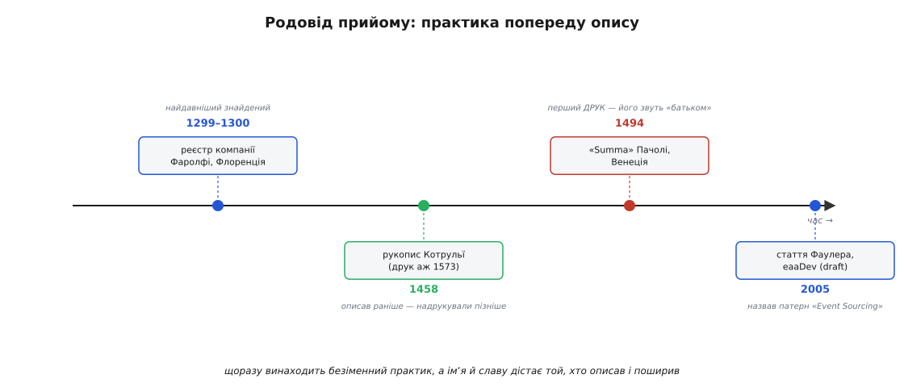

# 📜 Родовід прийому: від купецької книги до архітектурного патерну

Ідея зберігати не підсумок, а всі факти по порядку, здається новинкою з епохи розподілених систем. Насправді їй понад сім століть. Той самий рух — «не переписуй число, а дописуй запис у кінець незмінного журналу; помилку прав не гумкою, а зустрічним записом» — купці італійських міст-держав винайшли й відшліфували ще коли не було не те що баз даних, а й самого друкарства. Програмісти лише переоткрили його для іншого носія й дали йому нове імʼя. Ця історія варта того, щоб її розказати чесно, бо в ній двічі зіграла та сама пастка атрибуції: людині, яка **описала й поширила** прийом, часто приписують те, що вона його **вигадала**. Розберімо, хто що насправді зробив — і в бухгалтерії XV століття, і в програмній інженерії XXI.

## Що бентежило купця: пам'ять, якій можна вірити

Уяви флорентійського або венеційського торговця кінця XIII століття. Його справи розкидані: товар пливе морем, гроші позичені під відсоток єпископу в іншій країні, компаньйон торгує в третьому місті, борги ходять туди-сюди між десятками осіб. Тримати все це в голові неможливо. Записувати як заманеться — теж біда: за рік не розбереш, хто кому винен і чи не помилився ти в підрахунку. Купцеві потрібна **пам'ять, якій можна довіряти** — така, що не тільки каже, скільки в тебе зараз грошей, а й дозволяє **перевірити** цю цифру, простеживши, звідки вона взялася, і **зловити** власну помилку, якщо десь прокрався зайвий чи пропущений запис.

Розв'язок, до якого дійшли, і є подвійний запис (італ. *partita doppia* — «подвійна стаття»). Кожну господарську подію записують **двічі** — в дебет одного рахунку й у кредит іншого, на однакову суму. Продав товар за готівку — готівки побільшало (дебет каси), товару поменшало (кредит товару). Кожна операція лишає слід у двох місцях, і сума всіх дебетів мусить завжди дорівнювати сумі всіх кредитів. Якщо не дорівнює — десь помилка, і її видно одразу. Це вбудований самоконтроль: не зовнішня перевірка, а властивість самого способу запису.

І — головне для нашої історії — записи в такій книзі **не витирають**. Раз проведену суму лишають назавжди; якщо провели неправильно, роблять **сторнувальну проводку** (італ. *storno* — «відкидання назад»), тобто дописують зустрічний запис, що гасить хибний. Книга росте тільки вперед, кожна її стаття — доконаний факт, а поточний стан рахунку (сальдо) — це не окремо збережене число, а **підсумок усіх проводок**, який щоразу виводять, згорнувши колонку. Хто читав про зберігання подій, уже відчув знайоме: незмінний журнал, дописування в кінець, виправлення через компенсацію, стан як згортка. Усе це вже було — п'ять століть тому, чорнилом по паперу.

> 🔧 **Навіщо це знати.** Родовід — не прикраса й не «цікавий факт наостанок». Він показує, що зберігання подій розв'язує **дуже давню, перевірену часом потребу**, а не примху сучасної моди. Коли колега каже «навіщо ці складнощі, збережімо просто стан у таблиці» — за плечима прийому стоять п'ять століть купецької практики, яка цю саму спокусу вже пройшла й свідомо від неї відмовилася там, де ціна помилки висока. Ти не винаходиш екзотику; ти береш найстаріший у світі спосіб вести облік, якому можна довіряти.

## Хто насправді придумав подвійний запис

Тепер — до чесної атрибуції, бо тут накопичилося непорозумінь. У популярних переказах раз у раз читаєш, що подвійний запис «винайшов **Лука Пачолі** (італ. *Luca Pacioli*) у 1494 році». Це неправда — і сам Пачолі так ніколи не казав.

Лука Пачолі (бл. 1447–1517) — італійський математик, чернець-францисканець, родом із містечка Борго-Сансеполькро в Тоскані, приятель і співавтор Леонардо да Вінчі. У 1494 році у Венеції вийшов друком його великий математичний трактат «**Summa de arithmetica, geometria, proportioni et proportionalità**» («Сума [знань] з арифметики, геометрії, пропорцій і пропорційності») — енциклопедія тодішньої математики. Один її розділ, «*Particularis de computis et scripturis*» («Про рахунки й записи»), детально, крок за кроком, описував венеційський спосіб подвійного запису: як вести меморіал, журнал і головну книгу, як робити проводки, як виводити сальдо, як правити помилки сторно. Це був **перший друкований** виклад подвійного запису — і саме за нього Пачолі часто звуть «батьком бухгалтерського обліку».

Але «перший, хто **надрукував**» — не те саме, що «перший, хто **придумав**». Сам Пачолі прямо писав, що викладає **венеційський метод**, який купці вже давно застосовують на практиці; він **систематизував і поширив** його, а не винайшов. І докази цьому — старіші за його книгу на два століття.

Найдавніший відомий **повний** подвійний реєстр дійшов до нас від флорентійської торгової компанії **Джованніно Фаролфі** (італ. *Giovanni[no] Farolfi & Co.*), що вела справи в місті Нім на півдні Франції й давала позики під відсоток архієпископові Арля. Її головна книга за **1299–1300 роки** має всі ознаки зрілого подвійного запису: дебет і кредит для кожної статті, серйозну спробу річного балансування рахунків. Це не теоретична вправа, а робочий документ практиків, що розв'язували практичну задачу; він зберігається в Державному архіві Флоренції. Отже, за двісті років до друку Пачолі метод уже працював у повну силу.

> Статус доказовості. Що реєстр Фаролфі 1299–1300 — **найдавніший відомий повний** зразок подвійного запису, і що Пачолі його описав, а не винайшов, — усталений факт бухгалтерської історіографії (класична праця — Джеффрі Лі, «The Coming of Age of Double Entry: The Giovanni Farolfi Ledger of 1299–1300», 1977). Оговорка чесна: «найдавніший **відомий**» — не «найперший, що взагалі існував». Окремі елементи двобічного запису трапляються й раніше (генуезькі рахунки початку XIV ст. серед претендентів), а безліч купецьких книг просто не збереглася. Тому обережне формулювання — «найдавніший **дотепер знайдений** повний реєстр», а не «місце, де подвійний запис народився».

Була й ще одна людина між купцями-практиками й Пачолі, про яку варто сказати, бо її доля — чиста ілюстрація тієї самої пастки атрибуції. **Бенедетто Котрульї** (італ. *Benedetto Cotrugli*, хорв. *Benedikt «Beno» Kotruljević*) — купець, економіст і дипломат родом із **Рагузи** (нині Дубровник, тодішня Рагузька республіка на далматинському узбережжі), не італієць за походженням, а рагузець далматинсько-хорватського кола. У **1458 році** він написав трактат «*Della mercatura e del mercante perfetto*» («Про торгівлю і про досконалого купця»), а в ньому — розділ про подвійний запис, складений **на 36 років раніше** за друковану «Суму» Пачолі. Але трактат Котрульї пролежав у рукописах і вийшов друком аж **1573 року**, через понад століття після написання, — коли слава «першого» вже міцно закріпилася за Пачолі. Виграв не той, хто описав раніше, а той, кого раніше **надрукували й прочитали**. Друкарський верстат вирішив питання пріоритету, а не хронологія.



*Родовід прийому в часі. Практика подвійного запису йде попереду будь-якого її опису: купці Фаролфі вже ведуть повний реєстр за два століття до того, як Пачолі його надрукує. Котрульї описав метод раніше за Пачолі, але вийшов друком пізніше — тому «батьком обліку» звуть Пачолі. Через пʼять століть та сама ідея — незмінний журнал фактів — переродиться в програмний патерн, і його теж назве не винахідник, а той, хто описав і поширив.*

Що з цього забрати про атрибуцію? Три чіткі рівні, які корисно не змішувати, — вони знадобляться й для програмної частини історії:

```
винайшли й застосували     → безіменні купці італійських міст (XIII ст. і раніше)
описав раніше, надрукували пізніше → Бенедетто Котрульї (рукопис 1458 → друк 1573)
описав і ПОШИРИВ друком     → Лука Пачолі (Summa, 1494) ← його й звуть «батьком»
```

«Батько обліку» — почесний, але неточний титул: Пачолі — батько **поширення й кодифікації**, не батько **винаходу**. Це не применшує його заслуги (гарний, доступний, надрукований виклад — величезна праця, що навчила подвійного запису всю Європу), а лише повертає її на правильну поличку. Тримай цю різницю в голові — за хвилину вона повториться майже дослівно.

## Як купецька книга переродилася в архітектурний прийом

Перенесімося на пʼять століть уперед. Купецька книга нікуди не зникла — вона просто стала комп'ютерною, а тоді, з приходом реляційних баз, майже втратила свою давню чесноту. Реляційна таблиця за замовчуванням зберігає **поточний стан**: рядок рахунку з одним числом `balance`, яке кожна операція `UPDATE`-ом **перезаписує**. Зручно для читання, але та сама втрата, від якої купці свідомо відмовилися: історія стерта, доказ знищено, «прокрутити плівку назад» неможливо. Кілька десятиліть це вважали нормою — аж поки практики не згадали (часто не усвідомлюючи, що згадують) стару купецьку дисципліну: а зберігаймо не стан, а **потік подій**, і виводьмо стан із нього.

Сама ідея в програмуванні не нова навіть як програмна: системи так будували ще на мейнфреймах до епохи SQL-баз, журнали транзакцій усередині самих СУБД працюють рівно так (послідовність записів, з якої відновлюють стан), образи Smalltalk зберігаються дописуванням змін. **Ґреґ Янґ** (англ. *Greg Young*) — один із тих, хто у 2000-х найгучніше повернув цю ідею в мейнстрім прикладної розробки й тісно повʼязав її з **CQRS** (розведенням моделі запису й читання) у спільноті [предметно-орієнтованого проєктування](book:programming/domain-driven-design) (DDD). Саме Янґ, за загальним визнанням спільноти, увів термін **CQRS** і невтомно його поширював через доповіді й триденні курси з початку QCon San Francisco 2006. Показово, що сам Янґ описував зберігання подій не як свій винахід, а як «дуже-дуже стару концепцію», якою «працюють тисячі систем», сягаючи корінням «темних віків» обчислень, — тобто чесно ставив себе в роль поширювача усталеної ідеї, а не її автора.

А хто ж дав імʼя й перший каталогізований опис самому прийому «Event Sourcing»? Це зробив **Мартін Фаулер** (англ. *Martin Fowler*) — британський інженер, автор впливових книг з архітектури застосунків. **12 грудня 2005 року** він опублікував статтю «Event Sourcing» у своєму мережевому каталозі патернів enterprise-архітектури (розділ *eaaDev* — «дальший розвиток» ідей його книги «Patterns of Enterprise Application Architecture»). Цікава й показова деталь: **ця стаття й досі має статус чернетки** (англ. *draft*). Фаулер сам наприкінці зазначив, що матеріал «дуже в чорновому вигляді» й що він не братиметься за правки та доповнення, доки не знайде час знову цим зайнятися, — а часу, схоже, так і не знайшлося за двадцять років. Один із найцитованіших описів патерну в галузі формально навіть не дописаний. Це добре нагадування, що вплив тексту не завжди пропорційний його завершеності.

У тій чернетці вже зібрано весь кістяк, яким прийом користуються й сьогодні. Фаулер описав **повну перебудову** (англ. *complete rebuild*): застосунок можна цілком відкинути й відновити, прогнавши події з журналу по порожньому стану. Описав **темпоральний запит** (англ. *temporal query*): стан застосунку можна визначити на будь-який момент у минулому. Згадав **знімок** (англ. *snapshot*) як збережений проміжний стан для прискорення й **журнал аудиту** (англ. *audit log*), який тривіально дістати серіалізацією подій. І дав дві аналогії, що чудово лягають на нашу історію. Перша — **система контролю версій**: Subversion (система керування версіями коду) робить рівно те саме — зберігає всі зміни й відновлює стан на будь-яку ревізію; «повна перебудова» там — це dump і restore репозиторію. Друга аналогія — і ось де коло замикається — **бухгалтерський рахунок**: Фаулер прямо пише, що бухгалтерські проводки (англ. *Accounting Entries*) — це журнал усіх подій, що змінюють значення рахунку, а отже сам рахунок **і є** приклад зберігання подій. Тобто автор програмного патерну сам указав на купецьку книгу як на його прабатька. Ми не притягуємо цю паралель — на неї вказав той, хто патерн назвав.

> Статус доказовості. Що Фаулер опублікував «Event Sourcing» 12 грудня 2005 року в статусі чернетки, з аналогіями Subversion і бухгалтерського рахунку та поняттями complete rebuild / temporal query / snapshot / audit log, — **перевірено за першоджерелом** (сама стаття на `martinfowler.com/eaaDev`, дата й приписка про draft у ній). Про сам **термін** «event sourcing» варто говорити обережно: за загальним визнанням Фаулер прийом **описав, каталогізував і дав розгорнуту назву** приблизно тоді ж, коли ідея бродила спільнотою DDD/CQRS довкола Ґреґа Янґа; але надійного документа, де хтось (зокрема Янґ) **claim-ить** авторство саме двослівного терміна, немає, а сам Янґ трактує прийом як стару, нічию ідею. Тож чесне формулювання — «Фаулер дав патернові його канонічний опис і назву, а розійшовся термін спільнотою DDD/CQRS», а не «термін винайшов конкретний Х». «Хто перший вимовив ці два слова» — питання без твердої відповіді, і накидати її не варто.

## Та сама пастка, двічі

Тепер поклади поруч дві половини історії — і побачиш, що це одна й та сама фігура, зіграна двічі, майже нота в ноту.

```
БУХГАЛТЕРІЯ                          ПРОГРАМУВАННЯ
винайшли й застосували               винайшли й застосували
  безіменні купці (XIII ст.)           безіменні інженери мейнфреймів,
                                        журнали СУБД, образи Smalltalk
описав і поширив, дав імені вагу     описав, каталогізував, назвав
  Лука Пачолі (Summa, 1494)            Мартін Фаулер (eaaDev, 2005, draft)
  ← його звуть «батьком обліку»        ← його статтю цитують як канон
поширював у спільноті                поширював у спільноті
  венеційські школи абако              Ґреґ Янґ, DDD/CQRS-спільнота, з ~2006
```

Обидва рази прийом народився в **практиці** безіменних людей, що розв'язували конкретну задачу, задовго до того, як хтось його гарно описав. Обидва рази слава дісталася не винахідникові, а **тому, хто описав і поширив**: Пачолі не вигадав подвійний запис, Фаулер не вигадав зберігання подій — обидва його **кодифікували й пустили в широкий обіг**. І обидва рази вирішальним був не пріоритет ідеї, а **доступність опису**: Котрульї описав раніше за Пачолі, але його рукопис лежав під сукном до 1573-го й програв друкованій «Сумі»; ідея зберігання подій жила в мейнфреймах десятиліттями, але мейнстрімом стала аж тоді, коли Фаулер її каталогізував, а Янґ роз'їздив із нею конференції. Ідея без ясного, доступного, поширеного опису лишається невидимою, хоч би скільки систем нею тихо користувалися.

Звідси й практичний висновок, ширший за саме зберігання подій. Коли читаєш «Х винайшов Y» — науку, техніку, прийом, — привчи себе розкладати твердження на рівні: хто **застосував уперше** (часто безіменні практики), хто **описав** (не завжди перший — важить, кого прочитали), хто **дав імʼя й поширив** (кому дісталася слава), хто **побудував робочу систему**, хто **запатентував чи скомерціалізував**. Це різні дії різних людей, і зливати їх в одне «винайшов» — означає майже завжди когось несправедливо стерти, а комусь приписати зайве. Історія зберігання подій добра тим, що ця плутанина в ній видна як на долоні, аж двічі поспіль: практик винаходить мовчки, а лаври збирає той, хто говорить голосно й зрозуміло.

І, може, найкраще в цій історії — те, наскільки ідея виявилася живучою. Зміна носія з чорнила на кремній не зачепила її суть ні на йоту. Незмінний журнал доконаних фактів, стан як згортка журналу, виправлення дописуванням, а не стиранням — ці правила однаково добрі для книги венеційського купця 1300 року й для розподіленої системи 2005-го, бо розвʼязують ту саму вічну потребу: **пам'ять, якій можна довіряти, бо вона нічого не забуває й не бреше про минуле**. Прийом не постарів за сім століть, бо потреба, з якої він виріс, не постаріла теж.
