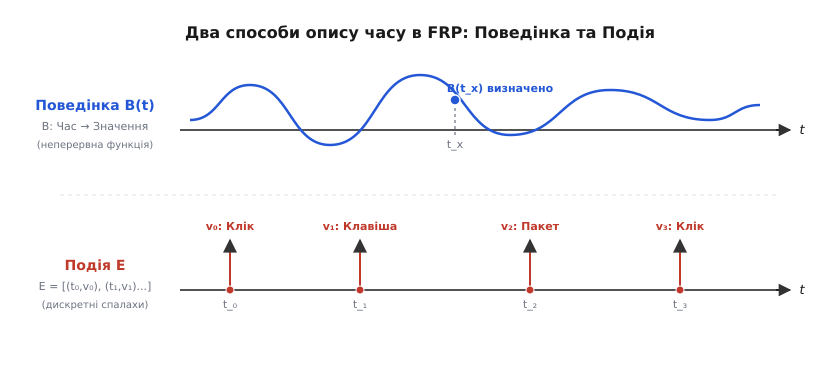
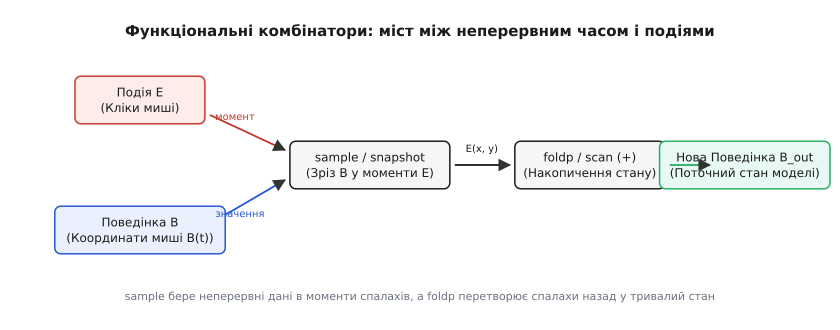
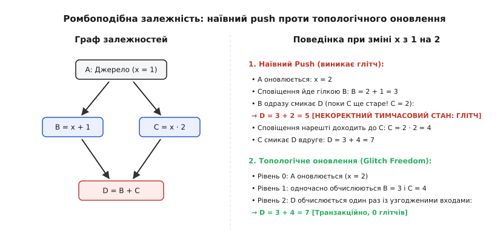
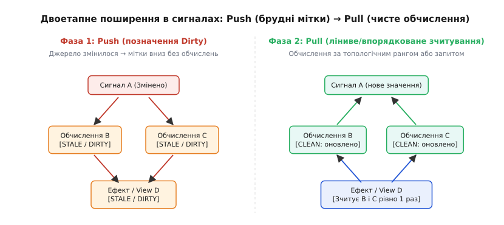

# Функціональне реактивне програмування: потоки подій і поведінки

<preknowlist>
- [Спостерігач](book:programming/observer) — патерн підписки на зміни; FRP виростає з подолання обмежень та хаосу неконтрольованих колбеків спостерігача.
- [Чисті функції і побічні ефекти](book:programming/pure-functions-side-effects) — чому відсутність прихованих мутацій дає змогу безпечно комбінувати функції в ланцюги.
- [Незмінність як прийом дизайну](book:programming/immutability) — як незмінні структури даних гарантують передбачуваність при асинхронній передачі значень.
- [Реактивні потоки](book:programming/reactive-programming) — базові концепції push-моделі, потоків даних та операторів перетворення.
- [Прив'язка даних](book:programming/data-binding) — як зміни моделі автоматично відображаються в поданні та чому для цього потрібні реактивні примітиви.
- [Однонапрямлений потік даних](book:programming/unidirectional-data-flow) — як архітектурно впорядкувати рух подій та стану в системі.
</preknowlist>

Уявімо типову інтерактивну систему: графічний редактор векторної графіки, де користувач перетягує фігуру мишею, паралельно змінюючи масштаб полотна повзунком, поки з бекенда через WebSocket кожні 50 мілісекунд прилітають оновлені координати співавторів документа. В класичній імперативній моделі для кожної такої дії створюється окремий обробник події (*event handler*). 

Обробник переміщення курсора бере координати з події операційної системи, вручну перераховує зміщення з урахуванням поточного коефіцієнта масштабування, мутує внутрішні координати об'єкта `shape.x` та `shape.y`, перевіряє межі екрана, змінює текст у рядку стану і явно викликає функцію перемалювання `canvas.repaint()`. 

Щойно інтерактивних факторів стає більше десяти, поведінка системи перетворюється на хаос. Якщо мережевий пакет прилітає саме в момент, коли користувач відпустив кнопку миші, але обробник відпускання кнопки ще не завершив виконання в черзі завдань, координати фігури перезаписуються застарілими мережевими даними. Програма потрапляє в стан гонитви (*race condition*), інтерфейс миготить розірваними кадрами, а стан системи виявляється розпорошеним по десятках мутабельних змінних, схованих у замиканнях різних підсистем.

Цей глухий кут породжений фундаментальною вадою імперативного підходу: **він змушує інженера описувати дискретні кроки мутації комп'ютерної пам'яті замість того, щоб декларувати математичні закони зміни величин у часі**. 

**Функціональне реактивне програмування** (англ. *Functional Reactive Programming*, FRP; від лат. *functio* — виконання, *re-* — проти/назад та *actio* — дія) розв'язує цю проблему через зміну оптики: замість розрізнених функцій зворотного виклику та мутабельного стану програма будується як чиста математична функція від неперервного або дискретного часу, де кожна змінна автоматично знає свій закон поведінки від моменту створення до завершення процесу.

## Час як математичний континуум: ідея Фран

Парадигму FRP сформулювали у 1997 році Конал Елліотт (*Conal Elliott*) та Пол Гудак (*Paul Hudak*) у роботі, присвяченій анімаційній бібліотеці Fran для мови Haskell. 

Історичні передумови цієї роботи, академічні дискусії навколо витоків пам'яті та еволюцію парадигми через бібліотеки Yampa, Flapjax та ReactiveX викладено в історичній довідці [Народження FRP: неперервний час проти дискретного хаосу](book:programming/functional-reactive-programming/hist-fran-and-time.md).

Ключовий висновок Елліотта і Гудака полягав у тому, що класичні подієві цикли (*event loops*) та ігрові таймери плутають сутність фізичного явища з його машинною дискретизацією. Координата маятника або колір неба на заході сонця існують не «раз на кадр за таймером у 16.6 мілісекунди», а неперервно. Вони існують у будь-який момент часу `t`. Коли інженер пише імперативний крок `pos += velocity * dt`, він примусово насаджує чисельну дискретизацію на саму модель, через що поведінка системи починає залежати від випадкових пауз збирача сміття або просідання частоти кадрів монітора.

Щоб позбутися цього недоліку, FRP вводить строгий поділ на два фундаментальні типи даних: **Поведінки** та **Події**.



*Поведінка є неперервною функцією, визначеною для будь-якого моменту часу t, тоді як Подія є дискретною послідовністю ізольованих спалахів на осі часу.*

## Поведінки (Behaviors) проти Подій (Events)

Усі величини в динамічній системі належать до однієї з двох взаємодоповнюючих категорій:

### 1. Поведінка (Behavior)

**Поведінка** (англ. *Behavior*) — це величина, яка **неперервно змінюється в часі**. Математично поведінка типу `a` є функцією від неперервного часу `Time`:

```
Behavior a = Time → a,   де Time = R (множина дійсних чисел)
```

Головна властивість поведінки — вона **визначена завжди**. У будь-який момент часу `t` ми можемо запитати поточне значення `B(t)`, і воно матиме строге математичне значення. 

Приклади поведінок:
- Поточні координати курсора миші на екрані: `mousePos : Behavior (Real, Real)`.
- Кут повороту стрілки годинника: `angle : Behavior Real`, де `angle(t) = (ω · t) mod 2π`.
- Поточна ширина вікна браузера: `windowWidth : Behavior Int`.
- Колір фону інтерфейсу: `bgColor : Behavior Color`.

Поведінка не знає понять «подія надійшла» чи «подія закінчилася». Вона просто *існує* як неперервне поле значень.

### 2. Подія (Event)

**Подія** (англ. *Event*) — це **дискретна послідовність спалахів у часі**. Подія не має тривалості: вона спалахує в окремі, строго фіксовані моменти часу і несе з собою конкретне корисне значення.

Математично потік подій типу `a` є впорядкованим списком пар «момент настання — передане значення»:

```
Event a = [(t₀, v₀), (t₁, v₁), (t₂, v₂), ...],   де t₀ < t₁ < t₂ < ...
```

Між моментами `tᵢ` та `tᵢ₊₁` подія не має жодного значення: питання «чому дорівнює подія натискання клавіші в момент між натисканнями?» не має математичного сенсу.

Приклади подій:
- Натискання лівої кнопки миші: `clicks : Event (Real, Real)`.
- Отримання байтового пакета з мережевого сокета: `packets : Event ByteString`.
- Спрацьовування таймера зворотного відліку: `timeout : Event ()`.
- Натискання клавіші на клавіатурі: `keyPresses : Event KeyCode`.

> 🔧 **Навіщо це.** Розділення на Поведінки та Події усуває плутанину між станом і сигналом. Стан (де зараз миша, скільки грошей на рахунку, який текст у полі вводу) — це завжди **Поведінка**. Сигнал (клік, натискання Enter, прихід HTTP-відповіді) — це завжди **Подія**. У звичайному коді програмісти намагаються зберігати стан усередині обробників подій, змушуючи події керувати тривалими значеннями. У FRP стан і події розділені за типами, і взаємодіють виключно через чисті функціональні комбінатори.

## Алгебра часу: функціональні комбінатори

Справжня сила FRP полягає не в самих типах `Behavior` та `Event`, а в наборі **комбінаторів вищого порядку** (*higher-order combinators*), які дають змогу комбінувати, перетворювати та зв'язувати час між собою, як деталі конструктора.

Математичну денотаційну семантику, доведення аплікативних законів для поведінок та операції неперервного диференціювання детально розібрано в математичній вставці [Денотаційна семантика FRP: алгебра поведінок і топологічний детермінізм](book:programming/functional-reactive-programming/math-denotational-semantics.md).



*Комбінатор sample робить дискретний зріз неперервної поведінки в моменти настання подій, а foldp накопичує дискретні події у тривалу кусочно-сталу поведінку.*

### 1. Трансформація: `map` (fmap)

Оператор `map` застосовує чисту функцію до кожного значення, не змінюючи часової структури:
- Для поведінки `map f B` утворює нову поведінку, значення якої в кожен момент `t` дорівнює `f(B(t))`.
- Для події `map f E` утворює новий потік подій, де кожне значення `vᵢ` перетворюється на `f(vᵢ)` у той самий момент `tᵢ`.

```
Поведінка:   B_speed(t) = map (\(x, y) → sqrt(x² + y²)) B_velocity
Подія:       E_keys(t)  = map (\event → event.keyCode) E_rawInput
```

### 2. Фільтрація: `filter`

Оператор `filter` визначений лише для дискретних Подій. Він пропускає далі лише ті спалахи, які відповідають заданому предикату `p`:

```
E_enterOnly = filter (\key → key == KEY_ENTER) E_keys
```

### 3. Зріз неперервності: `sample` (або `snapshot`)

Як поєднати неперервний світ зі світом дискретним? Для цього слугує комбінатор `sample` (або `snapshot`). Він бере **Поведінку** і вимірює її точне значення в моменти, коли спалахує **Подія**:

```
sample : Event b → Behavior a → Event (b, a)
```

Наприклад, якщо ми хочемо зафіксувати координати миші саме в момент кліку кнопки, ми робимо зріз:

```
clickPositions = sample mouseClicks mousePos
```

У результаті утворюється дискретний потік подій `clickPositions`, який містить координати курсора строго в моменти натискання кнопки миші.

### 4. Накопичення стану з минулого: `foldp` (scan)

Зворотна задача — як перетворити потік дискретних поштовхів на тривалий, неперервний стан? Для цього використовується комбінатор **накопичення з минулого** (в мові Elm він називався `foldp` — *fold from the past*, у ReactiveX — `scan`):

```
foldp : (a → s → s) → s → Event a → Behavior s
```

Оператор `foldp` бере функцію-акумулятор, початкове значення стану `s₀` та потік подій `Event a`. Кожного разу, коли спалахує подія, акумулятор обчислює новий стан, утворюючи кусочно-сталу **Поведінку**, яка зберігає останнє розраховане значення аж до наступної події.

```
-- Підрахунок кількості натискань:
clickCount : Behavior Int
clickCount = foldp (\_ count → count + 1) 0 mouseClicks
```

### 5. Неперервне інтегрування: `integral`

У класичному FRP Конала Елліотта числову поведінку можна безпосередньо інтегрувати за неперервним часом. Це дає змогу виражати фізичні закони без дискретних кроків `dt`:

```
integral : Behavior Real → Behavior Real
```

Якщо нам відома швидкість руху об'єкта як функція часу `v(t)`, його координата `x(t)` визначається прямою математичною формулою:

```
x = x₀ + integral v
```

Система сама виконує аналітичне або чисельне інтегрування під час рендерингу кадру, позбавляючи розробника похибок накопичення суми.

### 6. Динамічне перемикання топології: `switch`

Що робити, коли закон поведінки об'єкта має кардинально змінитися після настання певної події (наприклад, кулька вільно падала під дією гравітації, а після кліку миші перейшла в режим перетягування за курсором)?

Для цього призначений комбінатор вищого порядку `switch`:

```
switch : Behavior a → Event (Behavior a) → Behavior a
```

Він починає з початкової поведінки `B₀`. Щойно подія приносить *нову поведінку* `B₁`, система детерміновано перемикається на виконання `B₁`, відписуючись від `B₀`.

## Проблема ромбоподібної залежності та глітчі (Glitches)

Коли FRP-система переноситься з математичних абстракцій у реальний імперативний процесор, де обчислення виконуються послідовно крок за кроком, постає фундаментальна інженерна проблема: **глітчі** (*glitches*) в орієнтованих ациклічних графах залежностей (*DAG*).

Розглянемо класичну ромбоподібну топологію:



*При наївному push-сповіщенні проміжний вузол D обчислюється двічі, один раз бачачи розсинхронізовані входи (глітч). Топологічне оновлення гарантує узгодженість.*

Нехай у нас є базове реактивне джерело `A = 1`. Від нього залежать два похідні обчислення:
- `B = A + 1` (при `A = 1` маємо `B = 2`)
- `C = A * 2` (при `A = 1` маємо `C = 2`)

Кінцевий вузол `D` обчислює суму двох гілок:
- `D = B + C` (при початкових значеннях `D = 2 + 2 = 4`)

Тепер користувач змінює значення джерела: `A.set(2)`.

При математично коректному перерахунку значення повинні стати такими:
- `B = 2 + 1 = 3`
- `C = 2 * 2 = 4`
- `D = 3 + 4 = 7`

### Що робить наївна доставка (Naive Push)?

У наївній реактивній системі (наприклад, звичайний патерн `Observer` або примітивні EventEmitter) джерело `A` просто ітерується по списку своїх підписників і викликає їхні функції зворотного виклику.

1. Першим у списку підписників `A` стоїть вузол `B`.
2. Вузол `B` оновлюється: `B = 2 + 1 = 3`.
3. Вузол `B` одразу сповіщає свого підписника — вузол `D`.
4. Вузол `D` запускає перерахунок формули: `D = B + C`. Він бере щойно оновлене `B = 3`, але значення `C` бере з пам'яті, де воно **все ще дорівнює старому значенню 2**, бо сповіщення від `A` до `C` ще не дійшло!
5. Вузол `D` обчислює `D = 3 + 2 = 5`!
6. Вузол `D` запускає зовнішній ефект (наприклад, надсилає мережевий запит з сумою замовлення `5` або малює на екрані розірвану геометрію).
7. Нарешті джерело `A` переходить до другого підписника у своєму циклі й сповіщає вузол `C`.
8. Вузол `C` оновлюється: `C = 2 * 2 = 4` і сповіщає `D`.
9. Вузол `D` обчислює `D = 3 + 4 = 7` і відправляє повторний ефект із числом `7`.

Тимчасовий стан `D = 5` є **глітчем** (англ. *glitch*). Він математично неможливий: у системі ніколи не існувало моменту часу, коли джерело `A` одночасно дорівнювало б `2` (для гілки B) та `1` (для гілки C).

### Чому глітчі небезпечні?

У прикладних системах глітчі призводять до критичних збоїв:
1. **Помилки ділення на нуль та вильоти:** Якщо `B` — це масив, а `C` — його довжина, проміжний стан може спробувати звернутися за індексом, якого вже або ще не існує.
2. **Мережевий шторм:** Замість одного фінального запиту система відправляє проміжні некоректні запити з невалідними даними на сервер.
3. **Візуальне миготіння:** Екран малює проміжний спотворений кадр на частку мілісекунди.

## Досягнення Glitch Freedom: Топологічне сортування та Push-Pull

Властивість реактивної системи, за якої поява тимчасових некоректних станів математично неможлива, називається **відсутністю глітчів** (англ. *Glitch Freedom*).

Для досягнення цієї гарантії граф реактивних залежностей розглядається як орієнтований ациклічний граф (*DAG*), а оновлення виконується за алгоритмом **двоетапного поширення Push-Pull** або за допомогою **топологічного ранжування**:



*Двоетапний механізм: на фазі Push вниз ідуть лише швидкі позначки застарілості без розрахунків. На фазі Pull дані зчитуються з гарантією актуальності всіх предків.*

### Двоетапний алгоритм:

1. **Фаза 1: Push (розсилка міток застарілості).** 
   Коли значення джерела `A` змінюється, система не виконує жодних обчислень і не викликає формул користувача. Джерело `A` лише рекурсивно виставляє прапорець `isDirty = true` усім своїм нащадкам у графі (`B`, `C`, `D`). Ця фаза виконується миттєво, бо зводиться до перемикання бітових прапорців.
2. **Фаза 2: Pull (ліниве узгоджене зчитування).**
   Коли кінцевий ефект звертається до вузла `D`, вузол `D` бачить свій прапорець `isDirty`. Перед виконанням своєї формули він рекурсивно вимагає оновлення від `B` і `C`. Вузли `B` і `C` обчислюються першими, скидають свої прапорці `isDirty`, і лише після цього вузол `D` обчислює суму один-єдиний раз із найсвіжіших значень.

Повну практичну реалізацію такого графа мовами TypeScript та C++20 із динамічним відстеженням контексту, циклічним захистом та пакетуванням транзакцій наведено у проектній вставці [Реалізація реактивного графа без глітчів: push-pull топологія](book:programming/functional-reactive-programming/proj-glitch-free-dag.md).

## Еволюція парадигми: від Fran до сучасних сигналів

За майже тридцять років розвитку парадигма FRP трансформувалася від академічних експериментів у чисто функціональних мовах до промислового фундаменту сучасного вебу та інтерфейсів.

| Епоха / Бібліотека | Модель часу | Примітиви | Управління підписками | Обробка глітчів |
| :--- | :--- | :--- | :--- | :--- |
| **Класичний FRP (Fran, 1997)** | Неперервний (`Time = R`) | `Behavior a`, `Event a` | Автоматичне (денотаційне) | Гарантовано семантикою |
| **Arrowized FRP (Yampa, 2003)** | Неперервний / Дискретний крок | `SF a b` (Signal Functions) | Статична композиція стрілок | Гарантовано causal-структурою |
| **ReactiveX (RxJS, 2011)** | Дискретні потоки подій | `Observable<T>`, `Subject<T>` | Ручне (`unsubscribe`) або через оператори | ❌ Можливі глітчі при ромбах |
| **Сигнали (SolidJS, Svelte 5, 2022+)** | Дискретний синхронний крок | `Signal<T>`, `Computed<T>`, `Effect` | Автоматичне динамічне відстеження | ✅ Повна Glitch Freedom (Push-Pull) |

### Чому не прижився чистий неперервний час?

Класичний підхід Fran із неперервною функцією `Time → a` зіткнувся з двома важкими проблемами в мовах із лінивими обчисленнями:
- **Витоки пам'яті та часу (Space & Time Leaks):** Лінивий рантайм накопичував нескінченні ланцюги відкладених обчислень (*thunks*) від моменту старту програми, які вибухали споживанням гігабайтів оперативної пам'яті при першому зверненні до поточного стану.
- **Невідповідність архітектурі ОС:** Реальні операційні системи працюють дискретно: мережева карта генерує дискретне апаратне переривання, таймер ядра викликає дискретний тік, відеокарта вимагає кадру з фіксованою частотою 60 або 120 Гц.

### ReactiveX: перемога потоків подій

У 2010-х роках індустрія масово перейшла на **ReactiveX** (RxJS, RxJava, RxSwift) завдяки роботам команди Еріка Мейєра в Microsoft. ReactiveX спростив модель: він відкинув неперервні `Behavior` і зосередився виключно на **дискретних потоках подій** (`Observable`), наклавши на них багатий набір операторів (`map`, `filter`, `flatMap`, `debounce`, `combineLatest`). 

Проте RxJS виявився надто складним для звичайного синхронного стану інтерфейсів: необхідність вручну викликати `.unsubscribe()`, управляти пам'яттю операторів `takeUntil` та ризик появи глітчів у ромбоподібних ланцюгах створювали високий поріг входження.

### Відродження у вигляді Сигналів (Signals)

Сучасні бібліотеки (SolidJS, Svelte 5 Runes, Preact Signals, Vue Reactivity, Angular Signals) здійснили ренесанс первинної ідеї `Behavior`, адаптувавши її до реалій сучасного вебу:
1. **Сигнал — це дискретна Поведінка:** Сигнал `count()` завжди має значення в будь-який момент часу.
2. **Автоматичне зв'язування:** Не потрібно вручну писати `.subscribe()` чи вказувати масиви залежностей (як у React `useEffect`). Читання сигналу під час виконання формули автоматично реєструє зв'язок у глобальному контексті.
3. **Синхронний Push-Pull:** Гарантує нульові накладні витрати на незмінені гілки та 100% захист від глітчів.

## Коли що обирати: Сигнали проти Потоків подій

У сучасній архітектурі програмного забезпечення функціональний реактивний підхід розділився на дві спеціалізовані ніші, які доповнюють одна одну:

```
                          ┌───────────────────────────┐
                          │   Тип реактивної задачі   │
                          └─────────────┬─────────────┘
                                        │
           ┌────────────────────────────┴────────────────────────────┐
           ▼                                                         ▼
┌───────────────────────────────────────┐ ┌───────────────────────────────────────┐
│ Стан, залежні обчислення, рендеринг UI│ │ Асинхронні послідовності, мережа, I/O │
│   (Значення, яке визначене ЗАВЖДИ)    │ │   (Події, що спалахують у часі)       │
└──────────────────┬────────────────────┘ └──────────────────┬────────────────────┘
                   ▼                                         ▼
        ┌───────────────────────┐                 ┌───────────────────────┐
        │   СИГНАЛИ (Signals)   │                 │   ПОТОКИ (ReactiveX)  │
        │ SolidJS, Vue, Svelte  │                 │   RxJS, Flow, Akka    │
        └───────────────────────┘                 └───────────────────────┘
```

### 1. Обирайте Сигнали (Fine-Grained Reactivity / Behaviors):
- Для управління **станом додатку та синхронними похідними даними** (`fullName = firstName + " " + lastName`).
- Для **рендерингу користувацького інтерфейсу** та оновлення конкретних DOM-вузлів без повного перемалювання компонентів.
- Коли потрібна максимальна швидкодія, мінімальне споживання пам'яті та строга відсутність глітчів без ручного відписування.

### 2. Обирайте Потоки подій (ReactiveX / Event Streams):
- Для складної **координації асинхронних подій у часі** (наприклад, введення тексту в поле пошуку з `debounceTime(300ms)`, відкиданням застарілих відповідей через `switchMap` та повторними спробами запиту `retry(3)`).
- Для обробки **нескінченних зовнішніх потоків даних** (WebSocket, Server-Sent Events, покадрова обробка аудіо/відео, датчики телеметрії IoT).
- Коли події не є тривалим станом, а несуть дискретний характер повідомлень (*fire-and-forget* або команди шини подій).

## Часова координація: Debounce, Throttle, Sample та SwitchMap

Коли розробник працює з асинхронними подіями реального світу, швидкість надходження сигналів часто перевищує пропускну здатність обробника або викликає небажане навантаження на систему. Розглянемо чотири фундаментальні оператори часової координації, які вирішують цю проблему:

### 1. Усунення брязкоту: `debounce`

Оператор `debounce` (від англ. *de-bounce* — усунення брязкоту контактів) затримує передачу події доти, доки від моменту останнього спалаху не мине заданий інтервал тиші `Δt`.

```
Вхід:    --a-b-c-----------d-e-------f-------->
debounce(300ms):
Вихід:   -----------c-------------e-------f--->
```

Якщо нова подія приходить раніше, ніж сплив таймер `Δt`, таймер скидається і запускається знову. 
- **Де застосовувати:** Поле пошуку з автодоповненням (запит на бекенд відправляється лише тоді, коли користувач припинив набирати текст на 300 мс); збереження чернетки форми в локальне сховище.

### 2. Дроселювання частоти: `throttle`

Оператор `throttle` (від англ. *throttle* — дросель) обмежує максимальну частоту проходження подій: він пропускає першу подію негайно, а всі наступні події протягом вікна `Δt` ігнорує (або відкладає останню з них на кінець вікна).

```
Вхід:    --a-b-c-d-e-f-g-h-i-j---------------->
throttle(100ms):
Вихід:   --a-------e-------i------------------>
```

- **Де застосовувати:** Обробка події прокручування сторінки (`scroll`) для оновлення індикатора читання або нескінченного списку; обробка руху миші (`mousemove`) при малюванні на полотні.

### 3. Зріз за таймером: `sample`

Оператор `sample` бере значення з джерела з фіксованим періодом `T` (наприклад, кожну секунду), якщо за цей період надійшла хоча б одна нова подія:

```
Вхід:    --a--b----c-------d---e-------------->
sample(1000ms):
Вихід:   ----------b---------------e---------->
```

- **Де застосовувати:** Відображення графіків завантаження процесора (зчитування показників лічильників з фіксованим інтервалом без збереження проміжних мікроколивань).

### 4. Скасування застарілих асинхронних операцій: `switchMap`

У класичному коді пошуку користувач вводить слово «київ», відправляється HTTP-запит 1. Користувач дописує літеру «київський», відправляється HTTP-запит 2. Якщо через мережеві затримки відповідь на запит 1 прийде *пізніше*, ніж на запит 2, інтерфейс відобразить старі результати для слова «київ».

Оператор `switchMap` (або `flatMapLatest`) розв'язує цю проблему автоматично: щойно у вхідному потоці з'являється нове значення, будь-який незавершений внутрішній асинхронний запит **миттєво скасовується** (через `AbortController` або відписку), і система починає очікувати відповідь виключно для найсвіжішого значення.

## Управління пам'яттю та проблема «застарілого слухача»

У класичних об'єктно-орієнтованих архітектурах патерн «Спостерігач» є головним джерелом прихованих витоків пам'яті, відомих як **проблема застарілого слухача** (англ. *Lapsed Listener Problem*).

### Механізм витоку:

1. Довгоживучий глобальний об'єкт (наприклад, `AuthService` або `GlobalEventBus`) має масив підписників `listeners = []`.
2. Короткоживучий компонент інтерфейсу (наприклад, модальне вікно редагування профілю) підписується на зміни: `authService.onUserChange(user => this.update(user))`.
3. Замикання функції колбека неявно захоплює вказівник на `this` (весь екземпляр модального вікна з його DOM-вузлами та масивами даних).
4. Коли користувач закриває модальне вікно, графічна підсистема видаляє вікно з екрана, проте збирач сміття (Garbage Collector) **не може звільнити його пам'ять**, оскільки глобальний `AuthService` продовжує утримувати пряме посилання на функцію зворотного виклику у своєму масиві `listeners`.
5. Якщо користувач відкриє й закриє вікно 50 разів, у пам'яті осяде 50 «мертвих» примірників вікна, кожен з яких продовжуватиме виконувати свої обчислення при кожній зміні користувача.

### Як із цим бореться FRP?

1. **Дерева власників та області знищення (Owner Scopes):**
   У сучасних системах реактивних сигналів (SolidJS, Svelte) кожен реактивний ефект створюється всередині активного вузла дерева власників (`Owner`). Коли батьківський компонент демонтується, рантайм автоматично проходить по дереву власників і видаляє всі підписки дочірніх сигналів без жодного ручного втручання розробника.
2. **Слабкі посилання (WeakRef / WeakSet):**
   У системних мовах (C++, Rust) та сучасних рушіях JavaScript реактивні зв'язки між вузлами часто зберігаються у вигляді слабких вказівників (`std::weak_ptr` або `WeakRef`). Якщо на обчислюваний вузол більше немає активних сильних посилань, він автоматично знищується, а джерело очищає застарілий слабкий вказівник під час наступного обходу.
3. **Декларативні оператори життєвого циклу в потоках:**
   У ReactiveX ручне відписування замінюється декларативними операторами обмеження життя потоку:
   - `take(n)` — автоматично закриває потік після `n` значень.
   - `takeUntil(destroy$)` — тримає підписку активною лише доти, доки потік `destroy$` не надішле сигнал завершення компонента.

## Архітектурний розбір: Пошуковий рядок з автодоповненням

Щоб побачити якісну різницю між підходами, зіставимо три реалізації однієї й тієї самої задачі: поле вводу з затримкою 300 мс, ігноруванням порожніх рядків, скасуванням застарілих відповідей та відображенням індикатора завантаження.

### 1. Імперативний підхід з колбеками (крихкий, схильний до витоків)

```ts
let timerId: number | null = null;
let lastRequestId = 0;
let isLoading = false;
let results = [];

inputElement.addEventListener("input", (e) => {
  const query = (e.target as HTMLInputElement).value.trim();
  if (!query) {
    results = [];
    renderResults([]);
    return;
  }

  if (timerId !== null) clearTimeout(timerId);

  timerId = window.setTimeout(() => {
    isLoading = true;
    renderLoader(true);
    const currentRequestId = ++lastRequestId;

    fetch(`/api/search?q=${encodeURIComponent(query)}`)
      .then((res) => res.json())
      .then((data) => {
        // Захист від стану гонитви вручну через лічильник ID
        if (currentRequestId === lastRequestId) {
          results = data;
          renderResults(data);
        }
      })
      .catch((err) => handleError(err))
      .finally(() => {
        if (currentRequestId === lastRequestId) {
          isLoading = false;
          renderLoader(false);
        }
      });
  }, 300);
});
```

*Недоліки:* Стан (`isLoading`, `results`, `timerId`, `lastRequestId`) розмазаний по глобальних змінних; ручне керування таймерами та номерами запитів легко зламати додаванням нової вимоги.

### 2. Підхід ReactiveX / RxJS (декларативний потік подій)

```ts
import { fromEvent } from "rxjs";
import { map, filter, debounceTime, distinctUntilChanged, switchMap, tap, catchError } from "rxjs/operators";

const search$ = fromEvent<InputEvent>(inputElement, "input").pipe(
  map(e => (e.target as HTMLInputElement).value.trim()),
  filter(text => text.length > 0),
  debounceTime(300),
  distinctUntilChanged(),
  tap(() => renderLoader(true)),
  switchMap(query => 
    fetchSearch(query).pipe(
      catchError(err => {
        handleError(err);
        return of([]);
      })
    )
  ),
  tap(() => renderLoader(false))
);

const subscription = search$.subscribe(results => renderResults(results));
// При закритті екрана: subscription.unsubscribe();
```

*Переваги:* Уся логіка — це один лінійний конвеєр перетворень; скасування застарілих запитів бере на себе `switchMap`.

### 3. Підхід сучасних Сигналів (SolidJS / Fine-Grained Reactivity)

```ts
import { createSignal, createResource } from "solid-js";

const [query, setQuery] = createSignal("");

// createResource автоматично керує станом завантаження, скасуванням та кешуванням
const [results] = createResource(query, async (q) => {
  if (!q.trim()) return [];
  const res = await fetch(`/api/search?q=${encodeURIComponent(q)}`);
  return res.json();
});

// У JSX/шаблоні:
// <input onInput={(e) => debounce(() => setQuery(e.target.value), 300)} />
// <Show when={results.loading}><Loader /></Show>
// <For each={results()}>{item => <ResultCard data={item} />}</For>
```

*Переваги:* Нульовий шаблонний код для підписок; стан завантаження `results.loading` є реактивним сигналом; компонент рендериться декларативно без ручного виклику функцій малювання.

## Реактивність та серверний рендеринг: ера Resumability

Останнім великим проривом у розвитку ідей реактивних графів стала поява концепції **відновлюваності** (англ. *Resumability*, реалізована у фреймворках на кшталт Qwik та SolidStart).

У класичному React-подібному серверному рендерингу (SSR) сервер генерує HTML, відправляє його браузеру, після чого браузер завантажує гігабайти JavaScript і виконує так звану **гідратацію** (*hydration*): повторно запускає всі компоненти згори донизу, щоб розставити обробники подій та ініціалізувати внутрішній стан віртуального DOM.

Оскільки Сигнали та FRP-графи є чистими графами залежностей, стан реактивного графа можна повністю **серіалізувати в JSON прямо у вихідний HTML на сервері**. 

Коли сторінка відкривається у клієнтському браузері:
1. Браузер не виконує жодного рядка коду компонентів.
2. При першому кліку користувача завантажується лише крихітний обробник цього конкретного сигналу.
3. Сигнал підключається до серіалізованого графа залежностей і точково оновлює рівно один текстовий вузол у DOM.

Цей підхід остаточно розділяє опис інтерфейсу від часу його виконання, завершуючи еволюцію ідеї Конала Елліотта про те, що декларативний математичний опис системи повинен існувати незалежно від випадкових факторів фізичного процесора.

## Гранулярність оновлень: Dirty Checking проти Fine-Grained графів

Розвиток архітектури реактивних систем пройшов через три якісні парадигми виявлення змін:

### 1. Грубозернистий брудний перерахунок (Dirty Checking / Top-Down Re-render)
У класичному React або ранньому Angular система не знає, які саме змінні змінилися і які саме вузли дерева від них залежать. При будь-якій події (клік, таймер) фреймворк запускає повне виконання компонентів згори донизу, будуючи нове віртуальне дерево (Virtual DOM) і порівнюючи його зі старим (*reconciliation / diffing*). 
- *Ціна:* Складність `O(N)`, де `N` — кількість компонентів на екрані. Навіть якщо змінилося одне число в шапці таблиці на 10 000 рядків, віртуальний DOM порівнює всі 10 000 рядків.

### 2. Тонкозернистий граф сигналів (Fine-Grained Dependency Graph)
У FRP та сигналах (SolidJS, Svelte 5) кожен DOM-елемент прив'язаний до свого атомарного `Effect`. Жодного віртуального дерева та повторних запусків функцій компонентів не відбувається: компоненти виконуються **рівно один раз при старті** для конструювання графа.
- *Ціна:* Складність `O(1)` відносно розміру інтерфейсу та `O(K)` відносно кількості фактично змінених вузлів `K`. Якщо змінилося одне число, сигнал безпосередньо змінює текст в одному `TextNode` через прямий виклик `node.data = val`.

## Асинхронні ефекти та інваріанти черги мікрозадач

Особливим викликом для реактивних рушіїв є перетин синхронної межі: коли всередині `Effect` або `Computed` ініціюється асинхронна операція (`Promise`, `fetch`, `setTimeout`).

1. **Втрата контексту замикання:** Оскільки асинхронне продовження (`.then()`) виконується у наступному тіку циклу подій (*Event Loop*), глобальний контекст `activeSubscriber` вже очищено. Будь-який сигнал, прочитаний *після* ключового слова `await`, не буде автоматично зареєстрований як залежність.
2. **Інваріант синхронного захоплення:** Через це сучасні реактивні системи вимагають, щоб усі реактивні залежності зчитувалися **строго синхронно до першого `await`** (як це реалізовано в `createResource` SolidJS або `derived` у Svelte). Асинхронна частина сприймається як чистий I/O-ефект, результат якого через мікрозадачу записується в окремий вихідний сигнал.

Розуміння математичної природи часу, різниці між неперервною поведінкою та дискретною подією, а також механізмів подолання глітчів дає інженеру змогу проектувати детерміновані, масштабовані та надійні реактивні системи, вільні від хаосу некерованих зворотних викликів.


