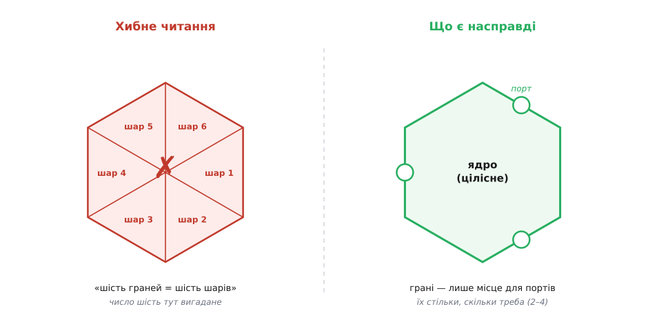

# 📜 Порти, адаптери і дві назви

Буває, що ідея вже правильна, а слово до неї — ще ні. Тоді слово починає жити власним життям і тягне ідею не туди, куди її задумували. Історія цього патерна — рідкісний випадок, коли ту саму думку її ж автор називав двічі, з відстанню в роки: спершу невдало, а потім влучно. І між цими двома назвами лежить ціла наука про те, як ім'я або рятує задум, або тихо його спотворює. Варто пройти цей шлях повільно, бо він показує річ, яку в підручниках з дизайну майже не пишуть: **добра назва — це не оздоба готового патерна, а частина самого патерна**, без якої його читають навпаки.

## Малюнок, старший за свою назву

Почнімо з того, що спантеличує найдужче: форму намалювали задовго до того, як зрозуміли, що вона означає. Автор патерна — **Алістер Кокберн** (Alistair Cockburn), американський інженер і один із чільних голосів раннього спритного (agile) руху, співавтор Маніфесту спритної розробки 2001 року. За його власними спогадами, шестикутник із «дірками» по краях він накреслив ще **1994 року**, готуючи заняття з об'єктного програмування. Малюнок був — а слів під нього не було. Кокберн згадує це напрочуд чесно: він не міг навіть сказати, **що саме** означає той шестикутник, він лише знав, що ці отвори по краях **мусять там бути**.

Зупинись на цьому, бо тут ключ до всього. Людина відчула форму раніше, ніж змогла її пояснити. Це звичайна річ у винахідництві — рука або око вловлюють структуру раніше за розум, і потім роки йдуть на те, щоб наздогнати власну інтуїцію словом. Кокберн намалював отвори, бо нутром чув: застосунок мусить мати чіткі місця, куди приходить зовнішній світ, і ці місця мусять бути однакові з усіх боків. Але **назвати** ці місця він тоді не міг, а тому й не міг пояснити іншим, чому малюнок саме такий.

Тимчасове ім'я, яке він дав формі, було описове й безпорадне водночас — **«шестикутна архітектура»** (hexagonal architecture). Воно чесно казало лише те, що видно оком: намальовано шестикутник. Про суть — про те, ЩО ці грані означають і НАВІЩО вони, — воно не казало нічого. Кокберн і сам згодом визнав, що це була **назва-заглушка** (placeholder): слово, поставлене на порожнє місце, поки не знайдеться справжнє. Заглушки в коді ми ставимо постійно й потім замінюємо; тут заглушкою виявилося саме ім'я патерна, і замінити його вдалося аж через одинадцять років.

## Чому взагалі шестикутник, а не квадрат

Перш ніж рушити далі, розберімо питання, яке ставить кожен, хто вперше бачить цю форму: чому шість сторін? І відповідь Кокберна варто почути дослівно, бо вона руйнує головну оману ще в зародку. Форму він вибирав **не** за числом сторін — він вибирав її, щоб **утекти від звички**.

А звичка була така. Усі креслили архітектуру прямокутниками: користувач зверху, база даних знизу; або користувач ліворуч, база праворуч. Ця картинка сама собою нав'язує думку про **верх і низ**, про шари, складені стосом, де щось головніше, а щось підпорядковане. Кокберн хотів цю думку в читачі **вимкнути** — бо його ідея була рівно протилежна: усі зовнішні співрозмовники застосунку рівноправні, немає «головного верху» й «службового низу». Тому прямокутник не годився в принципі: сама його форма бреше про задум.

Далі — суто малярська прагматика, і Кокберн викладає її майже жартома. Трикутник і квадрат заяложені до смерті, ними намальовано все на світі. П'ятикутник і семикутник **важко накреслити** від руки на дошці. Шестикутник же — форма, якої **ніхто не займав**, і водночас її легко малювати. Ось і весь вибір. Його власні слова, у переказі близько до тексту, звучать так:

```
«П'ятикутники й семикутники намалювати неможливо,
тож шестикутник був вільною формою. Ото й усе.»
                                    — Алістер Кокберн
```

> 🔧 **Навіщо це.** Тут захована важлива для читача пересторога: **форма на схемі — це риторика, а не означення**. Прямокутник шепоче «верх і низ», стрілка вниз шепоче «підпорядкування», стос шарів шепоче «пронумерований порядок». Малюючи архітектуру, ти вибираєш не тільки що показати, а й що читач **підсвідомо добудує** з самої геометрії. Кокберн узяв шестикутник саме тому, що той нічого зайвого не шепоче: у нього немає ані «верху», ані «низу», всі грані рівні. Форму обрано за те, чого вона **не** каже.

І звідси — головне, що треба затямити про число шість: **воно нічого не означає**. У ядра не шість шарів, не шість частин, не шість чогось. Кокберн прямо наголошував, що шестикутник узято не тому, що шістка важлива, а щоб **лишити на гранях місце** розставити стільки портів і адаптерів, скільки треба, і не бути затиснутим у пласку однолінійну картинку зі стосом шарів. Скільки портів насправді буває? За його ж свідченням — зазвичай **два, три чи чотири**; чотири — найбільше, що йому траплялося на практиці. Тобто граней шість, а робочих отворів — жменька, і їхнє число до шістки не має жодного стосунку.

## Пастка, яку наставляє слово «шестикутний»

Тепер найважливіше в усій цій історії — і саме заради цього вставку варто читати. Погана назва не просто «менш точна». Вона **активно заводить в оману**, бо людський розум, зустрівши число в імені, негайно шукає, до чого це число прикласти. Скажи «шестикутна архітектура» — і слухач, який ще не бачив суті, майже неминуче добудує гіпотезу: «ага, шість сторін — значить, тут **шість шарів** або шість якихось обов'язкових частин, і мені треба їх усі завести». Число в назві — це запрошення його рахувати.

І люди його рахували. Питання «а чому саме шість шарів?» і спроби натягти на грані якісь шість категорій — постійний супутник цієї назви й досі. Оману живить сам збіг: поряд є **шарова архітектура** (layered architecture), де шари справді складають стосом і рахують; тож перенести звичку «рахувати шари» на шестикутник — найприродніша помилка на світі. А вона руйнує весь задум: тільки-но ти почав ділити ядро на шість пронумерованих скиб, ти вже втратив головне — що ядро **цілісне** й **неподільне**, а грані потрібні не для його поділу, а лише як **місце для отворів** у зовнішній світ.



*Зліва — те, до чого підштовхує слово «шестикутний»: порахувати сторони й нарізати ядро на шість шарів. Справа — те, що є насправді: ядро цілісне, а грані — просто зручне місце розставити кілька портів. Число шість у лівій картинці вигадане; у правій його взагалі немає.*

Ось у чому підступність. Назва **не бреше** — шестикутник таки намальовано. Але вона **виставляє напоказ неістотне** (число сторін) і **ховає істотне** (що отвори однакові, а світ спілкується з ядром лише через них). Слухач бачить у назві найяскравіше слово — «шість» — і будує розуміння навколо нього, тобто навколо єдиної деталі, яка **не має значення**. Так назва-заглушка почала тихо шкодити: вона підсовувала читачам хибну модель ще до того, як ті встигали дійти до суті.

## 2005-й: слово нарешті наздоганяє малюнок

Розв'язка настала 2005 року, і настала не сама. Кільком людям ця форма муляла й хотілося зрозуміти її до кінця. Помітну роль тут зіграв британський програміст **Кевін Резерфорд** (Kevin Rutherford), який у своєму блозі того-таки 2005-го розмірковував над патерном — зокрема в замітці з промовистою назвою «Середній шестикутник має бути незалежним від адаптерів» (**«The Middle Hexagon Should Be Independent of the Adapters»**, 22 березня 2005). Кокберн згодом визнав ці дописи за поштовх — «останній удар по тімʼю», що склав картину докупи.

І в **червні 2005 року** прийшло те, що сам Кокберн назвав **«ага!»-моментом** (aha! moment). Його опис цієї миті — найважливіша цитата в усій історії, тож наведімо її близько до першоджерела:

```
«Я нарешті пережив оте "ага!" (червень 2005),
коли побачив, що грані шестикутника — це "порти"
(ну, цю частину я вже якось знав),
а обʼєкти між двома шестикутниками — це "адаптери".»
                                    — Алістер Кокберн
```

Придивись, що саме тут сталося. Не змінився **жоден** рядок ідеї. Ядро як було цілісним, так і лишилося; отвори як були на гранях, так і зостались; світ як спілкувався з ядром лише через ці отвори, так і спілкується. Змінилися **тільки два слова** — для граней і для перехідників між ними. Але цих двох слів вистачило, щоб уся форма нарешті стала **читатися правильно**. Кокберн одразу завів на славнозвісній вікі Ворда Каннінгема (Ward's wiki, той-таки Portland Pattern Repository, де змужніло чимало патернів) нову сторінку — **«Ports and Adapters Architecture»**. Уже 25 липня 2005-го Резерфорд занотував у себе: «Минулого місяця Алістер почав уживати нову назву для шестикутної архітектури — тепер він зве її архітектурою портів і адаптерів». А **4 вересня 2005 року** вийшов і формальний технічний опис патерна (версія 0.9) — уже під подвійною назвою, де **«порти й адаптери»** стоять як головне ім'я, а «шестикутна» — як допоміжне, за малюнком.

Того ж опису варто торкнутися ще однією цитатою — формулюванням мети патерна, бо саме воно показує, **навіщо** все це затівалося. Ціль Кокберн виклав так (близько до тексту):

```
«Зробіть застосунок так, щоб він працював без UI і без бази даних —
щоб можна було ганяти автоматичні регресійні тести проти застосунку,
працювати, коли база недоступна,
і зв'язувати застосунки між собою без участі людини.»
                                    — Alistair Cockburn, 2005
```

Ось де сходяться назва й задум. Мета — **однаковість**: байдуже, хто гукає застосунок (жива людина чи тест) і куди він складає дані (справжня база чи ніщо). А слова «порт» і «адаптер» цю однаковість якраз і **пояснюють** з першого погляду, тоді як «шестикутник» її ховав за числом сторін.

## Чому «порт» і «адаптер» — точні слова

Розберімо, чому нова пара слів лягла так добре, — бо це і є урок про добру назву. Обидва слова взято зі світу **заліза й роз'ємів**, і кожне несе рівно ту думку, яку треба.

**Порт** (port) — це роз'єм із чіткою формою. USB-порт не знає й не питає, що ти в нього встромиш: флешку, мишку, зарядку. Він задає лише **форму контакту** — обіцянку, якої мусить дотримати кожен, хто хоче під'єднатися. Саме це слово каже про грань шестикутника все правильне одразу: грань — це **місце під'єднання з визначеною формою**, і їй байдуже, хто по той бік. Ніякого «шару», ніякого «верху-низу» — просто роз'єм. Число роз'ємів довільне: скільки треба застосунку, стільки їх і буде.

**Адаптер** (adapter) — це перехідник. Перехідник USB-на-Ethernet не міняє ні USB, ні Ethernet; він лише **тлумачить одне в інше**, стоячи між ними. І це рівно те, чим є об'єкт, що з'єднує зовнішню річ із портом ядра: він перекладає мову світу (сирий HTTP-запит, рядок SQL) на мову ядра й назад. Кокбернове формулювання — «об'єкти **між двома шестикутниками**» — тут дуже точне: уяви внутрішній шестикутник (порти ядра) і зовнішній (де стоїть світ), а перехідники живуть у кільці **поміж** ними. Слово «адаптер» одразу каже: ця штука нічого не вирішує по суті, вона лише пристосовує форму. До того ж воно перегукується з давно відомим [патерном «Адаптер»](topic:programming/adapter) з каталогу об'єктного дизайну — тільки піднятим із рівня одного класу до рівня межі цілого застосунку, тож інженер упізнає ідею з півслова.

Склади ці два слова разом — і назва **сама розповідає патерн**: є ядро; у нього по краях порти (роз'єми визначеної форми); ззовні до кожного порту приставлено адаптер (перехідник), який приводить конкретну зовнішню річ до форми порту. Усе. Ні числа сторін, ні шарів, ні верху й низу — сама суть. Порівняй із «шестикутною архітектурою», яка з тих самих кількох слів не каже **нічого**, крім кольору малюнка, і мимоволі підсовує оману про шість шарів. Різниця між двома іменами — це різниця між **дороговказом** і **пасткою**.

## Що з цього виносити

Найдивовижніше в цій історії — те, що ідея від перейменування **не змінилася ні на йоту**. Кокберн не переробляв патерн; він лише нарешті дібрав слова до того, що намалював одинадцятьма роками раніше. І цього виявилося досить, щоб та сама ідея з «часто кривотлумаченої» стала «прозорою». Звідси прямий висновок, ширший за один патерн: **коли твою правильну ідею постійно розуміють навпаки, підозрюй передусім назву**. Дуже часто в самому імені випнуто неістотну деталь (тут — число сторін), а суть у ньому не звучить зовсім; і люди чесно будують розуміння навколо того єдиного слова, яке ти їм дав, — навколо хибного.

Тому за цим патерном закріпилися **обидва** імені, але не порівну. «Порти й адаптери» (ports and adapters) — точна назва: вона про суть, її й варто вживати, коли хочеш, щоб тебе зрозуміли правильно з першого разу. «Шестикутна архітектура» (hexagonal architecture) лишилася як історичне, впізнаване прізвисько — його досі часто чути, бо воно старше й устигло вкорінитися, — але тримати в голові варто, що це **та сама річ під заглушковим іменем**, і що саме воно й породжує вічне питання «а чому шість?». Відповідь на нього тепер у нас є коротка: **шість — ні до чого; рахуй не сторони, а порти, і їх стільки, скільки треба.**

Насамкінець — про статус сказаного, чесно й прямо, бо в історіях техніки легко з'їхати в легенду. Тут легенди немає: усе це — **усталений, задокументований факт**, і головне свідчення дав сам автор. Авторство Алістера Кокберна, малюнок 1994 року як заглушка, «ага!»-момент у червні 2005-го з дослівним формулюванням про грані-порти й адаптери між двома шестикутниками, поштовх від дописів Кевіна Резерфорда, поява сторінки «Ports and Adapters» на вікі Каннінгема того ж червня й формальний технічний опис від 4 вересня 2005 року — усе це підтверджено власними текстами Кокберна, його інтерв'ю та збереженими записами Резерфорда. Єдине, що не варто драматизувати, — точну **добу** «ага!»-моменту: сам Кокберн ставить його на червень 2005-го, і саме цю дату слід уживати, а не пізніші перекази, що інколи зсувають її на рік. У головному ж сумніву немає: спершу був малюнок без слів, потім — два влучні слова, і саме друга подія зробила ідею такою, якою її сьогодні знають.
