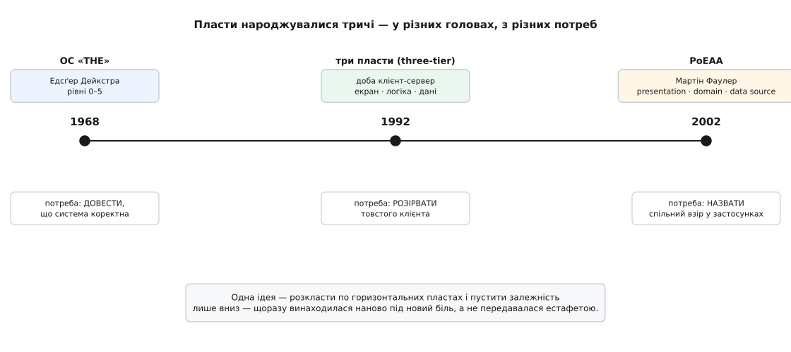

# 📜 Як народилися пласти

Ідея, що код треба розкласти на горизонтальні пласти й пустити залежність лише в один бік, здається сьогодні майже очевидною — настільки, що важко повірити, що її колись довелося винаходити. Але вона не впала з неба готовою. Вона народжувалася **щонайменше тричі**, у різних головах, з різних болей, і щоразу під іншим ім'ям. Спершу — щоб **довести**, що велика програма коректна. Потім — щоб **розірвати** товстого клієнта, який задихнувся під власною вагою. І нарешті — щоб просто **назвати** те, що досвідчені інженери й так уже робили руками. Три різні потреби, три різні винаходи однієї суті.

Ця вставка простежує ту суть крізь три віхи. Не заради дат самих по собі, а заради висновку, який дати роблять неминучим: пласти — не чийсь одноразовий здобуток, а форма, до якої програмісти сходяться раз за разом, коли складність стає завеликою, щоб тримати її в голові одним шматком.


*Одна ідея винаходилася наново під новий біль, а не передавалася естафетою від попередника до наступника.*

## Що бентежило на початку

Щоб відчути, чому пласти взагалі знадобилися, треба стати на місце того, хто писав велику програму до них. Уяви операційну систему кінця 1960-х: десятки речей діються одночасно — процесор перемикається між задачами, дані їздять між пам'яттю й барабаном, друкарка вихлюпує рядки, годинник цокає й перериває все своїм перериванням. Усе це переплетене в один клубок, де будь-яка частина може зачепити будь-яку іншу. І тепер питання, від якого холоне спина: **як переконатися, що воно правильне?**

Ти не можеш просто «прогнати тести». Комбінацій станів у системі з багатьма паралельними процесами стільки, що жодне тестування не пройде їх усі за час життя Всесвіту. Помилка може ховатися в одному-єдиному нещасливому збігу перемикань, який трапляється раз на місяць — і то в клієнта, о третій ночі. Клубок, у якому все залежить від усього, **неможливо охопити думкою цілком**: щоб зрозуміти один шматок, доводиться тримати в голові всі інші, а їх забагато. Саме ця біда — не брак швидкодії, не брак пам'яті, а **брак способу переконатися в коректності** — і штовхнула до першого народження пластів.

## Едсґер Дейкстра і система «THE»

Голландський інформатик **Едсґер Вібе Дейкстра** (нід. Edsger Wybe Dijkstra, 1930, Роттердам — 2002, Нюнен) працював тоді професором математики в Технічному вищому училищі Ейндговена (нід. Technische Hogeschool Eindhoven). Разом із командою він будував операційну систему для тамтешньої машини Electrologica X8. Систему назвали **«THE»** — і назва ця не має жодного глибокого сенсу: це просто ініціали училища, **T**echnische **H**ogeschool **E**indhoven. Не «the system», а «система ТГЕ».

> 🔧 **Навіщо це знати.** Історія «THE» — не про стару залізяку, а про те, звідки взялося саме те правило, яке тримає будь-яку шарову архітектуру сьогодні: «спирайся лише на нижче». Дейкстра ввів його не з естетичних міркувань, а тому, що без нього не міг **довести** коректність системи. Пласти народилися як інструмент доказу — і це багато пояснює в тому, чому вони працюють.

Опис системи Дейкстра оформив як робочу нотатку під номером EWD 196, а тоді опублікував статтею «The structure of the "THE"-multiprogramming system» у травневому числі **Communications of the ACM за 1968 рік** (том 11, число 5, сторінки 341–346). Це один із найвпливовіших текстів в історії проєктування систем — і головна його ідея вміщається в одне речення: **розклади систему на строгу ієрархію рівнів, де кожен вищий рівень спирається лише на нижчі й нічого не знає про те, що над ним.**

### Шість рівнів як шість абстракцій

Найтонше в задумі Дейкстри — що кожен рівень не просто «лежить під наступним», а **ховає одну складність** і дарує тим, хто над ним, зручну ілюзію. Знизу вгору:

- **Рівень 0 — розподіл процесора.** Тут живе перемикання задач і обробка переривання годинника реального часу, аби жоден процес не захопив процесор назавжди. Абстракція, яку цей рівень дарує вгору: **кожен процес може вдавати, що процесор у нього свій**. Скільки насправді фізичних процесорів і як вони діляться в часі — вище нікого не турбує.
- **Рівень 1 — керування пам'яттю** («сегментний контролер»), синхронізований із перериванням барабана. Він ховає різницю між швидкою основною пам'яттю (осердям) і повільним барабаном. Абстракція вгору: **сторінки даних просто є, коли треба**; де вони фізично лежать цієї миті — клопіт цього рівня, не вищого.
- **Рівень 2 — тлумач повідомлень**, спілкування з консоллю оператора. Він дає кожному процесу **власну віртуальну консоль**, хоча фізична одна на всіх.
- **Рівень 3 — буферизація потоків** уведення й виведення пристроїв. Ховає норов конкретного заліза за рівним потоком байтів.
- **Рівень 4 — програми користувача.** Тут працює власне корисне навантаження — процеси, що компілюють, виконують, друкують.
- **Рівень 5 — оператор.** Дейкстра сухо зауважує, що цей рівень «нами не реалізовано» (людина за пультом — теж частина системи, тільки писати її не треба).

Придивись до візерунка. Рівень 4 користується процесором так, наче він у нього один — бо рівень 0 узяв на себе всю метушню з перемиканням. Рівень 3 звертається до даних, не думаючи про барабан, — бо рівень 1 сховав барабан. **Кожен рівень стоїть на плечах нижчого й не мусить зазирати йому всередину.** Це і є та сама «стрілка залежності лише вниз», що тримає сучасні шари, — тільки вимовлена мовою операційних систем 1968 року.

### Пласти як інструмент доказу

А тепер — та причина, заради якої Дейкстра все це затіяв. Ієрархія була потрібна не для краси, а щоб зробити систему **перевірною по частинах**. Логіка проста й потужна: якщо рівень 0 не залежить від нічого, його можна довести до пуття й **переконатися в його коректності окремо** — поставивши згори кілька тестових процесів, які лише перевіряють, чи справедливо ділиться процесорний час. Коли рівень 0 доведено, він стає **твердим ґрунтом**: будуючи рівень 1, уже не треба сумніватися в перемиканні задач — воно правильне, крапка. Далі так само рівень за рівнем.

Ось арифметика, що показує, навіщо це:

```
Клубок, де все залежить від усього (N частин):
    перевірити треба ≈ усі пари взаємодій   → росте як N²
    для N = 6:  6·5 = 30 напрямків впливу, і всі одночасно

Строга ієрархія, де кожен спирається лише на нижче:
    доводимо по одному рівню, стоячи на вже доведеному нижче
    для N = 6:  6 незалежних кроків доказу, кожен — на твердому ґрунті
```

Різниця між «тримати в голові тридцять переплетених впливів» і «зробити шість окремих кроків, кожен на надійній основі» — це різниця між **недосяжним і здійсненним**. Саме тому Дейкстра свідчив, що ієрархічна будова виявилася **вирішальною для перевірки логічної обґрунтованості задуму й коректності його втілення**. Пласти народилися не як спосіб «гарно розкласти код», а як спосіб **зробити доказ коректності можливим узагалі**. Ця первинна мотивація нікуди не поділася: коли сьогодні кажуть, що завдяки шарам домен «можна перевірити тестом без бази», — це та сама Дейкстрина думка, лише здрібнена до масштабу одного класу.

Побіжно варто спинити один поширений переказ. Часто кажуть, що Дейкстра «винайшов багаторівневу пам'ять» чи «винайшов семафор» саме в «THE». Точніше так: у «THE» вперше **зреалізовано** програмну сторінкову віртуальну пам'ять і вперше **вжито семафори** як робочий засіб узгодження процесів — і обидві ці ідеї Дейкстра справді ввів. Але «винайшов» — завелике слово для колективної інженерної роботи: система була ділом команди, а семафор Дейкстра описав ще раніше, в окремій нотатці про паралельні процеси. Тут нам важливе інше його первородство — **сама ідея пластів-рівнів як несучої конструкції**, і от вона в цій статті постає вперше в чистому вигляді.

## Три пласти доби клієнт-сервер

Далі ідея пластів зникає з поля зору майже на чверть століття — не тому, що її забули, а тому, що вона тихо розчинилася в практиці. І виринає знову на початку 1990-х, уже під новим ім'ям і з зовсім іншої потреби.

Щоб відчути ту потребу, глянь, як будували ділові застосунки в 1980-х. Панувала **дворівнева** схема «товстий клієнт — база»: на кожному робочому комп'ютері стояла повноцінна програма, що сама малювала екран, сама рахувала всі правила підприємства й **сама, напряму**, ходила в спільну базу даних. Поки контор було мало, це працювало. А тоді почало тріщати з усіх боків.

По-перше, **правила бізнесу розповзлися по сотнях машин**. Змінилася ставка податку — і нову версію товстого клієнта треба якось доправити й поставити на кожен із трьохсот комп'ютерів у філіях. По-друге, **база задихалася від з'єднань**: кожен клієнт тримав своє пряме підключення, і на кількох сотнях робочих місць база просто не витягувала стільки одночасних сесій. По-третє, правила підприємства, розмазані по клієнтах, **годі було втримати однаковими** — одна філія вже на новій версії, інша ще на старій, і рахують вони по-різному.

Розв'язок напрошувався сам: **вийняти правила бізнесу з клієнта й посадити їх посередині**, на окремий сервер застосунків. Так дворівнева схема стала **трирівневою (англ. three-tier)**:

```
Дворівнева (1980-ті):              Трирівнева (1990-ті):

  [товстий клієнт]                   [тонкий клієнт]      ← лише екран
    екран + правила                        │
    + прямий доступ до БД                  ▼
         │                          [сервер застосунків]  ← правила бізнесу
         ▼                                 │                 (одні на всіх)
      [ база ]                             ▼
                                        [ база ]           ← лише дані
```

Виграш був негайний і відчутний. Правила бізнесу тепер жили **в одному місці** — оновити ставку податку означало перезапустити один сервер, а не обійти триста машин. База бачила з'єднання лише від жменьки серверів застосунків, а не від кожного робочого місця. А клієнт схуднув до самого екрана — його стало легко міняти й тримати простим. Ті самі три ролі, що їх пізніше назвуть **представлення / логіка / дані**, тут уперше **фізично роз'їхалися по трьох машинах**.

> 🔧 **Навіщо це знати.** Саме тут криється тонкість, яку легко проґавити: три пласти доби клієнт-сервер — це поділ **фізичний**, за машинами (англ. *tier* — ярус, поверх), тоді як Дейкстрині рівні й сучасні шари — поділ **логічний**, за родом справи (англ. *layer* — пласт). Одна й та сама логічна розкладка на представлення / логіку / дані може жити на трьох окремих серверах, а може вся вміститися в один процес. Плутанина «ярусів» і «пластів» тягнеться від цієї доби — і досі збиває з пантелику, коли «трирівневий» вживають то в одному, то в іншому сенсі.

### Спірне первородство

А тепер про те, чому ця віха на нашій осі стоїть **без одного імені**. Дуже часто повторюють, що трирівневу архітектуру «створив **Джон Дж. Донован** (англ. John J. Donovan) в Open Environment Corporation» — компанії з інструментів, яку він заснував у Кембриджі (штат Массачусетс) 1992 року. Ця фраза мандрує з тексту в текст майже дослівно.

Проблема в тому, що за цим твердженням **немає твердого джерела**. У Вікіпедії воно й донині стоїть із позначкою `[citation needed]` — «потрібне джерело», — а це майже завжди знак, що ланцюжок посилань упирається зрештою в матеріали самої компанії, а не в незалежне свідчення. Компанія Донована справді просувала й продавала трирівневий підхід і, схоже, добряче попрацювала над **популяризацією терміна** — але «активно поширював назву» і «винайшов саму ідею» — це, як завжди в історії технологій, різні речі.

Тож чесний статус цієї віхи такий: **дата надійна** (трирівневий поділ виразно оформився й став ходовим терміном на початку 1990-х, у розпал доби клієнт-сервер), а **єдиного винахідника немає**. Ідея визріла в багатьох місцях одночасно, з однакового спільного болю — товстий клієнт більше не тягнув. Приписати її одній людині чи одній фірмі — це та сама спокуса героїчного міфу, якої історія техніки повна: хтось голосніше за інших **назвав** те, що вже витало в повітрі, і назва прилипла до його імені. Розрізняймо чесно: **мати ідею**, **втілити її в робочу систему**, **зробити з неї продукт** і **дати їй ходову назву** — це чотири різні заслуги, і в історії трьох пластів вони належать радше цілій добі, ніж одному прізвищу.

## Мартін Фаулер закріплює імена

Третє народження — уже не про доказ і не про розрив клієнта, а про **словник**. На початку 2000-х серед інженерів корпоративних застосунків шаровий поділ був повсюдним ремеслом: усі так робили, але **називали по-різному**, і кожна команда винаходила свій жаргон. Бракувало спільної мови — усталених імен, на які можна вказати пальцем у розмові й у книжці.

Цю мову дав британський інженер **Мартін Фаулер** (англ. Martin Fowler) у книжці **«Patterns of Enterprise Application Architecture»** («Взірці архітектури корпоративних застосунків»), що вийшла **2002 року**. Фаулер тут нічого не «винаходив» — і чесно того не приховував; його заслуга в тому, що він **зібрав, упорядкував і назвав** взірці, які досвідчені інженери вже застосовували наосліп. У самому серці книжки — розділ про пласти, і в ньому **три головні пласти** з іменами, що відтоді стали галузевим стандартом:

- **Presentation** (представлення) — усе, що обернене до користувача чи до зовнішньої системи: екрани, вебсторінки, оброблення запитів. Як застосунок **говорить зі світом**.
- **Domain logic** (логіка домену), яку часто звуть просто **domain**, — правила й обчислення самої предметної області. Те, заради чого програму й писали: **що вона насправді вирішує**.
- **Data source** (джерело даних) — спілкування з базами, чергами повідомлень, чужими сервісами. Як застосунок **дістає й зберігає** те, з чим працює.

Порівняй ці три з трьома ярусами доби клієнт-сервер — представлення / логіка / дані — і побачиш **ту саму трійцю**. Але Фаулер зробив із нею дві важливі речі. По-перше, він повернув наголос із фізичного на **логічний**: у нього це **пласти** (layers), а не яруси, — розкладка за родом справи, байдуже, чи живуть вони на трьох машинах, чи в одному процесі. По-друге, він **прив'язав до кожного пласта конкретні взірці реалізації** — так, під джерелом даних у книжці стоять іменовані взірці на кшталт Table Data Gateway, Active Record, Data Mapper: не просто «пласт даних узагалі», а конкретні перевірені способи його збудувати. Пласт із голої ідеї став **робочим інструментом із набором готових деталей**.

Саме імена Фаулера — presentation, domain, data source — і ходять сьогодні в щоденних розмовах про архітектуру. Коли інженер каже «винеси це в доменний шар» або «це має жити в шарі представлення», він говорить словником, який усталив цей текст 2002 року. Дейкстра дав **ідею й правило**; доба клієнт-сервер дала **фізичний поділ і термін «яруси»**; Фаулер дав **спільні імена й прив'язку до взірців реалізації**.

## Що з цього випливає

Збери три віхи докупи — і проступить висновок, вартий цілої вставки. Ту саму суть — **розкласти по горизонтальних пластах і пустити залежність лише вниз** — винайдено щонайменше тричі, і **щоразу з іншої потреби**:

```
1968  ОС «THE», Дейкстра        потреба: ДОВЕСТИ коректність
                                 → рівні, кожен спирається лише на нижчий

~1992 три яруси (three-tier)     потреба: РОЗІРВАТИ товстого клієнта
                                 → правила бізнесу — на окремий сервер посередині

2002  PoEAA, Фаулер             потреба: НАЗВАТИ спільний взір
                                 → presentation / domain / data source + взірці
```

Це і є головна думка. Пласти — **не чийсь одноразовий винахід**, який хтось перший придумав, а решта успадкували. Це форма, до якої програмісти **сходяться раз за разом незалежно**, тільки-но складність переростає те, що людина здатна втримати в голові одним нерозчленованим шматком. Дейкстра дійшов до неї, щоб **довести**; інженери 1990-х — щоб **розчепити** те, що злиплося й задихнулося; Фаулер — щоб **назвати** й дати готові деталі. Три різні болі, одна відповідь.

І це багато каже про саму ідею. Коли розв'язок винаходять наново стільки разів, з різних боків, під різні задачі, — це не мода й не чиясь вдала вигадка, а щось ближче до **закону будови складного**: розділяй за родом справи, вибудовуй у стос, пускай залежність в один бік — і те, що не вміщалося в голову клубком, стане під силу по частинах. Історія пластів — це історія однієї й тієї ж думки, яку різні люди намацували в темряві незалежно один від одного, бо складність штовхала їх усіх в один бік.
