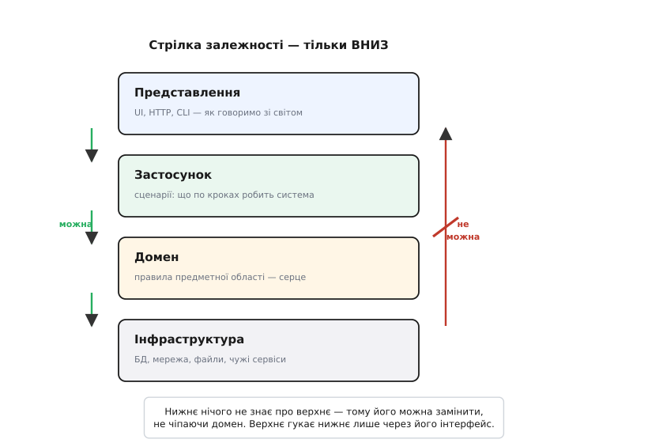
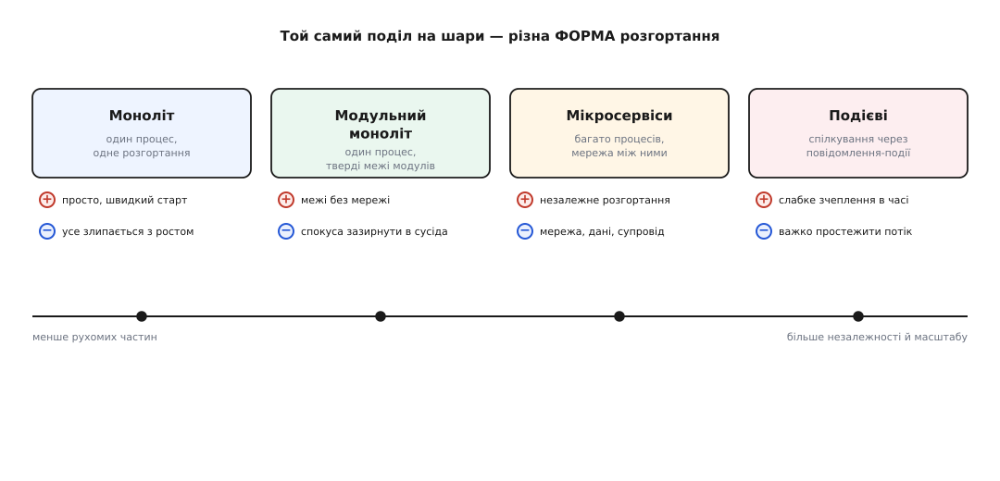

# Шарова архітектура

<preknowlist>
- [Зчеплення і зв'язність](book:programming/coupling-cohesion) — дві мірки залежності модулів: скільки частини знають одна про одну і чи служить усе всередині одній справі. Шари — це спосіб керувати зчепленням у великому.
- [Інтерфейс проти реалізації](book:programming/interface-vs-implementation) — поділ на те, ЩО модуль обіцяє зовні, і ЯК він це робить усередині; межа між шарами — це саме такий інтерфейс.
- [Принцип інверсії залежностей (DIP)](book:programming/dependency-inversion) — як поставити абстракцію між двома модулями й розвернути стрілку залежності; без цього прийому шари не тримаються.
</preknowlist>

Будь-який застосунок, хай який складний, зрештою робить три різні речі, які легко переплутати. Він **говорить зі світом** — показує екран, приймає запит, друкує відповідь. Він **вирішує, що робити** за правилами своєї предметної області — чи можна списати гроші, чи має знижка право спрацювати, скільки податку додати. І він **зберігає та дістає дані** — з бази, з файлу, з чужого сервісу по мережі. Три справи, три різні швидкості життя: екран перемальовують щомісяця, правила бізнесу міняються раз на рік, а базу даних, якщо пощастило, не чіпають роками.

Природа коду штовхає ці три речі злипнутися. Найшвидший спосіб додати кнопку «оформити замовлення» — прямо в обробнику натискання порахувати суму, тут же відкрити з'єднання з базою і вписати рядок. Працює. Але тепер правило «як рахувати суму» живе всередині коду кнопки, і щоб його змінити, треба лізти в UI; щоб перевірити його тестом — треба намалювати кнопку й підняти базу. Три речі з трьома різними життями склеєні в одну грудку, і кожна тягне за собою дві інші.

Шарова архітектура (від англ. *layer* — пласт) — це найдавніша й найпростіша відповідь на це склеювання: **розклади код на горизонтальні пласти за родом справи, і дозволь залежностям текти лише в один бік — згори вниз.**

## Стос і одне правило

Класичний стос має чотири шари, хоч у простих застосунках їх буває три. Згори — **представлення (presentation)**: усе, чим система торкається зовнішнього світу. Веб-контролери, розмітка сторінки, розбір HTTP-запиту, командний рядок. Його єдина робота — перекласти запит ззовні у виклик усередину і відповідь усередини — назад назовні.

Нижче — **шар застосунку (application)**, іноді званий шаром сценаріїв або служб. Він не містить правил предметної області, а **диригує** ними: «щоб оформити замовлення — перевір наявність, спиши гроші, познач як оплачене, надішли лист». Це послідовність кроків, тонка координація; ім'я кожного кроку веде в наступний шар.

Серце — **домен (domain)**, шар правил самої предметної області. Тут живе те, заради чого програму й писали: що таке замовлення, коли воно валідне, як рахується сума зі знижкою й податком. Цей шар нічого не знає ні про HTTP, ні про SQL — він оперує поняттями бізнесу, а не техніки.

Найнижче — **інфраструктура (infrastructure)**: усе технічне й замінне. Драйвер бази, HTTP-клієнт до банку, черга повідомлень, файлова система. Речі, що застаріють першими.

А тепер те єдине правило, без якого стос — просто малюнок: **стрілка залежності дивиться тільки вниз**. Верхній шар може називати нижній на ім'я і гукати його. Нижній про верхній **не знає нічого** — у ньому немає жодного рядка, що згадував би шар над ним.


*Дозволено спиратися лише на нижче. Домен не знає ні про базу, ні про екран — тому базу можна замінити, не зачепивши правил.*

Придивись, що дає ця одна заборона. Оскільки домен не знає про базу даних, базу **можна замінити** — з MySQL на Postgres, з живої бази на фальшивку в тесті — і жоден рядок правил не зрушить, бо він на ту базу й не дивився. Оскільки домен не знає про екран, ті самі правила однаково обслужать веб, мобільний застосунок і нічний пакетний процес. Напрямок стрілки перетворює нижні шари на **замінні деталі**, а домен — на стійке ядро, від якого нічого не звисає.

> 🔧 **Навіщо це.** Правило «тільки вниз» — не бюрократія, а страховка від найдорожчого сорту змін. Коли за три роки доведеться міняти базу даних чи постачальника платежів (а доведеться), ти хочеш, щоб хвиля зміни вдарила в один нижній шар і там спинилася — а не поповзла вгору в правила бізнесу, яких вона не стосується. Шари локалізують зміну там, де вона народилася.

## Чому саме вниз, а не як зручно

Тут ховається тонкість, на якій усе тримається. Природна стрілка залежності в коді дивиться **не туди, куди треба**. Коли ти пишеш «оформити замовлення», твоя думка спершу тягнеться до правила (важливе), а тоді хапає перший інструмент, що вміє це виконати — `PostgresConnection` (дрібне) — і вписує його ім'я просто в правило. Виходить, що цінне спирається на скороминуще: правило не скомпілюється без драйвера бази.

Щоб стрілка дивилася вниз, а не всередину домену, її треба свідомо **розвернути**. Домен оголошує інтерфейс — обіцянку «хтось уміє зберегти замовлення», не називаючи хто. Інфраструктура цю обіцянку виконує. Тепер домен залежить лише від власної абстракції, а конкретний драйвер бази залежить від тієї ж абстракції згори — і опиняється на кінці стрілки, куди й належить. Це і є [інверсія залежностей](book:programming/dependency-inversion): без неї шар домену неминуче протікав би вниз, до техніки.

Ось як ця розв'язка виглядає в коді. Домен оголошує, чого хоче; інфраструктура це реалізує; шар застосунку зшиває їх, не даючи домену знати про базу:

:::tabs
```python
# ── ДОМЕН: правило + обіцянка сховища (жодного слова про SQL) ──
from dataclasses import dataclass
from typing import Protocol

@dataclass
class Order:
    items: list[tuple[str, int, float]]  # назва, к-сть, ціна
    def total(self) -> float:            # правило предметної області
        return sum(qty * price for _, qty, price in self.items)

class OrderRepo(Protocol):               # обіцянка, а не реалізація
    def save(self, order: Order) -> int: ...

# ── ІНФРАСТРУКТУРА: виконує обіцянку (залежить від домену, не навпаки) ──
class SqlOrderRepo:
    def __init__(self, conn): self.conn = conn
    def save(self, order: Order) -> int:
        return self.conn.execute("INSERT INTO orders(total) VALUES (?)",
                                 (order.total(),)).lastrowid

# ── ЗАСТОСУНОК: диригує кроками, дістає repo ззовні ──
class PlaceOrder:
    def __init__(self, repo: OrderRepo):  # бачить лише обіцянку
        self.repo = repo
    def run(self, order: Order) -> int:
        if not order.items:
            raise ValueError("порожнє замовлення")
        return self.repo.save(order)
```
```ts
// ── ДОМЕН: правило + обіцянка сховища (жодного слова про SQL) ──
type Item = { name: string; qty: number; price: number };

class Order {
  constructor(readonly items: Item[]) {}
  total(): number {                       // правило предметної області
    return this.items.reduce((s, i) => s + i.qty * i.price, 0);
  }
}

interface OrderRepo {                      // обіцянка, а не реалізація
  save(order: Order): number;
}

// ── ІНФРАСТРУКТУРА: виконує обіцянку (залежить від домену, не навпаки) ──
class SqlOrderRepo implements OrderRepo {
  constructor(private conn: Conn) {}
  save(order: Order): number {
    return this.conn.exec(
      "INSERT INTO orders(total) VALUES (?)", order.total()).lastId;
  }
}

// ── ЗАСТОСУНОК: диригує кроками, дістає repo ззовні ──
class PlaceOrder {
  constructor(private repo: OrderRepo) {}  // бачить лише обіцянку
  run(order: Order): number {
    if (order.items.length === 0) throw new Error("порожнє замовлення");
    return this.repo.save(order);
  }
}
```
:::

Зверни увагу на головне: у `Order` немає ані `import` бази, ані рядка SQL. Правило `total()` можна перевірити тестом без жодної бази — саме тому, що воно на неї не дивиться. Ім'я `SqlOrderRepo` спливає лише **на самому вершечку**, де застосунок збирають докупи (це місце звуть [впровадженням залежностей](book:programming/dependency-injection) — деталь дістають ззовні, а не творять усередині). Той самий поворот стрілки, доведений до цілого класу задач з підмінами бази, тонкощами транзакцій і кількома сховищами, розгорнуто окремою [проєктною вставкою](book:programming/layered-architecture/proj-layered-refactor.md): вона бере заплутаний контролер, де все злиплося, і крок за кроком розтягує його на шари.

## Той самий поділ — різна форма

Тепер важливий поворот, що часто лишається невимовленим. Поділ на шари — це логічна ідея: **що від чого залежить**. Вона нічого не каже про те, чи живуть шари в одному процесі, чи розкидані по мережі. Одна й та сама розкладка на представлення / застосунок / домен / інфраструктуру може набути дуже різної **фізичної форми** — і саме на цій осі стоять усі гучні архітектурні стилі.


*Стилі — не сходинки прогресу, а точки компромісу: праворуч більше незалежності й масштабу, але й більше рухомих частин, які треба живити.*

На лівому кінці — **моноліт (від гр. *monólithos* — з одного каменя)**: увесь код в одному процесі, одне розгортання. Шари є, але вони — лише теки й пакети всередині однієї програми. Це просто, швидко стартує й довго лишається правильним вибором; біда приходить тільки коли межі між шарами тримаються на самій дисципліні й починають протікати.

Крок правіше — **модульний моноліт**: той самий один процес, але межі модулів зроблено **твердими** — кожен модуль ховає свої дані й спілкується з іншими лише через оголошений інтерфейс. Ти дістаєш чисті межі, не платячи за мережу. Це той рубіж, до якого варто дотиснути **перш ніж** думати про розрізання на сервіси.

Ще правіше — **мікросервіси**: шари (чи радше вертикальні скибки за можливостями) розселяють по **окремих процесах**, що говорять по мережі. За це платять сповна: тепер між частинами лягла мережа, яка падає й гальмує, дані розповзлися по кількох базах, а супровід десятків дрібних сервісів — окреме ремесло. Виграш — у незалежному розгортанні й масштабуванні кожної частини поодинці, і він справді вартий ціни лише коли команда й навантаження доросли до неї. Про це — окрема стаття [про мікросервіси](book:programming/microservices).

На правому краю — **подієва архітектура (event-driven)**: частини не гукають одна одну напряму, а **надсилають повідомлення про факти** («замовлення оформлено»), на які реагує будь-хто зацікавлений. Відправник не знає й не чекає отримувача — зчеплення слабшає не лише в просторі, а й у часі. Ціна — потік керування стає непрямим: щоб зрозуміти, що станеться після події, треба знати всіх її слухачів. Механіку розбирає стаття [про подієву архітектуру](book:programming/event-driven-architecture).

Головне тут — **не бачити в цьому ряду драбину, якою треба дертися вгору**. Це не «моноліт для початківців, мікросервіси для дорослих», а точки на осі компромісу між простотою й незалежністю. Рух праворуч купує незалежне розгортання ціною рухомих частин, які доведеться живити. Здоровий шлях — починати зліва й зсуватися вправо лише тоді, коли конкретний біль (команди штовхаються в одному розгортанні, одна частина потребує іншого масштабу) справді того вартий. Це і є [еволюційна архітектура](book:programming/evolutionary-architecture) — форму нарощують під тиском, а не вгадують наперед.

## Коли шарів замало: мова домену

Шари відповідають, **як** розкласти код по вертикалі. Вони не відповідають, **де провести межі всередині домену** й **якими словами** його описати. Коли предметна область складна — банк, страхування, логістика — з'являється друге питання: чи розмовляють код і фахівець предметної області однією мовою?

Відповідь на нього дає **предметно-орієнтоване проєктування** (англ. *domain-driven design*, DDD) — підхід, що ставить у центр не техніку, а **мову й межі предметної області**. Кілька його ідей варто знати, бо вони природно лягають поверх шарів. Перша — **єдина мова**: у коді вживають ті самі слова, що й експерт («поліс», «страховий випадок», «франшиза»), без перекладу в технічний жаргон, щоб розмова людини й коду не розходилася. Друга — **обмежений контекст** (bounded context): велику систему ріжуть на частини, у кожній з яких слова мають **свій** точний зміст (те саме «замовлення» в складі й у бухгалтерії — це різні речі з різними правилами); межі контекстів стають головними швами системи. Механіку такого поділу веде стаття [про обмежений контекст](book:programming/bounded-context). Третя — коли два контексти мусять спілкуватися, між ними ставлять **шар проти псу­вання** (anti-corruption layer): перекладач, що не пускає чужі поняття протекти всередину й спотворити твою мову; це та сама ідея межі, що й між шарами, лише повернута горизонтально — їй присвячена стаття [про шар проти псування](book:programming/anti-corruption-layer).

Історію того, як людство дійшло від суцільного коду до цих ідей — від шарів операційної системи Дейкстри 1968 року до тришарового поділу підприємницьких застосунків — винесено в [окрему історичну вставку](book:programming/layered-architecture/hist-layers-birth.md): вона показує, що поділ на пласти народжувався не раз і не в одній голові.

> 🔧 **Навіщо це.** Єдина мова й обмежені контексти рятують від найтихішої з помилок — коли всі кивають на слові «клієнт», а мають на увазі різне. Проведена по швах домену межа контексту — це вже не стиль коду, а рішення про те, які частини системи зможуть жити й мінятися окремо. Часто саме ці шви згодом і стають межами між сервісами, якщо система колись доросте до розрізання.

## Слід рішень, а не лише код

Наостанок — те, що відрізняє архітектуру від просто коду. Вибір форми (моноліт чи сервіси), меж контекстів, того, що піде в домен, а що лишиться деталлю, — це **рішення**, і майже кожне з них ухвалюється в тумані, коли ще не знаєш навантаження, команди й того, як зміняться вимоги. Тому цінне не саме рішення, а **слід**: чому обрали так, які були варіанти, за якої умови варто передумати.

Найдешевший спосіб лишити цей слід — короткий запис архітектурного рішення поряд із кодом: контекст, вибір, наслідки. За півроку, коли причину забуто, такий запис рятує наступного (часто — тебе самого) від переграв­ання давно зваженого вибору наосліп. Як його вести — розбирає стаття [про записи архітектурних рішень](book:programming/architecture-decision-records). А сама можливість форму **міняти** — не переписуючи все — тримається саме на шарах: поки домен не знає про деталі, деталь замінна; поки контексти розділені твердою межею, один можна переробити, не зачепивши іншого. Шари — це не спосіб зробити правильно з першого разу, а спосіб лишити собі право **передумати дешево**.
