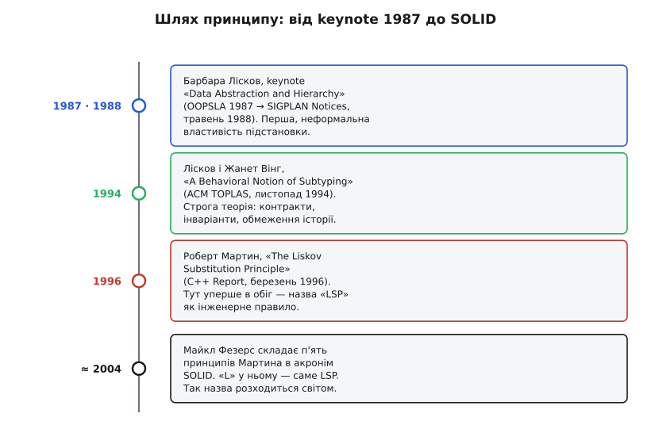
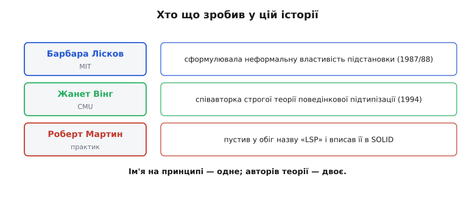

# 📜 Як принцип народився й дістав чуже — і не зовсім чесне — ім'я

Візьміть будь-який список принципів об'єктного проєктування — і серед п'яти літер SOLID неодмінно натрапите на «L»: принцип підстановки Лісков. Прізвище стоїть на ньому так упевнено, наче Барбара Лісков одного дня сіла й проголосила: «віднині зватися цьому — принцип підстановки Лісков». Насправді нічого схожого не було. Лісков ніколи не називала своєю ім'ям жодного принципу; строгу теорію, на яку цей принцип спирається, вона будувала не сама; а слова «принцип підстановки Лісков» пустив у широкий обіг зовсім інший чоловік — за роки після того, як сама ідея прозвучала. Ця вставка — про те, як за шість-сім років одна обережна фраза з наукового виступу перетворилася на залізне правило з чужим прізвищем на ньому, і чому це ім'я, хоч давно прижилося, трохи несправедливе.

Розказати це варто не заради історичної цікавинки. Коли розумієш, **звідки** взялося правило й **як** воно уточнювалося, перестаєш плутати дві дуже різні речі: обережну інтуїцію («тут хочеться чогось на кшталт…») і строгу теорію з передумовами, постумовами й інваріантами. Перше сказала одна людина 1987 року. Друге вони з колегою довели разом 1994-го. А звичне нам ім'я причепив третій — коли перетворював академічну ідею на щоденний інструмент інженера.

## Хто така Барбара Лісков і чому її слово важило

Щоб зрозуміти вагу того виступу, треба знати, хто його виголошував. **Барбара Лісков** (Barbara Liskov, уроджена Губерман — Huberman; народилася 7 листопада 1939 року) — американська вчена-обчислювач, одна з перших жінок у США зі ступенем доктора з інформатики. На момент, про який ідеться, за нею вже стояла робота, що зробила її класиком ще до всякого «принципу»: у 1970-х вона з командою в Массачусетському технологічному інституті (MIT) створила мову **CLU**, а в 1980-х — мову **Argus**. Саме в CLU вона довела до пуття ідею, без якої немислиме сучасне програмування, — **абстрактні типи даних** (abstract data types): думку, що тип варто описувати не тим, як він зроблений усередині, а тим, які операції він обіцяє й як вони поводяться. За ці внески — за проєктування мов і методологію, що вросла в об'єктне програмування, — Лісков 2008 року здобула **премію Тюрінга** (Turing Award), найвищу відзнаку в інформатиці; вона стала другою жінкою, яка її отримала.

> 🔧 **Навіщо це.** Ідея абстрактного типу — прямий предок принципу підстановки. Якщо тип — це набір обіцянок про поведінку операцій, а не купа полів, то природно постає наступне питання: коли один такий набір обіцянок можна вважати різновидом іншого? Лісков прийшла до підстановки не випадково — це логічне продовження справи всього її життя. Тому й слово її на цю тему важило: говорив не сторонній коментатор, а людина, що сама заклала спосіб думати про типи як про поведінку.

Тримаймо цей факт від самого початку, бо він розвіює перший міф: Лісков — **американська** вчена, і жодних імперських чи національних привласнень тут немає. Історія принципу — цілком західна, академічна, добре задокументована; єдина несправедливість у ній — не національна, а стосується співавторки, до якої ми ще дійдемо.

## Одна фраза 1987 року, з якої все почалося

Восени 1987 року в Орландо відбулася конференція **OOPSLA** (Object-Oriented Programming, Systems, Languages, and Applications) — головний тодішній форум об'єктного програмування. Лісков виголосила на ній програмну доповідь (keynote) із назвою «**Data Abstraction and Hierarchy**» («Абстракція даних та ієрархія»). Текст цієї доповіді опублікували наступного року — у травні 1988-го, у бюлетені **ACM SIGPLAN Notices** (том 23, число 5, сторінки 17–34). Ці дати варті точності, бо їх постійно змішують: **виступ — 1987, публікація — 1988**; обидві правдиві, просто про різні події.

Головне сталося в одному абзаці. Розмірковуючи, що мало б означати «`S` — підтип `T`», Лісков не проголосила закону — вона обережно сказала, що тут **хочеться чогось на кшталт** ось такої властивості:

```
What is wanted here is something like the following substitution
property: If for each object o1 of type S there is an object o2 of
type T such that for all programs P defined in terms of T, the
behavior of P is unchanged when o1 is substituted for o2, then S is
a subtype of T.
```

У перекладі, ближче до людської мови:

```
Тут хочеться чогось на кшталт такої властивості підстановки:
якщо для кожного об'єкта o1 типу S існує об'єкт o2 типу T такий, що
для всіх програм P, визначених через T, поведінка P НЕ ЗМІНЮЄТЬСЯ,
коли o1 підставити замість o2, — то S є підтипом T.
```

Придивімося до трьох слів, у яких сховано все майбутнє правило. **«Для всіх програм P»** — не для якоїсь конкретної, а взагалі для будь-якої; підтип мусить годитися скрізь, наосліп. **«Поведінка не змінюється»** — планка не «схожа поведінка» і не «ті самі методи», а саме незмінна: клієнт не повинен помітити підміни. І ключове застереження — **«something like»**, «щось на кшталт». Лісков не подавала це як докінчену теорему. Вона окреслювала **інтуїцію**, форму відповіді, напрям, у якому треба копати, — і сама чудово розуміла, що «щось на кшталт» ще належить довести до строгості.



*Шлях від обережної фрази до п'ятилітерного акроніма зайняв близько сімнадцяти років і трьох різних людей: одна сформулювала, двоє довели до строгості, третій дав ім'я й місце в списку.*

Ось перший урок цієї історії, і він методологічний, а не історичний. Те, що сьогодні друкують як строге «правило LSP», починалося як **чесно позначена здогадка**. Різниця величезна. Здогадка каже: «схоже, безпечна підстановка — це коли поведінка не змінюється; треба розібратися, що це точно означає». Правило вже мусить сказати, **як саме** перевірити цю незмінність, не ганяючи «всі можливі програми P» (бо ганяти їх насправді неможливо). Проміжок між здогадкою 1987-го й перевірним правилом — це якраз те, що ще належало пройти. І пройшли його вже вдвох.

## Чому «щось на кшталт» не могло лишитися здогадкою

Спробуймо на мить стати на місце того, хто 1988 року прочитав ту властивість і захотів нею **скористатися** в реальному коді. Він одразу впирається в стіну. «Для всіх програм P поведінка не змінюється» — прекрасно, але як це перевірити для конкретного `Square extends Rectangle`? Програм P — нескінченно; жодну реальну не перебереш. Означення істинне, але **неоперативне**: воно каже, що́ таке підтип, але не дає в руки способу пересвідчитися, чи маєш ти його перед собою.

Гірше того, у формулюванні є тиха пастка, яку в чистому вигляді видно не одразу. Що означає «поведінка P не змінюється», якщо в програмі два посилання дивляться на **той самий** об'єкт (те, що зветься аліасингом — aliasing)? Змінив стан через одне посилання — а спостерігаєш через друге; і тепер «незмінність поведінки» треба вміти визначити з урахуванням того, що об'єкт живе, поки на нього хтось дивиться збоку. Обережна фраза 1987-го цього шару не торкалася зовсім — не тому, що Лісков його не бачила, а тому, що keynote — це заклик і напрям, а не сторінки строгих означень.

Отже, здогадку треба було перетворити на щось із трьома властивостями: **перевірне** (щоб не перебирати нескінченні P), **точне** (щоб «підтип» мав однозначний зміст), і **чесне щодо аліасингу** (щоб працювало й тоді, коли на об'єкт дивляться кількома посиланнями). Це вже не робота одного keynote. Це окрема, велика теоретична праця — і Лісков зробила її не сама.

## Двоє за однією теорією: Лісков і Вінг, 1994

Тут на сцену виходить друга — і незаслужено затінена — головна дійова особа. **Жанет Вінг** (Jeannette Wing, повне ім'я Jeannette Marie Wing; народилася 4 грудня 1956 року в Ньюарку, штат Нью-Джерсі) — американська вчена-обчислювач, докторка з інформатики MIT (1983), яка з 1985 року працювала в **Університеті Карнеґі — Меллона** (Carnegie Mellon University, CMU) і згодом стала однією з найвпливовіших постатей галузі — зокрема тим, що 2006 року ввела в широкий обіг поняття «обчислювальне мислення» (computational thinking). Саме з нею Лісков і взялася перетворити «щось на кшталт» на строгу теорію.

Результат — стаття «**A Behavioral Notion of Subtyping**» («Поведінкове поняття підтипу»), опублікована в листопаді 1994 року в поважному журналі **ACM Transactions on Programming Languages and Systems** (ACM TOPLAS, том 16, число 6, сторінки 1811–1841). Автори — обидві: Barbara H. Liskov (MIT) і Jeannette M. Wing (CMU). І це не почесне співавторство «за пораду»: строгий апарат, яким сьогодні перевіряють підстановку, — спільна їхня побудова. Вони прямо взяли позицію, що відношення підтипу мусить гарантувати: **будь-яка властивість, доведена про об'єкти надтипу, залишається істинною й для об'єктів підтипу**. Це та сама інтуїція 1987-го — але тепер із механізмом, як її забезпечити.

Механізм — той, що ми знаємо як **правило контракту**. Замість переганяти нескінченні програми P, Лісков і Вінг звели перевірку до контрактів кожного методу окремо:

```
передумову (precondition)  — підтип може лише ПОСЛАБИТИ (вимагати не більше)
постумову  (postcondition) — підтип може лише ПОСИЛИТИ  (обіцяти не менше)
інваріант  (invariant)     — підтип мусить ЗБЕРЕГТИ
```

А ще вони закрили ту саму пастку з аліасингом. Їхнім ключовим внеском поверх усього попереднього стало **обмеження історії** (history constraint): правило про те, як об'єктові дозволено змінюватися з часом, щоб підтип не міг за спиною клієнта переписати те, що клієнт мав за незмінне, — навіть коли той самий об'єкт видно кількома посиланнями. Саме історія-обмеження й робить теорію чесною там, де наївне «поведінка P не змінюється» починало текти.

> 🔧 **Навіщо це.** Ось чому інженерно точна назва цій ідеї — не «підстановка Лісков», а **поведінкова підтипізація** (behavioral subtyping): це термін із заголовка спільної статті 1994-го. Коли на код-рев'ю ви перевіряєте перевизначений метод трьома питаннями — «чи не вимагає більше? чи не обіцяє менше? чи не зламав інваріанта?» — ви користуєтеся не інтуїцією одного keynote, а строгим апаратом, який Лісков і Вінг збудували **разом**. Ім'я на щоденному правилі згадує одну авторку; сам апарат написали двоє.

## Хто ж причепив прізвище: Роберт Мартин і SOLID

Дотепер у нашій історії прізвища «Лісков» на жодному «принципі» немає. Є keynote Лісков (1987/88) і є спільна теорія Лісков і Вінг (1994). Слова «**принцип підстановки Лісков**» тут ще ніхто не вимовляв. Їх приніс третій.

**Роберт Сесіл Мартин** (Robert C. Martin, широко знаний як «Uncle Bob») — американський інженер і популяризатор, який у середині 1990-х вів у журналі **C++ Report** колонку «Engineering Notebook» (Інженерний записник), де перекладав академічні ідеї на мову практика. У березні 1996 року вийшла його стаття з промовистою назвою — «**The Liskov Substitution Principle**» (їй передувала січнева колонка того ж року про принцип відкритості-закритості). Саме тут — не в Лісков, не у Вінг, а в популяризатора — назва «принцип підстановки Лісков» уперше зазвучала як **ім'я правила для інженерів**. Мартин узяв строгу ідею й переказав її як практичну настанову проєктувальника: спадкуй так, щоб нащадка справді можна було підставити замість предка, не ламаючи клієнта.

А далі спрацював маркетинг гарного акроніма. Мартин зібрав кілька своїх настанов у набір принципів об'єктного проєктування; близько 2004 року інший інженер, **Майкл Фезерс** (Michael Feathers), помітив, що початкові літери п'яти з них складаються в запам'ятовне слово — **SOLID**. Так «принцип підстановки Лісков» дістав не лише ім'я, а й тверде місце в списку, який відтоді цитують у кожному другому підручнику:

```
S — Single Responsibility  (єдиної відповідальності)
O — Open–Closed            (відкритості-закритості)
L — Liskov Substitution    ← сюди Лісков і потрапила прізвищем
I — Interface Segregation  (розділення інтерфейсів)
D — Dependency Inversion   (інверсії залежностей)
```

Це типова доля хорошої ідеї в техніці. Один її **сформулював** (Лісков, як інтуїцію). Двоє **довели до строгості** (Лісков і Вінг, як теорію). Третій дав **ім'я й місце в каноні** (Мартин, як правило SOLID). Кожен крок — справжній внесок, і жоден із них поодинці не дав би того, що маємо: без keynote не було б інтуїції, без статті 1994-го — строгості, без Мартина й акроніма — того, що правило знає кожен джуніор. Але зауважте, як ім'я на кінцевому продукті згадує лише **першу** ланку — і то не повністю.

## Чому назва трохи несправедлива

Тепер зберімо докупи, у чому саме несправедливість, — акуратно, без перегинів у жоден бік.

Несправедливість **не** в тому, що ім'я Лісков тут узагалі стоїть: обережну властивість підстановки справді сформулювала вона, і це її законна заслуга. І **не** в якомусь національному привласненні: обидві — американські вчені, історія добре задокументована. Несправедливість тонша й стосується **співавторки**. Строгу теорію, без якої «підстановка» лишилася б неперевірною здогадкою, Лісков будувала **разом із Жанет Вінг** — це прямо видно з того, що стаття 1994 року має двох авторок, а не одну. Проте щоденна назва — «принцип підстановки **Лісков**» — Вінг не згадує зовсім. Практик, що вимовляє «LSP» сто разів на рік, здебільшого й не підозрює, що половину теорії, якою він користується, написала друга людина.

Показово, що найтверезіше про це говорить **сама Лісков**. За її власними поясненнями, у keynote вона дала лише **неформальне правило**, інтуїцію; а те, що це означає **точно**, вони з Вінг з'ясовували вже потім, разом, — і саме та спільна робота дала поведінкову підтипізацію. Тобто авторка, чиїм ім'ям назвали принцип, першою й наголошує, що строга частина — спільна, а не її одноосібна. Це рідкісний і чесний штрих: людина, яку історія возвеличила, сама вказує на співавторку, яку історія оминула.



*Ім'я на принципі — одне; авторів теорії, на яку він спирається, — двоє. Обережна фраза, строгий апарат і зручна назва прийшли від трьох різних людей.*

Є в цій історії й друга, дрібніша несправедливість — уже не до людини, а до самої **точності**. Строго кажучи, ідея, якою користуються інженери, — це **поведінкова підтипізація** (термін Лісков і Вінг), а «принцип підстановки Лісков» — її популярний, дещо спрощений переказ. Дехто з фахівців тому й називає звичну назву не зовсім вдалою: keynote-формулювання «поведінка не змінюється» надто суворе (адже підтип часто ставлять **саме щоб** поведінку змінити — просто в межах контракту), а слово «підстановка» без згадки про контракти легко штовхає читача звіряти реалізації замість специфікацій. Це не привід перейменовувати усталене — «LSP» уже намертво в мові галузі. Це радше нагадування: за зручним ярликом стоїть точніше й багатше поняття, і хто хоче міркувати строго, тому варто знати обидва.

## Що з усього цього забрати

Складімо нитку від початку до кінця, бо в ній — не просто дати, а спосіб не плутати різні речі під одним ярликом.

Восени 1987-го Барбара Лісков у програмній доповіді на OOPSLA обережно сказала, що безпечний підтип — це, «щось на кшталт», коли жодна програма не помічає підміни об'єкта; текст вийшов у SIGPLAN Notices у травні 1988-го. Це була **інтуїція**, чесно позначена як «something like». У листопаді 1994-го Лісков **разом із Жанет Вінг** у статті «A Behavioral Notion of Subtyping» (ACM TOPLAS) перетворила цю інтуїцію на **строгу, перевірну теорію** — з передумовами, постумовами, інваріантами й обмеженням історії, що закрило пастку аліасингу. А в березні 1996-го Роберт Мартин у колонці C++ Report назвав практичне правило «принципом підстановки Лісков» і згодом уписав його — під літерою «L» — в акронім SOLID, який близько 2004-го оформив Майкл Фезерс.

Статус усіх цих тверджень — **усталений факт**: дати, назви, венью й авторства підтверджені першоджерелами (тексти keynote 1988-го й статті 1994-го, колонка Мартина 1996-го). Єдине, що варто тримати не як факт, а як **зважену оцінку фахівців**, — це що звична назва трохи несправедлива: до співавторки Вінг, чиєї частки теорії ім'я не згадує, і до точності, бо строгіше ім'я цій ідеї — «поведінкова підтипізація».

І головний, наскрізний урок — не про історію, а про те, як читати будь-яке «залізне правило» у програмуванні. За коротким ярликом майже завжди стоїть довший шлях: чиясь обережна здогадка, чиясь строга праця (нерідко кількох людей), чийсь вдалий переказ, що й прижився. Знати цей шлях корисно суто практично — бо тоді ви користуєтеся не заклинанням «так велить LSP», а розумієте, **що саме** перевіряєте, **чому** воно так, і де кінчається інтуїція keynote, а починається строгий контракт, який хтось мусив довести до пуття. У випадку принципу підстановки цих «хтось» було двоє — і про другу з них варто пам'ятати щоразу, коли вимовляєте перше прізвище.
