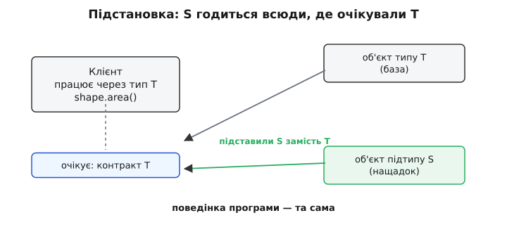
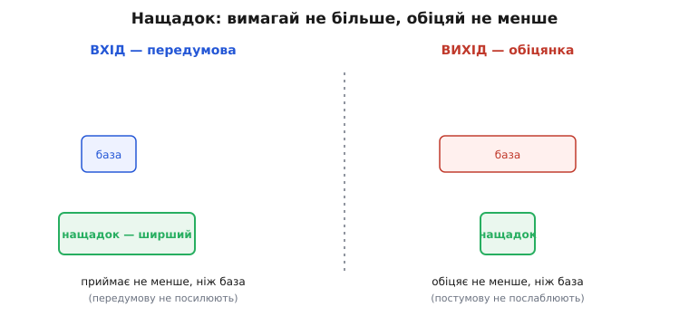

# Принцип підстановки Лісков (LSP)

<preknowlist>
- [Інтерфейс проти реалізації](book:programming/interface-vs-implementation) — контракт (що обіцяно) окремо від того, як його виконано; клієнт бачить лише контракт.
- [Поліморфізм](book:programming/polymorphism) — один виклик через спільний тип дає різну поведінку залежно від конкретного об'єкта за ним.
- [Проєктування за контрактом](book:programming/design-by-contract) — метод із передумовами (що клієнт мусить забезпечити), постумовами (що метод гарантує) та інваріантами (що завжди істинне про об'єкт).
- [Композиція над спадкуванням](book:programming/composition-inheritance) — коли «є різновидом» бере на себе більше, ніж може виконати, і чому спадкування — не безкоштовне.
</preknowlist>

Ти пишеш функцію, що рахує рахунок за паркування:

```ts
function totalArea(shapes: Rectangle[]): number {
  let sum = 0;
  for (const r of shapes) {
    r.setWidth(10);
    r.setHeight(5);
    sum += r.area();          // впевнений, що тут 50
  }
  return sum;
}
```

Ти впевнений у цьому `50`, бо прямокутник — це прямокутник: задав ширину 10, висоту 5, площа 50. Функцію перевірено, вона в проді рік. Аж тут хтось додає в систему `Square` (квадрат) — і, звісно, «квадрат — це різновид прямокутника», тож успадковує його. Але квадрат мусить тримати сторони рівними, тому в нього `setWidth` тихенько підправляє й висоту, а `setHeight` — ширину. Твоя функція отримує масив, де один елемент — квадрат. Задаєш ширину 10 (висота стає 10), задаєш висоту 5 (ширина стає 5), площа — `25`. Твій рік-перевірений код раптом бреше, і ти навіть не редагував його жодним символом.

Придивися, що зламалося. Не код — **обіцянка**. Ти писав `totalArea`, спираючись на те, що знаєш про прямокутник. Хтось підсунув під тип `Rectangle` об'єкт, який виглядає як прямокутник, компілюється як прямокутник, але **поводиться інакше**. Принцип підстановки Лісков (англ. *Liskov Substitution Principle*, LSP) — це якраз про те, коли така підстановка безпечна, а коли вона — міна сповільненої дії.

## Що насправді означає «різновид»

Барбара Лісков сформулювала суть однією властивістю ще 1987 року. У перекладі на людську мову вона звучить так:

> Якщо `S` — підтип `T`, то об'єкти типу `T` у програмі **можна замінити** об'єктами типу `S`, **не зламавши жодної властивості цієї програми**.

Ключове слово — **замінити непомітно**. Не «квадрат схожий на прямокутник» і не «квадрат має ті самі методи». А сильніше: будь-який код, написаний під `Rectangle`, мусить працювати **так само правильно**, коли йому дати `Square`, — і не знати про підміну. Якщо код це помічає (площа стала не тою, метод раптом кинув виняток, результат поза очікуваним) — `Square` **не є** підтипом `Rectangle` у сенсі Лісков, хай навіть компілятор радо це проковтнув.



*Підтип годиться скрізь, де очікували базу: клієнт не мусить помітити підміни.*

Ось чому «квадрат є прямокутником» з шкільної геометрії — пастка в коді. У геометрії це правда про **фігури**. У коді `Rectangle` — це не фігура, це **набір обіцянок про поведінку**: «`setWidth` міняє тільки ширину», «після `setWidth(w); setHeight(h)` площа дорівнює `w·h`». Квадрат цих обіцянок дотримати не може, бо його власна обіцянка (сторони рівні) з ними конфліктує. Тому в коді квадрат **не** різновид прямокутника — це інша істота, яка лише позичила знайому назву.

> 🔧 **Навіщо це.** LSP — це та причина, чому інколи правильна відповідь на «зроби `B` нащадком `A`, вони ж схожі» — тверде «ні». Спадкування каже компілятору: «`B` можна підставляти всюди замість `A`». Якщо це неправда для поведінки, ти щойно розсипав по всій кодовій базі приховані пастки, які компілятор не ловить, а тести ловлять лише там, куди хтось здогадався підсунути `B`. Порушений LSP — це не стильова хиба, це баги, що чекають своєї підстановки.

## Підтип за формою і підтип за поведінкою

Тут корисно розділити дві різні речі, які в коді легко сплутати.

**Підтип за формою** (структурний) — це коли в `S` є всі методи `T` із тими самими сигнатурами. Компілятор перевіряє саме це: чи є метод `area()`, чи повертає `number`, чи приймає потрібні аргументи. `Square extends Rectangle` цей іспит складає з першої спроби — усі методи на місці.

**Підтип за поведінкою** — це коли `S` не лише має ті методи, а й **виконує їхні обіцянки** так, що клієнт не постраждає. Оцього компілятор перевірити не може: він бачить сигнатуру `setWidth(w: number): void`, але не бачить, що всередині квадрат нишком крутить і висоту. Саме поведінкову підтипізацію й вимагає LSP — форми замало. [Формальний бік цієї відмінності — поведінкова підтипізація (behavioral subtyping)](book:programming/behavioral-subtyping) розроблено як окрему теорію; LSP — її щоденне, інженерне обличчя.

Різницю видно на одному рядку. Компілятор пропускає:

```ts
const r: Rectangle = new Square();   // форма збігається — ок
```

а програма ламається пізніше, коли хтось через це `r` викличе `setWidth`. Проміжок між «скомпілювалося» і «зламалося» — це рівно проміжок між підтипом за формою й підтипом за поведінкою. LSP закриває цей проміжок.

## Правило контракту: вимагай не більше, обіцяй не менше

Як же перевірити, чи `S` — чесний підтип `T`, не ганяючи всі можливі програми? Барбара Лісков разом із Жанет Вінг (Jeannette Wing) 1994 року звели це до перевірки **контрактів** кожного методу. Контракт — це три речі: **передумова** (що клієнт мусить забезпечити перед викликом), **постумова** (що метод гарантує на виході) та **інваріант** (що завжди істинне про об'єкт). [Як це поняття зросло — від контрактів Меєра до контрактів на спадкуванні](book:programming/design-by-contract) — окрема тема; тут беремо його як інструмент.

Коли нащадок перевизначає метод, він може змінити контракт — але **лише в один бік**, щоб не підвести клієнта, який писав під контракт бази:

```
передумову   — можна тільки ПОСЛАБИТИ (приймати не менше входів)
постумову    — можна тільки ПОСИЛИТИ  (гарантувати не менше)
інваріант    — треба ЗБЕРЕГТИ          (усі інваріанти бази лишаються)
```

Чому саме так? Стань на місце клієнта. Він писав код під базу: забезпечував рівно те, що вимагала **її** передумова, і розраховував рівно на те, що обіцяла **її** постумова.

Якщо нащадок **посилить передумову** (вимагатиме більше — скажімо, база брала будь-яке число, а нащадок лише додатні), клієнт про це не знає й спокійно передасть `-5`, як завжди робив. Нащадок вдавиться. Тому передумову вільно **послабити** (нащадок терпить усе, що терпіла база, і ще трохи), але **не посилити**.

Дзеркально з постумовою. Клієнт розраховує на все, що обіцяла база (скажімо, «поверну відсортований непорожній список»). Якщо нащадок **послабить** обіцянку (поверне іноді порожній), клієнт, що покладався на непорожність, зламається. Тому постумову вільно **посилити** (пообіцяти більше), але **не послабити**.



*Вхід нащадка накриває вхід бази або ширший; вихід нащадка — такий самий або точніший. Перевернеш будь-яку зі стрілок — клієнт бази ламається.*

Ось тепер видно, **чому** квадрат провалив тест точно. Постумова `Rectangle.setWidth(w)` — «ширина стала `w`, **висота не змінилася**». Квадрат цю постумову **послабив**: у нього висота таки змінилася. Послаблена постумова → клієнт, що розраховував на незмінну висоту, зламався. LSP порушено не «на відчуття», а за конкретним правилом.

> 🔧 **Навіщо це.** Ці три рядки — практичний чекліст на код-рев'ю. Бачиш перевизначений метод — не читай усю реалізацію, спитай три речі: чи не вимагає нащадок від клієнта **більше**, ніж база? Чи не обіцяє **менше**? Чи не зламав жодного інваріанта бази? Три «ні» — підстановка безпечна. Хоч одне «так» — перед тобою прихована пастка, і краще її видно тут, ніж у проді. [Точні формулювання цих правил разом із контра- й коваріантністю сигнатур](book:programming/liskov-substitution/math-contract-rules.md) — окремо, коли треба строго.

## Класична пастка: кидати виняток замість роботи

Найчастіше LSP порушують не хитрою логікою, як у квадраті, а найгрубішим способом — метод, який мусить працювати, натомість **кидає виняток** «а мені не можна». Це видно на колекціях.

Уяви ієрархію: базовий тип `List` уміє і читати, і додавати. Комусь потрібен незмінний список — і його роблять нащадком `List`, а метод `add` перевизначають так, щоб він обурювався:

:::tabs
```ts
class List<T> {
  protected items: T[] = [];
  get(i: number): T { return this.items[i]; }
  add(x: T): void { this.items.push(x); }
}

// «Незмінний список — це ж різновид списка?» — і тут пастка:
class ImmutableList<T> extends List<T> {
  add(_x: T): void {
    throw new Error("не можна: список незмінний");   // посилив передумову
  }
}

// Клієнт, написаний чесно під List, ламається:
function fill(list: List<number>): void {
  for (let i = 0; i < 3; i++) list.add(i);   // на ImmutableList — вибух
}
```
```python
class List:
    def __init__(self):
        self._items = []
    def get(self, i):
        return self._items[i]
    def add(self, x):
        self._items.append(x)

# «Незмінний список — це ж різновид списка?» — і тут пастка:
class ImmutableList(List):
    def add(self, x):
        raise TypeError("не можна: список незмінний")   # посилив передумову

# Клієнт, написаний чесно під List, ламається:
def fill(lst: List) -> None:
    for i in range(3):
        lst.add(i)      # на ImmutableList — вибух
```
:::

`ImmutableList` **посилив передумову** `add` до неможливого: «викликай мене лише тоді, коли ніколи». Клієнт `fill`, що писав під `List`, про це не знає й падає. За правилом контракту це чисте порушення — і воно типове: щоразу, коли нащадок реалізує метод базового типу через «кинути виняток / нічого не зробити / повернути заглушку», він майже напевно ламає LSP.

Показовий момент: тут проблема **не в незмінності**. Незмінний список — цілком корисна річ. Проблема в **брехливій ієрархії**: `ImmutableList` оголосив себе різновидом `List`, хоч не вміє того, що `List` обіцяє всім. Лікування — не латати `add`, а **перебудувати типи так, щоб брехня стала неможливою**: виділити те, що вміє лише читати, окремим типом, а вміння додавати — надбудувати над ним:

:::tabs
```ts
interface ReadableList<T> {          // чесний мінімум: тільки читання
  get(i: number): T;
  size(): number;
}

interface MutableList<T> extends ReadableList<T> {
  add(x: T): void;                   // додавання — окрема, ширша обіцянка
}

// Тепер fill вимагає рівно те, що йому треба, — і Immutable сюди НЕ підставиш:
function fill(list: MutableList<number>): void {
  for (let i = 0; i < 3; i++) list.add(i);
}
```
```python
from typing import Protocol

class ReadableList(Protocol):        # чесний мінімум: тільки читання
    def get(self, i: int): ...
    def size(self) -> int: ...

class MutableList(ReadableList, Protocol):
    def add(self, x) -> None: ...    # додавання — окрема, ширша обіцянка

# Тепер fill вимагає рівно те, що йому треба, — і незмінний сюди НЕ підставиш:
def fill(lst: MutableList) -> None:
    for i in range(lst.size()):
        lst.add(i)
```
:::

Тепер незмінний список реалізує лише `ReadableList` і **фізично не може** потрапити туди, де чекають `add`, — компілятор не пустить. LSP не порушено, бо ніхто вже й не обіцяє те, чого не виконує. [Повний робочий приклад цього рефакторингу з тестами й розбором, як розділення інтерфейсів зробило порушення неможливим](book:programming/liskov-substitution/proj-collection-substitution.md) — окремо, з кодом крок за кроком.

Це та сама думка, що стоїть за [принципом розділення інтерфейсів](book:programming/interface-segregation): не змушуй тип обіцяти більше, ніж він уміє. LSP і ISP тут двоє з одного — тонкий, чесний інтерфейс складніше порушити підстановкою, бо він майже нічого й не обіцяє понад те, що всі його реалізації справді роблять.

## Коли навіть мова вас зраджує: коваріантні масиви

Порушити LSP можна не лише руками — інколи це вшито в саму мову. Хрестоматійний приклад — **коваріантні масиви** в Java (те саме є в C#). Java дозволяє вважати `String[]` підтипом `Object[]`: масив рядків можна передати туди, де чекають масив об'єктів. Виглядає розумно — рядок же є об'єктом. Але масив **можна не лише читати, а й писати**, і саме на записі підстановка розсипається:

```java
String[] names = { "Ada", "Grace" };
Object[] objs  = names;        // дозволено: String[] «є» Object[]
objs[0] = Integer.valueOf(42); // компілюється! але — ArrayStoreException під час виконання
```

Компілятор пропускає `objs[0] = 42`, бо через тип `Object[]` записати `Integer` цілком законно. Та за посиланням `objs` ховається справжній `String[]`, який відмовляється тримати `Integer`, — і виконавче середовище кидає `ArrayStoreException`. Це LSP-порушення у чистому вигляді: `String[]` **не** повноцінний підтип `Object[]`, бо в операції запису поводиться інакше (звужує дозволений вхід), — а мова все одно оголосила його підтипом.

Чому так вийшло? Розробники ранньої Java (1990-ті, ще без узагальнених типів — *generics*) свідомо пішли на цей компроміс, щоб можна було писати спільний код над масивами будь-чого. Ціну — приховане порушення LSP, яке ловиться аж під час виконання, — вони заплатили знаючи. Коли пізніше додали узагальнені типи, `List<String>` уже зробили **не**-підтипом `List<Object>` саме щоб такого не повторити: там правило варіантності вбудували в систему типів як слід.

> 🔧 **Навіщо це.** Мораль не «Java погана», а глибша: **підстановка й зміна разом небезпечні**. Якби масив був лише для читання, `String[]` як `Object[]` не створював би жодної проблеми — читати рядок як об'єкт завжди безпечно. Ламає все саме **запис** — операція, що звужує допустимий вхід у нащадку. Тому LSP і [незмінність](book:programming/immutability) — близькі спільники: незмінні типи порушити підстановкою куди важче, бо в них немає тих самих операцій-запису, на яких контракт розходиться.

## Де LSP стоїть серед інших принципів

LSP — не самотнє правило, це той цемент, без якого не тримаються сусідні.

Найтісніше — з [принципом відкритості-закритості](book:programming/open-closed). OCP каже: клієнт спирається на абстракцію, а нові реалізації прибудовуються знизу, не чіпаючи клієнта. Але це працює **лише якщо** кожна нова реалізація чесно підставляється замість абстракції — тобто **лише якщо тримається LSP**. Порушив підстановку — і «закритий» клієнт усе одно доведеться правити під норовливого нащадка, весь виграш OCP розсипався. LSP — це та умова, за якої OCP взагалі має сенс: [сам OCP](book:programming/open-closed) мовчазно **припускає** підставність, яку гарантує саме LSP.

Звідси ж і зв'язок зі спадкуванням. Класичне «надавай перевагу [композиції над спадкуванням](book:programming/composition-inheritance)» — це багато в чому практична порада **не наражатися на LSP**. Спадкування нав'язує обіцянку підставності на весь публічний контракт бази; композиція дозволяє взяти в чужого об'єкта лише те, що справді потрібно, нічого зайвого не обіцяючи. Тому квадрат-прямокутник лікують не хитрішою ієрархією, а тим, що **не роблять** квадрат нащадком прямокутника — тримають обидва окремими типами, а спільне (якщо треба) виносять у чесний інтерфейс на кшталт «фігура, що має площу».

І врешті, звідки взялося саме прізвище «Лісков» на цьому принципі — окрема, цікава історія: сама Барбара Лісков сформулювала властивість підстановки, строгу теорію поведінкової підтипізації вона побудувала разом із Жанет Вінг, а звичну нам назву «принцип підстановки Лісков» уже потім пустив у широкий обіг Роберт Мартин. [Як ідея народжувалася й діставала ім'я — від keynote 1987 року до SOLID](book:programming/liskov-substitution/hist-liskov-wing.md) — варта окремої розповіді, зокрема тому, що назва трохи несправедлива до співавторки.
