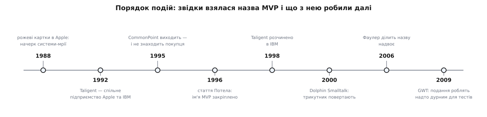
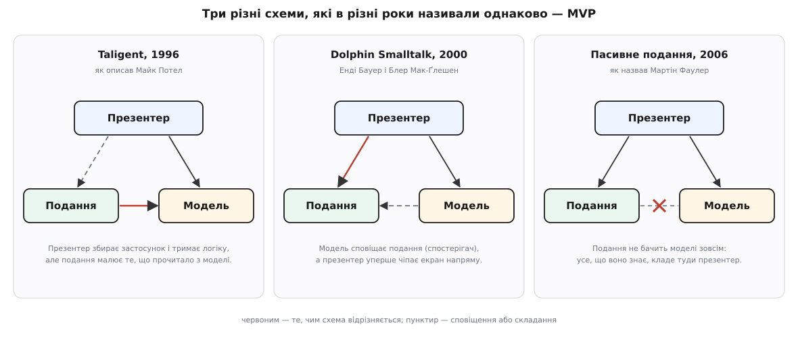

# 📜 Історія MVP: як три літери двічі змінили значення

Абревіатура MVP з'явилася 1996 року в компанії, яку розпустять уже за півтора року, — і означала тоді не те, що означає тепер: у первісному MVP подання спокійно читало модель само. Далі — хто, коли й навіщо перекладав ці літери по-своєму: інженери Taligent, які шукали одну схему для C++ і Java; смолтокери з Object Arts, які повернули трикутник; і Мартін Фаулер (Martin Fowler), який 2006 року вирішив, що назву час розібрати на дві. Знати це варто з дуже практичної причини: суперечності між книжками про MVP — не помилки авторів, а три різні схеми під одним ім'ям.


*Порядок подій, а не шкала часу: між 1995-м і 1996-м минув рік, між 2000-м і 2006-м — шість, але для розповіді важлива черга, а не відстань.*

## Компанія, яка продавала не програми, а каркаси

Почалося все не з патерну, а з корпоративної ставки. Наприкінці 1980-х в Apple сперечалися, куди рухати системне програмне забезпечення, і на одній із нарад 1988 року ідеї просто розписали на картках і поприколювали до стіни двома купками: сині — те, що можна доростити до наявної системи Macintosh, рожеві — те, що вимагає системи-мрії з нуля. Рожева купка й дала проєктові ім'я — Pink.

Систему-мрію самотужки не витягти, тож 1992 року Apple та IBM оформили спільне підприємство — Taligent; на початку 1994-го третім великим інвестором і партнером став Hewlett-Packard. Операційна система з тієї затії так і не вийшла: те, що встигли зробити, перепакували в CommonPoint — шар із понад сотні каркасів, що лягав поверх чужих ОС (AIX, HP-UX, OS/2, Windows NT) і вийшов 1995 року. Покупця він не знайшов.

Але сама природа товару поставила перед інженерами питання, якого не постає перед автором звичайної програми. Бібліотеку ти кличеш, коли схочеш; каркас (фреймворк) навпаки — кличе твій код сам, у наперед визначених місцях, тож ці місця треба **назвати заздалегідь**, інакше покупець просто не знатиме, від чого успадковуватися ([каркас проти бібліотеки](topic:programming/framework-vs-library) — про цю різницю в напрямку виклику й ціну, яку за неї платять). Продаючи сотню каркасів, Taligent мусив спершу дати відповідь: із яких же частин складається інтерактивна програма?

Відповідь на це вже була — [MVC](topic:programming/mvc), схема зі Smalltalk, яку в Xerox PARC 1978–79 років придумав норвезький інформатик Трюґве Реенскауґ (Trygve Reenskaug): модель знає дані, подання малює, контролер ловить жести. Тільки в Smalltalk ця трійця описувала **один віджет** — прапорець, поле вводу, — а зі складніших віджетів складали діалог, із діалогів — програму. Taligent потрібна була та сама розкладка, але на цілий застосунок, розмазаний по сотні каркасів, — та ще й однакова у двох мовах одразу.

## Шість питань замість трьох ролей

1996 року Майк Потел (Mike Potel), віцепрезидент і технічний директор Taligent, виклав відповідь у статті «MVP: Model-View-Presenter — The Taligent Programming Model for C++ and Java». На той момент Taligent уже був повністю власністю IBM (частина джерел датує це рішення груднем 1995-го, сама стаття — початком 1996-го), і в першому ж абзаці MVP названо узагальненням класичного MVC зі Smalltalk.

Спосіб, у який Потел до цього йде, вартий уваги не менше за результат. Він описує не класи, а **питання, на які програміст мусить відповісти**, — і кожна відповідь виявляється окремою частиною програми. Перший розріз проходить між даними й екраном: «як я даю раду своїм даним?» проти «як користувач працює з моїми даними?». Потім кожна половина розпадається ще на три.

```
Керування даними — «як я даю раду своїм даним?»
  1. Що це за дані?                      → модель       (Model)
  2. Як указати частину даних?           → вибірки      (Selections)
  3. Як я змінюю дані?                   → команди      (Commands)

Інтерфейс — «як користувач працює з моїми даними?»
  4. Як я показую дані?                  → подання      (View)
  5. Як подія обертається зміною даних?  → інтерактори  (Interactors)
  6. Як це все скласти докупи?           → презентер    (Presenter)
```

Дві середні відповіді сьогодні майже забуті, а тоді несли головну вагу. **Вибірка** — це спосіб указати частину даних: стовпчик на діаграмі, рядок таблиці, шматок тексту під мишею; навіть точку вставки Потел вважає вибіркою нульової довжини. **[Команда](topic:programming/command)** — операція над вибіркою, загорнута в об'єкт із трьома методами: зроби, відкоти, повтори. З цієї однієї деталі випливає одразу багато: якщо кожна дія — окремий об'єкт, з'являється багаторівневе скасування, дії можна записати й програти пізніше, а можна й розіслати мережею на другу машину — і двоє людей рахуватимуть на одному калькуляторі разом.

**Інтерактори** — те, що ловить дію користувача: рух і клацання мишею, пункт меню, гарячу клавішу; Потел свідомо додає сюди й перемикач, і поворотну ручку, і вставлений диск, і перо з голосом.

А шосте питання — «як це все скласти докупи?» — і є презентер. Потел прямо каже, чим той є: класичним контролером зі Smalltalk, піднятим на рівень цілого застосунку. Презентер створює моделі, вибірки, команди, подання й інтерактори, зв'язує їх між собою й тримає ту логіку, що вирішує, чому й коли статися, — Потел порівнює його з регулювальником на перехресті або диригентом оркестру. Буквально це та частина програми, яку в старих підручниках звали `main` і [циклом подій](topic:programming/event-loop) — з тією різницею, що успадковується вона з каркаса разом із запуском, виходом, меню й вікнами.

```cpp
// Основи MVP в Open Class: розробник успадковує кожну й перекриває методи.
// (реконструкція за схемою класів зі статті 1996 року)

class IMyModel : public IModel {                        // 1. що це за дані?
public:
    void  setData(const IData& d);
    IData getData() const;
private:
    IData myData;
};

class IMySelection : public ISelection {                // 2. як указати частину даних?
public:
    void highlightSelection();
};

class IMyModelCommand : public ICommandOn<ISelection> { // 3. як я змінюю дані?
public:
    void doCommand();
    void undoCommand();
    void redoCommand();
private:
    IData myOldData;                                    // щоб було чим вернути назад
};

class IMyView : public IView {                          // 4. як я показую дані?
public:
    void drawContents();                                // малює те, що САМЕ взяло: getData()
};

// 5. інтерактори здебільшого не пишуть: беруть готовий IMenuInteractor
//    і прив'язують пункт меню до команди — addMenuItemAndCommand()

class IMyPresenter : public IPresenter {                // 6. як це все скласти докупи?
public:
    void createView();                                  // творить модель, вибірки, команди, подання
};
```

## Чому саме C++ і Java

Пара мов у назві статті — не примха, а точний знімок моменту. Основний товар IBM для розробників звався Open Class і був бібліотекою класів C++ для середовища VisualAge; Java тим часом була геть нова — перший JDK вийшов у січні 1996-го, — але вже було ясно, що вона наступна. Продавати два різні способи думати про програму — значить двічі вчити тих самих людей, тож обіцянка звучала так: **одна понятійна модель на всі великі об'єктні середовища IBM**. Реалізацій планувалося дві — повна для C++ в Open Class 4.0 і дуже легка для будь-якого стандартного середовища Java.

Ця сама двомовність пояснює, чому MVP вийшов таким широким. Це не патерн про віджети, а модель **розкрою застосунку**, тож у статті є й сьоме питання: як поділити програму між клієнтом і сервером? Далі Потел показує, що майже всі відомі на той час архітектури — це просто різні місця розрізу. Сама модель на сервері — файловий сервер чи об'єктна база. Модель і вибірки — реляційна база (`SELECT` — це ж і є вибірка). Модель, вибірки й команди — сервер збережених процедур або транзакцій. Саме лише подання на клієнті — німий термінал чи X-сервер. А подання з інтерактором на клієнті, коли все інше на сервері, — це, пише він 1996 року, і є звичайний вебзастосунок: подання — сторінка HTML, інтерактор — миша, що клацає посилання й кнопки форми.

Далі історія робить різкий поворот. Компонентний рушій CommonPoint, як визнає та сама стаття, на той час уже покинули; у січні 1998-го Taligent розчинили в IBM остаточно. Найдовговічнішим набутком компанії виявився не MVP: група тексту й інтернаціоналізації під орудою Марка Девіса (Mark Davis) сиділа за сотню метрів від підрозділу JavaSoft у Купертіно, і IBM домовилася передати її класи Sun. Так у JDK 1.1 з'явилася робота з мовами, календарями й форматами чисел, а з того самого коду згодом виросла бібліотека ICU, жива й донині. Каркасів, задля яких вигадали три літери, немає вже понад чверть століття. Літери лишилися.

## Подання, яке дивилося в модель

І тут — головна несподіванка для всіх, хто знає MVP за сучасними описами. Зазирнімо в схему класів зі статті. `IMyView` перекриває `drawContents`, щоб намалювати `myData`, — і бере ці дані **сам**, викликом `getData()` на моделі. Та сама стрілка від подання до моделі, задля відрізання якої MVP сьогодні й згадують, у первісному MVP спокійно собі стоїть на місці.

Про зворотний хід — щоб презентер сам розкладав значення по віджетах — Потел не пише взагалі; це через десять років окремо відзначить Фаулер. Презентер 1996 року — не той, хто штовхає цифри в поля. Це хребет застосунку: складач, власник циклу подій і місце для логіки, що не належить ні даним, ні екрану.

Тобто той, хто перший написав «MVP — це коли подання сліпе, а презентер розкладає все власноруч», цитував не Потела.

## Дельфіни повертають трикутник на 60°

Taligent не стало 1998-го, а вже 2000-го назва спливла в геть іншому світі — у Smalltalk. Енді Бауер (Andy Bower) і Блер Мак-Ґлешен (Blair McGlashan) із компанії Object Arts робили Dolphin Smalltalk і йшли до MVP навпомацки, знизу. Спершу вони збудували каркас навколо готових віджетів у дусі Visual Basic — і вперлися в те, що віджети надто грубі: у Smalltalk потрібні дрібніші, гнучкіші деталі. Потім спробували чистий MVC — і намацали його слабину.

Тоді, за їхнім власним переказом, колега запитав, чи дивилися вони на MVP від Taligent. Виявилося, що там знайшли ту саму слабину — і полагодили її, повернувши трикутник на 60°. Слово «поворот» (twisting) вони й винесли в назву доповіді «Twisting the Triad», прочитаної 2000 року на ESUG — конференції європейської спільноти Smalltalk.

Що саме змінює поворот: **презентер дістає прямий доступ до подання**. Зв'язок подання з моделлю при цьому нікуди не зникає, але стає чистим [спостерігачем](topic:programming/observer): модель зобов'язана сповіщати про кожну зміну своїх даних, а подання просто «висить» на моделі й саме себе перемальовує. Ще одна їхня свідома відмінність — модель лишається чистою моделлю предметної області, а не тим напівекранним об'єктом, у який перетворювалася Application Model у VisualWorks, коли в неї починав стікати стан, потрібний виключно інтерфейсу.

Отже, до 2000 року під назвою MVP існували вже дві опубліковані схеми з різною розводкою стрілок. Обидві — від авторів, які знали одне про одного.

## Тестування переставляє наголос

Третє значення прийшло не з архітектури, а з тестів. На початку 2000-х поширилася культура автоматичних модульних тестів, і вона одразу вперлася в екран: багаті клієнтські каркаси — WinForms, Swing — робилися тоді, коли про автоматичне тестування ніхто не думав. Щоб перевірити один рядок «коли температура вища за 24, смужка червона», доводилося піднімати вікно, цикл подій і рендер.

Вихід, який намацали в різних місцях незалежно, той самий: зробити подання настільки бідним на рішення, щоб у ньому не лишилося чого тестувати, а все варте перевірки винести в об'єкт без пікселів. Фаулер прямо зазначає, що цієї ідеї в первісних описах MVP не було — вона виросла з потреби тестувати ([тактики тестовності](topic:programming/testability-tactics) описують той самий хід у загальному вигляді: важке для перевірки роби дурним, а крихке переноси туди, де перевіряти легко).

Саме в цей момент назва й розійшлася найширше. Наприкінці 2005-го підрозділ patterns & practices у Microsoft випустив Composite UI Application Block на .NET 2.0, за ним — Smart Client Software Factory для складених настільних клієнтів; із 2006 року MVP осідає в документації та прикладах .NET. Тобто хвиля, яка зробила абревіатуру відомою мільйонам, несла вже **третє** її значення, а не Потелове.

> 🔧 **Навіщо це.** Знання дат тут не прикраса, а спосіб не загрузнути в марній суперечці. Коли хтось каже «це не справжній MVP, бо в тебе подання читає модель», єдине змістовне питання — про який рік ідеться: за Потелом 1996-го подання читало модель і це було нормою, за Dolphin 2000-го — читало через спостерігача, і лише в тестовому прочитанні 2006-го такий зв'язок став порушенням. Три різні відповіді, усі законні, бо це три різні схеми.

## Фаулер розрізає ім'я

Мартін Фаулер збирав тоді архітектури інтерфейсів для книжки-продовження свого каталогу патернів і побачив, що всі описи MVP розходяться за однією віссю: **наскільки глибоко презентер сам порядкує віджетами**. Один край — подання зв'язує прості поля з моделлю саме, презентер бере лише складне. Другий край — презентер кладе на екран кожну дрібницю власноруч.

11 липня 2006 року сторінка «Model View Presenter» на його сайті перетворилася на записку про відставку: назву розділено на дві — «керівний контролер» (Supervising Controller) і «пасивне подання» (Passive View). Через тиждень, 18 липня, з'явилися оглядова стаття «GUI Architectures» і описи обох нових патернів.

Логіка розрізу проста: назва мусить називати ціну. «Керівний контролер» одразу каже, що частину зв'язування лишили екрану — коду менше, але дещиця логіки живе там, де її не перевірити. «Пасивне подання» каже, що презентер робить усе вручну — писанини більше, зате вся логіка показу перевіряється без екрана. Три літери MVP не казали ні того, ні того — і тому виявилися гіршими за обидва довгі імена.


*Що саме змінювалося від схеми до схеми: спершу подання читало модель само, потім модель почала сповіщати подання, а презентер дістав право чіпати екран напряму, і лише на третьому кроці зв'язок подання з моделлю зник зовсім.*

## Що з цього лишилося

Аргумент про тестовність не зупинився на настільних програмах. 2009 року на Google I/O Рей Раян (Ray Ryan) розповідав, як будувати застосунки на GWT, і викладав ту саму думку в нових шатах: зробіть подання настільки простим, щоб його не треба було тестувати, — тоді логіку показу перевіряє звичайний JUnit, швидкий і без браузера, замість GWTTestCase, якому браузер потрібен. У середині 2010-х ту саму схему в Google подали як взірцеву для Android — гілка `todo-mvp` у власному сховищі прикладів архітектури. А на Google I/O 2017 з'явилися Architecture Components із ViewModel та LiveData, і рекомендований центр ваги переїхав у модель самого екрана — це вже нитка [MVVM](topic:programming/model-view-viewmodel).

Від Taligent на цій дорозі лишилося одне слово — «презентер», і жодної з шести абстракцій: ні вибірок, ні команд, ні інтеракторів. Від дельфінів лишилося право презентера чіпати екран напряму. Від Фаулера — два довгі імені, які нарешті називають ціну. Тож зустрівши «MVP» у чужому тексті, найкорисніше спитати не «що це за патерн», а «якого року цей MVP»: відповідь одразу каже, чи вільно тут поданню зазирати в модель.
