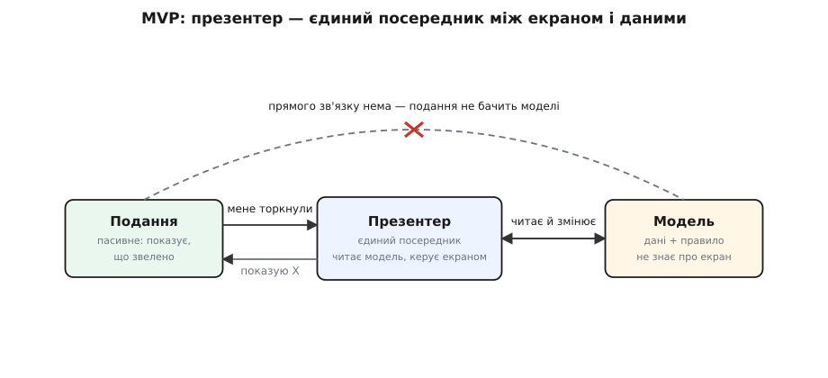
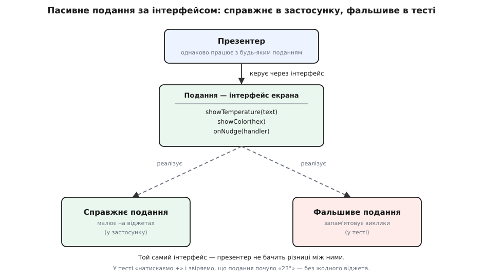

# Модель–подання–презентер (MVP)

<preknowlist>
- [Модель–подання–контролер (MVC)](book:programming/mvc) — розкладка застосунку на три частини за родом справи: що він знає (модель), як показує (подання), як ловить ввід; MVP переробляє саме її.
- [Зчеплення і зв'язність](book:programming/coupling-cohesion) — зчеплення міряє, скільки одна частина мусить знати про іншу; уся мета MVP — прибрати пряме зчеплення подання з моделлю.
- [Інтерфейс проти реалізації](book:programming/interface-vs-implementation) — різниця між тим, ЩО річ обіцяє вміти (контракт), і тим, ЯК вона це робить; презентер знає подання лише як інтерфейс, і саме це дає підмінити екран фальшивкою.
</preknowlist>

MVC розкладає застосунок з екраном на три частини за родом справи, але між двома з них лишає пряму лінію: подання дивиться на модель само й бере з неї, що треба показати. Лінія зручна — і рівно вона ж і протікає. Щоб подання прочитало модель, воно мусить знати її будову; а разом зі знанням у подання поволі стікають дрібні рішення — тут підрахуємо, що показати, там вирішимо, коли сховати кнопку. І є тихіша ціна. Щоб перевірити таке подання тестом, доводиться підняти і справжню модель, і справжній набір віджетів; а віджети тягнуть за собою весь важкий каркас інтерфейсу — вікно, цикл подій, рендер, — якого в звичайному тесті не піднімеш. Виходить, найважливіше — що екран покаже й коли — перевірити майже нема як.

Звідси й питання, з якого росте MVP: що, як відрізати цю лінію зовсім — щоб подання більше не бачило моделі?

## Пасивне подання і презентер

MVP каже: хай подання **осліпне**. Тепер воно вміє рівно дві речі — показати те, що йому звеліли показати, і доповісти «мене торкнули». Ні числа з моделі воно не читає, ні рішень не ухвалює. Таке подання називають **пасивним**. А все, що досі текло між екраном і даними, тепер проходить через одну нову частину — **презентера** (presenter, від англ. *present* — подавати, викладати).

Придивімося, що сталося з кожною з трьох частин.

**Модель** лишилася та сама: число `target` (бажана температура), правило межі 5–30 — і жодного слова про екран. Вона серце застосунку й не знає, як її показують.

**Подання** тепер пасивне. Воно не дивиться на модель. Натомість виставляє назовні короткий **інтерфейс** — список команд, які над ним можна вчинити: «покажи таку цифру», «пофарбуй у такий колір», — і сигнал «мене натиснули». Більше воно не вміє нічого: ні рахувати, ні вирішувати, ні лізти в модель.

**Презентер** — повний посередник. Він тримає і модель, і подання, але подання — лише як той інтерфейс, не як конкретний віджет. Почувши від подання «натиснули +», презентер просить модель змінитися, читає з неї свіжий результат, форматує його під екран і **власноруч розкладає командою за раз**: скажи поданню показати «23°», скажи пофарбувати смужку. Подання при цьому саме не ворухнеться — воно чекає, поки звелять.

Уся різниця з MVC — в одній зниклій стрілці.


*Презентер стоїть між екраном і даними сам-один: подання говорить лише з ним, модель — лише з ним, а прямої лінії між поданням і моделлю немає зовсім. Через це подання й можна зробити геть пасивним.*

У MVC стрілка йшла від подання до моделі: подання само читало стан. У MVP цієї стрілки **нема зовсім**. Єдиний, хто торкається моделі, — презентер; він же й керує поданням. Подання висить скраю — сліпе, слухняне, без власної думки.

Ось той самий термостат у MVP: інтерфейс подання, презентер, що розкладає все сам, — і тест, якому не потрібен екран.

:::tabs
```ts
// Подання — лише інтерфейс: команди екрана й сигнал про дотик. Ні слова про модель.
interface ThermostatView {
  showTemperature(text: string): void;              // презентер каже, ЩО показати
  showColor(hex: string): void;
  onNudge(handler: (delta: number) => void): void;  // екран лише доповідає «мене торкнули»
}

class ThermostatPresenter {
  constructor(private view: ThermostatView, private model: Thermostat) {
    view.onNudge(delta => this.nudge(delta));        // підписатися на дотики екрана
  }
  private nudge(delta: number) {
    this.model.nudge(delta);                         // 1. попросити модель змінитися (правило межі — в ній)
    const t = this.model.target;                     // 2. прочитати свіжий результат
    this.view.showTemperature(`${t}°`);              // 3. власноруч розкласти на екран
    this.view.showColor(t > 24 ? "#c0392b" : "#2457d6");
  }
}

// Тест без жодного віджета: фальшиве подання просто запам'ятовує виклики.
let press: (d: number) => void = () => {};
const shown: string[] = [];
const fake: ThermostatView = {
  showTemperature: t => shown.push(t),
  showColor: () => {},
  onNudge: h => { press = h; },        // перехопити обробник, щоб «натиснути» з тесту
};
new ThermostatPresenter(fake, new Thermostat());  // модель стартує на 22°
press(+1);                                        // імітуємо дотик «+» — екрана не існує
console.assert(shown.at(-1) === "23°");           // презентер справді штовхнув «23°» у подання
```
```java
// Подання — лише інтерфейс: команди екрана й сигнал про дотик. Ні слова про модель.
interface ThermostatView {
    void showTemperature(String text);   // презентер каже, ЩО показати
    void showColor(String hex);
    void onNudge(IntConsumer handler);    // екран лише доповідає «мене торкнули»
}

class ThermostatPresenter {
    private final ThermostatView view;
    private final Thermostat model;
    ThermostatPresenter(ThermostatView view, Thermostat model) {
        this.view = view; this.model = model;
        view.onNudge(this::nudge);        // підписатися на дотики екрана
    }
    private void nudge(int delta) {
        model.nudge(delta);               // 1. попросити модель змінитися (правило межі — в ній)
        int t = model.target();           // 2. прочитати свіжий результат
        view.showTemperature(t + "°");    // 3. власноруч розкласти на екран
        view.showColor(t > 24 ? "#c0392b" : "#2457d6");
    }
}

// Тест без жодного віджета: фальшиве подання просто запам'ятовує виклики.
var shown = new ArrayList<String>();
var press = new IntConsumer[1];
ThermostatView fake = new ThermostatView() {
    public void showTemperature(String t) { shown.add(t); }
    public void showColor(String hex) { }
    public void onNudge(IntConsumer h) { press[0] = h; }   // перехопити обробник
};
new ThermostatPresenter(fake, new Thermostat());   // модель стартує на 22°
press[0].accept(+1);                               // імітуємо дотик «+» — екрана не існує
assert shown.get(shown.size() - 1).equals("23°");  // презентер штовхнув «23°» у подання
```
:::

## Нащо аж так осліпляти подання

Зробити подання дурним до краю здається дивним — навіщо забирати в нього право бодай глянути на модель? Відповідь ховається не в самому екрані, а в тесті.

Раз подання — це лише інтерфейс, у тесті презентеру можна підсунути **фальшиве подання**: крихітний об'єкт, що реалізує той самий інтерфейс, але замість малювати на пікселях просто **запам'ятовує**, що йому веліли показати. Тоді весь застосунок стає перевірним у тиші: створюємо презентер із фальшивим поданням, «натискаємо +» (гукаємо обробник, що його підхопила фальшивка) — і звіряємо, що презентер справді штовхнув у неї «23°». Жодного вікна, жодного віджета, жодного циклу подій.


*Подання — це інтерфейс, тож його реалізує і справжній екран у застосунку, і фальшивка в тесті. Презентер працює з інтерфейсом і не бачить різниці, тому в тесті його ведуть із фальшивим поданням, що лише записує почуте.*

> 🔧 **Навіщо це.** Отут і вся вигода MVP. Логіка «що і коли показати» — найкрихкіше в застосунку з екраном і водночас найважче перевірне, бо зазвичай вросло у віджети. MVP витягує цю логіку з екрана в презентер — простий об'єкт, який тестуєш без жодного інтерфейсу, як звичайну функцію. Саме тому MVP розквітнув там, де каркас екрана важкий і сам собою майже не тестується: настільні WinForms і Swing, ранній Android, GWT. [Тактики тестовності](book:programming/testability-tactics) називають цей хід загальніше: зроби ту частину, яку важко тестувати, настільки дурною, щоб її не було чого тестувати, а все крихке перенеси в об'єкт, який тестується легко.

Ціну ти вже, певно, вгадав. Презентер стає **балакучим**: раз подання само нічого не бере, презентер мусить розкласти на екран кожну дрібницю вручну, поле за полем. У великій формі це багато марудного коду «поклади це сюди, те туди».

Тому в MVP є й легший варіант — **керівний контролер** (supervising controller). Тут поданню лишають право на дрібне: прості речі — показати одне поле — воно зв'язує з моделлю саме, а презентер бере на себе лише складне, де справді є що вирішувати. Так торгуються: більше дурості в поданні — менше марноти в презентері, і навпаки. Строгий край цієї торгівлі — пасивне подання; коли ж ручне розкладання приїдається, крок назад до керівного контролера буває виправданий.

## Куди правила класти не можна

MVP не рятує сам собою — його, як і MVC, тримає дисципліна, куди що писати, і ті самі дві пастки чигають знову.

Перша — **товстий презентер**. Раз через презентер тече все, у нього легко заповзають правила предметної області: тут порахуємо знижку, там перевіримо ліміт. Презентер має лишатися тлумачем: переклав дотик у команду моделі, узяв результат, виклав на екран. Правилам місце в моделі; коли їх багато й вони плетуть кілька моделей, між презентером і моделлю ставлять окремий [сервісний шар](book:programming/service-layer), а не звалюють усе в презентер.

Друга — та сама біда з іншого боку. Якщо всі правила стекли з моделі в презентери, модель порожніє й стає голим мішком полів без поведінки — [анемічною моделлю](book:programming/anemic-domain-model). Формально MVP на місці, а серце вирізано: «модель» уже нічого не знає, і розкладати щось навколо неї немає сенсу.

MVP народився не з чистого аркуша: [його історію](book:programming/model-view-presenter/hist-mvp-birth.md) варто знати окремо — як у 1990-х у Taligent, спільному підприємстві Apple та IBM, шукали єдину модель для C++ і Java, як ім'я закріпив Майк Потел 1996 року, а через десятиліття Мартін Фаулер розділив «MVP» на два чіткіші варіанти й радив саму абревіатуру вже не вживати.

Як це виглядає в робочому коді — пасивне подання, презентер і той самий тест із фальшивкою, а поряд керівний контролер для порівняння — розібрано в [окремій проєктній вставці](book:programming/model-view-presenter/proj-passive-view.md).

## Що лишається

MVP не варто заучувати як припис «встав між екраном і моделлю ще один клас». Варто взяти з нього одну тривку думку: **усе крихке — рішення про те, що і коли показати — забери з екрана в простий об'єкт, який можна перевірити без екрана**. Пасивне подання — це і ціна (презентер стає балакучим), і нагорода (екран такий дурний, що ламатися в ньому нема чому). Це той самий рід, що й MVC та [MVVM](book:programming/model-view-viewmodel): усі троє проводять одну межу між тим, що застосунок знає, і тим, як він це показує, — MVP лише проводить її найтвердіше, поставивши між ними посередника, крізь якого видно все.
