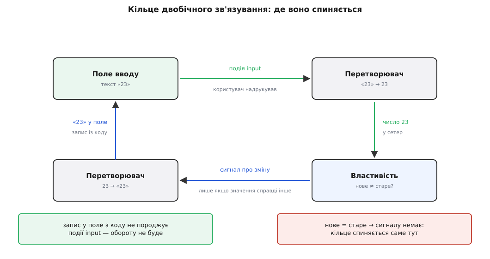
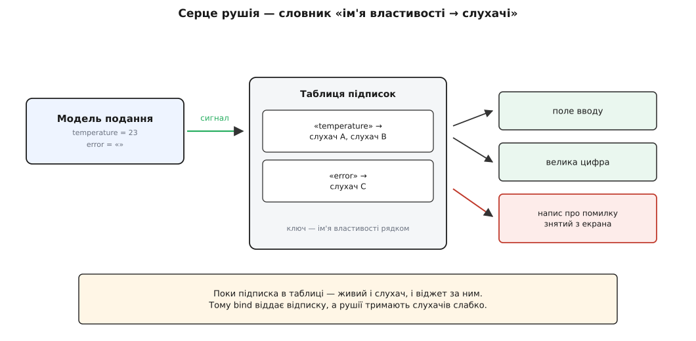

# ⚙️ Рушій зв'язування за шість десятків рядків

<preknowlist>
- [Спостерігач](topic:programming/observer) — об'єкт тримає список підписників і сповіщає їх про зміну, не знаючи, хто вони; таблиця підписок усередині рушія — це буквально він.
- [Функції першого класу](topic:programming/first-class-functions) — функцію можна покласти у змінну, передати аргументом і повернути з іншої функції; на цьому стоїть і список слухачів, і «відписка», яку рушій повертає назад.
- [Збирання сміття](topic:programming/garbage-collection) — об'єкт живий доти, доки на нього хтось посилається; звідси й головна пастка зв'язування, у якій знятий з екрана віджет не вмирає.
</preknowlist>

Усередині рушія зв'язування немає нічого, чого не можна написати за вечір: словник підписок, дві функції-перетворювачі й один прапорець. Тут ми складемо робочий двобічний рушій із нуля — не іграшковий переказ, а такий, у якому поле й властивість справді тримаються рівними, — і подивимося, як він рветься в тих самих місцях, де мовчки рветься промисловий.

Мета не в тому, щоб потім користуватися саме своїм рушієм: у WPF чи Vue він уже є, і кращий. Мета в іншому. Коли чуже зв'язування мовчки не спрацювало, ти дивишся на порожнє місце в коді й не маєш куди поставити точку зупину — саме тому воно й здається чаклунством. Але порожнім воно здається, лише поки не знаєш, з яких стиків складається. Місць, де нитка може мовчки урватися, всього чотири, і кожне має свій симптом; той, хто раз склав ці стики сам, упізнає розрив на око.

## Що саме мусить уміти рушій

Спершу — точний перелік обов'язків, бо без нього код перетворюється на замовляння, а не на механізм:

```
1. показ    змінилася властивість  → віджет показує нове
2. ввід     користувач надрукував  → властивість дістає нове
3. типи     у віджеті завжди текст, у властивості — число, дата, будь-що
4. стоп     оборот «поле → властивість → поле» мусить спинятися
5. кінець   зв'язок треба вміти зняти, коли віджет зникає з екрана
```

Перші два пункти — це те, за що зв'язування люблять. Три останні — це те, через що воно мовчить, коли ламається. Домовмося про вигляд готового: уся форма оживає одним рядком на пару, `bind(поле, vm, "temperature", asNumber)`, і жодного `setText` чи `getText` більше ніде. Складається таке з трьох шматків: властивість, яка вміє сповіщати; нитка, що зшиває властивість із віджетом; і перетворювачі між текстом і типом.

## Перший шматок: властивість, що вміє сповіщати

Звичайне поле об'єкта мовчазне. Присвоєння `vm.temperature = 30` записує число в пам'ять і на цьому все — ніхто в світі не дізнається, що воно сталося. Отже, найперше, що треба перехопити, — саме **присвоєння**: підмінити поле парою «читач і писар», де писар, крім запису, ще й гукає підписників.

Далі шляхи двох мов розходяться, і розходяться повчально. У JavaScript поле можна підмінити на місці: `Object.defineProperty` перетворює звичайне поле на пару `get`/`set`, залишаючи саме значення в замиканні. У C++ поля підмінити не можна — там властивість роблять окремим маленьким об'єктом, який значення в собі й тримає.

Одна дрібниця в сетері виглядає як зайва обережність, а насправді тримає всю конструкцію: **якщо нове значення дорівнює старому — сигналу немає**. Поки що прийми це як економію зайвого перемальовування; далі стане видно, що саме на цьому рядку кільце зв'язування спиняється.

:::tabs
```ts
// ── 1. Сигнали: словник «ім'я властивості → хто це слухає» ──
type Listener = (value: unknown) => void;

class Signals {
  private subs = new Map<string, Set<Listener>>();

  on(prop: string, fn: Listener): () => void {
    let set = this.subs.get(prop);
    if (!set) this.subs.set(prop, (set = new Set()));
    set.add(fn);
    return () => { set!.delete(fn); };          // повертаємо «відписку»
  }

  emit(prop: string, value: unknown): void {
    const set = this.subs.get(prop);
    if (!set) return;
    for (const fn of [...set]) fn(value);       // копія: слухач може відписатися просто в обході
  }
}

/** Підмінює КОЖНЕ власне поле об'єкта парою get/set із сигналом. */
function observable<T extends object>(vm: T): T & { signals: Signals } {
  const signals = new Signals();
  for (const key of Object.keys(vm)) {
    let value = (vm as any)[key];               // значення переїжджає в замикання
    Object.defineProperty(vm, key, {
      enumerable: true,
      configurable: true,
      get: () => value,
      set: (next) => {
        if (Object.is(next, value)) return;     // не змінилось — не сповіщаємо
        value = next;
        signals.emit(key, next);
      },
    });
  }
  return Object.assign(vm, { signals });
}
```
```cpp
// ── 1. Властивість, що сама тримає своїх слухачів ──
#include <algorithm>
#include <cstddef>
#include <functional>
#include <utility>
#include <vector>

template <class T>
class Property {
public:
    using Listener = std::function<void(const T&)>;

    explicit Property(T v = T{}) : value_(std::move(v)) {}

    const T& get() const { return value_; }

    void set(T next) {
        if (next == value_) return;          // не змінилось — не сповіщаємо
        value_ = std::move(next);
        std::vector<Sub> copy = subs_;       // копія: слухач може відписатися просто в обході
        for (const Sub& s : copy) s.second(value_);
    }

    std::size_t on(Listener fn) {            // повертаємо квиток на відписку
        subs_.emplace_back(next_id_, std::move(fn));
        return next_id_++;
    }

    void off(std::size_t id) {
        subs_.erase(std::remove_if(subs_.begin(), subs_.end(),
                                   [id](const Sub& s) { return s.first == id; }),
                    subs_.end());
    }

private:
    using Sub = std::pair<std::size_t, Listener>;
    T value_;
    std::vector<Sub> subs_;
    std::size_t next_id_ = 1;
};
```
:::

Порівняй ці дві версії уважно — у їхній різниці ховається половина всіх мовчазних збоїв зв'язування. У версії для вебу підписка ходить **по імені-рядку**: `signals.on("temperature", …)`. Рядок узявся не з примхи — так улаштована розмітка, де прив'язку пишуть словами: `{Binding Temperature}` чи `v-model="temperature"`. Розмітка не має доступу до типів, вона вміє лише назвати властивість по буквах, тож рушій мусить вміти шукати за буквами. У версії на C++ жодних імен немає: властивість — це об'єкт, слухач чіпляється просто до нього, а помилку в імені ловить компілятор ще до запуску. Ціна цієї безпеки — прив'язку не можна написати в розмітці, її пишуть кодом.

> 🔧 **Навіщо це.** Звідси випливає правило, яким варто міряти будь-який рушій зв'язування: **чим пізніше зв'язок перевіряється, тим тихіше він ламається.** Прив'язка рядком у розмітці перевіряється аж під час показу вікна — тому одрук у ній не зупиняє складання й не кидає винятку, а просто нічого не робить. Прив'язка кодом до типізованої властивості перевіряється при складанні — тому одрук стає помилкою компілятора. Обираючи каркас, дивись насамперед на це, а не на кількість рядків у прикладі з документації.

## Другий шматок: нитка між віджетом і властивістю

Тепер найцікавіше — сам зв'язок. У полі вводу завжди лежить **текст**, у властивості — число, дата, прапорець. Отже, нитка потребує двох перекладів, і краще назвати їх окремою парою функцій, аніж розсипати `parseFloat` по всьому рушію:

:::tabs
```ts
// ── 2а. Перетворювачі: у полі завжди рядок ──
interface Convert<V> {
  toView(v: V): string;      // властивість → текст поля
  toModel(s: string): V;     // текст поля → властивість
}

const asText: Convert<string> = {
  toView: v => v ?? '',
  toModel: s => s,
};

const asNumber: Convert<number> = {
  toView: v => Number.isFinite(v) ? String(v) : '',
  toModel: s => {
    const t = s.trim();
    return t === '' ? NaN : Number(t.replace(',', '.'));  // порожнє — НЕ нуль
  },
};
```
```cpp
// ── 2а. Перетворювачі: у віджеті завжди рядок ──
#include <cstdio>
#include <cstdlib>
#include <limits>
#include <string>

std::string numToText(const double& v) {
    if (v != v) return "";                       // NaN — порожнє поле
    char buf[32];
    std::snprintf(buf, sizeof buf, "%g", v);
    return buf;
}

double textToNum(const std::string& s) {
    const char* first = s.c_str();
    char* last = nullptr;
    const double v = std::strtod(first, &last);
    if (last == first || *last != '\0')          // порожнє чи сміття — НЕ нуль
        return std::numeric_limits<double>::quiet_NaN();
    return v;
}
```
:::

А тепер сама нитка. Уся її суть — **дві підписки навхрест**: одна на сигнал властивості (щоб писати в поле), друга на подію віджета (щоб писати у властивість). Плюс дві дрібниці, без яких вона зіпсує життя: прапорець, що не дає ниточному оберту зайти на друге коло, і повернена «відписка», якою зв'язок знімають.

:::tabs
```ts
// ── 2б. Зв'язок: дві підписки, прапорець і відписка ──
function bind<T extends object, K extends Extract<keyof T, string>>(
  el: HTMLInputElement,
  vm: T & { signals: Signals },
  prop: K,
  conv: Convert<T[K]>,
): () => void {
  if (!(prop in vm)) {                                   // одрук ловиться ТУТ, а не мовчки
    throw new Error(`bind: у моделі подання немає властивості «${prop}»`);
  }
  let writing = false;

  // властивість → поле
  const push = (v: unknown) => {
    const text = conv.toView(v as T[K]);
    if (el.value !== text) el.value = text;              // зайвий запис збиває каретку
  };
  const off = vm.signals.on(prop, push);

  // поле → властивість
  const onInput = () => {
    if (writing) return;                                 // друге коло не робимо
    writing = true;
    try { vm[prop] = conv.toModel(el.value); }           // ← ось сюди ставиться точка зупину
    finally { writing = false; }
  };
  el.addEventListener('input', onInput);

  push(vm[prop]);                                        // початкове наповнення поля
  return () => { off(); el.removeEventListener('input', onInput); };
}
```
```cpp
// ── 2б. Зв'язок: дві підписки, прапорець і деструктор ──

// Найтонший «віджет»: текст плюс сповіщення про правку користувачем.
struct TextField {
    std::string text;
    std::function<void(const std::string&)> onEdit;

    void typeIn(std::string s) {                 // так «друкує користувач»
        text = std::move(s);
        if (onEdit) onEdit(text);
    }
    void show(std::string s) { text = std::move(s); }   // запис із коду — БЕЗ сповіщення
};

template <class T>
class Binding {
public:
    using ToView  = std::function<std::string(const T&)>;
    using ToModel = std::function<T(const std::string&)>;

    Binding(TextField& w, Property<T>& p, ToView toView, ToModel toModel)
        : w_(w), p_(p), toView_(std::move(toView)) {

        id_ = p_.on([this](const T& v) { w_.show(toView_(v)); });   // властивість → віджет

        w_.onEdit = [this, toModel](const std::string& s) {         // віджет → властивість
            if (writing_) return;                                   // друге коло не робимо
            writing_ = true;
            p_.set(toModel(s));                                     // ← точка зупину тут
            writing_ = false;
        };

        w_.show(toView_(p_.get()));                                 // початкове наповнення
    }

    ~Binding() { p_.off(id_); w_.onEdit = nullptr; }   // відписку не можна забути

    Binding(const Binding&) = delete;                  // зв'язок не копіюють
    Binding& operator=(const Binding&) = delete;

private:
    TextField& w_;
    Property<T>& p_;
    ToView toView_;
    std::size_t id_ = 0;
    bool writing_ = false;
};
```
:::

Три рядки тут варті окремої уваги.

`if (el.value !== text)` — не оптимізація, а ввічливість до користувача: запис у поле, навіть тим самим текстом, у браузері зсуває каретку в кінець. Рушій, який пише в поле на кожен натиск клавіші, робить набір посеред слова неможливим.

Прапорець `writing` захищає від того, що віджет сам гукне про правку у відповідь на запис із коду. У браузері цього не буває — там присвоєння `el.value` навмисне **не** породжує події `input`, бо ця подія за означенням про дію користувача. А от у настільних наборах віджетів буває суціль: `QLineEdit::setText()` у Qt піднімає сигнал `textChanged` — і лише `textEdited` лишається суто «людським». Підпишешся не на той сигнал — і оберт замкнеться в кільце; прапорець його розірве.

І `return () => …` проти `~Binding()`. У версії для вебу відписка — це повернена функція, яку **треба не забути покликати**. У C++ те саме роблять деструктором: зв'язок живе, доки живе об'єкт, і сам себе знімає, коли виходить з області видимості. Це і є [RAII](topic:programming/raii) — прив'язати звільнення ресурсу до часу життя об'єкта, щоб про звільнення не можна було забути. Далі побачимо, чому саме тут забути найдорожче.

## Третій шматок: заводимо

Лишилося скласти все докупи. Зверни увагу на правило межі: воно **не частина рушія** — це звичайний підписник, який слухає одну властивість і пише в іншу. Підказку про помилку показує друге поле, тільки заборонене для набору; прив'язка до звичайного напису відрізнялася б хіба тим, що слухача події вводу там не треба зовсім.

:::tabs
```ts
// ── 3. Модель подання й дві прив'язки ──
const vm = observable({ temperature: 22, error: '' });

// «обчислювана» властивість — просто слухач, що пише в сусідню
vm.signals.on('temperature', () => {
  const t = vm.temperature;
  vm.error = (Number.isFinite(t) && t >= 5 && t <= 30) ? '' : 'дозволено 5…30';
});

const stop = [
  bind(document.querySelector('#temp')  as HTMLInputElement, vm, 'temperature', asNumber),
  bind(document.querySelector('#error') as HTMLInputElement, vm, 'error', asText),
];

vm.temperature = 35;        // поле саме показало «35», підказка — «дозволено 5…30»
                            // друк у полі так само сам оновлює vm.temperature

stop.forEach(off => off()); // зв'язки зняті: віджети можна викидати
```
```cpp
// ── 3. Модель подання й дві прив'язки ──
int main() {
    Property<double> temperature{22.0};
    Property<std::string> error;

    temperature.on([&error](const double& t) {          // правило межі — звичайний підписник
        error.set(t >= 5.0 && t <= 30.0 ? std::string{} : std::string{"дозволено 5…30"});
    });

    TextField tempField, errorField;
    {
        Binding<double> b1(tempField, temperature, numToText, textToNum);
        Binding<std::string> b2(errorField, error,
                                [](const std::string& v) { return v; },
                                [](const std::string& s) { return s; });

        temperature.set(35.0);        // tempField.text == "35", errorField.text == "дозволено 5…30"
        tempField.typeIn("12");       // temperature.get() == 12, errorField.text == ""
    }                                 // ← деструктори зняли обидва зв'язки

    temperature.set(99.0);            // поля вже нікого не слухають: у tempField лишилось «12»
}
```
:::

Ось що друкує веб-версія, якщо прогнати цей сценарій із підробленим полем замість справжнього:

```
після bind            поле «22»    підказка «»
vm.temperature = 35   поле «35»    підказка «дозволено 5…30»
надрукували «12»      vm 12        підказка «»
надрукували «abc»     vm NaN       поле спорожніло
надрукували «5.»      vm 5         поле «5» — крапку з'їло
після відписки        vm 99        поле лишилось «5»
```

Перші три рядки — це та сама обіцяна зручність: ніде жодного копіювання, обидва кінці рівні. А от четвертий і п'ятий — уже цікаві. Надрукував `abc` — і поле раптом спорожніло під пальцями. Надрукував `5.`, збираючись увести `5.5`, — і крапку з'їло, бо `toModel` дав `5`, властивість змінилася, сигнал пішов назад і переписав поле нормалізованим текстом. Наш рушій чесно робить те, що йому звеліли, і саме тому воює з користувачем. Тримай цей рядок у пам'яті — до нього повернемося.

## Чому кільце не крутиться вічно


*Правка йде по кільцю: поле → число → властивість → сигнал → текст → поле. Кільце замкнене, тож питання не «чи закрутиться», а «де спиниться».*

Двобічний зв'язок — це замкнене кільце, і природне питання: чому воно не крутиться вічно? Відповідь у тому самому рядку `if (Object.is(next, value)) return`. Кожен оберт кільця — це застосування пари перетворювачів до значення: `toModel(toView(x))`. Якщо ця пара **вертає те саме**, то на другому оберті нове значення дорівнює старому, сигнал не піднімається — і кільце стає. Мовою математики кільце спиняється на **нерухомій точці** перетворення:

```
x₀ = 22            вихідне значення властивості
x₁ = toModel(toView(x₀)) = toModel("22") = 22 = x₀   ← нерухома точка, сигналу немає
```

Звідси випливає вимога, про яку рідко думають, поки вона не вкусить: **перетворювачі мають сходитися за один крок.** Пара, що не сходиться, крутить кільце нескінченно. Найчастіші джерела розбіжності — сетер, який щоразу створює новий об'єкт (нова `Date` із того самого тексту нерівна попередній, бо порівнюється посилання), і значення, нерівне саме собі. Друге — не жарт: `NaN === NaN` дає `false`, тож властивість із нечисловим текстом сповіщала б підписників на кожен натиск клавіші. Саме тому в коді стоїть `Object.is`, а не `===`: `Object.is(NaN, NaN)` — це `true`. У C++-версії такої ласки немає, там `next == value_` для двох `NaN` теж дасть `false`, і порівняння для дробових чисел довелося б писати свідомо.

Промислові рушії стикаються з тим самим — просто називають це по-своєму. AngularJS обходив прив'язки циклом перевірок, чекаючи, поки значення перестануть змінюватися, і якщо за десять обертів вони не влягалися, кидав `10 $digest() iterations reached. Aborting!`. Це буквально повідомлення «ваше кільце не має нерухомої точки», тільки з обмеженням зверху, щоб сторінка не зависла назавжди.

## Чотири мовчазні відмови — і де в них точка зупину

Тепер найцінніше, заради чого все й збиралося. Кожен стик рушія рветься по-своєму, і в кожного розриву — свій симптом.

**Одрук в імені властивості.** Прив'язка каже `"temperatur"`, у моделі подання — `temperature`. Наш `bind` кидає виняток одразу, бо перевіряє `prop in vm`, — і це навмисне: краще гучно впасти при заведенні форми, ніж тихо не працювати. Промислові рушії такої розкоші не мають: у розмітці трапляються прив'язки до властивостей, яких на мить показу ще немає, і рушій не годен відрізнити одрук від «поки не з'явилося» — тому й мовчить. WPF, приміром, мовчить на екрані й пише рядок про невдале зв'язування у вікно налагоджувального виводу; щоб дізнатися подробиці про конкретну прив'язку, туди дописують `PresentationTraceSources.TraceLevel=High`. Симптом на екрані — **поле просто порожнє від самого початку**, і жодна дія його не оживляє. Перше, куди дивитися, — не в код, а в налагоджувальний вивід.

**Забутий сигнал.** Значення змінилося, а `emit` не пішов — і екран показує старе, поки щось інше випадково не смикне ту саму властивість. У нашому рушії це стається легко: `observable` обгортає лише ті поля, які були в об'єкті **на момент виклику**. Додав поле пізніше — воно мовчазне, присвоєння проходить повз сетер. Так само мовчазна зміна **всередині** значення: `vm.items.push(x)` не чіпає саме поле `items`, отже сигналу немає. Vue 2 мала рівно ту саму ваду з тієї самої причини — вона теж обгортала поля через `Object.defineProperty`, і для доданих полів існував окремий `Vue.set`; у Vue 3 обгортку замінили на `Proxy`, який перехоплює звертання до **будь-якого** ключа, зокрема й нового. Симптом — **екран відстає від даних**, і найчастіше винен не рушій, а присвоєння, що пройшло повз нього. Точка зупину — в сетері властивості: якщо вона не спрацьовує, шукай, хто змінив значення в обхід.

**Розбіжність типів.** У полі завжди текст, у властивості — число, і без перетворювача текст мовчки туди й потрапляє. Далі починається найгірше: `"23" >= 5` у JavaScript дає `true`, бо порівняння зводить рядок до числа, а `"23" + 1` дає `"231"`, бо плюс склеює рядки. Половина логіки працює, половина бреше. Порожнє поле окремо підступне: `Number("")` — це нуль, тож стерта температура тихо стає нулем замість «нічого не введено» — саме тому в `asNumber` порожній рядок обробляється окремо й дає `NaN`. У WPF цю роль виконує `IValueConverter`, у Vue — модифікатор `.number` на `v-model`; але коли перетворювач не написаний, ніхто не свариться. Симптом — **логіка спрацьовує майже правильно**, і саме «майже» видає розрив.

**Момент запису.** Найпідступніша з чотирьох, бо тут усе працює, просто не тоді. Наш рушій пише у властивість на кожен натиск клавіші — і саме тому з'їв крапку в `5.`. Зробити краще, лишившись у кількох десятках рядків, не вийде: треба або відкласти запис до втрати фокусу, або не переписувати поле, поки в ньому є фокус. Промислові рушії обрали перше й ставлять це за замовчуванням: у WPF прив'язка `TextBox.Text` оновлює джерело **не під час набору, а коли поле втратило фокус** — `UpdateSourceTrigger` для неї має значення `LostFocus`, тоді як для решти властивостей це `PropertyChanged`. Vue дає таку саму поведінку модифікатором `v-model.lazy`. Звідси й найчастіше «властивість не оновлюється»: вона оновиться — щойно клацнеш поза полем. Симптом — **дані відстають рівно на одне поле**, а кнопка «Зберегти», прив'язана до перевірки, спалахує з запізненням.

## Ціна: підписка живе довше за віджет


*Той самий словник, що робить рушій зв'язування простим, робить його небезпечним: доки в ньому є запис, живий і слухач, і все, за що слухач тримається.*

За обчисленнями зв'язування майже безкоштовне:

```
bind           O(1) пам'яті: одне замикання + один запис у словнику
emit           O(k), k = скільки слухачів саме на ЦЮ властивість
запуск форми   O(n) прив'язок один раз; далі — нічого, поки нічого не змінюється
```

Дорого коштує не робота, а **час життя**. Слухач, покладений у словник, тримає посилання на замикання, замикання — на віджет, віджет — на все своє піддерево. Доки запис у словнику є, ніщо з цього ланцюжка не помре, навіть якщо віджет давно знятий з екрана. У цієї халепи є усталена назва — **проблема застарілого слухача** (англ. *lapsed listener*): підписник відпав, а підписка лишилася, і об'єкт-джерело тримає мертвий вантаж до кінця роботи програми. Витік тут не єдина біда: мертвий слухач ще й далі виконується на кожен сигнал, і форма помалу гальмує без видимої причини.

Ліків три, і всі три видно в написаному коді. Найпростіші — повернути «відписку» й покликати її, коли віджет зникає (тому в кожному каркасі є `onUnmounted`, `dispose`, `destroy`), або прив'язати зняття до часу життя об'єкта, як у C++-версії з деструктором. Третій — тримати слухачів [слабкими посиланнями](topic:programming/weak-references), тобто такими, що не заважають збирачеві сміття забрати об'єкт: тоді відпалий віджет помирає сам, а рушій просто викидає порожні записи. Саме так роблять промислові рушії там, де відписка не гарантована.

## Чого тут навмисне немає

Шість десятків рядків покривають кістяк, але не покривають зручностей, за які й платять промисловим рушіям. Варто знати, чого бракує і скільки коштує кожна добудова.

**Обчислювані властивості самі собою.** У нас правило межі написане руками — окремим підписником, який слухає одне й пише інше. Рушій міг би зробити це сам, якби запам'ятовував, **до яких властивостей звертався** обчислювальний вираз, поки виконувався, і перепідписувався на них. Ця техніка — стеження за залежностями — і робить [реактивне програмування](topic:programming/reactive-programming) реактивним; саме її дає `computed` у Vue. У .NET пішли дешевшим шляхом: сповіщення для залежної властивості там не вираховують, а **дописують при складанні** — генератор коду бачить `[NotifyPropertyChangedFor(nameof(CanSave))]` над полем і сам вставляє в сетер потрібний рядок.

**Шляхи вглиб.** Прив'язка `order.customer.name` вимагає ланцюжка підписок і, головне, **перепідписки посеред ланцюжка**: коли зміниться `customer`, старі підписки на його `name` треба зняти й поставити нові.

**Колекції.** Присвоєння в списку не відбувається, тож сигналу немає: додавання елемента доводиться сповіщати окремим каналом — звідси `INotifyCollectionChanged` у .NET і окрема обгортка над масивами у Vue 2.

**Пакування змін.** Одна зміна може смикнути десяток прив'язок, а десять змін поспіль — перемалювати екран десять разів. Промислові рушії відкладають перенесення до кінця поточного оберту подій — у вебі це мікрозадача в [циклі подій](topic:programming/event-loop), — щоб екран оновився один раз і вже узгодженим.

Кожна з цих добудов додає рушієві сили й водночас робить його ще мовчазнішим: чим більше він робить сам, тим менше видно, коли він робить не те. Vue підмінює цілий об'єкт посередником `Proxy`, WPF ходить деревом візуальних елементів у пошуках джерела даних, а перевірити доводиться однаково: чи те ім'я, чи піднявся сигнал, чи той тип, чи вже настав момент запису.
