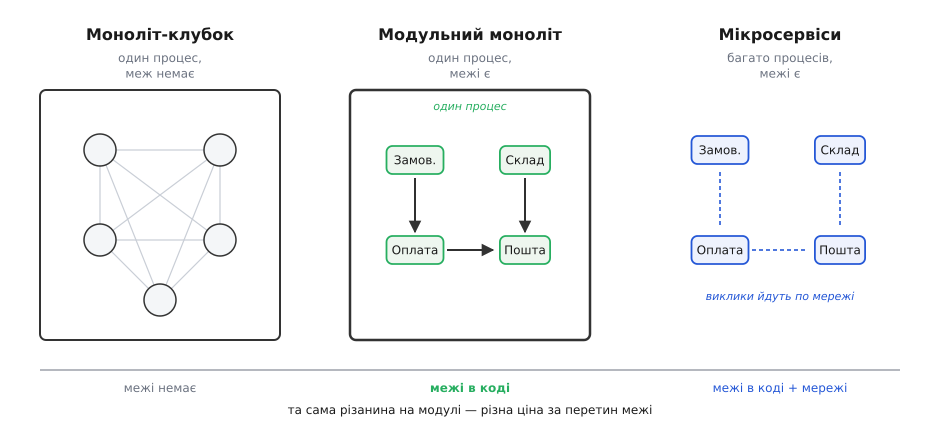
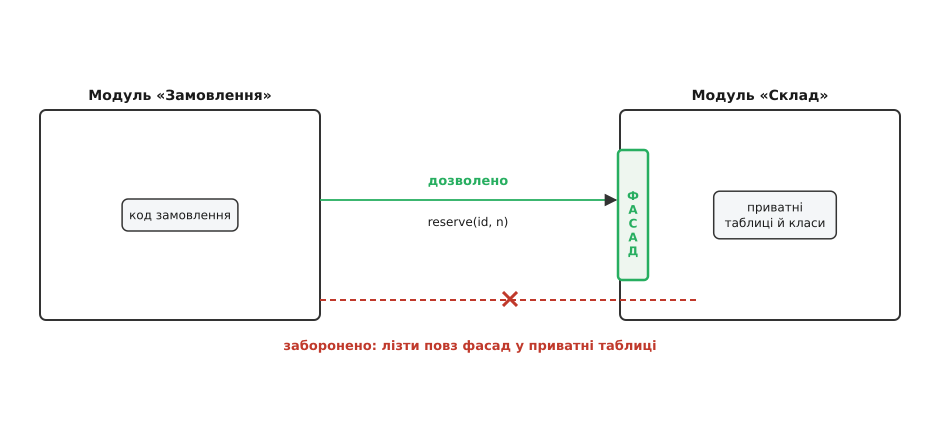

# Модульний моноліт

<preknowlist>
- [Зчеплення і зв'язність](book:programming/coupling-cohesion) — дві лінійки якості різанини на модулі: висока зв'язність усередині, слабке зчеплення між; уся ідея модульного моноліта стоїть на них.
- [Інтерфейс проти реалізації](book:programming/interface-vs-implementation) — різниця між тим, ЩО модуль обіцяє зовні, і тим, ЯК він це робить; межа модуля — це саме публічний інтерфейс проти прихованих нутрощів.
- [Принцип інверсії залежностей](book:programming/dependency-inversion) — як зробити, щоб модуль високого рівня не знав конкретного нижнього; головний прийом тримати межі чистими.
- [Предметно-орієнтоване проєктування](book:programming/domain-driven-design) — як ділити систему за мовою й межами предмету, а не за технічними шарами; звідки беруться самі модулі.
</preknowlist>

Слово «моноліт» (гр. *monólithos* — з одного каменю) у розмовах про архітектуру звучить як лайка. Ним лякають: мовляв, моноліт — це велика купа переплетеного коду, де зміна в одному кутку валить інший, де двоє розробників не можуть працювати паралельно, не наступаючи одне одному на ноги, і єдиний вихід — порізати все на мікросервіси. Але тут сховано підміну понять, і поки її не побачиш, вся дискусія «моноліт чи мікросервіси» ведеться повз ціль.

Придивись, що насправді роблять поганим той страшний моноліт. Не те, що він **один застосунок**. А те, що всередині нього **немає меж** — усе дотягується до всього, будь-який клас смикає будь-яку таблицю, і структури, які колись мали лежати нарізно, злиплися в клубок. Це не хвороба «одного процесу». Це хвороба **відсутньої модульності**. І якщо так, то напрошується питання, від якого відмахнулися надто швидко: а що, коли межі провести чесно, але застосунок лишити одним? Саме це й є модульний моноліт — і саме тому це не компроміс «на півдорозі», а окрема, часто найздоровіша форма застосунку.

## Дві незалежні осі, які постійно плутають

Корінь усієї плутанини в тому, що два різні рішення склеїли в одне. Насправді, будуючи систему, ти ухвалюєш **дві окремі речі**, і вони ні з чого не випливають одна з одної.

Перша вісь — **логічна**: як порізати предметну область на частини. Де проходить межа між «замовленням» і «складом», що вважати одним поняттям, які модулі про що знають. Це різанина сенсу, дисципліна межі.

Друга вісь — **фізична**: як розкласти цей код по процесах і машинах. Чи все живе в одному застосунку, який запускається однією командою, чи розбите на окремі сервіси, що спілкуються по мережі.

Ось ключ, який усе прояснює: **ці дві осі ортогональні**. Можна мати чіткі логічні межі в одному процесі (модульний моноліт). Можна мати нуль логічних меж, розмазаний по десятку сервісів (найгірше з можливого — «розподілений клубок»). «Моноліт проти мікросервісів» ставить питання лише про **другу** вісь, мовчки припускаючи, що вона визначає першу. Не визначає.



*Одну й ту саму різанину предмету на модулі можна тримати в одному процесі або рознести по мережі. Модульний моноліт має ті самі межі, що й мікросервіси, але перетин межі — це виклик функції, а не запит по мережі. Клубок ліворуч не має меж узагалі — і його «полагодити» мікросервісами не можна, бо різати нема по чому.*

> 🔧 **Навіщо це.** Плутанина осей коштує командам років і мільйонів. Типова історія: система стала важкою, хтось оголосив «моноліт — зло», і почалося дроблення на мікросервіси. Але якщо межі всередині були погані, дроблення їх не виправляє — воно **бетонує** їх, ще й обносить кожну мережею. Тепер та сама погана різанина коштує мережевих викликів, розподілених транзакцій і нічних чергувань. Розділивши осі в голові, ти спершу лагодиш дешеву вісь (межі в коді) і лише потім, якщо є справжня потреба, платиш за дорогу (рознесення по мережі).

## Що таке межа модуля насправді

Слово «модуль» затерте, тож домовмося точно. Модуль у цьому сенсі — це не просто тека з файлами й не «пакет» у сенсі мови. Модуль — це шматок системи, що має **дві сторони**: вузький **публічний фасад** (лат. *facies* — обличчя), через який з ним говорять зовні, і **приховані нутрощі** — класи, таблиці, деталі, які назовні не видно й чіпати які ззовні заборонено.

Різниця між модулем і просто-текою — саме в цій забороні. У клубку немає фасаду: будь-який код може дотягтися до будь-чого. У модулі є двері, і крізь них проходить лише те, що модуль сам вирішив показати.



*Межа модуля — це різниця між тим, що показано зовні (фасад), і тим, що сховано (приватні таблиці й класи). Здоровий сусід заходить через фасад, викликаючи `reserve(id, n)`. Хворе зчеплення тягнеться повз фасад прямо в чужі таблиці — і саме це перетворює моноліт на клубок.*

Уся суть у тому, **де** живе ця заборона. Ось три модулі однієї системи, кожен показує назовні рівно один фасад, а всю кухню ховає. Зверни увагу, як мова допомагає прибити межу: у Java те, що не позначено `public`, взагалі невидиме поза пакетом; у TypeScript цю роль грає бар'єр `index.ts`, що реекспортує лише дозволене; у Python — угода `__all__` і префікс підкреслення.

:::tabs
```java
// package warehouse — межа = сам пакет; лише public видно ззовні
package shop.warehouse;

public interface Warehouse {                 // ← фасад: єдине, що бачать сусіди
    Reservation reserve(OrderId id, int qty);
}

// клас реалізації — package-private (немає public), поза пакетом невидимий
class WarehouseService implements Warehouse {
    private final StockTable stock;          // ← приватна нутрощі, чужим зась
    public Reservation reserve(OrderId id, int qty) {
        return stock.hold(id, qty);          // логіка резервування
    }
}
```
```ts
// warehouse/warehouse.ts — реалізація ховається у теці
class WarehouseService {
  constructor(private stock: StockTable) {}  // приватна нутрощі
  reserve(id: OrderId, qty: number): Reservation {
    return this.stock.hold(id, qty);
  }
}

// warehouse/index.ts — ЄДИНІ двері модуля: реекспортуємо лише фасад
export type { Reservation, OrderId };
export interface Warehouse {                 // сусіди імпортують тільки це
  reserve(id: OrderId, qty: number): Reservation;
}
export const makeWarehouse = (s: StockTable): Warehouse => new WarehouseService(s);
// StockTable назовні НЕ експортовано — його не існує для сусідів
```
```python
# warehouse/__init__.py — фасад через __all__
from ._service import Warehouse, make_warehouse   # _service — приватний модуль
__all__ = ["Warehouse", "make_warehouse"]          # видно лише це

# warehouse/_service.py — підкреслення = «не чіпай ззовні»
class _StockTable:                                  # приватна нутрощі
    def hold(self, order_id, qty): ...

class Warehouse:                                    # фасад
    def __init__(self, stock: _StockTable): self._stock = stock
    def reserve(self, order_id, qty):
        return self._stock.hold(order_id, qty)
```
:::

У всіх трьох випадках сусідній модуль може написати лише `warehouse.reserve(id, n)`. Дотягтися до `StockTable`/`_StockTable` — не може: його **не видно**. Ось де живе межа. Не в наміри, не в коментарі «будь ласка, не чіпайте» — а в тому, що чуже просто **недоступне за іменем**.

## Чому це часто найздоровіша форма

Тепер про головне — чому так багато досвідчених команд, наробившись із мікросервісами, повертаються саме до модульного моноліта. Річ у тім, що він забирає майже всю користь модульності, не платячи майже жодної ціни за розподіленість.

Перша перевага — **рефакторинг межі майже безкоштовний**. Це найважливіше й найнедооціненіше. Ти майже ніколи не вгадуєш межі правильно з першого разу — предметна область відкривається поступово, і те, що здавалося одним модулем, згодом хоче розділитися, а два сусіди — злитися. У модульному моноліті пересунути межу — це переставити класи між теками й полагодити виклики; компілятор чи тести одразу покажуть, що поїхало. У мікросервісах та сама зміна межі — це переписати мережеві контракти, версіонувати API, узгодити викатку двох сервісів, які тепер не можна оновити нарізно. [Мартін Фаулер](book:programming/modular-monolith/hist-monolith-first.md) саме тому радить у більшості випадків **починати з моноліта**: поки межі ще плавають, тримай їх там, де рухати дешево.

Друга перевага — **виклик через межу лишається викликом функції**. Він миттєвий, він або спрацював, або кинув виняток — жодного «а раптом мережа впала посеред виклику», жодних таймаутів, повторів, часткових відмов. Уся [морока розподілених систем](book:programming/microservices) — узгодженість між сервісами, розподілені транзакції, відстеження запиту крізь десяток сервісів — просто не виникає, бо всередині одного процесу транзакція бази даних охоплює всю операцію атомарно.

Третя — **одна викатка, один слід, один профіль**. Зібрати, задеплоїти, подивитися лог, знайти вузьке місце профайлером — усе в одному застосунку. Немає накладних витрат на суто те, що система розподілена: серіалізацію на кожному стрибку, окремі конвеєри збірки, окрему обсервабельність на кожен сервіс.

Класичний доказ на практиці — **Shopify**: одна з найбільших у світі платформ електронної торгівлі роками працює як модульний моноліт на Ruby (мільйони рядків), і межі між модулями там стежить окремий інструмент (`Packwerk`), що не дає одному модулю потай залізти в чужі нутрощі. DHH, творець Ruby on Rails, назвав таку форму [величним монолітом («majestic monolith»)](book:programming/modular-monolith/hist-monolith-first.md) — доводячи, що для команди в десятки людей операційна складність мікросервісів часто чистий програш.

> 🔧 **Навіщо це.** Правило дешевого й дорогого важеля просте: **логічну межу проводь завжди, фізичну — лише коли змусять**. Модульний моноліт дає тобі всю дисципліну меж (можеш будь-коли виокремити модуль у сервіс, бо він уже відв'язаний) без жодного мережевого податку, поки він не потрібен. Це не «стартова версія, яку потім викинемо» — для величезної частки систем це кінцева, правильна форма, у якій вони й живуть роками.

## Де межа справді проходить: мова предмету

Лишається найважче питання: **звідки взяти самі межі**. Порізати систему можна безліччю способів, і майже всі «працюють». Технічна різанина — «усі контролери сюди, усі репозиторії туди» — дає [шари (layered)](book:programming/layered-architecture), але шар не є модулем у нашому сенсі: зміна однієї бізнес-вимоги розповзається по всіх шарах одразу, бо код однієї справи розкиданий по трьох поверхах.

Здорову межу дає інша різанина — **за предметом, за мовою бізнесу**. Модуль «Склад» тримає в собі все про склад: і його дані, і його правила, і його фасад. Модуль «Оплата» — все про оплату. Це і є [предметно-орієнтоване проєктування](book:programming/domain-driven-design): систему ділять на [обмежені контексти (bounded contexts)](book:programming/bounded-context) — куски, всередині яких слова мови означають одне й те саме. «Клієнт» на складі (адреса доставки) і «клієнт» у бухгалтерії (платник податків) — це різні поняття, і межа контексту саме там, де слово міняє зміст.

У модульному моноліті **обмежений контекст стає модулем**: одна тека, один фасад, свої приватні таблиці. І коли два контексти мусять говорити, а їхні мови різні, між ними ставлять перекладач — [антикорупційний шар (ACL)](book:programming/anti-corruption-layer), що не пускає чужі поняття всередину, щоб склад не почав мислити податковими категоріями. Ось чому модульний моноліт і DDD — природні партнери: DDD каже, **де** різати, а модульний моноліт — **як** цю різанину втілити в коді, не платячи за мережу.

Ключова дисципліна тут — **модулі не лізуть у чужі бази даних**. Кожен модуль володіє своїми таблицями; сусід дістає його дані лише через фасад, ніколи — прямим `SELECT` з чужої таблиці. Це та сама заборона, що й з класами, тільки на рівні даних. Порушиш її — і навіть за чистих фасадів у коді дістанеш клубок на рівні схеми, який потім не даси розчепити нізащо. Саме спільна база, а не спільний процес, найчастіше й перетворює моноліт на невидимий клубок.

## Межа, яку доведеться стерегти

Головна пастка модульного моноліта підступна саме тим, що дисципліну меж **ніщо не тримає само собою**. У мікросервісах межу стереже фізика: щоб залізти в чужий модуль, довелося б зробити мережевий виклик, а це видно й дорого. В одному ж процесі весь код — на відстані простого імпорту. Один розробник під тиском дедлайну імпортує чужий приватний клас «на разок», код-рев'ю це пропускає — і за півроку межа існує лише на діаграмі, а насправді знову клубок.

Тому в живому модульному моноліті межу роблять **машинно вимушеною**, а не покладаються на добру волю. Найпряміший спосіб дала сама мова — видимість: у Java те, що не `public`, поза пакетом невидиме; у C# ту саму роль грає `internal`. Там, де мова слабша (Python, Ruby, JavaScript), заборону стереже окремий сторож у конвеєрі збірки — [перевірка залежностей (fitness function)](book:programming/fitness-functions), що падає, щойно модуль потягнувся в чужі нутрощі: `ArchUnit` у Java, `Packwerk` у Ruby, лінтер-правила імпортів у TypeScript. Робочий приклад такого сторожа — як описати межі й змусити збірку падати на їх порушенні — розібрано в [проєкті-каркасі модульного моноліта](book:programming/modular-monolith/proj-module-boundaries.md).

> 🔧 **Навіщо це.** Межа, яку не перевіряє машина, — це не межа, а побажання. Досвід десятків команд той самий: варто прибрати автоматичний контроль залежностей — і за пів року доброзичливі «тимчасові» винятки з'їдають усю модульність. Тому перше, що ставлять у здоровому модульному моноліті поряд із самими модулями, — це тест архітектури, який робить порушення межі **червоною збіркою**, а не темою для дискусії на рев'ю.

Друга пастка — спокуса вважати, ніби модульний моноліт **зобов'язаний** колись стати мікросервісами. Не зобов'язаний. Він самоцінний. Виокремлення модуля в окремий сервіс має сенс лише тоді, коли **саме цей** модуль має свою причину жити окремо: інший профіль навантаження (його треба масштабувати незалежно), інша команда-власник, інші вимоги до доступності. Тоді — і тільки тоді — чистий фасад окупається вдруге: відв'язаний модуль виймається в сервіс майже механічно, бо все спілкування вже йшло через його двері. А цю операцію — акуратно висмикнути один модуль, лишивши решту монолітом, — роблять прийомом [«фігове дерево» (strangler fig)](book:programming/strangler-fig), обростаючи стару межу новим сервісом і поступово перемикаючи трафік.

## Форма, а не етап

Отже, модульний моноліт — це не «моноліт, який ще не доріс до мікросервісів». Це відповідь на правильно поставлене питання. Погане в страшних монолітах — відсутність меж, а не єдиний процес; а межі та процеси — незалежні осі. Проведи логічні межі чесно (кожен модуль — обмежений контекст із фасадом і приватними даними), вимусь їх машиною (видимість мови або сторож у збірці), тримай кожен модуль господарем своїх таблиць — і ти отримуєш майже всю користь модульності за майже нульовий податок на розподіленість.

Рознесення по мережі лишається окремим, пізнішим і дорогим рішенням, яке ухвалюють під конкретну потребу конкретного модуля, а не гуртом і не з моди. Для дуже багатьох систем це рішення не настає ніколи — і вони чудово живуть роками як модульний моноліт, бо це для них не сходинка, а дім.
