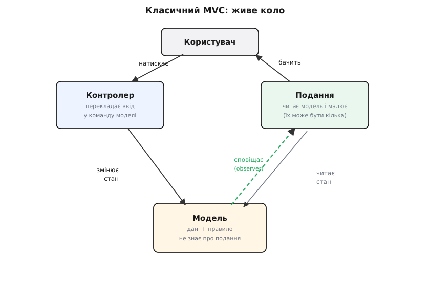
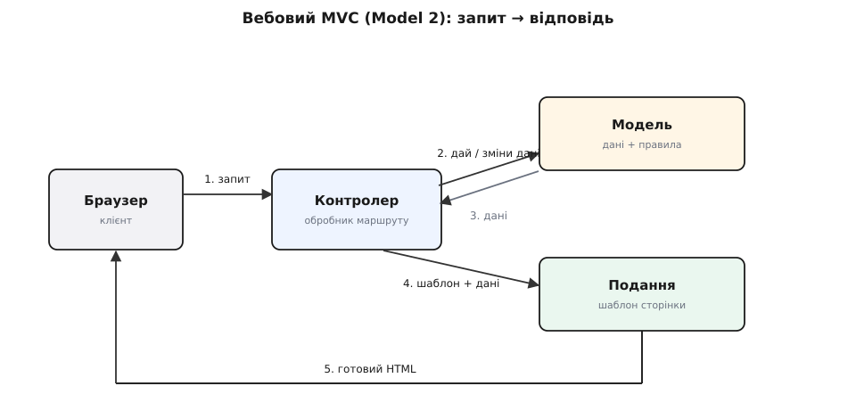
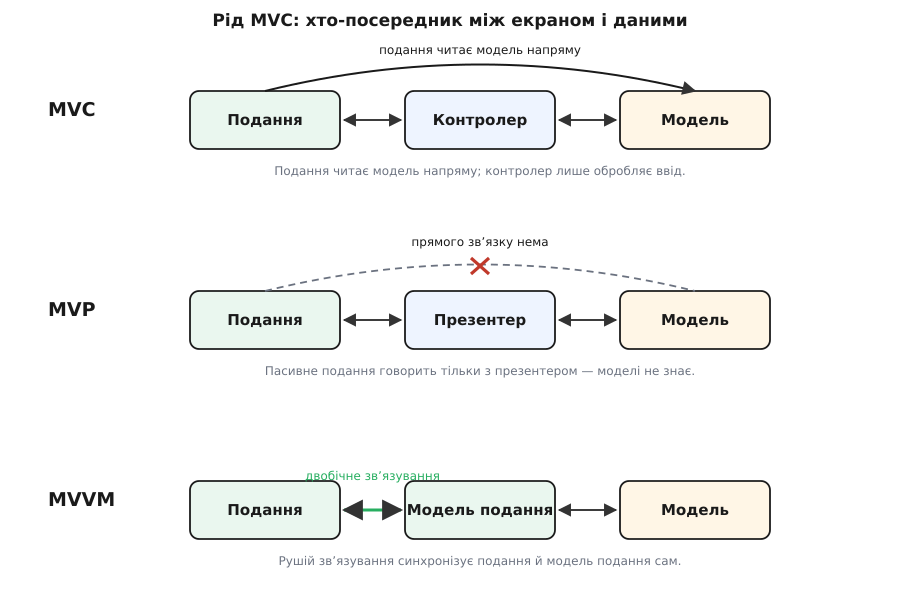

# Модель–подання–контролер (MVC)

<preknowlist>
- [Зчеплення і зв'язність](topic:programming/coupling-cohesion) — дві мірки залежності: скільки частини знають одна про одну і чи служить код усередині одній справі; MVC — це спосіб знизити зчеплення екрана з правилами.
- [Принцип єдиної відповідальності (SRP)](topic:programming/single-responsibility) — у кожної частини має бути одна причина змінюватися; MVC розводить три різні причини по трьох частинах.
- [Спостерігач](topic:programming/observer) — об'єкт сповіщає своїх «залежних» про зміну, не знаючи, хто вони; на цьому механізмі тримається зв'язок моделі з поданням у класичному MVC.
</preknowlist>

Візьмімо найпростіший застосунок з екраном — термостат. На екрані бажана температура, скажімо 22°. Дві кнопки, «+» і «−», піднімають і опускають її. Правило одне: нижче 5° і вище 30° не пускати. І ще одне: та сама температура має бути видна одразу у двох місцях — великою цифрою і кольоровою смужкою, що росте від синього до червоного.

Найшвидший спосіб це написати — обробник натискання «+», який робить усе сам. Він читає поточне число з поля на екрані, додає один, перевіряє, чи не більше тридцяти, вписує назад у поле, а тоді ще перемальовує смужку. Працює з першого разу. Але придивімося, що в цьому обробнику злиплося. У ньому сидить **правило предметної області** (межа 5–30). У ньому сидить **як саме число показано** (поле, смужка, кольори). І в ньому сидить **реакція на ввід** (яка кнопка що робить). Три різні речі в одному тілі.

Це не витримує першої ж зміни. Захотіли показати ту саму температуру ще й третім способом — колом-шкалою: доводиться лізти в обробник кнопки й дописувати туди перемалювання кола. Захотіли перевірити тестом, що межа 30° справді тримається: а нема як — правило живе всередині коду кнопки, і щоб його торкнутися, треба намалювати кнопку й натиснути її. Захотіли ту саму логіку термостата в мобільному застосунку, де екран зовсім інший: правило не віддерти від старого екрана, воно в нього вросло.

Корінь болю в тому, що три речі мають **три різні швидкості життя**. Вигляд екрана міняють часто — дизайнер приходить щомісяця. Правила («межа 5–30», «крок один градус») міняються рідко. А те, звідки береться натискання — миша, палець, голос — узагалі окрема історія. Склеїш їх в один шматок — і кожна дрібна зміна одного тягне ризик зачепити два інших.

MVC — найдавніша й найвідоміша відповідь на це склеювання саме **на краю з користувачем**. Вона каже: розкрій цей шматок на три частини за родом справи — що застосунок **знає**, як він це **показує** і як приймає **ввід** — і не давай їм знати одна про одну більше, ніж конче треба.

## Три частини

**Модель (model)** — те, що застосунок знає, і за якими правилами. Для термостата це число «бажана температура» плюс правило «тримати в межах 5–30». Не поле на екрані, не пікселі смужки — саме поняття температури та її закон. Модель — серце: заради неї програму й писали. І головне: **модель не знає, що існує якийсь екран**. У ній немає ні слова про кнопки, смужки чи кольори.

**Подання (view, від англ. *view* — вигляд)** — те, як модель показано оку. Велика цифра — це подання. Кольорова смужка — інше подання тієї самої моделі. Подання **читає** з моделі поточний стан і малює його; власних правил у нього нема — воно нічого не вирішує, лише відображає. Тому подань може бути кілька, і всі вони дивляться на одну модель.

**Контролер (controller, від англ. *control* — керувати)** — те, що перетворює ввід користувача на дії над моделлю. Натиснули «+» — контролер каже моделі «підніми температуру». Він не рахує межу сам (це робота моделі) і не малює (це робота подання) — він **тлумач**: переклав клік у команду моделі, і все.

Уся сила — в одному нерівноправ'ї стрілок. Контролер знає модель (гукає її). Подання знає модель (читає її). А **модель не знає ні того, ні того**. Саме це незнання й купує все інше: раз модель не дивиться на екран, той самий код температури обслужить і настільний застосунок, і мобільний, і нічний тест без жодного екрана; раз подання лише читає модель, їх можна повісити скільки завгодно, і кожне покаже те саме по-своєму.

Ось модель термостата — зверни увагу, що в ній немає жодного натяку на подання чи контролер:

:::tabs
```python
class Thermostat:                    # МОДЕЛЬ: дані + правило, і нічого про екран
    def __init__(self):
        self._target = 22
        self._observers = []         # хто хоче знати про зміни — не знаю хто саме

    @property
    def target(self):
        return self._target

    def nudge(self, delta):          # правило предметної області живе тут
        self._target = max(5, min(30, self._target + delta))
        for notify in self._observers:   # сповістити залежних, не знаючи, хто вони
            notify()

    def on_change(self, fn):
        self._observers.append(fn)
```
```ts
class Thermostat {                    // МОДЕЛЬ: дані + правило, і нічого про екран
  private _target = 22;
  private observers: (() => void)[] = [];   // хто хоче знати — не знаю хто саме

  get target() { return this._target; }

  nudge(delta: number) {              // правило предметної області живе тут
    this._target = Math.max(5, Math.min(30, this._target + delta));
    for (const notify of this.observers) notify();  // сповістити залежних
  }

  onChange(fn: () => void) { this.observers.push(fn); }
}
```
:::

Модель тримає число і закон (`max(5, min(30, …))`), а коли міняється — гукає всіх, хто підписався, жодного з них не називаючи. Це і є та сама механіка [спостерігача](topic:programming/observer): модель веде список «залежних» і шле їм сигнал «я змінилася», а хто вони — цифра, смужка чи тест — її не обходить. Подання підписується на цей сигнал, контролер лише смикає `nudge`.

## Як вони спілкуються: живе коло


*Живе коло. Модель не знає про подання — лише дзвонить у дзвіночок «я змінилася»; хто підписаний, той і біжить перечитати стан. Тому нове подання додається, ні рядка не міняючи в моделі.*

Простежмо одне натискання від початку до кінця. Користувач тисне «+». Контролер ловить цей клік і перекладає його в команду моделі: `nudge(+1)`. Модель піднімає температуру, тут же перевіряє свій закон межі — і, якщо число змінилося, **сповіщає залежних**. Кожне подання, почувши сигнал, іде й перечитує з моделі свіже число та перемальовує себе: цифра стає «23», смужка підростає. Користувач бачить обидва оновлення — і коло замкнулося.

Зверни увагу на дві різні стрілки між моделлю і поданням. Одна — **сповіщення** (модель → подання): «я змінилася», без подробиць. Друга — **читання** (подання → модель): почувши сигнал, подання само йде по свіжий стан. Модель не пхає поданню дані й навіть не знає, скільки їх там; вона лише дзвонить у дзвіночок, а вже хто підписаний — той і біжить дивитися. Через це нове подання додається, ні рядка не міняючи в моделі: підписався на дзвіночок — і ти в грі.

> 🔧 **Навіщо це.** Отут ховається справжня вигода MVC, а не в трьох гарних теках. Оскільки модель не знає про подання, її можна **перевірити тестом без жодного екрана** — створив термостат, смикнув `nudge` тридцять разів, переконався, що зупинився на 30. І оскільки подання лише підписані читачі, той самий термостат обслужить два, три, десять різних екранів — а завтра ще й голосовий інтерфейс — і в правилі не зрушиться нічого. Ти платиш дрібним ускладненням сьогодні за право дешево міняти екран і легко тестувати правила завтра.

## Те саме ім'я, інша роль: MVC у вебі

Тепер обережно, бо тут криється найбільша плутанина в усій темі. Коли сучасний вебпрограміст каже «MVC», він майже завжди має на увазі **не те**, що описано вище. Веб влаштований інакше: там нема живого екрана, що висить і слухає модель. Там є **запит і відповідь** — браузер шле запит, сервер один раз відповідає сторінкою, і на цьому все; наступна зміна — це наступний окремий запит.


*Однопрохідний конвеєр. Подання не висить і не слухає модель — його будують наново під кожну відповідь; модель нікого не сповіщає. Тому «контролер» тут — товщий за класичний: він і маршрут розбере, і модель гукне, і шаблон обере.*

Тому в вебі коло розгинається в **однопрохідний конвеєр**. Приходить запит «постав температуру 24». Контролер (тут це обробник маршруту) ловить його, гукає модель — перевір і збережи. Модель віддає результат назад контролеру. Контролер обирає **подання** — шаблон сторінки — і передає йому дані. Подання одноразово малює HTML, сервер шле його браузеру, і робота скінчилася. Ніхто нікого не «сповіщає»: подання не висить і не слухає модель, його щоразу будують наново під конкретну відповідь.

Ось чому «контролер» у Smalltalk і «контролер» у Rails чи Spring — це майже різні звірі під одним іменем. Класичний контролер був **тонким тлумачем вводу** миші й клавіатури. Вебконтролер — це **обробник запиту**: він і маршрут розбере, і модель гукне, і вирішить, який шаблон віддати. Він робить помітно більше, і саме тому в вебі так легко скотитися до «товстого контролера», куди помалу заповзають правила бізнесу.

Цю вебформу MVC не вигадали з чистого аркуша — її [історію](topic:programming/mvc/hist-mvc-birth.md) варто знати окремо: як ідея Трюгве Реенскауга з Xerox PARC 1978 року, задумана для живих екранів Smalltalk, через двадцять років перевтілилася в серверний «Model 2» для вебсторінок і змінила при цьому зміст слова «контролер».

## Куди правила класти не можна

MVC легко намалювати трьома теками й думати, що діло зроблено. Але сама розкладка нічого не гарантує — тримає її лише дисципліна, куди що писати. Дві помилки трапляються знову і знову.

Перша — **товстий контролер**. У контролер, замість тонкого перекладу, поволі заповзають правила: тут порахуємо знижку, там перевіримо ліміт, отут вирішимо, чи можна списати гроші. Кожне окремо здається дрібницею «саме тут доречною», а разом вони роблять контролер новим звалищем, з якого правила вже не витягти для тесту чи для іншого екрана — рівно та біда, від якої MVC мав урятувати, тільки переїхала з обробника кнопки в контролер. Правилам місце в моделі; коли їх багато й вони плетуть кілька моделей, між контролером і моделлю ставлять окремий [сервісний шар](topic:programming/service-layer), що диригує кроками сценарію, — але не в контролері.

Друга — **розумне подання**. Це та сама хвороба з іншого боку: у шаблон чи в код екрана залазить логіка — подання саме щось вирішує, рахує, а то й міняє модель. Подання має лишатися **читачем**: узяв стан, показав, і квит. Щойно воно почало вирішувати — його вже не підміниш іншим екраном, бо в ньому осіла унікальна логіка, якої в сусіда нема.

Є й третя, тонша пастка, що виростає з перших двох. Якщо всі правила стекли в контролери й сервіси, модель порожніє й перетворюється на голий мішок полів без поведінки — [анемічну модель](topic:programming/anemic-domain-model). Формально MVC ніби на місці, а по суті серце вирізали: «модель» більше нічого не знає й нічого не вирішує, і весь сенс щось навколо неї розкладати зникає.

> 🔧 **Навіщо це.** Просте мірило на щодень: якщо ти **не можеш перевірити головне правило застосунку, не піднявши екран** — правило лежить не там. Модель має бути перевірна в тиші, без жодного натискання; контролер — такий тонкий, що в ньому нема чого тестувати, крім «покликав кого треба»; подання — таке дурне, що в ньому нема логіки, яка могла б зламатися. Розповзання правил у контролер чи шаблон — це не питання смаку, а прямий податок на кожен майбутній тест і кожен новий екран.

Як виглядає розплутування такого зрослого обробника на охайні модель, тонкий контролер і подання-читач — крок за кроком, з робочим кодом — розібрано в [окремій проєктній вставці](topic:programming/mvc/proj-untangle-fat-controller.md).

## Рід MVC: презентер і модель подання

MVC — прабатько цілого роду, і його нащадки різняться одним: **хто сидить між екраном і даними й скільки подання дозволено знати**.


*Що змінюється вниз по роду — хто-посередник між екраном і даними й чи вільно поданню знати модель: від прямого читання (MVC) через повне посередництво (MVP) до автоматичного зв'язування (MVVM).*

У класичному MVC подання читає модель **напряму** — дивиться на неї і саме бере, що треба. Це зручно, але означає, що подання все ж трохи знає модель, а отже логіка легко перетікає туди-сюди.

**MVP — модель–подання–презентер** (presenter, від англ. *present* — подавати) відрізає цей прямий зв'язок. Подання стає **пасивним**: воно вже не дивиться на модель зовсім, а вміє лише дві речі — показати те, що дали, і сказати презентеру «мене торкнули». Усе між екраном і моделлю тепер тече через презентера. Виграш — подання геть дурне, а отже його легко підмінити фальшивкою в тесті; ціна — презентер стає багатослівним, бо мусить сам розкладати кожну дрібницю на екран. Механіку цього поділу веде стаття [про модель–подання–презентер](topic:programming/model-view-presenter).

**MVVM — модель–подання–модель подання** (від англ. *viewmodel* — модель для подання) робить крок далі й прибирає ручне розкладання **двобічним зв'язуванням** (data binding). З'являється модель подання — проміжний об'єкт, «форма даних, підігнана під екран»; а рушій зв'язування сам тримає екран і цю модель подання в синхроні: змінилося поле в моделі подання — поле на екрані оновилося без жодного рядка коду, і навпаки. На цьому стоять WPF, Angular, Vue. Ціна — магія зв'язування, яку, коли вона збоїть, важче простежити очима. Її розбирає стаття [про модель–подання–модель подання](topic:programming/model-view-viewmodel).

А сучасні компонентні бібліотеки штибу React ці межі знову розмивають: компонент — це і подання, і дрібка контролера в одному, а роль моделі бере окреме сховище стану. Слово «MVC» там уже майже не звучить — але сама вихідна думка жива й там: **тримати нарізно те, що застосунок знає, те, як він це показує, і те, як він приймає ввід**. Це і є [розділення відповідальностей](topic:programming/separation-of-concerns) — принцип, старший за будь-який із цих акронімів; вони лише різні способи провести ту саму межу.

## Що з цього лишається

За півстоліття рамки з трьох літер розмилися: контролер у вебі значить не те, що в Smalltalk; MVP і MVVM пересувають межі; компонентні бібліотеки їх стирають. Тому не варто заучувати MVC як святий припис «зроби рівно три теки». Варто взяти з нього те, що не старіє, — **єдине питання, на яке він першим дав гучну відповідь**: не давай тому, що застосунок знає, зростися з тим, як він це показує і як ловить ввід. Модель, перевірну без екрана; подання, які лише читають; тонку межу вводу — а вже як їх назвати й скільки їх буде, підкаже конкретний застосунок. Розділити ці три швидкості життя — ось тривка суть; [низьке зчеплення](topic:programming/coupling-cohesion) між ними — ось нагорода, заради якої все це затівалося.
