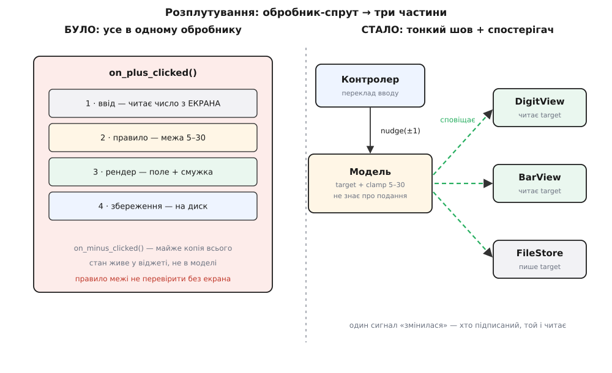
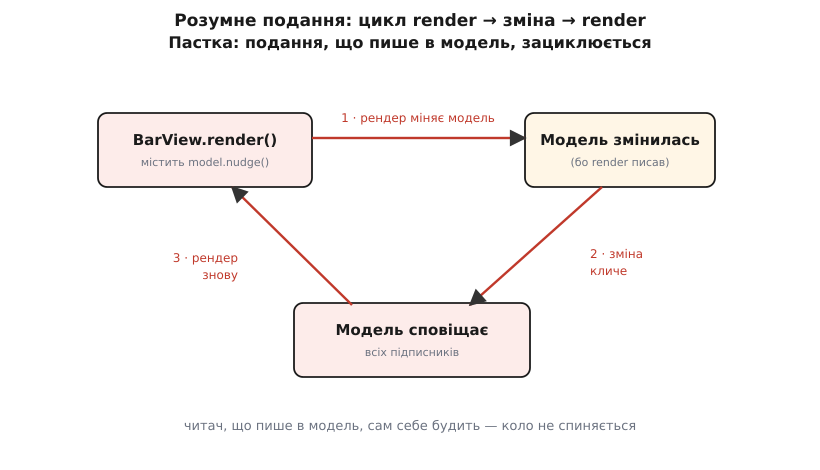

# ⚙️ Розплутуємо термостат: обробник-спрут → модель, тонкий контролер, подання-читач

Найшвидший спосіб написати екран термостата — обробник кнопки «+», який робить усе сам: читає число, перевіряє межу, малює й зберігає. Він працює з першого разу, і саме тому спокуса лишити його такою є найбільшою. Ця вставка бере цей обробник у його справжньому, робочому вигляді — і крок за кроком розплутує на три охайні частини, доводячи наприкінці головне: правило термостата стає перевірним у тиші, без жодного натискання.

Ми не переказуватимемо теорію трьох частин — ми **розчепимо зрослий код руками**. Пройдемо чотири кроки: витягнемо правило межі в модель; зведемо контролер до тонкого перекладу вводу; зробимо подання чистим читачем; підключимо два подання й ще збереження до однієї моделі через один сигнал зміни. А тоді назвемо дві пастки, у які найлегше скотитися назад, — товстий контролер і розумне подання — і покажемо їх теж робочим кодом, бо словами вони звучать очевидно, а в коді підкрадаються непомітно.

Приклад — той самий термостат: бажана температура зі стартом 22°, крок один градус, залізне правило «не нижче 5 і не вище 30», і два способи показати те саме число — велика цифра й кольорова смужка. Код вестимемо двома мовами вкладками: Python і TypeScript, кожну — ідіоматично, не транслітерацією однієї в іншу.

## Спрут: обробник, що робить усе

Ось той самий «швидкий» обробник у повний зріст. Дивись не на те, що він працює, а на те, **що в ньому злиплося**:

:::tabs
```python
# «Екран»: поточне число живе прямо у віджеті-полі. Модель? Її нема.
screen_target = 22          # ← джерело правди — саме поле на екрані
bar_widget = ""             # намальована смужка

def on_plus_clicked():
    global screen_target, bar_widget
    # 1) ВВІД+ЧИТАННЯ: беремо поточне число з ПОЛЯ на екрані
    current = screen_target
    # 2) ПРАВИЛО предметної області: підняти на 1, але не вище 30
    current = current + 1
    if current > 30:
        current = 30
    # 3) РЕНДЕР: вписати назад у поле і перемалювати смужку
    screen_target = current
    filled = round((current - 5) / (30 - 5) * 20)
    bar_widget = "█" * filled + "·" * (20 - filled)
    # 4) ЗБЕРЕЖЕННЯ: записати на диск
    with open("target.txt", "w") as fp:
        fp.write(str(current))

def on_minus_clicked():
    global screen_target, bar_widget
    current = screen_target
    current = current - 1
    if current < 5:                 # ← та сама логіка, лише межа інша
        current = 5
    screen_target = current
    filled = round((current - 5) / (30 - 5) * 20)   # ← і рендер скопійовано
    bar_widget = "█" * filled + "·" * (20 - filled)
    with open("target.txt", "w") as fp:             # ← і збереження скопійовано
        fp.write(str(current))
```
```ts
// «Екран»: поточне число живе прямо у віджеті-полі. Моделі нема.
let screenTarget = 22;      // ← джерело правди — саме поле на екрані
let barWidget = "";

function onPlusClicked(): void {
  // 1) ВВІД+ЧИТАННЯ: беремо поточне число з ПОЛЯ на екрані
  let current = screenTarget;
  // 2) ПРАВИЛО предметної області: підняти на 1, але не вище 30
  current = current + 1;
  if (current > 30) current = 30;
  // 3) РЕНДЕР: вписати назад у поле і перемалювати смужку
  screenTarget = current;
  const filled = Math.round((current - 5) / (30 - 5) * 20);
  barWidget = "█".repeat(filled) + "·".repeat(20 - filled);
  // 4) ЗБЕРЕЖЕННЯ: записати на диск
  fs.writeFileSync("target.txt", String(current));
}

function onMinusClicked(): void {
  let current = screenTarget;
  current = current - 1;
  if (current < 5) current = 5;              // ← та сама логіка, інша межа
  screenTarget = current;
  const filled = Math.round((current - 5) / (30 - 5) * 20);  // ← рендер скопійовано
  barWidget = "█".repeat(filled) + "·".repeat(20 - filled);
  fs.writeFileSync("target.txt", String(current));           // ← збереження скопійовано
}
```
:::

Придивімося, що тут насправді відбувається, бо код короткий, а хвороб у ньому чотири.

Перша й найглибша: **джерело правди — сам віджет**. Змінна `screen_target` — це не модель, це вміст поля на екрані. Число застосунку живе в елементі інтерфейсу; поза екраном термостата просто не існує. Тому й правило — рядок `if current > 30` — прибите цвяхами до кнопки: щоб до нього дотягтися, треба намалювати поле, натиснути кнопку й прочитати назад те саме поле.

Друга: **чотири різні справи в одному тілі**. Ввід (яка кнопка що робить), правило (межа 5–30), рендер (поле плюс смужка), збереження (запис на диск) — усе тут, одне за одним. Кожна з цих справ має свою швидкість життя й свого замовника, а склеєні вони так, що зачепити одну, не ризикнувши іншими, годі.

Третя: **дублювання**. `on_minus_clicked` — це майже посимвольна копія `on_plus_clicked`: та сама структура, лише `+1` замість `−1` і `< 5` замість `> 30`. Рендер і збереження скопійовані слово в слово. Захочеш змінити вигляд смужки — правитимеш у двох місцях і колись забудеш одне.

Четверта визирне при першій же новій вимозі: **додати третє подання неможливо, не чіпаючи кнопку**. Захотіли показати ту саму температуру ще й колом-шкалою — доведеться лізти в тіло обробника й дописувати туди перемалювання кола, поряд зі смужкою. Обробник кнопки стає місцем, куди зносять усе, що якось стосується температури.

Мета розплутування — не «зробити гарніше». Мета конкретна: винести правило межі туди, де його можна смикнути тестом без екрана, а рендер — туди, звідки його можна множити й підмінювати, не торкаючись ані правила, ані кнопки.



*Було й стало. Ліворуч усе злиплося в тілі кнопки, а число застосунку живе у віджеті. Праворуч правило й стан переїхали в модель; контролер лише перекладає натискання в `nudge`; а один сигнал «змінилася» годує два подання й ще збереження — і модель жодного з них не називає.*

## Крок 1 — правило й стан у модель

Почнемо з серця. Витягнемо з обробника те, що застосунок **знає** і за яким **законом**: число «бажана температура» і межу 5–30. Це й буде модель — і в ній не має бути ані слова про поле, смужку чи диск.

:::tabs
```python
class Thermostat:
    MIN, MAX = 5, 30

    def __init__(self, target=22):
        self._target = self._clamp(target)
        self._observers = []                 # хто хоче знати про зміни — не знаю хто

    @property
    def target(self):
        return self._target

    def nudge(self, delta):
        new = self._clamp(self._target + delta)
        if new == self._target:
            return                           # нічого не змінилось — нікого не турбуємо
        self._target = new
        for notify in self._observers:       # сповістити залежних, не називаючи їх
            notify()

    def on_change(self, fn):
        self._observers.append(fn)

    @staticmethod
    def _clamp(t):
        return max(Thermostat.MIN, min(Thermostat.MAX, t))
```
```ts
class Thermostat {
  static readonly MIN = 5;
  static readonly MAX = 30;

  #target: number;
  #observers: Array<() => void> = [];        // хто хоче знати — не знаю хто

  constructor(target = 22) {
    this.#target = Thermostat.clamp(target);
  }

  get target(): number { return this.#target; }

  nudge(delta: number): void {
    const next = Thermostat.clamp(this.#target + delta);
    if (next === this.#target) return;       // нічого не змінилось — нікого не турбуємо
    this.#target = next;
    for (const notify of this.#observers) notify();   // сповістити залежних
  }

  onChange(fn: () => void): void { this.#observers.push(fn); }

  private static clamp(t: number): number {
    return Math.max(Thermostat.MIN, Math.min(Thermostat.MAX, t));
  }
}
```
:::

Зверни увагу на три зважені рішення в цьому невеликому класі.

По-перше, **правило межі тепер в одному місці** — `_clamp`. І `+1`, і `−1`, і будь-який інший крок проходять через нього; більше нема двох копій `> 30` і `< 5`, розкиданих по двох обробниках. Одна межа — один рядок закону.

По-друге, `nudge` **мовчить, коли нічого не змінилося**. Ти на 30° і тиснеш «+» — `_clamp(31)` дає ті самі 30, і модель нікого не сповіщає. Це не косметика: зайве сповіщення змусило б обидва подання дарма перемалюватися, а на 30° їм нема що показувати нового. Ця дрібна перевірка `if new == self._target: return` відсікає цілий клас «а чому воно перемалювалось двічі» — і водночас коректно тримає межу, бо на краю сигналу просто нема.

По-третє, і головне: **модель веде список залежних, жодного з них не називаючи**. `on_change` приймає будь-яку функцію-слухача й кладе її в список; `nudge`, змінивши число, обходить список і смикає кожного. Хто ці слухачі — цифра, смужка, збереження чи тест — модель не знає й знати не хоче. Це і є механіка [спостерігача](topic:programming/observer): об'єкт розсилає своїм залежним сигнал «я змінилася», не маючи уявлення, хто вони. Саме на цьому незнанні триматиметься весь дальший виграш.

## Крок 2 — контролер до тонкого тлумача

Тепер обробник. У спрута він робив чотири справи; лишаємо йому рівно одну — **перекласти натискання в команду моделі**. Не рахувати межу (це вже робота `_clamp`), не малювати, не зберігати. Тільки тлумачити: яка кнопка — яка команда.

:::tabs
```python
class ThermostatController:
    def __init__(self, model):
        self._model = model

    def plus_clicked(self):
        self._model.nudge(+1)

    def minus_clicked(self):
        self._model.nudge(-1)
```
```ts
class ThermostatController {
  constructor(private readonly model: Thermostat) {}

  plusClicked(): void  { this.model.nudge(+1); }
  minusClicked(): void { this.model.nudge(-1); }
}
```
:::

Так, це майже весь контролер. І це не бідність — це мета. Уся дилема «а куди піде решта коду» вже розв'язана: правило пішло в модель, рендер піде в подання, збереження — в окремий слухач. Контролерові лишається переклад, і саме тому в ньому **нема чого ламатися й нема чого тестувати**, окрім факту «на плюс покликав `nudge(+1)`». Коли твій контролер виріс більший за це — щось, що мало жити деінде, заповзло в нього; до цього ми ще повернемось.

## Крок 3 — подання лише читає

Далі — те, **як** число показано оку. Було два способи (цифра й смужка) — робимо два подання, і кожне вміє рівно одне: узяти з моделі поточний стан і намалювати його. Жодних рішень, жодних правил, жодного запису назад у модель. Чистий читач.

:::tabs
```python
class DigitView:
    def __init__(self, model):
        self._model = model
        model.on_change(self.render)     # підписатися на сигнал зміни
        self.render()                    # намалюватися одразу, не чекаючи першої зміни

    def render(self):
        print(f"  {self._model.target}°")


class BarView:
    def __init__(self, model):
        self._model = model
        model.on_change(self.render)
        self.render()

    def render(self):
        t = self._model.target
        span = Thermostat.MAX - Thermostat.MIN
        filled = round((t - Thermostat.MIN) / span * 20)
        print("  " + "█" * filled + "·" * (20 - filled))
```
```ts
class DigitView {
  constructor(private readonly model: Thermostat) {
    model.onChange(() => this.render());   // підписатися на сигнал зміни
    this.render();                         // намалюватися одразу
  }

  render(): void {
    console.log(`  ${this.model.target}°`);
  }
}

class BarView {
  constructor(private readonly model: Thermostat) {
    model.onChange(() => this.render());
    this.render();
  }

  render(): void {
    const t = this.model.target;
    const span = Thermostat.MAX - Thermostat.MIN;
    const filled = Math.round((t - Thermostat.MIN) / span * 20);
    console.log("  " + "█".repeat(filled) + "·".repeat(20 - filled));
  }
}
```
:::

Кожне подання в конструкторі підписується на модель і одразу малюється вперше (щоб екран не був порожній до першого натискання), а далі просто чекає сигналу «змінилася», щоб перечитати `target` і перемалюватися. Обидва дивляться на **одне й те саме** число моделі — тому й показують узгоджене; неможливо, щоб цифра казала 23, а смужка малювала 24, бо джерело в них спільне.

Ось як `BarView` перетворює число на смужку — на конкретному значенні:

```
Смужка для target = 23 (межі 5..30, усього 20 блоків):
  частка = (23 − 5) / (30 − 5) = 18 / 25 = 0.72
  блоків = round(0.72 · 20) = round(14.4) = 14
  малюнок = ██████████████······   (14 повних + 6 порожніх)
```

Уся ця арифметика — суто **як показати**, і живе вона там, де їй місце: у смужці. Цифрове подання про неї нічого не знає й не мусить; воно показує те саме число інакше. Захочеш третє подання, коло-шкалу, — напишеш `DialView` за тим самим зразком (підписався, малюєш `target` по-своєму) і **ні рядка не зміниш ні в моделі, ні в контролері, ні в сусідніх поданнях**. Ось чого не було у спрута, де третій вид довелося б вписувати в тіло кнопки.

## Крок 4 — два подання й збереження на одну модель

Тепер зберемо все докупи — і тут стане видно, навіщо була вся морока зі списком безіменних слухачів. Лишилася четверта справа спрута — **збереження**. Куди її? Не в контролер (він тлумач) і не в подання (воно читач). Збереження реагує на зміну стану так само, як подання, — тож зробімо його ще одним підписником на той самий сигнал:

:::tabs
```python
from pathlib import Path

class FileStore:
    def __init__(self, model, path):
        self._model = model
        self._path = path
        model.on_change(self.save)       # той самий сигнал, що й у подань

    def save(self):
        Path(self._path).write_text(str(self._model.target))


# ── збірка: усе сходиться на одній моделі ──
model = Thermostat(22)
digit = DigitView(model)                 # підписник 1
bar   = BarView(model)                   # підписник 2
store = FileStore(model, "target.txt")   # підписник 3
controller = ThermostatController(model)

controller.plus_clicked()   # 22 → 23: обидва подання перемалювались, файл записався
```
```ts
import * as fs from "node:fs";

class FileStore {
  constructor(private readonly model: Thermostat, private readonly path: string) {
    model.onChange(() => this.save());   // той самий сигнал, що й у подань
  }

  private save(): void {
    fs.writeFileSync(this.path, String(this.model.target));
  }
}

// ── збірка: усе сходиться на одній моделі ──
const model = new Thermostat(22);
const digit = new DigitView(model);              // підписник 1
const bar   = new BarView(model);                // підписник 2
const store = new FileStore(model, "target.txt"); // підписник 3
const controller = new ThermostatController(model);

controller.plusClicked();   // 22 → 23: обидва подання перемалювались, файл записався
```
:::

Простежмо одне натискання наскрізь. Користувач тисне «+» → контролер перекладає це в `model.nudge(+1)` → модель піднімає число до 23, перевіряє свій закон межі й, бо число змінилося, **шле один сигнал** «я змінилася» → цей сигнал будить усіх трьох підписників: `DigitView` перечитує й друкує «23°», `BarView` перечитує й домальовує блок, `FileStore` перечитує й пише «23» у файл. Коло замкнулося, а модель за весь цей час **не назвала жодного з трьох**.

> 🔧 **Навіщо це.** Ось де ховається справжня нагорода, і вона більша, ніж «код розкладено охайніше». Оскільки модель шле безіменний сигнал, до нього можна підвісити скільки завгодно реакцій, не змінивши в моделі ні рядка: два подання сьогодні, третє завтра, збереження, а поряд — журнал змін, телеметрія, синхронізація з хмарою. Усі вони — просто підписники на одне «змінилася». Спрут мусив би тримати виклик кожної такої реакції у власному тілі й рости з кожною новою; тут модель лишається незворушною, бо не знає й не хоче знати, хто її слухає.

Одне чесне застереження про збереження як підписника. Так `FileStore` пише на диск **при кожному** `nudge` — а якщо користувач швидко клацає «+», це низка записів поспіль. Для термостата дрібниця, але як прийом варто знати межу: коли реакція повільна (диск, мережа) або часта, її не лишають синхронним підписником, що блокує натискання, а відкладають — коалесують кілька змін в один запис через невелику паузу (debounce) чи виносять у фонову чергу. А коли зберегти треба не одну модель, а звести кілька разом в один сценарій, оркестрацію виносять не в підписник і не в контролер, а в окремий [сервісний шар](topic:programming/service-layer). Механіка спостерігача дає шов; що на нього вішати й наскільки важке — окреме рішення.

## Виграш: правило перевіряється без екрана

Тепер — те, заради чого все затівалося. У спрута перевірити, що межа 30° справді тримається, було ніяк: правило сиділо в тілі кнопки, і щоб його торкнутися, треба було намалювати кнопку й натиснути. Тепер правило живе в моделі, а модель **не знає, що існує якийсь екран**. Отже, її можна смикнути тестом у повній тиші:

:::tabs
```python
def test_rule_holds_without_a_screen():
    m = Thermostat(29)
    m.nudge(+1)          # 30
    m.nudge(+1)          # спроба 31 → лишається 30
    m.nudge(+1)          # знову 30
    assert m.target == 30          # верхня межа тримається — БЕЗ віджета

def test_lower_bound():
    m = Thermostat(6)
    m.nudge(-1); m.nudge(-1); m.nudge(-1)
    assert m.target == 5           # нижня межа тримається

def test_both_views_react_to_one_change():
    m = Thermostat(22)
    seen = []
    m.on_change(lambda: seen.append(("подання-А", m.target)))
    m.on_change(lambda: seen.append(("подання-Б", m.target)))
    m.nudge(+1)
    assert seen == [("подання-А", 23), ("подання-Б", 23)]   # обидва почули одну зміну

def test_no_signal_when_nothing_changes():
    m = Thermostat(30)
    fired = []
    m.on_change(lambda: fired.append(1))
    m.nudge(+1)                    # на межі: число не змінилось
    assert fired == []             # зайвого сповіщення нема
```
```ts
test("правило тримається без екрана", () => {
  const m = new Thermostat(29);
  m.nudge(+1);   // 30
  m.nudge(+1);   // спроба 31 → лишається 30
  m.nudge(+1);   // знову 30
  expect(m.target).toBe(30);           // верхня межа тримається — БЕЗ віджета
});

test("нижня межа тримається", () => {
  const m = new Thermostat(6);
  m.nudge(-1); m.nudge(-1); m.nudge(-1);
  expect(m.target).toBe(5);
});

test("обидва подання реагують на одну зміну", () => {
  const m = new Thermostat(22);
  const seen: Array<[string, number]> = [];
  m.onChange(() => seen.push(["подання-А", m.target]));
  m.onChange(() => seen.push(["подання-Б", m.target]));
  m.nudge(+1);
  expect(seen).toEqual([["подання-А", 23], ["подання-Б", 23]]);  // обидва почули
});

test("на межі зайвого сигналу нема", () => {
  const m = new Thermostat(30);
  const fired: number[] = [];
  m.onChange(() => fired.push(1));
  m.nudge(+1);                          // число не змінилось
  expect(fired).toEqual([]);
});
```
:::

Прожиймо перший тест на пальцях, щоб побачити, що саме він ловить:

```
Модель, старт 29, тричі «+»:
  nudge(+1): clamp(29+1) = 30  → 30 ≠ 29, змінилось, сповістити
  nudge(+1): clamp(30+1) = 30  → 30 = 30, нічого не робимо
  nudge(+1): clamp(30+1) = 30  → 30 = 30, нічого не робимо
  target = 30 — і жодного разу не знадобився екран
```

Це і є перевірність у тиші — одна з наріжних [тактик тестовності](topic:programming/testability-tactics): щоб перевірити головне правило застосунку, не треба піднімати інтерфейс. Зверни увагу й на третій тест: він перевіряє **шов**, а не правило. Замість справжніх подань ми підписуємо дві крихітні функції-записувачі й переконуємося, що одне натискання розбудило обох з правильним числом. Такий записувач — це [тест-двійник](topic:programming/testability-tactics/proj-test-doubles.md) справжнього подання: він удає слухача рівно настільки, щоб зафіксувати, що сигнал дійшов. Ми перевірили механіку спостерігача, не намалювавши жодного пікселя.

Порахуймо різницю чесно. У спрута тестів на правило межі — **нуль**, бо правило невіддільне від віджета. Тут — рівно стільки, скільки треба, і кожен біжить за мілісекунди без екрана. Це й був сенс розплутування: не три гарні класи, а можливість спитати код «чи тримаєш ти межу?» — і дістати відповідь, не піднімаючи інтерфейс.

## Пастка перша — товстий контролер

Розклали код правильно — а тепер подивімося, як він **сповзає назад**, тихо й по рядку. Перша хвороба заводиться в контролері. Приходить дрібна вимога, і найближче, найзручніше місце для неї — обробник, який уже «під рукою» ловить натискання. Крок за кроком туди заповзає те, що звідти щойно винесли:

:::tabs
```python
# ПАСТКА — товстий контролер: у переклад вводу знову залізли правило, читання екрана, рендер і запис
class ThermostatController:
    def plus_clicked(self):
        t = self._digit_view.read_number()   # ← читає стан З ЕКРАНА, не з моделі
        if t < 30:                            # ← ПРАВИЛО межі — знову тут!
            t += 1
        self._model.set_target(t)             # ← модель зведена до сетера-мішка
        self._bar_view.redraw(t)              # ← контролер сам МАЛЮЄ
        self._store.save(t)                   # ← і сам ЗБЕРІГАЄ
```
```ts
// ПАСТКА — товстий контролер: у переклад вводу знову залізли правило, читання екрана, рендер і запис
class ThermostatController {
  plusClicked(): void {
    let t = this.digitView.readNumber();  // ← читає стан З ЕКРАНА, не з моделі
    if (t < 30) t += 1;                   // ← ПРАВИЛО межі — знову тут!
    this.model.setTarget(t);              // ← модель зведена до сетера-мішка
    this.barView.redraw(t);               // ← контролер сам МАЛЮЄ
    this.store.save(t);                   // ← і сам ЗБЕРІГАЄ
  }
}
```
:::

Придивись — це той самий спрут, тільки перевдягнений у клас із гордим іменем «Контролер». Правило межі `if t < 30` повернулося в обробник. Стан знову читають з екрана (`read_number`), а не з моделі, — отже, джерело правди знову у віджеті. А модель виродилася: у неї відібрали `nudge` з його законом і лишили голий `set_target` — сетер, який покірно бере будь-яке число, навіть 31, бо перевіряти вже не його робота. Модель стала [анемічним мішком полів](topic:programming/anemic-domain-model) без поведінки: формально вона є, а по суті нічого не знає й нічого не вирішує.

І розплата та сама, від якої тікали: спробуй тепер перевірити тестом, що межа 30° тримається. Не вийде — правило знову за кнопкою й читанням екрана; щоб його торкнутися, треба `digit_view`, `bar_view`, `store` і клік. Уся перевірність у тиші, яку ми щойно купили, згоріла в одному «зручному» обробнику.

Мірило, що ловить цю пастку рано, просте:

```
Тест контролера на товщину:
  Чи є в методі контролера рядок, що ВИРІШУЄ (порівнює, рахує, обмежує),
  ЧИТАЄ стан з екрана або МАЛЮЄ?
    так → правило/рендер просочилися в контролер. Правило → у модель
          (nudge/clamp), рендер → у подання. У контролері лиши тільки
          переклад «яка кнопка → яка команда моделі».
    ні  → контролер тонкий: тестувати нема чого, крім «покликав кого треба».
```

Тонкий контролер `plus_clicked` з кроку 2 проходить цей тест з першого разу: у ньому один рядок — `nudge(+1)` — і жодного «вирішує». Щойно в ньому з'явився `if`, порівняння чи `redraw` — правило або рендер уже сповзли туди, де їм не місце.

## Пастка друга — розумне подання

Друга хвороба нападає з іншого боку — на подання. Читач потроху розумнішає: спершу «трохи підправить» показане число, потім сам щось вирішить, а зрештою — і моделі торкнеться. Ось як це виглядає в коді:

:::tabs
```python
# ПАСТКА — розумне подання: у читача залізла логіка й навіть запис у модель
class BarView:
    def render(self):
        t = self._model.target
        if t > 28:                       # ← подання САМО «підправляє» число під себе
            t = 28
        if self._model.target >= Thermostat.MAX:   # ← подання ВИРІШУЄ політику
            self._model.nudge(-1)                  # ← і МІНЯЄ модель — читач став писарем
        span = Thermostat.MAX - Thermostat.MIN
        filled = round((t - Thermostat.MIN) / span * 20)
        print("  " + "█" * filled + "·" * (20 - filled))
```
```ts
// ПАСТКА — розумне подання: у читача залізла логіка й навіть запис у модель
class BarView {
  render(): void {
    let t = this.model.target;
    if (t > 28) t = 28;                          // ← подання САМО «підправляє» число
    if (this.model.target >= Thermostat.MAX) {   // ← подання ВИРІШУЄ політику
      this.model.nudge(-1);                      // ← і МІНЯЄ модель — читач став писарем
    }
    const span = Thermostat.MAX - Thermostat.MIN;
    const filled = Math.round((t - Thermostat.MIN) / span * 20);
    console.log("  " + "█".repeat(filled) + "·".repeat(20 - filled));
  }
}
```
:::

Два різні лиха в одному тілі, і обидва варто назвати окремо.

Перше — подання **завело власне правило**. Рядок `if t > 28: t = 28` — це рішення про політику («не показувати вище 28»), якого нема ні в моделі, ні в цифрового подання. Тепер два подання **розходяться в тому, що таке температура**: цифра чесно показує 30, а смужка обрізає до 28. Джерело правди роздвоїлося. І підмінити смужку іншим екраном уже не можна безкарно: у ній осіла унікальна логіка, якої в сусіда нема, — забереш смужку, забереш і це правило разом з нею.

Друге, гірше — подання **пише в модель**. `self._model.nudge(-1)` усередині `render` перетворює читача на писаря, і тут визріває справжня біда: **цикл, що не спиниться**. Рендер міняє модель → модель шле сигнал «змінилася» → сигнал будить підписників, серед них цей самий `render` → `render` знову міняє модель → знову сигнал… Подання само себе будить по колу.



*Коло, що не спиниться. Щойно `render` пише в модель, він опиняється в петлі зворотного зв'язку: його ж запис породжує сигнал, що знову кличе `render`. Читач, який пише, будить сам себе — і застосунок або зависає, або мерехтить.*

Наш `Thermostat` цю петлю трохи пригальмовує тим, що `nudge` мовчить, коли число не змінилося, — на самій межі 30 сигналу вже не буде. Але покладатися на це не можна: досить розумному поданню міняти щось, що змінюється щоразу, — і петля закрутиться на повну. Лікування не в тому, щоб «обережно писати з подання», а в тому, щоб **не писати з нього взагалі**. Подання читає — і квит.

Мірило-близнюк до контролерного:

```
Тест подання на розум:
  Чи є в render() рядок, що ВИРІШУЄ (порівнює, обмежує, обирає політику)
  або МІНЯЄ модель?
    так → логіка осіла в поданні. Рішення → у модель; подання лиши читачем:
          «взяв model.target, намалював, і квит».
    ні  → подання дурне: його можна підмінити будь-яким іншим екраном.
```

Чистий `BarView` з кроку 3 проходить його: у `render` нема жодного `if`-рішення й жодного дотику до моделі — тільки арифметика «як намалювати» й друк. Саме тому його можна викинути й замінити колом-шкалою, нічого не зламавши.

## Що з цього лишається

Розплутування спрута — це не разова прибирачка, а зміна того, **куди тепер сама собою хоче лягати кожна нова вимога**. Поки правило в моделі, контролер тонкий, а подання дурні — наступна вимога має очевидну адресу: нове правило → в модель, нова реакція → ще один підписник, новий вид → ще одне подання. І кожна з цих адрес відкрита для розширення, не чіпаючи сусідів.

Обидві пастки, товстий контролер і розумне подання, — це одна й та сама хвороба з двох боків: **правило чи стан утекли з моделі туди, де їх не перевірити без екрана**. Тому й мірило на щодень одне, і воно точніше за будь-яку діаграму з трьох тек: якщо ти не можеш спитати код «чи тримаєш ти головне правило?» і дістати відповідь **без жодного натискання** — правило лежить не там, і жодна охайність тек цього не сховає. Модель, перевірну в тиші; контролер, у якому нема чого тестувати; подання, у якому нема логіки, що могла б зламатися, — ось що ми зібрали руками, і ось лінійка, якою вимірюють, чи не розповзається воно назад.
