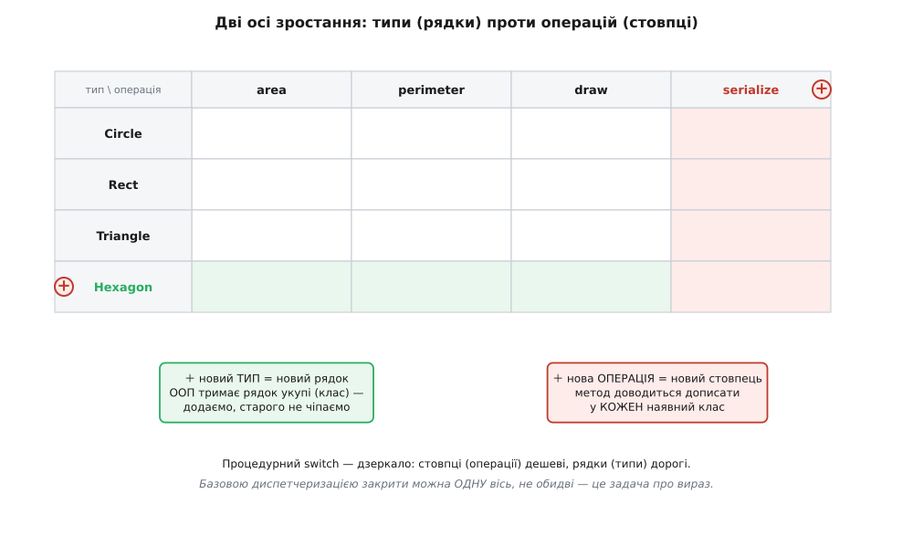
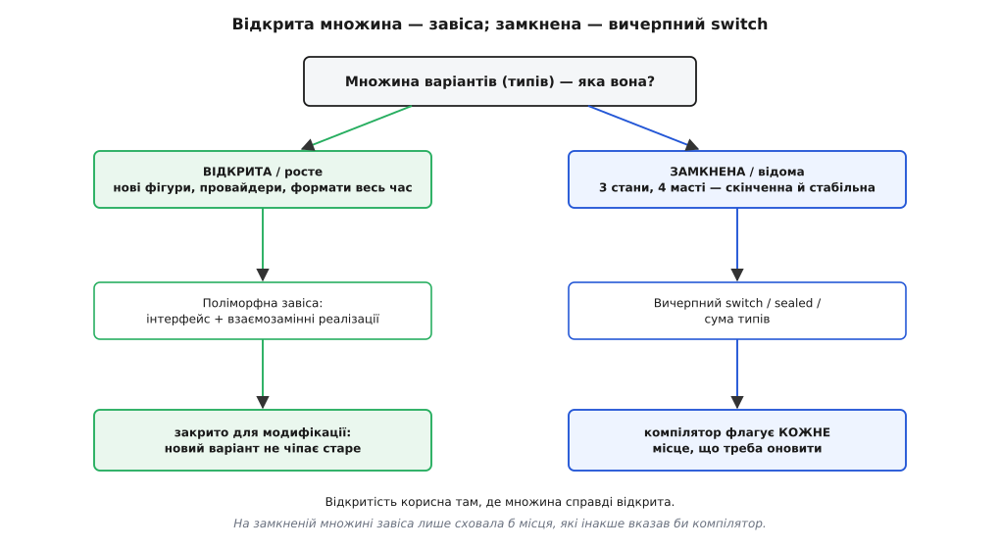

# Принцип відкритості-закритості (OCP)

<preknowlist>
- [Зчеплення і зв'язність](book:programming/coupling-cohesion) — наскільки одна частина коду залежить від іншої; дешева зміна — та, що не тягне за собою правок деінде.
- [Інтерфейс проти реалізації](book:programming/interface-vs-implementation) — контракт (що обіцяно) окремо від того, як саме він виконаний; клієнт бачить лише контракт.
- [Поліморфізм і динамічне зв'язування](book:programming/polymorphism) — один виклик через спільний тип дає різну поведінку залежно від конкретного об'єкта за ним, і рішення «яку» ухвалюється в момент виклику.
- [Принцип підстановки Лісков (LSP)](book:programming/liskov-substitution) — будь-яку реалізацію за спільним типом можна підставити замість іншої, не зламавши того, хто на тип спирається.
- [YAGNI, DRY і KISS](book:programming/dry-kiss-yagni) — не будувати гнучкість наперед, поки її ніхто не просить; вартість передчасної абстракції.
</preknowlist>

Кожна система за своє життя міняється багато разів, і кожна зміна лягає в один із кількох напрямів: то додається новий вид сутності, то нова дія над старими сутностями, то новий канал вводу-виводу, то нове правило поверх наявних. Ці напрями — незалежні. Можна двадцять разів додавати нові фігури й жодного разу — нову операцію над ними; можна навпаки. І ось спостереження, з якого росте весь принцип: **вартість зміни залежить не від того, скільки коду вона додає, а від того, скільки наявного коду змушує редагувати**. Дописати новий файл, який ще ніхто не викликає, — дешево й безпечно. Влізти в функцію, від якої залежать десять інших, — дорого й страшно, бо кожна правка в перевіреному коді відкриває нову шпарину для помилки саме там, де її не було.

Принцип відкритості-закритості (англ. *open-closed principle*, OCP) — це вимога так вибудувати структуру, щоб зростання вздовж **обраного напряму** коштувало «дописати новий код», а не «переписати старий». Формулювання звучить парадоксом: **програмна одиниця має бути відкрита для розширення, але закрита для модифікації**. Парадокс знімається, щойно помічаєш, що це про дві різні речі: закрита — з боку того, хто вже нею користується (її контракт стоїть непорушно), відкрита — з боку того, хто прибудовує нову можливість збоку, не чіпаючи закритого тексту. Лишається розібрати, як саме ця закритість влаштована зсередини, де вона тримається, де протікає, і чому вона фундаментально не буває ні безкоштовною, ні всебічною.

## Що означає «закрито», якщо казати точно

Слово «закрито» в побутовій мові звучить абсолютно — наче код узагалі не міняється. Це неправильна картина, і саме вона плодить плутанину. Точне означення завжди відносне до **класу змін**.

> Модуль M **закритий проти класу змін C**, якщо будь-яку зміну з C можна задовольнити, **не редагуючи вихідний текст M**.

Ключове тут — «проти C». Абсолютної закритості не існує: не можна побудувати код, незворушний до всіх мислимих правок. Якщо система вміє рахувати площу фігур, її можна попросити додати фігуру, додати операцію (периметр), змінити спосіб виводу, змінити одиниці виміру — це різні класи змін, різні напрями. Закритися проти **всіх** одразу неможливо; можна вибрати **один** напрям і закритися саме проти нього. Цей напрям я далі називатиму **віссю змін**.

Що технічно потрібно, щоб клієнт був закритий проти зміни «зʼявився новий варіант поведінки B»? Розкладімо на дві необхідні умови, бо кожну легко проґавити окремо.

**Перша умова — клієнт залежить лише від абстракції B, не від конкретного варіанта.** Якщо в тілі клієнта є `if (kind == CIRCLE) …`, то згадка про конкретний різновид **вшита** в клієнта, і новий різновид неминуче змусить це тіло редагувати. Абстракція (абстрактний тип, інтерфейс) — це те, що прибирає з клієнта будь-яку згадку про конкретику: клієнт знає операцію `area()`, але не знає й не питає, хто за нею стоїть. Це рівно [відділення інтерфейсу від реалізації](book:programming/interface-vs-implementation), доведене до того, що клієнт не бачить жодної реалізації взагалі.

**Друга умова — вибір конкретного варіанта відбувається в одній точці поза клієнтом.** Абстракції замало: хтось же мусить створити конкретний `Triangle` і подати його клієнтові. Якщо це «хтось» — сам клієнт (`new Triangle()` у його тілі), то згадка про конкретику просто переповзла з `if` у `new`, і клієнт знову не закритий. Отже, створення конкретних варіантів треба винести в **єдину точку збірки** — окреме місце, куди стікаються всі рішення «який саме об'єкт». Це місце (його називають кореневою збіркою, composition root, або ховають за [фабрикою](book:programming/factory-method)) — єдине, що редагується, коли додається варіант; воно свідомо лишається **не закритим**, бо саме воно й знає повний список. Уся решта коду залишається незрушною.

```
Закрито проти «нового варіанта B»  ⟺
    (1) клієнт залежить від абстракції A, не від жодного конкретного B
  ∧ (2) вибір конкретного B зосереджено в одній точці поза клієнтом
```

Обидві умови разом дають те, що можна назвати **завісою** (точкою варіації, англ. *point of variation*). Стала частина спирається на завісу згори; змінні реалізації висять під нею знизу; єдина точка збірки вирішує, яку саме реалізацію підвісити. Уся конструкція існує тільки для того, щоб одну сторону лишити нерухомою, поки друга росте.

> 🔧 **Навіщо це.** Перевіряти закритість треба **обома** умовами, бо друга ламається тихцем. Класична пастка: команда акуратно завела інтерфейс `PaymentProvider` (умова 1 виконана), а конкретного провайдера кожен сервіс створює сам через `new StripeProvider()` розкидано по десяти файлах (умова 2 порушена). Формально абстракція є, а закритості немає: новий провайдер тягне правку в десяти місцях. Завіса тримається рівно там, де виконані **обидві** умови, — і не тримається ніде інде.

## Дві історичні прочитки і чому механізм успадкування протікає

Одні й ті самі слова про «відкрито/закрито» позначали дві досить різні конструкції, і різниця між ними — не історична дрібниця, а суть того, чому OCP у сучасному вигляді спирається на абстракцію, а не на успадкування коду.

Термін увів Бертран Меєр (Bertrand Meyer) 1988 року. У нього «закрито» мало майже механічний сенс: клас скомпільовано, покладено в бібліотеку, клієнти з ним злінковані — редагувати його не можна, бо це змусило б перезбирати й переперевіряти всіх залежних. А «відкрито» означало конкретний механізм: **успадкуйся від класу і додай/переоприділи потрібне в нащадку**. Клас закритий (його не чіпають), але відкритий через дітей.

Роберт Мартін (Robert C. Martin) у 1990-х переосмислив принцип: не успадкування реалізації, а **абстрактний інтерфейс**, за яким ховаються взаємозамінні реалізації. Клієнт залежить від чистої абстракції; конкретні реалізації нічого не успадковують одна від одної й від клієнта — вони лише виконують контракт. Саме ця, поліморфна версія й увійшла в SOLID. [Як формулювання пройшло цей шлях і чому поліморфна прочитка витіснила успадкувальну](book:programming/open-closed/hist-ocp-meyer-martin.md) — окрема історія; тут важливий інженерний висновок: **успадкування реалізації як механізм закритості протікає**, і варто побачити, де саме.

Уяви базовий клас, що рахує додавання елементів, і нащадка, що додає до нього журналювання:

:::tabs
```java
class CountingList<T> {
    protected int count = 0;
    void add(T x)              { count++; store(x); }
    void addAll(List<T> xs)    { for (T x : xs) add(x); }   // ← базова реалізація гукає власний add()
}

class LoggingList<T> extends CountingList<T> {
    @Override void add(T x)           { log(x);        super.add(x); }
    @Override void addAll(List<T> xs) { log("batch");  super.addAll(xs); }  // super.addAll → this.add → знову log(x)
}
```
```ts
class CountingList<T> {
  protected count = 0;
  add(x: T): void        { this.count++; this.store(x); }
  addAll(xs: T[]): void  { for (const x of xs) this.add(x); }  // ← базова реалізація гукає власний add()
}

class LoggingList<T> extends CountingList<T> {
  override add(x: T): void       { this.log(x);       super.add(x); }
  override addAll(xs: T[]): void { this.log("batch"); super.addAll(xs); }  // super.addAll → this.add → знову log(x)
}
```
:::

`addAll` тепер журналює двічі: один раз як пакет, і ще раз кожен елемент — бо `super.addAll` усередині гукає `add`, а `add` у нащадку перевизначений. Автор нащадка не міг цього передбачити: те, що `addAll` реалізовано **через** `add`, — внутрішня деталь базового класу, якої в контракті немає. І симетрична біда: якщо автори бази «оптимізують» `addAll`, щоб той більше не гукав `add`, нащадок **тихо втратить** журналювання елементів, хоч його власний код не змінився ні на символ. Це **проблема крихкого базового класу** (англ. *fragile base class*): нащадок зчеплений не з контрактом предка, а з його нутром, з послідовністю внутрішніх викликів.

Ось у чому глибша поразка успадкувального OCP. Обіцяли закритість для модифікації — а виходить, що редагування базового класу (навіть заради виправлення чи прискорення) ламає розширення. Розширення й модифікація, які принцип обіцяв розчепити, знову зчеплені — тепер через успадкування реалізації. До того ж клієнт, що тримає посилання на базовий тип і сподівається підставляти нащадків, спирається на [підстановність за Лісков](book:programming/liskov-substitution): нащадок, що підсилив передумову або послабив постумову, зламає клієнта мовчки. Успадкування коду тягне за собою обидва ці ризики одразу.

Поліморфна версія їх зрізає. Коли `Circle` і `Triangle` лише **реалізують** спільний інтерфейс `Shape`, вони не поділяють жодного рядка реалізації — тільки контракт. Немає нутра предка, за яке можна зачепитися; немає успадкованої поведінки, яку можна ненавмисно порушити. Тому сучасне OCP — це радше [композиція за інтерфейсом, ніж успадкування](book:programming/composition-inheritance): завіса будується на чистій абстракції, а не на батьківському класі з кодом усередині. Меєрова інтуїція лишилася правильною; переміг інший механізм її втілення.

## Механізми завіси і час зв'язування

«Абстракція + єдина точка вибору» — це схема, а не одна конкретна конструкція. Механізмів, якими будують завісу, багато, і відрізняються вони насамперед **часом зв'язування** (англ. *binding time*) — моментом, коли фіксується, який саме варіант стоятиме за абстракцією. Що пізніше цей момент, то більша відкритість (варіант можна додати, не перезбираючи), але й дорожче непрямування.

**Віртуальна диспетчеризація (абстрактний клас, таблиця віртуальних методів).** Класика ООП: клієнт викликає метод через інтерфейс, а конкретна реалізація вибирається за прихованим вказівником у таблиці методів об'єкта. Множина типів відкрита (нових реалізацій можна додати скільки завгодно), але кожен виклик — непрямий: процесор іде за вказівником, вбудовування (inline) неможливе. Для переважної більшості коду ця ціна невидима.

**Параметричний поліморфізм (шаблони, generics).** Тут завіса будується на етапі компіляції: код пишеться проти абстрактного параметра-типу, а компілятор породжує окрему монорфізовану версію під кожен конкретний тип. Непрямого виклику немає взагалі — виходить [абстракція без витрат часу виконання](book:programming/zero-cost-abstractions). Плата інша: множина варіантів має бути відома на етапі збірки, у рантаймі новий тип уже не підставиш. Це завіса для тих осей, де відкритість потрібна розробникові, а не працюючій програмі.

**Функція як значення.** Найлегша завіса: передати поведінку [функцією першого класу](book:programming/first-class-functions). Клієнт приймає `(x) => …` і викликає її, не знаючи, що всередині. Підставити іншу поведінку — це подати інше замикання, будь-коли в рантаймі. Коли поведінка одноразова й безстанова, це чистіше за окремий клас; коли за нею стоїть стан і кілька операцій — тоді доречніший інтерфейс. У об'єктному оформленні той самий прийом — це [патерн «Стратегія»](book:programming/strategy): взаємозамінна поведінка за спільним інтерфейсом, упроваджена ззовні.

**Таблиця диспетчеризації (реєстр).** Замість віртуальних методів — масив чи словник «ключ → обробник», яким ходить закритий цикл-диспетчер. Новий вид — це **дописаний рядок** у таблиці плюс написаний обробник; цикл не редагується. Зв'язування зсувається на старт застосунку (таблицю наповнюють під час ініціалізації), і завіса стає data-driven — її поведінку визначають дані, а не гілки коду. [Робочий рушій знижок на чистому C, де таблиця вказівників на функції закриває диспетчер, а новий вид знижки додається реєстрацією рядка](book:programming/open-closed/proj-extensible-dispatch.md) показує цей механізм там, де віртуальних методів немає в мові взагалі.

**Плагіни.** Та сама таблиця, але наповнена **під час завантаження**: застосунок сканує теку, підвантажує модулі (`dlopen`/динамічні бібліотеки), кожен реєструє себе. Тепер завіса перетинає межу бінарника — новий варіант постачають окремим файлом, не перезбираючи ядро. Ядро-завантажувач — це закритий клієнт, кожен плагін — реалізація за абстракцією. [Плагінна архітектура](book:programming/plugin-architecture) — це OCP, розкручений до масштабу цілого застосунку.

**Події та шина.** На системному масштабі завісою стає обмін повідомленнями: видавець публікує подію й не знає нічого про тих, хто на неї підпишеться. Нового споживача **дочіпляють у рантаймі**, видавця не чіпають. Шина повідомлень — це, по суті, таблиця диспетчеризації, розтягнута через мережу; про сам масштаб — трохи згодом окремо.


*Одна ідея — чотири втілення; вибір між ними — це вибір, наскільки пізно фіксувати варіант і скільки за це платити непрямуванням.*

## Найглибша пастка: задача про вираз

Тепер про те, чому «вгадати вісь» — не побажання акуратності, а фундаментальне обмеження, обійти яке базовими засобами не можна. Це видно, щойно розкласти зростання на дві незалежні осі.

У будь-якій системі з різновидами й діями над ними є **типи** (Circle, Rect, Triangle — різновиди сутності) і **операції** над ними (area, perimeter, draw, serialize). Уяви це матрицею: рядки — типи, стовпці — операції, у кожній клітині — реалізація однієї операції для одного типу. Уся поведінка системи — це заповнена матриця. А зростання — це або новий рядок (новий тип), або новий стовпець (нова операція).



*Обидві форми з прикладу площ — не «краща й гірша», а дуальні: кожна закриває одну вісь ціною другої.*

Тепер придивись, як два способи організації коду ріжуть цю матрицю.

**Об'єктний стиль групує за рядком.** Клас `Circle` тримає всі свої операції разом (`area`, `perimeter`, `draw` — методи одного класу). Додати **тип** — це написати новий клас, новий рядок цілком: жодного наявного файлу не чіпаємо (виграш OCP по осі типів). Але додати **операцію** — новий стовпець — означає дописати метод у **кожен** наявний клас: правка всюди (програш по осі операцій).

**Процедурний стиль групує за стовпцем.** Функція `area(shape)` тримає всі типи разом (`switch` по всіх фігурах). Додати **операцію** — це написати нову функцію, новий стовпець: наявного не чіпаємо (виграш по осі операцій). Але додати **тип** — новий рядок — означає дописати гілку в **кожну** функцію: правка всюди (програш по осі типів).

Ці два способи — **дзеркала**. Кожен закритий проти однієї осі рівно тому, що відкритий проти неї, і за це платить відкритістю проти другої. І ось строгий факт, який доводять формально: **базовою одинарною диспетчеризацією закрити можна лише одну вісь, не обидві одночасно**. Це і є **задача про вираз** (англ. *expression problem*), названа так Філіпом Вадлером (Philip Wadler) 1998 року. Вибрати OCP-вісь — це буквально **зробити ставку**, яке зростання реальне: типи чи операції.

Ось чому «завіса не на тій осі» — не просто прикрість, а конкретна поразка. Побудував ідеальну ієрархію класів під зростання фігур (закрився по типах) — а знадобилося не додати фігуру, а порахувати периметр, момент інерції, обмежувальний прямокутник (зростання пішло по операціях). Тепер кожна нова операція змушує редагувати всі класи, і абстракція, поставлена проти реальної осі, не рятує від правок — вона **додає** роботи, бо міняти доводиться і клас, і зайвий шар навколо.

Чи можна вирватися з дилеми? Так, але не базовими засобами — потрібні сильніші механізми, кожен зі своєю ціною. [Формальний розбір матриці, доведення, чому одинарна диспетчеризація закриває тільки одну вісь, і чотири виходи — відвідувач, множинна диспетчеризація, класи типів / трейти, обʼєктні алгебри](book:programming/open-closed/math-expression-problem.md) — окрема математична вставка. Коротко: множинна диспетчеризація (мультиметоди CLOS, Julia) вибирає реалізацію за кількома аргументами й пом'якшує вибір; класи типів у Haskell і трейти в Rust дають **відкриті інстанси** — новий тип додають окремим `impl`, нову операцію окремим трейтом, і ні те, ні те не редагує наявного (у межах правил узгодженості); а найпростіший, суто об'єктний вихід — це патерн «Відвідувач», який просто **перевертає** вісь закритості.

## Двоїста завіса: коли закрити треба операції, а не типи

Патерн «Відвідувач» (англ. *Visitor*) варто розглянути окремо, бо він — жива ілюстрація того, що OCP-вісь можна поставити й у другий бік. Ідея: винести операції з класів-типів назовні, у окремі об'єкти-відвідувачі. Кожен тип уміє лише «прийняти відвідувача» (`accept(v)`) і покликати в нього метод саме для себе (`v.visitCircle(this)`) — це **подвійна диспетчеризація** (спершу за типом елемента, потім за типом відвідувача). Тоді нова операція — це новий клас-відвідувач: наявні типи не чіпаємо (закрито проти осі операцій!). Ціна дзеркальна: новий тип змушує додати метод у кожен відвідувач.

Так Відвідувач закриває рівно ту вісь, яку віртуальні методи лишають відкритою, і відкриває ту, яку вони закривають. Практичний висновок звідси прямий: **перш ніж ставити завісу, подивись, що насправді росте в твоєму домені.**

- Компілятор: типи вузлів дерева розбору (AST) досить стабільні, а операцій-проходів багато й вони весь час додаються (перевірка типів, оптимізації, генерація коду). Росте вісь операцій → доречний Відвідувач.
- Платіжна система: операцій мало й вони стабільні (списати, повернути), а провайдерів усе більше. Росте вісь типів → доречні віртуальні реалізації за інтерфейсом.

Поставити тут завісу навпаки — і кожна дрібна зміна битиме по всьому коду. [Робочий Відвідувач із подвійною диспетчеризацією: як нова операція додається новим класом, не чіпаючи елементів, і що коштує додати новий тип елемента](book:programming/open-closed/proj-visitor-double-dispatch.md) — окрема вставка з кодом і розбором обох осей.

## Масштаб завіси: від функції до системи

Завіса — та сама ідея на кожному щаблі організації коду; змінюється лише те, **де проходить межа** і як пізно зв'язується варіант.

**Функція.** Найдрібніший рівень: замінити `switch` на таблицю «ключ → обробник». Диспетчер закритий, вид додається рядком.

**Клас.** Абстрактний тип із взаємозамінними реалізаціями — те, з чого починають більшість розмов про OCP.

**Модуль / пакет.** Межа проходить між пакетами: інтерфейс живе в стабільному пакеті домену, реалізації — в окремих пакетах, які домен навіть не імпортує. Це рівно [порти й адаптери](book:programming/hexagonal-architecture): домен закритий, а бази даних, черги, зовнішні API під'єднуються адаптерами збоку. Тут завіса заодно перевертає напрям залежностей — це вже територія [принципу інверсії залежностей](book:programming/dependency-inversion): і домен, і адаптер залежать від інтерфейсу, а не одне від одного. DIP каже, **на що** спиратися (на абстракцію); OCP — **навіщо** (щоб закритися для модифікації). Два боки одного руху.

**Система / сервіси.** На найбільшому масштабі завісою стає [подієва архітектура](book:programming/event-driven-architecture): сервіс публікує подію «замовлення оформлено» і не знає, хто її споживе. Нову реакцію — нарахувати бонуси, повідомити склад, оновити аналітику — додають **новим підписником**, не торкаючись видавця. Видавець тут — закритий клієнт, кожен споживач — реалізація за абстракцією-подією; шина повідомлень грає роль таблиці диспетчеризації, розтягнутої через мережу. Те саме [між окремими сервісами](book:programming/event-driven-architecture-distributed): у [мікросервісній](book:programming/microservices) системі нового споживача підключають без жодного релізу тих, хто подію породжує.

І ось глибша умова, яку на цьому масштабі найчастіше проґавлюють. Видавець закритий **проти появи нових споживачів** — але аж ніяк не проти **зміни схеми події**. Схема повідомлення — це і є контракт-завіса; варто додати обов'язкове поле чи перейменувати наявне, і зламаються всі споживачі одразу. Тобто вісь, уздовж якої система справді відкрита, — «нові споживачі»; вісь, уздовж якої вона крихка, — «еволюція схеми». Плутати їх небезпечно: закритість проти першого не дає ані краплі захисту проти другого, і саме версіонування схеми, а не кількість підписників, визначає, наскільки дешево система росте насправді.

## Граничні умови: коли закритість шкодить

OCP — сила, доки завіса стоїть на реальній осі й окупається. Є кілька випадків, коли закриватися **не треба**, і впізнавати їх не менш важливо, ніж уміти будувати завісу.

**Замкнена множина типів — навпаки, хочемо вичерпний `switch`.** Уся сила поліморфної завіси в тому, що множина реалізацій **відкрита**. Але буває навпаки: множина скінченна, відома й стабільна за самою природою предмета — три стани світлофора, чотири масті, два боки монети. Тут відкритість не потрібна, а закритість проти модифікації навіть **шкодить**. Якщо розкласти такі варіанти поліморфно, то, додавши новий (скажімо, п'ятий стан), ти мовчки отримаєш реалізації, що його не обробляють, — компілятор нічого не скаже, бо кожен клас формально повний. А якщо натомість написати **вичерпний** `switch` по замкненому переліку (сума типів, `sealed`-ієрархія, `enum`), компілятор сам покаже **кожне** місце, яке треба оновити, — забути неможливо:

:::tabs
```rust
enum Shape { Circle(f64), Rect(f64, f64), Triangle(f64, f64) }

fn area(s: &Shape) -> f64 {
    match s {
        Shape::Circle(r)       => 3.14159265 * r * r,
        Shape::Rect(w, h)      => w * h,
        Shape::Triangle(b, h)  => 0.5 * b * h,
        // додав Shape::Hexagon — і КОЖЕН match без цієї гілки
        // перестає компілюватися: компілятор перелічує всі місця
    }
}
```
```ts
type Shape =
  | { kind: "circle"; r: number }
  | { kind: "rect"; w: number; h: number }
  | { kind: "triangle"; b: number; h: number };

function area(s: Shape): number {
  switch (s.kind) {
    case "circle":   return 3.14159265 * s.r * s.r;
    case "rect":     return s.w * s.h;
    case "triangle": return 0.5 * s.b * s.h;
    default: {
      const _exhaustive: never = s;   // додав новий вид — тип «звузиться» не до never,
      return _exhaustive;             // і компілятор укаже саме цей switch
    }
  }
}
```
:::

Тут ми **свідомо відмовляємося** від закритості для модифікації в обмін на гарантію повноти — і це кращий обмін, коли множина замкнена. Правило-орієнтир: **відкрита множина → завіса; замкнена → вичерпний перебір**. Поставити завісу на замкнену множину — означає сховати від себе саме ті місця, які інакше вказав би компілятор. Це, до речі, ще одна причина цінувати [дизайн через типи](book:programming/type-driven-design): сума типів робить неповноту помилкою компіляції, а не тихою дірою в рантаймі.



*На замкненій множині завіса ховає те, що інакше вказав би компілятор; тут повнота цінніша за відкритість.*

**Абстракція коштує — не плати наперед.** Кожна завіса — це зайвий рівень непрямування: щоб зрозуміти код, читач мусить стрибати з інтерфейсу на реалізацію й тримати в голові, хто там за ним. Порожня гнучкість, якою ніхто не користується, — складність без віддачі, [борг, за який платиш читабельністю щодня](book:programming/dry-kiss-yagni). Тому корисно мати перед очима грубу економічну модель рішення. Позначмо: `p` — ймовірність, що обрана вісь і є реальною віссю зростання; `k` — скільки разів по ній ще доведеться додавати варіант; `S` — заощадження на кожному такому додаванні, якщо завіса вже стоїть; `C` — разова ціна абстракції (непрямування, когнітивне навантаження, ризик хибної осі). Ставити завісу варто, коли:

```
p · k · S  >  C
```

Тепер видно, **чому сигналом служить третій випадок**, а не перший. На першій реалізації `k` невідоме, а `p` — чистий здогад: множник `p·k` малий, права частина легко перемагає — пиши прямо, хай буде `switch`. На другому «те саме місце заради нового випадку» ти вже маєш `k ≥ 2` **фактом**, а не прогнозом, і оцінка `p` різко зростає до одиниці, бо вісь підтвердилася вживу. На третьому добуток `p·k·S` майже напевно перекриває `C` — і саме тоді завіса окупається, поставлена точно туди, де вісь себе показала. Так OCP не свариться з YAGNI: гнучкість додається **за фактом** потреби, а не про запас.

**Гарячий шлях — плати іншою монетою.** Віртуальний виклик заважає вбудовуванню й тисне на передбачувач переходів. На критичному до швидкодії шляху завісу лишають, але зв'язують **раніше**: шаблони й монорфізація дають ту саму відкритість для розробника з нульовою ціною в рантаймі, а простий `switch` компілятор часто згортає у таблицю переходів. Тобто «закрито для модифікації» не мусить означати «непрямий виклик на кожному кроці» — час зв'язування обирають під вимоги швидкодії.

**Протікла абстракція — фальшива завіса.** Якщо інтерфейс не здатний виразити всі варіанти — одній реалізації потрібен метод, якого немає в інших, а клієнт мусить робити приведення типу, щоб дізнатися, який конкретний об'єкт тримає, — то закритості насправді немає. Наступний варіант змусить розширити інтерфейс, а це зламає **всіх** реалізаторів одразу. Абстракцію не можна вигадати наперед — її **знаходять** зі справжньої різноманітності реалізацій. Одна реалізація ще не показує, де проходить лінія розколу; тому й тут працює те саме правило «дочекайся другої-третьої».

## Де це стоїть серед принципів

OCP не самотній — він тримається на сусідніх ідеях і надає їм сенсу.

Щоб абстракція вийшла чистою, кожна реалізація має відповідати за одне — це [принцип єдиної відповідальності](book:programming/single-responsibility): якщо `Triangle` тягне на собі й геометрію, і форматування, і збереження, за спільний інтерфейс його рівно не винесеш, шов пройде криво. SRP готує ґрунт, на якому завіса взагалі стає можливою.

Підстановність за Лісков — це **гарантія**, без якої поліморфна завіса перетворюється на міну. Уся конструкція тримається на тому, що будь-яку реалізацію можна підставити замість іншої, і закритий клієнт цього не помітить. Реалізація, що потай порушує контракт (кидає там, де інші повертають; вимагає більшого на вході), ламає клієнта, який має право про неї не знати. Тому [LSP](book:programming/liskov-substitution) — не сусідній принцип, а умова коректності OCP.

А DIP каже, куди спрямувати залежності, щоб завіса стояла: обидві сторони — на абстракцію. Механізми ж — Стратегія, реєстр, плагіни, шина подій — це та сама завіса на дедалі більшому масштабі й дедалі пізнішому часі зв'язування.

Звідси й підсумкова дисципліна. OCP — не наказ «зроби все відкритим», а вміння впізнати **ту єдину вісь**, уздовж якої зростання реальне й часте, і закритися саме там: правильно вибрати між віссю типів і віссю операцій, поставити завісу на правильному масштабі й на правильному часі зв'язування, а на замкнених множинах свідомо не закриватися взагалі, віддавши повноту компіляторові. Одна добре поставлена завіса цінніша за десять поставлених навмання — а іноді найдешевша конструкція та, де завіси немає зовсім.
